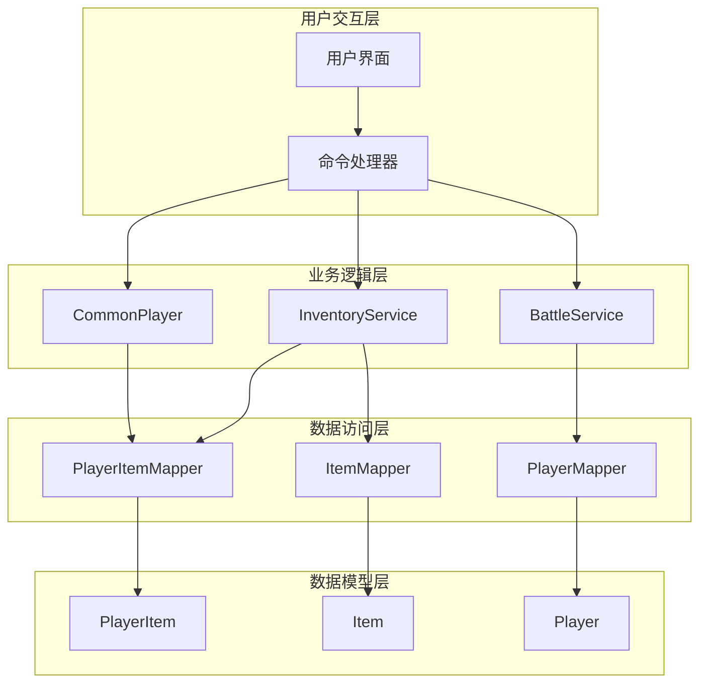
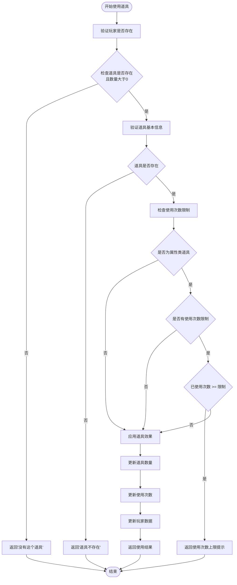
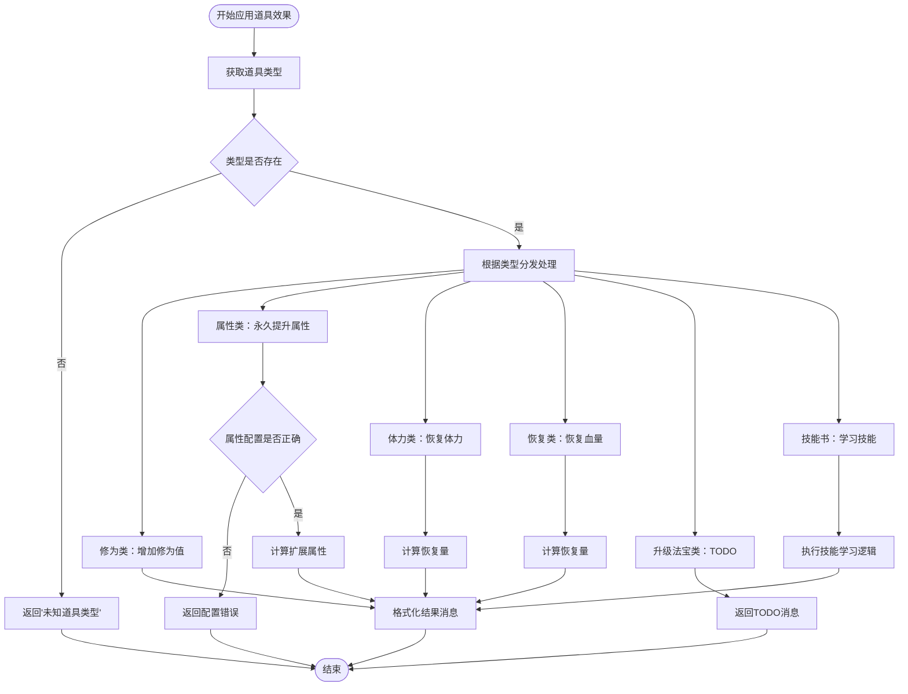
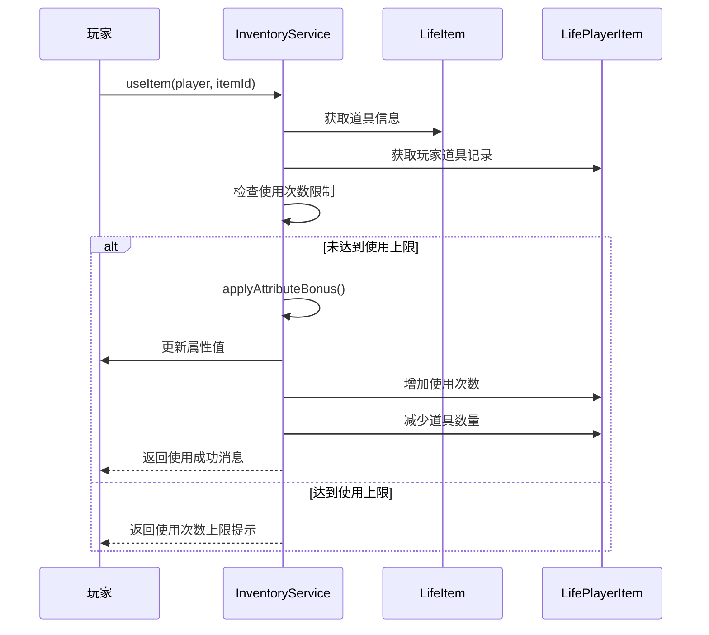
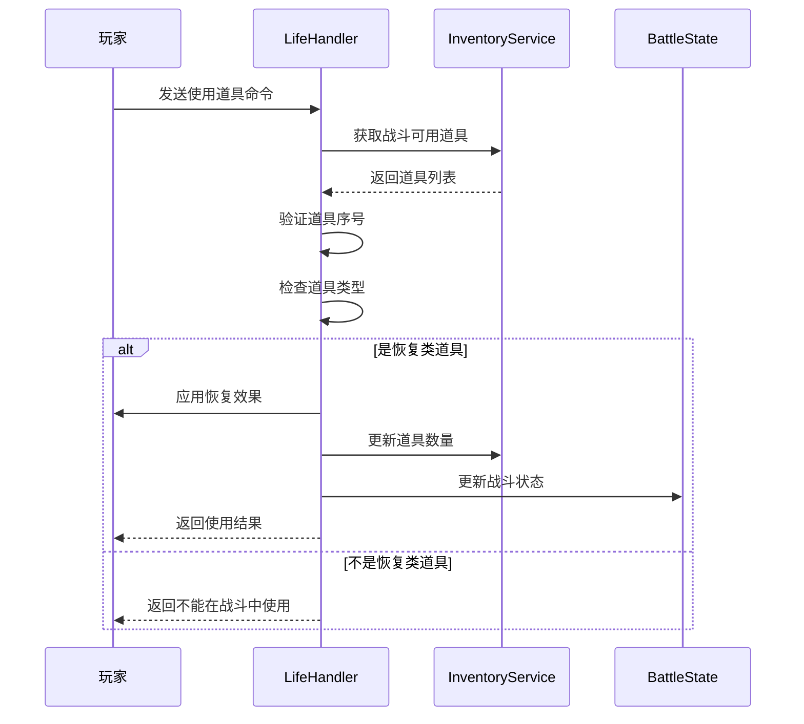
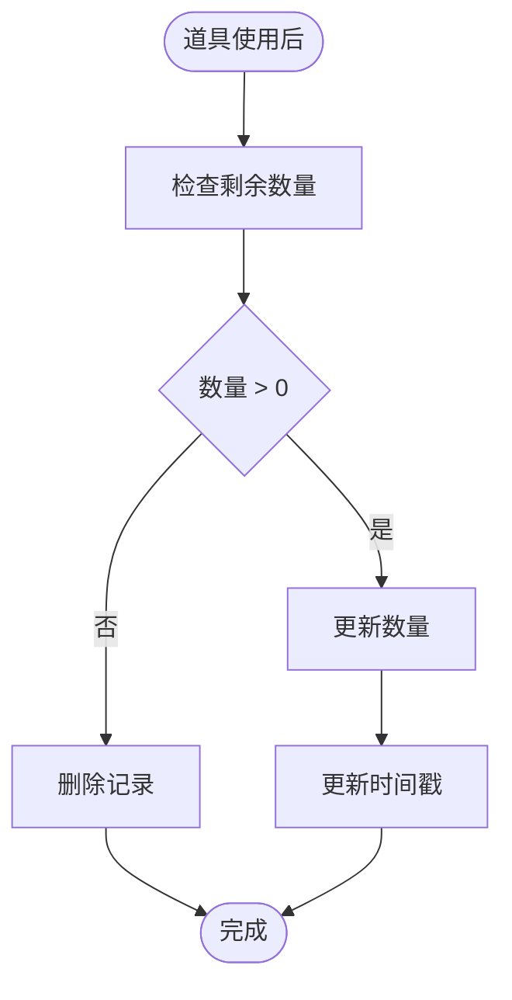
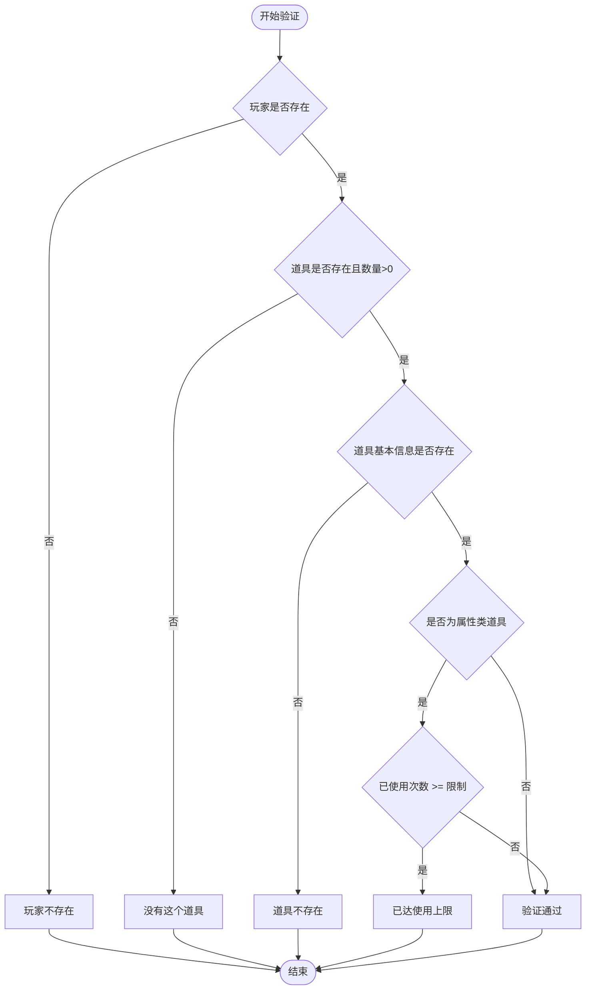

# 道具使用机制

<cite>
**本文档引用的文件**
- [InventoryServiceImpl.java](file://Life/src/main/java/com/bot/life/service/impl/InventoryServiceImpl.java)
- [CommonPlayer.java](file://Game/src/main/java/com/bot/game/service/impl/CommonPlayer.java)
- [UseGoodsDTO.java](file://Game/src/main/java/com/bot/game/dto/UseGoodsDTO.java)
- [UseGoodsPrinter.java](file://Game/src/main/java/com/bot/game/chain/menu/UseGoodsPrinter.java)
- [LifeHandlerImpl.java](file://Life/src/main/java/com/bot/life/service/impl/LifeHandlerImpl.java)
- [ENItemType.java](file://Life/src/main/java/com/bot/life/enums/ENItemType.java)
- [ENGoodEffect.java](file://Game/src/main/java/com/bot/game/enums/ENGoodEffect.java)
- [BattleServiceImpl.java](file://Game/src/main/java/com/bot/game/service/impl/BattleServiceImpl.java)
</cite>

## 目录
1. [概述](#概述)
2. [系统架构](#系统架构)
3. [核心组件分析](#核心组件分析)
4. [道具使用流程详解](#道具使用流程详解)
5. [道具类型与效果](#道具类型与效果)
6. [战斗中道具使用](#战斗中道具使用)
7. [数据持久化机制](#数据持久化机制)
8. [错误处理与验证](#错误处理与验证)
9. [性能优化考虑](#性能优化考虑)
10. [总结](#总结)

## 概述

道具使用机制是游戏系统中的核心功能之一，负责管理玩家道具的获取、存储、验证和使用。该机制支持多种类型的道具，包括修为类、属性类、体力类、恢复类和技能书等，每种道具都有其特定的效果和使用规则。

## 系统架构

**图表来源**
- [InventoryServiceImpl.java](file://Life/src/main/java/com/bot/life/service/impl/InventoryServiceImpl.java#L25-L42)
- [CommonPlayer.java](file://Game/src/main/java/com/bot/game/service/impl/CommonPlayer.java#L32-L35)

## 核心组件分析

### InventoryService 接口

InventoryService 定义了道具管理的核心接口，包含以下关键方法：

| 方法名 | 参数 | 返回值 | 功能描述 |
|--------|------|--------|----------|
| useItem | LifePlayer, Long | String | 使用指定道具并返回结果 |
| canUseItem | LifePlayer, Long | boolean | 检查是否可以使用指定道具 |
| getPlayerItems | LifePlayer | List<LifePlayerItem> | 获取玩家所有道具 |
| addItem | Long, Long, Integer | boolean | 向玩家添加道具 |

### CommonPlayer 工具类

CommonPlayer 提供通用的玩家操作功能，包括道具使用后的数量更新和出售处理。

**章节来源**
- [InventoryServiceImpl.java](file://Life/src/main/java/com/bot/life/service/impl/InventoryServiceImpl.java#L76-L111)
- [CommonPlayer.java](file://Game/src/main/java/com/bot/game/service/impl/CommonPlayer.java#L183-L191)

## 道具使用流程详解

### useItem 方法完整执行流程

**图表来源**
- [InventoryServiceImpl.java](file://Life/src/main/java/com/bot/life/service/impl/InventoryServiceImpl.java#L76-L111)

### applyItemEffect 方法处理流程

**图表来源**
- [InventoryServiceImpl.java](file://Life/src/main/java/com/bot/life/service/impl/InventoryServiceImpl.java#L174-L220)

**章节来源**
- [InventoryServiceImpl.java](file://Life/src/main/java/com/bot/life/service/impl/InventoryServiceImpl.java#L76-L111)
- [InventoryServiceImpl.java](file://Life/src/main/java/com/bot/life/service/impl/InventoryServiceImpl.java#L174-L220)

## 道具类型与效果

### 道具类型枚举

| 类型代码 | 类型名称 | 效果描述 | 使用限制 |
|----------|----------|----------|----------|
| 1 | 修为类 | 增加玩家修为值 | 无限制 |
| 2 | 属性类 | 永久提升玩家属性（速度、体质、灵力、力量） | 可设置最大使用次数 |
| 3 | 体力类 | 恢复玩家体力值 | 无限制 |
| 4 | 升级法宝类 | 提升法宝熟练度 | 开发中 |
| 5 | 恢复类 | 恢复玩家血量值 | 无限制 |
| 6 | 技能书 | 学习新技能 | 需满足属性和等级要求 |

### 属性类道具特殊处理

属性类道具具有独特的使用次数限制机制：

**图表来源**
- [InventoryServiceImpl.java](file://Life/src/main/java/com/bot/life/service/impl/InventoryServiceImpl.java#L89-L94)
- [InventoryServiceImpl.java](file://Life/src/main/java/com/bot/life/service/impl/InventoryServiceImpl.java#L188-L194)

**章节来源**
- [ENItemType.java](file://Life/src/main/java/com/bot/life/enums/ENItemType.java#L8-L13)
- [InventoryServiceImpl.java](file://Life/src/main/java/com/bot/life/service/impl/InventoryServiceImpl.java#L188-L194)

## 战斗中道具使用

### 战斗道具使用流程

战斗中的道具使用受到严格限制，只有恢复类道具可以在战斗中使用：

**图表来源**
- [LifeHandlerImpl.java](file://Life/src/main/java/com/bot/life/service/impl/LifeHandlerImpl.java#L1359-L1412)

### 战斗道具限制

| 限制条件 | 具体规则 | 实现位置 |
|----------|----------|----------|
| 类型限制 | 只有恢复类道具可在战斗中使用 | [LifeHandlerImpl.java](file://Life/src/main/java/com/bot/life/service/impl/LifeHandlerImpl.java#L1388-L1389) |
| 可用性标记 | 道具需设置can_use_in_battle=1 | 数据库字段 |
| 战斗状态检查 | 必须处于战斗状态才能使用 | [LifeHandlerImpl.java](file://Life/src/main/java/com/bot/life/service/impl/LifeHandlerImpl.java#L1328-L1357) |

**章节来源**
- [LifeHandlerImpl.java](file://Life/src/main/java/com/bot/life/service/impl/LifeHandlerImpl.java#L1359-L1412)

## 数据持久化机制

### 道具数量更新流程

**图表来源**
- [CommonPlayer.java](file://Game/src/main/java/com/bot/game/service/impl/CommonPlayer.java#L183-L191)

### 数据一致性保证

系统通过以下机制确保数据一致性：

1. **原子性操作**：使用数据库事务保证道具数量更新的原子性
2. **并发控制**：通过乐观锁防止并发修改导致的数据不一致
3. **缓存同步**：及时更新内存缓存以反映最新的道具状态

**章节来源**
- [CommonPlayer.java](file://Game/src/main/java/com/bot/game/service/impl/CommonPlayer.java#L183-L191)

## 错误处理与验证

### 道具使用验证流程

**图表来源**
- [InventoryServiceImpl.java](file://Life/src/main/java/com/bot/life/service/impl/InventoryServiceImpl.java#L78-L94)

### 异常处理策略

| 异常类型 | 处理方式 | 用户反馈 |
|----------|----------|----------|
| 玩家不存在 | 抛出BotException | "玩家信息异常，请重新登录" |
| 道具不存在 | 返回错误消息 | "道具不存在，请检查输入" |
| 数量不足 | 返回错误消息 | "你没有这个道具！" |
| 使用次数超限 | 返回限制消息 | "已达使用上限，无法继续使用" |
| 属性配置错误 | 返回错误消息 | "道具配置错误，无法使用" |

**章节来源**
- [InventoryServiceImpl.java](file://Life/src/main/java/com/bot/life/service/impl/InventoryServiceImpl.java#L78-L94)

## 性能优化考虑

### 查询优化策略

1. **索引优化**：在玩家ID和道具ID上建立复合索引
2. **缓存机制**：缓存常用道具信息和玩家道具列表
3. **批量操作**：对多个道具操作进行批量处理

### 内存管理

- **对象池**：重用频繁创建的对象
- **弱引用**：对临时数据使用弱引用避免内存泄漏
- **及时清理**：定期清理过期的缓存数据

## 总结

道具使用机制是一个复杂而精密的系统，涉及多个层次的协作。从用户交互到数据持久化，每个环节都需要精确控制以确保系统的稳定性和用户体验。

### 关键特性

1. **多样化道具类型**：支持修为、属性、体力、恢复、技能书等多种类型
2. **严格的使用验证**：多层次的验证机制确保数据完整性
3. **灵活的使用限制**：支持使用次数限制等个性化规则
4. **战斗中特殊处理**：针对战斗场景的特殊需求进行了优化
5. **完善的错误处理**：提供详细的错误信息和用户指导

### 设计优势

- **模块化设计**：清晰的职责分离便于维护和扩展
- **可扩展性**：易于添加新的道具类型和效果
- **性能优化**：通过缓存和索引优化提升响应速度
- **数据安全**：多重验证机制保障数据安全

该机制为游戏提供了丰富的道具系统，增强了游戏的策略性和趣味性，同时也为未来的功能扩展奠定了坚实的基础。