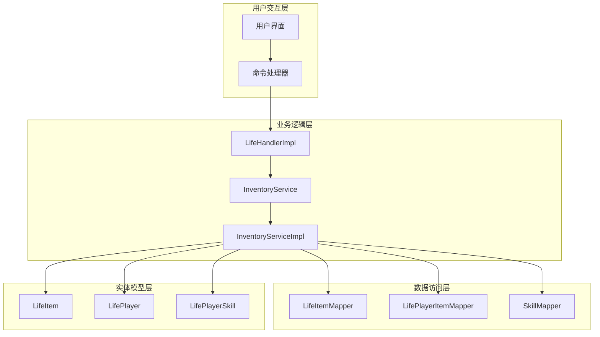
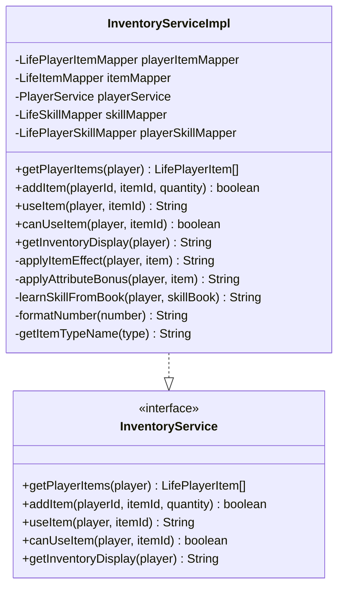
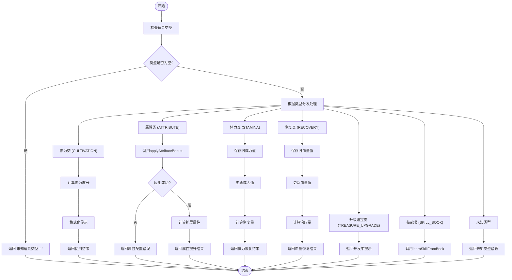
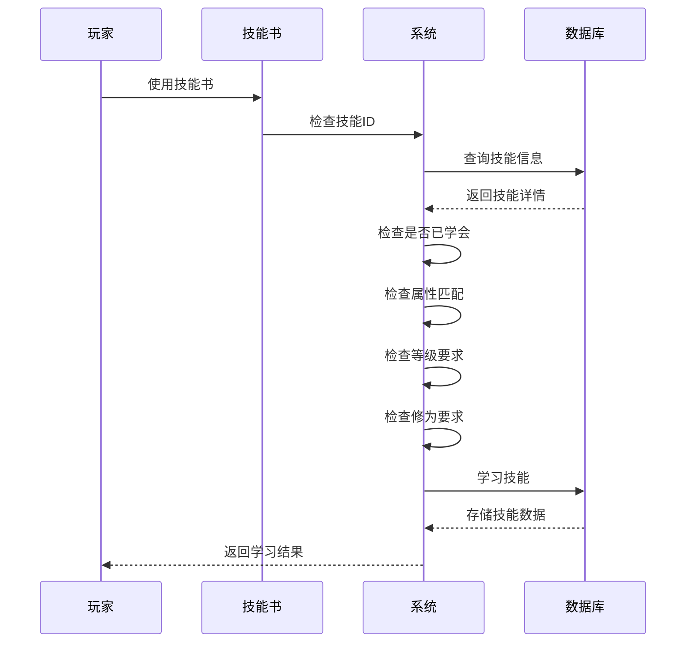
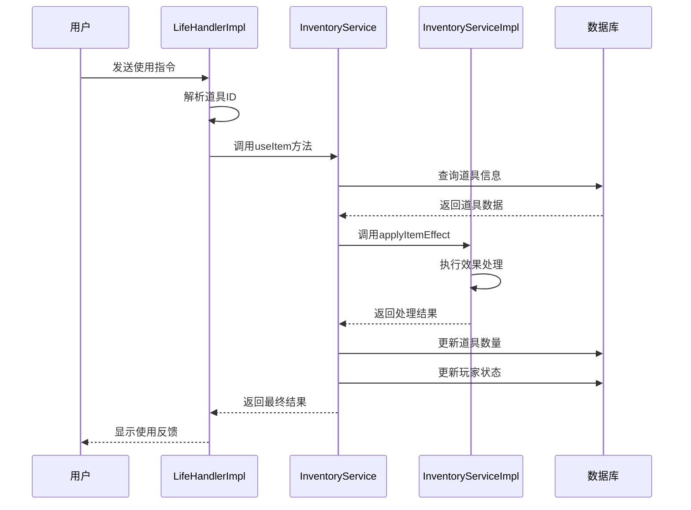

# 道具效果应用机制

<cite>
**本文档引用的文件**
- [InventoryServiceImpl.java](file://Life/src/main/java/com/bot/life/service/impl/InventoryServiceImpl.java)
- [ENItemType.java](file://Life/src/main/java/com/bot/life/enums/ENItemType.java)
- [LifeItem.java](file://Life/src/main/java/com/bot/life/dao/entity/LifeItem.java)
- [LifePlayer.java](file://Life/src/main/java/com/bot/life/dao/entity/LifePlayer.java)
- [InventoryService.java](file://Life/src/main/java/com/bot/life/service/InventoryService.java)
- [LifeHandlerImpl.java](file://Life/src/main/java/com/bot/life/service/impl/LifeHandlerImpl.java)
</cite>

## 目录
1. [简介](#简介)
2. [系统架构概览](#系统架构概览)
3. [核心组件分析](#核心组件分析)
4. [applyItemEffect方法详解](#applyitemeffect方法详解)
5. [道具类型分类与处理](#道具类型分类与处理)
6. [异常处理机制](#异常处理机制)
7. [使用示例与最佳实践](#使用示例与最佳实践)
8. [性能优化考虑](#性能优化考虑)
9. [故障排除指南](#故障排除指南)
10. [总结](#总结)

## 简介

道具效果应用机制是《浮生卷》游戏系统中的核心功能模块，负责处理玩家使用各种类型道具时的效果应用。该机制通过`applyItemEffect`方法实现了对不同类型道具的统一管理和差异化处理，确保游戏体验的流畅性和一致性。

本文档将深入解析`applyItemEffect`方法的实现逻辑，详细说明其如何根据道具类型（ENItemType）进行效果分发处理，并提供完整的代码示例和异常处理机制说明。

## 系统架构概览

道具效果应用机制采用分层架构设计，主要包含以下层次：



**图表来源**
- [InventoryServiceImpl.java](file://Life/src/main/java/com/bot/life/service/impl/InventoryServiceImpl.java#L173-L220)
- [LifeHandlerImpl.java](file://Life/src/main/java/com/bot/life/service/impl/LifeHandlerImpl.java#L594-L600)

## 核心组件分析

### InventoryServiceImpl类

`InventoryServiceImpl`是道具效果应用的核心实现类，包含了所有道具处理逻辑：



**图表来源**
- [InventoryServiceImpl.java](file://Life/src/main/java/com/bot/life/service/impl/InventoryServiceImpl.java#L25-L42)
- [InventoryService.java](file://Life/src/main/java/com/bot/life/service/InventoryService.java#L12-L52)

**章节来源**
- [InventoryServiceImpl.java](file://Life/src/main/java/com/bot/life/service/impl/InventoryServiceImpl.java#L1-L339)

### ENItemType枚举

道具类型定义了六种不同的道具效果类别：

| 类型 | 编码 | 描述 | 处理方式 |
|------|------|------|----------|
| CULTIVATION | 1 | 修为类 | 增加玩家修为值，格式化显示 |
| ATTRIBUTE | 2 | 属性类 | 永久提升基础属性（速度、体质、灵力、力量） |
| STAMINA | 3 | 体力类 | 恢复体力值，计算实际恢复量 |
| TREASURE_UPGRADE | 4 | 升级法宝类 | 法宝熟练度功能开发中 |
| RECOVERY | 5 | 恢复类 | 恢复血量，计算实际治疗量 |
| SKILL_BOOK | 6 | 技能书 | 触发learnSkillFromBook学习流程 |

**章节来源**
- [ENItemType.java](file://Life/src/main/java/com/bot/life/enums/ENItemType.java#L6-L13)

## applyItemEffect方法详解

`applyItemEffect`方法是道具效果应用机制的核心，它根据道具类型执行相应的效果处理逻辑。

### 方法签名与参数

```java
private String applyItemEffect(LifePlayer player, LifeItem item)
```

**参数说明：**
- `player`: 玩家对象，包含玩家的所有属性和状态信息
- `item`: 道具对象，包含道具的基本信息和效果参数

### 执行流程图



**图表来源**
- [InventoryServiceImpl.java](file://Life/src/main/java/com/bot/life/service/impl/InventoryServiceImpl.java#L173-L220)

**章节来源**
- [InventoryServiceImpl.java](file://Life/src/main/java/com/bot/life/service/impl/InventoryServiceImpl.java#L173-L220)

## 道具类型分类与处理

### 修为类道具 (CULTIVATION)

修为类道具用于增加玩家的修炼资源，是最常见的道具类型之一。

**处理逻辑：**
1. 直接增加玩家的修为值
2. 格式化显示当前修为值
3. 返回详细的使用结果

**代码路径：** [`applyItemEffect`方法第181-185行](file://Life/src/main/java/com/bot/life/service/impl/InventoryServiceImpl.java#L181-L185)

**返回消息格式：**
```
『使用成功！』

服用了『{道具名称}』
获得修为：{效果值}
当前修为：{格式化后的修为值}
```

### 属性类道具 (ATTRIBUTE)

属性类道具通过永久提升玩家的基础属性来增强战斗力。

**处理流程：**
1. 调用`applyAttributeBonus`方法确定具体提升的属性
2. 检查属性配置是否正确
3. 计算扩展属性以反映属性变化
4. 返回属性提升结果

**支持的属性：**
- `speed`: 速度
- `constitution`: 体质  
- `spirit_power`: 灵力
- `strength`: 力量

**代码路径：** [`applyItemEffect`方法第188-195行](file://Life/src/main/java/com/bot/life/service/impl/InventoryServiceImpl.java#L188-L195)

**返回消息格式：**
```
『使用成功！』

服用了『{道具名称}』
{属性名称}永久增加：{效果值}
```

**章节来源**
- [InventoryServiceImpl.java](file://Life/src/main/java/com/bot/life/service/impl/InventoryServiceImpl.java#L187-L195)

### 体力类道具 (STAMINA)

体力类道具用于恢复玩家的体力值，是战斗系统的重要组成部分。

**处理逻辑：**
1. 保存使用前的体力值
2. 更新当前体力值，不超过最大值
3. 计算实际恢复的体力量
4. 返回详细的恢复信息

**代码路径：** [`applyItemEffect`方法第197-202行](file://Life/src/main/java/com/bot/life/service/impl/InventoryServiceImpl.java#L197-L202)

**返回消息格式：**
```
『使用成功！』

服用了『{道具名称}』
恢复体力：{恢复量}
当前体力：{当前体力}/{最大体力}
```

**章节来源**
- [InventoryServiceImpl.java](file://Life/src/main/java/com/bot/life/service/impl/InventoryServiceImpl.java#L197-L202)

### 恢复类道具 (RECOVERY)

恢复类道具用于治疗玩家的血量，是生存系统的关键要素。

**处理逻辑：**
1. 保存使用前的血量值
2. 更新当前血量值，不超过最大值
3. 计算实际治疗的血量量
4. 返回详细的治疗信息

**代码路径：** [`applyItemEffect`方法第204-209行](file://Life/src/main/java/com/bot/life/service/impl/InventoryServiceImpl.java#L204-L209)

**返回消息格式：**
```
『使用成功！』

服用了『{道具名称}』
恢复血量：{治疗量}
当前血量：{当前血量}/{最大血量}
```

**章节来源**
- [InventoryServiceImpl.java](file://Life/src/main/java/com/bot/life/service/impl/InventoryServiceImpl.java#L204-L209)

### 技能书类道具 (SKILL_BOOK)

技能书类道具触发复杂的技能学习流程，涉及多个条件检查。

**处理流程：**



**图表来源**
- [InventoryServiceImpl.java](file://Life/src/main/java/com/bot/life/service/impl/InventoryServiceImpl.java#L269-L324)

**检查项目：**
1. 技能ID是否存在
2. 是否已学会该技能
3. 属性是否匹配（相同属性或无属性）
4. 等级是否达到要求
5. 修为是否满足要求

**成功消息格式：**
```
『学习成功！』

成功学会了技能『{技能名称}』！

技能描述：{技能描述}

可在技能界面查看详情。
```

**失败消息格式：**
```
『学习失败！』

{具体的失败原因}
```

**章节来源**
- [InventoryServiceImpl.java](file://Life/src/main/java/com/bot/life/service/impl/InventoryServiceImpl.java#L269-L324)

## 异常处理机制

道具效果应用机制实现了完善的异常处理机制，确保系统的稳定性和用户体验。

### 类型验证异常

当道具类型无效或不存在时，系统返回明确的错误信息：

```java
// 代码路径：[applyItemEffect方法第175-177行](file://Life/src/main/java/com/bot/life/service/impl/InventoryServiceImpl.java#L175-L177)
ENItemType itemType = ENItemType.getByCode(item.getType());
if (itemType == null) {
    return "未知道具类型！";
}
```

### 属性配置异常

对于属性类道具，系统检查属性配置的有效性：

```java
// 代码路径：[applyAttributeBonus方法第232-235行](file://Life/src/main/java/com/bot/life/service/impl/InventoryServiceImpl.java#L232-L235)
String effectAttr = item.getEffectAttribute();
if (effectAttr == null || effectAttr.trim().isEmpty()) {
    return null;
}
```

### 技能学习异常

技能书学习过程中的异常处理包括：

```java
// 代码路径：[learnSkillFromBook方法第321-323行](file://Life/src/main/java/com/bot/life/service/impl/InventoryServiceImpl.java#L321-L323)
try {
    // 技能学习逻辑
} catch (Exception e) {
    e.printStackTrace();
    return "『学习失败！』\n\n技能学习过程中出现错误！";
}
```

### 使用次数限制

属性类道具支持使用次数限制，防止过度使用：

```java
// 代码路径：[useItem方法第90-94行](file://Life/src/main/java/com/bot/life/service/impl/InventoryServiceImpl.java#L90-L94)
if (item.getType() == ENItemType.ATTRIBUTE.getCode() && item.getMaxUseCount() > 0) {
    if (playerItem.getUsedCount() >= item.getMaxUseCount()) {
        return String.format("『使用失败』\n\n『%s』已达使用上限！\n已使用：%d/%d次", 
            item.getName(), playerItem.getUsedCount(), item.getMaxUseCount());
    }
}
```

**章节来源**
- [InventoryServiceImpl.java](file://Life/src/main/java/com/bot/life/service/impl/InventoryServiceImpl.java#L175-L177)
- [InventoryServiceImpl.java](file://Life/src/main/java/com/bot/life/service/impl/InventoryServiceImpl.java#L232-L235)
- [InventoryServiceImpl.java](file://Life/src/main/java/com/bot/life/service/impl/InventoryServiceImpl.java#L321-L323)

## 使用示例与最佳实践

### 基本使用流程

玩家使用道具的标准流程如下：



**图表来源**
- [LifeHandlerImpl.java](file://Life/src/main/java/com/bot/life/service/impl/LifeHandlerImpl.java#L594-L600)
- [InventoryServiceImpl.java](file://Life/src/main/java/com/bot/life/service/impl/InventoryServiceImpl.java#L77-L111)

### 推荐的最佳实践

1. **道具类型设计原则**
   - 每种道具类型应有明确的用途和效果范围
   - 属性类道具应设置合理的使用次数限制
   - 技能书应与玩家的修炼阶段相匹配

2. **用户体验优化**
   - 提供清晰的效果描述和使用说明
   - 及时反馈道具使用结果
   - 对于复杂操作（如技能学习）提供详细的指导信息

3. **性能优化建议**
   - 合理缓存道具类型枚举信息
   - 对频繁查询的数据进行适当的索引优化
   - 在批量操作时考虑事务管理

**章节来源**
- [LifeHandlerImpl.java](file://Life/src/main/java/com/bot/life/service/impl/LifeHandlerImpl.java#L594-L600)
- [InventoryServiceImpl.java](file://Life/src/main/java/com/bot/life/service/impl/InventoryServiceImpl.java#L77-L111)

## 性能优化考虑

### 数据访问优化

1. **批量查询优化**
   - 使用`selectByPlayerId`方法一次性获取玩家所有道具
   - 避免在循环中进行数据库查询

2. **缓存策略**
   - 缓存ENItemType枚举信息，避免重复查找
   - 对常用的道具信息进行内存缓存

3. **索引优化**
   - 在`player_id`和`item_id`字段上建立复合索引
   - 对`type`字段建立索引以加速类型查询

### 内存使用优化

1. **对象复用**
   - 重用字符串构建器对象
   - 避免在循环中创建大量临时对象

2. **延迟加载**
   - 对于非关键信息采用延迟加载策略
   - 仅在需要时查询技能详细信息

### 并发处理

1. **线程安全**
   - 确保玩家状态更新的原子性
   - 使用适当的锁机制保护共享资源

2. **事务管理**
   - 将道具使用作为一个事务处理
   - 确保数据一致性

## 故障排除指南

### 常见问题及解决方案

1. **道具类型识别失败**
   - **症状**: 返回"未知道具类型！"
   - **原因**: 道具类型字段值不正确或超出枚举范围
   - **解决**: 检查数据库中道具类型的编码值

2. **属性类道具配置错误**
   - **症状**: 返回"属性配置错误！"
   - **原因**: `effect_attribute`字段为空或值不正确
   - **解决**: 验证道具配置，确保属性名称正确

3. **技能书学习失败**
   - **症状**: 技能学习过程中出现错误
   - **原因**: 可能是数据库连接问题或权限不足
   - **解决**: 检查数据库连接状态和相关权限设置

4. **使用次数超限**
   - **症状**: 返回使用次数限制错误
   - **原因**: 道具已经达到最大使用次数
   - **解决**: 设计合理的道具使用策略，避免过度依赖单一道具

### 调试技巧

1. **日志记录**
   - 在关键节点添加详细的日志记录
   - 记录道具使用前后的状态变化

2. **单元测试**
   - 为每个道具类型编写独立的测试用例
   - 测试边界条件和异常情况

3. **监控指标**
   - 监控道具使用频率和成功率
   - 跟踪性能瓶颈和资源消耗

## 总结

道具效果应用机制是《浮生卷》游戏系统中的重要组成部分，通过`applyItemEffect`方法实现了对不同类型道具的统一管理和差异化处理。该机制具有以下特点：

1. **模块化设计**: 采用分层架构，职责清晰，易于维护和扩展
2. **类型安全**: 使用枚举类型确保道具类型的正确性和一致性
3. **异常处理**: 完善的异常处理机制保证系统稳定性
4. **用户体验**: 提供详细的使用反馈和清晰的操作指导
5. **性能优化**: 考虑了数据访问、内存使用和并发处理的优化

通过深入理解`applyItemEffect`方法的实现逻辑，开发者可以更好地维护和扩展道具系统，为玩家提供更加丰富和流畅的游戏体验。该机制的设计理念和实现方式也为其他类似系统提供了有价值的参考。