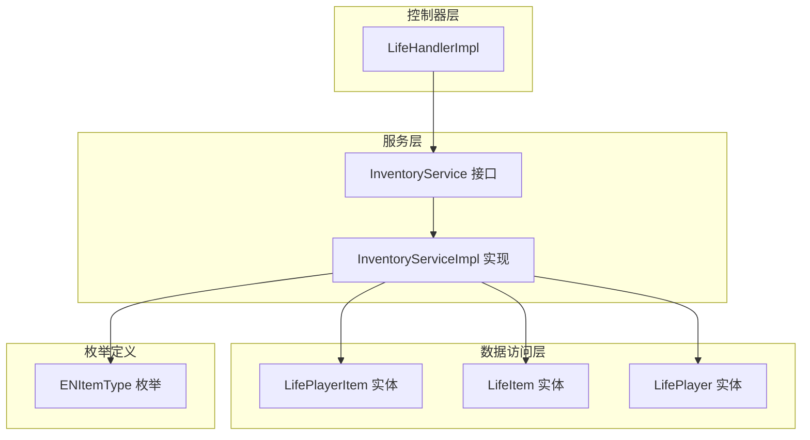
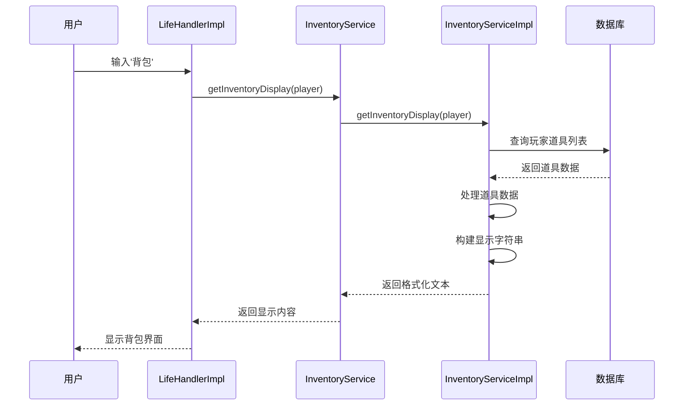
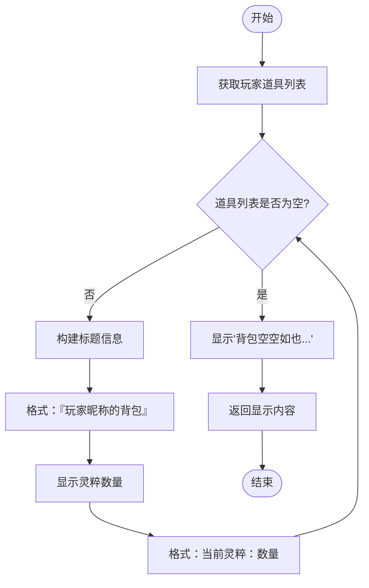
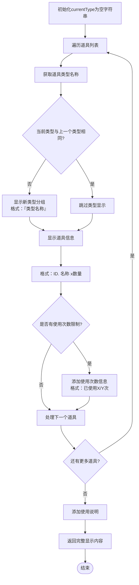
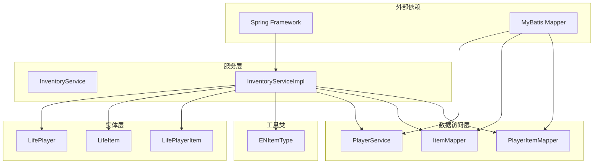

# 背包展示功能

<cite>
**本文档引用的文件**
- [InventoryService.java](file://Life/src/main/java/com/bot/life/service/InventoryService.java)
- [InventoryServiceImpl.java](file://Life/src/main/java/com/bot/life/service/impl/InventoryServiceImpl.java)
- [ENItemType.java](file://Life/src/main/java/com/bot/life/enums/ENItemType.java)
- [LifePlayer.java](file://Life/src/main/java/com/bot/life/dao/entity/LifePlayer.java)
- [LifeItem.java](file://Life/src/main/java/com/bot/life/dao/entity/LifeItem.java)
- [LifePlayerItem.java](file://Life/src/main/java/com/bot/life/dao/entity/LifePlayerItem.java)
- [LifeHandlerImpl.java](file://Life/src/main/java/com/bot/life/service/impl/LifeHandlerImpl.java)
</cite>

## 目录
1. [简介](#简介)
2. [项目结构](#项目结构)
3. [核心组件](#核心组件)
4. [架构概览](#架构概览)
5. [详细组件分析](#详细组件分析)
6. [依赖关系分析](#依赖关系分析)
7. [性能考虑](#性能考虑)
8. [故障排除指南](#故障排除指南)
9. [结论](#结论)

## 简介

背包展示功能是浮生卷游戏系统中的核心组件之一，负责向玩家展示其拥有的所有道具信息。该功能通过`getInventoryDisplay`方法实现，该方法构建了一个格式化的文本界面，包含玩家昵称、灵粹数量、道具分类显示以及使用说明等关键信息。

本文档深入解析了`getInventoryDisplay`方法的实现逻辑，包括标题信息构建、道具分组显示、格式化输出机制以及用户交互引导等功能特性。

## 项目结构

背包展示功能主要分布在以下模块中：

**图表来源**
- [InventoryService.java](file://Life/src/main/java/com/bot/life/service/InventoryService.java#L1-L52)
- [InventoryServiceImpl.java](file://Life/src/main/java/com/bot/life/service/impl/InventoryServiceImpl.java#L1-L339)
- [ENItemType.java](file://Life/src/main/java/com/bot/life/enums/ENItemType.java#L1-L40)

**章节来源**
- [InventoryService.java](file://Life/src/main/java/com/bot/life/service/InventoryService.java#L1-L52)
- [InventoryServiceImpl.java](file://Life/src/main/java/com/bot/life/service/impl/InventoryServiceImpl.java#L1-L339)

## 核心组件

### InventoryService 接口
定义了背包管理的核心服务接口，其中`getInventoryDisplay`方法是背包展示功能的主要入口点。

### InventoryServiceImpl 实现类
实现了`InventoryService`接口，包含了`getInventoryDisplay`方法的具体逻辑，负责从数据库获取玩家道具信息并格式化输出。

### 数据模型
- **LifePlayer**: 玩家实体，包含玩家基本信息和灵粹数量
- **LifeItem**: 道具实体，定义了道具的基本属性和类型
- **LifePlayerItem**: 玩家道具关联实体，包含玩家拥有的具体道具数量和使用次数

### ENItemType 枚举
定义了道具类型的分类体系，用于将道具按类型进行分组显示。

**章节来源**
- [InventoryService.java](file://Life/src/main/java/com/bot/life/service/InventoryService.java#L12-L52)
- [InventoryServiceImpl.java](file://Life/src/main/java/com/bot/life/service/impl/InventoryServiceImpl.java#L25-L46)
- [ENItemType.java](file://Life/src/main/java/com/bot/life/enums/ENItemType.java#L7-L13)

## 架构概览

背包展示功能采用分层架构设计，遵循DDD（领域驱动设计）原则：

**图表来源**
- [LifeHandlerImpl.java](file://Life/src/main/java/com/bot/life/service/impl/LifeHandlerImpl.java#L551-L553)
- [InventoryServiceImpl.java](file://Life/src/main/java/com/bot/life/service/impl/InventoryServiceImpl.java#L134-L171)

## 详细组件分析

### getInventoryDisplay 方法核心逻辑

`getInventoryDisplay`方法是背包展示功能的核心，其实现包含以下关键步骤：

#### 1. 标题信息构建

**图表来源**
- [InventoryServiceImpl.java](file://Life/src/main/java/com/bot/life/service/impl/InventoryServiceImpl.java#L138-L140)
- [InventoryServiceImpl.java](file://Life/src/main/java/com/bot/life/service/impl/InventoryServiceImpl.java#L142-L144)

#### 2. 道具分组显示机制
方法使用`StringBuilder`逐行构建显示内容，实现了智能的道具分组逻辑：

**图表来源**
- [InventoryServiceImpl.java](file://Life/src/main/java/com/bot/life/service/impl/InventoryServiceImpl.java#L147-L166)

#### 3. 特殊道具处理
对于具有使用次数限制的道具（如属性类道具），系统会显示详细的使用统计信息：

| 道具类型 | 使用次数显示格式 | 特殊说明 |
|---------|-----------------|----------|
| 属性类道具 | （已使用X/Y次） | X为已使用次数，Y为最大使用次数 |
| 其他类型道具 | 无额外信息 | 只显示基础信息 |

#### 4. 用户交互引导
在背包显示的末尾，系统提供明确的使用说明：
- 引导文案："发送『使用+道具ID』使用道具"
- 示例说明："例如：使用1"

**章节来源**
- [InventoryServiceImpl.java](file://Life/src/main/java/com/bot/life/service/impl/InventoryServiceImpl.java#L134-L171)

### 数据模型分析

#### LifePlayer 实体
玩家实体包含了背包展示所需的所有基本信息：

| 字段名 | 类型 | 描述 | 在展示中的用途 |
|--------|------|------|---------------|
| nickname | String | 玩家昵称 | 构建标题信息 |
| spirit | Long | 灵粹数量 | 显示玩家财富 |

#### LifeItem 实体
道具实体定义了道具的基本属性：

| 字段名 | 类型 | 描述 | 在展示中的用途 |
|--------|------|------|---------------|
| id | Long | 道具ID | 作为道具唯一标识 |
| name | String | 道具名称 | 显示道具名称 |
| type | Integer | 道具类型 | 用于分组显示 |
| maxUseCount | Integer | 最大使用次数 | 显示使用限制 |

#### LifePlayerItem 实体
玩家道具关联实体连接玩家和道具：

| 字段名 | 类型 | 描述 | 在展示中的用途 |
|--------|------|------|---------------|
| quantity | Integer | 道具数量 | 显示拥有数量 |
| usedCount | Integer | 已使用次数 | 显示使用统计 |

**章节来源**
- [LifePlayer.java](file://Life/src/main/java/com/bot/life/dao/entity/LifePlayer.java#L12-L43)
- [LifeItem.java](file://Life/src/main/java/com/bot/life/dao/entity/LifeItem.java#L11-L23)
- [LifePlayerItem.java](file://Life/src/main/java/com/bot/life/dao/entity/LifePlayerItem.java#L11-L22)

### ENItemType 枚举分析

道具类型枚举提供了标准化的类型转换机制：

| 类型代码 | 类型描述 | 对应的英文描述 |
|---------|----------|---------------|
| 1 | 修为类 | CULTIVATION |
| 2 | 属性类 | ATTRIBUTE |
| 3 | 体力类 | STAMINA |
| 4 | 升级法宝类 | TREASURE_UPGRADE |
| 5 | 恢复类 | RECOVERY |
| 6 | 技能书 | SKILL_BOOK |

**章节来源**
- [ENItemType.java](file://Life/src/main/java/com/bot/life/enums/ENItemType.java#L8-L13)

## 依赖关系分析

背包展示功能的依赖关系体现了清晰的分层架构：

**图表来源**
- [InventoryServiceImpl.java](file://Life/src/main/java/com/bot/life/service/impl/InventoryServiceImpl.java#L28-L41)

**章节来源**
- [InventoryServiceImpl.java](file://Life/src/main/java/com/bot/life/service/impl/InventoryServiceImpl.java#L25-L41)

## 性能考虑

### 数据查询优化
- 使用批量查询获取玩家所有道具信息
- 避免N+1查询问题，通过关联查询一次性加载所需数据

### 内存使用优化
- 使用`StringBuilder`进行字符串拼接，避免频繁的字符串对象创建
- 智能分组机制减少重复的类型信息显示

### 缓存策略
虽然当前实现没有显式的缓存机制，但可以通过以下方式优化：
- 将玩家道具信息缓存在内存中
- 设置合理的缓存过期时间
- 实现缓存更新策略

## 故障排除指南

### 常见问题及解决方案

#### 1. 背包显示为空
**症状**: 显示"背包空空如也..."
**可能原因**: 
- 玩家尚未获得任何道具
- 数据库查询异常
- 玩家ID不正确

**解决方法**:
- 检查玩家是否已获得道具
- 验证数据库连接和查询逻辑
- 确认玩家ID的有效性

#### 2. 道具类型显示异常
**症状**: 道具类型显示为"未知类型"
**可能原因**:
- 道具类型代码超出枚举范围
- 数据库中存储了无效的类型值

**解决方法**:
- 检查数据库中道具类型的完整性
- 验证ENItemType枚举的定义

#### 3. 使用次数显示错误
**症状**: 使用次数显示不正确或缺失
**可能原因**:
- 道具的最大使用次数设置错误
- 已使用次数数据不准确

**解决方法**:
- 验证道具的最大使用次数设置
- 检查已使用次数的数据同步

**章节来源**
- [InventoryServiceImpl.java](file://Life/src/main/java/com/bot/life/service/impl/InventoryServiceImpl.java#L142-L144)
- [InventoryServiceImpl.java](file://Life/src/main/java/com/bot/life/service/impl/InventoryServiceImpl.java#L223-L226)

## 结论

背包展示功能通过`getInventoryDisplay`方法实现了高效、友好的玩家道具展示机制。该功能具有以下特点：

1. **结构化显示**: 通过智能分组和格式化输出，使玩家能够快速浏览和识别不同类型的道具
2. **信息丰富**: 不仅显示道具基本信息，还提供使用次数统计和操作指导
3. **用户体验优化**: 当背包为空时提供友好的提示，避免用户困惑
4. **扩展性强**: 基于枚举的类型系统便于添加新的道具类型
5. **性能良好**: 使用StringBuilder进行高效的字符串构建，支持大量道具的展示

该功能为浮生卷游戏的道具管理系统奠定了坚实的基础，为玩家提供了直观、便捷的道具管理体验。通过持续的优化和扩展，该功能将继续支持游戏的发展需求。