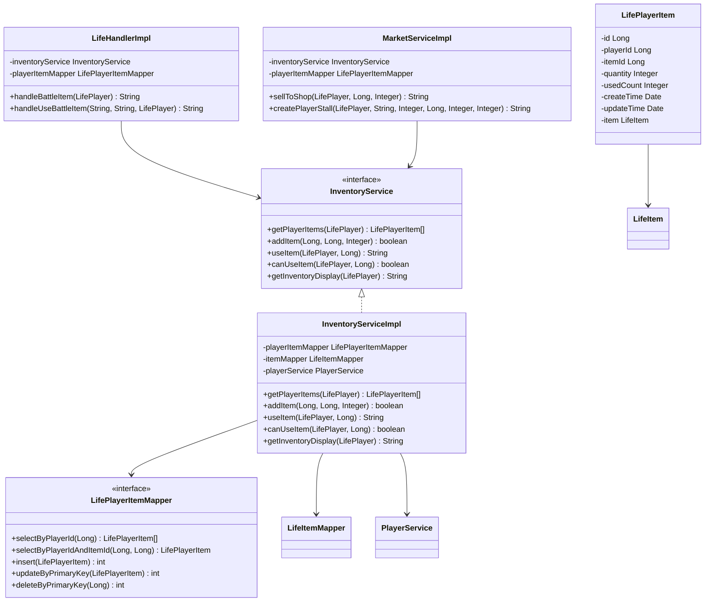
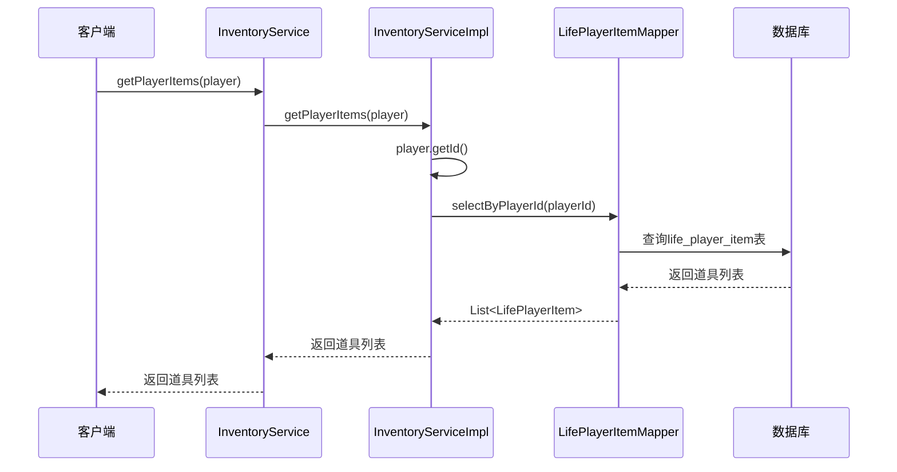
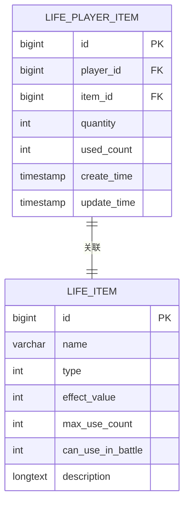
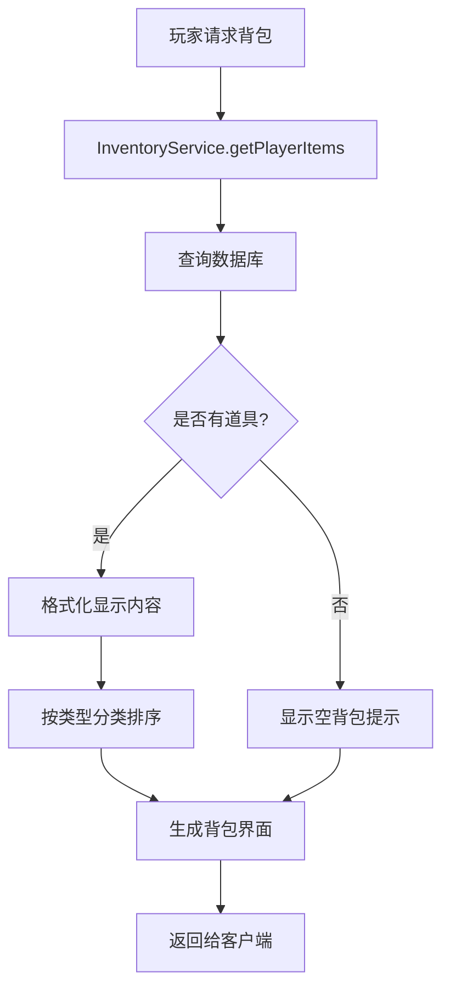
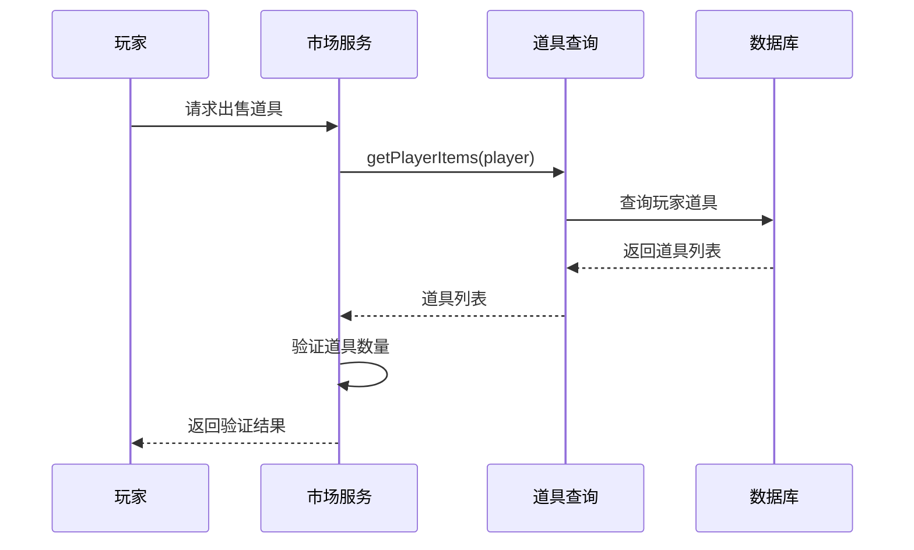
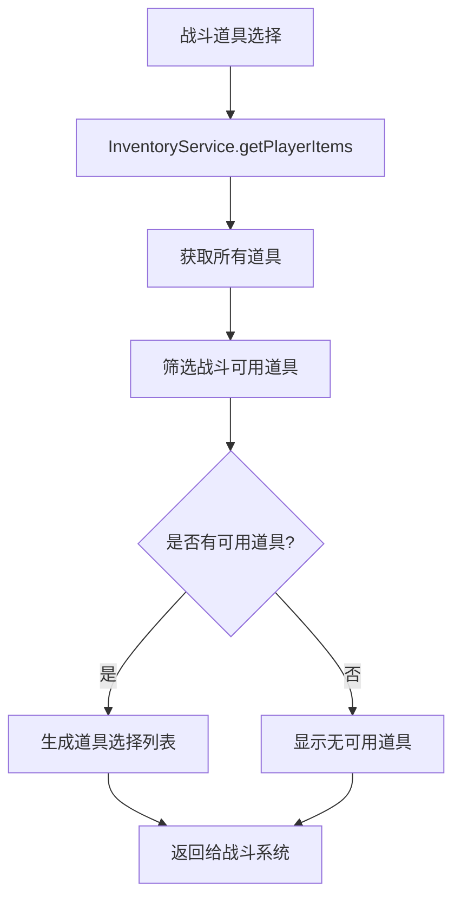

# 道具查询功能

<cite>
**本文档引用的文件**
- [InventoryServiceImpl.java](file://Life/src/main/java/com/bot/life/service/impl/InventoryServiceImpl.java)
- [InventoryService.java](file://Life/src/main/java/com/bot/life/service/InventoryService.java)
- [LifePlayerItem.java](file://Life/src/main/java/com/bot/life/dao/entity/LifePlayerItem.java)
- [LifePlayerItemMapper.java](file://Life/src/main/java/com/bot/life/dao/mapper/LifePlayerItemMapper.java)
- [LifePlayerItemMapper.xml](file://Life/src/main/resources/mapper/LifePlayerItemMapper.xml)
- [LifeHandlerImpl.java](file://Life/src/main/java/com/bot/life/service/impl/LifeHandlerImpl.java)
- [MarketServiceImpl.java](file://Life/src/main/java/com/bot\life\service\impl\MarketServiceImpl.java)
</cite>

## 目录
1. [功能概述](#功能概述)
2. [核心组件架构](#核心组件架构)
3. [getPlayerItems方法详解](#getplayeritems方法详解)
4. [数据结构分析](#数据结构分析)
5. [应用场景分析](#应用场景分析)
6. [实际调用示例](#实际调用示例)
7. [空列表返回值业务意义](#空列表返回值业务意义)
8. [性能优化考虑](#性能优化考虑)
9. [故障排除指南](#故障排除指南)
10. [总结](#总结)

## 功能概述

道具查询功能是浮生卷游戏系统中的核心组件之一，主要负责根据玩家信息查询其拥有的所有道具列表。该功能通过`getPlayerItems`方法实现，该方法接收`LifePlayer`对象作为参数，提取玩家ID作为查询条件，通过`playerItemMapper.selectByPlayerId`从数据库获取玩家的所有道具信息。

该功能在游戏的多个关键场景中发挥重要作用：
- **背包界面刷新**：实时展示玩家拥有的所有道具及其数量
- **交易验证**：在市场交易、摊位买卖等场景中验证玩家道具持有情况
- **任务检查**：验证玩家是否拥有完成特定任务所需的道具
- **战斗道具管理**：在战斗中提供可用道具列表

## 核心组件架构



**图表来源**
- [InventoryService.java](file://Life/src/main/java/com/bot/life/service/InventoryService.java#L12-L52)
- [InventoryServiceImpl.java](file://Life/src/main/java/com/bot/life/service/impl/InventoryServiceImpl.java#L25-L42)
- [LifePlayerItem.java](file://Life/src/main/java/com/bot/life/dao/entity/LifePlayerItem.java#L11-L23)
- [LifePlayerItemMapper.java](file://Life/src/main/java/com/bot/life/dao/mapper/LifePlayerItemMapper.java#L11-L42)

## getPlayerItems方法详解

### 方法签名与实现

`getPlayerItems`方法是道具查询功能的核心入口，位于`InventoryServiceImpl`类中：



**图表来源**
- [InventoryServiceImpl.java](file://Life/src/main/java/com/bot/life/service/impl/InventoryServiceImpl.java#L43-L46)
- [LifePlayerItemMapper.java](file://Life/src/main/java/com/bot/life/dao/mapper/LifePlayerItemMapper.java#L31)

### 参数处理流程

方法接收`LifePlayer`对象作为参数，执行以下处理步骤：

1. **参数验证**：确保传入的`player`对象不为空
2. **ID提取**：调用`player.getId()`获取玩家唯一标识符
3. **数据库查询**：通过`playerItemMapper.selectByPlayerId(playerId)`执行查询
4. **结果返回**：将查询结果直接返回给调用方

### 数据库查询机制

底层数据库查询通过MyBatis实现，具体SQL语句如下：

```sql
SELECT 
    pi.id, pi.player_id, pi.item_id, pi.quantity, pi.used_count, 
    pi.create_time, pi.update_time,
    i.id as item_id_pk, i.name as item_name, i.type as item_type, 
    i.effect_value as item_effect_value,
    i.max_use_count as item_max_use_count, i.can_use_in_battle as item_can_use_in_battle, 
    i.description as item_description
FROM life_player_item pi
LEFT JOIN life_item i ON pi.item_id = i.id
WHERE pi.player_id = #{playerId,jdbcType=BIGINT} AND pi.quantity > 0
ORDER BY i.type, i.id
```

**节来源**
- [LifePlayerItemMapper.xml](file://Life/src/main/resources/mapper/LifePlayerItemMapper.xml#L38-L47)

## 数据结构分析

### LifePlayerItem实体结构

`LifePlayerItem`是存储玩家道具信息的核心数据结构，包含以下字段：

| 字段名 | 类型 | 描述 | 业务含义 |
|--------|------|------|----------|
| id | Long | 主键ID | 道具记录的唯一标识 |
| playerId | Long | 玩家ID | 关联的玩家标识符 |
| itemId | Long | 道具ID | 对应的道具模板ID |
| quantity | Integer | 数量 | 玩家持有的道具数量 |
| usedCount | Integer | 使用次数 | 道具已被使用的次数 |
| createTime | Date | 创建时间 | 道具首次获得的时间 |
| updateTime | Date | 更新时间 | 道具信息最后修改时间 |

### 关联对象关系

`LifePlayerItem`与`LifeItem`存在一对一关联关系，通过`itemId`字段建立外键关系。这种设计允许在查询时一次性获取完整的道具信息，避免多次数据库访问。



**图表来源**
- [LifePlayerItem.java](file://Life/src/main/java/com/bot/life/dao/entity/LifePlayerItem.java#L12-L23)
- [LifePlayerItemMapper.xml](file://Life/src/main/resources/mapper/LifePlayerItemMapper.xml#L15-L25)

**节来源**
- [LifePlayerItem.java](file://Life/src/main/java/com/bot/life/dao/entity/LifePlayerItem.java#L11-L23)

## 应用场景分析

### 背包界面刷新

在游戏的背包系统中，`getPlayerItems`方法被频繁调用来刷新玩家的道具展示：



**图表来源**
- [InventoryServiceImpl.java](file://Life/src/main/java/com/bot/life/service/impl/InventoryServiceImpl.java#L134-L171)

### 交易验证场景

在市场交易和玩家摊位系统中，该方法用于验证玩家的道具持有情况：



**图表来源**
- [MarketServiceImpl.java](file://Life/src/main/java/com/bot\life\service\impl\MarketServiceImpl.java#L183-L218)

### 战斗道具管理

在战斗系统中，该方法用于筛选出可在战斗中使用的道具：



**图表来源**
- [LifeHandlerImpl.java](file://Life/src/main/java/com/bot/life/service/impl/LifeHandlerImpl.java#L1328-L1356)

**节来源**
- [LifeHandlerImpl.java](file://Life/src/main/java/com/bot/life/service/impl/LifeHandlerImpl.java#L1328-L1356)
- [MarketServiceImpl.java](file://Life/src/main/java/com/bot\life\service\impl\MarketServiceImpl.java#L183-L218)

## 实际调用示例

### 背包显示调用

以下是背包显示功能中调用`getPlayerItems`的典型场景：

```java
// 在InventoryServiceImpl中实现
@Override
public String getInventoryDisplay(LifePlayer player) {
    List<LifePlayerItem> items = getPlayerItems(player);
    
    StringBuilder display = new StringBuilder();
    display.append("『").append(player.getNickname()).append("的背包』\n\n");
    display.append("当前灵粹：").append(player.getSpirit() != null ? player.getSpirit() : 0).append("\n\n");
    
    if (items.isEmpty()) {
        display.append("背包空空如也...");
        return display.toString();
    }
    
    // 按道具类型分类显示
    String currentType = "";
    for (LifePlayerItem playerItem : items) {
        LifeItem item = playerItem.getItem();
        String itemType = getItemTypeName(item.getType());
        
        if (!itemType.equals(currentType)) {
            display.append("『").append(itemType).append("』\n");
            currentType = itemType;
        }
        
        display.append(String.format("%d. %s x%d", 
                     item.getId(), item.getName(), playerItem.getQuantity()));
        
        if (item.getMaxUseCount() > 0) {
            display.append(String.format("（已使用%d/%d次）", 
                         playerItem.getUsedCount(), item.getMaxUseCount()));
        }
        
        display.append("\n");
    }
    
    display.append("\n发送『使用+道具ID』使用道具\n");
    display.append("例如：使用1");
    
    return display.toString();
}
```

### 市场交易调用

在出售道具到市场的场景中：

```java
@Override
public String sellToShop(LifePlayer player, Long itemId, Integer quantity) {
    // 验证玩家是否有足够道具
    LifePlayerItem playerItem = playerItemMapper.selectByPlayerIdAndItemId(player.getId(), itemId);
    if (playerItem == null || playerItem.getQuantity() < quantity) {
        return "你没有足够的该道具！";
    }
    
    // 获取道具基本信息
    LifeItem item = itemMapper.selectByPrimaryKey(itemId);
    if (item == null) {
        return "道具不存在！";
    }
    
    // 计算出售价格
    LifeShop shopItem = shopMapper.selectByItemId(itemId);
    int sellPrice = shopItem != null ? (int) (shopItem.getBasePrice() * 0.2) : 10;
    long totalEarning = (long) sellPrice * quantity;
    
    // 更新玩家道具数量
    playerItem.setQuantity(playerItem.getQuantity() - quantity);
    playerItem.setUpdateTime(new Date());
    playerItemMapper.updateByPrimaryKey(playerItem);
    
    // 增加玩家灵粹
    player.setSpirit((player.getSpirit() != null ? player.getSpirit() : 0) + totalEarning);
    playerService.updatePlayer(player);
    
    return String.format("『出售成功！』\n\n出售了%d个『%s』\n获得灵粹：%d\n当前灵粹：%d", 
                       quantity, item.getName(), totalEarning, player.getSpirit() != null ? player.getSpirit() : 0);
}
```

### 战斗道具调用

在战斗中选择使用道具的场景：

```java
private String handleBattleItem(LifePlayer player) {
    // 获取可在战斗中使用的道具列表
    List<LifePlayerItem> playerItems = inventoryService.getPlayerItems(player);
    
    StringBuilder itemList = new StringBuilder();
    itemList.append("『战斗道具』\n\n");
    
    int index = 1;
    boolean hasUsableItem = false;
    for (LifePlayerItem playerItem : playerItems) {
        LifeItem item = playerItem.getItem();
        if (item != null && item.getCanUseInBattle() == 1) {
            itemList.append(String.format("%d. %s x%d\n", index, item.getName(), playerItem.getQuantity()));
            itemList.append(String.format("   效果：%s\n", item.getDescription()));
            hasUsableItem = true;
            index++;
        }
    }
    
    if (!hasUsableItem) {
        itemList.append("没有可在战斗中使用的道具\n\n");
        itemList.append("发送『返回』继续战斗");
    } else {
        itemList.append("\n发送『使用道具+序号』使用道具\n");
        itemList.append("例如：使用道具 1\n");
        itemList.append("发送『返回』继续战斗");
    }
    
    return itemList.toString();
}
```

**节来源**
- [InventoryServiceImpl.java](file://Life/src/main/java/com/bot/life/service/impl/InventoryServiceImpl.java#L134-L171)
- [MarketServiceImpl.java](file://Life/src/main/java/com/bot\life\service\impl\MarketServiceImpl.java#L183-L218)
- [LifeHandlerImpl.java](file://Life/src/main/java/com/bot/life/service/impl/LifeHandlerImpl.java#L1328-L1356)

## 空列表返回值业务意义

### 空列表的产生原因

当`getPlayerItems`方法返回空列表时，表示以下几种情况：

1. **新注册玩家**：刚创建的角色没有任何初始道具
2. **道具全部使用完毕**：玩家持有的所有道具数量都为0
3. **道具被清空**：通过某些系统操作清除了玩家的道具
4. **数据库异常**：查询过程中发生错误导致无结果返回

### 业务处理策略

不同的业务场景对空列表有不同的处理方式：

```mermaid
flowchart TD
A[getPlayerItems返回空列表] --> B{业务场景}
B --> |背包显示| C[显示"背包空空如也..."]
B --> |交易验证| D[提示"你没有该道具"]
B --> |战斗道具| E[显示"没有可用道具"]
B --> |任务检查| F[标记任务失败]
C --> G[用户体验友好]
D --> H[防止非法交易]
E --> I[引导玩家获取道具]
F --> J[任务系统正常运行]
```

### 空列表的处理示例

在背包显示功能中：

```java
@Override
public String getInventoryDisplay(LifePlayer player) {
    List<LifePlayerItem> items = getPlayerItems(player);
    
    StringBuilder display = new StringBuilder();
    display.append("『").append(player.getNickname()).append("的背包』\n\n");
    display.append("当前灵粹：").append(player.getSpirit() != null ? player.getSpirit() : 0).append("\n\n");
    
    if (items.isEmpty()) {
        display.append("背包空空如也...");
        return display.toString();
    }
    
    // 正常显示道具列表...
}
```

在交易验证中：

```java
@Override
public String sellToShop(LifePlayer player, Long itemId, Integer quantity) {
    LifePlayerItem playerItem = playerItemMapper.selectByPlayerIdAndItemId(player.getId(), itemId);
    if (playerItem == null || playerItem.getQuantity() < quantity) {
        return "你没有足够的该道具！";
    }
    
    // 继续处理...
}
```

**节来源**
- [InventoryServiceImpl.java](file://Life/src/main/java/com/bot/life/service/impl/InventoryServiceImpl.java#L142-L144)
- [MarketServiceImpl.java](file://Life/src/main/java/com/bot\life\service\impl\MarketServiceImpl.java#L184-L186)

## 性能优化考虑

### 查询优化策略

1. **索引优化**：确保`life_player_item`表的`player_id`字段有适当索引
2. **分页查询**：对于拥有大量道具的玩家，考虑实现分页查询
3. **缓存机制**：对频繁访问的玩家道具信息实施缓存
4. **延迟加载**：只在需要时加载关联的`LifeItem`信息

### 数据库层面优化

```sql
-- 确保player_id字段有索引
CREATE INDEX idx_player_id ON life_player_item(player_id);

-- 优化查询条件
SELECT COUNT(*) FROM life_player_item WHERE player_id = ? AND quantity > 0;
```

### 内存使用优化

```java
// 使用流式处理大量数据
@Override
public List<LifePlayerItem> getPlayerItems(LifePlayer player) {
    // 实施分页查询
    int pageSize = 100;
    int page = 0;
    
    List<LifePlayerItem> allItems = new ArrayList<>();
    List<LifePlayerItem> pageItems;
    
    do {
        pageItems = playerItemMapper.selectByPlayerIdWithPagination(
            player.getId(), page * pageSize, pageSize);
        allItems.addAll(pageItems);
        page++;
    } while (!pageItems.isEmpty() && pageItems.size() == pageSize);
    
    return allItems;
}
```

## 故障排除指南

### 常见问题及解决方案

#### 1. 查询结果为空但玩家确实有道具

**问题现象**：调用`getPlayerItems`返回空列表，但确认玩家应该有道具

**排查步骤**：
1. 检查`player.getId()`是否正确获取
2. 验证数据库中是否存在对应记录
3. 确认`quantity > 0`的过滤条件是否正确

**解决方案**：
```java
// 添加调试日志
@Override
public List<LifePlayerItem> getPlayerItems(LifePlayer player) {
    Long playerId = player.getId();
    logger.debug("查询玩家 {} 的道具", playerId);
    
    List<LifePlayerItem> items = playerItemMapper.selectByPlayerId(playerId);
    
    if (items == null) {
        logger.error("查询玩家 {} 的道具返回null", playerId);
        items = Collections.emptyList();
    } else {
        logger.debug("查询到 {} 条道具记录", items.size());
    }
    
    return items;
}
```

#### 2. 性能问题

**问题现象**：查询响应时间过长

**排查步骤**：
1. 分析SQL执行计划
2. 检查数据库连接池配置
3. 监控数据库负载

**解决方案**：
```java
// 实施查询超时控制
@Override
public List<LifePlayerItem> getPlayerItems(LifePlayer player) {
    try {
        // 设置查询超时时间为5秒
        SqlSession sqlSession = sqlSessionFactory.openSession();
        sqlSession.getConnection().setNetworkTimeout(null, 5000);
        
        LifePlayerItemMapper mapper = sqlSession.getMapper(LifePlayerItemMapper.class);
        return mapper.selectByPlayerId(player.getId());
    } catch (SQLException e) {
        logger.error("查询玩家道具超时", e);
        return Collections.emptyList();
    }
}
```

#### 3. 数据一致性问题

**问题现象**：玩家道具数量显示不正确

**排查步骤**：
1. 检查`updateTime`字段更新逻辑
2. 验证并发访问控制
3. 确认事务边界设置

**解决方案**：
```java
@Transactional
@Override
public boolean addItem(Long playerId, Long itemId, Integer quantity) {
    try {
        LifePlayerItem existingItem = playerItemMapper.selectByPlayerIdAndItemId(playerId, itemId);
        
        if (existingItem != null) {
            existingItem.setQuantity(existingItem.getQuantity() + quantity);
            existingItem.setUpdateTime(new Date());
            playerItemMapper.updateByPrimaryKey(existingItem);
        } else {
            LifePlayerItem newItem = new LifePlayerItem();
            newItem.setPlayerId(playerId);
            newItem.setItemId(itemId);
            newItem.setQuantity(quantity);
            newItem.setUsedCount(0);
            newItem.setCreateTime(new Date());
            newItem.setUpdateTime(new Date());
            playerItemMapper.insert(newItem);
        }
        
        return true;
    } catch (Exception e) {
        logger.error("添加道具失败", e);
        throw new RuntimeException("添加道具失败", e);
    }
}
```

## 总结

道具查询功能是浮生卷游戏系统的基础组件，通过`getPlayerItems`方法实现了高效、可靠的玩家道具查询能力。该功能具有以下特点：

### 核心优势

1. **简洁高效的API设计**：单一方法即可完成复杂查询
2. **完善的关联查询**：一次查询即可获取完整的道具信息
3. **灵活的应用场景**：适用于背包、交易、战斗等多种业务场景
4. **良好的扩展性**：支持未来功能的平滑扩展

### 业务价值

- **提升用户体验**：实时准确的道具信息展示
- **保障交易安全**：防止非法交易行为
- **支持游戏平衡**：为各种游戏机制提供数据支撑
- **促进社交互动**：支持玩家间的道具交易和分享

### 发展方向

随着游戏功能的不断完善，道具查询功能还可以在以下方面进行优化：

1. **智能推荐**：基于玩家行为分析提供道具使用建议
2. **可视化展示**：提供更直观的道具分类和排序方式
3. **移动端适配**：优化移动设备上的显示效果
4. **国际化支持**：支持多语言环境下的道具名称显示

通过持续的优化和改进，道具查询功能将继续为浮生卷游戏提供稳定可靠的数据服务支撑。