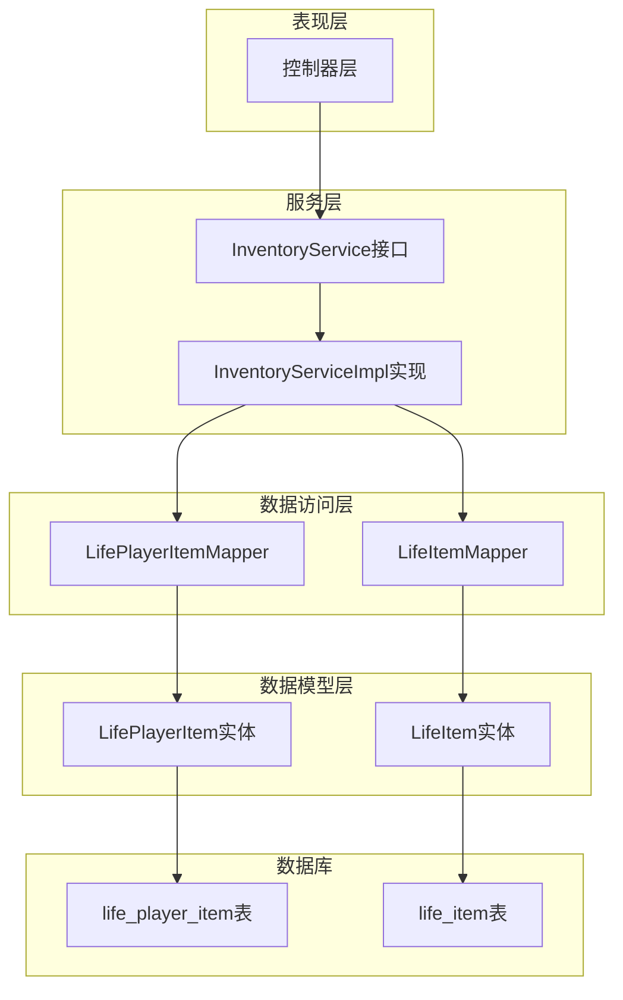
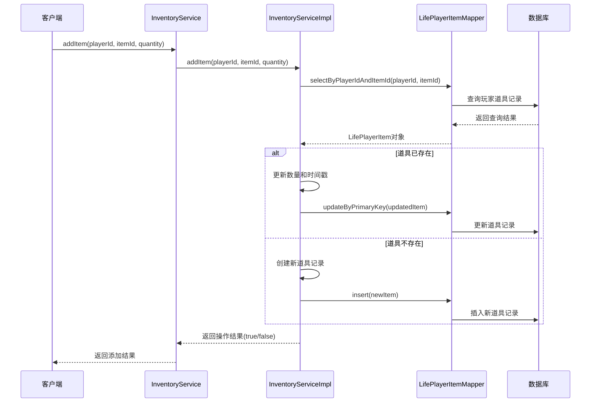
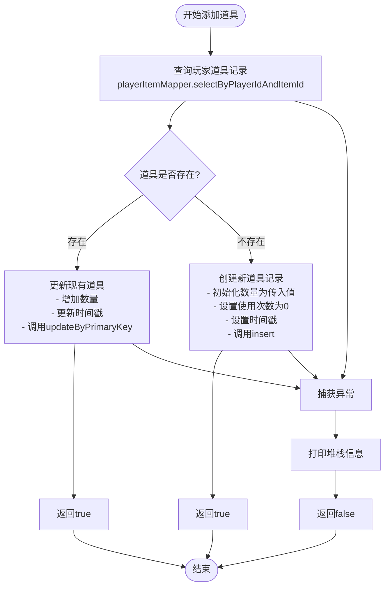
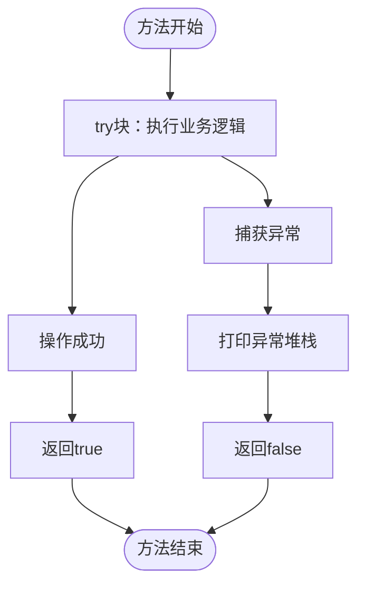

# 道具添加功能

<cite>
**本文档引用的文件**
- [InventoryServiceImpl.java](file://Life/src/main/java/com/bot/life/service/impl/InventoryServiceImpl.java)
- [InventoryService.java](file://Life/src/main/java/com/bot/life/service/InventoryService.java)
- [LifePlayerItem.java](file://Life/src/main/java/com/bot/life/dao/entity/LifePlayerItem.java)
- [LifePlayerItemMapper.java](file://Life/src/main/java/com/bot/life/dao/mapper/LifePlayerItemMapper.java)
- [LifePlayerItemMapper.xml](file://Life/src/main/resources/mapper/LifePlayerItemMapper.xml)
- [ENItemType.java](file://Life/src/main/java/com/bot/life/enums/ENItemType.java)
- [LifeItem.java](file://Life/src/main/java/com/bot/life/dao/entity/LifeItem.java)
</cite>

## 目录
1. [简介](#简介)
2. [项目结构](#项目结构)
3. [核心组件](#核心组件)
4. [架构概览](#架构概览)
5. [详细组件分析](#详细组件分析)
6. [数据库设计](#数据库设计)
7. [事务处理机制](#事务处理机制)
8. [异常处理策略](#异常处理策略)
9. [使用示例](#使用示例)
10. [性能考虑](#性能考虑)
11. [故障排除指南](#故障排除指南)
12. [结论](#结论)

## 简介

道具添加功能是浮生卷游戏系统中的核心业务逻辑之一，负责管理玩家背包中道具的增减操作。该功能通过`addItem`方法实现了智能的道具管理机制：当玩家获得新道具时，系统会检查是否存在同种道具记录，如果存在则进行数量叠加，如果不存在则创建新的道具记录。整个过程涉及数据库的查询、插入和更新操作，并采用基础的异常处理机制确保数据一致性。

## 项目结构

道具添加功能位于Life模块中，遵循分层架构设计：



**图表来源**
- [InventoryServiceImpl.java](file://Life/src/main/java/com/bot/life/service/impl/InventoryServiceImpl.java#L25-L339)
- [LifePlayerItemMapper.java](file://Life/src/main/java/com/bot/life/dao/mapper/LifePlayerItemMapper.java#L11-L42)

**章节来源**
- [InventoryServiceImpl.java](file://Life/src/main/java/com/bot/life/service/impl/InventoryServiceImpl.java#L1-L339)
- [InventoryService.java](file://Life/src/main/java/com/bot/life/service/InventoryService.java#L1-L53)

## 核心组件

道具添加功能的核心组件包括：

### InventoryService 接口
定义了道具管理的标准契约，包含`addItem`方法用于添加道具。

### InventoryServiceImpl 实现类
提供了`addItem`方法的具体实现逻辑，负责处理道具添加的业务规则。

### LifePlayerItem 实体类
表示玩家道具的实体模型，包含道具的基本属性和关联信息。

### LifePlayerItemMapper 数据访问接口
提供了与数据库交互的抽象方法，支持道具记录的查询、插入和更新操作。

**章节来源**
- [InventoryService.java](file://Life/src/main/java/com/bot/life/service/InventoryService.java#L12-L52)
- [InventoryServiceImpl.java](file://Life/src/main/java/com/bot/life/service/impl/InventoryServiceImpl.java#L25-L339)
- [LifePlayerItem.java](file://Life/src/main/java/com/bot/life/dao/entity/LifePlayerItem.java#L1-L23)

## 架构概览

道具添加功能采用经典的三层架构模式，结合MyBatis框架实现数据持久化：



**图表来源**
- [InventoryServiceImpl.java](file://Life/src/main/java/com/bot/life/service/impl/InventoryServiceImpl.java#L49-L74)
- [LifePlayerItemMapper.java](file://Life/src/main/java/com/bot/life/dao/mapper/LifePlayerItemMapper.java#L33-L41)

## 详细组件分析

### addItem 方法实现逻辑

`addItem`方法是道具添加功能的核心入口，其实现逻辑如下：

#### 方法签名和参数说明

| 参数 | 类型 | 描述 |
|------|------|------|
| playerId | Long | 玩家唯一标识符 |
| itemId | Long | 道具唯一标识符 |
| quantity | Integer | 要添加的道具数量 |

#### 核心业务流程



**图表来源**
- [InventoryServiceImpl.java](file://Life/src/main/java/com/bot/life/service/impl/InventoryServiceImpl.java#L49-L74)

#### 具体实现步骤

1. **查询现有道具记录**：通过`playerItemMapper.selectByPlayerIdAndItemId(playerId, itemId)`检查玩家是否已有该道具
2. **判断道具状态**：
   - **道具存在**：对现有记录进行数量叠加和时间更新
   - **道具不存在**：创建全新的道具记录
3. **数据库操作**：
   - 存在时：执行`updateByPrimaryKey`更新操作
   - 不存在时：执行`insert`插入新记录
4. **异常处理**：捕获所有异常并返回失败状态

**章节来源**
- [InventoryServiceImpl.java](file://Life/src/main/java/com/bot/life/service/impl/InventoryServiceImpl.java#L49-L74)

### LifePlayerItem 实体模型

LifePlayerItem实体类定义了玩家道具的数据结构：

| 字段 | 类型 | 描述 |
|------|------|------|
| id | Long | 主键ID |
| playerId | Long | 玩家ID |
| itemId | Long | 道具ID |
| quantity | Integer | 道具数量 |
| usedCount | Integer | 使用次数 |
| createTime | Date | 创建时间 |
| updateTime | Date | 更新时间 |

**章节来源**
- [LifePlayerItem.java](file://Life/src/main/java/com/bot/life/dao/entity/LifePlayerItem.java#L1-L23)

### 数据库映射配置

MyBatis的XML映射文件定义了SQL操作：

#### 查询操作
- `selectByPlayerIdAndItemId`：根据玩家ID和道具ID查询特定道具记录

#### 插入操作
- `insert`：向life_player_item表插入新记录

#### 更新操作
- `updateByPrimaryKey`：根据主键更新道具记录

**章节来源**
- [LifePlayerItemMapper.xml](file://Life/src/main/resources/mapper/LifePlayerItemMapper.xml#L50-L78)

## 数据库设计

### life_player_item 表结构

| 列名 | 类型 | 约束 | 描述 |
|------|------|------|------|
| id | BIGINT | PRIMARY KEY, AUTO_INCREMENT | 主键ID |
| player_id | BIGINT | NOT NULL | 玩家ID外键 |
| item_id | BIGINT | NOT NULL | 道具ID外键 |
| quantity | INTEGER | NOT NULL | 道具数量 |
| used_count | INTEGER | NOT NULL | 使用次数 |
| create_time | TIMESTAMP | NOT NULL | 记录创建时间 |
| update_time | TIMESTAMP | NOT NULL | 记录更新时间 |

### 索引设计
- **主键索引**：id列上的主键索引
- **复合索引**：player_id和item_id组合索引，优化查询性能

### 关联关系
- **一对多关系**：一个玩家可以拥有多个道具
- **多对一关系**：多个道具记录对应一个具体的道具类型

**章节来源**
- [LifePlayerItemMapper.xml](file://Life/src/main/resources/mapper/LifePlayerItemMapper.xml#L5-L13)

## 事务处理机制

虽然当前实现中没有显式的事务注解，但基于以下设计原则确保数据一致性：

### ACID 特性保证

1. **原子性**：每个数据库操作都是独立的，要么成功要么失败
2. **一致性**：通过数据库约束保证数据完整性
3. **隔离性**：MyBatis默认的隔离级别保证操作的独立性
4. **持久性**：数据库事务确保操作的持久化

### 并发控制

- **乐观锁**：通过update_time字段实现版本控制
- **唯一约束**：player_id和item_id的组合确保不会重复添加同一道具

### 异常处理策略

当前实现采用基础的异常捕获机制：
- 捕获所有异常并打印堆栈信息
- 返回布尔值表示操作结果
- 不进行复杂的回滚处理

**章节来源**
- [InventoryServiceImpl.java](file://Life/src/main/java/com/bot/life/service/impl/InventoryServiceImpl.java#L69-L74)

## 异常处理策略

### 当前异常处理机制



**图表来源**
- [InventoryServiceImpl.java](file://Life/src/main/java/com/bot/life/service/impl/InventoryServiceImpl.java#L69-L74)

### 异常类型分析

1. **数据库异常**：连接失败、SQL语法错误、约束违反
2. **业务异常**：参数无效、权限不足
3. **系统异常**：内存不足、线程中断

### 改进建议

为了提高系统的健壮性，建议：
- 添加更详细的异常分类处理
- 实现日志记录机制
- 考虑使用Spring的声明式事务管理
- 添加重试机制处理临时性故障

**章节来源**
- [InventoryServiceImpl.java](file://Life/src/main/java/com/bot/life/service/impl/InventoryServiceImpl.java#L69-L74)

## 使用示例

### 基本使用场景

#### 添加修为类道具
```java
// 添加10点修为丹
boolean success = inventoryService.addItem(playerId, 1001L, 10);
if (success) {
    System.out.println("修为丹添加成功！");
} else {
    System.out.println("添加失败，请稍后重试。");
}
```

#### 添加属性类道具
```java
// 添加1个增加速度的丹药
boolean success = inventoryService.addItem(playerId, 2001L, 1);
```

#### 添加多个道具
```java
// 批量添加道具
int[] quantities = {5, 3, 2};
Long[] itemIds = {1001L, 1002L, 1003L};

for (int i = 0; i < quantities.length; i++) {
    boolean success = inventoryService.addItem(playerId, itemIds[i], quantities[i]);
    if (!success) {
        System.err.println("添加道具失败：" + itemIds[i]);
    }
}
```

### 返回值含义

| 返回值 | 含义 | 处理方式 |
|--------|------|----------|
| true | 道具添加成功 | 继续后续操作 |
| false | 道具添加失败 | 记录日志，提示用户重试 |

### 道具类型说明

根据ENItemType枚举，道具分为以下类型：

| 类型代码 | 类型名称 | 说明 |
|----------|----------|------|
| 1 | 修为类 | 增加玩家修为值 |
| 2 | 属性类 | 增加玩家属性点数 |
| 3 | 体力类 | 恢复玩家体力值 |
| 4 | 升级法宝类 | 用于法宝升级 |
| 5 | 恢复类 | 恢复玩家生命值 |
| 6 | 技能书 | 学习新的战斗技能 |

**章节来源**
- [ENItemType.java](file://Life/src/main/java/com/bot/life/enums/ENItemType.java#L8-L13)
- [InventoryServiceImpl.java](file://Life/src/main/java/com/bot/life/service/impl/InventoryServiceImpl.java#L49-L74)

## 性能考虑

### 查询优化

1. **索引利用**：player_id和item_id的组合索引确保查询效率
2. **缓存策略**：对于频繁查询的道具信息，可以考虑引入缓存
3. **批量操作**：对于大量道具的添加，可以考虑批量处理

### 内存优化

1. **对象池**：对于频繁创建的LifePlayerItem对象，可以使用对象池
2. **延迟加载**：关联的LifeItem对象采用延迟加载策略

### 数据库优化

1. **连接池**：合理配置数据库连接池大小
2. **事务隔离**：根据业务需求选择合适的事务隔离级别
3. **监控指标**：监控慢查询和高并发场景下的性能表现

## 故障排除指南

### 常见问题及解决方案

#### 1. 道具添加失败
**症状**：`addItem`方法返回false
**可能原因**：
- 数据库连接异常
- SQL语法错误
- 数据库约束违反

**解决方案**：
- 检查数据库连接状态
- 查看异常堆栈信息
- 验证输入参数的有效性

#### 2. 道具数量不正确
**症状**：玩家背包中道具数量与预期不符
**可能原因**：
- 并发修改导致的数据不一致
- 异常处理不当导致部分操作失败

**解决方案**：
- 实现更完善的事务管理
- 添加数据一致性校验
- 记录操作日志便于追踪

#### 3. 性能问题
**症状**：道具添加操作响应缓慢
**可能原因**：
- 缺少必要的数据库索引
- 查询语句效率低下
- 数据库连接池配置不当

**解决方案**：
- 添加适当的数据库索引
- 优化SQL查询语句
- 调整连接池配置参数

### 调试技巧

1. **启用SQL日志**：在application.properties中设置MyBatis SQL日志级别
2. **添加调试日志**：在关键位置添加日志输出
3. **单元测试**：编写针对`addItem`方法的单元测试
4. **性能监控**：使用性能监控工具跟踪操作耗时

**章节来源**
- [InventoryServiceImpl.java](file://Life/src/main/java/com/bot/life/service/impl/InventoryServiceImpl.java#L69-L74)

## 结论

道具添加功能作为浮生卷游戏系统的核心业务逻辑，实现了智能的道具管理机制。通过`addItem`方法，系统能够高效地处理玩家道具的增减操作，无论是数量叠加还是新建记录，都体现了良好的业务逻辑设计。

### 功能特点

1. **智能判断**：自动检测道具是否存在，避免重复创建
2. **数据一致性**：通过数据库操作确保数据的准确性和完整性
3. **异常处理**：提供基础的异常捕获和处理机制
4. **扩展性强**：基于接口的设计便于功能扩展和维护

### 改进方向

1. **事务管理**：考虑引入Spring事务管理增强数据一致性
2. **性能优化**：添加缓存机制和批量处理支持
3. **监控完善**：建立完整的监控和日志体系
4. **异常细化**：实现更细粒度的异常分类和处理

该功能为浮生卷游戏的道具系统奠定了坚实的基础，支持了游戏中的各种道具获取和使用场景，是构建完整游戏体验的重要组成部分。