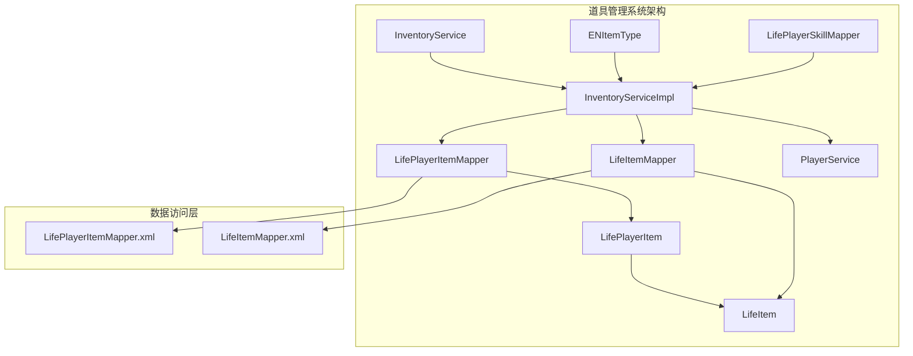
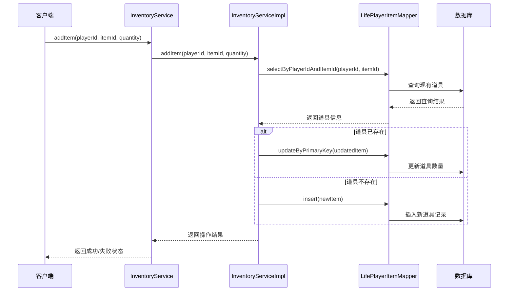
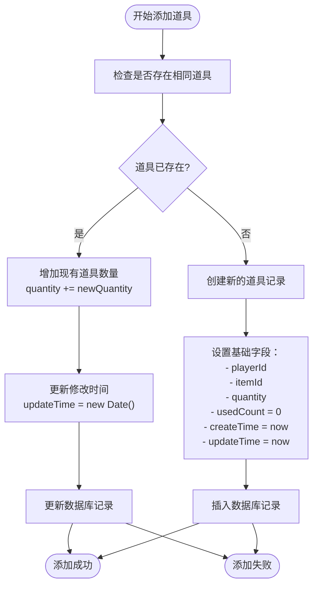
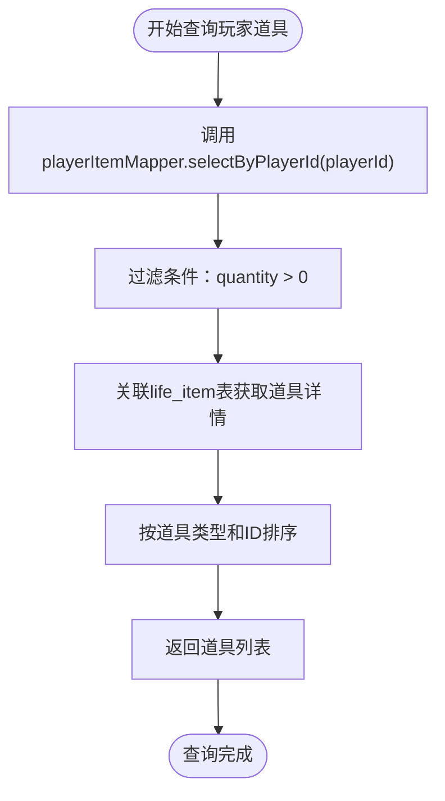
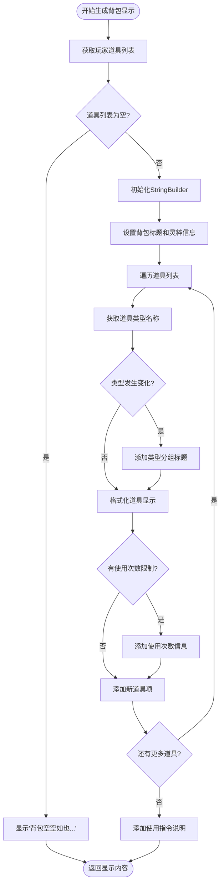
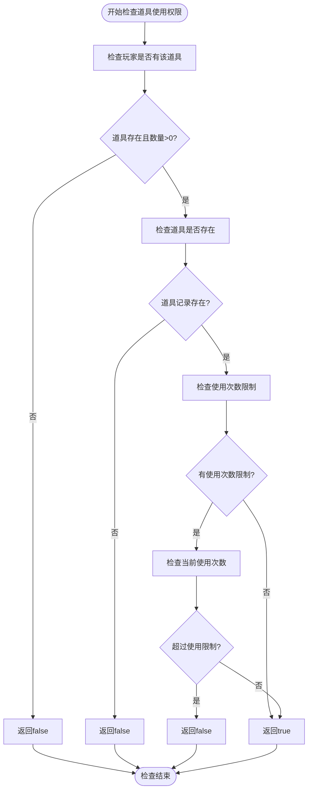
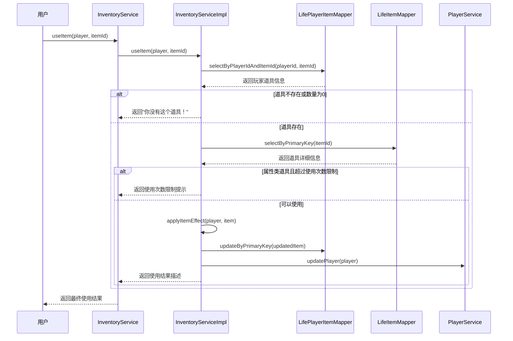
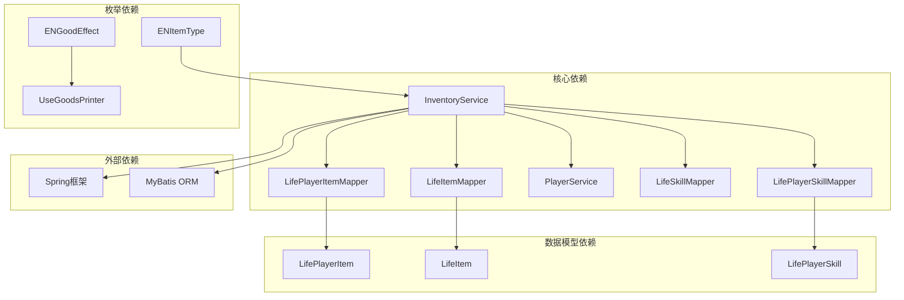

# 道具管理功能

<cite>
**本文档引用的文件**
- [InventoryService.java](file://Life/src/main/java/com/bot/life/service/InventoryService.java)
- [InventoryServiceImpl.java](file://Life/src/main/java/com/bot/life/service/impl/InventoryServiceImpl.java)
- [LifePlayerItem.java](file://Life/src/main/java/com/bot/life/dao/entity/LifePlayerItem.java)
- [LifeItem.java](file://Life/src/main/java/com/bot/life/dao/entity/LifeItem.java)
- [LifePlayerItemMapper.java](file://Life/src/main/java/com/bot/life/dao/mapper/LifePlayerItemMapper.java)
- [LifePlayerItemMapper.xml](file://Life/src/main/resources/mapper/LifePlayerItemMapper.xml)
- [ENItemType.java](file://Life/src/main/java/com/bot/life/enums/ENItemType.java)
- [UseGoodsPrinter.java](file://Game/src/main/java/com/bot/game/chain/menu/UseGoodsPrinter.java)
- [PlayerGoods.java](file://Game/src/main/java/com/bot/game/dao/entity/PlayerGoods.java)
- [PlayerGoodsMapper.java](file://Game/src/main/java/com/bot/game/dao/mapper/PlayerGoodsMapper.java)
</cite>

## 目录
1. [简介](#简介)
2. [项目结构](#项目结构)
3. [核心组件](#核心组件)
4. [架构概览](#架构概览)
5. [详细组件分析](#详细组件分析)
6. [依赖关系分析](#依赖关系分析)
7. [性能考虑](#性能考虑)
8. [故障排除指南](#故障排除指南)
9. [结论](#结论)

## 简介

本文档全面介绍了Bot项目中的道具管理功能，重点分析了背包系统的增删查功能实现。该系统提供了完整的道具生命周期管理，包括道具添加、查询、使用和显示等功能。系统采用分层架构设计，通过InventoryService接口定义核心功能，并在InventoryServiceImpl中提供具体实现。

## 项目结构

道具管理系统主要分布在两个模块中：
- **Life模块**：包含核心的道具管理和背包功能
- **Game模块**：提供基础的游戏道具相关功能

**图表来源**
- [InventoryService.java](file://Life/src/main/java/com/bot/life/service/InventoryService.java#L11-L51)
- [InventoryServiceImpl.java](file://Life/src/main/java/com/bot/life/service/impl/InventoryServiceImpl.java#L25-L42)

## 核心组件

### InventoryService 接口
定义了道具管理的核心功能接口，包括：
- **获取玩家道具**：`getPlayerItems(LifePlayer player)`
- **添加道具**：`addItem(Long playerId, Long itemId, Integer quantity)`
- **使用道具**：`useItem(LifePlayer player, Long itemId)`
- **检查道具使用权限**：`canUseItem(LifePlayer player, Long itemId)`
- **获取背包显示内容**：`getInventoryDisplay(LifePlayer player)`

### InventoryServiceImpl 实现类
提供了InventoryService接口的具体实现，包含完整的业务逻辑处理。

### 数据模型
- **LifePlayerItem**：玩家道具实体，包含玩家ID、道具ID、数量、使用次数等信息
- **LifeItem**：道具基本信息，包含类型、效果值、最大使用次数等属性

**章节来源**
- [InventoryService.java](file://Life/src/main/java/com/bot/life/service/InventoryService.java#L11-L51)
- [InventoryServiceImpl.java](file://Life/src/main/java/com/bot/life/service/impl/InventoryServiceImpl.java#L25-L42)
- [LifePlayerItem.java](file://Life/src/main/java/com/bot/life/dao/entity/LifePlayerItem.java#L11-L23)
- [LifeItem.java](file://Life/src/main/java/com/bot/life/dao/entity/LifeItem.java#L11-L23)

## 架构概览

道具管理系统采用经典的三层架构模式：

**图表来源**
- [InventoryServiceImpl.java](file://Life/src/main/java/com/bot/life/service/impl/InventoryServiceImpl.java#L48-L74)
- [LifePlayerItemMapper.java](file://Life/src/main/java/com/bot/life/dao/mapper/LifePlayerItemMapper.java#L30-L36)

## 详细组件分析

### addItem 方法 - 道具添加逻辑

addItem方法实现了智能的道具添加机制，支持新道具创建和已有道具数量叠加：

**图表来源**
- [InventoryServiceImpl.java](file://Life/src/main/java/com/bot/life/service/impl/InventoryServiceImpl.java#L48-L74)

#### 数据库操作详解

1. **查询现有道具**：通过`selectByPlayerIdAndItemId`方法查找玩家是否已有该道具
2. **数量叠加**：如果道具存在，则直接增加数量
3. **新建记录**：如果道具不存在，则创建新的道具记录
4. **事务处理**：方法内部包含异常捕获，确保操作的原子性

**章节来源**
- [InventoryServiceImpl.java](file://Life/src/main/java/com/bot/life/service/impl/InventoryServiceImpl.java#L48-L74)

### getPlayerItems 方法 - 道具查询功能

getPlayerItems方法负责根据玩家ID查询其所有拥有的道具：

**图表来源**
- [InventoryServiceImpl.java](file://Life/src/main/java/com/bot/life/service/impl/InventoryServiceImpl.java#L43-L46)
- [LifePlayerItemMapper.xml](file://Life/src/main/resources/mapper/LifePlayerItemMapper.xml#L38-L48)

#### 查询优化特性
- **数量过滤**：自动过滤掉数量为0的道具
- **关联查询**：一次性获取道具的完整信息
- **排序规则**：按道具类型和ID进行有序排列

**章节来源**
- [InventoryServiceImpl.java](file://Life/src/main/java/com/bot/life/service/impl/InventoryServiceImpl.java#L43-L46)
- [LifePlayerItemMapper.xml](file://Life/src/main/resources/mapper/LifePlayerItemMapper.xml#L38-L48)

### getInventoryDisplay 方法 - 背包展示功能

getInventoryDisplay方法生成面向用户的背包展示内容，提供直观的道具浏览体验：

**图表来源**
- [InventoryServiceImpl.java](file://Life/src/main/java/com/bot/life/service/impl/InventoryServiceImpl.java#L134-L171)

#### 显示格式化特性
- **类型分组**：按道具类型进行分组显示
- **使用次数提示**：对有限制使用的道具显示使用进度
- **友好的用户界面**：提供清晰的使用说明

**章节来源**
- [InventoryServiceImpl.java](file://Life/src/main/java/com/bot/life/service/impl/InventoryServiceImpl.java#L134-L171)

### canUseItem 方法 - 道具使用预检查

canUseItem方法实现了严格的道具使用前验证机制：

**图表来源**
- [InventoryServiceImpl.java](file://Life/src/main/java/com/bot/life/service/impl/InventoryServiceImpl.java#L114-L131)

#### 验证逻辑详解
1. **存在性检查**：确认玩家拥有该道具且数量大于0
2. **有效性检查**：确保道具记录在数据库中存在
3. **限制检查**：验证是否超过道具的最大使用次数限制

**章节来源**
- [InventoryServiceImpl.java](file://Life/src/main/java/com/bot/life/service/impl/InventoryServiceImpl.java#L114-L131)

### useItem 方法 - 道具使用功能

useItem方法是最复杂的业务逻辑，负责执行道具的实际使用过程：

**图表来源**
- [InventoryServiceImpl.java](file://Life/src/main/java/com/bot/life/service/impl/InventoryServiceImpl.java#L77-L111)

#### 道具效果应用
系统支持多种类型的道具效果：
- **修为类**：增加玩家修为值
- **属性类**：永久提升玩家属性点
- **体力类**：恢复玩家体力值
- **恢复类**：恢复玩家生命值
- **技能书**：学习新的战斗技能

**章节来源**
- [InventoryServiceImpl.java](file://Life/src/main/java/com/bot/life/service/impl/InventoryServiceImpl.java#L77-L111)
- [InventoryServiceImpl.java](file://Life/src/main/java/com/bot/life/service/impl/InventoryServiceImpl.java#L173-L220)

## 依赖关系分析

道具管理系统与多个模块存在依赖关系：

**图表来源**
- [InventoryServiceImpl.java](file://Life/src/main/java/com/bot/life/service/impl/InventoryServiceImpl.java#L25-L42)

### 主要依赖说明
1. **LifePlayerItemMapper**：负责玩家道具的数据库操作
2. **LifeItemMapper**：负责道具基本信息的查询
3. **PlayerService**：维护玩家状态更新
4. **LifeSkillMapper**：处理技能相关的道具使用
5. **ENItemType**：定义道具类型枚举

**章节来源**
- [InventoryServiceImpl.java](file://Life/src/main/java/com/bot/life/service/impl/InventoryServiceImpl.java#L25-L42)

## 性能考虑

### 查询优化
- **索引策略**：在`player_id`和`item_id`上建立复合索引
- **懒加载**：关联查询时采用延迟加载策略
- **缓存机制**：对于频繁访问的道具信息考虑引入缓存

### 并发控制
- **乐观锁**：使用版本号控制并发更新
- **事务管理**：确保道具操作的原子性
- **异常处理**：完善的错误回滚机制

### 扩展性设计
- **接口抽象**：通过InventoryService接口实现松耦合
- **枚举扩展**：易于添加新的道具类型
- **配置化**：道具效果可通过配置灵活调整

## 故障排除指南

### 常见问题及解决方案

#### 道具添加失败
**症状**：addItem方法返回false
**可能原因**：
- 数据库连接异常
- 主键冲突
- 外键约束违反

**解决方法**：
1. 检查数据库连接状态
2. 验证输入参数的有效性
3. 查看异常日志获取详细信息

#### 道具使用权限检查失败
**症状**：canUseItem方法返回false但道具应该可用
**可能原因**：
- 道具数量被意外修改
- 使用次数达到上限
- 数据不一致

**解决方法**：
1. 检查玩家道具数量
2. 验证道具使用次数限制
3. 执行数据一致性检查

#### 背包显示格式异常
**症状**：getInventoryDisplay返回的内容格式不正确
**可能原因**：
- 道具类型枚举缺失
- 字符编码问题
- 格式化字符串错误

**解决方法**：
1. 验证ENItemType枚举定义
2. 检查字符编码设置
3. 重新编译相关资源文件

**章节来源**
- [InventoryServiceImpl.java](file://Life/src/main/java/com/bot/life/service/impl/InventoryServiceImpl.java#L48-L74)
- [InventoryServiceImpl.java](file://Life/src/main/java/com/bot/life/service/impl/InventoryServiceImpl.java#L114-L131)

## 结论

Bot项目的道具管理系统展现了良好的软件架构设计和业务逻辑实现。系统通过InventoryService接口提供了清晰的功能定义，InventoryServiceImpl类实现了完整的业务逻辑，支持道具的智能添加、严格验证和丰富展示。

### 系统优势
1. **功能完整性**：覆盖了道具管理的全生命周期
2. **业务逻辑严谨**：严格的权限验证和使用限制
3. **用户体验友好**：直观的显示格式和清晰的操作指引
4. **技术架构合理**：分层设计便于维护和扩展

### 改进建议
1. **性能优化**：考虑引入缓存机制提升查询效率
2. **监控增强**：添加操作日志和性能监控
3. **测试完善**：增加单元测试和集成测试覆盖率
4. **文档更新**：持续维护和更新技术文档

该系统为游戏道具管理提供了坚实的基础，具备良好的扩展性和维护性，能够满足复杂的游戏场景需求。