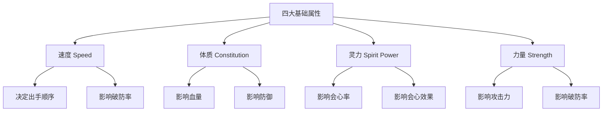
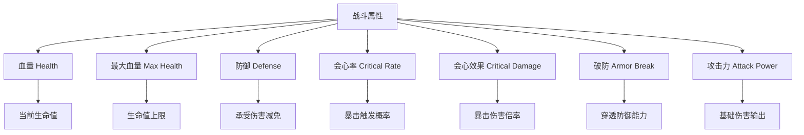
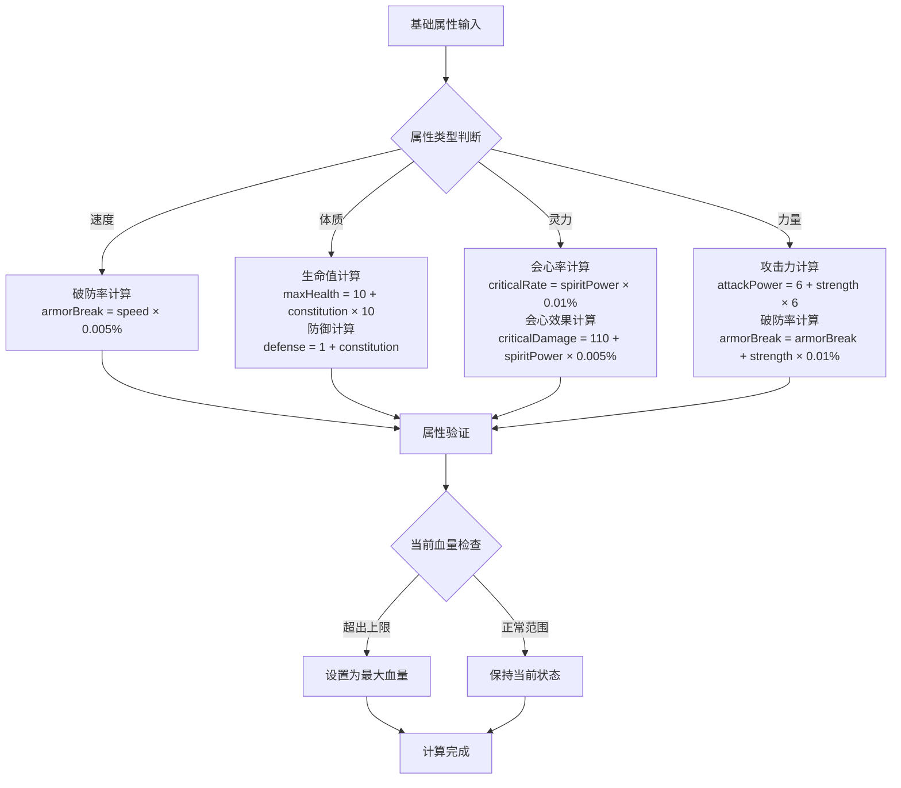
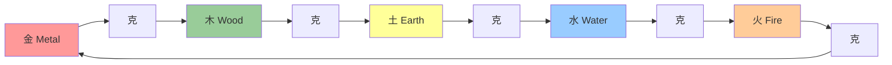
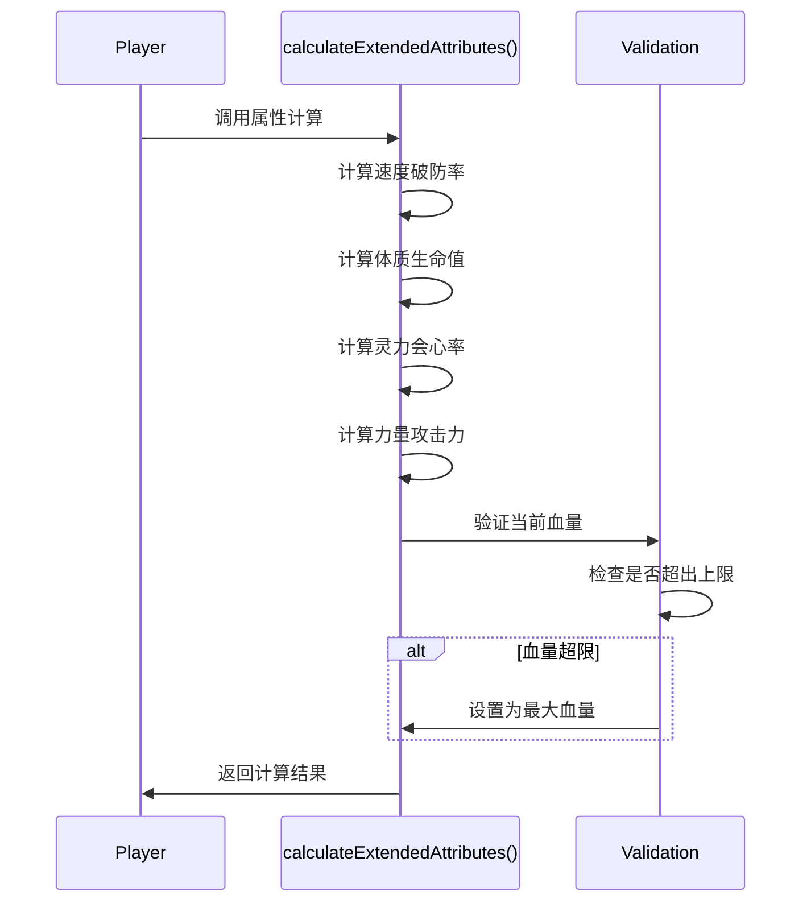
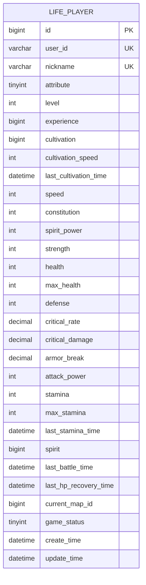
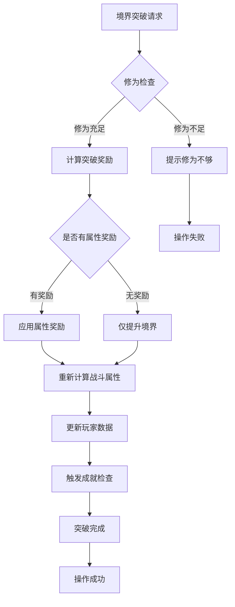

# 属性体系

<cite>
**本文档引用的文件**
- [LifePlayer.java](file://Life/src/main/java/com/bot/life/dao/entity/LifePlayer.java)
- [ENAttribute.java](file://Life/src/main/java/com/bot/life/enums/ENAttribute.java)
- [ENAttribute.java](file://Game/src/main/java/com/bot/game/enums/ENAttribute.java)
- [Life_Database_Init.sql](file://Life_Database_Init.sql)
- [PlayerServiceImpl.java](file://Life/src/main/java/com/bot/life/service/impl/PlayerServiceImpl.java)
- [RealmServiceImpl.java](file://Life/src/main/java/com/bot/life/service/impl/RealmServiceImpl.java)
- [SkillServiceImpl.java](file://Life/src/main/java/com/bot/life/service/impl/SkillServiceImpl.java)
- [LifePlayerMapper.xml](file://Life/src/main/resources/mapper/LifePlayerMapper.xml)
- [浮生卷开发说明.md](file://浮生卷开发说明.md)
</cite>

## 目录
1. [简介](#简介)
2. [属性分类体系](#属性分类体系)
3. [基础属性系统](#基础属性系统)
4. [战斗属性系统](#战斗属性系统)
5. [五行属性体系](#五行属性体系)
6. [属性计算机制](#属性计算机制)
7. [数据库结构设计](#数据库结构设计)
8. [属性成长与突破](#属性成长与突破)
9. [属性扩展指南](#属性扩展指南)
10. [总结](#总结)

## 简介

'浮生卷'游戏采用了一套完整的角色属性体系，将角色培养分为基础属性和战斗属性两个层次。这套属性系统不仅影响角色的成长方向，还决定了战斗中的表现和技能效果。本文档将深入解析属性体系的设计原理、计算机制以及扩展方法。

## 属性分类体系

### 四大基础属性

游戏中的四大基础属性构成了角色的核心能力体系：



**图表来源**
- [LifePlayer.java](file://Life/src/main/java/com/bot/life/dao/entity/LifePlayer.java#L25-L28)

### 六大战斗属性

战斗属性是基础属性的衍生，直接影响战斗表现：



**图表来源**
- [LifePlayer.java](file://Life/src/main/java/com/bot/life/dao/entity/LifePlayer.java#L31-L37)

**章节来源**
- [LifePlayer.java](file://Life/src/main/java/com/bot/life/dao/entity/LifePlayer.java#L24-L37)
- [浮生卷开发说明.md](file://浮生卷开发说明.md#L26-L30)

## 基础属性系统

### 属性初始值

每个角色创建时，四大基础属性均初始化为1点：

| 属性 | 初始值 | 说明 |
|------|--------|------|
| 速度 (Speed) | 1 | 决定战斗出手顺序 |
| 体质 (Constitution) | 1 | 影响生命值和防御 |
| 灵力 (Spirit Power) | 1 | 影响会心能力和效果 |
| 力量 (Strength) | 1 | 影响攻击力和破防 |

### 属性增长机制

基础属性通过以下方式获得：
- **境界突破**：每次境界突破获得相应属性点
- **属性重置**：消耗灵粹重置属性点
- **道具使用**：使用属性药剂增加特定属性
- **任务奖励**：完成特定任务获得属性点

**章节来源**
- [PlayerServiceImpl.java](file://Life/src/main/java/com/bot/life/service/impl/PlayerServiceImpl.java#L63-L67)
- [RealmServiceImpl.java](file://Life/src/main/java/com/bot/life/service/impl/RealmServiceImpl.java#L194-L227)

## 战斗属性系统

### 核心计算公式

战斗属性的计算遵循明确的数学关系：



**图表来源**
- [LifePlayer.java](file://Life/src/main/java/com/bot/life/dao/entity/LifePlayer.java#L55-L75)

### 属性计算细节

#### 速度属性影响
- **破防率**：每点速度增加0.005%破防率
- **战斗优先级**：速度越高，战斗中出手越早

#### 体质属性影响
- **生命值**：每点体质增加10点最大生命值
- **防御力**：每点体质增加1点防御力

#### 灵力属性影响
- **会心率**：每点灵力增加0.01%会心触发概率
- **会心效果**：每点灵力增加0.005%会心伤害倍率

#### 力量属性影响
- **攻击力**：每点力量增加6点攻击力
- **破防率**：每点力量增加0.01%破防率

**章节来源**
- [LifePlayer.java](file://Life/src/main/java/com/bot/life/dao/entity/LifePlayer.java#L55-L75)
- [浮生卷开发说明.md](file://浮生卷开发说明.md#L33-L39)

## 五行属性体系

### 五行属性定义

游戏包含五种基本属性，每种属性都有独特的克制关系：



**图表来源**
- [ENAttribute.java](file://Life/src/main/java/com/bot/life/enums/ENAttribute.java#L44-L53)
- [ENAttribute.java](file://Game/src/main/java/com/bot/game/enums/ENAttribute.java#L12-L16)

### 属性克制关系

| 攻击属性 | 克制属性 | 被克制属性 |
|----------|----------|------------|
| 金 (Metal) | 木 (Wood) | 火 (Fire) |
| 木 (Wood) | 土 (Earth) | 金 (Metal) |
| 土 (Earth) | 水 (Water) | 木 (Wood) |
| 水 (Water) | 火 (Fire) | 土 (Earth) |
| 火 (Fire) | 金 (Metal) | 水 (Water) |

### 属性战斗效果

当攻击克制属性目标时：
- **伤害加成**：最终伤害增加20%
- **防御削弱**：自身防御力降低10%

**章节来源**
- [ENAttribute.java](file://Life/src/main/java/com/bot/life/enums/ENAttribute.java#L44-L63)
- [ENAttribute.java](file://Game/src/main/java/com/bot/game/enums/ENAttribute.java#L30-L48)
- [浮生卷开发说明.md](file://浮生卷开发说明.md#L43-L45)

## 属性计算机制

### 计算流程

属性计算遵循严格的执行顺序：



**图表来源**
- [LifePlayer.java](file://Life/src/main/java/com/bot/life/dao/entity/LifePlayer.java#L55-L75)

### 计算精度处理

战斗属性使用BigDecimal确保计算精度：
- **会心率**：使用decimal(5,3)存储
- **会心效果**：使用decimal(6,3)存储
- **破防率**：使用decimal(5,3)存储

### 属性验证机制

计算完成后自动验证：
- **血量上限**：当前血量不超过最大血量
- **属性一致性**：确保所有属性值合理

**章节来源**
- [LifePlayer.java](file://Life/src/main/java/com/bot/life/dao/entity/LifePlayer.java#L55-L75)

## 数据库结构设计

### life_player 表结构



**图表来源**
- [Life_Database_Init.sql](file://Life_Database_Init.sql#L6-L48)

### 字段类型说明

| 字段类别 | 字段名 | 数据类型 | 默认值 | 说明 |
|----------|--------|----------|--------|------|
| 基础属性 | speed | int | 1 | 速度属性 |
| 基础属性 | constitution | int | 1 | 体质属性 |
| 基础属性 | spirit_power | int | 1 | 灵力属性 |
| 基础属性 | strength | int | 1 | 力量属性 |
| 战斗属性 | health | int | 10 | 当前血量 |
| 战斗属性 | max_health | int | 10 | 最大血量 |
| 战斗属性 | defense | int | 1 | 防御力 |
| 战斗属性 | critical_rate | decimal(5,3) | 0.000 | 会心率 |
| 战斗属性 | critical_damage | decimal(6,3) | 110.000 | 会心效果 |
| 战斗属性 | armor_break | decimal(5,3) | 0.000 | 破防率 |
| 战斗属性 | attack_power | int | 6 | 攻击力 |

### 约束条件

- **唯一约束**：user_id 和 nickname 必须唯一
- **默认值**：所有属性初始值均为1（特殊属性除外）
- **时间戳**：自动管理创建和更新时间

**章节来源**
- [Life_Database_Init.sql](file://Life_Database_Init.sql#L6-L48)
- [LifePlayerMapper.xml](file://Life/src/main/resources/mapper/LifePlayerMapper.xml#L5-L36)

## 属性成长与突破

### 境界突破系统

境界突破是属性成长的主要途径：



**图表来源**
- [RealmServiceImpl.java](file://Life/src/main/java/com/bot/life/service/impl/RealmServiceImpl.java#L194-L230)

### 属性奖励配置

不同境界提供不同的属性奖励：

| 境界阶段 | 属性奖励 | 说明 |
|----------|----------|------|
| 筑基期 | speed +5, constitution +5, spirit_power +5, strength +5 | 基础属性全面提升 |
| 金丹期 | speed +10, constitution +10, spirit_power +15, strength +10, cultivation_speed +20 | 灵力大幅提升 |
| 元婴期 | speed +20, constitution +20, spirit_power +30, strength +20, cultivation_speed +50 | 神识大幅增强 |
| 化神期 | speed +30, constitution +30, spirit_power +50, strength +30, cultivation_speed +100 | 接近仙人境界 |
| 大乘期 | speed +50, constitution +50, spirit_power +100, strength +50, cultivation_speed +200 | 移山填海之能 |

### 属性重置机制

玩家可以通过消耗灵粹重置属性点：

- **重置费用**：根据当前属性点数计算
- **重置规则**：只能重置到初始状态
- **冷却时间**：防止频繁重置

**章节来源**
- [RealmServiceImpl.java](file://Life/src/main/java/com/bot/life/service/impl/RealmServiceImpl.java#L194-L230)
- [浮生卷开发说明.md](file://浮生卷开发说明.md#L21-L49)

## 属性扩展指南

### 添加新属性类型

要添加新的属性类型，需要按照以下步骤进行：

#### 1. 枚举类扩展

```java
// 在ENAttribute枚举中添加新属性
public enum ENAttribute {
    // 现有属性...
    NEW_ATTRIBUTE(6, "新属性"),
    
    // 方法实现...
}
```

#### 2. 实体类字段添加

```java
// 在LifePlayer实体类中添加字段
private Integer newAttribute;

// 添加getter和setter方法
public Integer getNewAttribute() {
    return newAttribute;
}

public void setNewAttribute(Integer newAttribute) {
    this.newAttribute = newAttribute;
}
```

#### 3. 数据库表扩展

```sql
ALTER TABLE life_player ADD COLUMN new_attribute INT DEFAULT 1;
```

#### 4. 计算逻辑扩展

```java
// 在calculateExtendedAttributes方法中添加新属性计算
case "new_attribute":
    // 添加新属性的计算逻辑
    break;
```

### 调整属性成长曲线

#### 1. 修改配置参数

在系统配置表中调整相关参数：

```sql
UPDATE life_system_config 
SET config_value = '新数值'
WHERE config_key = '属性配置项';
```

#### 2. 修改计算公式

```java
// 修改属性计算公式
this.newProperty = baseValue + attributeValue * growthRate;
```

#### 3. 平衡性测试

- **性能测试**：确保计算效率
- **平衡测试**：验证新属性不会破坏游戏平衡
- **兼容性测试**：确保与其他属性系统的兼容性

### 属性系统优化建议

#### 1. 性能优化

- 使用缓存机制避免重复计算
- 批量处理属性更新
- 异步处理复杂计算

#### 2. 用户体验优化

- 提供属性预览功能
- 增加属性分配指导
- 实现属性模拟计算

#### 3. 系统稳定性

- 添加属性值验证
- 实现属性回滚机制
- 完善错误处理逻辑

**章节来源**
- [RealmServiceImpl.java](file://Life/src/main/java/com/bot/life/service/impl/RealmServiceImpl.java#L194-L230)
- [浮生卷开发说明.md](file://浮生卷开发说明.md#L21-L49)

## 总结

'浮生卷'的属性体系设计体现了深度的角色养成理念。通过基础属性与战斗属性的分离，实现了策略性的角色培养。五行属性系统增加了战斗的策略深度，而完善的计算机制确保了系统的稳定性和可扩展性。

这套属性体系的成功之处在于：
- **清晰的层次结构**：基础属性与战斗属性分工明确
- **合理的计算公式**：简单易懂且富有策略性
- **灵活的扩展机制**：支持未来功能的扩展
- **完善的数据库设计**：保证数据的一致性和完整性

对于开发者而言，理解这套属性体系不仅有助于游戏功能的开发，更能为角色养成系统的优化提供重要参考。随着游戏的发展，这套属性体系将继续发挥重要作用，为玩家提供丰富的角色培养体验。