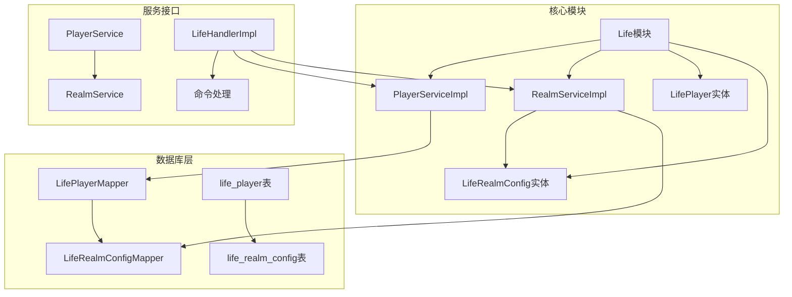
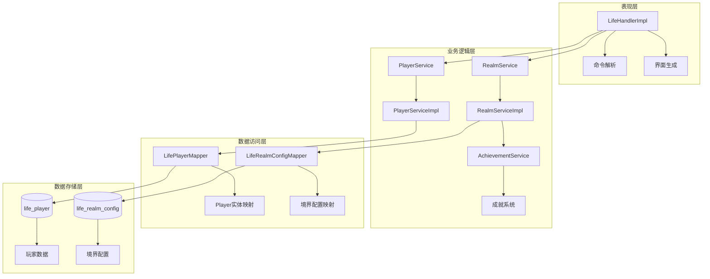
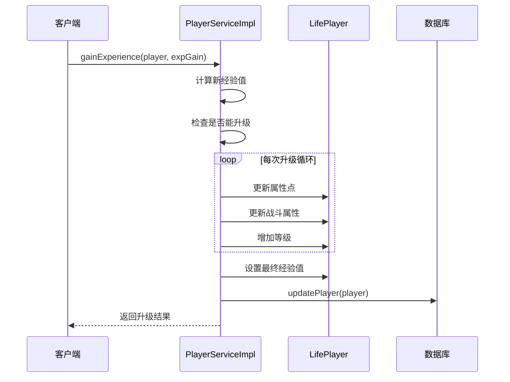
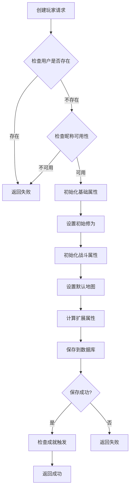
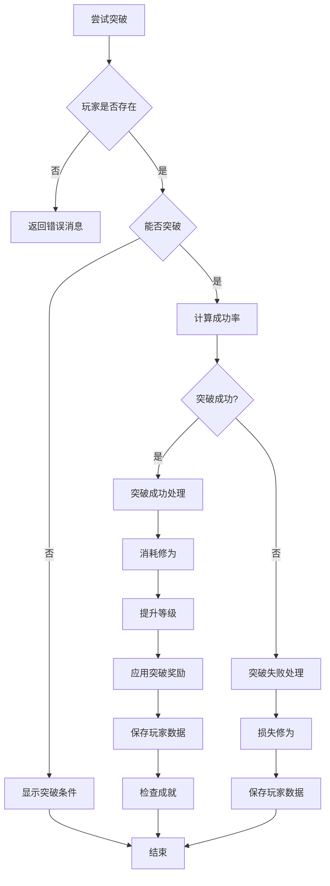
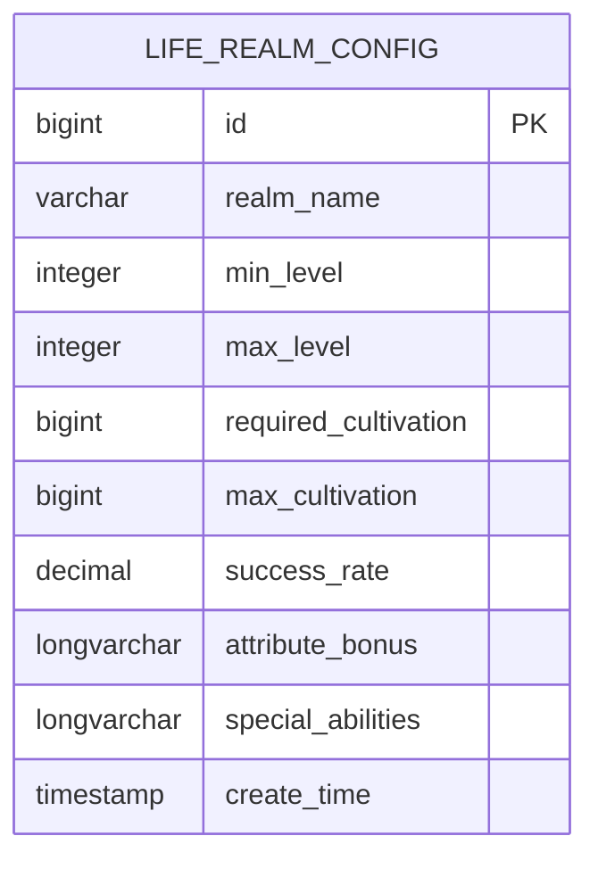
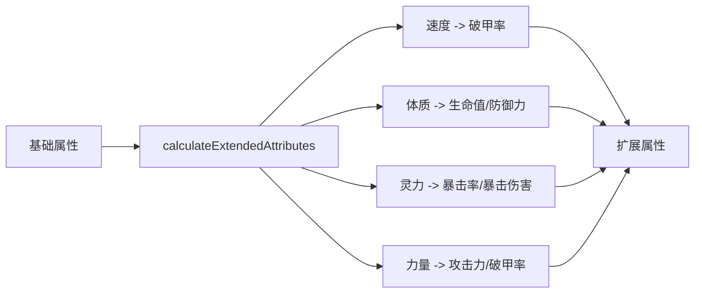
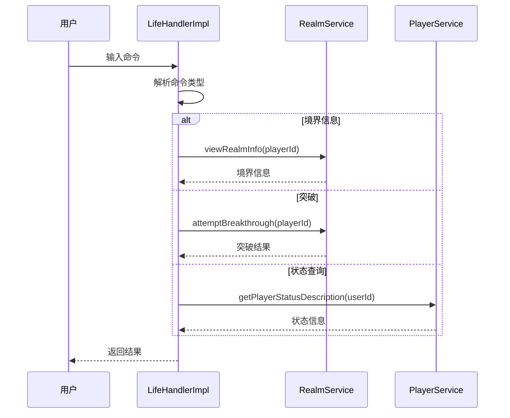
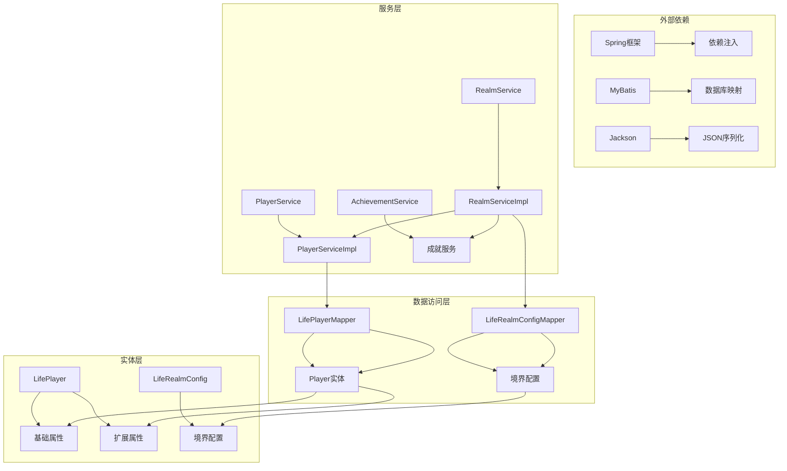

# 成长机制

<cite>
**本文档引用的文件**
- [PlayerServiceImpl.java](file://Life/src/main/java/com/bot/life/service/impl/PlayerServiceImpl.java)
- [RealmServiceImpl.java](file://Life/src/main/java/com/bot/life/service/impl/RealmServiceImpl.java)
- [LifePlayer.java](file://Life/src/main/java/com/bot/life/dao/entity/LifePlayer.java)
- [LifeRealmConfig.java](file://Life/src/main/java/com/bot/life/dao/entity/LifeRealmConfig.java)
- [LifeRealmConfigMapper.xml](file://Life/src/main/resources/mapper/LifeRealmConfigMapper.xml)
- [RealmService.java](file://Life/src/main/java/com/bot/life/service/RealmService.java)
- [LifeHandlerImpl.java](file://Life/src/main/java/com/bot/life/service/impl/LifeHandlerImpl.java)
- [Life_Realm_Breakthrough_System.md](file://Life_Realm_Breakthrough_System.md)
</cite>

## 目录
1. [简介](#简介)
2. [项目结构概览](#项目结构概览)
3. [核心组件分析](#核心组件分析)
4. [架构总览](#架构总览)
5. [详细组件分析](#详细组件分析)
6. [依赖关系分析](#依赖关系分析)
7. [性能考虑](#性能考虑)
8. [故障排除指南](#故障排除指南)
9. [结论](#结论)

## 简介

浮生卷游戏的角色成长机制是一个复杂而精密的系统，包含了经验值获取、等级提升、修为（cultivation）系统、境界突破等多个维度的成长要素。本系统采用双轨制成长模式：传统的经验值升级体系和独特的修仙境界突破体系，为玩家提供了丰富多样的成长路径。

系统的核心设计理念是通过可配置的数据驱动方式，实现灵活的游戏平衡性和可扩展性。无论是基础的经验值成长还是高级的修仙境界突破，都遵循统一的配置化管理原则，便于开发者进行参数调整和功能扩展。

## 项目结构概览

浮生卷的成长机制主要分布在以下几个模块中：



**图表来源**
- [PlayerServiceImpl.java](file://Life/src/main/java/com/bot/life/service/impl/PlayerServiceImpl.java#L1-L50)
- [RealmServiceImpl.java](file://Life/src/main/java/com/bot/life/service/impl/RealmServiceImpl.java#L1-L50)
- [LifePlayer.java](file://Life/src/main/java/com/bot/life/dao/entity/LifePlayer.java#L1-L50)

**章节来源**
- [PlayerServiceImpl.java](file://Life/src/main/java/com/bot/life/service/impl/PlayerServiceImpl.java#L1-L230)
- [RealmServiceImpl.java](file://Life/src/main/java/com/bot/life/service/impl/RealmServiceImpl.java#L1-L245)

## 核心组件分析

### 经验值成长系统

经验值成长系统是角色发展的基础机制，通过PlayerServiceImpl.gainExperience方法实现完整的升级流程。

#### 核心特性
- **线性经验曲线**：使用递增的公式计算下一级所需经验
- **属性点分配**：每次升级自动分配固定的基础属性点
- **战斗属性同步**：自动更新血量、攻击力、防御力等战斗属性
- **批量升级检测**：支持连续多次升级的高效处理

#### 经验值计算公式
```java
// 下一级所需经验 = (下一级 * 1000) + (下一级² * 500)
int nextLevel = currentLevel + 1;
return nextLevel * 1000L + nextLevel * nextLevel * 500L;
```

### 修为系统

修为系统是修仙世界观的核心体现，具有独特的自动增长机制和境界限制。

#### 修为自动增长机制
- **时间驱动**：根据上次修炼时间计算获得的修为
- **修炼速度**：影响每分钟获得的修为数量
- **境界上限**：每个境界都有对应的修为上限
- **实时更新**：每次访问时自动计算并更新修为

#### 修为获取算法
```java
// 获得的修为 = 时间差(分钟) * 修炼速度
long gainedCultivation = diffMinutes * this.cultivationSpeed;
```

### 境界突破系统

境界突破系统是修仙玩法的核心特色，包含突破条件检查、成功率计算、奖励分配等功能。

#### 突破成功率机制
- **随机性**：使用概率随机数决定突破成败
- **成功率配置**：每个境界都有独立的成功率设置
- **失败惩罚**：突破失败会损失一定比例的修为

#### 突破奖励系统
- **JSON配置**：支持灵活的奖励属性配置
- **自动应用**：突破后自动应用属性加成
- **扩展性**：支持多种属性类型的奖励

**章节来源**
- [PlayerServiceImpl.java](file://Life/src/main/java/com/bot/life/service/impl/PlayerServiceImpl.java#L186-L221)
- [LifePlayer.java](file://Life/src/main/java/com/bot/life/dao/entity/LifePlayer.java#L98-L128)
- [RealmServiceImpl.java](file://Life/src/main/java/com/bot/life/service/impl/RealmServiceImpl.java#L42-L121)

## 架构总览

浮生卷的成长机制采用分层架构设计，确保了系统的可维护性和扩展性：



**图表来源**
- [LifeHandlerImpl.java](file://Life/src/main/java/com/bot/life/service/impl/LifeHandlerImpl.java#L441-L474)
- [PlayerServiceImpl.java](file://Life/src/main/java/com/bot/life/service/impl/PlayerServiceImpl.java#L21-L35)
- [RealmServiceImpl.java](file://Life/src/main/java/com/bot/life/service/impl/RealmServiceImpl.java#L23-L40)

## 详细组件分析

### PlayerServiceImpl - 玩家服务实现

PlayerServiceImpl是经验值成长系统的核心实现类，负责处理角色的升级和属性成长。

#### 主要功能模块

##### 经验值获取与升级


**图表来源**
- [PlayerServiceImpl.java](file://Life/src/main/java/com/bot/life/service/impl/PlayerServiceImpl.java#L186-L221)

##### 属性成长规则
每次升级时，玩家会获得以下属性点：
- **速度**：+2点
- **体质**：+3点  
- **灵力**：+2点
- **力量**：+2点

战斗属性同步更新：
- **最大生命值**：+5点（满血）
- **攻击力**：+3点
- **防御力**：+1点

#### 创建玩家初始化


**图表来源**
- [PlayerServiceImpl.java](file://Life/src/main/java/com/bot/life/service/impl/PlayerServiceImpl.java#L42-L98)

**章节来源**
- [PlayerServiceImpl.java](file://Life/src/main/java/com/bot/life/service/impl/PlayerServiceImpl.java#L186-L229)

### RealmServiceImpl - 境界服务实现

RealmServiceImpl专门处理修仙境界的突破和管理，是修仙玩法的核心逻辑。

#### 境界突破流程


**图表来源**
- [RealmServiceImpl.java](file://Life/src/main/java/com/bot/life/service/impl/RealmServiceImpl.java#L42-L121)

#### 突破奖励系统
突破奖励采用JSON配置格式，支持灵活的属性加成：

| 属性类型 | 默认加成 | 说明 |
|---------|---------|------|
| speed | +5/-10/-20/-30/-50 | 速度属性加成 |
| constitution | +5/-10/-20/-30/-50 | 体质属性加成 |
| spirit_power | +5/-15/-30/-50/-100 | 灵力属性加成 |
| strength | +5/-10/-20/-30/-50 | 力量属性加成 |
| cultivation_speed | +20/-50/-100/-200 | 修炼速度加成 |

#### 境界配置表结构


**图表来源**
- [LifeRealmConfig.java](file://Life/src/main/java/com/bot/life/dao/entity/LifeRealmConfig.java#L1-L24)
- [LifeRealmConfigMapper.xml](file://Life/src/main/resources/mapper/LifeRealmConfigMapper.xml#L5-L16)

**章节来源**
- [RealmServiceImpl.java](file://Life/src/main/java/com/bot/life/service/impl/RealmServiceImpl.java#L42-L245)
- [RealmService.java](file://Life/src/main/java/com/bot/life/service/RealmService.java#L1-L53)

### LifePlayer - 玩家实体

LifePlayer实体封装了玩家的所有成长相关属性和行为。

#### 核心属性分类

##### 基础属性
- **speed**：速度，影响战斗中的行动顺序
- **constitution**：体质，影响生命值和防御力
- **spiritPower**：灵力，影响法术伤害和特殊能力
- **strength**：力量，影响物理攻击和破防能力

##### 扩展属性（战斗属性）
- **health/maxHealth**：当前生命值/最大生命值
- **defense**：防御力
- **attackPower**：攻击力
- **criticalRate**：暴击率
- **criticalDamage**：暴击伤害
- **armorBreak**：破甲率

##### 修为相关属性
- **cultivation**：当前修为
- **cultivationSpeed**：修炼速度
- **lastCultivationTime**：上次修炼时间

#### 属性计算机制


**图表来源**
- [LifePlayer.java](file://Life/src/main/java/com/bot/life/dao/entity/LifePlayer.java#L56-L76)

**章节来源**
- [LifePlayer.java](file://Life/src/main/java/com/bot/life/dao/entity/LifePlayer.java#L1-L130)

### 命令处理系统

系统通过LifeHandlerImpl处理各种成长相关的命令：

#### 主菜单选项
- **11. 境界**：查看当前境界信息
- **境界**：查看境界信息的快捷命令
- **突破**：尝试境界突破

#### 命令执行流程


**图表来源**
- [LifeHandlerImpl.java](file://Life/src/main/java/com/bot/life/service/impl/LifeHandlerImpl.java#L441-L474)

**章节来源**
- [LifeHandlerImpl.java](file://Life/src/main/java/com/bot/life/service/impl/LifeHandlerImpl.java#L441-L474)

## 依赖关系分析

系统各组件之间的依赖关系体现了清晰的分层架构：



**图表来源**
- [PlayerServiceImpl.java](file://Life/src/main/java/com/bot/life/service/impl/PlayerServiceImpl.java#L10-L16)
- [RealmServiceImpl.java](file://Life/src/main/java/com/bot/life/service/impl/RealmServiceImpl.java#L10-L16)

### 关键依赖说明

#### Spring依赖注入
- **@Autowired**：自动注入各个服务和映射器
- **@Service**：标识服务层组件
- **@Repository**：标识数据访问层组件

#### MyBatis映射
- **XML配置**：定义SQL语句和结果映射
- **注解方式**：简化简单的CRUD操作
- **动态SQL**：支持复杂的查询条件

#### Jackson序列化
- **JSON解析**：将字符串转换为对象
- **属性映射**：自动映射JSON字段到Java属性
- **类型安全**：编译时类型检查

**章节来源**
- [PlayerServiceImpl.java](file://Life/src/main/java/com/bot/life/service/impl/PlayerServiceImpl.java#L10-L16)
- [RealmServiceImpl.java](file://Life/src/main/java/com/bot/life/service/impl/RealmServiceImpl.java#L10-L16)

## 性能考虑

### 查询优化策略

#### 境界查询优化
- **索引设计**：在min_level和max_level字段上建立复合索引
- **缓存机制**：缓存常用的境界配置信息
- **懒加载**：按需加载详细的境界信息

#### 玩家数据优化
- **分页查询**：大量玩家数据时使用分页
- **连接池**：使用数据库连接池提高并发性能
- **事务管理**：合理使用事务边界

### 内存使用优化

#### 对象生命周期管理
- **及时释放**：不再使用的对象及时置空
- **弱引用**：对于临时对象使用弱引用
- **内存监控**：定期检查内存使用情况

#### 序列化优化
- **选择性序列化**：只序列化必要的字段
- **压缩算法**：对大数据使用压缩算法
- **缓存策略**：缓存序列化结果

### 并发处理

#### 线程安全
- **不可变对象**：使用不可变对象避免并发问题
- **锁机制**：关键资源使用适当的锁
- **原子操作**：使用原子类进行简单操作

#### 异步处理
- **异步更新**：非关键数据的更新使用异步
- **消息队列**：使用消息队列处理批量操作
- **定时任务**：使用定时任务处理周期性任务

## 故障排除指南

### 常见问题及解决方案

#### 境界突破失败
**问题现象**：玩家尝试突破但总是失败
**可能原因**：
- 修为不足
- 突破成功率配置过低
- 数据库配置错误

**解决步骤**：
1. 检查玩家修为是否满足要求
2. 验证境界配置表中的成功率设置
3. 确认数据库连接正常
4. 检查日志中的异常信息

#### 经验值升级异常
**问题现象**：经验值无法正常增长或升级
**可能原因**：
- 数据库连接问题
- 玩家数据损坏
- 服务启动异常

**诊断方法**：
```java
// 检查玩家数据完整性
public boolean validatePlayerData(LifePlayer player) {
    return player != null && 
           player.getLevel() != null && 
           player.getExperience() != null &&
           player.getUserId() != null;
}
```

#### 修为自动增长失效
**问题现象**：玩家修为长时间不增长
**排查要点**：
- 检查lastCultivationTime是否正确更新
- 验证cultivationSpeed配置
- 确认时间计算逻辑

### 性能监控指标

#### 关键性能指标
- **响应时间**：命令处理平均响应时间
- **吞吐量**：每秒处理的请求数
- **错误率**：失败请求占总请求的比例
- **资源使用率**：CPU、内存、数据库连接使用率

#### 监控告警
- **阈值告警**：超过预设阈值时发送告警
- **趋势分析**：分析性能指标的变化趋势
- **异常检测**：自动检测异常模式

**章节来源**
- [RealmServiceImpl.java](file://Life/src/main/java/com/bot/life/service/impl/RealmServiceImpl.java#L42-L121)
- [PlayerServiceImpl.java](file://Life/src/main/java/com/bot/life/service/impl/PlayerServiceImpl.java#L186-L221)

## 结论

浮生卷的成长机制系统展现了现代游戏开发中数据驱动设计的优势。通过将经验值成长和修仙境界突破两大核心系统有机结合，为玩家提供了既传统又创新的游戏体验。

### 系统优势

1. **可配置性**：所有成长参数都可以通过数据库配置，无需修改代码即可调整游戏平衡
2. **扩展性**：模块化设计使得功能扩展变得简单直观
3. **稳定性**：完善的错误处理和数据验证机制确保系统稳定运行
4. **用户体验**：丰富的界面反馈和清晰的进度提示提升了玩家体验

### 开发建议

1. **参数调优**：根据实际游戏数据调整经验值曲线和境界突破概率
2. **性能监控**：建立完善的性能监控体系，及时发现和解决问题
3. **内容更新**：定期更新境界配置和奖励内容，保持游戏新鲜感
4. **社区反馈**：重视玩家反馈，持续优化成长体验

### 未来发展方向

1. **智能推荐**：基于玩家行为智能推荐成长策略
2. **社交互动**：增加玩家间的成长竞争和合作机制
3. **个性化定制**：提供更多个性化的成长路径选择
4. **跨平台同步**：实现多平台间的角色成长数据同步

这套成长机制不仅为浮生卷游戏提供了坚实的技术基础，也为其他类似项目的开发提供了宝贵的参考经验。通过持续的优化和创新，相信这套系统能够为更多玩家带来精彩的修仙体验。