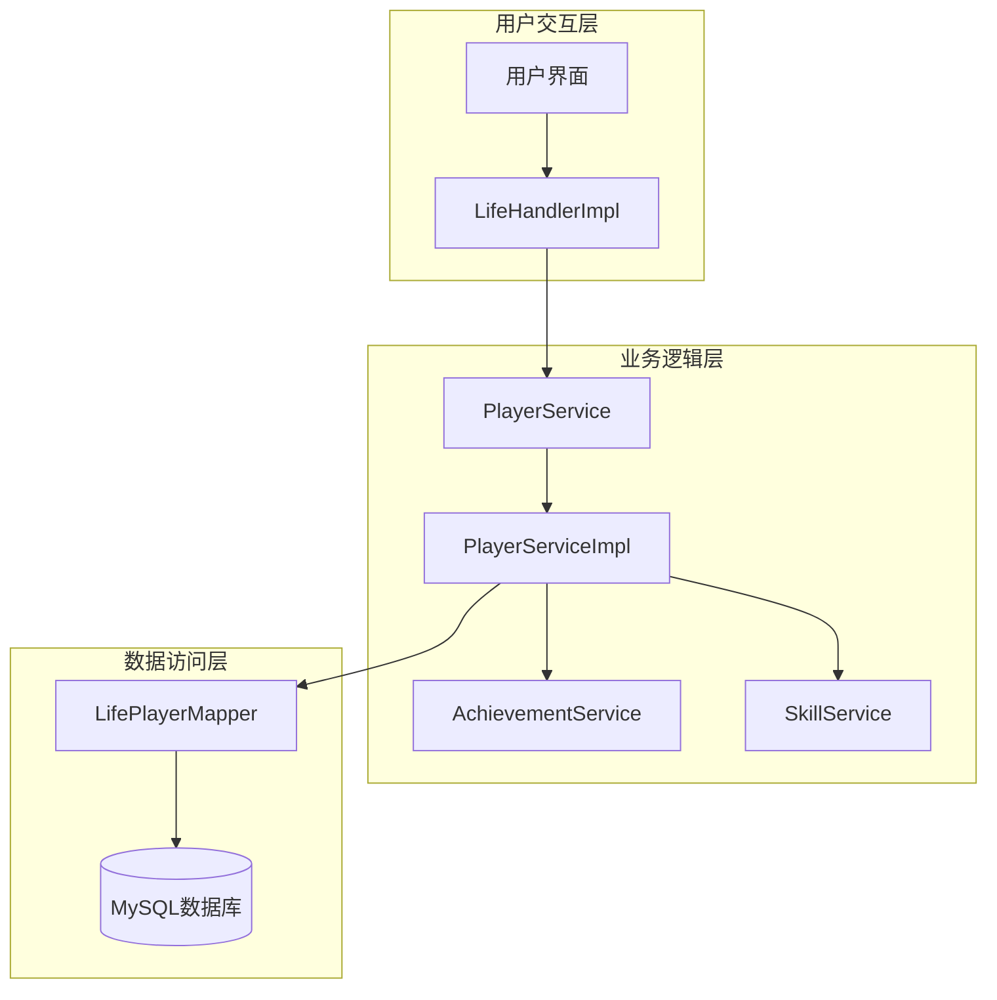
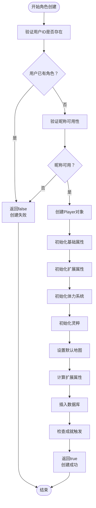
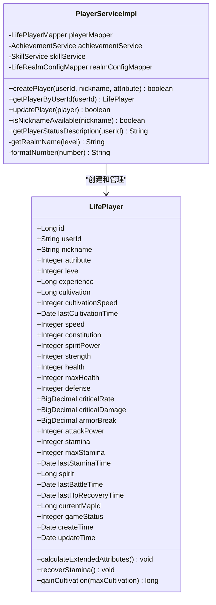
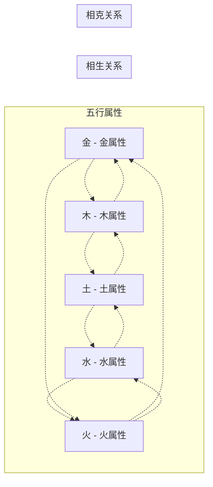
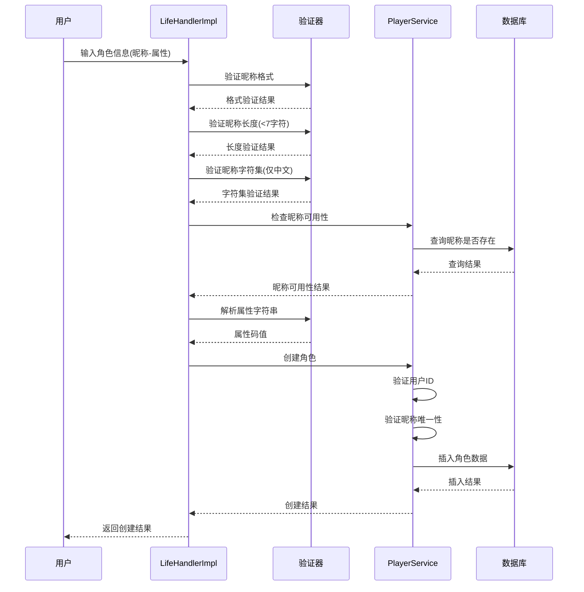
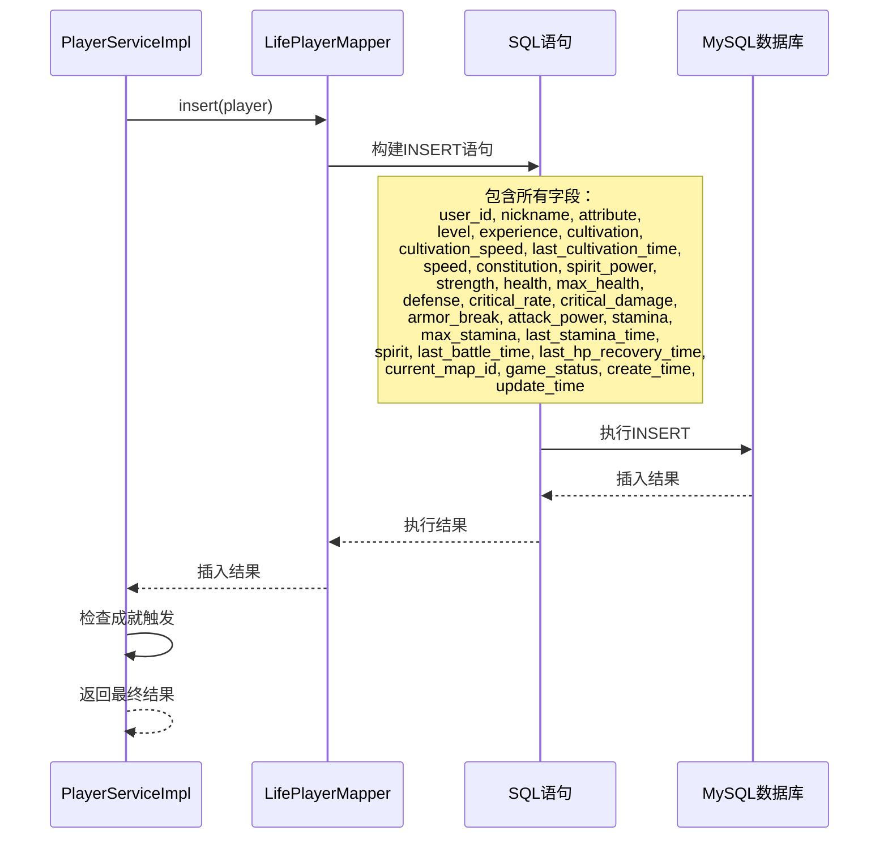

# 角色创建流程文档

<cite>
**本文档引用的文件**
- [PlayerServiceImpl.java](file://Life/src/main/java/com/bot/life/service/impl/PlayerServiceImpl.java)
- [LifePlayer.java](file://Life/src/main/java/com/bot/life/dao/entity/LifePlayer.java)
- [LifePlayerMapper.xml](file://Life/src/main/resources/mapper/LifePlayerMapper.xml)
- [LifeHandlerImpl.java](file://Life/src/main/java/com/bot/life/service/impl/LifeHandlerImpl.java)
- [ENAttribute.java](file://Life/src/main/java/com/bot/life/enums/ENAttribute.java)
- [LifePlayerMapper.java](file://Life/src/main/java/com/bot/life/dao/mapper/LifePlayerMapper.java)
</cite>

## 目录
1. [简介](#简介)
2. [项目架构概览](#项目架构概览)
3. [角色创建核心流程](#角色创建核心流程)
4. [数据模型与表结构](#数据模型与表结构)
5. [详细组件分析](#详细组件分析)
6. [参数验证机制](#参数验证机制)
7. [数据库操作详解](#数据库操作详解)
8. [扩展点指导](#扩展点指导)
9. [常见问题解决方案](#常见问题解决方案)
10. [性能优化建议](#性能优化建议)

## 简介

《浮生卷》是一款修仙题材的角色扮演游戏，角色创建是玩家进入游戏世界的首要步骤。本文档详细阐述了从用户输入验证到数据持久化的完整角色创建流程，包括系统如何验证昵称唯一性、用户是否已存在角色，以及各字段的初始化值及其业务含义。

## 项目架构概览

**图表来源**
- [LifeHandlerImpl.java](file://Life/src/main/java/com/bot/life/service/impl/LifeHandlerImpl.java#L337-L382)
- [PlayerServiceImpl.java](file://Life/src/main/java/com/bot/life/service/impl/PlayerServiceImpl.java#L21-L228)

## 角色创建核心流程

角色创建的核心流程遵循严格的验证和初始化步骤：

**图表来源**
- [PlayerServiceImpl.java](file://Life/src/main/java/com/bot/life/service/impl/PlayerServiceImpl.java#L41-L105)

**章节来源**
- [PlayerServiceImpl.java](file://Life/src/main/java/com/bot/life/service/impl/PlayerServiceImpl.java#L41-L105)

## 数据模型与表结构

### life_player 表结构

| 字段名 | 类型 | 默认值 | 业务含义 |
|--------|------|--------|----------|
| id | BIGINT | 自增 | 主键标识符 |
| user_id | VARCHAR(255) | - | 用户唯一标识 |
| nickname | VARCHAR(255) | - | 角色昵称 |
| attribute | INTEGER | - | 角色属性（1金2木3水4火5土） |
| level | INTEGER | 1 | 当前等级 |
| experience | BIGINT | 0 | 当前经验值 |
| cultivation | BIGINT | 0 | 修为值 |
| cultivation_speed | INTEGER | 10 | 修炼速度 |
| last_cultivation_time | TIMESTAMP | 当前时间 | 上次修炼时间 |
| speed | INTEGER | 1 | 速度属性 |
| constitution | INTEGER | 1 | 体质属性 |
| spirit_power | INTEGER | 1 | 灵力属性 |
| strength | INTEGER | 1 | 力量属性 |
| health | INTEGER | 10 | 当前生命值 |
| max_health | INTEGER | 10 | 最大生命值 |
| defense | INTEGER | 1 | 防御力 |
| critical_rate | DECIMAL(5,2) | 0.00 | 暴击率 |
| critical_damage | DECIMAL(5,2) | 110.00 | 暴击伤害 |
| armor_break | DECIMAL(5,2) | 0.00 | 破甲率 |
| attack_power | INTEGER | 6 | 攻击力 |
| stamina | INTEGER | 100 | 当前体力 |
| max_stamina | INTEGER | 100 | 最大体力 |
| last_stamina_time | TIMESTAMP | 当前时间 | 上次体力恢复时间 |
| spirit | BIGINT | 1000 | 灵粹（游戏货币） |
| last_battle_time | TIMESTAMP | NULL | 上次战斗时间 |
| last_hp_recovery_time | TIMESTAMP | NULL | 上次血量恢复时间 |
| current_map_id | BIGINT | 1 | 当前所在地图ID |
| game_status | INTEGER | 0 | 游戏状态（0正常1战斗中2组队中） |
| create_time | TIMESTAMP | 当前时间 | 创建时间 |
| update_time | TIMESTAMP | 当前时间 | 更新时间 |

**章节来源**
- [LifePlayer.java](file://Life/src/main/java/com/bot/life/dao/entity/LifePlayer.java#L12-L51)
- [LifePlayerMapper.xml](file://Life/src/main/resources/mapper/LifePlayerMapper.xml#L5-L35)

## 详细组件分析

### PlayerServiceImpl 核心实现

PlayerServiceImpl 是角色创建的核心服务类，负责处理角色创建的所有业务逻辑：

**图表来源**
- [PlayerServiceImpl.java](file://Life/src/main/java/com/bot/life/service/impl/PlayerServiceImpl.java#L21-L228)
- [LifePlayer.java](file://Life/src/main/java/com/bot/life/dao/entity/LifePlayer.java#L12-L130)

### 角色属性系统

角色属性系统采用五行相生相克的设计理念：

**图表来源**
- [ENAttribute.java](file://Life/src/main/java/com/bot/life/enums/ENAttribute.java#L6-L63)

**章节来源**
- [PlayerServiceImpl.java](file://Life/src/main/java/com/bot/life/service/impl/PlayerServiceImpl.java#L41-L105)
- [LifePlayer.java](file://Life/src/main/java/com/bot/life/dao/entity/LifePlayer.java#L56-L76)

## 参数验证机制

### 用户输入验证流程

**图表来源**
- [LifeHandlerImpl.java](file://Life/src/main/java/com/bot/life/service/impl/LifeHandlerImpl.java#L337-L382)

### 验证规则详解

| 验证项 | 规则 | 错误处理 |
|--------|------|----------|
| 昵称格式 | 必须为中文字符 | 返回"昵称只能包含中文！" |
| 昵称长度 | 不超过7个字符 | 返回"昵称不能超过7个字！" |
| 昵称唯一性 | 数据库查询确认 | 返回"昵称已被使用，请选择其他昵称！" |
| 属性有效性 | 枚举值匹配 | 返回"派系错误！请选择：金、木、水、火、土" |
| 用户ID | 不能为空且唯一 | 在createPlayer方法中验证 |

**章节来源**
- [LifeHandlerImpl.java](file://Life/src/main/java/com/bot/life/service/impl/LifeHandlerImpl.java#L346-L363)

## 数据库操作详解

### MyBatis 映射配置

角色创建的数据库操作通过 MyBatis 的 LifePlayerMapper 完成：

**图表来源**
- [LifePlayerMapper.xml](file://Life/src/main/resources/mapper/LifePlayerMapper.xml#L77-L97)

### 数据库约束与索引

| 约束类型 | 字段 | 约束条件 | 业务意义 |
|----------|------|----------|----------|
| 主键 | id | 自增 | 唯一标识每个角色 |
| 唯一索引 | user_id | 唯一 | 保证用户只能创建一个角色 |
| 唯一索引 | nickname | 唯一 | 保证昵称全局唯一 |
| 普通索引 | create_time | - | 用于按创建时间查询 |
| 普通索引 | update_time | - | 用于按更新时间查询 |

**章节来源**
- [LifePlayerMapper.xml](file://Life/src/main/resources/mapper/LifePlayerMapper.xml#L77-L97)

## 扩展点指导

### 添加新的角色属性

要在角色创建过程中添加新的属性，需要以下步骤：

1. **修改数据模型**：
   - 在 [LifePlayer.java](file://Life/src/main/java/com/bot/life/dao/entity/LifePlayer.java) 中添加新的字段
   - 更新 `calculateExtendedAttributes()` 方法以包含新属性的计算逻辑

2. **更新数据库映射**：
   - 修改 [LifePlayerMapper.xml](file://Life/src/main/resources/mapper/LifePlayerMapper.xml) 中的字段列表
   - 更新 INSERT 和 UPDATE 语句

3. **修改初始化逻辑**：
   - 在 [PlayerServiceImpl.java](file://Life/src/main/java/com/bot/life/service/impl/PlayerServiceImpl.java) 的 `createPlayer` 方法中添加初始化代码

4. **添加验证规则**：
   - 在 [LifeHandlerImpl.java](file://Life/src/main/java/com/bot/life/service/impl/LifeHandlerImpl.java) 中添加相应的验证逻辑

### 修改初始配置

可以通过以下方式修改角色的初始配置：

1. **修改基础属性**：
   - 在 `createPlayer` 方法中调整初始值
   - 例如：`player.setSpeed(2)` 将初始速度改为2

2. **调整属性计算公式**：
   - 修改 `calculateExtendedAttributes()` 方法中的计算逻辑
   - 例如：将体质对最大生命值的影响从10倍改为15倍

3. **更改初始地图**：
   - 修改 `player.setCurrentMapId(2L)` 使用不同的地图ID

**章节来源**
- [PlayerServiceImpl.java](file://Life/src/main/java/com/bot/life/service/impl/PlayerServiceImpl.java#L53-L94)
- [LifePlayer.java](file://Life/src/main/java/com/bot/life/dao/entity/LifePlayer.java#L56-L76)

## 常见问题解决方案

### 昵称冲突处理

**问题描述**：多个用户尝试使用相同的昵称创建角色

**解决方案**：
1. 系统在创建角色前会调用 `isNicknameAvailable()` 方法进行检查
2. 如果昵称已被占用，返回 `false` 并提示用户选择其他昵称
3. 前端应提供实时验证反馈，避免提交无效数据

**代码位置**：[PlayerServiceImpl.java](file://Life/src/main/java/com/bot/life/service/impl/PlayerServiceImpl.java#L126-L128)

### 数据库插入异常

**问题描述**：角色创建过程中出现数据库插入失败

**解决方案**：
1. **检查数据库连接**：确保数据库服务正常运行
2. **验证数据完整性**：检查必填字段是否为空
3. **处理并发问题**：使用唯一索引防止并发插入冲突
4. **异常捕获**：在 `createPlayer` 方法中捕获并处理异常

**异常处理代码**：[PlayerServiceImpl.java](file://Life/src/main/java/com/bot/life/service/impl/PlayerServiceImpl.java#L95-L105)

### 用户重复创建角色

**问题描述**：同一个用户多次尝试创建角色

**解决方案**：
1. 系统在创建角色前会检查用户是否已存在角色
2. 如果用户已有角色，直接返回 `false`
3. 前端应限制创建按钮的状态，避免重复提交

**验证逻辑**：[PlayerServiceImpl.java](file://Life/src/main/java/com/bot/life/service/impl/PlayerServiceImpl.java#L43-L45)

### 性能优化建议

1. **数据库索引优化**：
   - 确保 `user_id` 和 `nickname` 字段上有唯一索引
   - 考虑为常用查询字段添加索引

2. **缓存策略**：
   - 缓存常用的属性配置信息
   - 对频繁查询的结果进行缓存

3. **批量操作**：
   - 对于大量数据的操作，考虑使用批量插入

4. **连接池配置**：
   - 合理配置数据库连接池参数
   - 监控连接池使用情况

**章节来源**
- [PlayerServiceImpl.java](file://Life/src/main/java/com/bot/life/service/impl/PlayerServiceImpl.java#L95-L105)

## 性能优化建议

### 数据库层面优化

1. **索引优化**：
   - 为 `user_id` 字段添加唯一索引，防止重复创建
   - 为 `nickname` 字段添加唯一索引，确保昵称唯一性
   - 考虑为 `create_time` 和 `update_time` 添加普通索引

2. **查询优化**：
   - 使用 `EXPLAIN` 分析查询计划，确保索引被正确使用
   - 避免全表扫描，特别是在高并发场景下

3. **事务管理**：
   - 确保角色创建操作在一个事务中完成
   - 避免部分成功导致的数据不一致

### 应用层面优化

1. **并发控制**：
   - 使用分布式锁防止同一用户的并发创建请求
   - 实现幂等性设计，确保重复请求的安全性

2. **资源管理**：
   - 合理管理数据库连接资源
   - 使用连接池避免频繁创建和销毁连接

3. **监控告警**：
   - 监控角色创建接口的响应时间和成功率
   - 设置异常告警机制，及时发现和处理问题

### 缓存策略

1. **属性配置缓存**：
   - 缓存五行属性的相生相克关系
   - 缓存初始属性配置

2. **用户状态缓存**：
   - 缓存用户的创建状态，减少数据库查询
   - 使用 Redis 等内存数据库提高查询效率

通过以上优化措施，可以显著提升角色创建流程的性能和稳定性，为玩家提供更好的游戏体验。