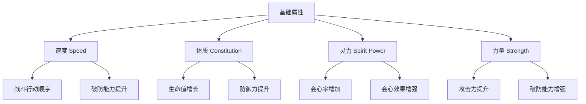
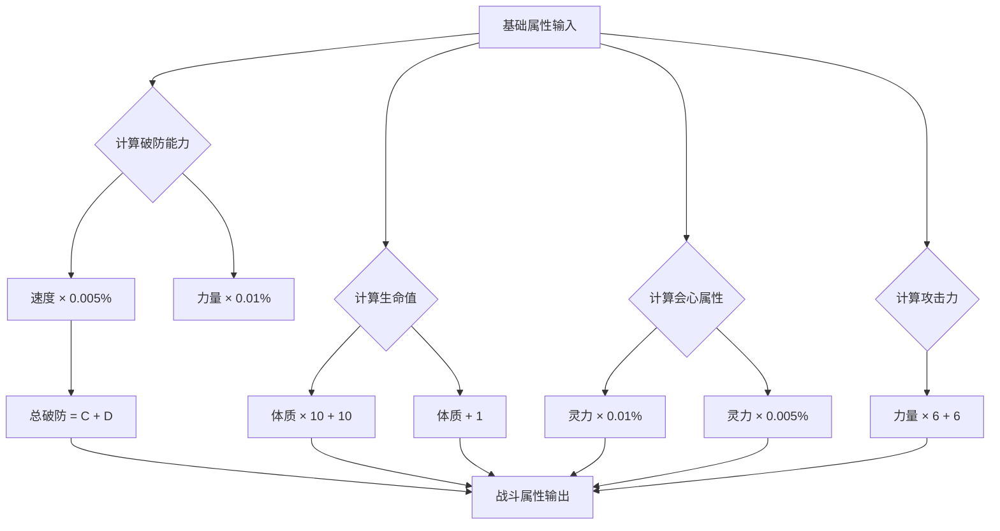
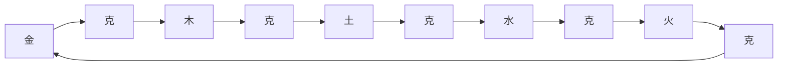
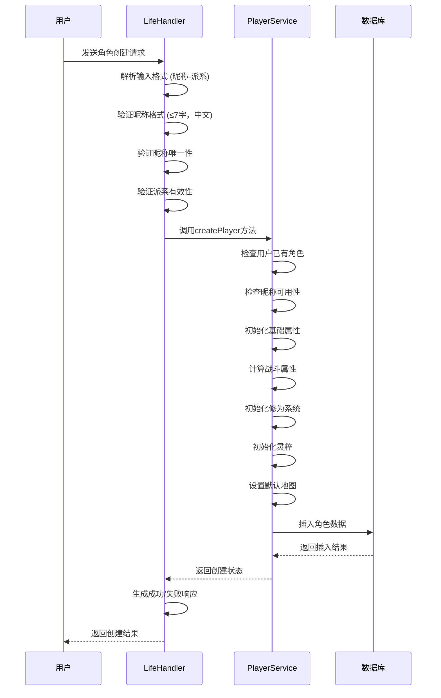
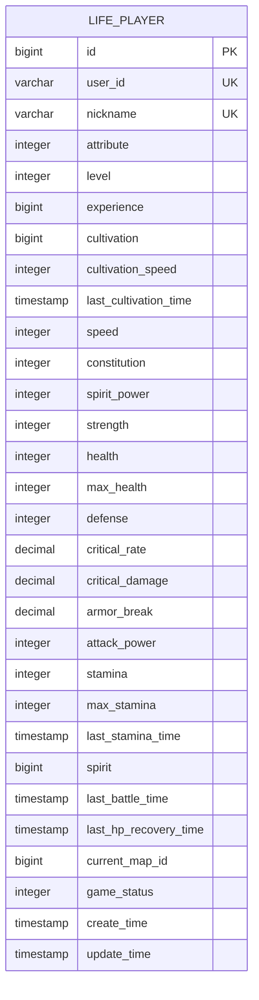
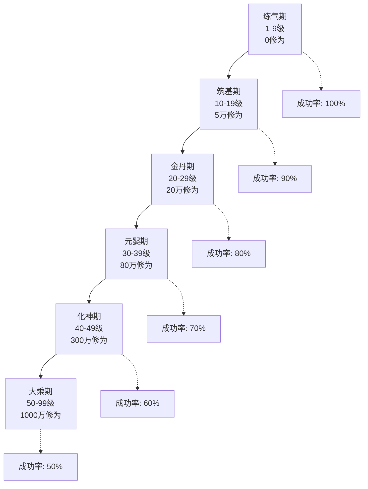
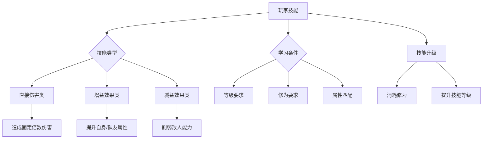
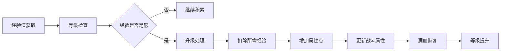

# 角色系统

<cite>
**本文档引用的文件**
- [PlayerServiceImpl.java](file://Life/src/main/java/com/bot/life/service/impl/PlayerServiceImpl.java)
- [LifePlayer.java](file://Life/src/main/java/com/bot/life/dao/entity/LifePlayer.java)
- [PlayerService.java](file://Life/src/main/java/com/bot/life/service/PlayerService.java)
- [LifeHandlerImpl.java](file://Life/src/main/java/com/bot/life/service/impl/LifeHandlerImpl.java)
- [RealmServiceImpl.java](file://Life/src/main/java/com/bot/life/service/impl/RealmServiceImpl.java)
- [SkillServiceImpl.java](file://Life/src/main/java/com/bot/life/service/impl/SkillServiceImpl.java)
- [LifePlayerMapper.xml](file://Life/src/main/resources/mapper/LifePlayerMapper.xml)
- [Life_Realm_Breakthrough_System.md](file://Life_Realm_Breakthrough_System.md)
- [浮生卷开发说明.md](file://浮生卷开发说明.md)
</cite>

## 目录
1. [系统概述](#系统概述)
2. [角色基础属性体系](#角色基础属性体系)
3. [战斗属性计算机制](#战斗属性计算机制)
4. [派系系统与成长影响](#派系系统与成长影响)
5. [角色创建流程](#角色创建流程)
6. [数据持久化架构](#数据持久化架构)
7. [境界突破系统](#境界突破系统)
8. [技能系统集成](#技能系统集成)
9. [角色成长机制](#角色成长机制)
10. [开发者扩展指南](#开发者扩展指南)

## 系统概述

浮生卷的角色系统是一个完整的修仙养成游戏框架，采用基于属性的战斗机制和境界突破的成长体系。系统围绕四大基础属性展开，通过复杂的计算公式生成六大战斗属性，形成独特的修仙角色培养体系。

### 核心设计理念

- **属性驱动**：角色成长完全基于属性点分配和境界突破
- **层次化发展**：从基础属性到战斗属性，再到境界突破的渐进式成长
- **策略性选择**：不同派系提供不同的成长路径和战斗风格
- **持久化存储**：完整的数据库设计确保角色数据的安全保存

## 角色基础属性体系

### 四大基础属性

角色系统包含四个核心基础属性，每个属性都有其独特的成长机制和战斗影响：

**图表来源**
- [LifePlayer.java](file://Life/src/main/java/com/bot/life/dao/entity/LifePlayer.java#L56-L76)

### 属性初始值与成长规则

| 属性类别 | 初始值 | 成长方式 | 影响范围 |
|---------|--------|----------|----------|
| 速度 | 1 | 每点增加0.005%破防 | 战斗行动顺序、破防能力 |
| 体质 | 1 | 每点增加10点生命值、1点防御 | 生命值上限、防御力 |
| 灵力 | 1 | 每点增加0.01%会心率、0.005%会心效果 | 会心攻击、战斗表现 |
| 力量 | 1 | 每点增加6点攻击力、0.01%破防 | 攻击力、破防能力 |

**章节来源**
- [LifePlayer.java](file://Life/src/main/java/com/bot/life/dao/entity/LifePlayer.java#L56-L76)

## 战斗属性计算机制

### 扩展属性生成算法

战斗属性（拓展属性）通过复杂公式从基础属性计算得出，形成完整的战斗能力体系：

**图表来源**
- [LifePlayer.java](file://Life/src/main/java/com/bot/life/dao/entity/LifePlayer.java#L56-L76)

### 属性计算公式详解

战斗属性的计算遵循以下精确公式：

1. **破防能力 (Armor Break)**：`速度 × 0.005% + 力量 × 0.01%`
2. **生命值上限 (Max Health)**：`10 + 体质 × 10`
3. **防御力 (Defense)**：`1 + 体质`
4. **会心率 (Critical Rate)**：`灵力 × 0.01%`
5. **会心效果 (Critical Damage)**：`110 + 灵力 × 0.005%`
6. **攻击力 (Attack Power)**：`6 + 力量 × 6`

**章节来源**
- [LifePlayer.java](file://Life/src/main/java/com/bot/life/dao/entity/LifePlayer.java#L56-L76)

## 派系系统与成长影响

### 五大派系特性

浮生卷提供五个独特的派系，每个派系都有其特定的成长优势和战斗特色：

| 派系 | 攻击力星级 | 防御力星级 | 养成难度 | 特殊能力 |
|------|------------|------------|----------|----------|
| 金 | ★★★★★ | ★★ | ★★★★ | 强大的破坏力，擅长一力破万法 |
| 木 | ★★★ | ★★★★ | ★★★ | 强大的恢复能力，治疗和用毒专家 |
| 水 | ★★★★ | ★★★★ | ★★★★ | 流水不争先但滔滔不绝，各领域均衡发展 |
| 火 | ★★★★ | ★★★ | ★★★ | 持续伤害专家，可观爆发力 |
| 土 | ★★★ | ★★★★ | ★★★★★ | 超强防御提供者，控制能力出色 |

### 派系克制关系

系统实现了五行相克的平衡机制：

**图表来源**
- [浮生卷开发说明.md](file://浮生卷开发说明.md#L41-L46)

**章节来源**
- [LifeHandlerImpl.java](file://Life/src/main/java/com/bot/life/service/impl/LifeHandlerImpl.java#L323-L332)

## 角色创建流程

### 完整创建流程图

**图表来源**
- [LifeHandlerImpl.java](file://Life/src/main/java/com/bot/life/service/impl/LifeHandlerImpl.java#L337-L382)
- [PlayerServiceImpl.java](file://Life/src/main/java/com/bot/life/service/impl/PlayerServiceImpl.java#L41-L97)

### 输入验证规则

角色创建过程包含严格的输入验证机制：

1. **格式验证**：必须符合"昵称-派系"格式
2. **昵称验证**：
   - 长度限制：不超过7个字符
   - 字符类型：仅允许中文字符
   - 唯一性：确保昵称未被占用
3. **派系验证**：支持金、木、水、火、土五个派系

### 角色初始化参数

创建新角色时的默认参数设置：

| 参数类别 | 默认值 | 说明 |
|----------|--------|------|
| 等级 | 1 | 新角色从练气期开始 |
| 修为 | 0 | 初始修为为零 |
| 修炼速度 | 10 | 每分钟获得10点修为 |
| 基础属性 | 1 | 四大基础属性均为1 |
| 战斗属性 | 详见计算 | 基于基础属性自动计算 |
| 灵粹 | 1000 | 游戏货币初始值 |
| 体力 | 100/100 | 最大体力值 |

**章节来源**
- [PlayerServiceImpl.java](file://Life/src/main/java/com/bot/life/service/impl/PlayerServiceImpl.java#L41-L97)

## 数据持久化架构

### life_player 表结构设计

角色数据通过完整的数据库表结构进行持久化存储：

**图表来源**
- [LifePlayerMapper.xml](file://Life/src/main/resources/mapper/LifePlayerMapper.xml#L5-L35)

### 字段约束与索引设计

| 字段类型 | 约束条件 | 设计目的 |
|----------|----------|----------|
| user_id | UNIQUE | 确保用户唯一绑定 |
| nickname | UNIQUE | 避免昵称冲突 |
| id | PRIMARY KEY | 主键标识 |
| create_time | NOT NULL | 记录创建时间 |
| update_time | NOT NULL | 记录更新时间 |

### 数据访问层设计

系统采用MyBatis ORM框架实现数据持久化：

1. **实体类映射**：LifePlayer实体类与数据库表字段一一对应
2. **Mapper接口**：提供标准化的数据访问方法
3. **XML配置**：定义SQL语句和结果映射
4. **事务管理**：确保数据一致性

**章节来源**
- [LifePlayerMapper.xml](file://Life/src/main/resources/mapper/LifePlayerMapper.xml#L77-L97)

## 境界突破系统

### 境界体系架构

境界突破系统是角色成长的核心机制，通过修为积累和概率突破实现角色的质变：

**图表来源**
- [RealmServiceImpl.java](file://Life/src/main/java/com/bot/life/service/impl/RealmServiceImpl.java#L43-L121)

### 突破机制详解

境界突破采用概率性机制，包含成功和失败两种结果：

1. **成功条件**：修为充足且随机数小于成功率
2. **成功奖励**：境界提升，属性点大幅增加
3. **失败后果**：修为损失，需要重新积累
4. **概率计算**：基于JSON配置的动态成功率

### 突破奖励配置

每个境界提供不同的属性奖励，支持JSON格式配置：

| 境界 | 突破奖励示例 | 说明 |
|------|-------------|------|
| 筑基期 | 全属性+5 | 基础属性全面提升 |
| 金丹期 | 全属性+10，灵力+15，修炼速度+20 | 灵力和修炼效率显著提升 |
| 元婴期 | 全属性+20，修炼速度+50 | 核心属性大幅提升 |
| 化神期 | 全属性+30，修炼速度+100 | 极致属性强化 |
| 大乘期 | 全属性+50，修炼速度+200 | 最高境界奖励 |

**章节来源**
- [RealmServiceImpl.java](file://Life/src/main/java/com/bot/life/service/impl/RealmServiceImpl.java#L193-L236)

## 技能系统集成

### 技能学习机制

技能系统与角色属性紧密集成，提供多样化的战斗能力：

**图表来源**
- [SkillServiceImpl.java](file://Life/src/main/java/com/bot/life/service/impl/SkillServiceImpl.java#L90-L114)

### 基础技能分配

系统为每个派系分配相应的基础技能：

| 派系 | 基础技能ID | 技能特点 |
|------|-----------|----------|
| 金 | 1 | 破坏力专家，高伤害输出 |
| 木 | 2 | 治疗和辅助，生存能力强 |
| 水 | 3 | 平衡型技能，多领域覆盖 |
| 火 | 4 | 持续伤害，爆发力强 |
| 土 | 5 | 防御和控制，团队保护 |

**章节来源**
- [SkillServiceImpl.java](file://Life/src/main/java/com/bot/life/service/impl/SkillServiceImpl.java#L279-L291)

## 角色成长机制

### 经验值与等级系统

角色通过经验积累实现等级提升，每次升级带来属性点奖励：

**图表来源**
- [PlayerServiceImpl.java](file://Life/src/main/java/com/bot/life/service/impl/PlayerServiceImpl.java#L185-L220)

### 修为系统设计

修为是角色修炼的核心指标，通过时间积累和境界突破实现：

1. **自动积累**：离线状态下每分钟获得修炼速度对应的修为
2. **境界限制**：每个境界有修为上限，达到上限后停止积累
3. **突破消耗**：境界突破需要消耗大量修为
4. **属性影响**：修炼速度受境界和属性影响

### 体力系统

体力系统模拟修仙者的精力消耗，影响战斗和探索能力：

- **恢复机制**：每5分钟恢复1点体力
- **上限管理**：体力达到上限后停止恢复
- **战斗消耗**：战斗中消耗体力
- **探索限制**：体力不足时无法进行某些活动

**章节来源**
- [LifePlayer.java](file://Life/src/main/java/com/bot/life/dao/entity/LifePlayer.java#L78-L96)

## 开发者扩展指南

### 添加新属性

如需扩展角色属性系统，可按以下步骤进行：

1. **修改实体类**：在LifePlayer类中添加新的属性字段
2. **更新计算方法**：在calculateExtendedAttributes()方法中添加计算逻辑
3. **修改数据库表**：在life_player表中添加相应字段
4. **更新Mapper**：修改MyBatis映射配置
5. **添加验证逻辑**：在创建和更新逻辑中处理新属性

### 扩展派系系统

添加新的派系需要：

1. **定义派系常量**：在枚举或常量类中定义新派系
2. **更新验证逻辑**：在输入验证中添加新派系支持
3. **配置基础技能**：为新派系分配基础技能
4. **调整成长机制**：根据派系特点调整属性成长比例

### 境界突破扩展

扩展境界突破系统：

1. **添加境界配置**：在life_realm_config表中添加新境界
2. **更新突破逻辑**：在RealmServiceImpl中添加新境界处理
3. **配置奖励属性**：设置新境界的属性奖励
4. **测试成功率**：验证突破概率和奖励机制

### 技能系统扩展

扩展技能系统：

1. **定义技能类型**：在ENSkillType中添加新技能类型
2. **创建技能实体**：定义技能相关的数据库表结构
3. **实现技能逻辑**：在SkillServiceImpl中添加新技能处理
4. **配置技能效果**：设置技能的伤害、冷却、消耗等参数

**章节来源**
- [PlayerService.java](file://Life/src/main/java/com/bot/life/service/PlayerService.java#L9-L76)
- [SkillService.java](file://Life/src/main/java/com/bot/life/service/SkillService.java#L1-L62)