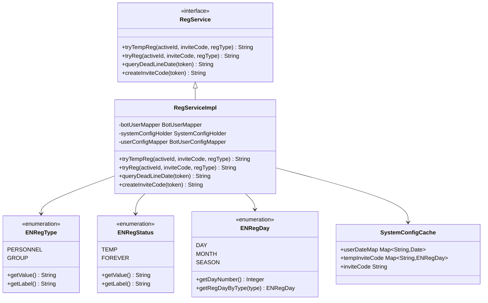
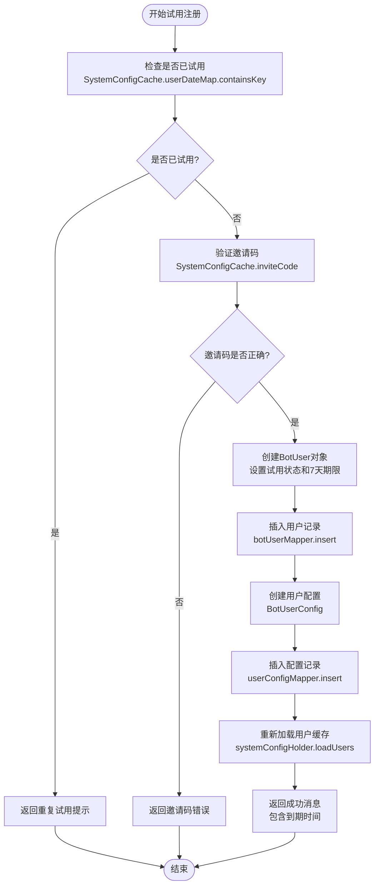
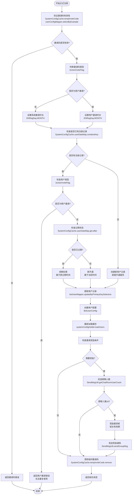
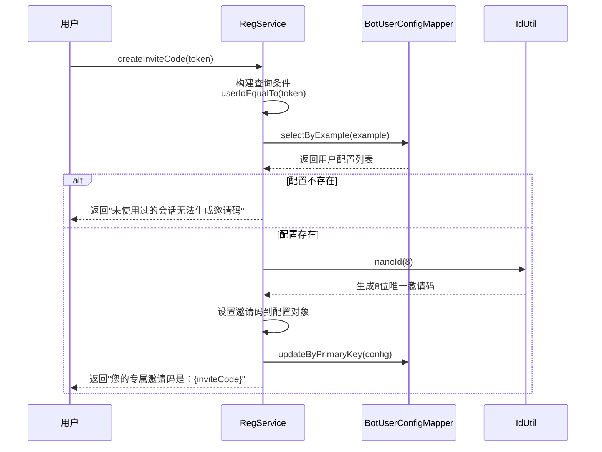
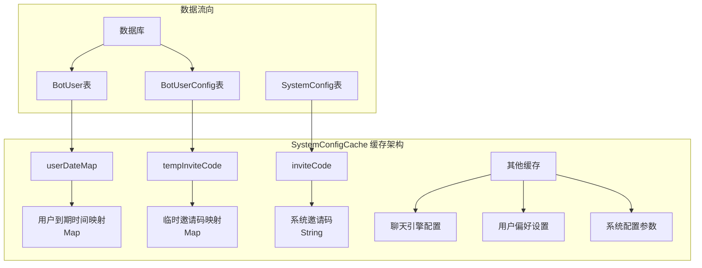
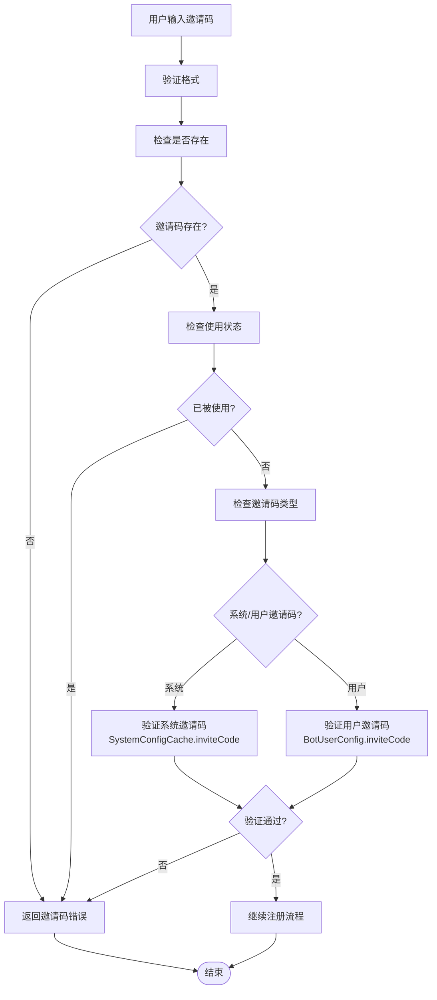
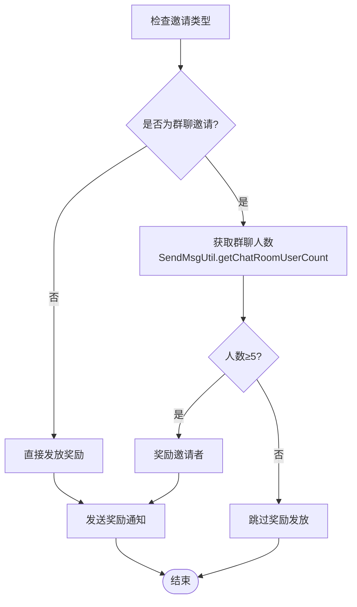
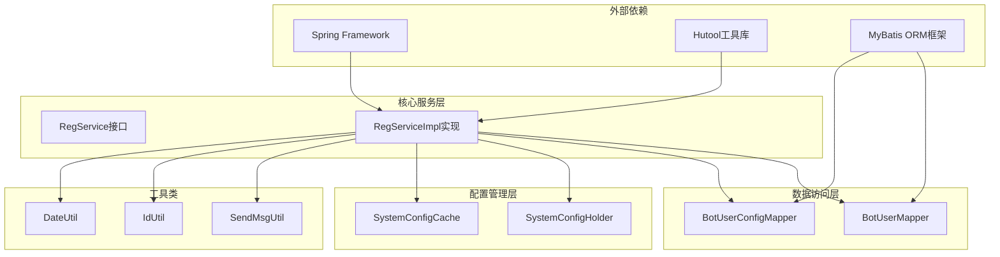
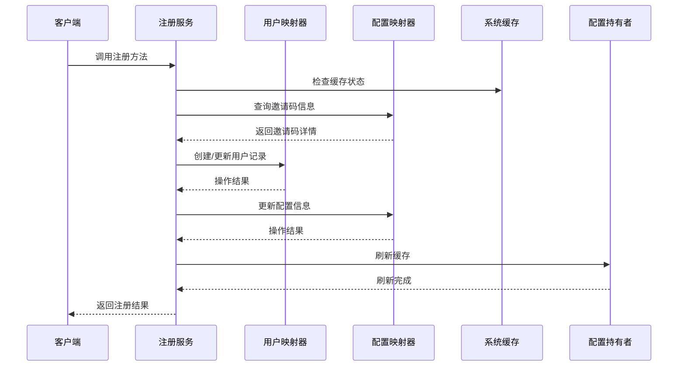

# 注册系统详细文档

<cite>
**本文档引用的文件**
- [RegServiceImpl.java](file://Base/src/main/java/com/bot/base/service/impl/RegServiceImpl.java)
- [RegService.java](file://Base/src/main/java/com/bot/base/service/RegService.java)
- [ENRegType.java](file://Common/src/main/java/com/bot/common/enums/ENRegType.java)
- [ENRegStatus.java](file://Common/src/main/java/com/bot/common/enums/ENRegStatus.java)
- [ENRegDay.java](file://Common/src/main/java/com/bot/common/enums/ENRegDay.java)
- [SystemConfigCache.java](file://Common/src/main/java/com/bot/common/config/SystemConfigCache.java)
- [BaseConsts.java](file://Common/src/main/java/com/bot/common/constant/BaseConsts.java)
- [CheckRegServiceImpl.java](file://Game/src/main/java/com/bot/game/service/impl/CheckRegServiceImpl.java)
</cite>

## 目录
1. [系统概述](#系统概述)
2. [核心组件架构](#核心组件架构)
3. [注册类型与状态枚举](#注册类型与状态枚举)
4. [三大核心功能详解](#三大核心功能详解)
5. [缓存机制与数据流](#缓存机制与数据流)
6. [常见问题与解决方案](#常见问题与解决方案)
7. [系统集成与依赖关系](#系统集成与依赖关系)
8. [总结](#总结)

## 系统概述

注册系统是Bot平台的核心功能模块，负责管理用户的试用注册、正式注册以及邀请码机制。该系统采用分层架构设计，通过RegServiceImpl类实现三大核心功能：试用注册(tryTempReg)、正式注册(tryReg)和邀请码生成(createInviteCode)，为用户提供灵活的注册体验。

系统支持两种注册类型：
- **个人注册**：针对单个用户
- **群组注册**：针对微信群聊

支持两种注册状态：
- **试用状态**：临时使用权限，通常为7天试用期
- **正式状态**：永久使用权限

## 核心组件架构

**图表来源**
- [RegServiceImpl.java](file://Base/src/main/java/com/bot/base/service/impl/RegServiceImpl.java#L29-L171)
- [RegService.java](file://Base/src/main/java/com/bot/base/service/RegService.java#L5-L35)
- [ENRegType.java](file://Common/src/main/java/com/bot/common/enums/ENRegType.java#L8-L17)
- [ENRegStatus.java](file://Common/src/main/java/com/bot/common/enums/ENRegStatus.java#L8-L17)
- [ENRegDay.java](file://Common/src/main/java/com/bot/common/enums/ENRegDay.java#L8-L27)
- [SystemConfigCache.java](file://Common/src/main/java/com/bot/common/config/SystemConfigCache.java#L63-L64)

## 注册类型与状态枚举

### ENRegType（注册类型）

注册类型枚举定义了两种用户注册场景：

| 类型 | 值 | 描述 |
|------|-----|------|
| PERSONNEL | "1" | 个人用户注册，适用于单个用户使用 |
| GROUP | "2" | 群组注册，适用于微信群聊共享使用 |

### ENRegStatus（注册状态）

注册状态枚举区分了用户的使用权限级别：

| 状态 | 值 | 描述 |
|------|-----|------|
| TEMP | "0" | 试用状态，临时使用权限 |
| FOREVER | "1" | 正式状态，永久使用权限 |

### ENRegDay（注册时长）

注册时长枚举定义了不同邀请码对应的使用期限：

| 时长类型 | 天数 | 描述 |
|----------|------|------|
| DAY | 7 | 7天试用期 |
| MONTH | 30 | 30天使用期 |
| SEASON | 90 | 90天使用期 |

**章节来源**
- [ENRegType.java](file://Common/src/main/java/com/bot/common/enums/ENRegType.java#L8-L17)
- [ENRegStatus.java](file://Common/src/main/java/com/bot/common/enums/ENRegStatus.java#L8-L17)
- [ENRegDay.java](file://Common/src/main/java/com/bot/common/enums/ENRegDay.java#L8-L27)

## 三大核心功能详解

### 1. 试用注册功能（tryTempReg）

试用注册功能允许新用户在获得邀请码的情况下申请7天免费试用期。

#### 功能特点
- **防重复注册**：通过SystemConfigCache.userDateMap防止同一用户多次试用
- **邀请码验证**：严格验证系统邀请码的有效性
- **自动设置试用期**：为新用户自动设置7天试用期限
- **配置初始化**：为新用户创建初始配置记录

#### 执行流程图

**图表来源**
- [RegServiceImpl.java](file://Base/src/main/java/com/bot/base/service/impl/RegServiceImpl.java#L42-L62)

#### 关键实现细节

1. **重复注册防护**：使用SystemConfigCache.userDateMap作为内存缓存，确保每个用户只能试用一次
2. **邀请码验证**：直接比较传入的邀请码与SystemConfigCache.inviteCode的值
3. **试用期设置**：自动计算7天后的到期时间
4. **配置初始化**：为新用户创建默认配置记录

**章节来源**
- [RegServiceImpl.java](file://Base/src/main/java/com/bot/base/service/impl/RegServiceImpl.java#L42-L62)

### 2. 正式注册功能（tryReg）

正式注册功能是最复杂的业务逻辑，支持系统邀请码和用户邀请码的双重处理机制。

#### 功能特点
- **双重邀请码处理**：区分系统邀请码和用户邀请码
- **智能续期判断**：根据用户历史记录判断是续期还是新开通
- **邀请奖励机制**：为邀请者提供额外使用时间奖励
- **群聊人数验证**：群聊邀请需要满足5人以上才能发放奖励

#### 执行流程图

**图表来源**
- [RegServiceImpl.java](file://Base/src/main/java/com/bot/base/service/impl/RegServiceImpl.java#L66-L144)

#### 核心业务逻辑

1. **邀请码双重验证**：
   - 系统邀请码：存储在SystemConfigCache.tempInviteCode中
   - 用户邀请码：存储在BotUserConfig表中

2. **用户状态判断**：
   - 新用户：直接创建注册记录
   - 老用户：
     - 系统邀请：支持续期或新开通
     - 用户邀请：禁止重复使用

3. **续期逻辑**：
   - 未过期：基于原过期时间续期
   - 已过期：基于当前时间重新计算

4. **邀请奖励机制**：
   - 群聊邀请：必须满足5人以上才能发放奖励
   - 个人邀请：直接发放奖励

**章节来源**
- [RegServiceImpl.java](file://Base/src/main/java/com/bot/base/service/impl/RegServiceImpl.java#L66-L144)

### 3. 邀请码生成功能（createInviteCode）

邀请码生成功能为已注册用户生成唯一的邀请码，用于邀请新用户加入。

#### 功能特点
- **唯一性保证**：使用NanoID算法生成8位唯一标识符
- **用户绑定**：邀请码与用户ID绑定存储
- **状态检查**：只有已使用过的会话才能生成邀请码
- **即时生效**：生成后立即可用于其他用户注册

#### 实现流程

**图表来源**
- [RegServiceImpl.java](file://Base/src/main/java/com/bot/base/service/impl/RegServiceImpl.java#L157-L169)

#### 关键实现细节

1. **状态验证**：确保用户已经使用过服务
2. **唯一性生成**：使用IdUtil.nanoId(8)生成8位唯一标识符
3. **持久化存储**：将邀请码保存到BotUserConfig表的inviteCode字段
4. **即时可用**：生成后立即可用于其他用户的正式注册

**章节来源**
- [RegServiceImpl.java](file://Base/src/main/java/com/bot/base/service/impl/RegServiceImpl.java#L157-L169)

## 缓存机制与数据流

### SystemConfigCache缓存架构

SystemConfigCache作为全局缓存管理器，存储了系统运行所需的各种配置和状态信息：

**图表来源**
- [SystemConfigCache.java](file://Common/src/main/java/com/bot/common/config/SystemConfigCache.java#L63-L64)
- [SystemConfigCache.java](file://Common/src/main/java/com/bot/common/config/SystemConfigCache.java#L35-L35)

### 数据库表结构

| 表名 | 字段 | 用途 |
|------|------|------|
| BotUser | id, status, type, deadLineDate | 用户基本信息和注册状态 |
| BotUserConfig | id, userId, inviteCode | 用户配置和邀请码关联 |

### 缓存更新策略

1. **实时更新**：每次用户注册或续期后立即调用systemConfigHolder.loadUsers()刷新缓存
2. **内存优先**：关键数据优先存储在内存中，提高访问效率
3. **持久化备份**：重要配置信息同时存储在数据库中

**章节来源**
- [SystemConfigCache.java](file://Common/src/main/java/com/bot/common/config/SystemConfigCache.java#L63-L64)
- [RegServiceImpl.java](file://Base/src/main/java/com/bot/base/service/impl/RegServiceImpl.java#L61-L61)
- [RegServiceImpl.java](file://Base/src/main/java/com/bot/base/service/impl/RegServiceImpl.java#L96-L96)

## 常见问题与解决方案

### 1. 邀请码错误处理

#### 问题场景
- 输入的邀请码不存在或已被使用
- 系统邀请码与用户邀请码混淆

#### 解决方案

**图表来源**
- [RegServiceImpl.java](file://Base/src/main/java/com/bot/base/service/impl/RegServiceImpl.java#L48-L50)
- [RegServiceImpl.java](file://Base/src/main/java/com/bot/base/service/impl/RegServiceImpl.java#L71-L72)

### 2. 老用户使用邀请码问题

#### 问题场景
- 老用户尝试使用用户邀请码开通服务
- 系统邀请码与用户邀请码混淆导致错误

#### 解决方案
系统在tryReg方法中明确区分两种邀请码类型：

1. **系统邀请码**：允许老用户使用，支持续期或新开通
2. **用户邀请码**：禁止老用户使用，避免重复邀请

### 3. 邀请奖励发放限制

#### 问题场景
- 群聊邀请人数不足5人
- 邀请奖励发放失败

#### 解决方案
系统在邀请奖励发放前进行人数验证：

**图表来源**
- [RegServiceImpl.java](file://Base/src/main/java/com/bot/base/service/impl/RegServiceImpl.java#L124-L128)
- [RegServiceImpl.java](file://Base/src/main/java/com/bot/base/service/impl/RegServiceImpl.java#L129-L139)

### 4. 重复试用防护

#### 问题场景
- 同一用户多次尝试试用注册
- 缓存失效导致重复注册

#### 解决方案
系统通过多层防护机制确保试用的唯一性：

1. **内存缓存检查**：SystemConfigCache.userDateMap.contains
2. **数据库约束**：BotUser表的唯一性约束
3. **业务逻辑控制**：在注册前进行状态检查

**章节来源**
- [RegServiceImpl.java](file://Base/src/main/java/com/bot/base/service/impl/RegServiceImpl.java#L44-L46)
- [RegServiceImpl.java](file://Base/src/main/java/com/bot/base/service/impl/RegServiceImpl.java#L84-L86)

## 系统集成与依赖关系

### 组件依赖图

**图表来源**
- [RegServiceImpl.java](file://Base/src/main/java/com/bot/base/service/impl/RegServiceImpl.java#L22-L40)

### 数据库交互流程

**图表来源**
- [RegServiceImpl.java](file://Base/src/main/java/com/bot/base/service/impl/RegServiceImpl.java#L42-L62)
- [RegServiceImpl.java](file://Base/src/main/java/com/bot/base/service/impl/RegServiceImpl.java#L66-L144)

### 错误处理机制

系统实现了完善的错误处理机制：

1. **参数验证**：输入参数的合法性检查
2. **业务规则验证**：注册条件的合规性检查
3. **数据库异常处理**：SQL执行异常的捕获和处理
4. **缓存同步**：数据库操作失败时的缓存回滚

**章节来源**
- [RegServiceImpl.java](file://Base/src/main/java/com/bot/base/service/impl/RegServiceImpl.java#L48-L50)
- [RegServiceImpl.java](file://Base/src/main/java/com/bot/base/service/impl/RegServiceImpl.java#L71-L72)
- [RegServiceImpl.java](file://Base/src/main/java/com/bot/base/service/impl/RegServiceImpl.java#L84-L86)

## 总结

Bot注册系统通过RegServiceImpl类实现了完整的用户注册生命周期管理，具有以下核心优势：

### 技术亮点
1. **分层架构设计**：清晰的服务层、数据访问层和缓存层分离
2. **双重邀请码机制**：支持系统邀请和用户邀请的灵活组合
3. **智能续期逻辑**：根据用户历史记录自动判断续期或新开通
4. **邀请奖励机制**：通过群聊人数验证确保奖励发放的合理性

### 业务价值
1. **用户体验优化**：简洁的注册流程和明确的状态反馈
2. **运营策略支持**：通过邀请码机制促进用户增长
3. **资源合理分配**：通过缓存机制提高系统响应性能
4. **数据安全保障**：多重验证机制确保注册过程的安全性

### 扩展性考虑
1. **枚举扩展**：通过ENRegDay等枚举类支持灵活的时长配置
2. **缓存优化**：SystemConfigCache提供了高效的内存缓存机制
3. **异常处理**：完善的错误处理和状态反馈机制
4. **事务管理**：通过Spring事务管理确保数据一致性

该注册系统为Bot平台的用户管理奠定了坚实的基础，通过合理的架构设计和业务逻辑实现，为平台的持续发展提供了可靠的技术支撑。