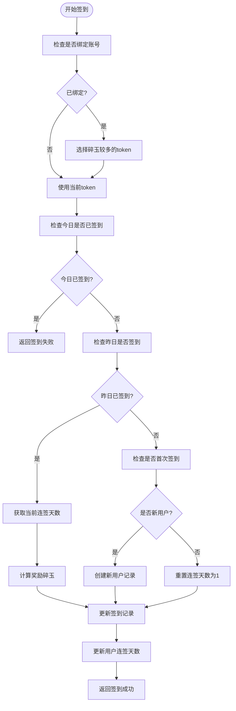
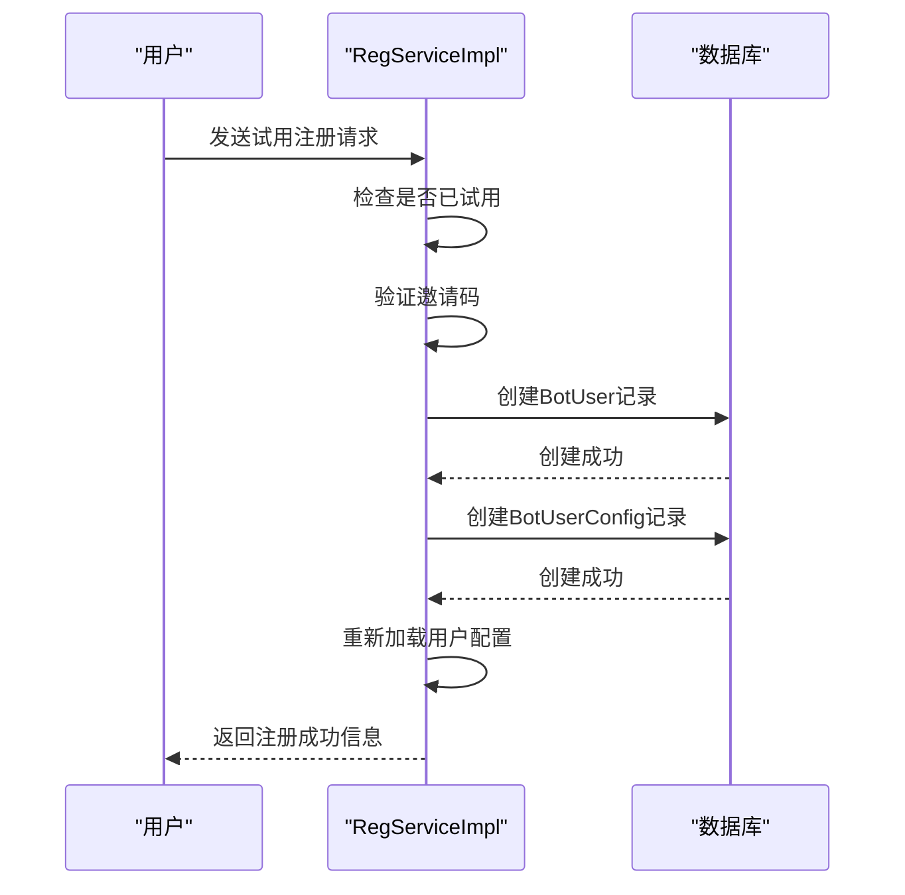
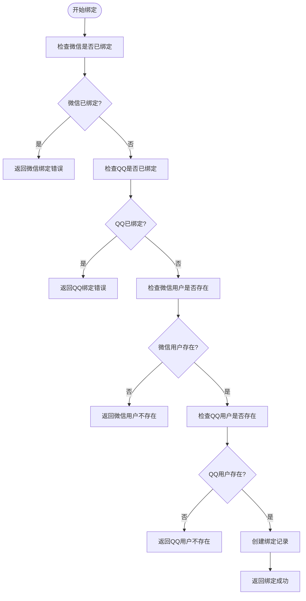
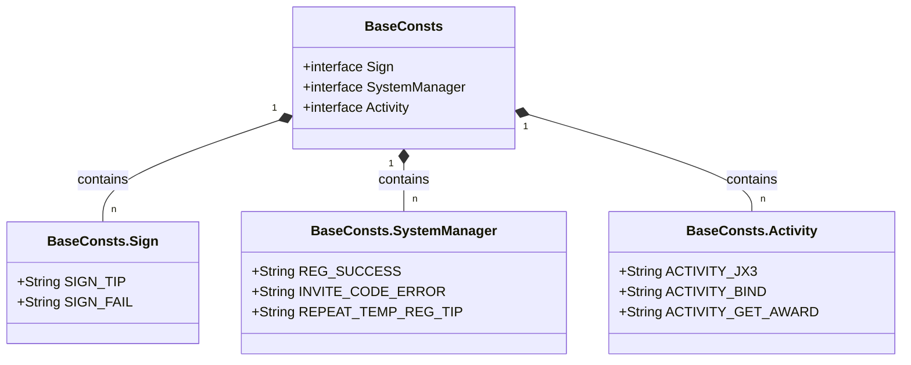

# 用户管理

<cite>
**本文档引用文件**  
- [SignServiceImpl.java](file://Base/src/main/java/com/bot/base/service/impl/SignServiceImpl.java)
- [RegServiceImpl.java](file://Base/src/main/java/com/bot/base/service/impl/RegServiceImpl.java)
- [UserBindServiceImpl.java](file://Base/src/main/java/com/bot/base/service/impl/UserBindServiceImpl.java)
- [BaseConsts.java](file://Common/src/main/java/com/bot/common/constant/BaseConsts.java)
- [ENUserGoodType.java](file://Common/src/main/java/com/bot/common/enums/ENUserGoodType.java)
- [ENRegStatus.java](file://Common/src/main/java/com/bot/common/enums/ENRegStatus.java)
- [ENRegType.java](file://Common/src/main/java/com/bot/common/enums/ENRegType.java)
- [BotUser.java](file://Game/src/main/java/com/bot/game/dao/entity/BotUser.java)
- [BotUserSign.java](file://Game/src/main/java/com/bot/game/dao/entity/BotUserSign.java)
- [UserBind.java](file://Game/src/main/java/com/bot/game/dao/entity/UserBind.java)
- [BotUserBox.java](file://Game/src/main/java/com/bot/game/dao/entity/BotUserBox.java)
- [BotUserConfig.java](file://Game/src/main/java/com/bot/game/dao/entity/BotUserConfig.java)
</cite>

## 目录
1. [引言](#引言)
2. [签到系统实现机制](#签到系统实现机制)
3. [注册系统实现机制](#注册系统实现机制)
4. [用户绑定系统实现机制](#用户绑定系统实现机制)
5. [配置化管理机制](#配置化管理机制)
6. [常见问题解决方案](#常见问题解决方案)
7. [结论](#结论)

## 引言
本系统为Bot项目中的用户管理模块，主要包含签到、注册和用户绑定三大核心功能。通过`SignServiceImpl`实现每日签到逻辑，包括连签天数计算、奖励发放和防止重复签到；通过`RegServiceImpl`管理用户激活、试用注册、邀请码机制和有效期管理；通过`UserBindServiceImpl`实现QQ与微信账号的跨平台绑定及碎玉共享逻辑。所有功能均通过`BaseConsts`常量类和`EN`枚举类进行配置化管理，确保系统的可维护性和扩展性。

## 签到系统实现机制

`SignServiceImpl`类实现了完整的签到系统，处理每日签到逻辑，包括连签天数计算、奖励发放和防止重复签到。

### 签到流程分析
签到功能通过`doQueryReturn`方法处理，当用户输入"签到"时触发。系统首先检查用户是否已绑定账号，若有绑定则选择碎玉较多的一方作为本次签到账户。然后检查当天是否已签到，若已签到则返回失败提示。

**Diagram sources**
- [SignServiceImpl.java](file://Base/src/main/java/com/bot/base/service/impl/SignServiceImpl.java#L50-L120)

**Section sources**
- [SignServiceImpl.java](file://Base/src/main/java/com/bot/base/service/impl/SignServiceImpl.java#L28-L167)
- [BaseConsts.java](file://Common/src/main/java/com/bot/common/constant/BaseConsts.java#L282-L285)

### 连签天数计算与奖励发放
系统通过`BotUser`实体的`signDay`字段记录连续签到天数。若昨日已签到，则连签天数加1；若昨日未签到，则重置为1。奖励碎玉根据连签天数计算：第一天1个，第二天2个，第三天及以后每天3个。

### 防止重复签到机制
系统使用`BotUserSign`表记录每日签到情况，通过`signDate`和`userId`的组合唯一性约束防止重复签到。每次签到前都会查询当天是否已有签到记录，若有则返回"你今天已经签到过了~"的提示。

### 数据持久化过程
签到成功后，系统执行以下持久化操作：
1. 在`BotUserSign`表中插入新的签到记录
2. 在`BotUserBox`表中更新用户的碎玉数量（新增或修改）
3. 更新`BotUser`表中的连签天数

这些操作在`signSuccess`私有方法中实现，并通过`@Transactional`注解确保事务一致性。

## 注册系统实现机制

`RegServiceImpl`类实现了完整的注册系统，支持试用注册、正式注册、邀请码机制和有效期管理。

### 试用注册流程
试用注册通过`tryTempReg`方法实现，允许用户使用系统邀请码进行7天试用。系统首先检查用户是否已试用过，若已试用则返回提示。然后验证邀请码是否正确，若正确则创建用户记录并设置7天有效期。

**Diagram sources**
- [RegServiceImpl.java](file://Base/src/main/java/com/bot/base/service/impl/RegServiceImpl.java#L42-L63)

**Section sources**
- [RegServiceImpl.java](file://Base/src/main/java/com/bot/base/service/impl/RegServiceImpl.java#L29-L171)
- [ENRegStatus.java](file://Common/src/main/java/com/bot/common/enums/ENRegStatus.java#L8-L11)
- [ENRegType.java](file://Common/src/main/java/com/bot/common/enums/ENRegType.java#L8-L11)

### 正式注册与邀请机制
正式注册通过`tryReg`方法实现，支持系统邀请码和用户邀请码两种方式。系统首先验证邀请码的有效性，然后根据用户状态决定是新开通、续期还是延长服务。

#### 邀请码类型
- **系统邀请码**：由管理员生成，用于推广活动
- **用户邀请码**：由已注册用户生成，用于邀请新用户

#### 有效期管理
系统根据邀请码类型确定服务时长：
- 试用注册：7天
- 正式注册：根据邀请码配置的时长（如月卡、季卡等）

当用户续期时，系统会从当前过期时间基础上增加相应天数；当用户已过期时，则从当前时间重新计算。

### 用户激活与状态管理
系统使用`BotUser`实体的`status`字段管理用户状态：
- `TEMP`（0）：试用状态
- `FOREVER`（1）：正式状态

同时使用`deadLineDate`字段记录服务截止日期，通过`queryDeadLineDate`方法查询用户服务到期时间。

## 用户绑定系统实现机制

`UserBindServiceImpl`类实现了QQ与微信账号的跨平台绑定及碎玉共享逻辑。

### 跨平台绑定流程
绑定功能通过`bindUser`方法实现，接受QQ和微信的token作为参数。系统首先检查两个账号是否已被绑定，若任一账号已绑定则返回相应提示。

**Diagram sources**
- [UserBindServiceImpl.java](file://Base/src/main/java/com/bot/base/service/impl/UserBindServiceImpl.java#L27-L60)

**Section sources**
- [UserBindServiceImpl.java](file://Base/src/main/java/com/bot/base/service/impl/UserBindServiceImpl.java#L17-L63)
- [UserBind.java](file://Game/src/main/java/com/bot/game/dao/entity/UserBind.java)
- [BotUser.java](file://Game/src/main/java/com/bot/game/dao/entity/BotUser.java)

### 绑定规则与限制
系统实施以下绑定规则：
1. **唯一性约束**：一个微信账号只能绑定一个QQ账号，反之亦然
2. **存在性验证**：要求两个账号都必须存在（即都已签到过）
3. **绑定提示**：绑定成功后提示"恭喜绑定成功，从此两边碎玉可以共享了！"

### 碎玉共享逻辑
绑定后，当用户签到时系统会自动选择碎玉较多的一方作为签到账户，确保用户利益最大化。这一逻辑在`SignServiceImpl`的签到流程中实现。

## 配置化管理机制

系统通过`BaseConsts`常量类和`EN`枚举类实现配置化管理，提高代码的可维护性和可读性。

### BaseConsts常量类
`BaseConsts`接口定义了系统中使用的各种常量，包括：
- **签到相关**：`SIGN_TIP`（签到成功提示）、`SIGN_FAIL`（签到失败提示）
- **注册相关**：`REG_SUCCESS`（注册成功提示）、`INVITE_CODE_ERROR`（邀请码错误提示）
- **其他功能**：菜单项、指令格式等

**Diagram sources**
- [BaseConsts.java](file://Common/src/main/java/com/bot/common/constant/BaseConsts.java)

### EN枚举类
系统使用多个枚举类进行类型管理：

#### ENUserGoodType
定义用户物品类型：
- `MONEY`：碎玉
- `PERSONAL`：个人资格
- `GROUP`：群聊资格

#### ENRegStatus
定义注册状态：
- `TEMP`：试用状态
- `FOREVER`：正式状态

#### ENRegType
定义注册类型：
- `PERSONNEL`：个人注册
- `GROUP`：群组注册

这些枚举类通过`value`字段与数据库存储值对应，通过`label`字段提供可读的中文描述，实现了类型安全和国际化支持。

## 常见问题解决方案

### 签到失败场景
#### 问题：重复签到
**现象**：用户当天多次尝试签到，系统提示"你今天已经签到过了~"
**解决方案**：这是正常行为，系统设计为每天只能签到一次。建议用户第二天再进行签到。

#### 问题：连签中断
**现象**：用户忘记签到一天，连签天数重置为1
**解决方案**：这是系统设计的激励机制，鼓励用户每日签到。建议用户设置提醒，养成每日签到习惯。

### 绑定冲突场景
#### 问题：账号已被绑定
**现象**：尝试绑定时提示"此次绑定的微信已经有过绑定记录，无法再次绑定"
**解决方案**：每个账号只能绑定一次。若需要解绑，需联系管理员处理。

#### 问题：用户不存在
**现象**：提示"此次绑定的微信用户不存在，请先在对应平台的签到群签到一次后再绑定"
**解决方案**：要求用户先在对应平台进行一次签到，创建用户记录后再尝试绑定。

### 注册相关问题
#### 问题：邀请码无效
**现象**：提示"你的邀请码不正确，或已被使用"
**解决方案**：检查邀请码是否输入正确，或联系邀请人获取新的邀请码。

#### 问题：服务已到期
**现象**：提示"你的服务未开通或者已到期"
**解决方案**：通过激活码或邀请码重新注册，或联系管理员获取续期方式。

## 结论
本用户管理系统通过`SignServiceImpl`、`RegServiceImpl`和`UserBindServiceImpl`三个核心服务实现了完整的用户生命周期管理。系统采用事务管理确保数据一致性，通过配置化管理提高可维护性，实现了签到、注册和绑定三大核心功能。各功能模块职责清晰，代码结构合理，为Bot项目提供了稳定可靠的用户管理基础。