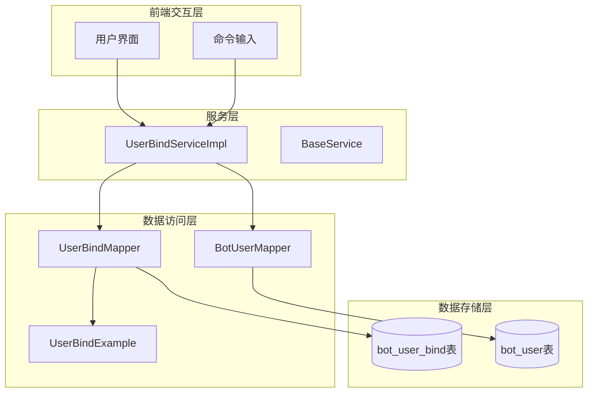
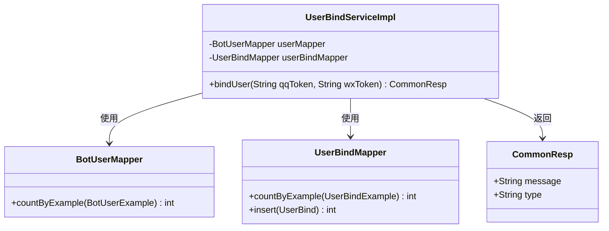
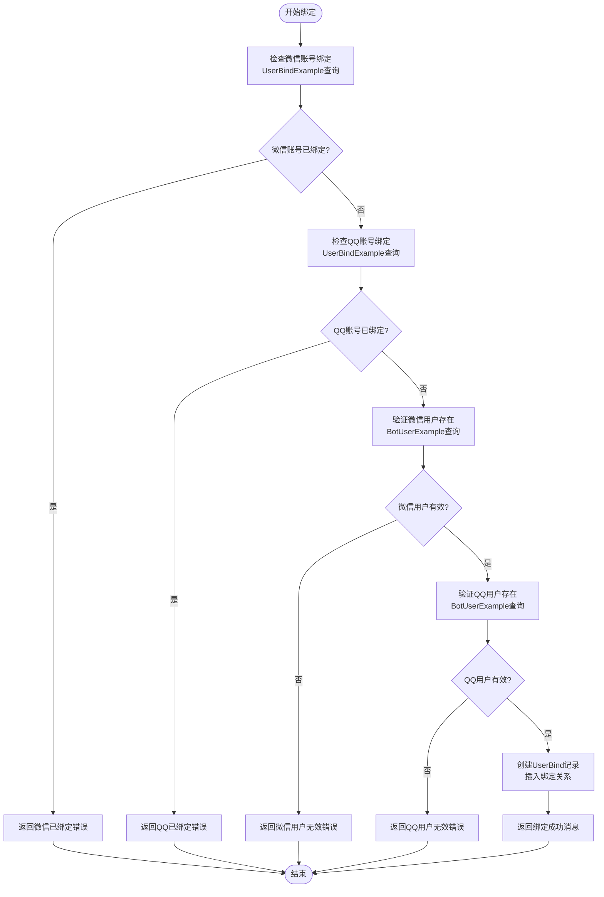
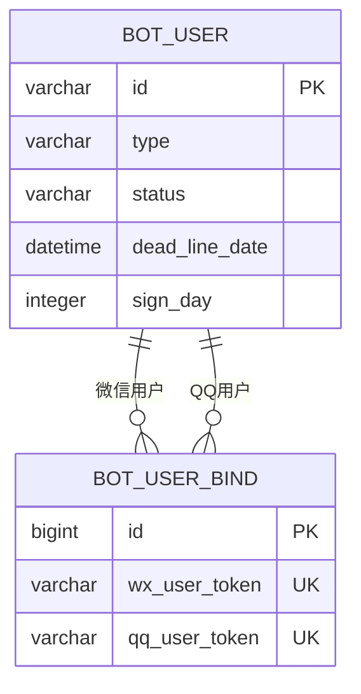
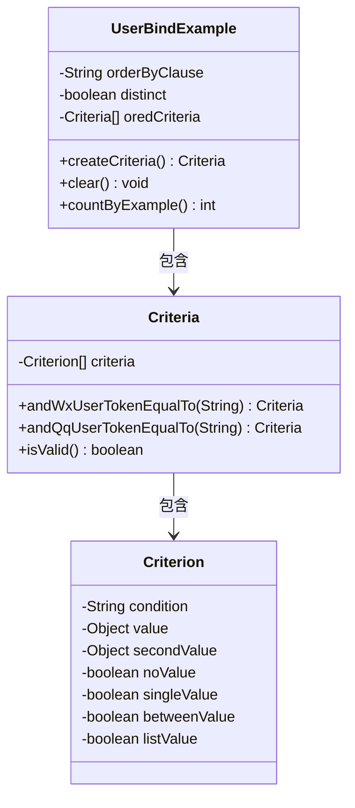
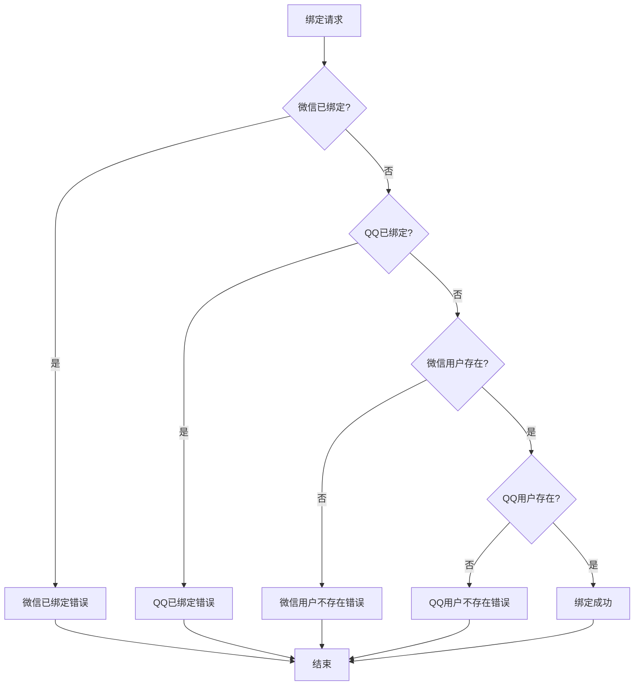
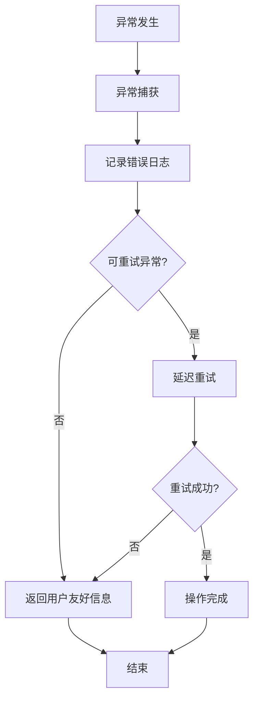
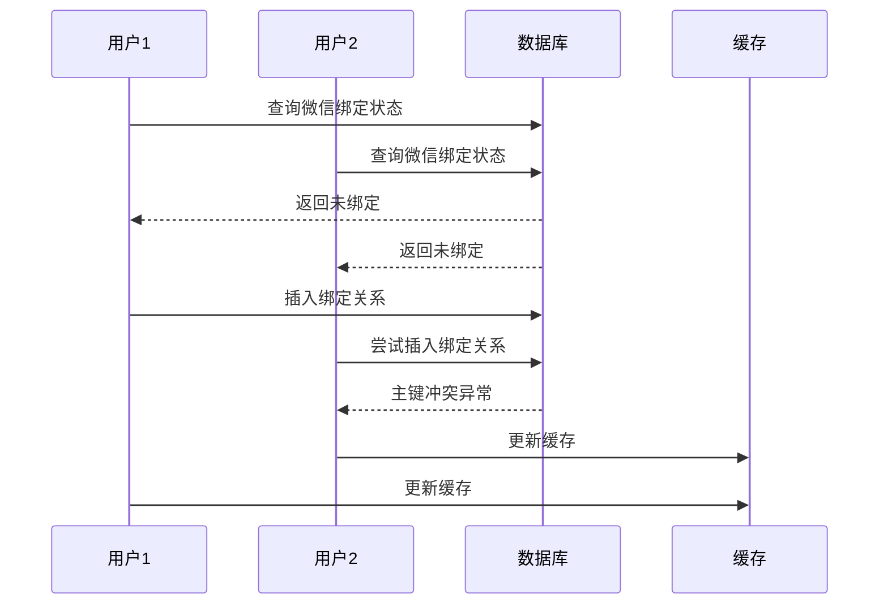

# 用户绑定功能详细文档

<cite>
**本文档引用的文件**
- [UserBindServiceImpl.java](file://Base/src/main/java/com/bot/base/service/impl/UserBindServiceImpl.java)
- [UserBindExample.java](file://Game/src/main/java/com/bot/game/dao/entity/UserBindExample.java)
- [UserBind.java](file://Game/src/main/java/com/bot/game/dao/entity/UserBind.java)
- [UserBindMapper.java](file://Game/src/main/java/com/bot/game/dao/mapper/UserBindMapper.java)
- [UserBindMapper.xml](file://Game/src/main/resources/mapper/UserBindMapper.xml)
- [BotUser.java](file://Game/src/main/java/com/bot/game/dao/entity/BotUser.java)
- [BotUserExample.java](file://Game/src/main/java/com/bot/game/dao/entity/BotUserExample.java)
</cite>

## 目录
1. [功能概述](#功能概述)
2. [系统架构](#系统架构)
3. [核心组件分析](#核心组件分析)
4. [绑定流程详解](#绑定流程详解)
5. [数据库设计](#数据库设计)
6. [MyBatis查询机制](#mybatis查询机制)
7. [业务规则与限制](#业务规则与限制)
8. [错误处理与异常情况](#错误处理与异常情况)
9. [性能优化考虑](#性能优化考虑)
10. [故障排除指南](#故障排除指南)

## 功能概述

用户绑定功能允许微信用户和QQ用户通过唯一的令牌标识符建立关联关系，实现跨平台的游戏数据共享。该功能的核心价值在于：

- **账号统一管理**：用户可以在不同社交平台间使用同一套游戏账户体系
- **数据共享机制**：绑定后可实现碎玉等资源的双向共享
- **业务隔离保护**：确保资格、连续签到天数等敏感数据不被共享

## 系统架构



**图表来源**
- [UserBindServiceImpl.java](file://Base/src/main/java/com/bot/base/service/impl/UserBindServiceImpl.java#L17-L62)
- [UserBindMapper.java](file://Game/src/main/java/com/bot/game/dao/mapper/UserBindMapper.java#L9-L97)

## 核心组件分析

### UserBindServiceImpl类

UserBindServiceImpl是用户绑定功能的核心服务类，负责处理绑定请求的完整生命周期。



**图表来源**
- [UserBindServiceImpl.java](file://Base/src/main/java/com/bot/base/service/impl/UserBindServiceImpl.java#L17-L62)
- [UserBindMapper.java](file://Game/src/main/java/com/bot/game/dao/mapper/UserBindMapper.java#L9-L97)

**章节来源**
- [UserBindServiceImpl.java](file://Base/src/main/java/com/bot/base/service/impl/UserBindServiceImpl.java#L17-L62)

### 数据模型设计

#### UserBind实体类

UserBind实体类映射bot_user_bind数据库表，包含以下核心字段：

| 字段名 | 类型 | 描述 | 约束 |
|--------|------|------|------|
| id | Long | 主键标识 | 自增，非空 |
| wx_user_token | String | 微信用户令牌 | 唯一性约束 |
| qq_user_token | String | QQ用户令牌 | 唯一性约束 |

#### BotUser实体类

BotUser实体类映射bot_user数据库表，支持多类型用户管理：

| 字段名 | 类型 | 描述 | 取值范围 |
|--------|------|------|----------|
| id | String | 用户唯一标识 | 微信OpenID/QQ用户ID |
| type | String | 用户类型标识 | '1': 微信用户, '3': QQ用户 |
| status | String | 用户状态 | 'active': 活跃, 'inactive': 禁用 |
| dead_line_date | Date | 截止日期 | 订阅有效期 |

**章节来源**
- [UserBind.java](file://Game/src/main/java/com/bot/game/dao/entity/UserBind.java#L12-L108)
- [BotUser.java](file://Game/src/main/java/com/bot/game/dao/entity/BotUser.java#L13-L151)

## 绑定流程详解

用户绑定功能遵循严格的四步验证流程，确保绑定操作的安全性和数据完整性。

### 绑定流程图



**图表来源**
- [UserBindServiceImpl.java](file://Base/src/main/java/com/bot/base/service/impl/UserBindServiceImpl.java#L27-L59)

### 第一步：检查微信账号绑定状态

系统首先验证目标微信账号是否已经与其他QQ账号绑定：

```java
// 创建查询条件
UserBindExample userBindExample = new UserBindExample();
userBindExample.createCriteria().andWxUserTokenEqualTo(wxToken);

// 查询绑定记录数量
int wxBindCount = userBindMapper.countByExample(userBindExample);

// 如果已绑定，返回错误信息
if (wxBindCount > 0) {
    return new CommonResp("此次绑定的微信已经有过绑定记录，无法再次绑定。", ENRespType.TEXT.getType());
}
```

### 第二步：检查QQ账号绑定状态

接着验证目标QQ账号是否已经与其他微信账号绑定：

```java
// 清空之前的查询条件
userBindExample.clear();

// 设置新的查询条件
userBindExample.createCriteria().andQqUserTokenEqualTo(qqToken);

// 查询绑定记录数量
int qqBindCount = userBindMapper.countByExample(userBindExample);

// 如果已绑定，返回错误信息
if (qqBindCount > 0) {
    return new CommonResp("此次绑定的QQ已经有过绑定记录，无法再次绑定。", ENRespType.TEXT.getType());
}
```

### 第三步：验证用户存在性

系统需要确认微信和QQ用户都在BotUser表中存在且有效：

```java
// 验证微信用户
BotUserExample userExample = new BotUserExample();
userExample.createCriteria().andTypeEqualTo("1").andIdEqualTo(wxToken);
int wxCount = userMapper.countByExample(userExample);

if (wxCount == 0) {
    return new CommonResp("此次绑定的微信用户不存在，请先在对应平台的签到群签到一次后再绑定。", ENRespType.TEXT.getType());
}

// 验证QQ用户
userExample.clear();
userExample.createCriteria().andTypeEqualTo("3").andIdEqualTo(qqToken);
int qqCount = userMapper.countByExample(userExample);

if (qqCount == 0) {
    return new CommonResp("此次绑定的QQ用户不存在，请先在对应平台的签到群签到一次后再绑定。", ENRespType.TEXT.getType());
}
```

### 第四步：创建绑定关系

当所有验证都通过后，系统创建新的UserBind记录：

```java
// 构建绑定对象
UserBind userBind = new UserBind();
userBind.setQqUserToken(qqToken);
userBind.setWxUserToken(wxToken);

// 执行插入操作
userBindMapper.insert(userBind);

// 返回成功消息
return new CommonResp("恭喜绑定成功，从此两边碎玉可以共享了！\r\n（绑定成功后碎玉以较多的一边为准，仅碎玉共享，资格不共享，连续签到天数不共享）", ENRespType.TEXT.getType());
```

**章节来源**
- [UserBindServiceImpl.java](file://Base/src/main/java/com/bot/base/service/impl/UserBindServiceImpl.java#L27-L59)

## 数据库设计

### 表结构设计

#### bot_user_bind表

bot_user_bind表专门用于存储用户绑定关系，采用双主键设计确保数据一致性：

```sql
CREATE TABLE bot_user_bind (
    id BIGINT PRIMARY KEY AUTO_INCREMENT,
    wx_user_token VARCHAR(255) NOT NULL UNIQUE,
    qq_user_token VARCHAR(255) NOT NULL UNIQUE,
    INDEX idx_wx_token (wx_user_token),
    INDEX idx_qq_token (qq_user_token)
);
```

#### bot_user表

bot_user表存储所有用户的基本信息，通过type字段区分用户类型：

```sql
CREATE TABLE bot_user (
    id VARCHAR(255) PRIMARY KEY,
    type VARCHAR(1) NOT NULL,
    status VARCHAR(20) NOT NULL,
    dead_line_date DATETIME,
    sign_day INTEGER DEFAULT 0,
    INDEX idx_type (type),
    INDEX idx_status (status)
);
```

### 约束关系图



**图表来源**
- [UserBind.java](file://Game/src/main/java/com/bot/game/dao/entity/UserBind.java#L12-L108)
- [BotUser.java](file://Game/src/main/java/com/bot/game/dao/entity/BotUser.java#L13-L151)

**章节来源**
- [UserBindMapper.xml](file://Game/src/main/resources/mapper/UserBindMapper.xml#L1-L241)

## MyBatis查询机制

### UserBindExample查询模式

UserBindExample类实现了MyBatis的动态SQL查询功能，支持复杂的条件组合：



**图表来源**
- [UserBindExample.java](file://Game/src/main/java/com/bot/game/dao/entity/UserBindExample.java#L6-L502)

### 查询执行流程

#### 条件构建过程

1. **初始化查询条件**：创建UserBindExample实例
2. **添加过滤条件**：调用andWxUserTokenEqualTo或andQqUserTokenEqualTo方法
3. **执行查询**：调用countByExample方法生成SQL并执行
4. **结果处理**：根据返回的计数判断绑定状态

#### SQL生成示例

对于微信账号绑定检查：
```sql
SELECT COUNT(*) FROM bot_user_bind 
WHERE wx_user_token = #{wxToken}
```

对于QQ账号绑定检查：
```sql
SELECT COUNT(*) FROM bot_user_bind 
WHERE qq_user_token = #{qqToken}
```

### BotUserExample查询模式

BotUserExample同样采用类似的查询模式，但针对不同的用户类型进行过滤：

```java
// 微信用户查询
BotUserExample userExample = new BotUserExample();
userExample.createCriteria()
    .andTypeEqualTo("1")    // 类型为微信用户
    .andIdEqualTo(wxToken); // 匹配指定的微信OpenID

// QQ用户查询  
BotUserExample userExample = new BotUserExample();
userExample.createCriteria()
    .andTypeEqualTo("3")    // 类型为QQ用户
    .andIdEqualTo(qqToken); // 匹配指定的QQ用户ID
```

**章节来源**
- [UserBindExample.java](file://Game/src/main/java/com/bot/game/dao/entity/UserBindExample.java#L6-L502)
- [BotUserExample.java](file://Game/src/main/java/com/bot/game/dao/entity/BotUserExample.java#L7-L573)

## 业务规则与限制

### 碎玉共享规则

绑定成功后，系统采用"以数量较多的一边为准"的策略进行碎玉共享：

- **共享原则**：绑定后，微信和QQ两端的碎玉数量以较高的一方为准
- **同步机制**：每次操作时，系统会比较两端的碎玉数量，并进行必要的同步更新
- **优先级规则**：如果微信端碎玉多，则QQ端同步微信数据；反之亦然

### 业务限制说明

#### 不共享的数据类型

系统明确限制以下数据类型的共享：

1. **用户资格信息**
   - VIP等级状态
   - 特殊权限标识
   - 订阅状态信息

2. **连续签到统计**
   - 连续签到天数
   - 签到历史记录
   - 奖励领取状态

3. **个人隐私数据**
   - 用户基本信息
   - 联系方式
   - 地理位置信息

#### 绑定限制规则



**图表来源**
- [UserBindServiceImpl.java](file://Base/src/main/java/com/bot/base/service/impl/UserBindServiceImpl.java#L27-L59)

### 错误提示信息

系统提供了清晰的错误提示信息，帮助用户理解绑定失败的原因：

| 错误类型 | 提示信息 | 原因分析 | 解决方案 |
|----------|----------|----------|----------|
| 微信已绑定 | "此次绑定的微信已经有过绑定记录，无法再次绑定。" | 微信账号已被其他QQ账号绑定 | 解除现有绑定或使用未绑定的微信账号 |
| QQ已绑定 | "此次绑定的QQ已经有过绑定记录，无法再次绑定。" | QQ账号已被其他微信账号绑定 | 解除现有绑定或使用未绑定的QQ账号 |
| 微信用户不存在 | "此次绑定的微信用户不存在，请先在对应平台的签到群签到一次后再绑定。" | 微信用户未完成初始签到 | 在微信签到群完成首次签到 |
| QQ用户不存在 | "此次绑定的QQ用户不存在，请先在对应平台的签到群签到一次后再绑定。" | QQ用户未完成初始签到 | 在QQ签到群完成首次签到 |

**章节来源**
- [UserBindServiceImpl.java](file://Base/src/main/java/com/bot/base/service/impl/UserBindServiceImpl.java#L32-L58)

## 错误处理与异常情况

### 常见失败场景分析

#### 场景一：重复绑定尝试

**触发条件**：
- 同一个微信账号多次尝试绑定
- 同一个QQ账号多次尝试绑定

**系统响应**：
```java
// 检查微信重复绑定
if (wxBindCount > 0) {
    return new CommonResp("此次绑定的微信已经有过绑定记录，无法再次绑定。", ENRespType.TEXT.getType());
}

// 检查QQ重复绑定
if (qqBindCount > 0) {
    return new CommonResp("此次绑定的QQ已经有过绑定记录，无法再次绑定。", ENRespType.TEXT.getType());
}
```

**处理建议**：
- 引导用户先解除现有绑定
- 提供解绑功能入口
- 明确告知重复绑定的限制

#### 场景二：用户不存在

**触发条件**：
- 微信OpenID不在BotUser表中
- QQ用户ID不在BotUser表中

**系统响应**：
```java
if (wxCount == 0) {
    return new CommonResp("此次绑定的微信用户不存在，请先在对应平台的签到群签到一次后再绑定。", ENRespType.TEXT.getType());
}

if (qqCount == 0) {
    return new CommonResp("此次绑定的QQ用户不存在，请先在对应平台的签到群签到一次后再绑定。", ENRespType.TEXT.getType());
}
```

**处理建议**：
- 提供签到引导流程
- 明确告知首次使用的步骤
- 提供签到群二维码或链接

#### 场景三：数据库异常

**触发条件**：
- 数据库连接超时
- 并发写入冲突
- 主键冲突异常

**系统响应**：
虽然当前实现中没有显式的异常捕获，但@Transactional注解确保了事务的回滚机制。

**处理建议**：
- 添加全局异常处理器
- 实现重试机制
- 记录详细的错误日志

### 异常处理最佳实践



**章节来源**
- [UserBindServiceImpl.java](file://Base/src/main/java/com/bot/base/service/impl/UserBindServiceImpl.java#L27-L59)

## 性能优化考虑

### 查询优化策略

#### 索引利用

系统充分利用数据库索引来提升查询性能：

1. **单字段索引**：
   - `bot_user_bind(wx_user_token)`
   - `bot_user_bind(qq_user_token)`
   - `bot_user(type)`

2. **复合索引**：
   - `bot_user(type, id)`：支持类型过滤和ID查找

#### 查询优化技巧

```java
// 优化点1：及时清理查询条件
userBindExample.clear(); // 避免条件累积

// 优化点2：使用精确匹配而非模糊查询
userBindExample.createCriteria()
    .andWxUserTokenEqualTo(wxToken); // 精确匹配优于LIKE

// 优化点3：避免不必要的查询
if (wxBindCount > 0) {
    return earlyResponse; // 早期返回，避免后续查询
}
```

### 缓存策略

虽然当前实现没有缓存，但在高并发场景下可以考虑以下缓存策略：

1. **绑定状态缓存**：
   - 缓存用户的绑定状态，减少数据库查询
   - 设置合理的过期时间

2. **用户存在性缓存**：
   - 缓存BotUser表的查询结果
   - 使用布隆过滤器预判用户是否存在

### 并发控制



**图表来源**
- [UserBindServiceImpl.java](file://Base/src/main/java/com/bot/base/service/impl/UserBindServiceImpl.java#L27-L59)

## 故障排除指南

### 常见问题诊断

#### 问题1：绑定操作无响应

**症状表现**：
- 输入绑定指令后没有收到任何回复
- 系统似乎卡住不动

**可能原因**：
1. 数据库连接池耗尽
2. 死锁导致的事务阻塞
3. 网络连接超时

**排查步骤**：
```bash
# 检查数据库连接状态
SHOW PROCESSLIST;

# 查看慢查询日志
SET GLOBAL slow_query_log = ON;

# 检查应用日志
tail -f application.log | grep "UserBindServiceImpl"
```

**解决方案**：
1. 增加数据库连接池大小
2. 优化查询语句，减少锁定时间
3. 实现超时机制

#### 问题2：绑定成功但数据不同步

**症状表现**：
- 绑定操作显示成功
- 但碎玉数量仍然不一致

**可能原因**：
1. 碎玉同步逻辑异常
2. 并发更新导致的数据竞争
3. 缓存与数据库不一致

**排查步骤**：
```sql
-- 检查绑定关系是否正确创建
SELECT * FROM bot_user_bind WHERE wx_user_token = ? OR qq_user_token = ?;

-- 检查用户碎玉数量
SELECT id, type, money FROM bot_user WHERE id IN (?, ?);
```

**解决方案**：
1. 实现数据一致性校验
2. 添加分布式锁防止并发修改
3. 定期执行数据同步任务

#### 问题3：频繁出现"用户不存在"错误

**症状表现**：
- 新用户绑定时总是提示用户不存在
- 但实际用户已经在签到群注册

**可能原因**：
1. BotUser数据导入延迟
2. 用户类型标识错误
3. 签到数据同步问题

**排查步骤**：
```sql
-- 检查BotUser表中的用户记录
SELECT * FROM bot_user 
WHERE id = ? AND type IN ('1', '3');

-- 检查签到记录
SELECT * FROM bot_user_sign 
WHERE user_id = ? AND sign_date >= DATE_SUB(NOW(), INTERVAL 1 DAY);
```

**解决方案**：
1. 优化数据导入流程
2. 添加用户状态检查机制
3. 提供人工审核通道

### 监控指标

为了及时发现和解决绑定功能的问题，建议监控以下关键指标：

| 指标名称 | 监控维度 | 告警阈值 | 处理建议 |
|----------|----------|----------|----------|
| 绑定成功率 | 每小时成功率 | < 95% | 检查系统健康状态 |
| 平均响应时间 | 查询耗时分布 | > 2秒 | 优化数据库查询 |
| 错误率分布 | 各种错误类型占比 | 单类错误 > 5% | 分析具体原因 |
| 并发连接数 | 数据库连接池使用率 | > 80% | 扩容连接池 |

### 日志分析

系统应该记录详细的绑定操作日志，便于问题追踪：

```java
// 推荐的日志记录格式
logger.info("User binding attempt - wxToken: {}, qqToken: {}", 
           maskToken(wxToken), maskToken(qqToken));

logger.warn("User binding failed - Reason: {}, wxToken: {}, qqToken: {}", 
           errorMessage, maskToken(wxToken), maskToken(qqToken));

logger.debug("Binding successful - wxToken: {}, qqToken: {}, userId: {}", 
            maskToken(wxToken), maskToken(qqToken), userId);
```

**章节来源**
- [UserBindServiceImpl.java](file://Base/src/main/java/com/bot/base/service/impl/UserBindServiceImpl.java#L27-L59)

## 总结

用户绑定功能作为游戏系统的重要组成部分，通过严格的安全验证和清晰的业务规则，为用户提供了便捷的跨平台体验。本文档详细分析了从架构设计到具体实现的各个方面，涵盖了：

- **完整的绑定流程**：四个关键步骤确保数据安全和业务合规
- **强大的查询机制**：基于MyBatis的动态SQL查询提供灵活的数据检索
- **严格的业务规则**：明确的数据共享边界保护用户隐私
- **完善的错误处理**：多层次的异常处理确保系统的稳定性

通过持续的监控和优化，该功能能够为用户提供稳定可靠的绑定服务，同时为系统的扩展和维护奠定坚实的基础。