# 签到系统详细文档

<cite>
**本文档引用的文件**
- [SignServiceImpl.java](file://Base/src/main/java/com/bot/base/service/impl/SignServiceImpl.java)
- [BaseConsts.java](file://Common/src/main/java/com/bot/common/constant/BaseConsts.java)
- [BotUserSignMapper.java](file://Game/src/main/java/com/bot/game/dao/mapper/BotUserSignMapper.java)
- [BotUserBoxMapper.java](file://Game/src/main/java/com/bot/game/dao/mapper/BotUserBoxMapper.java)
- [UserBindMapper.java](file://Game/src/main/java/com/bot/game/dao/mapper/UserBindMapper.java)
- [BotUserSign.java](file://Game/src/main/java/com/bot/game/dao/entity/BotUserSign.java)
- [BotUserBox.java](file://Game/src/main/java/com/bot/game/dao/entity/BotUserBox.java)
- [UserBind.java](file://Game/src/main/java/com/bot/game/dao/entity/UserBind.java)
- [ENUserGoodType.java](file://Common/src/main/java/com/bot/common/enums/ENUserGoodType.java)
- [SystemConfigHolder.java](file://Game/src/main/java/com\bot\game\service\SystemConfigHolder.java)
- [UserBindServiceImpl.java](file://Base/src/main/java/com/bot/base/service/impl/UserBindServiceImpl.java)
</cite>

## 目录
1. [系统概述](#系统概述)
2. [核心组件架构](#核心组件架构)
3. [SignServiceImpl类详解](#signserviceimpl类详解)
4. [doQueryReturn方法深度解析](#doqueryreturn方法深度解析)
5. [signSuccess方法实现机制](#signsuccess方法实现机制)
6. [跨平台绑定与碎玉合并逻辑](#跨平台绑定与碎玉合并逻辑)
7. [事务管理与数据一致性](#事务管理与数据一致性)
8. [签到失败场景分析](#签到失败场景分析)
9. [常量配置与业务规则](#常量配置与业务规则)
10. [性能优化建议](#性能优化建议)

## 系统概述

签到系统是Bot项目中的核心功能模块，负责处理用户的每日签到请求，维护连续签到天数，并通过碎玉奖励机制激励用户持续参与。系统采用Spring框架构建，使用MyBatis作为ORM工具，实现了完整的事务管理和数据一致性保障。

### 主要功能特性

- **防重复签到机制**：通过BotUserSign表记录签到信息，确保用户每天只能签到一次
- **连续签到天数计算**：根据签到历史自动计算连续签到天数
- **碎玉奖励发放**：签到成功后自动发放相应数量的碎玉奖励
- **跨平台绑定支持**：支持QQ和微信账号的绑定，实现碎玉资产合并
- **新用户首次签到处理**：自动创建新用户记录并初始化签到状态

## 核心组件架构

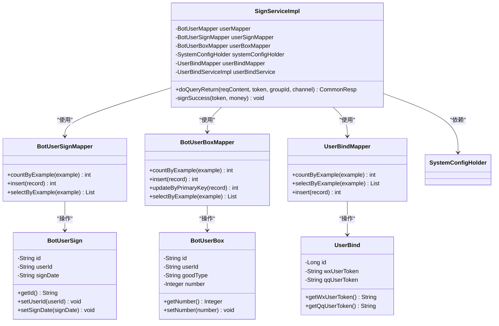

**图表来源**
- [SignServiceImpl.java](file://Base/src/main/java/com/bot/base/service/impl/SignServiceImpl.java#L28-L47)
- [BotUserSignMapper.java](file://Game/src/main/java/com/bot/game/dao/mapper/BotUserSignMapper.java#L9-L97)
- [BotUserBoxMapper.java](file://Game/src/main/java/com/bot/game/dao/mapper/BotUserBoxMapper.java#L9-L97)
- [UserBindMapper.java](file://Game/src/main/java/com/bot/game/dao/mapper/UserBindMapper.java#L9-L97)

## SignServiceImpl类详解

SignServiceImpl是签到系统的核心服务类，实现了BaseService接口，提供了完整的签到功能。该类通过依赖注入获取多个Mapper组件，负责协调各个数据访问层的操作。

### 类结构与依赖关系

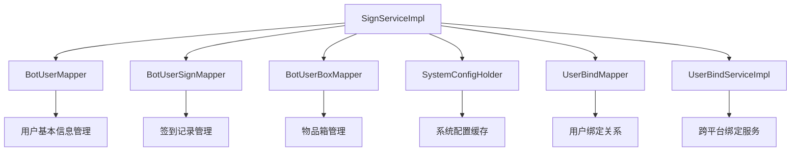

**图表来源**
- [SignServiceImpl.java](file://Base/src/main/java/com/bot/base/service/impl/SignServiceImpl.java#L31-L47)

### 关键成员变量说明

| 成员变量 | 类型 | 功能描述 |
|---------|------|----------|
| userMapper | BotUserMapper | 用户基本信息数据访问 |
| userSignMapper | BotUserSignMapper | 签到记录数据访问 |
| userBoxMapper | BotUserBoxMapper | 物品箱数据访问 |
| systemConfigHolder | SystemConfigHolder | 系统配置缓存管理 |
| userBindMapper | UserBindMapper | 用户绑定关系数据访问 |
| userBindService | UserBindServiceImpl | 跨平台绑定业务逻辑 |

**章节来源**
- [SignServiceImpl.java](file://Base/src/main/java/com/bot/base/service/impl/SignServiceImpl.java#L31-L47)

## doQueryReturn方法深度解析

doQueryReturn方法是签到系统的主要入口点，处理签到请求并返回相应的响应。该方法实现了复杂的业务逻辑，包括重复签到检测、连续签到天数计算、新用户处理等。

### 方法执行流程图

```mermaid
flowchart TD
A[接收签到请求] --> B{请求内容是否为"签到"?}
B --> |否| C{是否为跨平台绑定?}
B --> |是| D[检查用户绑定关系]
C --> |是| D
C --> |否| E[返回null]
D --> F{是否有绑定记录?}
F --> |是| G[选择高碎玉账号]
F --> |否| H[直接查询今日签到]
G --> H
H --> I{今日是否已签到?}
I --> |是| J[返回签到失败]
I --> |否| K[查询昨日签到状态]
K --> L{昨日是否有签到?}
L --> |是| M[计算连续签到天数]
L --> |否| N{用户是否存在?}
M --> O[签到成功处理]
N --> |否| P[创建新用户记录]
N --> |是| Q[重置连续签到天数]
O --> R[更新用户签到状态]
P --> S[首次签到处理]
Q --> T[单日签到处理]
R --> U[返回签到成功响应]
S --> V[返回首次签到响应]
T --> W[返回单日签到响应]
```

**图表来源**
- [SignServiceImpl.java](file://Base/src/main/java/com/bot/base/service/impl/SignServiceImpl.java#L52-L133)

### 防止重复签到的逻辑实现

系统通过BotUserSignExample查询今日签到记录来防止重复签到：

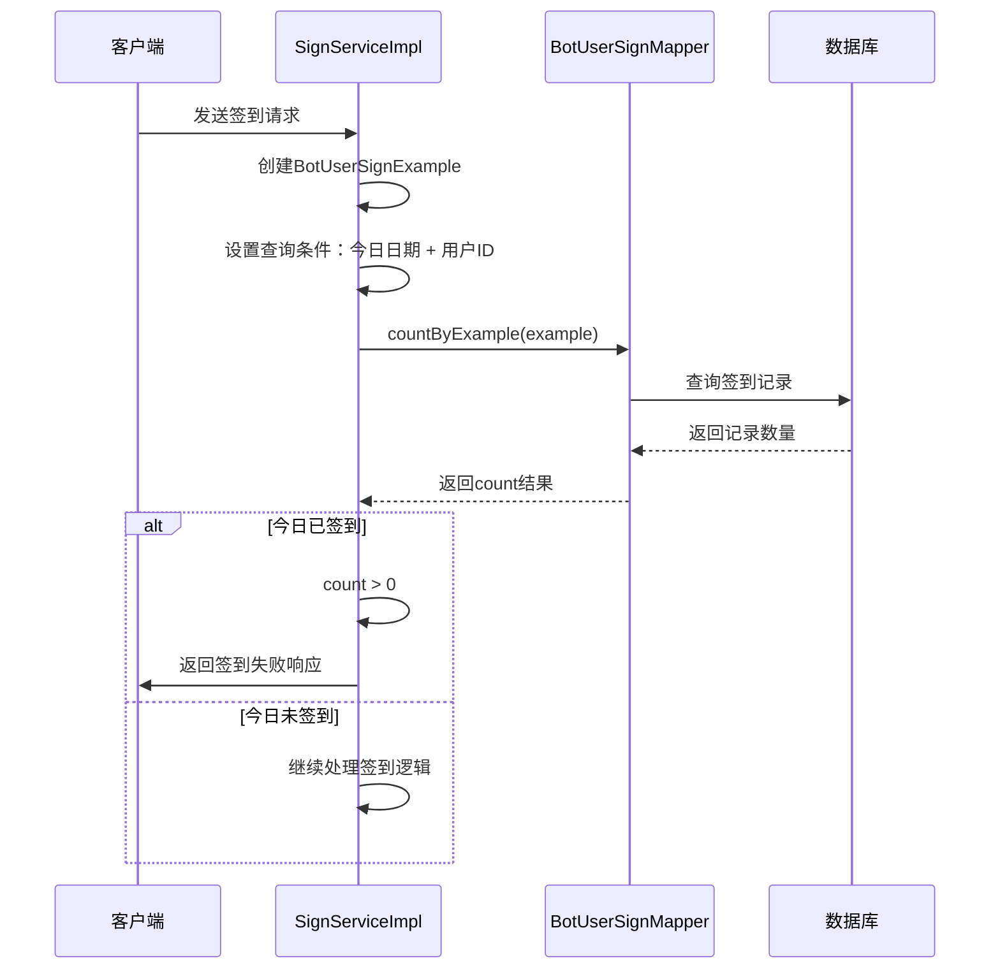

**图表来源**
- [SignServiceImpl.java](file://Base/src/main/java/com/bot/base/service/impl/SignServiceImpl.java#L76-L81)

### 连续签到天数计算机制

系统通过查询昨日签到状态来确定连续签到天数：

| 连续签到天数 | 碎玉奖励 | 计算逻辑 |
|-------------|----------|----------|
| 第1天 | 1个碎玉 | signDay == 1 ? 1 : 0 |
| 第2天 | 2个碎玉 | signDay == 2 ? 2 : 0 |
| 第3天及以后 | 3个碎玉 | signDay >= 3 ? 3 : 0 |

**章节来源**
- [SignServiceImpl.java](file://Base/src/main/java/com/bot/base/service/impl/SignServiceImpl.java#L82-L98)

### 新用户首次签到处理流程

对于新用户，系统需要创建用户记录并初始化签到状态：

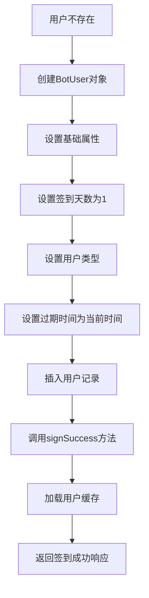

**图表来源**
- [SignServiceImpl.java](file://Base/src/main/java/com/bot/base/service/impl/SignServiceImpl.java#L101-L113)

**章节来源**
- [SignServiceImpl.java](file://Base/src/main/java/com/bot/base/service/impl/SignServiceImpl.java#L101-L113)

## signSuccess方法实现机制

signSuccess方法负责签到成功后的完整处理流程，包括创建签到记录和发放碎玉奖励两个核心步骤。

### 签到记录创建流程

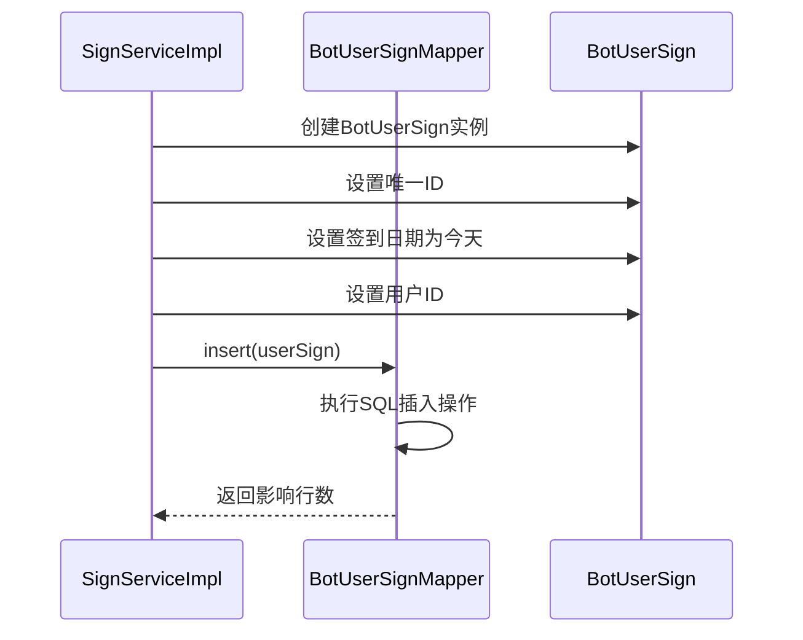

**图表来源**
- [SignServiceImpl.java](file://Base/src/main/java/com/bot/base/service/impl/SignServiceImpl.java#L139-L144)

### 碎玉奖励发放逻辑

碎玉奖励发放采用先查询后更新的策略：

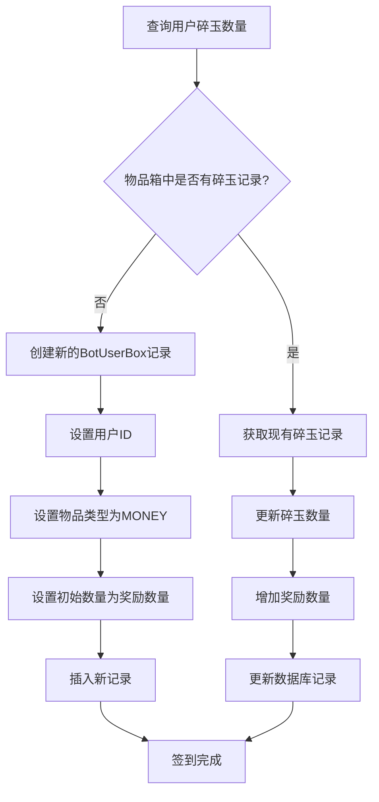

**图表来源**
- [SignServiceImpl.java](file://Base/src/main/java/com/bot/base/service/impl/SignServiceImpl.java#L139-L163)

### 碎玉数量计算规则

| 连续签到天数 | 碎玉奖励 | 触发条件 |
|-------------|----------|----------|
| 第1天 | 1个碎玉 | signDay == 1 |
| 第2天 | 2个碎玉 | signDay == 2 |
| 第3天及以后 | 3个碎玉 | signDay >= 3 |

**章节来源**
- [SignServiceImpl.java](file://Base/src/main/java/com/bot/base/service/impl/SignServiceImpl.java#L139-L163)

## 跨平台绑定与碎玉合并逻辑

系统支持QQ和微信账号的跨平台绑定，实现碎玉资产的统一管理。

### 跨平台绑定流程

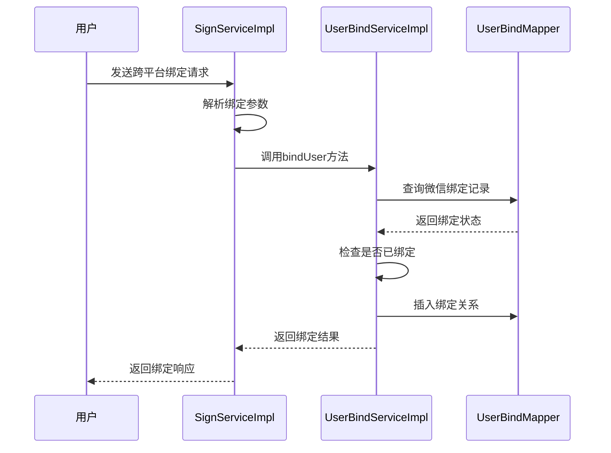

**图表来源**
- [SignServiceImpl.java](file://Base/src/main/java/com/bot/base/service/impl/SignServiceImpl.java#L122-L131)
- [UserBindServiceImpl.java](file://Base/src/main/java/com/bot/base/service/impl/UserBindServiceImpl.java#L27-L34)

### 碎玉合并逻辑实现

当用户存在跨平台绑定时，系统会选择碎玉数量较多的平台作为主要账户：

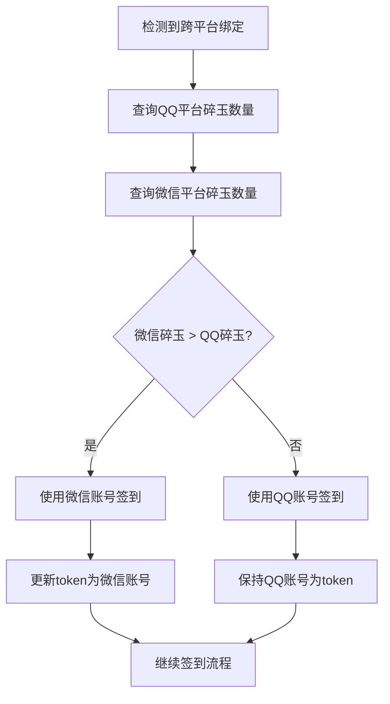

**图表来源**
- [SignServiceImpl.java](file://Base/src/main/java/com/bot/base/service/impl/SignServiceImpl.java#L62-L74)

### 绑定关系数据模型

| 字段名 | 类型 | 描述 |
|--------|------|------|
| id | Long | 主键ID |
| wx_user_token | String | 微信用户标识 |
| qq_user_token | String | QQ用户标识 |

**章节来源**
- [UserBind.java](file://Game/src/main/java/com/bot/game/dao/entity/UserBind.java#L12-L28)

## 事务管理与数据一致性

系统使用@Transactional注解确保签到操作的原子性，保证数据一致性。

### 事务配置分析

```mermaid
graph LR
A[doQueryReturn方法] --> B[@Transactional注解]
B --> C[事务传播行为]
B --> D[回滚规则]
B --> E[隔离级别]
C --> F[REQUIRED：默认传播行为]
D --> G[Exception.class：所有异常都回滚]
E --> H[默认隔离级别]
```

**图表来源**
- [SignServiceImpl.java](file://Base/src/main/java/com/bot/base/service/impl/SignServiceImpl.java#L51)

### 数据一致性保障机制

| 操作类型 | 事务边界 | 回滚条件 | 数据一致性保障 |
|---------|----------|----------|----------------|
| 签到记录创建 | 整个doQueryReturn方法 | 任何异常 | 签到记录与碎玉奖励同步 |
| 碎玉奖励发放 | signSuccess方法内部 | Mapper操作异常 | 碎玉数量更新原子性 |
| 用户状态更新 | 整个doQueryReturn方法 | 任何异常 | 用户签到状态一致性 |

**章节来源**
- [SignServiceImpl.java](file://Base/src/main/java/com/bot/base/service/impl/SignServiceImpl.java#L51)

## 签到失败场景分析

系统针对多种异常情况提供了完善的处理机制。

### 常见签到失败场景

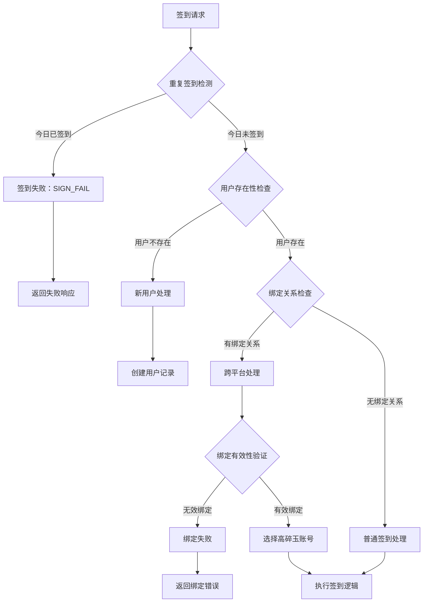

**图表来源**
- [SignServiceImpl.java](file://Base/src/main/java/com/bot/base/service/impl/SignServiceImpl.java#L79-L81)

### 失败场景处理策略

| 失败场景 | 错误码 | 处理策略 | 用户体验 |
|---------|--------|----------|----------|
| 重复签到 | BaseConsts.Sign.SIGN_FAIL | 直接返回失败信息 | 清晰告知用户今日已签到 |
| 用户不存在 | 创建新用户记录 | 自动初始化用户状态 | 无缝新用户体验 |
| 绑定关系异常 | 绑定失败提示 | 提示用户检查绑定状态 | 引导用户解决绑定问题 |
| 数据库异常 | 事务回滚 | 自动回滚所有操作 | 确保数据一致性 |

**章节来源**
- [SignServiceImpl.java](file://Base/src/main/java/com/bot/base/service/impl/SignServiceImpl.java#L79-L81)

## 常量配置与业务规则

系统通过BaseConsts.Sign接口定义了签到相关的常量配置。

### 签到常量配置

| 常量名 | 值 | 用途 |
|--------|-----|------|
| SIGN_TIP | "签到成功！\r\n连续签到%s天，碎玉 + %s" | 签到成功提示模板 |
| SIGN_FAIL | "你今天已经签到过了~" | 重复签到失败提示 |

### 业务规则配置

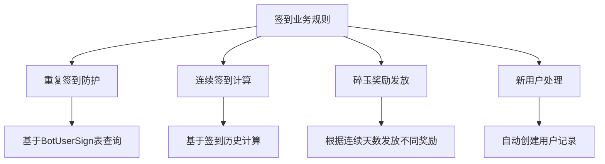

**图表来源**
- [BaseConsts.java](file://Common/src/main/java/com/bot/common/constant/BaseConsts.java#L282-L285)

### 碎玉奖励规则详解

| 连续签到天数 | 奖励碎玉 | 触发条件 | 计算公式 |
|-------------|----------|----------|----------|
| 第1天 | 1个 | signDay == 1 | signDay == 1 ? 1 : 0 |
| 第2天 | 2个 | signDay == 2 | signDay == 2 ? 2 : 0 |
| 第3天及以后 | 3个 | signDay >= 3 | signDay >= 3 ? 3 : 0 |

**章节来源**
- [BaseConsts.java](file://Common/src/main/java/com/bot/common/constant/BaseConsts.java#L282-L285)

## 性能优化建议

### 数据库查询优化

1. **索引优化**：在bot_user_sign表的user_id和sign_date字段上建立复合索引
2. **查询缓存**：对频繁查询的签到记录使用Redis缓存
3. **批量操作**：对于大量用户的签到统计，考虑使用批量查询

### 事务性能优化

1. **最小化事务范围**：确保事务只包含必要的数据库操作
2. **避免长事务**：减少事务持有时间，避免长时间锁定资源
3. **读写分离**：对于只读查询，考虑使用读库

### 缓存策略

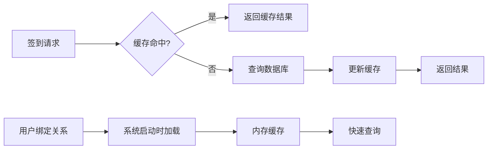

通过以上优化措施，可以显著提升签到系统的性能表现，特别是在高并发场景下的响应速度和吞吐量。