# 管理功能

<cite>
**本文档引用的文件**
- [SignServiceImpl.java](file://Base/src/main/java/com/bot/base/service/impl/SignServiceImpl.java)
- [UserBindServiceImpl.java](file://Base/src/main/java/com/bot/base/service/impl/UserBindServiceImpl.java)
- [RegService.java](file://Base/src/main/java/com/bot/base/service/RegService.java)
- [RegServiceImpl.java](file://Base/src/main/java/com/bot/base/service/impl/RegServiceImpl.java)
- [SystemConfigCache.java](file://Common/src/main/java/com/bot/common/config/SystemConfigCache.java)
- [SystemConfigHolder.java](file://Game/src/main/java/com/bot/game/service/SystemConfigHolder.java)
- [SystemManager.java](file://Base/src/main/java/com/bot/base/service/SystemManager.java)
- [GameManagerServiceImpl.java](file://Game/src/main/java/com/bot/game/service/impl/GameManagerServiceImpl.java)
- [BaseConsts.java](file://Common/src/main/java/com/bot/common/constant/BaseConsts.java)
</cite>

## 目录
1. [简介](#简介)
2. [项目结构](#项目结构)
3. [核心组件](#核心组件)
4. [架构概览](#架构概览)
5. [详细组件分析](#详细组件分析)
6. [依赖关系分析](#依赖关系分析)
7. [性能考虑](#性能考虑)
8. [故障排除指南](#故障排除指南)
9. [结论](#结论)

## 简介

Bot项目是一个综合性的聊天机器人系统，提供了完善的用户管理和群组管理功能。系统通过多层次的服务架构实现了签到系统、注册系统、用户绑定功能以及系统配置管理等核心管理功能。这些功能为'浮生卷'等模块提供了稳定可靠的用户数据支持，确保了系统的正常运行和用户体验。

## 项目结构

Bot项目采用模块化架构设计，主要分为以下几个核心模块：

**图表来源**
- [SignServiceImpl.java](file://Base/src/main/java/com/bot/base/service/impl/SignServiceImpl.java#L1-L167)
- [SystemConfigCache.java](file://Common/src/main/java/com/bot/common/config/SystemConfigCache.java#L1-L116)

## 核心组件

### 签到系统 (SignServiceImpl)
签到系统是Bot项目的核心功能之一，负责处理用户的每日签到和奖励发放。系统支持跨平台绑定，能够根据用户的历史签到记录计算连续签到天数，并根据规则发放相应的奖励。

### 用户绑定系统 (UserBindServiceImpl)
用户绑定系统实现了QQ账号与微信账号之间的关联，支持跨平台资源共享。系统确保绑定的安全性和唯一性，防止重复绑定。

### 注册管理系统 (RegService/RegServiceImpl)
注册管理系统负责用户的激活和试用管理，支持邀请码机制和临时邀请码系统，提供灵活的用户授权策略。

### 系统配置管理 (SystemConfigCache/SystemConfigHolder)
系统配置管理负责加载和缓存系统配置项，包括API端点、邀请码、用户权限等关键配置信息。

**章节来源**
- [SignServiceImpl.java](file://Base/src/main/java/com/bot/base/service/impl/SignServiceImpl.java#L1-L167)
- [UserBindServiceImpl.java](file://Base/src/main/java/com/bot/base/service/impl/UserBindServiceImpl.java#L1-L63)
- [RegServiceImpl.java](file://Base/src/main/java/com/bot/base/service/impl/RegServiceImpl.java#L1-L171)

## 架构概览

Bot项目的管理功能采用分层架构设计，确保了功能的模块化和可扩展性：

**图表来源**
- [SignServiceImpl.java](file://Base/src/main/java/com/bot/base/service/impl/SignServiceImpl.java#L50-L134)
- [UserBindServiceImpl.java](file://Base/src/main/java/com/bot/base/service/impl/UserBindServiceImpl.java#L26-L62)
- [RegServiceImpl.java](file://Base/src/main/java/com/bot/base/service/impl/RegServiceImpl.java#L42-L144)

## 详细组件分析

### 签到系统详细分析

签到系统通过SignServiceImpl实现，具备以下核心功能：

#### 签到逻辑流程

**图表来源**
- [SignServiceImpl.java](file://Base/src/main/java/com/bot/base/service/impl/SignServiceImpl.java#L52-L120)

#### 奖励计算规则
签到系统采用阶梯式奖励机制：
- 第一天签到获得1个碎玉
- 第二天签到获得2个碎玉  
- 第三天及以后每天获得3个碎玉

#### 跨平台绑定支持
系统支持QQ和微信账号的跨平台绑定，绑定后：
- 碎玉数量以较多的一方为准
- 连续签到天数独立计算
- 资格和权限不共享

**章节来源**
- [SignServiceImpl.java](file://Base/src/main/java/com/bot/base/service/impl/SignServiceImpl.java#L50-L167)

### 用户绑定系统详细分析

用户绑定系统通过UserBindServiceImpl实现，确保账号绑定的安全性和有效性：

#### 绑定验证流程

```mermaid
flowchart TD
Start([绑定请求]) --> CheckWX{检查微信账号}
CheckWX --> |已绑定| WXError[微信已绑定错误]
CheckWX --> |未绑定| CheckQQ{检查QQ账号}
CheckQQ --> |已绑定| QQError[QQ已绑定错误]
CheckQQ --> |未绑定| VerifyUser{验证用户存在}
VerifyUser --> |微信不存在| WXNotExist[微信用户不存在]
VerifyUser --> |QQ不存在| QQNotExist[QQ用户不存在]
VerifyUser --> |都存在| CreateBind[创建绑定关系]
CreateBind --> Success[绑定成功]
WXError --> End([结束])
QQError --> End
WXNotExist --> End
QQNotExist --> End
Success --> End
```

**图表来源**
- [UserBindServiceImpl.java](file://Base/src/main/java/com/bot/base/service/impl/UserBindServiceImpl.java#L26-L62)

#### 安全验证机制
- 防止重复绑定同一微信账号
- 防止重复绑定同一QQ账号
- 确保绑定的用户必须已注册
- 支持跨平台资源共享

**章节来源**
- [UserBindServiceImpl.java](file://Base/src/main/java/com/bot/base/service/impl/UserBindServiceImpl.java#L1-L63)

### 注册管理系统详细分析

注册管理系统通过RegService接口和RegServiceImpl实现，提供灵活的用户授权机制：

#### 注册流程架构

**图表来源**
- [RegService.java](file://Base/src/main/java/com/bot/base/service/RegService.java#L1-L36)
- [RegServiceImpl.java](file://Base/src/main/java/com/bot/base/service/impl/RegServiceImpl.java#L29-L171)

#### 邀请码机制
系统支持两种类型的邀请码：
- **永久邀请码**：一次性使用，长期有效
- **临时邀请码**：使用后失效，用于正式用户激活

#### 试用和正式用户区分
- 试用用户：7天免费试用期
- 正式用户：根据邀请码类型获得相应时长
- 支持续费和延期机制

**章节来源**
- [RegServiceImpl.java](file://Base/src/main/java/com/bot/base/service/impl/RegServiceImpl.java#L42-L171)

### 系统配置管理详细分析

系统配置管理通过SystemConfigCache和SystemConfigHolder实现，负责加载和维护系统配置：

#### 配置项分类

**图表来源**
- [SystemConfigCache.java](file://Common/src/main/java/com/bot/common/config/SystemConfigCache.java#L1-L116)

#### 配置加载机制
SystemConfigHolder在系统启动时自动加载配置：
- 从数据库加载系统级配置
- 初始化用户相关的配置映射
- 提供配置更新和刷新功能

**章节来源**
- [SystemConfigHolder.java](file://Game/src/main/java/com/bot/game/service/SystemConfigHolder.java#L1-L74)

### 管理员操作功能

系统提供了完整的管理员操作功能，通过SystemManager实现：

#### 管理员操作流程

**图表来源**
- [SystemManager.java](file://Base/src/main/java/com/bot/base/service/SystemManager.java#L88-L205)

#### 管理功能列表
- **公告发布**：支持文本和图片公告
- **用户补偿**：批量发放奖励和碎玉
- **邀请码生成**：批量生成临时邀请码
- **系统配置**：实时修改系统配置
- **用户管理**：查看和管理用户状态

**章节来源**
- [SystemManager.java](file://Base/src/main/java/com/bot/base/service/SystemManager.java#L34-L205)

## 依赖关系分析

Bot项目的管理功能具有清晰的依赖层次结构：

**图表来源**
- [SignServiceImpl.java](file://Base/src/main/java/com/bot/base/service/impl/SignServiceImpl.java#L1-L50)
- [SystemConfigHolder.java](file://Game/src/main/java/com/bot/game/service/SystemConfigHolder.java#L1-L74)

### 核心依赖说明
- **Spring Framework**：提供依赖注入和事务管理
- **MyBatis ORM**：简化数据库操作
- **Hutool工具库**：提供常用工具方法

**章节来源**
- [SignServiceImpl.java](file://Base/src/main/java/com/bot/base/service/impl/SignServiceImpl.java#L1-L50)
- [SystemConfigHolder.java](file://Game/src/main/java/com/bot/game/service/SystemConfigHolder.java#L1-L74)

## 性能考虑

### 缓存策略
系统采用多层缓存策略提升性能：
- **内存缓存**：SystemConfigCache将频繁访问的配置项存储在内存中
- **懒加载**：配置项按需加载，减少初始化时间
- **定时刷新**：关键配置支持定时刷新机制

### 数据库优化
- **索引优化**：在用户ID、绑定关系等字段建立索引
- **批量操作**：支持批量用户数据更新
- **连接池**：使用数据库连接池提高并发性能

### 并发控制
- **线程安全**：使用ConcurrentHashMap等线程安全集合
- **事务管理**：确保数据一致性
- **锁机制**：关键操作使用分布式锁

## 故障排除指南

### 常见问题及解决方案

#### 签到功能异常
**问题描述**：用户无法正常签到
**排查步骤**：
1. 检查用户是否已注册
2. 验证签到时间限制
3. 确认跨平台绑定状态
4. 检查系统维护状态

**解决方案**：
- 确保用户已在对应平台签到群签到
- 检查系统配置中的维护标志
- 验证跨平台绑定关系

#### 用户绑定失败
**问题描述**：跨平台绑定操作失败
**排查步骤**：
1. 检查绑定双方是否已注册
2. 验证绑定关系是否已存在
3. 确认绑定参数格式

**解决方案**：
- 确保绑定的QQ和微信用户都已注册
- 检查绑定参数格式是否正确
- 清理无效的绑定记录

#### 注册激活失败
**问题描述**：用户无法激活服务
**排查步骤**：
1. 验证邀请码有效性
2. 检查用户是否已使用试用
3. 确认邀请码类型

**解决方案**：
- 使用正确的邀请码格式
- 检查邀请码是否已被使用
- 确认用户符合激活条件

**章节来源**
- [SignServiceImpl.java](file://Base/src/main/java/com/bot/base/service/impl/SignServiceImpl.java#L52-L134)
- [UserBindServiceImpl.java](file://Base/src/main/java/com/bot/base/service/impl/UserBindServiceImpl.java#L26-L62)
- [RegServiceImpl.java](file://Base/src/main/java/com/bot/base/service/impl/RegServiceImpl.java#L42-L144)

## 结论

Bot项目的管理功能通过精心设计的架构实现了高效、稳定的用户管理和系统配置管理。签到系统、用户绑定、注册管理等功能相互协作，为整个系统提供了坚实的基础支撑。

### 主要优势
- **模块化设计**：各功能模块职责明确，便于维护和扩展
- **跨平台支持**：支持QQ和微信账号的无缝集成
- **灵活配置**：提供丰富的配置选项和动态调整能力
- **安全保障**：多重验证机制确保系统安全

### 最佳实践建议
1. **定期备份**：定期备份用户数据和系统配置
2. **监控告警**：建立系统监控和异常告警机制
3. **性能优化**：持续优化数据库查询和缓存策略
4. **安全加固**：加强管理员权限和敏感操作的安全保护

通过合理的配置管理和持续的功能优化，Bot项目的管理功能能够为用户提供优质的使用体验，同时为系统的稳定运行提供有力保障。