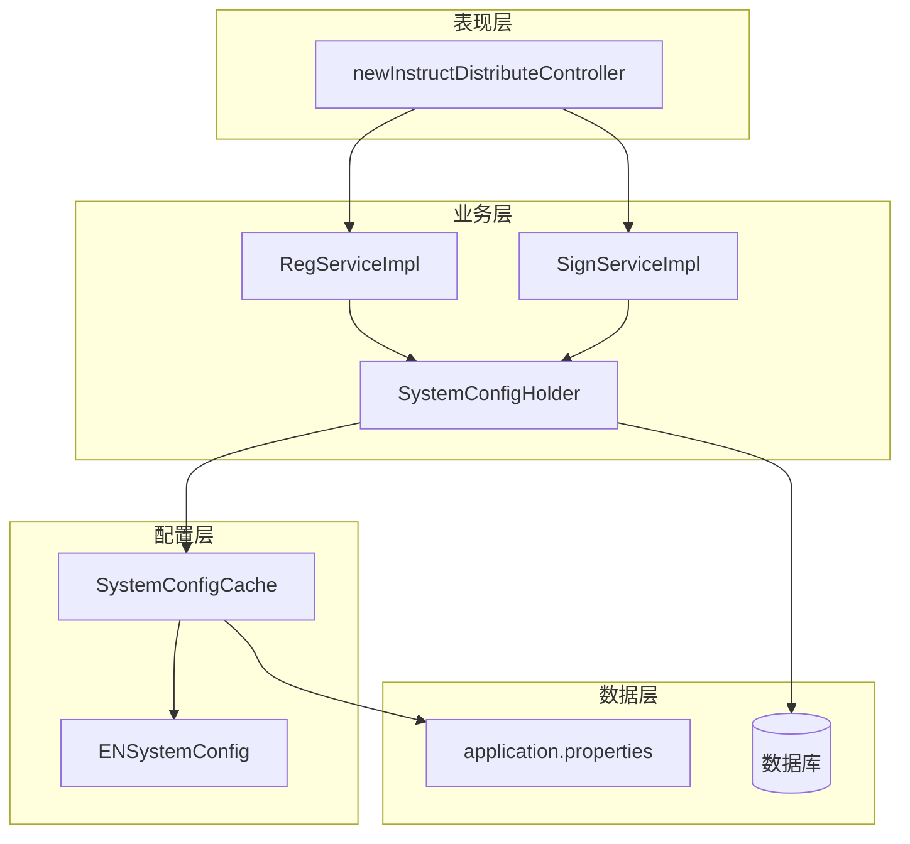
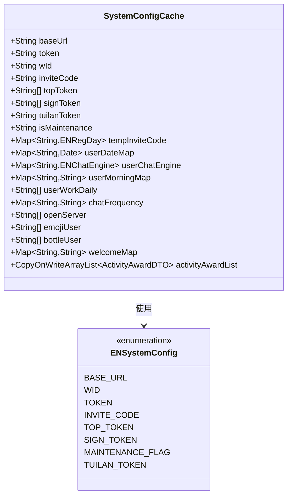
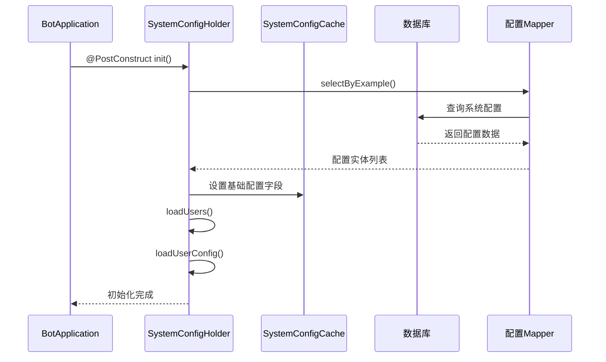
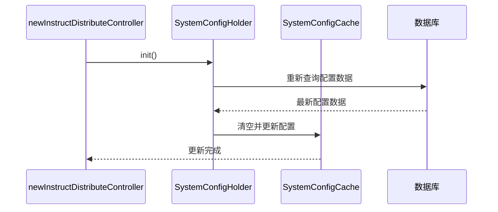
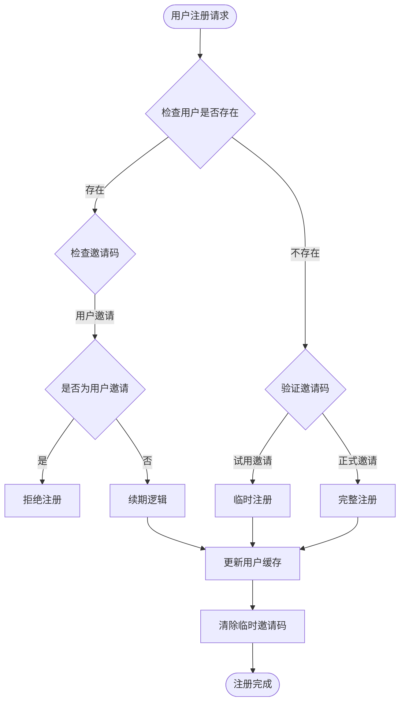
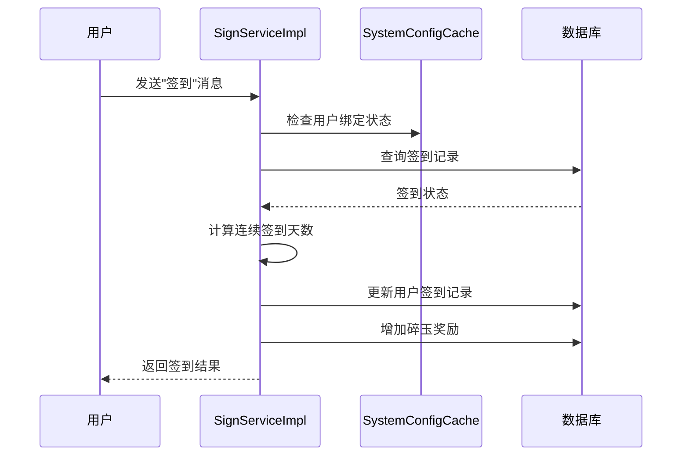
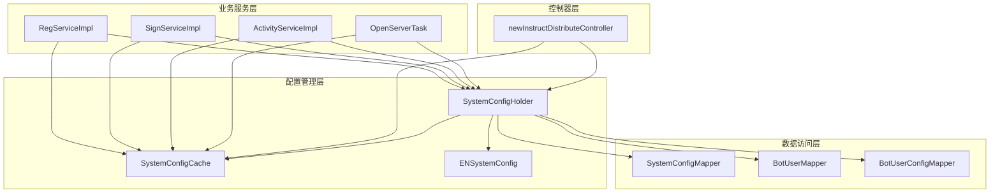
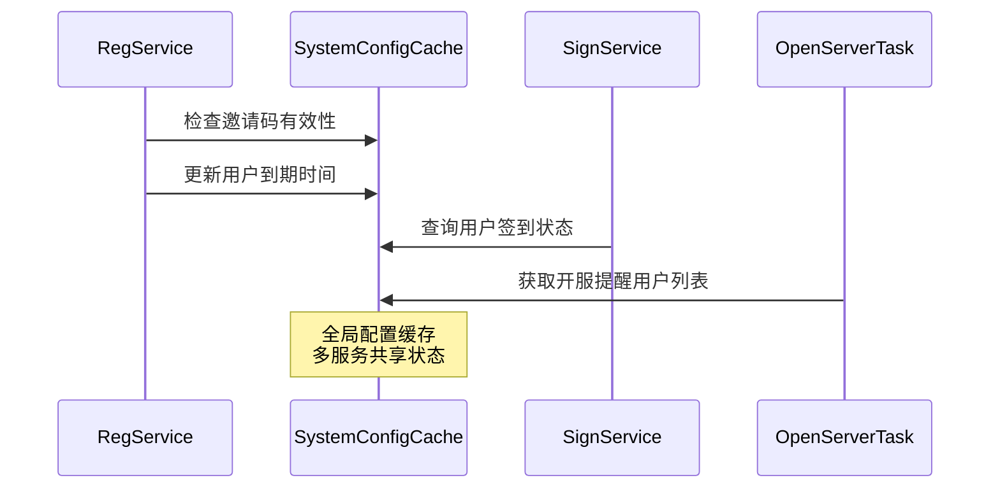

# 系统配置管理

<cite>
**本文档引用的文件**
- [SystemConfigCache.java](file://Common/src/main/java/com/bot/common/config/SystemConfigCache.java)
- [SystemConfigHolder.java](file://Game/src/main/java/com/bot/game/service/SystemConfigHolder.java)
- [RegServiceImpl.java](file://Base/src/main/java/com/bot/base/service/impl/RegServiceImpl.java)
- [SignServiceImpl.java](file://Base/src/main/java/com/bot/base/service/impl/SignServiceImpl.java)
- [ENSystemConfig.java](file://Common/src/main/java/com/bot/common/enums/ENSystemConfig.java)
- [BaseConsts.java](file://Common/src/main/java/com/bot/common/constant/BaseConsts.java)
- [newInstructDistributeController.java](file://Boot/src/main/java/com/bot/boot/controller/newInstructDistributeController.java)
- [application.properties](file://Boot/src/main/resources/application.properties)
</cite>

## 目录
1. [简介](#简介)
2. [项目结构概览](#项目结构概览)
3. [SystemConfigCache核心设计](#systemconfigcache核心设计)
4. [系统架构概览](#系统架构概览)
5. [详细组件分析](#详细组件分析)
6. [依赖关系分析](#依赖关系分析)
7. [最佳实践与注意事项](#最佳实践与注意事项)
8. [故障排除指南](#故障排除指南)
9. [总结](#总结)

## 简介

SystemConfigCache类是机器人系统的核心配置管理中心，作为全局静态配置容器，负责管理机器人运行时的各项关键参数。该类采用单例模式设计，通过SystemConfigHolder服务在系统启动时初始化，并在运行时动态更新配置数据，为整个系统的各个模块提供统一的配置访问接口。

## 项目结构概览

机器人系统采用分层架构设计，配置管理模块位于核心层，为上层业务逻辑提供配置支持：

**图表来源**
- [SystemConfigCache.java](file://Common/src/main/java/com/bot/common/config/SystemConfigCache.java#L1-L116)
- [SystemConfigHolder.java](file://Game/src/main/java/com/bot/game/service/SystemConfigHolder.java#L1-L83)

## SystemConfigCache核心设计

### 配置分类体系

SystemConfigCache按照功能将配置分为以下几大类别：

#### 基础连接配置
- **baseUrl**: 系统基础URL地址
- **token**: 认证令牌
- **wId**: 微信ID标识

#### 权限控制配置
- **topToken**: 顶级权限令牌列表
- **signToken**: 签到资格令牌列表
- **tuilanToken**: 推栏专用令牌

#### 运营配置
- **inviteCode**: 试用邀请码
- **tempInviteCode**: 临时邀请码映射表
- **isMaintenance**: 维护状态标记

#### 用户状态配置
- **userDateMap**: 用户到期时间映射
- **userChatEngine**: 用户聊天引擎配置
- **userMorningMap**: 日报订阅状态
- **userWorkDaily**: 打工日历激活用户列表

#### 功能开关配置
- **chatFrequency**: 聊天频率控制
- **openServer**: 开服提醒用户列表
- **emojiUser**: 表情功能启用用户
- **bottleUser**: 自动推送漂流瓶用户
- **welcomeMap**: 欢迎语配置

**章节来源**
- [SystemConfigCache.java](file://Common/src/main/java/com/bot/common/config/SystemConfigCache.java#L12-L114)

### 配置存储结构

**图表来源**
- [SystemConfigCache.java](file://Common/src/main/java/com/bot/common/config/SystemConfigCache.java#L12-L114)
- [ENSystemConfig.java](file://Common/src/main/java/com/bot/common/enums/ENSystemConfig.java#L8-L23)

## 系统架构概览

### 初始化流程

SystemConfigHolder负责SystemConfigCache的初始化和动态更新：

**图表来源**
- [SystemConfigHolder.java](file://Game/src/main/java/com/bot/game/service/SystemConfigHolder.java#L34-L47)

### 动态更新机制

系统支持运行时配置更新，通过reloadConfig接口实现：

**图表来源**
- [newInstructDistributeController.java](file://Boot/src/main/java/com/bot/boot/controller/newInstructDistributeController.java#L211-L215)

## 详细组件分析

### 注册服务中的配置使用

RegServiceImpl在用户注册过程中大量使用SystemConfigCache：

**图表来源**
- [RegServiceImpl.java](file://Base/src/main/java/com/bot/base/service/impl/RegServiceImpl.java#L42-L144)

### 签到服务中的配置交互

SignServiceImpl在签到过程中利用配置数据：

**图表来源**
- [SignServiceImpl.java](file://Base/src/main/java/com/bot/base/service/impl/SignServiceImpl.java#L52-L120)

### 维护状态管理

系统通过isMaintenance字段实现维护模式控制：

| 配置项 | 类型 | 用途 | 默认值 |
|--------|------|------|--------|
| isMaintenance | String | 维护状态标记 | "" |
| baseUrl | String | 基础URL | "" |
| token | String | 认证令牌 | "" |

**章节来源**
- [SystemConfigCache.java](file://Common/src/main/java/com/bot/common/config/SystemConfigCache.java#L30-L31)

### 用户状态管理

SystemConfigCache维护多种用户状态信息：

| 状态类型 | 数据结构 | 用途 | 示例 |
|----------|----------|------|------|
| 到期时间 | Map<String, Date> | 用户服务期限 | userId -> expirationDate |
| 聊天引擎 | Map<String, ENChatEngine> | 聊天功能配置 | userId -> chatEngine |
| 日报订阅 | Map<String, String> | 日报推送配置 | userId -> subscriptionType |
| 功能开关 | List<String> | 功能启用状态 | ["userId1", "userId2"] |

**章节来源**
- [SystemConfigCache.java](file://Common/src/main/java/com/bot/common/config/SystemConfigCache.java#L63-L108)

## 依赖关系分析

### 核心依赖图

**图表来源**
- [SystemConfigHolder.java](file://Game/src/main/java/com/bot/game/service/SystemConfigHolder.java#L22-L33)
- [RegServiceImpl.java](file://Base/src/main/java/com/bot/base/service/impl/RegServiceImpl.java#L10-L11)

### 模块间通信机制

各服务模块通过SystemConfigCache进行配置共享：

**图表来源**
- [RegServiceImpl.java](file://Base/src/main/java/com/bot/base/service/impl/RegServiceImpl.java#L44-L49)
- [SignServiceImpl.java](file://Base/src/main/java/com/bot/base/service/impl/SignServiceImpl.java#L101-L103)

## 最佳实践与注意事项

### 配置加载最佳实践

1. **初始化时机控制**
   - 在@PostConstruct方法中进行配置加载
   - 确保数据库连接可用后再加载配置
   - 使用事务性操作保证数据一致性

2. **缓存更新策略**
   - 实现增量更新而非全量刷新
   - 使用CopyOnWriteArrayList处理并发写入
   - 设置合理的缓存失效时间

3. **配置验证机制**
   - 对关键配置进行格式验证
   - 提供默认值避免空指针异常
   - 实现配置变更通知机制

### 错误配置处理

常见的配置错误及解决方案：

| 错误类型 | 症状 | 原因 | 解决方案 |
|----------|------|------|----------|
| 邀请码无效 | 注册失败 | inviteCode配置错误 | 检查数据库配置表 |
| Token过期 | 认证失败 | token配置错误 | 更新认证令牌 |
| URL不可达 | 请求超时 | baseUrl配置错误 | 验证基础URL |
| 缓存不一致 | 数据不准确 | 配置更新延迟 | 强制刷新缓存 |

### 性能优化建议

1. **缓存策略优化**
   - 使用适当的并发集合类型
   - 实现懒加载机制
   - 定期清理过期数据

2. **数据库访问优化**
   - 批量加载配置数据
   - 使用索引优化查询性能
   - 实现配置变更监听

**章节来源**
- [SystemConfigHolder.java](file://Game/src/main/java/com/bot/game/service/SystemConfigHolder.java#L34-L47)

## 故障排除指南

### 常见问题诊断

#### 配置加载失败
- **症状**: SystemConfigCache中配置为空
- **原因**: 数据库连接失败或配置表无数据
- **解决**: 检查数据库连接和配置表数据

#### 用户状态异常
- **症状**: 用户到期时间显示错误
- **原因**: userDateMap缓存不同步
- **解决**: 调用systemConfigHolder.loadUsers()

#### 功能开关失效
- **症状**: 某些功能无法正常使用
- **原因**: 相关配置被错误修改
- **解决**: 重载配置或恢复默认设置

### 监控与调试

建议实施以下监控措施：

1. **配置变更监控**: 记录配置修改日志
2. **缓存命中率**: 监控SystemConfigCache使用效率
3. **异常告警**: 配置加载失败时发送告警
4. **性能指标**: 监控配置访问响应时间

**章节来源**
- [newInstructDistributeController.java](file://Boot/src/main/java/com/bot/boot/controller/newInstructDistributeController.java#L211-L215)

## 总结

SystemConfigCache作为机器人系统的核心配置管理中心，通过精心设计的架构实现了配置的集中化管理。其主要特点包括：

1. **统一配置入口**: 为整个系统提供单一的配置访问接口
2. **动态更新能力**: 支持运行时配置修改和缓存刷新
3. **多服务共享**: 实现配置在不同业务模块间的共享
4. **类型安全设计**: 使用枚举和泛型确保配置类型安全
5. **并发安全保障**: 采用线程安全的数据结构处理并发访问

该设计有效降低了配置管理的复杂度，提高了系统的可维护性和扩展性，为机器人系统的稳定运行提供了坚实的配置基础。