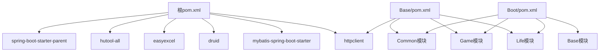
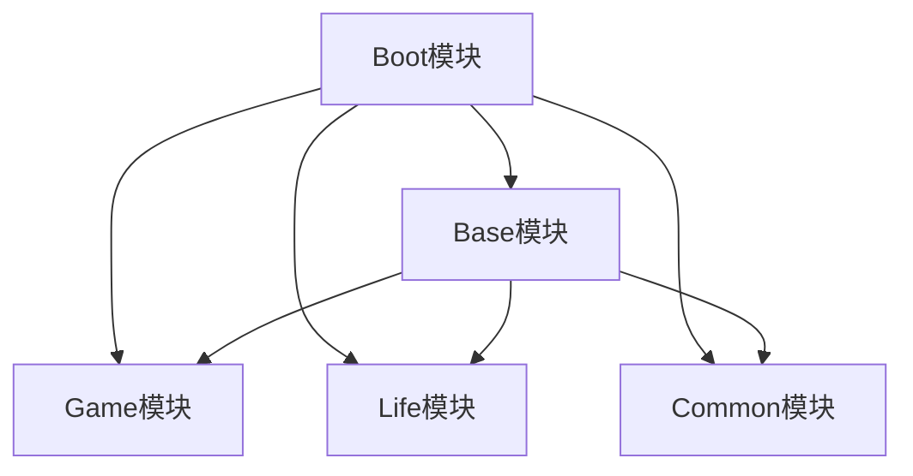
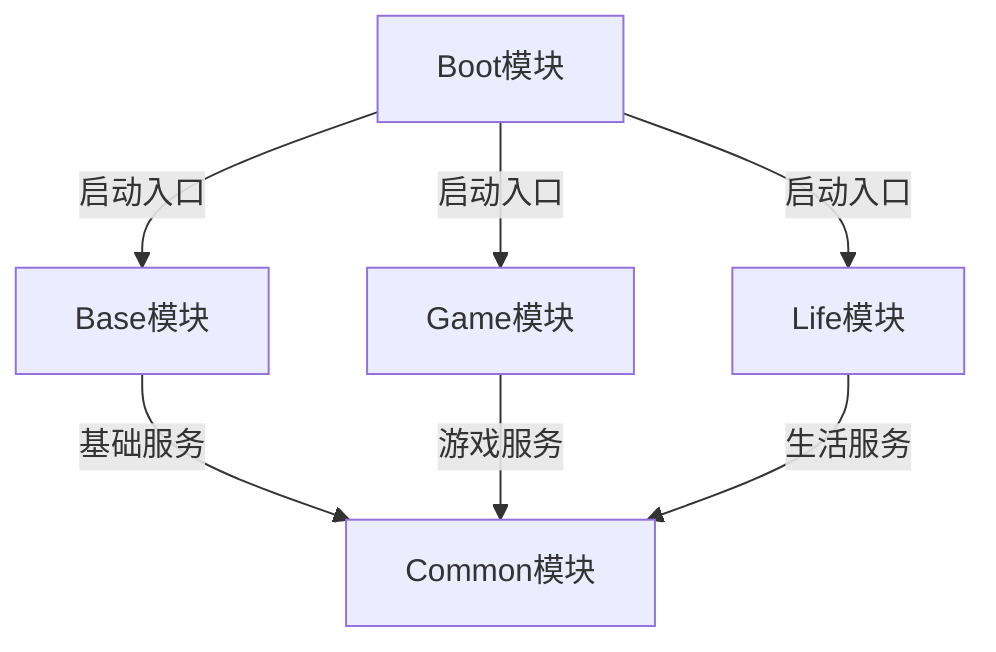
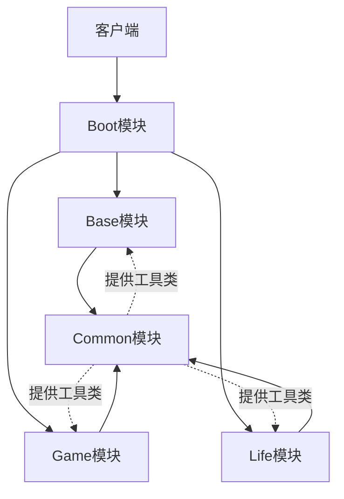
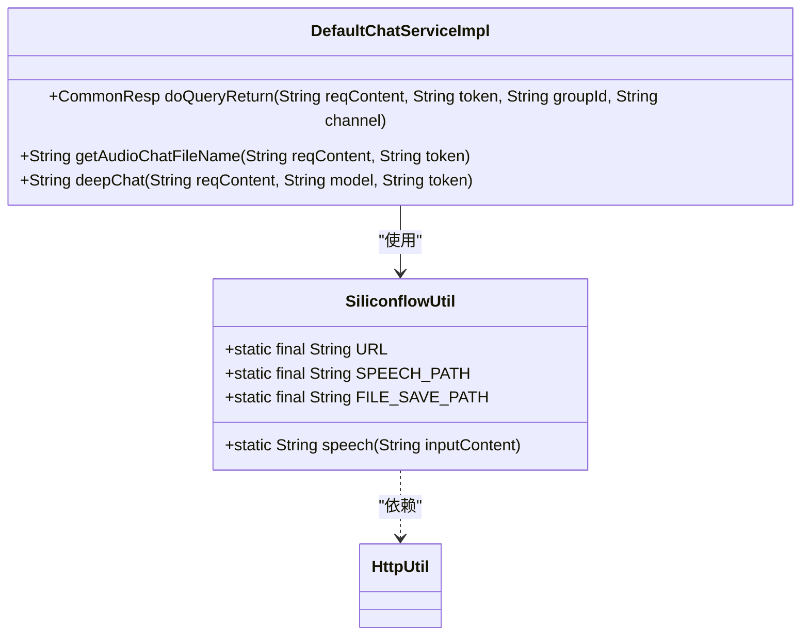
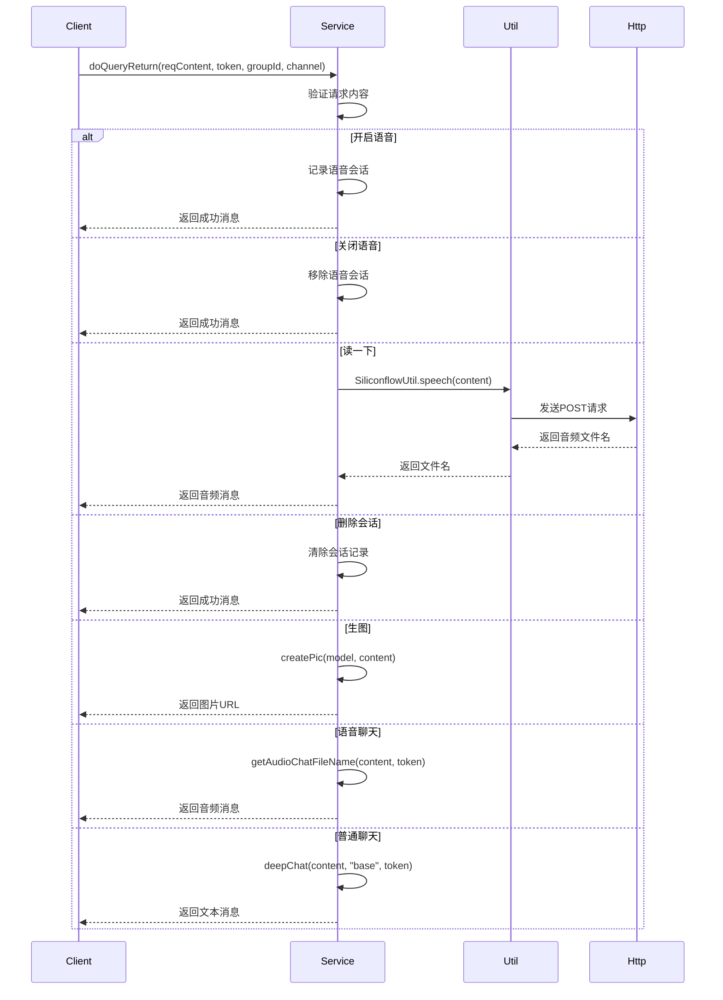
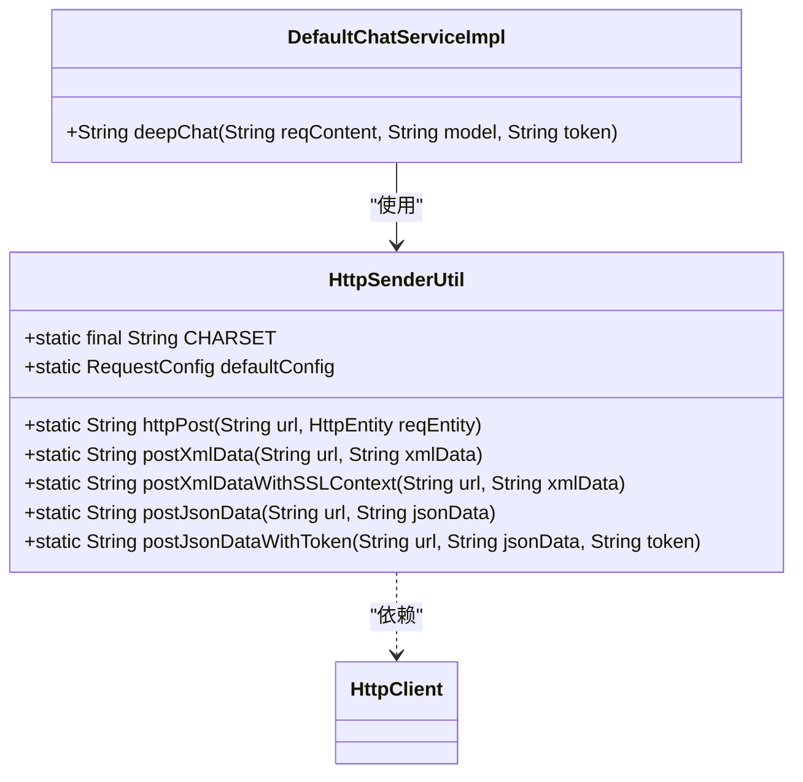

# 开发指南

<cite>
**本文档引用的文件**
- [pom.xml](file://pom.xml)
- [Base/pom.xml](file://Base/pom.xml)
- [Boot/pom.xml](file://Boot/pom.xml)
- [Life_Module_Summary.md](file://Life_Module_Summary.md)
- [Base/src/main/java/com/bot/base/util/SiliconflowUtil.java](file://Base/src/main/java/com/bot/base/util/SiliconflowUtil.java)
- [Base/src/main/java/com/bot/base/service/impl/DefaultChatServiceImpl.java](file://Base/src/main/java/com/bot/base/service/impl/DefaultChatServiceImpl.java)
- [Common/src/main/java/com/bot/common/util/HttpSenderUtil.java](file://Common/src/main/java/com/bot/common/util/HttpSenderUtil.java)
- [Boot/src/main/resources/application.properties](file://Boot/src/main/resources/application.properties)
- [Boot/src/main/java/com/bot/boot/BotApplication.java](file://Boot/src/main/java/com/bot/boot/BotApplication.java)
</cite>

## 目录
1. [项目概述](#项目概述)
2. [开发环境搭建](#开发环境搭建)
3. [项目依赖管理](#项目依赖管理)
4. [模块划分原则](#模块划分原则)
5. [代码结构与命名规范](#代码结构与命名规范)
6. [编码最佳实践](#编码最佳实践)
7. [测试策略](#测试策略)
8. [调试技巧](#调试技巧)

## 项目概述

本项目是一个基于Spring Boot框架的QQ机器人系统，采用多模块Maven项目结构。系统主要功能包括聊天交互、游戏服务、生活模拟等，通过模块化设计实现了功能的解耦和可扩展性。

项目采用Java 8作为开发语言，使用Spring Boot作为核心框架，集成MyBatis进行数据库操作，通过Hutool工具库简化开发。系统架构遵循分层设计原则，包含控制器层、服务层、数据访问层和工具层。

**Section sources**
- [pom.xml](file://pom.xml#L26-L27)
- [Boot/src/main/java/com/bot/boot/BotApplication.java](file://Boot/src/main/java/com/bot/boot/BotApplication.java#L12-L14)

## 开发环境搭建

### 基础环境要求
- JDK 1.8
- Maven 3.6+
- MySQL 5.7+
- IntelliJ IDEA（推荐）

### 环境配置步骤
1. 克隆项目代码到本地
2. 导入Maven项目到IDE
3. 配置数据库连接信息
4. 运行启动类

### 数据库配置
在`Boot/src/main/resources/application.properties`文件中配置数据库连接参数：

```properties
spring.datasource.url=jdbc:mysql://localhost:3306/bot?useUnicode=true&characterEncoding=utf8&useSSL=false&serverTimezone=UTC
spring.datasource.username=root
spring.datasource.password=password
```

### 启动项目
运行`Boot`模块中的`BotApplication`类的main方法即可启动服务。

**Section sources**
- [Boot/src/main/resources/application.properties](file://Boot/src/main/resources/application.properties#L48-L51)
- [Boot/src/main/java/com/bot/boot/BotApplication.java](file://Boot/src/main/java/com/bot/boot/BotApplication.java#L17-L19)

## 项目依赖管理

### 核心依赖说明
项目采用Maven进行依赖管理，根pom.xml文件定义了全局依赖版本，各子模块继承这些配置。



**Diagram sources**
- [pom.xml](file://pom.xml#L13-L23)
- [Base/pom.xml](file://Base/pom.xml#L20-L34)
- [Boot/pom.xml](file://Boot/pom.xml#L15-L34)

### 依赖版本管理
项目通过properties标签统一管理依赖版本，避免版本冲突：

```xml
<properties>
    <java.version>1.8</java.version>
    <bot.version>1.5.0.0</bot.version>
    <hutool.version>5.7.6</hutool.version>
    <pinyin.version>2.5.1</pinyin.version>
    <http.version>4.5.5</http.version>
    <druid.version>1.1.0</druid.version>
    <spring.mybatis.version>1.2.0</spring.mybatis.version>
    <alibaba.easyexcel.version>3.0.5</alibaba.easyexcel.version>
</properties>
```

### 模块依赖关系
项目包含多个子模块，形成清晰的依赖层次：



**Diagram sources**
- [pom.xml](file://pom.xml#L6-L11)
- [Base/pom.xml](file://Base/pom.xml#L20-L34)
- [Boot/pom.xml](file://Boot/pom.xml#L15-L34)

**Section sources**
- [pom.xml](file://pom.xml#L25-L35)
- [Base/pom.xml](file://Base/pom.xml#L19-L45)
- [Boot/pom.xml](file://Boot/pom.xml#L14-L35)

## 模块划分原则

### 模块结构
项目采用多模块设计，各模块职责分明：



**Diagram sources**
- [pom.xml](file://pom.xml#L6-L11)
- [Boot/src/main/java/com/bot/boot/BotApplication.java](file://Boot/src/main/java/com/bot/boot/BotApplication.java#L12)

### 模块职责
根据`Life_Module_Summary.md`文档，各模块的划分原则如下：

- **Boot模块**：项目启动入口，负责整合所有模块并启动Spring Boot应用
- **Base模块**：基础功能模块，提供通用的聊天、菜单等基础服务
- **Common模块**：公共组件模块，提供跨模块使用的工具类、常量、枚举等
- **Game模块**：游戏功能模块，实现各种游戏相关的业务逻辑
- **Life模块**：生活模拟模块，提供生活类功能和服务

### 模块间通信
模块间通过接口和DTO对象进行通信，遵循松耦合原则：



**Diagram sources**
- [pom.xml](file://pom.xml#L6-L11)
- [Boot/src/main/java/com/bot/boot/BotApplication.java](file://Boot/src/main/java/com/bot/boot/BotApplication.java#L12-L14)
- [Base/pom.xml](file://Base/pom.xml#L20-L34)

**Section sources**
- [pom.xml](file://pom.xml#L6-L11)
- [Life_Module_Summary.md](file://Life_Module_Summary.md)

## 代码结构与命名规范

### 包结构规范
项目遵循标准的Maven目录结构和包命名规范：

```
com.bot
├── boot                    # 启动模块
├── base                    # 基础模块
│   ├── chain               # 责任链模式实现
│   ├── dto                 # 数据传输对象
│   ├── service             # 服务接口
│   │   └── impl            # 服务实现
│   ├── task                # 定时任务
│   └── util                # 工具类
├── common                  # 公共模块
│   ├── config              # 配置类
│   ├── constant            # 常量类
│   ├── dto                 # 数据传输对象
│   ├── enums               # 枚举类
│   ├── exception           # 异常类
│   └── util                # 工具类
├── game                    # 游戏模块
└── life                    # 生活模块
```

### 类命名规范
- 服务接口：以`Service`结尾，如`BaseService`
- 服务实现：以`ServiceImpl`结尾，如`DefaultChatServiceImpl`
- 数据传输对象：以`DTO`结尾，如`ChatIdDTO`
- 异常类：以`Exception`结尾，如`BotException`
- 工具类：以`Util`结尾，如`SiliconflowUtil`

### 方法命名规范
- 遵循驼峰命名法
- 动词开头，如`doQueryReturn`、`getAudioChatFileName`
- 布尔方法以`is`、`has`、`can`等开头
- 避免使用缩写，保持方法名的可读性

**Section sources**
- [Base/src/main/java/com/bot/base/service/impl/DefaultChatServiceImpl.java](file://Base/src/main/java/com/bot/base/service/impl/DefaultChatServiceImpl.java#L28)
- [Base/src/main/java/com/bot/base/dto/ChatIdDTO.java](file://Base/src/main/java/com/bot/base/dto/ChatIdDTO.java)
- [Common/src/main/java/com/bot/common/exception/BotException.java](file://Common/src/main/java/com/bot/common/exception/BotException.java)
- [Base/src/main/java/com/bot/base/util/SiliconflowUtil.java](file://Base/src/main/java/com/bot/base/util/SiliconflowUtil.java)

## 编码最佳实践

### 工具类使用示例
以`SiliconflowUtil`为例，展示了如何封装外部API调用：



**Diagram sources**
- [Base/src/main/java/com/bot/base/util/SiliconflowUtil.java](file://Base/src/main/java/com/bot/base/util/SiliconflowUtil.java#L16-L82)
- [Base/src/main/java/com/bot/base/service/impl/DefaultChatServiceImpl.java](file://Base/src/main/java/com/bot/base/service/impl/DefaultChatServiceImpl.java#L28)

### 服务实现模式
`DefaultChatServiceImpl`展示了典型的服务实现模式：



**Diagram sources**
- [Base/src/main/java/com/bot/base/service/impl/DefaultChatServiceImpl.java](file://Base/src/main/java/com/bot/base/service/impl/DefaultChatServiceImpl.java#L64-L97)

### HTTP工具类设计
`HttpSenderUtil`展示了如何封装HTTP请求：



**Diagram sources**
- [Common/src/main/java/com/bot/common/util/HttpSenderUtil.java](file://Common/src/main/java/com/bot/common/util/HttpSenderUtil.java#L45-L200)
- [Base/src/main/java/com/bot/base/service/impl/DefaultChatServiceImpl.java](file://Base/src/main/java/com/bot/base/service/impl/DefaultChatServiceImpl.java#L142-L144)

**Section sources**
- [Base/src/main/java/com/bot/base/util/SiliconflowUtil.java](file://Base/src/main/java/com/bot/base/util/SiliconflowUtil.java#L16-L82)
- [Base/src/main/java/com/bot/base/service/impl/DefaultChatServiceImpl.java](file://Base/src/main/java/com/bot/base/service/impl/DefaultChatServiceImpl.java#L28-L199)
- [Common/src/main/java/com/bot/common/util/HttpSenderUtil.java](file://Common/src/main/java/com/bot/common/util/HttpSenderUtil.java#L45-L200)

## 测试策略

### 单元测试
项目使用Spring Boot Test进行单元测试，测试类命名以`Test`结尾，如`Test.java`。

### 集成测试
通过`@SpringBootTest`注解进行集成测试，确保各组件协同工作正常。

### 测试覆盖
建议测试覆盖以下方面：
- 服务方法的正常流程
- 异常处理逻辑
- 边界条件
- 性能测试

### 测试工具
- JUnit 5
- Mockito
- Spring Test

**Section sources**
- [Base/src/main/java/com/bot/base/service/impl/Test.java](file://Base/src/main/java/com/bot/base/service/impl/Test.java)

## 调试技巧

### 日志配置
项目使用Logback进行日志记录，配置文件位于`Boot/src/main/resources/logback-spring.xml`。

```xml
<configuration>
    <property name="logback.path" value="${logback.rootPath}/bot-controller" />
    <property name="project.name" value="bot" />
    
    <appender name="CONSOLE" class="ch.qos.logback.core.ConsoleAppender">
        <filter class="ch.qos.logback.classic.filter.ThresholdFilter">
            <level>TRACE</level>
        </filter>
        <encoder charset="${logback.charset}">
            <pattern>${logback.pattern}</pattern>
        </encoder>
    </appender>
</configuration>
```

### 调试建议
1. 使用`@Slf4j`注解简化日志记录
2. 在关键方法入口和出口添加日志
3. 记录重要变量的值
4. 使用断点调试复杂逻辑

### 常见问题排查
- **依赖冲突**：检查Maven依赖树
- **配置错误**：验证application.properties配置
- **数据库连接**：检查数据库URL、用户名和密码
- **API调用失败**：检查网络连接和API密钥

**Section sources**
- [Boot/src/main/resources/logback-spring.xml](file://Boot/src/main/resources/logback-spring.xml#L1-L27)
- [Base/src/main/java/com/bot/base/service/impl/DefaultChatServiceImpl.java](file://Base/src/main/java/com/bot/base/service/impl/DefaultChatServiceImpl.java#L26)