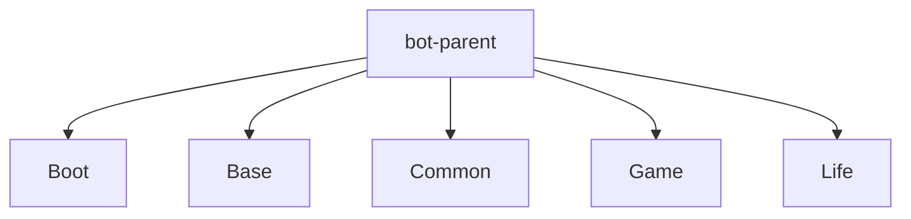
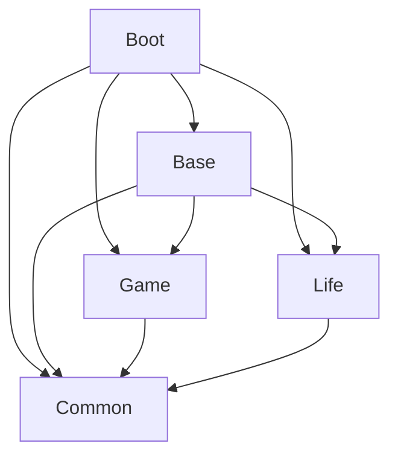
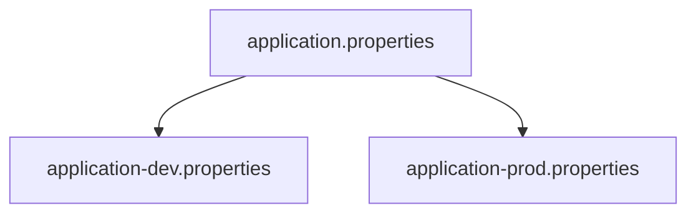

# 开发环境搭建

<cite>
**本文档引用的文件**  
- [pom.xml](file://pom.xml)
- [Boot/pom.xml](file://Boot/pom.xml)
- [Base/pom.xml](file://Base/pom.xml)
- [Common/pom.xml](file://Common/pom.xml)
- [Game/pom.xml](file://Game/pom.xml)
- [Life/pom.xml](file://Life/pom.xml)
- [Boot/src/main/resources/application.properties](file://Boot/src/main/resources/application.properties)
- [Boot/src/main/resources/application-dev.properties](file://Boot/src/main/resources/application-dev.properties)
- [Boot/src/main/resources/application-prod.properties](file://Boot/src/main/resources/application-prod.properties)
- [Boot/src/main/resources/logback-spring.xml](file://Boot/src/main/resources/logback-spring.xml)
- [Boot/src/main/java/com/bot/boot/BotApplication.java](file://Boot/src/main/java/com/bot/boot/BotApplication.java)
- [Life_Deployment_Guide.md](file://Life_Deployment_Guide.md)
- [Life_Database_Init.sql](file://Life_Database_Init.sql)
</cite>

## 目录
1. [开发环境要求](#开发环境要求)
2. [Maven多模块项目依赖管理](#maven多模块项目依赖管理)
3. [环境变量与配置说明](#环境变量与配置说明)
4. [IDE导入与配置](#ide导入与配置)
5. [常见问题与解决方案](#常见问题与解决方案)

## 开发环境要求

本项目为基于Spring Boot的Java多模块Maven项目，开发环境需满足以下要求：

- **Java版本**：Java 8（项目在`pom.xml`中明确指定`<java.version>1.8</java.version>`）
- **Maven版本**：3.6或更高版本
- **数据库**：MySQL 5.7或更高版本
- **构建工具**：Maven（推荐使用Maven Wrapper `mvnw.cmd`）
- **推荐IDE**：IntelliJ IDEA（支持Spring Boot和MyBatis插件）

项目基于Spring Boot 2.3.4.RELEASE构建，使用了Lombok、Hutool、MyBatis等常用框架和工具库。

**Section sources**
- [pom.xml](file://pom.xml#L26-L27)
- [Life_Deployment_Guide.md](file://Life_Deployment_Guide.md#L5-L8)

## Maven多模块项目依赖管理

本项目采用Maven多模块架构，主`pom.xml`文件定义了全局依赖和版本管理，各子模块通过继承父POM实现依赖统一管理。

### 项目模块结构



**Diagram sources**
- [pom.xml](file://pom.xml#L6-L11)

### 依赖管理机制

主`pom.xml`通过`<properties>`标签定义了所有依赖的版本号，实现版本集中管理：

```xml
<properties>
    <java.version>1.8</java.version>
    <bot.version>1.5.0.0</bot.version>
    <hutool.version>5.7.6</hutool.version>
    <alibaba.easyexcel.version>3.0.5</alibaba.easyexcel.version>
    <!-- 其他依赖版本 -->
</properties>
```

各子模块通过`${property}`方式引用这些版本，确保依赖一致性。

### 子模块依赖关系

各子模块之间的依赖关系如下：



**Diagram sources**
- [Boot/pom.xml](file://Boot/pom.xml#L14-L34)
- [Base/pom.xml](file://Base/pom.xml#L19-L34)
- [Game/pom.xml](file://Game/pom.xml#L14-L19)
- [Life/pom.xml](file://Life/pom.xml#L14-L19)

- **Boot模块**：作为启动模块，依赖所有其他业务模块
- **Base模块**：基础业务模块，依赖Common、Game和Life模块
- **Common模块**：公共组件模块，被所有其他模块依赖
- **Game模块**：游戏业务模块，仅依赖Common模块
- **Life模块**：浮生卷业务模块，仅依赖Common模块

这种依赖结构确保了模块间的低耦合和高内聚。

**Section sources**
- [pom.xml](file://pom.xml#L25-L35)
- [Boot/pom.xml](file://Boot/pom.xml#L14-L34)
- [Base/pom.xml](file://Base/pom.xml#L19-L34)

## 环境变量与配置说明

项目使用Spring Profiles实现多环境配置，通过`application.properties`中的`spring.profiles.active`属性切换环境。

### 配置文件结构

项目包含以下配置文件：



**Diagram sources**
- [Boot/src/main/resources/application.properties](file://Boot/src/main/resources/application.properties#L2)
- [Boot/src/main/resources/application-dev.properties](file://Boot/src/main/resources/application-dev.properties)
- [Boot/src/main/resources/application-prod.properties](file://Boot/src/main/resources/application-prod.properties)

### 数据库连接配置

数据库连接配置在`application.properties`中定义：

```properties
spring.datasource.url=jdbc:mysql://47.92.127.30:3306/bot?useUnicode=true&characterEncoding=utf8&useSSL=false&serverTimezone=UTC
spring.datasource.username=root
spring.datasource.password=gouzaizi@123
spring.datasource.driver-class-name=com.mysql.cj.jdbc.Driver
```

### 外部API密钥配置

项目使用了多个外部API，相关密钥配置如下：

| 配置项 | 示例值 | 说明 |
|--------|--------|------|
| jd.key | f15a38879f2aae87be1c46fdebfd9b39 | 京东智联云API密钥 |
| constellation.key | 4a11bbcbf089edaf14c2d9bdb80c2ec4 | 星座查询API密钥 |
| driver.key | da39dce4f8aa52155677ed8cd23a6470 | 驾照考试查询API密钥 |
| chat.key | sk-ymrdvcfjszkwtelpdclkixnyrouixanwyjrrvktsxazjhijw | 聊天AI API密钥 |
| pic.create.url | https://api.siliconflow.cn/v1/images/generations | 图片生成API地址 |

### 日志配置

日志系统使用Logback，配置文件`logback-spring.xml`中定义了日志输出格式和路径：

```xml
<springProperty scope="context" name="logback.rootPath" source="logback.rootPath"/>
<property name="logback.path" value="${logback.rootPath}/bot-controller" />
```

不同环境的日志路径：
- 开发环境：`D:\home\gardpay\reconciliation\logs\`
- 生产环境：`/data/project/bot/logs`

**Section sources**
- [Boot/src/main/resources/application.properties](file://Boot/src/main/resources/application.properties#L47-L63)
- [Boot/src/main/resources/application-dev.properties](file://Boot/src/main/resources/application-dev.properties#L34-L37)
- [Boot/src/main/resources/application-prod.properties](file://Boot/src/main/resources/application-prod.properties#L71-L74)
- [Boot/src/main/resources/logback-spring.xml](file://Boot/src/main/resources/logback-spring.xml#L4-L5)

## IDE导入与配置

### IntelliJ IDEA导入步骤

1. 打开IntelliJ IDEA，选择"Open"或"Import Project"
2. 选择项目根目录``
3. 选择"Maven"项目类型，点击"OK"
4. 等待Maven自动导入所有模块和依赖
5. 配置JDK为Java 8

### IDE插件推荐

- **Lombok Plugin**：支持Lombok注解的代码生成
- **MyBatisX**：MyBatis接口与XML映射导航
- **Spring Boot Helper**：Spring Boot配置文件支持
- **Rainbow Brackets**：括号配对高亮
- **Alibaba Java Coding Guidelines**：代码规范检查

### 项目结构配置

在IDEA中，项目将显示为以下模块结构：
- bot (父项目)
  - Boot (启动模块)
  - Base (基础模块)
  - Common (公共模块)
  - Game (游戏模块)
  - Life (浮生卷模块)

### 启动配置

创建Spring Boot启动配置：
- Main Class: `com.bot.boot.BotApplication`
- Profiles: dev 或 prod
- VM Options: 可根据需要添加JVM参数

```java
@SpringBootApplication(scanBasePackages = {"com.bot.boot","com.bot.base","com.bot.game","com.bot.life", "com.bot.common.loader"})
@MapperScan({"com.bot.game.dao.mapper", "com.bot.life.dao.mapper"})
@EnableScheduling
public class BotApplication {
    public static void main(String[] args) {
        SpringApplication.run(BotApplication.class, args);
    }
}
```

**Section sources**
- [Boot/src/main/java/com/bot/boot/BotApplication.java](file://Boot/src/main/java/com/bot/boot/BotApplication.java#L12-L14)

## 常见问题与解决方案

### 数据库初始化

根据`Life_Deployment_Guide.md`，数据库初始化步骤如下：

1. 创建数据库：
```sql
CREATE DATABASE IF NOT EXISTS bot DEFAULT CHARSET utf8mb4;
```

2. 执行初始化脚本：
```sql
source Life_Database_Init.sql;
```

该脚本创建了浮生卷模块所需的全部表结构，包括玩家表、装备表、技能表、地图表等。

### Maven依赖下载失败

**问题现象**：Maven依赖无法下载，出现"Could not find artifact"错误

**解决方案**：
1. 检查Maven仓库配置，确保`settings.xml`中配置了正确的镜像源
2. 清理本地仓库缓存：删除`~/.m2/repository`中相关依赖目录
3. 手动执行`mvn clean compile`重新下载依赖
4. 检查网络连接，确保可以访问Maven中央仓库

### Spring Boot启动异常

**问题现象**：应用启动时出现Bean创建失败或端口占用错误

**解决方案**：
1. 检查`application.properties`中的`server.port`配置，确保端口未被占用
2. 验证数据库连接配置是否正确
3. 检查MyBatis Mapper扫描路径是否正确配置
4. 确认所有必需的依赖模块都已正确导入

### 数据库连接失败

**问题现象**：启动时出现"Cannot connect to database"错误

**解决方案**：
1. 确认MySQL服务已启动
2. 验证数据库连接字符串、用户名和密码
3. 检查数据库用户权限设置
4. 确认MySQL驱动版本与数据库版本兼容

### 图片生成失败

**问题现象**：浮生卷功能中图片无法生成

**解决方案**：
1. 确认`life_back.png`背景图片存在于项目根目录
2. 检查`ImageGenerationServiceImpl`中的路径配置
3. 验证输出目录权限是否足够
4. 确认字体文件是否可用

### 环境配置验证

部署完成后，可通过以下方式验证环境配置：

1. **检查日志**：确认Spring容器正常启动，数据库连接成功
2. **测试功能**：通过聊天机器人发送"浮生卷"测试游戏入口
3. **数据库验证**：执行`SHOW TABLES LIKE 'life_%';`检查表创建情况

**Section sources**
- [Life_Deployment_Guide.md](file://Life_Deployment_Guide.md#L12-L134)
- [Life_Database_Init.sql](file://Life_Database_Init.sql#L1-L200)