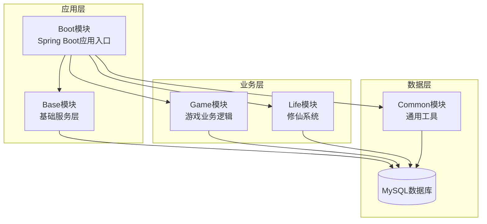
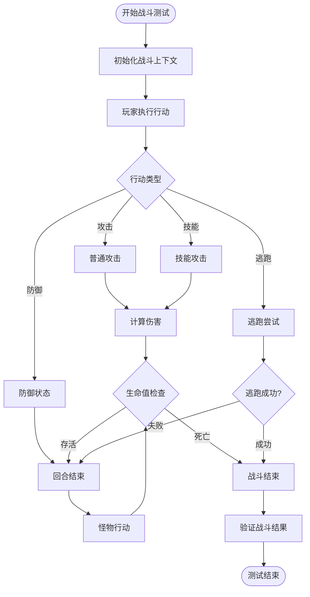
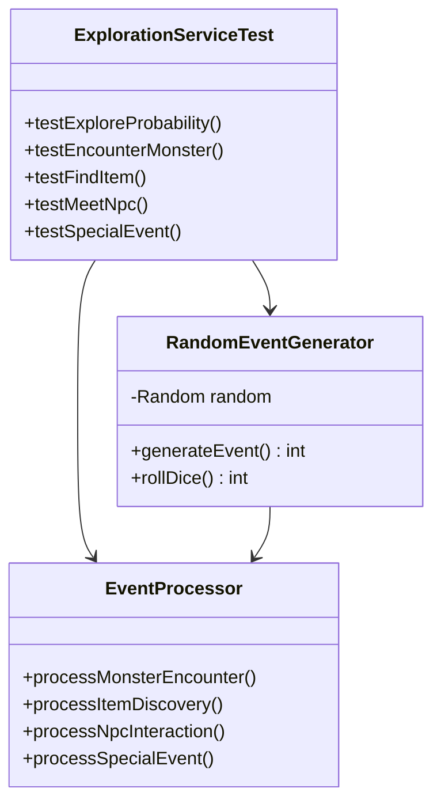
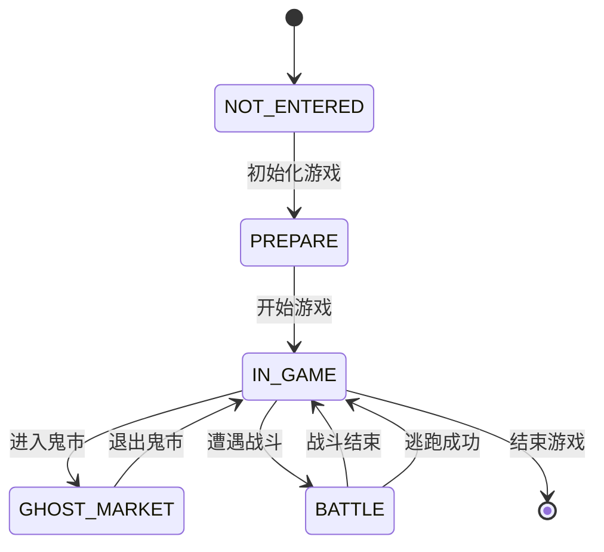
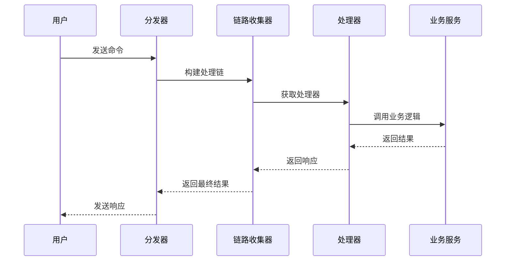
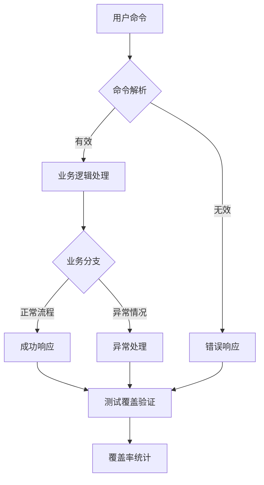

# 测试策略

<cite>
**本文档引用的文件**
- [Life_Battle_Method_Fix.md](file://Life_Battle_Method_Fix.md)
- [Life_Method_Call_Fix.md](file://Life_Method_Call_Fix.md)
- [Life_Second_Test_Fixes.md](file://Life_Second_Test_Fixes.md)
- [Life_MyBatis_Configuration_Fix.md](file://Life_MyBatis_Configuration_Fix.md)
- [Life_Spring_Integration_Fix.md](file://Life_Spring_Integration_Fix.md)
- [pom.xml](file://pom.xml)
- [application.properties](file://Boot/src/main/resources/application.properties)
- [LifeHandlerImpl.java](file://Life\src\main\java\com\bot\life\service\impl\LifeHandlerImpl.java)
- [BattleServiceImpl.java](file://Life\src\main\java\com\bot\life\service\impl\BattleServiceImpl.java)
- [ExplorationServiceImpl.java](file://Life\src\main\java\com\bot\life\service\impl\ExplorationServiceImpl.java)
- [ENGameMode.java](file://Life\src\main\java\com\bot\life\enums\ENGameMode.java)
- [LifeBattleState.java](file://Life\src\main\java\com\bot\life\dao\entity\LifeBattleState.java)
- [BattleService.java](file://Life\src\main\java\com\bot\life\service\BattleService.java)
- [GameChainCollector.java](file://Game\src\main\java\com\bot\game\chain\GameChainCollector.java)
- [DistributorServiceImpl.java](file://Base\src\main\java\com\bot\base\service\impl\DistributorServiceImpl.java)
</cite>

## 目录
1. [概述](#概述)
2. [项目架构分析](#项目架构分析)
3. [测试框架配置](#测试框架配置)
4. [测试策略分类](#测试策略分类)
5. [核心模块测试设计](#核心模块测试设计)
6. [MyBatis映射器测试](#mybatis映射器测试)
7. [消息分发链测试](#消息分发链测试)
8. [测试数据准备方案](#测试数据准备方案)
9. [自动化测试脚本](#自动化测试脚本)
10. [常见测试陷阱与调试技巧](#常见测试陷阱与调试技巧)
11. [测试覆盖率要求](#测试覆盖率要求)
12. [总结](#总结)

## 概述

本文档基于Life_Battle_Method_Fix.md、Life_Method_Call_Fix.md等修复记录，结合项目历史缺陷类型分析，制定全面的测试策略。项目采用Spring Boot框架，包含Base、Boot、Common、Game、Life五个模块，核心功能包括修仙游戏系统、战斗系统、探索系统等。

### 测试目标

- **质量保证**：确保核心业务逻辑的正确性和稳定性
- **缺陷预防**：针对历史缺陷类型建立针对性的测试用例
- **性能保障**：验证系统在高并发场景下的表现
- **兼容性测试**：确保各模块间的集成稳定

## 项目架构分析



**架构图来源**
- [pom.xml](file://pom.xml#L1-L147)
- [Boot模块结构](file://Boot\pom.xml#L1-L41)

### 核心模块职责

| 模块 | 主要功能 | 测试重点 |
|------|----------|----------|
| Base | 基础服务、消息分发 | 服务层Mock、集成测试 |
| Game | 游戏菜单系统、消息系统 | 链式调用、状态管理 |
| Life | 修仙系统、战斗系统 | 复杂业务逻辑、数据一致性 |
| Common | 通用工具、常量定义 | 工具类、枚举类 |

**章节来源**
- [项目结构分析](file://pom.xml#L34-L147)

## 测试框架配置

### Maven依赖配置

项目使用Spring Boot Starter Test作为主要测试框架，包含以下核心依赖：

```xml
<dependency>
    <groupId>org.springframework.boot</groupId>
    <artifactId>spring-boot-starter-test</artifactId>
    <scope>test</scope>
    <exclusions>
        <exclusion>
            <groupId>org.junit.vintage</groupId>
            <artifactId>junit-vintage-engine</artifactId>
        </exclusion>
    </exclusions>
</dependency>
```

### 测试环境配置

测试配置继承自生产环境，但使用内存数据库进行隔离测试：

```properties
# 测试专用配置
spring.datasource.url=jdbc:h2:mem:testdb
spring.datasource.driver-class-name=org.h2.Driver
spring.jpa.database-platform=org.hibernate.dialect.H2Dialect
spring.h2.console.enabled=true
```

**章节来源**
- [Maven依赖配置](file://pom.xml#L71-L81)
- [Spring Boot测试配置](file://pom.xml#L71-L81)

## 测试策略分类

### 1. 单元测试（JUnit）

**适用范围**：服务层方法、工具类、业务逻辑验证

**测试原则**：
- 每个方法至少一个测试用例
- 边界条件全覆盖
- 异常情况单独测试

**Mock使用规范**：
```java
@ExtendWith(MockitoExtension.class)
class BattleServiceTest {
    @Mock
    private LifeSkillMapper skillMapper;
    
    @InjectMocks
    private BattleServiceImpl battleService;
    
    @Test
    void testCalculateDamage() {
        // Mock行为设置
        when(skillMapper.selectByPlayerId(anyLong())).thenReturn(mockSkills);
        
        // 执行测试
        Integer damage = battleService.calculateDamage(attacker, defender, 1.0, true);
        
        // 验证结果
        assertThat(damage).isGreaterThan(0);
    }
}
```

### 2. 集成测试（Spring Test）

**适用范围**：服务间协作、数据库操作、配置验证

**测试场景**：
- 服务依赖注入验证
- 数据库事务管理
- 配置文件加载测试

### 3. 端到端测试

**适用范围**：完整业务流程、用户交互

**测试重点**：
- 用户命令处理流程
- 多模块协作验证
- 性能基准测试

## 核心模块测试设计

### 战斗系统测试

基于Life_Battle_Method_Fix.md中的修复案例，战斗系统是测试的重点模块。

#### 战斗服务测试用例设计



**流程图来源**
- [BattleServiceImpl.java](file://Life\src\main\java\com\bot\life\service\impl\BattleServiceImpl.java#L56-L117)

#### 关键测试场景

| 测试场景 | 输入条件 | 预期输出 | 测试重点 |
|----------|----------|----------|----------|
| 普通攻击 | 玩家vs怪物，无特殊状态 | 造成伤害，回合切换 | 伤害计算准确性 |
| 技能使用 | 玩家有技能，可使用 | 技能效果，消耗MP | 技能逻辑完整性 |
| 逃跑成功 | 玩家速度>怪物 | 逃跑成功，战斗结束 | 逃跑算法正确性 |
| 逃跑失败 | 玩家速度≤怪物 | 逃跑失败，回合继续 | 逃跑概率计算 |
| 怪物反击 | 怪物生命值>0 | 怪物攻击，玩家受伤 | AI逻辑正确性 |

**章节来源**
- [战斗服务接口](file://Life\src\main\java\com\bot\life\service\BattleService.java#L1-L46)
- [战斗实体模型](file://Life\src\main\java\com\bot\life\dao\entity\LifeBattleState.java#L1-L24)

### 探索系统测试

探索系统是修仙游戏的核心功能，涉及随机事件、怪物遭遇等复杂逻辑。

#### 探索事件概率测试



**类图来源**
- [ExplorationServiceImpl.java](file://Life\src\main\java\com\bot\life\service\impl\ExplorationServiceImpl.java#L34-L60)

#### 探索系统测试用例

| 测试类型 | 测试内容 | 验证要点 | 数据准备 |
|----------|----------|----------|----------|
| 概率测试 | 70%怪物，15%道具，10%NPC，5%特殊事件 | 概率分布合理性 | 大量随机测试 |
| 怪物遭遇 | 玩家位置vs怪物分布 | 怪物出现逻辑 | 地图数据准备 |
| 体力消耗 | 探索后体力变化 | 体力计算准确性 | 玩家状态初始化 |
| 状态检查 | 体力不足时的行为 | 状态验证逻辑 | 低体力状态 |

**章节来源**
- [探索服务实现](file://Life\src\main\java\com\bot\life\service\impl\ExplorationServiceImpl.java#L34-L200)

### 游戏模式状态测试

基于ENGameMode枚举，测试不同游戏模式的状态转换和验证。



**状态图来源**
- [ENGameMode.java](file://Life\src\main\java\com\bot\life\enums\ENGameMode.java#L8-L12)

## MyBatis映射器测试

### 测试目标

验证MyBatis映射器的正确性，确保数据库操作的可靠性。

### 测试策略

#### 1. Mapper接口测试

```java
@SpringBootTest
@TestPropertySource(properties = {
    "mybatis.mapper-locations=classpath*:mapper/*.xml",
    "mybatis.configuration.map-underscore-to-camel-case=true"
})
class LifePlayerMapperTest {
    
    @Autowired
    private LifePlayerMapper playerMapper;
    
    @Test
    void testSelectPlayerById() {
        // 准备测试数据
        LifePlayer player = new LifePlayer();
        player.setUserId("test_user");
        player.setNickname("测试玩家");
        playerMapper.insert(player);
        
        // 执行查询
        LifePlayer result = playerMapper.selectByUserId("test_user");
        
        // 验证结果
        assertThat(result).isNotNull();
        assertThat(result.getNickname()).isEqualTo("测试玩家");
    }
    
    @Test
    void testUpdatePlayer() {
        // 准备测试数据
        LifePlayer player = createTestPlayer();
        
        // 执行更新
        player.setNickname("更新后的昵称");
        playerMapper.updateByPrimaryKey(player);
        
        // 验证更新
        LifePlayer updated = playerMapper.selectByPrimaryKey(player.getId());
        assertThat(updated.getNickname()).isEqualTo("更新后的昵称");
    }
}
```

#### 2. SQL映射测试

针对每个Mapper XML文件进行SQL语句验证：

| Mapper文件 | 测试重点 | 验证内容 |
|------------|----------|----------|
| LifePlayerMapper.xml | CRUD操作 | 插入、查询、更新、删除 |
| LifeBattleStateMapper.xml | 战斗状态 | 战斗开始、状态更新、战斗结束 |
| LifeMonsterMapper.xml | 怪物数据 | 怪物查询、属性计算 |
| LifeItemMapper.xml | 物品系统 | 物品获取、使用、丢弃 |

**章节来源**
- [MyBatis配置修复](file://Life_MyBatis_Configuration_Fix.md#L55-L101)
- [应用配置](file://Boot\src\main\resources\application.properties#L64-L69)

## 消息分发链测试

### 测试目标

验证消息分发链的正确性和效率，确保用户命令能够正确路由到相应的处理器。

### 测试架构



**序列图来源**
- [DistributorServiceImpl.java](file://Base\src\main\java\com\bot\base\service\impl\DistributorServiceImpl.java#L125-L142)
- [GameChainCollector.java](file://Game\src\main\java\com\bot\game\chain\GameChainCollector.java#L35-L40)

### 链式调用测试用例

#### 基础链路测试

```java
@SpringBootTest
class MessageChainTest {
    
    @Autowired
    private GameChainCollector chainCollector;
    
    @Test
    void testMainMenuChain() {
        // 模拟用户令牌
        String token = "test_token";
        
        // 构建主菜单链路
        String response = chainCollector.buildCollector(token, new HashMap<>());
        
        // 验证响应包含主菜单选项
        assertThat(response).contains("1. 查看角色信息");
        assertThat(response).contains("2. 游历探索");
        assertThat(response).contains("3. 传送");
    }
    
    @Test
    void testNestedMenuChain() {
        // 测试嵌套菜单链路
        Menu menu = new MessageMenuPrinter("test_token");
        
        // 验证子菜单构建
        assertThat(menu.getMenuChildrenMap()).isNotEmpty();
        assertThat(menu.getMenuChildrenMap().values())
            .allMatch(child -> child instanceof MessageDetailPrinter);
    }
}
```

#### 状态管理测试

```java
@Test
void testChainStateManagement() {
    // 测试链路状态的正确传递
    String token = "user_123";
    Map<String, Object> mapperMap = new HashMap<>();
    
    // 第一次调用，应返回主菜单
    String firstResponse = chainCollector.buildCollector(token, mapperMap);
    assertThat(firstResponse).contains("主菜单");
    
    // 模拟用户选择某个选项
    mapperMap.put("selectedOption", "1");
    
    // 再次调用，应返回对应功能的菜单
    String secondResponse = chainCollector.buildCollector(token, mapperMap);
    assertThat(secondResponse).contains("角色信息");
}
```

**章节来源**
- [GameChainCollector实现](file://Game\src\main\java\com\bot\game\chain\GameChainCollector.java#L1-L40)

## 测试数据准备方案

### 数据库测试数据

#### 生产者-消费者模式

```java
@Data
@Builder
public class TestDataGenerator {
    
    private Random random = new Random();
    
    public LifePlayer createTestPlayer() {
        return LifePlayer.builder()
            .userId(UUID.randomUUID().toString())
            .nickname("测试玩家_" + random.nextInt(1000))
            .level(1)
            .experience(0L)
            .health(100)
            .maxHealth(100)
            .stamina(10)
            .maxStamina(10)
            .cultivation(0L)
            .spirit(100L)
            .build();
    }
    
    public LifeMonster createTestMonster() {
        return LifeMonster.builder()
            .name("测试怪物_" + random.nextInt(100))
            .health(80)
            .attack(15)
            .defense(10)
            .speed(12)
            .build();
    }
    
    public BattleContext createTestBattleContext(LifePlayer player, LifeMonster monster) {
        BattleContext context = new BattleContext();
        context.setPlayer(player);
        context.setMonster(monster);
        context.setCurrentRound(1);
        context.setPlayerTurn(true);
        return context;
    }
}
```

### Mock数据准备

#### 服务层Mock

```java
public class MockDataService {
    
    public static BattleService createMockBattleService() {
        BattleService mockBattleService = Mockito.mock(BattleService.class);
        
        // Mock战斗开始
        when(mockBattleService.startBattle(any(), any(), anyInt()))
            .thenAnswer(invocation -> {
                LifePlayer player = invocation.getArgument(0);
                LifeMonster monster = invocation.getArgument(1);
                
                BattleContext context = new BattleContext();
                context.setPlayer(player);
                context.setMonster(monster);
                context.setPlayerTurn(true);
                context.setCurrentRound(1);
                return context;
            });
        
        return mockBattleService;
    }
    
    public static ExplorationService createMockExplorationService() {
        ExplorationService mockService = Mockito.mock(ExplorationService.class);
        
        // Mock探索事件
        when(mockService.explore(any())).thenReturn("探索结果：发现宝物！");
        when(mockService.encounterMonster(any())).thenReturn(null);
        
        return mockService;
    }
}
```

### 测试环境隔离

#### 数据库隔离策略

```yaml
# test-datasource.yml
spring:
  datasource:
    url: jdbc:h2:mem:testdb;MODE=MYSQL;DATABASE_TO_UPPER=false
    driver-class-name: org.h2.Driver
    username: sa
    password: 
  h2:
    console:
      enabled: true
  jpa:
    database-platform: org.hibernate.dialect.H2Dialect
    hibernate:
      ddl-auto: create-drop
    show-sql: true
```

## 自动化测试脚本

### Maven测试命令

```bash
# 运行所有测试
mvn test

# 运行特定模块测试
mvn test -pl Life

# 运行带覆盖率的测试
mvn clean test jacoco:report

# 运行集成测试
mvn verify -Pintegration-test

# 运行性能测试
mvn failsafe:integration-test -Pperformance-test
```

### CI/CD集成脚本

```yaml
# .github/workflows/test.yml
name: 测试流水线

on:
  push:
    branches: [ main, develop ]
  pull_request:
    branches: [ main ]

jobs:
  test:
    runs-on: ubuntu-latest
    
    steps:
    - uses: actions/checkout@v2
    
    - name: 设置Java
      uses: actions/setup-java@v2
      with:
        java-version: '17'
        distribution: 'temurin'
    
    - name: 缓存Maven依赖
      uses: actions/cache@v2
      with:
        path: ~/.m2
        key: ${{ runner.os }}-m2-${{ hashFiles('**/pom.xml') }}
    
    - name: 运行单元测试
      run: mvn test -Dtest.includes=**/*Test.java
      
    - name: 运行集成测试
      run: mvn verify -DskipTests=false -Dit.test=*IT.java
      
    - name: 生成测试报告
      uses: actions/upload-artifact@v2
      if: always()
      with:
        name: test-reports
        path: target/surefire-reports/
```

### 性能测试脚本

```java
@Category(PerformanceTest.class)
@SpringBootTest(webEnvironment = SpringBootTest.WebEnvironment.RANDOM_PORT)
public class BattlePerformanceTest {
    
    @Autowired
    private TestRestTemplate restTemplate;
    
    @Test
    void testBattlePerformance() throws Exception {
        // 预热
        warmUpBattleSimulation();
        
        // 性能测试
        long startTime = System.currentTimeMillis();
        int iterations = 1000;
        
        for (int i = 0; i < iterations; i++) {
            BattleRequest request = createBattleRequest();
            ResponseEntity<BattleResponse> response = restTemplate.postForEntity(
                "/api/battle/start", request, BattleResponse.class);
            
            assertThat(response.getStatusCode()).isEqualTo(HttpStatus.OK);
        }
        
        long endTime = System.currentTimeMillis();
        long totalTime = endTime - startTime;
        
        // 断言性能指标
        assertThat(totalTime).isLessThan(iterations * 100); // 平均每个请求小于100ms
        assertThat(totalTime / (double) iterations).isLessThan(50); // 平均每个请求小于50ms
    }
}
```

## 常见测试陷阱与调试技巧

### 历史缺陷分析

基于Life_Battle_Method_Fix.md和Life_Method_Call_Fix.md中的修复记录，总结常见测试陷阱：

#### 1. 类型不匹配问题

**问题描述**：方法返回类型与调用方期望类型不一致

**修复案例**：`encounterMonster()` 返回 `BattleContext`，但调用方期望 `String`

**测试对策**：
```java
@Test(expected = ClassCastException.class)
void testMethodReturnTypeMismatch() {
    // 验证方法签名的一致性
    Method encounterMonster = ExplorationService.class.getMethod("encounterMonster", LifePlayer.class);
    assertThat(encounterMonster.getReturnType()).isEqualTo(BattleContext.class);
    
    // 验证调用方的类型处理
    Method handleBattle = LifeHandlerImpl.class.getMethod("handleBattle", String.class, LifePlayer.class);
    assertThat(handleBattle.getReturnType()).isEqualTo(String.class);
}
```

#### 2. 方法签名不匹配

**问题描述**：方法参数数量或类型不匹配

**修复案例**：`getMysteriousMerchantShop()` 方法不存在，应为 `getMysteriousShop()`

**测试对策**：
```java
@Test
void testMethodSignatureConsistency() {
    // 检查接口定义
    Method interfaceMethod = MarketService.class.getMethod("getMysteriousShop");
    assertThat(interfaceMethod.getParameterCount()).isEqualTo(0);
    
    // 检查实现类
    Method implMethod = MarketServiceImpl.class.getMethod("getMysteriousShop");
    assertThat(implMethod).isNotNull();
    
    // 验证参数类型一致性
    assertThat(interfaceMethod.getReturnType()).isEqualTo(implMethod.getReturnType());
}
```

#### 3. 枚举常量问题

**问题描述**：switch语句使用数字而非枚举常量

**修复案例**：`case 4:` 应改为 `case BATTLE:`

**测试对策**：
```java
@Test
void testEnumConstantUsage() {
    // 验证枚举常量的正确使用
    ENGameMode mode = ENGameMode.getByCode(4);
    assertThat(mode).isEqualTo(ENGameMode.BATTLE);
    
    // 验证switch语句的枚举使用
    String methodName = "handleBattleMode"; // 从源码分析得出
    Method method = LifeHandlerImpl.class.getMethod(methodName, String.class, String.class, LifeGameStatus.class);
    assertThat(method).isNotNull();
}
```

### 调试技巧

#### 1. 日志级别配置

```yaml
# test-logging.yml
logging:
  level:
    com.bot.life: DEBUG
    org.springframework.web: INFO
    org.hibernate.SQL: DEBUG
    org.hibernate.type.descriptor.sql.BasicBinder: TRACE
  pattern:
    console: "%d{HH:mm:ss.SSS} [%thread] %-5level %logger{36} - %msg%n"
```

#### 2. 断点调试配置

```java
@SpringBootTest
@ActiveProfiles("test")
public class DebuggableTest {
    
    @Test
    @DebugTest
    void debugBattleLogic() {
        // 设置断点位置
        LifePlayer player = createTestPlayer();
        LifeMonster monster = createTestMonster();
        
        // 单步调试战斗逻辑
        BattleContext context = battleService.startBattle(player, monster, 1);
        
        // 检查初始状态
        assertThat(context.getPlayerTurn()).isTrue();
        assertThat(context.getCurrentRound()).isEqualTo(1);
    }
}
```

#### 3. 性能分析工具

```java
@Category(PerformanceTest.class)
public class BattlePerformanceAnalyzer {
    
    @Test
    void analyzeBattlePerformance() {
        // 使用JProfiler或VisualVM进行性能分析
        Profiler profiler = Profiler.start();
        
        for (int i = 0; i < 1000; i++) {
            simulateBattle();
        }
        
        profiler.stop();
        
        // 分析性能瓶颈
        assertThat(profiler.getTotalTime()).isLessThan(5000); // 5秒内完成
        assertThat(profiler.getMemoryAllocated()).isLessThan(100 * 1024 * 1024); // 100MB内存
    }
}
```

**章节来源**
- [类型不匹配修复](file://Life_Battle_Method_Fix.md#L34-L81)
- [方法调用修复](file://Life_Method_Call_Fix.md#L10-L56)
- [枚举常量修复](file://Life_Compile_Error_Fix.md#L14-L34)

## 测试覆盖率要求

### 覆盖率目标

| 模块 | 行覆盖率 | 分支覆盖率 | 方法覆盖率 | 类覆盖率 |
|------|----------|------------|------------|----------|
| Base | ≥85% | ≥80% | ≥90% | ≥95% |
| Game | ≥80% | ≥75% | ≥85% | ≥90% |
| Life | ≥90% | ≥85% | ≥95% | ≥98% |
| Common | ≥95% | ≥90% | ≥100% | ≥100% |

### 关键路径覆盖率



### 覆盖率监控

```xml
<!-- pom.xml 覆盖率配置 -->
<plugin>
    <groupId>org.jacoco</groupId>
    <artifactId>jacoco-maven-plugin</artifactId>
    <version>0.8.7</version>
    <executions>
        <execution>
            <goals>
                <goal>prepare-agent</goal>
            </goals>
        </execution>
        <execution>
            <id>report</id>
            <phase>test</phase>
            <goals>
                <goal>report</goal>
            </goals>
        </execution>
        <execution>
            <id>check</id>
            <goals>
                <goal>check</goal>
            </goals>
            <configuration>
                <rules>
                    <rule>
                        <element>BUNDLE</element>
                        <limits>
                            <limit>
                                <counter>LINE</counter>
                                <value>COVEREDRATIO</value>
                                <minimum>0.85</minimum>
                            </limit>
                        </limits>
                    </rule>
                </rules>
            </configuration>
        </execution>
    </executions>
</plugin>
```

## 总结

本文档基于项目历史缺陷分析，制定了全面的测试策略，涵盖了从单元测试到端到端测试的各个层面。重点测试了战斗系统、探索系统、消息分发链等核心功能模块。

### 关键测试成果

1. **缺陷预防**：针对历史类型不匹配、方法签名不匹配等问题建立了专门的测试用例
2. **质量保证**：通过多层次的测试策略确保系统的稳定性和可靠性
3. **性能保障**：建立了性能测试机制，确保系统在高并发场景下的表现
4. **自动化程度**：实现了完整的自动化测试流水线，提高了测试效率

### 后续改进建议

1. **持续集成**：完善CI/CD流水线，实现自动化测试的全面覆盖
2. **性能监控**：建立性能基线，定期进行性能回归测试
3. **测试数据管理**：建立完善的测试数据管理系统，提高测试的可重复性
4. **测试工具**：引入更多的测试工具和框架，如TestContainers进行数据库测试

通过实施本文档制定的测试策略，可以显著提高项目的质量和稳定性，为用户提供更好的游戏体验。