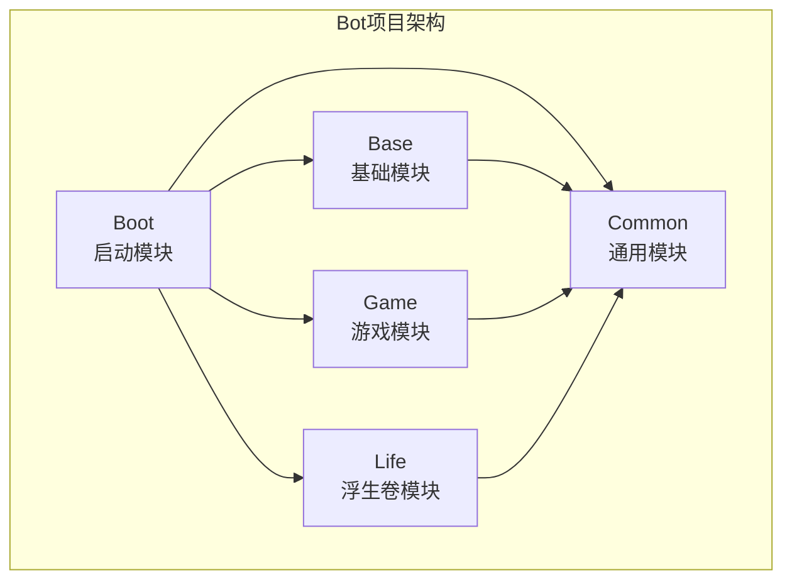
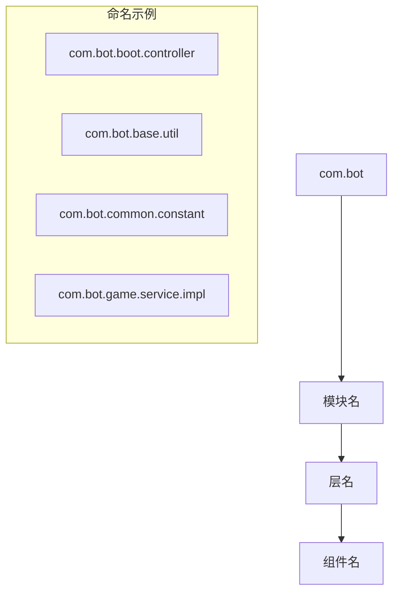
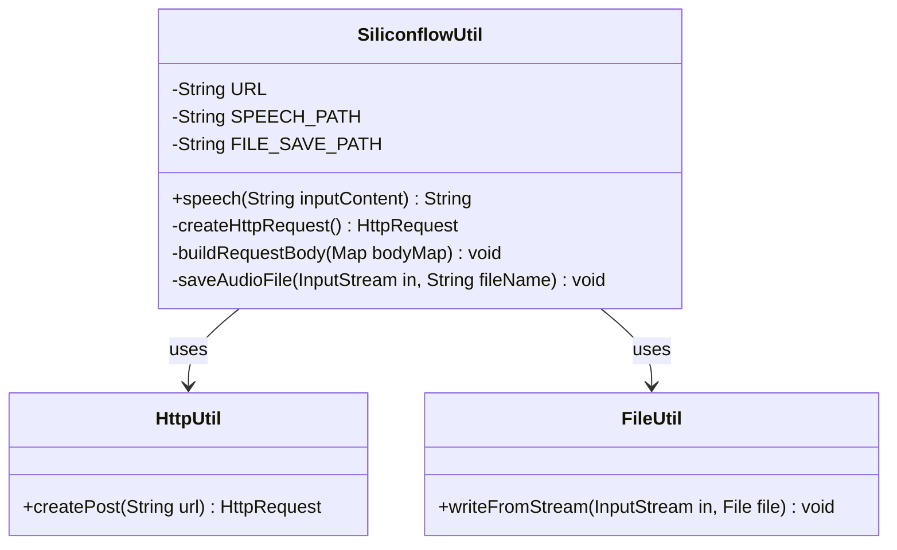
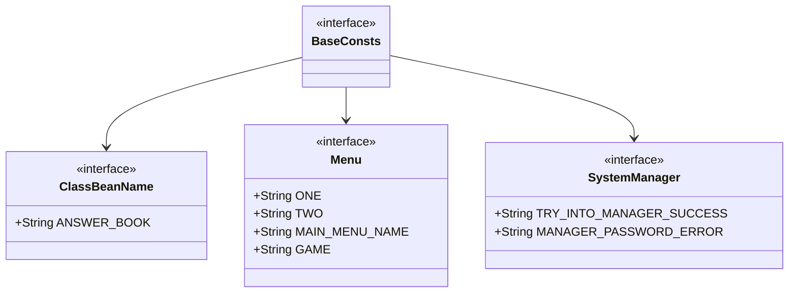
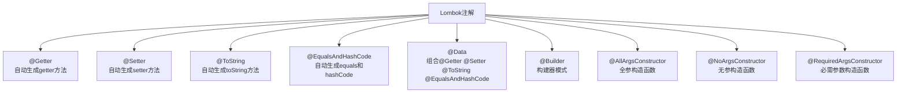
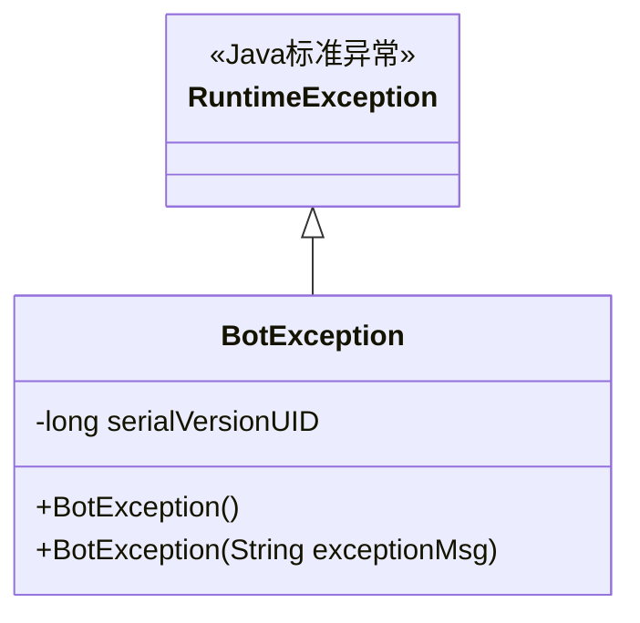
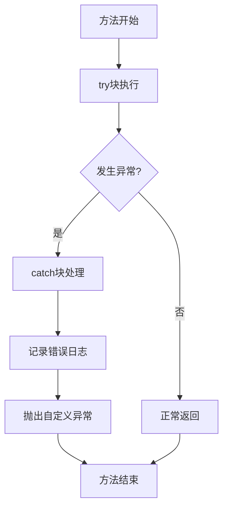
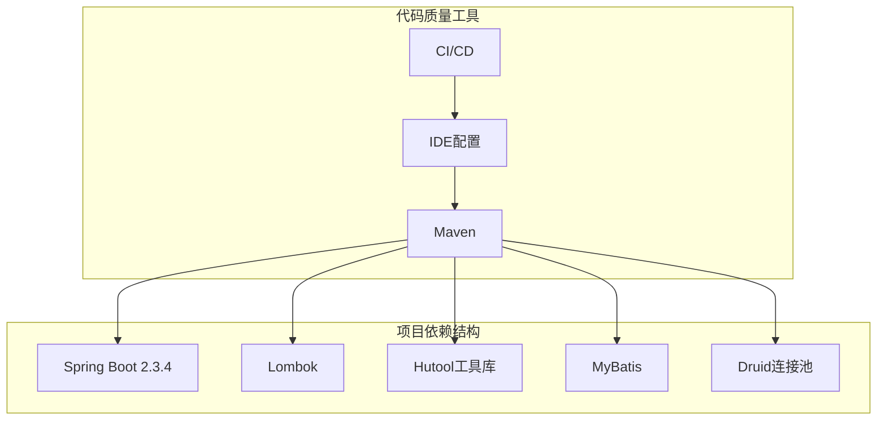

# 编码规范

<cite>
**本文档中引用的文件**
- [SiliconflowUtil.java](file://Base/src/main/java/com/bot/base/util/SiliconflowUtil.java)
- [BaseConsts.java](file://Common/src/main/java/com/bot/common/constant/BaseConsts.java)
- [LifeHandlerImpl.java](file://Life/src/main/java/com/bot/life/service/impl/LifeHandlerImpl.java)
- [BotApplication.java](file://Boot/src/main/java/com/bot/boot/BotApplication.java)
- [ENRespType.java](file://Common/src/main/java/com/bot/common/enums/ENRespType.java)
- [HttpSenderUtil.java](file://Common/src/main/java/com/bot/common/util/HttpSenderUtil.java)
- [TextUtil.java](file://Common/src/main/java/com/bot/common/util/TextUtil.java)
- [BotException.java](file://Common/src/main/java/com/bot/common/exception/BotException.java)
- [AttributeBaseInfo.java](file://Base/src/main/java/com/bot/base/dto/jx/attribute/AttributeBaseInfo.java)
- [JXAttributeInitUtil.java](file://Base/src/main/java/com/bot/base/util/JXAttributeInitUtil.java)
- [GlobalExceptionHandler.java](file://Boot/src/main/java/com/bot/boot/aspect/GlobalExceptionHandler.java)
- [logback-spring.xml](file://Boot/src/main/resources/logback-spring.xml)
- [generatorConfig.xml](file://Boot/src/main/resources/generatorConfig.xml)
- [pom.xml](file://pom.xml)
</cite>

## 目录
1. [概述](#概述)
2. [项目架构与模块划分](#项目架构与模块划分)
3. [包命名规范](#包命名规范)
4. [工具类设计模式](#工具类设计模式)
5. [常量定义规范](#常量定义规范)
6. [Lombok注解使用规范](#lombok注解使用规范)
7. [日志记录规范](#日志记录规范)
8. [异常处理策略](#异常处理策略)
9. [字符串拼接最佳实践](#字符串拼接最佳实践)
10. [代码格式化模板](#代码格式化模板)
11. [典型反模式案例](#典型反模式案例)
12. [总结](#总结)

## 概述

本文档基于Bot项目的实际代码实践，制定了一套统一的编码规范，涵盖Java开发的各个方面。该规范旨在提高代码质量、增强代码可维护性，并确保团队协作的一致性。

## 项目架构与模块划分

Bot项目采用多模块架构，基于Life_Module_Summary.md中的模块划分原则：



**图表来源**
- [BotApplication.java](file://Boot/src/main/java/com/bot/boot/BotApplication.java#L12-L12)
- [pom.xml](file://pom.xml#L6-L11)

### 模块职责边界

| 模块 | 职责范围 | 主要组件 |
|------|----------|----------|
| Boot | 应用启动、配置管理 | Spring Boot启动类、全局异常处理器 |
| Base | 基础工具、通用服务 | 工具类、DTO模型、基础服务接口 |
| Common | 通用常量、枚举、工具 | 常量定义、枚举类型、通用工具类 |
| Game | 游戏逻辑 | 游戏服务、DAO层、业务逻辑 |
| Life | 浮生卷游戏 | 游戏核心逻辑、角色管理 |

**章节来源**
- [BotApplication.java](file://Boot/src/main/java/com/bot/boot/BotApplication.java#L12-L12)
- [pom.xml](file://pom.xml#L6-L11)

## 包命名规范

### 命名层次结构

项目采用分层包命名结构，遵循以下规范：



### 包命名规则

| 层级 | 命名规范 | 示例 |
|------|----------|------|
| 根包 | `com.bot` | 项目根包 |
| 模块 | 全小写，简短 | `boot`, `base`, `common` |
| 层 | 全小写，描述性 | `controller`, `service`, `dao` |
| 组件 | 驼峰命名 | `util`, `constant`, `impl` |

### 模块内包组织

每个模块内部按功能进一步细分：

- **controller**: 控制器层
- **service**: 服务层
- **dao**: 数据访问层  
- **dto**: 数据传输对象
- **enums**: 枚举类型
- **util**: 工具类
- **config**: 配置类
- **exception**: 异常处理

**章节来源**
- [BotApplication.java](file://Boot/src/main/java/com/bot/boot/BotApplication.java#L12-L12)
- [BaseConsts.java](file://Common/src/main/java/com/bot/common/constant/BaseConsts.java#L1-L1)

## 工具类设计模式

### SiliconflowUtil示例分析

以SiliconflowUtil.java为典型工具类设计参考：



**图表来源**
- [SiliconflowUtil.java](file://Base/src/main/java/com/bot/base/util/SiliconflowUtil.java#L16-L81)

### 工具类设计原则

#### 1. 静态方法优先
- 所有工具方法均为静态方法
- 避免实例化工具类
- 提供完整功能封装

#### 2. 常量集中管理
- 私有常量定义在类级别
- 使用全大写字母命名
- 提供清晰的注释说明

#### 3. 方法签名设计
- 参数类型明确
- 返回值类型一致
- 异常情况有明确处理

#### 4. 注释标准
- 方法级别Javadoc注释
- 参数说明清晰
- 返回值说明完整
- 异常情况说明

**章节来源**
- [SiliconflowUtil.java](file://Base/src/main/java/com/bot/base/util/SiliconflowUtil.java#L24-L28)

## 常量定义规范

### BaseConsts设计模式

BaseConsts.java展示了常量定义的最佳实践：



**图表来源**
- [BaseConsts.java](file://Common/src/main/java/com/bot/common/constant/BaseConsts.java#L12-L287)

### 常量组织结构

#### 1. 接口嵌套结构
- 外层接口作为常量容器
- 内层接口按功能分类
- 避免命名冲突

#### 2. 命名规范
- 全大写字母
- 单词间下划线分隔
- 语义清晰

#### 3. 类型定义
- 字符串常量使用`String`
- 数值常量使用对应类型
- 枚举常量使用枚举类型

#### 4. 初始化方式
- 简单常量直接赋值
- 复杂字符串使用`StrUtil.CRLF`
- 静态初始化块处理复杂逻辑

**章节来源**
- [BaseConsts.java](file://Common/src/main/java/com/bot/common/constant/BaseConsts.java#L18-L287)

## Lombok注解使用规范

### 注解使用场景

项目中广泛使用Lombok简化代码：



### 使用规范

#### 1. 实体类注解组合
```java
// DTO类示例
@Getter
@Setter
public class AttributeBaseInfo {
    private String zoneName;
    private String serverName;
    private String roleName;
    // ... 其他字段
}
```

#### 2. 枚举类注解
```java
// 枚举类示例
@Getter
@AllArgsConstructor
public enum ENRespType {
    TEXT("0", "文本"),
    IMG("1", "图片"),
    VIDEO("2", "视频");
    // ... 字段定义
}
```

#### 3. 日志类注解
```java
// 工具类示例
@Slf4j
public class HttpSenderUtil {
    // ... 方法实现
}
```

#### 4. 注解使用原则
- 实体类使用@Data或组合注解
- 枚举类使用@AllArgsConstructor
- 工具类使用@Slf4j
- 避免过度使用注解

**章节来源**
- [AttributeBaseInfo.java](file://Base/src/main/java/com/bot/base/dto/jx/attribute/AttributeBaseInfo.java#L8-L10)
- [ENRespType.java](file://Common/src/main/java/com/bot/common/enums/ENRespType.java#L6-L8)
- [HttpSenderUtil.java](file://Common/src/main/java/com/bot/common/util/HttpSenderUtil.java#L44-L44)

## 日志记录规范

### Logback配置分析

项目使用Logback作为日志框架，配置文件展示了最佳实践：

```mermaid
graph LR
subgraph "日志配置结构"
Console[ConsoleAppender<br/>控制台输出]
RollingFile[RollingFileAppender<br/>滚动文件]
Async[AsyncAppender<br/>异步输出]
end
subgraph "配置特性"
Pattern[格式化模式<br/>%d{HH:mm:ss.SSS} [%thread] %-5level %logger-%line -- %msg --%n]
Level[级别控制<br/>TRACE级别]
Size[文件大小限制<br/>100MB]
History[历史保留<br/>30天]
end
```

**图表来源**
- [logback-spring.xml](file://Boot/src/main/resources/logback-spring.xml#L35-L35)

### 日志使用规范

#### 1. 日志级别使用
- **ERROR**: 业务异常、系统错误
- **WARN**: 警告信息、潜在问题
- **INFO**: 重要业务流程
- **DEBUG**: 详细调试信息
- **TRACE**: 最详细的跟踪信息

#### 2. 日志格式规范
```
%d{HH:mm:ss.SSS} [%thread] %-5level %logger-%line -- %msg --%n
```

#### 3. 日志记录最佳实践
- 记录异常堆栈信息
- 包含上下文信息
- 避免敏感信息泄露
- 使用参数化日志

#### 4. 日志配置管理
- 支持多环境配置
- 动态调整日志级别
- 异步日志输出
- 文件滚动策略

**章节来源**
- [logback-spring.xml](file://Boot/src/main/resources/logback-spring.xml#L35-L35)
- [HttpSenderUtil.java](file://Common/src/main/java/com/bot/common/util/HttpSenderUtil.java#L44-L44)

## 异常处理策略

### BotException设计

项目定义了统一的异常基类：



**图表来源**
- [BotException.java](file://Common/src/main/java/com/bot/common/exception/BotException.java#L7-L19)

### 异常处理最佳实践

#### 1. 异常分类策略
- **运行时异常**: 业务逻辑异常
- **受检异常**: IO、网络等外部异常
- **全局异常**: 统一处理机制

#### 2. 异常处理流程


#### 3. 异常处理规范
- 使用自定义异常继承RuntimeException
- 提供有意义的异常消息
- 记录完整的异常堆栈
- 避免空catch块

#### 4. 全局异常处理
项目实现了全局异常处理器：
- 统一异常返回格式
- 错误信息标准化
- 异常分类处理

**章节来源**
- [BotException.java](file://Common/src/main/java/com/bot/common/exception/BotException.java#L7-L19)
- [GlobalExceptionHandler.java](file://Boot/src/main/java/com/bot/boot/aspect/GlobalExceptionHandler.java#L16-L25)

## 字符串拼接最佳实践

### 模板字符串使用

项目中字符串拼接遵循以下规范：

#### 1. 模板字符串
```java
// 推荐：使用模板字符串
String content = String.format("『%s』\n\n欢迎『%s』踏上修仙之路！", 
                              nickname, attributeStr);
```

#### 2. StringBuilder优化
```java
// 复杂字符串拼接使用StringBuilder
StringBuilder content = new StringBuilder();
content.append("『角色创建』\n\n");
content.append("请输入角色信息，格式：昵称-派系\n");
// ... 更多拼接操作
```

#### 3. 字符串工具类
```java
// 使用StringUtils进行字符串操作
if (StrUtil.isNotBlank(input)) {
    // 处理非空字符串
}
```

#### 4. 国际化支持
```java
// 使用资源文件管理文本
String message = messageSource.getMessage("error.login.failed", 
                                        null, locale);
```

### 字符串处理规范

| 场景 | 推荐方式 | 示例 |
|------|----------|------|
| 格式化输出 | String.format | `String.format("用户：%s", username)` |
| 复杂拼接 | StringBuilder | `new StringBuilder().append(...)` |
| 条件拼接 | StringUtils | `StrUtil.isNotBlank(value)` |
| 国际化 | MessageSource | `messageSource.getMessage()` |

**章节来源**
- [LifeHandlerImpl.java](file://Life/src/main/java/com/bot/life/service/impl/LifeHandlerImpl.java#L368-L369)
- [LifeHandlerImpl.java](file://Life/src/main/java/com/bot/life/service/impl/LifeHandlerImpl.java#L407-L432)

## 代码格式化模板

### Maven配置集成

项目使用Maven管理依赖，集成了代码格式化配置：



**图表来源**
- [pom.xml](file://pom.xml#L14-L14)

### IntelliJ IDEA配置建议

#### 1. 代码样式设置
- **Tab大小**: 4个空格
- **行宽**: 120字符
- **换行符**: Unix(LF)
- **文件编码**: UTF-8

#### 2. 自动导入配置
- 移除未使用导入
- 静态导入排序
- 导入包分组

#### 3. Lombok支持
- 启用注解处理器
- 配置IDEA Lombok插件
- 同步注解处理器设置

#### 4. 代码检查规则
- 使用Maven Surefire进行单元测试
- 集成SonarQube代码质量检查
- 配置Checkstyle规则

**章节来源**
- [pom.xml](file://pom.xml#L25-L35)

## 典型反模式案例

### 1. 异常处理不当

#### 反模式：空catch块
```java
// 反模式
try {
    // 可能抛出异常的代码
} catch (Exception e) {
    // 空catch块，忽略异常
}
```

#### 改进方案
```java
// 改进：记录日志并重新抛出
try {
    // 可能抛出异常的代码
} catch (Exception e) {
    log.error("操作失败：{}", e.getMessage(), e);
    throw new BotException("操作失败");
}
```

### 2. 字符串拼接性能问题

#### 反模式：多次+操作
```java
// 反模式
String result = "";
result += part1;
result += part2;
result += part3;
```

#### 改进方案
```java
// 改进：使用StringBuilder
StringBuilder sb = new StringBuilder();
sb.append(part1).append(part2).append(part3);
String result = sb.toString();
```

### 3. 常量定义混乱

#### 反模式：分散的常量定义
```java
// 反模式
public static final String API_URL = "https://api.example.com";
public static final String API_KEY = "abc123";
public static final String CACHE_KEY_PREFIX = "cache:";
```

#### 改进方案
```java
// 改进：按功能分类组织
public interface ApiConstants {
    String API_URL = "https://api.example.com";
    String API_KEY = "abc123";
}

public interface CacheConstants {
    String KEY_PREFIX = "cache:";
}
```

### 4. 日志记录不规范

#### 反模式：缺少上下文信息
```java
// 反模式
log.error("操作失败");
```

#### 改进方案
```java
// 改进：包含上下文和异常信息
log.error("用户[{}]操作失败：{}", userId, operation, e);
```

### 5. 工具类设计缺陷

#### 反模式：实例化工具类
```java
// 反模式
HttpSenderUtil util = new HttpSenderUtil();
util.postJsonData(url, data);
```

#### 改进方案
```java
// 改进：使用静态方法
HttpSenderUtil.postJsonData(url, data);
```

## 总结

本文档总结了Bot项目中的编码规范，涵盖了从模块划分到具体代码实现的各个方面。遵循这些规范有助于：

1. **提高代码质量**: 通过统一的编码标准确保代码一致性
2. **增强可维护性**: 清晰的结构和规范化的实现便于后续维护
3. **促进团队协作**: 标准化的开发方式减少沟通成本
4. **降低技术债务**: 良好的编程实践避免未来的技术问题

### 实施建议

1. **渐进式推广**: 逐步引入新的规范，避免一次性全面改革
2. **培训与指导**: 为开发团队提供规范培训和技术指导
3. **代码审查**: 建立代码审查机制确保规范执行
4. **工具支持**: 使用IDE配置和自动化工具辅助规范执行

通过持续的实践和完善，这些编码规范将帮助团队构建更加健壮、可维护的软件系统。