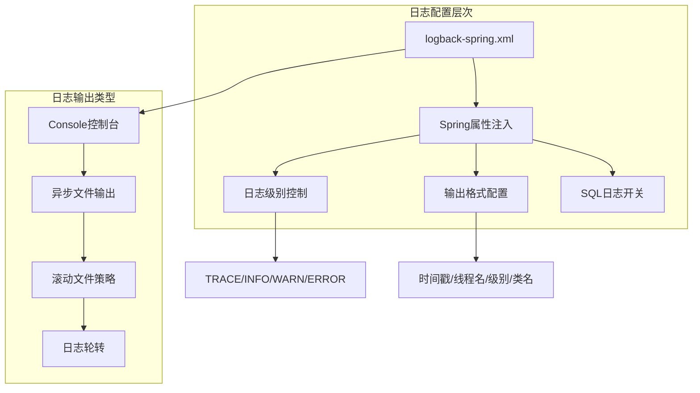
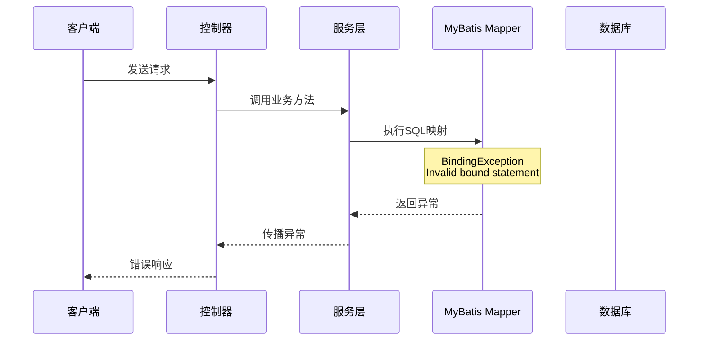
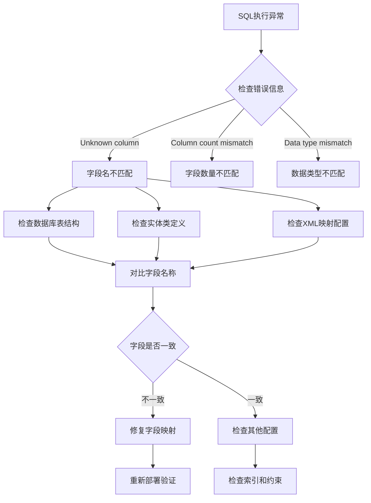
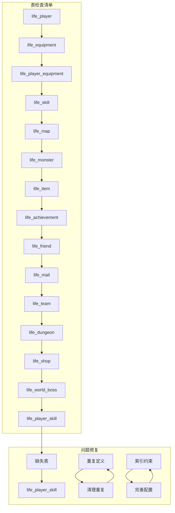
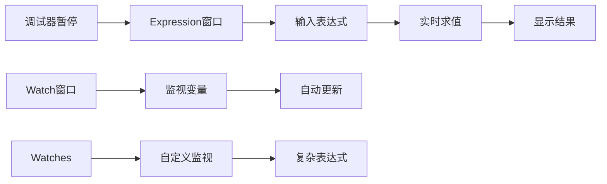
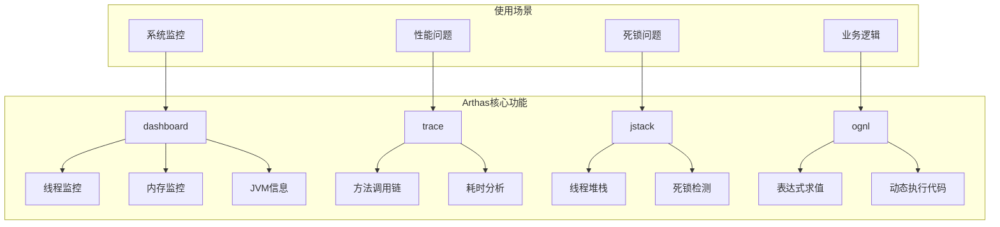
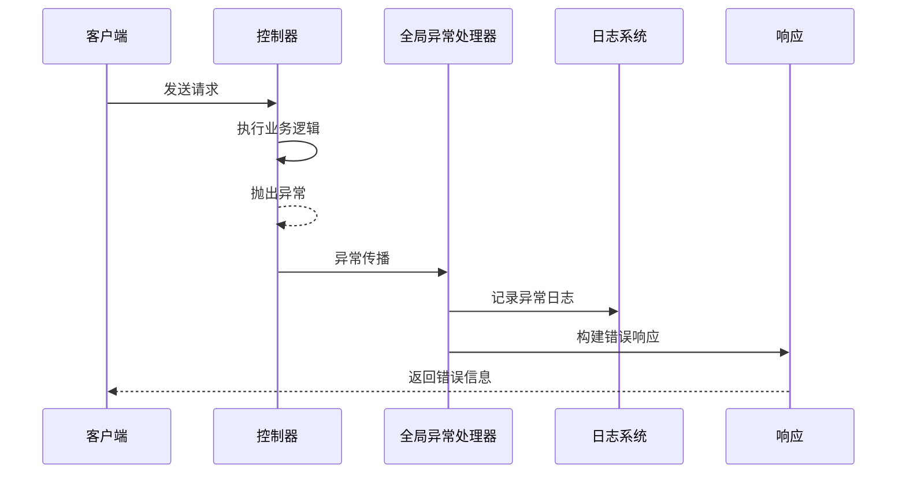
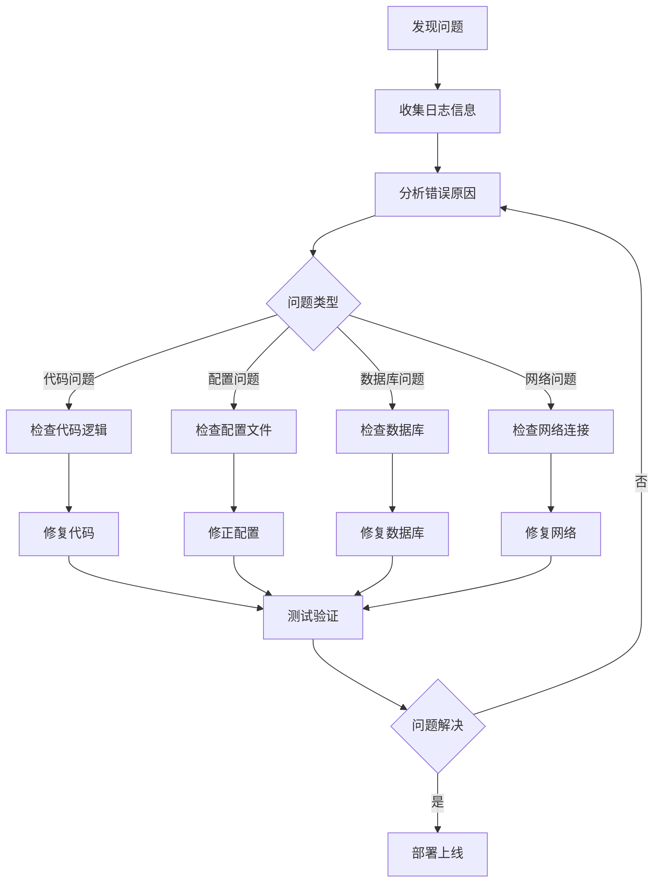

# 调试技巧指南

<cite>
**本文档引用的文件**
- [logback-spring.xml](file://Boot/src/main/resources/logback-spring.xml)
- [application.properties](file://Boot/src/main/resources/application.properties)
- [application-dev.properties](file://Boot/src/main/resources/application-dev.properties)
- [application-prod.properties](file://Boot/src/main/resources/application-prod.properties)
- [GlobalExceptionHandler.java](file://Boot/src/main/java/com/bot/boot/aspect/GlobalExceptionHandler.java)
- [Life_Spring_Integration_Fix.md](file://Life_Spring_Integration_Fix.md)
- [Life_MyBatis_Configuration_Fix.md](file://Life_MyBatis_Configuration_Fix.md)
- [Life_Database_Field_Fix.md](file://Life_Database_Field_Fix.md)
- [Life_Database_Tables_Check.md](file://Life_Database_Tables_Check.md)
- [Life_Database_Init.sql](file://Life_Database_Init.sql)
</cite>

## 目录
1. [概述](#概述)
2. [日志系统配置与调试](#日志系统配置与调试)
3. [Spring Bean注入问题排查](#spring-bean注入问题排查)
4. [MyBatis映射错误诊断](#mybatis映射错误诊断)
5. [数据库字段不匹配问题](#数据库字段不匹配问题)
6. [表结构异常排查](#表结构异常排查)
7. [IDE调试器高级功能](#ide调试器高级功能)
8. [生产环境诊断工具](#生产环境诊断工具)
9. [异常处理与监控](#异常处理与监控)
10. [最佳实践建议](#最佳实践建议)

## 概述

本指南基于Bot项目的实际调试经验，提供了全面的调试技巧和问题排查方法。通过分析项目中的真实问题案例，帮助开发者快速定位和解决常见的技术难题。

## 日志系统配置与调试

### Logback配置详解

Bot项目采用Logback作为日志框架，通过`logback-spring.xml`进行详细配置。



**图表来源**
- [logback-spring.xml](file://Boot/src/main/resources/logback-spring.xml#L1-L59)

### 日志级别设置

| 级别 | 用途 | 配置示例 |
|------|------|----------|
| TRACE | 详细跟踪信息 | 用于开发阶段的详细调用链追踪 |
| DEBUG | 调试信息 | SQL语句、方法参数等 |
| INFO | 一般信息 | 系统启动、关键业务流程 |
| WARN | 警告信息 | 性能问题、配置警告 |
| ERROR | 错误信息 | 异常堆栈、系统错误 |

### 输出格式配置

标准输出格式：
```
%d{HH:mm:ss.SSS} [%thread] %-5level %logger-%line -- %msg --%n
```

- `%d{HH:mm:ss.SSS}`: 时间戳格式
- `[%thread]`: 线程名称
- `%-5level`: 日志级别（右对齐，宽度5字符）
- `%logger-%line`: 类名和行号
- `%msg`: 日志消息
- `--%n`: 换行符

### SQL日志配置

通过`logback.sql-level`属性控制SQL语句的日志输出：

```properties
# 开发环境启用SQL调试
logback.sql-level=DEBUG

# 生产环境关闭SQL日志
logback.sql-level=OFF
```

**章节来源**
- [logback-spring.xml](file://Boot/src/main/resources/logback-spring.xml#L1-L59)
- [application.properties](file://Boot/src/main/resources/application.properties#L12-L16)

## Spring Bean注入问题排查

### 常见注入失败场景

基于`Life_Spring_Integration_Fix.md`中的问题案例，主要问题集中在包扫描配置不完整。

```mermaid
flowchart TD
A[Bean注入失败] --> B{检查包扫描配置}
B --> |缺少包| C[添加scanBasePackages]
B --> |配置正确| D{检查@Component注解}
D --> |缺少注解| E[添加@Service/@Component]
D --> |注解正确| F{检查依赖关系}
F --> |循环依赖| G[重构依赖关系]
F --> |正常依赖| H[检查Bean作用域]
C --> I[重新启动应用]
E --> I
G --> I
H --> I
I --> J[验证注入是否成功]
```

**图表来源**
- [Life_Spring_Integration_Fix.md](file://Life_Spring_Integration_Fix.md#L1-L116)

### 修复前后的对比

**修复前配置：**
```java
@SpringBootApplication(scanBasePackages = {"com.bot.boot","com.bot.base","com.bot.game", "com.bot.common.loader"})
@MapperScan("com.bot.game.dao.mapper")
```

**修复后配置：**
```java
@SpringBootApplication(scanBasePackages = {"com.bot.boot","com.bot.base","com.bot.game","com.bot.life", "com.bot.common.loader"})
@MapperScan({"com.bot.game.dao.mapper", "com.bot.life.dao.mapper"})
```

### 排查步骤

1. **检查包扫描路径**
   - 确认目标包是否在`scanBasePackages`中
   - 检查包路径拼写是否正确

2. **验证注解声明**
   - 确保类上有`@Service`、`@Component`或`@Repository`注解
   - 检查注解导入的包是否正确

3. **检查依赖注入**
   ```java
   @Autowired
   private LifeHandler lifeHandler;
   ```

4. **验证Spring容器状态**
   ```java
   @Autowired
   private ApplicationContext applicationContext;
   
   // 检查Bean是否存在
   boolean exists = applicationContext.containsBean("lifeHandler");
   ```

**章节来源**
- [Life_Spring_Integration_Fix.md](file://Life_Spring_Integration_Fix.md#L1-L116)

## MyBatis映射错误诊断

### 常见映射错误类型

基于`Life_MyBatis_Configuration_Fix.md`中的问题案例，主要涉及Mapper扫描和XML文件加载问题。



**图表来源**
- [Life_MyBatis_Configuration_Fix.md](file://Life_MyBatis_Configuration_Fix.md#L1-L120)

### 配置修复方案

**修复前配置：**
```properties
mybatis.type-aliases-package=com.bot.game.mapper
mybatis.mapper-locations=classpath:mapper/*.xml
```

**修复后配置：**
```properties
mybatis.type-aliases-package=com.bot.game.mapper,com.bot.life.mapper
mybatis.mapper-locations=classpath:mapper/*.xml,classpath*:mapper/*.xml
```

### Mapper扫描机制

| 扫描方式 | 作用范围 | 使用场景 |
|----------|----------|----------|
| `classpath:` | 当前模块classpath根路径 | 单模块项目 |
| `classpath*:` | 所有jar包中的classpath路径 | 多模块项目 |

### 诊断命令

1. **检查Mapper加载情况**
   ```sql
   -- 在数据库中查询Mapper是否正确加载
   SELECT * FROM information_schema.tables 
   WHERE table_name LIKE '%mapper%' OR table_name LIKE '%xml';
   ```

2. **验证SQL映射**
   ```java
   // 在代码中验证Mapper方法是否存在
   @Autowired
   private LifeGameStatusMapper lifeGameStatusMapper;
   
   // 测试方法调用
   lifeGameStatusMapper.selectByUserId(userId);
   ```

**章节来源**
- [Life_MyBatis_Configuration_Fix.md](file://Life_MyBatis_Configuration_Fix.md#L1-L120)

## 数据库字段不匹配问题

### 问题诊断流程

基于`Life_Database_Field_Fix.md`中的案例，数据库字段不匹配是常见的开发问题。



**图表来源**
- [Life_Database_Field_Fix.md](file://Life_Database_Field_Fix.md#L1-L143)

### 字段映射验证

**数据库表结构检查：**
```sql
DESCRIBE life_skill;
```

**实体类字段对比：**
```java
// LifeSkill.java
@Data
public class LifeSkill {
    private Long id;
    private String name;
    private Integer type; // 对应数据库 type 字段
    private Integer attribute;
    private Integer power; // 对应数据库 power 字段
    private Integer cooldown; // 对应数据库 cooldown 字段
    private Integer requiredLevel; // 对应数据库 required_level 字段
    private Integer requiredCultivation; // 对应数据库 required_cultivation 字段
    private Integer maxLevel; // 对应数据库 max_level 字段
    private String description;
}
```

**XML映射验证：**
```xml
<resultMap id="BaseResultMap" type="com.bot.life.dao.entity.LifeSkill">
    <id column="id" jdbcType="BIGINT" property="id" />
    <result column="name" jdbcType="VARCHAR" property="name" />
    <result column="type" jdbcType="INTEGER" property="type" /> <!-- 匹配 -->
    <result column="attribute" jdbcType="INTEGER" property="attribute" />
    <result column="power" jdbcType="INTEGER" property="power" /> <!-- 匹配 -->
    <result column="cooldown" jdbcType="INTEGER" property="cooldown" /> <!-- 匹配 -->
    <result column="required_level" jdbcType="INTEGER" property="requiredLevel" /> <!-- 匹配 -->
    <result column="required_cultivation" jdbcType="INTEGER" property="requiredCultivation" /> <!-- 匹配 -->
    <result column="max_level" jdbcType="INTEGER" property="maxLevel" /> <!-- 匹配 -->
    <result column="description" jdbcType="LONGVARCHAR" property="description" />
</resultMap>
```

### 预防措施

1. **命名规范**
   - 数据库字段：下划线命名（`required_level`）
   - Java属性：驼峰命名（`requiredLevel`）

2. **开发流程**
   - 先定义实体类，确定业务字段
   - 根据实体类设计数据库表结构
   - 编写XML映射，确保字段映射正确
   - 测试验证，执行查询确保无错误

**章节来源**
- [Life_Database_Field_Fix.md](file://Life_Database_Field_Fix.md#L1-L143)

## 表结构异常排查

### 表完整性检查

基于`Life_Database_Tables_Check.md`中的案例，表结构完整性是系统稳定运行的基础。



**图表来源**
- [Life_Database_Tables_Check.md](file://Life_Database_Tables_Check.md#L1-L147)

### 核心表分类

| 分类 | 表名 | 功能描述 |
|------|------|----------|
| 玩家相关 | life_player | 玩家基本信息 |
| 玩家相关 | life_player_equipment | 玩家装备持有 |
| 玩家相关 | life_player_item | 玩家物品持有 |
| 玩家相关 | life_player_skill | 玩家技能掌握 |
| 游戏内容 | life_equipment | 装备基础信息 |
| 游戏内容 | life_skill | 技能基础信息 |
| 游戏内容 | life_map | 地图信息 |
| 游戏内容 | life_monster | 怪物信息 |
| 社交系统 | life_friend | 好友关系 |
| 社交系统 | life_mail | 邮件系统 |
| 社交系统 | life_team | 组队系统 |
| 活动挑战 | life_world_boss | 世界BOSS |
| 活动挑战 | life_dungeon | 副本系统 |

### 验证方法

1. **实体类检查**
   ```bash
   find Life/src/main/java -name "Life*.java" -path "*/entity/*"
   ```

2. **Mapper接口检查**
   ```bash
   find Life/src/main/java -name "Life*Mapper.java"
   ```

3. **XML映射检查**
   ```bash
   find Life/src/main/resources -name "Life*Mapper.xml"
   ```

4. **数据库表验证**
   ```sql
   -- 检查所有life_开头的表
   SHOW TABLES LIKE 'life_%';
   
   -- 验证表数量
   SELECT COUNT(*) FROM information_schema.tables 
   WHERE table_schema = 'bot' AND table_name LIKE 'life_%';
   ```

**章节来源**
- [Life_Database_Tables_Check.md](file://Life_Database_Tables_Check.md#L1-L147)

## IDE调试器高级功能

### 条件断点设置

1. **基本断点**
   - 在代码行号处点击设置断点
   - 点击后出现红色圆点

2. **条件断点**
   - 右键断点 -> "Breakpoint Properties"
   - 设置条件表达式
   - 示例：`userId == 12345`

3. **异常断点**
   - Run -> View Breakpoints
   - 添加Java Exception Breakpoint
   - 可选择特定异常类型

### 表达式求值



### 调试技巧

1. **局部变量监视**
   - 在Variables窗口查看当前作用域变量
   - 右键变量 -> "Evaluate Expression"

2. **调用栈分析**
   - 查看方法调用链
   - 快速定位问题源头

3. **多线程调试**
   - Threads窗口查看所有线程
   - 切换线程上下文

## 生产环境诊断工具

### Arthas在线诊断

Arthas是阿里巴巴开源的Java诊断工具，适用于生产环境问题排查。



### 常用诊断命令

1. **系统概览**
   ```bash
   # 查看系统整体状况
   dashboard
   
   # 查看线程状态
   thread
   
   # 查看JVM内存使用
   memory
   ```

2. **方法追踪**
   ```bash
   # 追踪方法调用链
   trace com.bot.service.UserService getUserById
   
   # 分析方法耗时
   profile com.bot.service.UserService.getUserById
   ```

3. **实时监控**
   ```bash
   # 监控方法调用
   watch com.bot.service.UserService getUserById '{params,return}'
   
   # 监控异常
   watch com.bot.service.UserService getUserById '{throwable}' -e
   ```

### 其他诊断工具

1. **JProfiler**
   - 可视化性能分析
   - 内存泄漏检测
   - CPU使用分析

2. **VisualVM**
   - JVM监控
   - 内存分析
   - 线程分析

3. **MAT (Memory Analyzer Tool)**
   - 堆转储分析
   - 内存泄漏检测

## 异常处理与监控

### 全局异常处理

Bot项目实现了全局异常处理器，统一处理系统异常。



**图表来源**
- [GlobalExceptionHandler.java](file://Boot/src/main/java/com/bot/boot/aspect/GlobalExceptionHandler.java#L1-L27)

### 异常处理最佳实践

1. **自定义异常类**
   ```java
   public class BotException extends RuntimeException {
       public BotException(String message) {
           super(message);
       }
   }
   ```

2. **异常捕获策略**
   ```java
   try {
       // 业务逻辑
   } catch (SpecificException e) {
       log.error("业务异常: {}", e.getMessage(), e);
       throw new BotException("业务处理失败");
   } catch (Exception e) {
       log.error("系统异常: {}", e.getMessage(), e);
       throw new BotException("系统异常，请稍后重试");
   }
   ```

3. **异常日志记录**
   - 记录异常堆栈
   - 包含上下文信息
   - 设置合适的日志级别

**章节来源**
- [GlobalExceptionHandler.java](file://Boot/src/main/java/com/bot/boot/aspect/GlobalExceptionHandler.java#L1-L27)

## 最佳实践建议

### 开发阶段调试

1. **日志配置**
   - 开发环境开启DEBUG级别
   - 启用SQL语句日志
   - 设置详细的输出格式

2. **单元测试**
   - 编写充分的单元测试
   - 使用Mock对象隔离依赖
   - 覆盖边界条件

3. **集成测试**
   - 模拟生产环境配置
   - 测试数据库连接
   - 验证API接口

### 测试阶段调试

1. **性能测试**
   - 使用JMeter进行压力测试
   - 监控系统资源使用
   - 分析瓶颈点

2. **并发测试**
   - 模拟多用户并发
   - 检查线程安全
   - 验证锁机制

3. **稳定性测试**
   - 长时间运行测试
   - 内存泄漏检测
   - 资源回收验证

### 生产环境监控

1. **系统监控**
   - CPU、内存使用率
   - 磁盘空间监控
   - 网络连接状态

2. **应用监控**
   - 响应时间监控
   - 错误率统计
   - 并发用户数

3. **数据库监控**
   - 查询性能监控
   - 连接池状态
   - 索引使用情况

### 问题排查流程



### 总结

通过本指南提供的调试技巧和方法，开发者可以：
- 快速定位和解决Spring Bean注入失败问题
- 有效诊断MyBatis映射错误
- 及时发现和修复数据库字段不匹配问题
- 系统性地排查表结构异常
- 充分利用IDE调试器的高级功能
- 在生产环境中使用专业诊断工具

记住，良好的调试习惯和完善的监控体系是保证系统稳定运行的重要保障。