# Bot项目技术架构文档

<cite>
**本文档引用的文件**
- [pom.xml](file://pom.xml)
- [Boot/src/main/java/com/bot/boot/BotApplication.java](file://Boot/src/main/java/com/bot/boot/BotApplication.java)
- [Boot/src/main/java/com/bot/boot/controller/newInstructDistributeController.java](file://Boot/src/main/java/com/bot/boot/controller/newInstructDistributeController.java)
- [Boot/src/main/java/com/bot/boot/controller/BotDo.java](file://Boot/src/main/java/com/bot/boot/controller/BotDo.java)
- [Base/src/main/java/com/bot/base/chain/ChainCollector.java](file://Base/src/main/java/com/bot/base/chain/ChainCollector.java)
- [Base/src/main/java/com/bot/base/service/Distributor.java](file://Base/src/main/java/com/bot/base/service/Distributor.java)
- [Base/src/main/java/com/bot/base/service/Main.java](file://Base/src/main/java/com/bot/base/service/Main.java)
- [Base/src/main/java/com/bot/base/chain/menu/MainMenuPrinter.java](file://Base/src/main/java/com/bot/base/chain/menu/MainMenuPrinter.java)
- [Base/src/main/java/com/bot/base/dto/CommonResp.java](file://Base/src/main/java/com/bot/base/dto/CommonResp.java)
- [Game/src/main/java/com/bot/game/service/GameHandler.java](file://Game/src/main/java/com/bot/game/service/GameHandler.java)
- [Common/src/main/java/com/bot/common/util/SendMsgUtil.java](file://Common/src/main/java/com/bot/common/util/SendMsgUtil.java)
- [Boot/src/main/resources/application.properties](file://Boot/src/main/resources/application.properties)
- [Base/pom.xml](file://Base/pom.xml)
- [Common/pom.xml](file://Common/pom.xml)
- [Game/pom.xml](file://Game/pom.xml)
- [Life/pom.xml](file://Life/pom.xml)
</cite>

## 目录
1. [项目概述](#项目概述)
2. [整体架构设计](#整体架构设计)
3. [模块化架构分析](#模块化架构分析)
4. [核心设计模式](#核心设计模式)
5. [数据流与消息处理](#数据流与消息处理)
6. [数据库与ORM选择](#数据库与orm选择)
7. [依赖注入与组件管理](#依赖注入与组件管理)
8. [性能优化策略](#性能优化策略)
9. [架构决策分析](#架构决策分析)
10. [总结](#总结)

## 项目概述

Bot项目是一个基于Spring Boot构建的多功能QQ机器人系统，采用模块化架构设计，支持多种功能模块的独立开发和部署。项目通过MVC分层架构实现了清晰的职责分离，为不同类型的业务需求提供了灵活的扩展能力。

### 技术栈概览

- **框架**: Spring Boot 2.3.4.RELEASE
- **数据库**: MySQL + MyBatis
- **消息处理**: HTTP Webhook + WebSocket
- **缓存**: Redis（配置中）
- **日志**: Logback
- **构建工具**: Maven

## 整体架构设计

Bot项目采用了典型的分层架构模式，结合模块化设计理念，形成了清晰的层次结构：

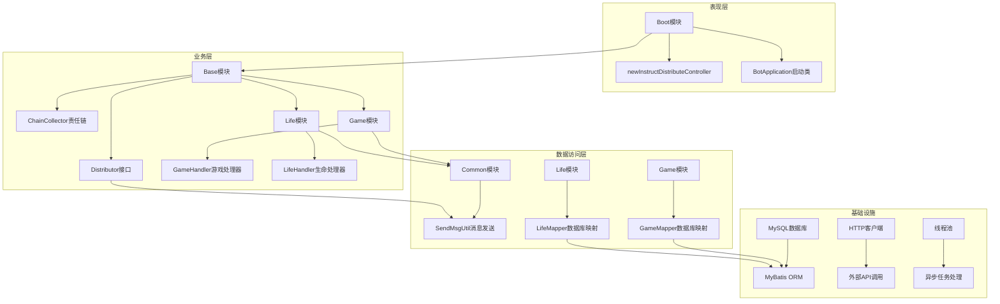

**图表来源**
- [Boot/src/main/java/com/bot/boot/BotApplication.java](file://Boot/src/main/java/com/bot/boot/BotApplication.java#L12-L14)
- [Boot/src/main/java/com/bot/boot/controller/newInstructDistributeController.java](file://Boot/src/main/java/com/bot/boot/controller/newInstructDistributeController.java#L43-L65)

**章节来源**
- [pom.xml](file://pom.xml#L6-L11)
- [Boot/src/main/java/com/bot/boot/BotApplication.java](file://Boot/src/main/java/com/bot/boot/BotApplication.java#L12-L14)

## 模块化架构分析

### Boot模块 - 应用入口层

Boot模块作为整个系统的启动入口，负责应用的初始化和配置管理：

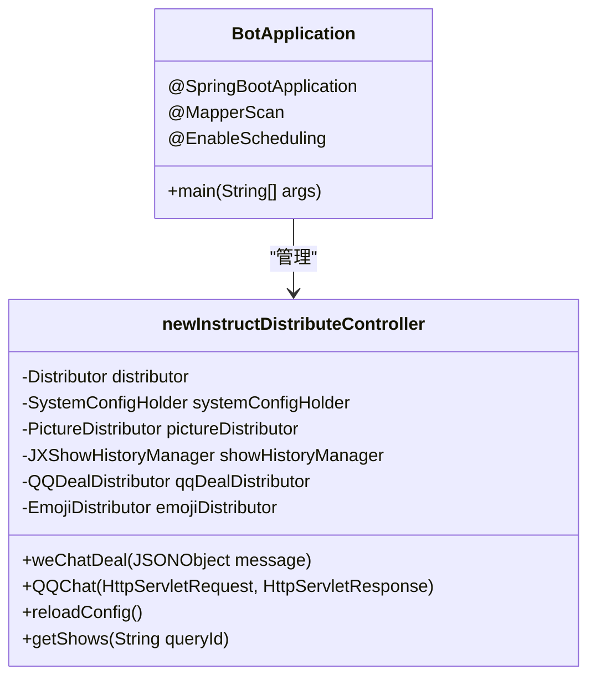

**图表来源**
- [Boot/src/main/java/com/bot/boot/BotApplication.java](file://Boot/src/main/java/com/bot/boot/BotApplication.java#L12-L21)
- [Boot/src/main/java/com/bot/boot/controller/newInstructDistributeController.java](file://Boot/src/main/java/com/bot/boot/controller/newInstructDistributeController.java#L43-L65)

Boot模块的核心职责：
- **应用启动**: 通过Spring Boot自动配置启动应用
- **数据库扫描**: 使用`@MapperScan`注解扫描数据访问层
- **定时任务**: 启用`@EnableScheduling`支持定时任务
- **消息路由**: 处理来自不同渠道的消息请求

**章节来源**
- [Boot/src/main/java/com/bot/boot/BotApplication.java](file://Boot/src/main/java/com/bot/boot/BotApplication.java#L12-L21)
- [Boot/src/main/java/com/bot/boot/controller/newInstructDistributeController.java](file://Boot/src/main/java/com/bot/boot/controller/newInstructDistributeController.java#L43-L255)

### Base模块 - 基础服务层

Base模块提供了系统的核心基础服务，包括消息分发、责任链模式实现和通用工具类：

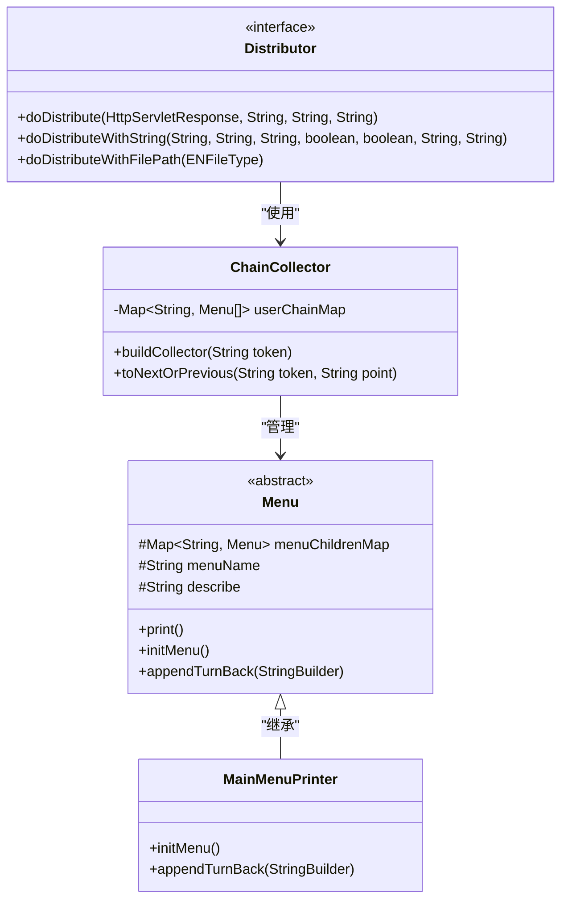

**图表来源**
- [Base/src/main/java/com/bot/base/service/Distributor.java](file://Base/src/main/java/com/bot/base/service/Distributor.java#L11-L35)
- [Base/src/main/java/com/bot/base/chain/ChainCollector.java](file://Base/src/main/java/com/bot/base/chain/ChainCollector.java#L18-L58)
- [Base/src/main/java/com/bot/base/chain/menu/MainMenuPrinter.java](file://Base/src/main/java/com/bot/base/chain/menu/MainMenuPrinter.java#L11-L38)

Base模块的设计特点：
- **接口抽象**: 通过Distributor接口实现消息分发的统一抽象
- **责任链模式**: ChainCollector实现动态菜单导航
- **模板方法**: Menu基类提供菜单结构的标准模板
- **扩展性**: 支持新功能模块的无缝集成

**章节来源**
- [Base/src/main/java/com/bot/base/service/Distributor.java](file://Base/src/main/java/com/bot/base/service/Distributor.java#L11-L35)
- [Base/src/main/java/com/bot/base/chain/ChainCollector.java](file://Base/src/main/java/com/bot/base/chain/ChainCollector.java#L18-L58)
- [Base/src/main/java/com/bot/base/chain/menu/MainMenuPrinter.java](file://Base/src/main/java/com/bot/base/chain/menu/MainMenuPrinter.java#L11-L38)

### Common模块 - 通用工具层

Common模块包含了系统运行所需的通用工具类和配置：

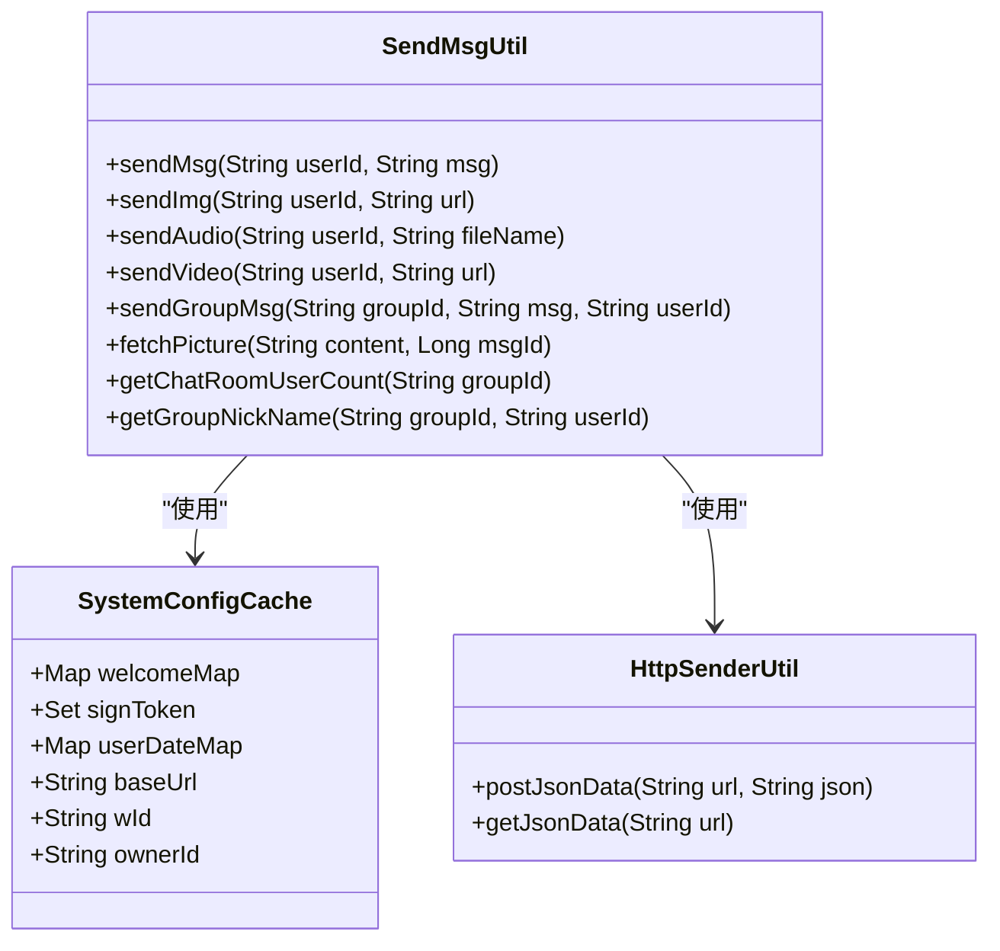

**图表来源**
- [Common/src/main/java/com/bot/common/util/SendMsgUtil.java](file://Common/src/main/java/com/bot/common/util/SendMsgUtil.java#L27-L274)

Common模块的核心功能：
- **消息发送**: 统一的消息发送接口，支持多种消息类型
- **配置管理**: 系统配置的集中管理和缓存
- **HTTP通信**: 封装的HTTP客户端工具
- **工具类**: 字符串处理、日期处理等通用工具

**章节来源**
- [Common/src/main/java/com/bot/common/util/SendMsgUtil.java](file://Common/src/main/java/com/bot/common/util/SendMsgUtil.java#L27-L274)

### Game模块 - 游戏系统层

Game模块实现了游戏相关的业务逻辑，包括角色管理、战斗系统等：

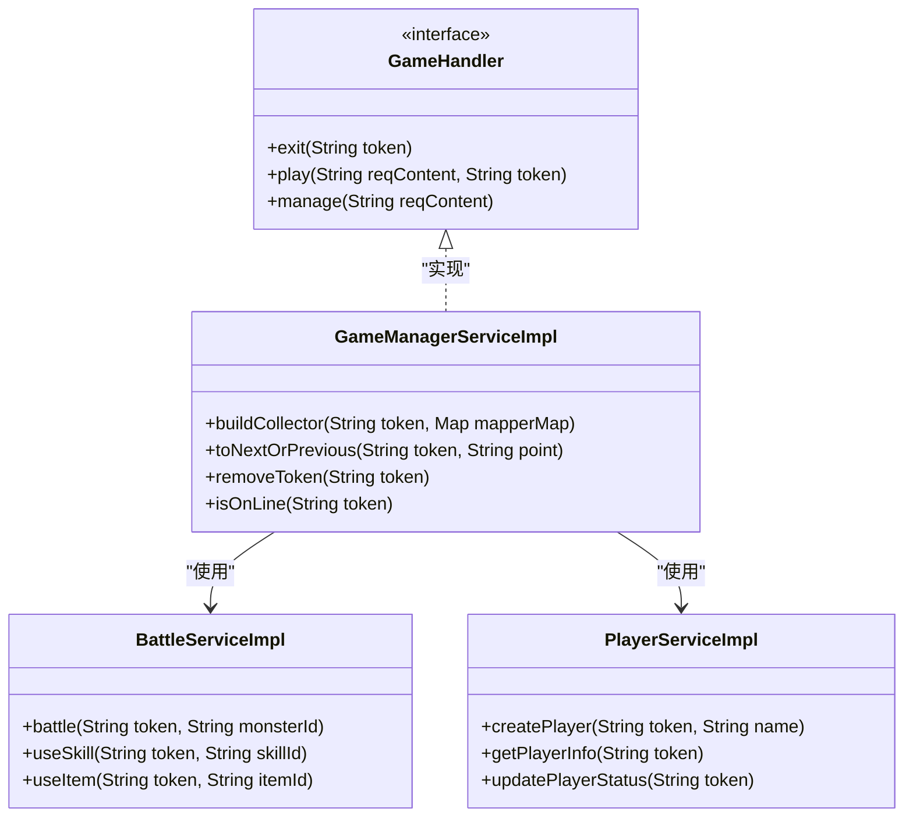

**图表来源**
- [Game/src/main/java/com/bot/game/service/GameHandler.java](file://Game/src/main/java/com/bot/game/service/GameHandler.java#L6-L28)

Game模块的架构特点：
- **接口驱动**: GameHandler定义游戏处理的标准接口
- **状态管理**: 实现玩家状态的持久化和管理
- **业务分离**: 不同游戏功能模块的清晰分离
- **扩展支持**: 易于添加新的游戏功能和玩法

**章节来源**
- [Game/src/main/java/com/bot/game/service/GameHandler.java](file://Game/src/main/java/com/bot/game/service/GameHandler.java#L6-L28)

### Life模块 - 浮生卷游戏层

Life模块专门实现"浮生卷"这一特定的游戏系统：

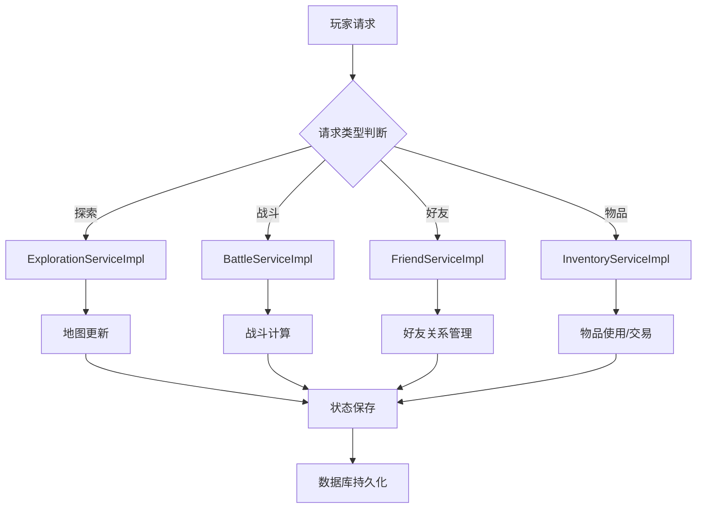

**图表来源**
- [Life模块相关服务类](file://Life模块相关服务类)

Life模块的独特之处：
- **完整游戏生态**: 包含探索、战斗、社交等多个维度
- **实时交互**: 支持实时的游戏状态更新
- **复杂业务逻辑**: 实现了丰富的游戏机制
- **数据模型**: 专门针对游戏场景优化的数据结构

**章节来源**
- [Life模块相关服务类](Life模块相关服务类)

## 核心设计模式

### 责任链模式在消息处理中的应用

Bot项目在Base模块中广泛使用了责任链模式来处理消息分发：

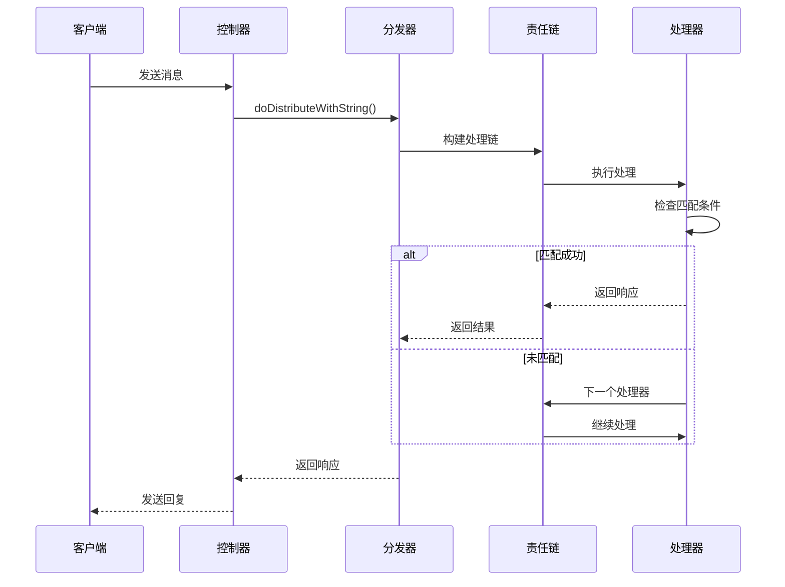

**图表来源**
- [Base/src/main/java/com/bot/base/service/Distributor.java](file://Base/src/main/java/com/bot/base/service/Distributor.java#L21-L26)
- [Base/src/main/java/com/bot/base/chain/ChainCollector.java](file://Base/src/main/java/com/bot/base/chain/ChainCollector.java#L24-L56)

责任链模式的优势：
- **解耦合**: 请求发送者与处理者分离
- **可扩展**: 新增处理逻辑无需修改现有代码
- **灵活性**: 支持动态调整处理顺序
- **测试友好**: 每个处理器可以独立测试

**章节来源**
- [Base/src/main/java/com/bot/base/service/Distributor.java](file://Base/src/main/java/com/bot/base/service/Distributor.java#L21-L26)
- [Base/src/main/java/com/bot/base/chain/ChainCollector.java](file://Base/src/main/java/com/bot/base/chain/ChainCollector.java#L24-L56)

### 策略模式在功能分发中的应用

系统根据不同消息类型采用不同的处理策略：

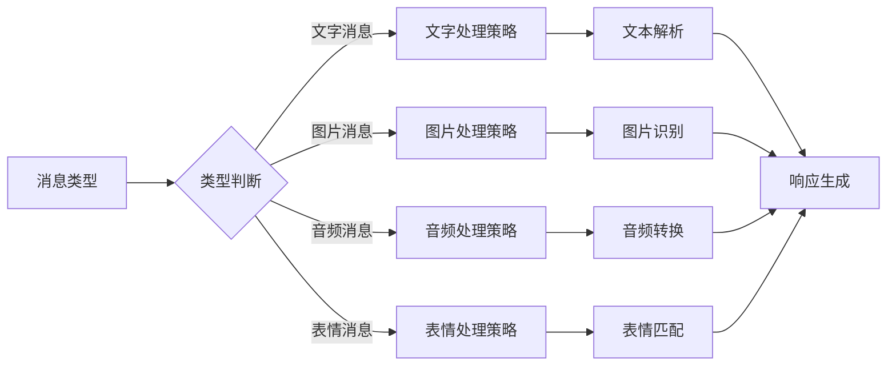

**图表来源**
- [Boot/src/main/java/com/bot/boot/controller/newInstructDistributeController.java](file://Boot/src/main/java/com/bot/boot/controller/newInstructDistributeController.java#L72-L209)

## 数据流与消息处理

### QQ消息接收与处理流程

Bot系统的消息处理遵循标准的MVC架构模式：

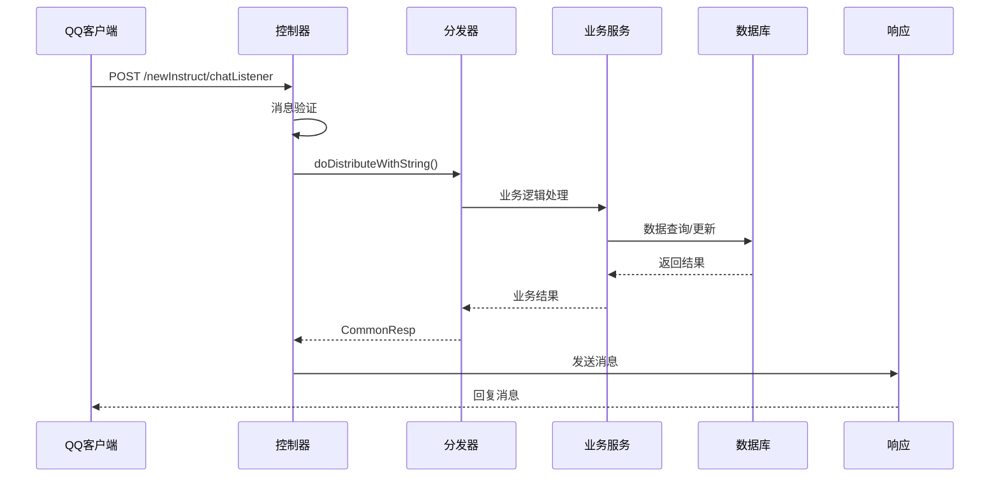

**图表来源**
- [Boot/src/main/java/com/bot/boot/controller/newInstructDistributeController.java](file://Boot/src/main/java/com/bot/boot/controller/newInstructDistributeController.java#L72-L150)

消息处理的关键步骤：
1. **消息验证**: 检查消息类型和重复性
2. **内容解析**: 提取消息内容和上下文信息
3. **路由分发**: 根据消息特征选择处理路径
4. **业务处理**: 调用相应的业务服务
5. **结果封装**: 构建标准化的响应格式
6. **消息发送**: 将结果发送回QQ客户端

**章节来源**
- [Boot/src/main/java/com/bot/boot/controller/newInstructDistributeController.java](file://Boot/src/main/java/com/bot/boot/controller/newInstructDistributeController.java#L72-L255)

### 响应生成与消息发送

系统支持多种消息类型的响应生成：

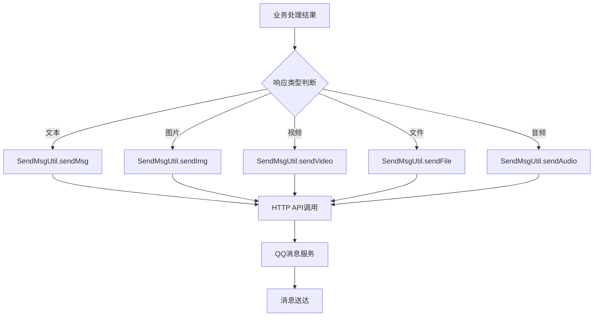

**图表来源**
- [Common/src/main/java/com/bot/common/util/SendMsgUtil.java](file://Common/src/main/java/com/bot/common/util/SendMsgUtil.java#L27-L113)

**章节来源**
- [Common/src/main/java/com/bot/common/util/SendMsgUtil.java](file://Common/src/main/java/com/bot/common/util/SendMsgUtil.java#L27-L274)

## 数据库与ORM选择

### MyBatis vs JPA 的技术决策

Bot项目选择了MyBatis作为ORM框架，而非Spring Data JPA：

#### MyBatis的优势

1. **SQL控制**: 开发者完全控制SQL语句，便于优化复杂查询
2. **性能**: 更接近原生SQL，性能开销更小
3. **调试**: SQL调试更加直观，错误定位更容易
4. **历史兼容**: 对于已有SQL的项目迁移成本低

#### 技术实现特点

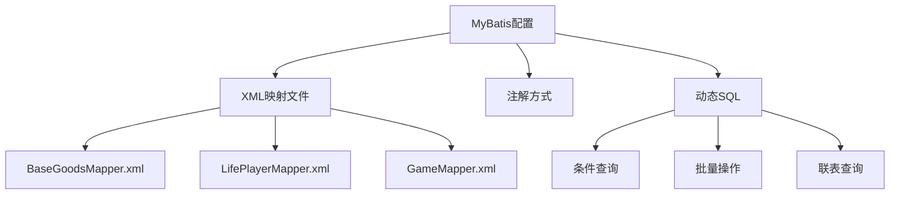

**图表来源**
- [Boot/src/main/resources/application.properties](file://Boot/src/main/resources/application.properties#L64-L68)

#### 配置要点

- **驼峰命名**: `map-underscore-to-camel-case=true`
- **事务管理**: 通过Spring事务管理器控制
- **连接池**: 使用Druid连接池
- **懒加载**: 支持关联对象的延迟加载

**章节来源**
- [Boot/src/main/resources/application.properties](file://Boot/src/main/resources/application.properties#L64-L68)

## 依赖注入与组件管理

### Spring容器管理

Bot项目充分利用了Spring的依赖注入特性：

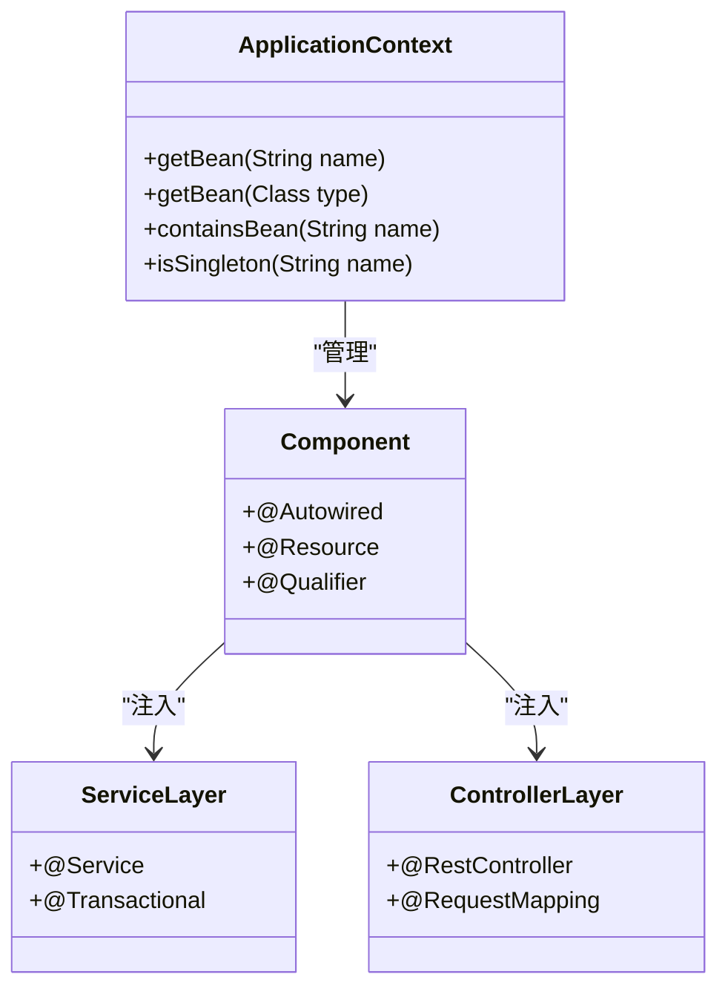

**图表来源**
- [Boot/src/main/java/com/bot/boot/controller/newInstructDistributeController.java](file://Boot/src/main/java/com/bot/boot/controller/newInstructDistributeController.java#L48-L65)

### 组件生命周期管理

系统中的组件按照以下原则管理：

1. **单例模式**: 默认所有Spring Bean都是单例
2. **作用域控制**: 特殊场景使用原型作用域
3. **生命周期回调**: 实现InitializingBean接口
4. **异常处理**: 全局异常处理器统一处理

**章节来源**
- [Boot/src/main/java/com/bot/boot/controller/newInstructDistributeController.java](file://Boot/src/main/java/com/bot/boot/controller/newInstructDistributeController.java#L48-L65)

## 性能优化策略

### 异步处理机制

系统采用多种异步处理策略提升性能：

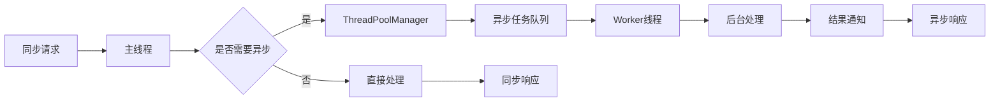

**图表来源**
- [Boot/src/main/java/com/bot/boot/controller/newInstructDistributeController.java](file://Boot/src/main/java/com/bot/boot/controller/newInstructDistributeController.java#L106-L110)

### 缓存策略

系统实现了多层缓存机制：

1. **内存缓存**: SystemConfigCache存储系统配置
2. **连接池缓存**: Druid连接池管理数据库连接
3. **会话缓存**: 用户会话状态缓存
4. **结果缓存**: 频繁查询结果的临时缓存

### 数据库优化

- **索引优化**: 关键字段建立适当索引
- **连接池配置**: 合理设置连接池参数
- **查询优化**: 使用MyBatis的动态SQL优化查询
- **批量操作**: 对于大量数据操作使用批量处理

## 架构决策分析

### 为什么选择模块化架构？

**优势分析**:
1. **职责分离**: 每个模块专注于特定功能领域
2. **独立开发**: 模块间松耦合，支持并行开发
3. **易于维护**: 功能边界清晰，问题定位容易
4. **可扩展性**: 新功能模块可以独立添加

**权衡考虑**:
- **复杂度增加**: 模块间通信带来一定复杂性
- **部署成本**: 需要管理多个模块的部署
- **学习成本**: 开发者需要理解整体架构

### 为什么选择MyBatis而非JPA？

**技术权衡**:

| 方面 | MyBatis | JPA |
|------|---------|-----|
| SQL控制 | 完全控制 | 有限控制 |
| 性能 | 接近原生SQL | ORM开销 |
| 学习曲线 | 中等 | 较高 |
| 迁移成本 | 低 | 高 |
| 复杂查询 | 简单 | 复杂 |

**决策依据**:
1. **已有经验**: 团队对MyBatis有丰富经验
2. **性能要求**: 对查询性能有较高要求
3. **SQL优化**: 需要精细控制SQL执行计划
4. **项目规模**: 中等规模项目，不需要JPA的全部功能

### 为什么采用Spring Boot？

**技术优势**:
1. **快速开发**: 自动配置减少样板代码
2. **生态系统**: 丰富的第三方库支持
3. **微服务友好**: 易于向微服务架构演进
4. **社区支持**: 活跃的社区和文档

**实施考量**:
- **团队熟悉度**: 团队对Spring生态熟悉
- **项目需求**: 符合项目的技术需求
- **长期维护**: Spring Boot的稳定性和成熟度

## 总结

Bot项目通过精心设计的模块化架构，实现了功能丰富、性能优异的QQ机器人系统。其主要技术特色包括：

### 架构优势

1. **清晰的分层**: MVC架构确保了代码的可维护性
2. **模块化设计**: 各功能模块独立开发和部署
3. **设计模式应用**: 责任链、策略等模式提升了系统的灵活性
4. **性能优化**: 异步处理和缓存机制保证了良好的用户体验

### 技术亮点

1. **MyBatis选择**: 在性能和控制之间找到了平衡
2. **Spring Boot生态**: 快速开发和完善的生态系统
3. **依赖注入**: 确保了组件间的松耦合
4. **异步处理**: 提升了系统的并发处理能力

### 可改进方向

1. **微服务化**: 可以考虑将模块进一步拆分为独立的服务
2. **监控体系**: 增强系统的可观测性
3. **测试覆盖**: 提升自动化测试的覆盖率
4. **文档完善**: 建立更完善的API文档体系

Bot项目展现了现代Java企业应用开发的最佳实践，为类似项目的架构设计提供了有价值的参考。