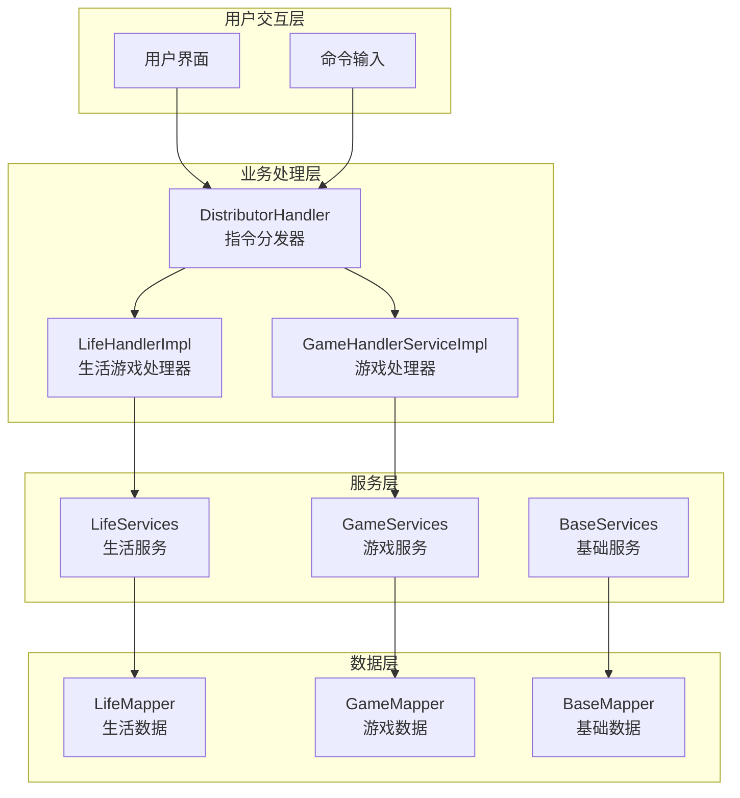
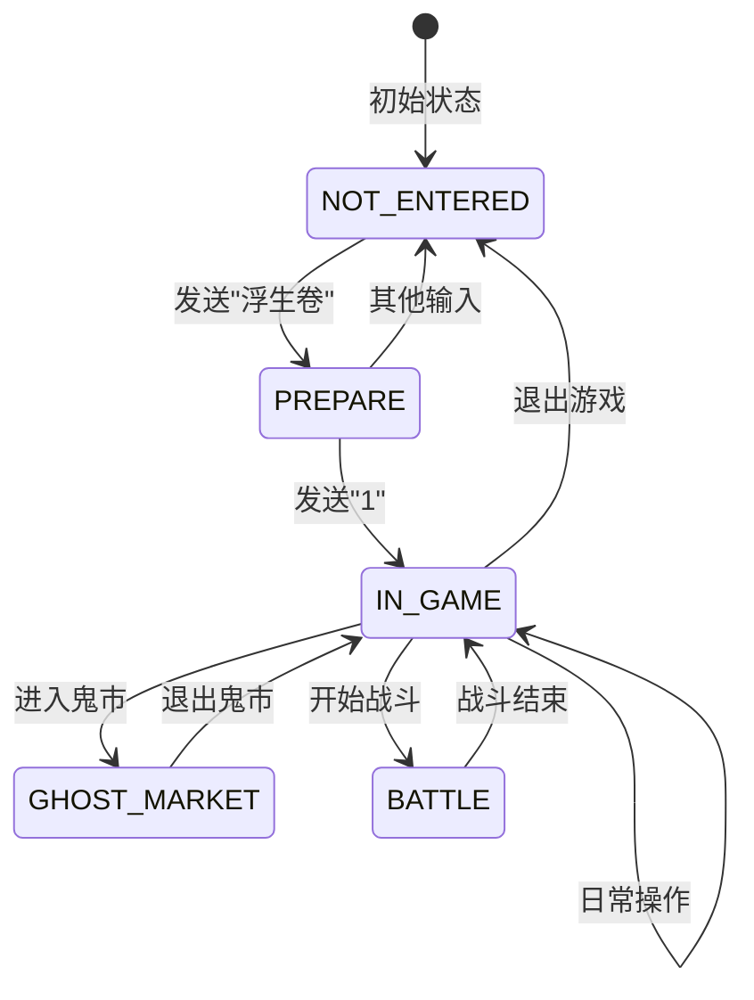
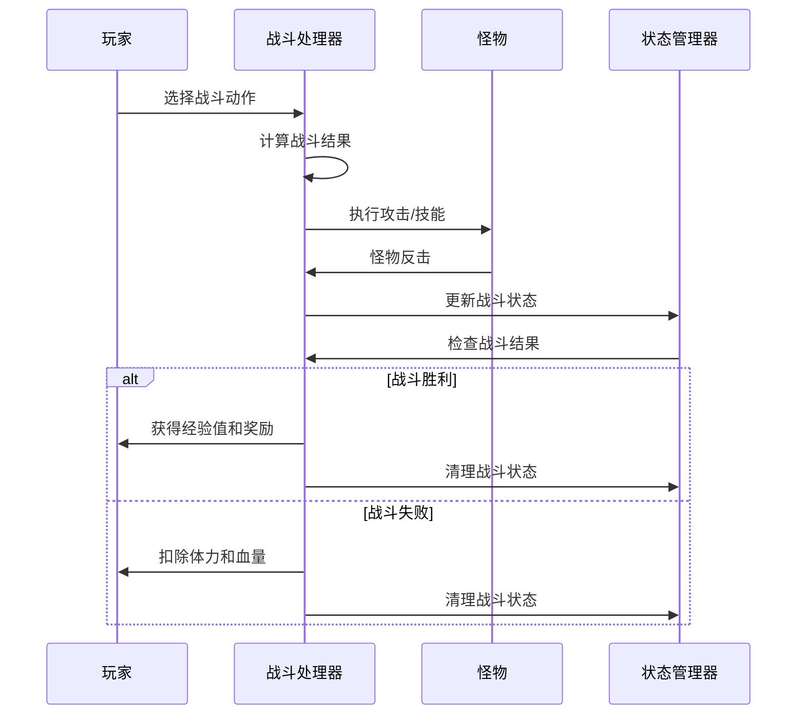
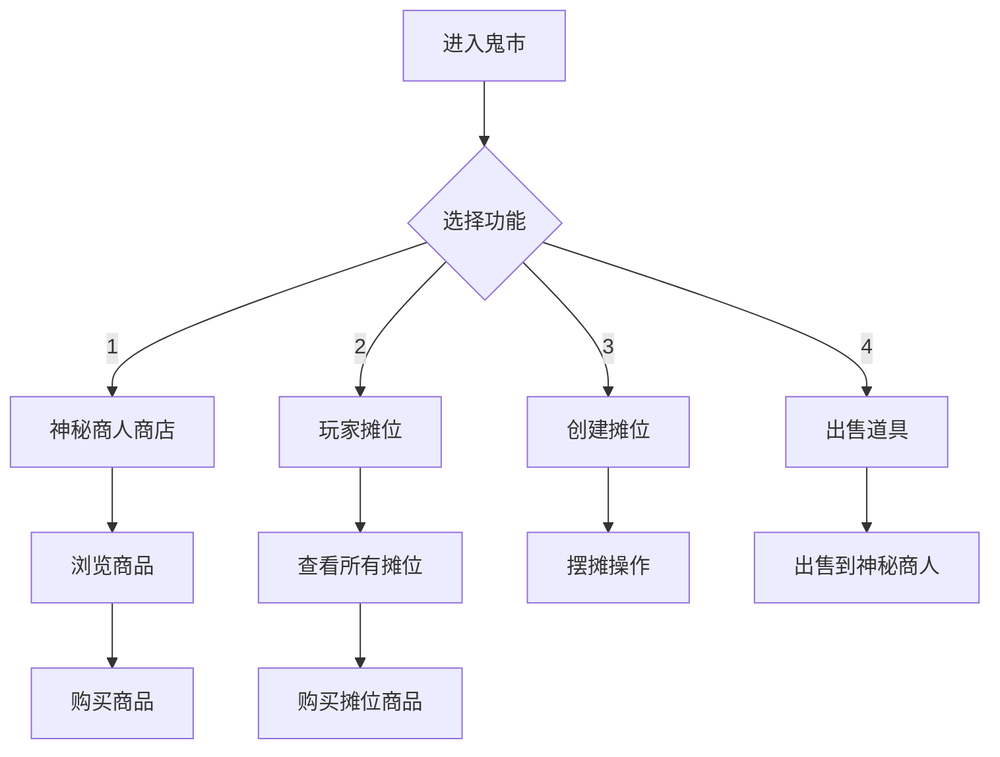
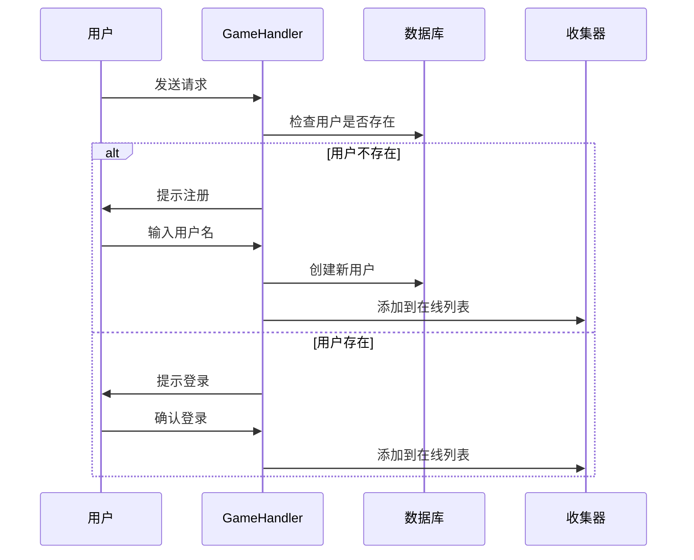
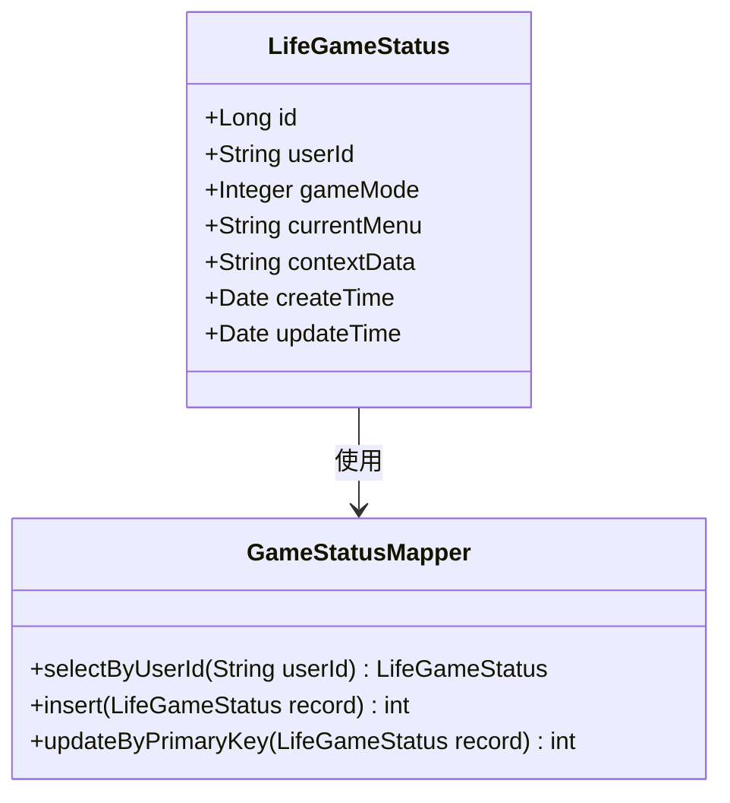
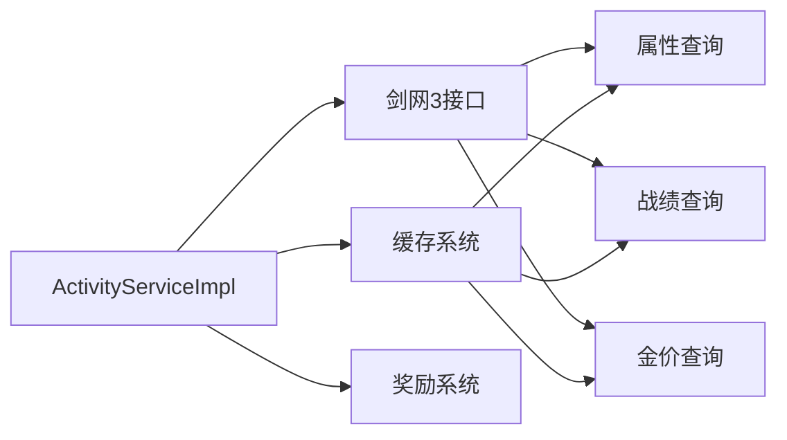
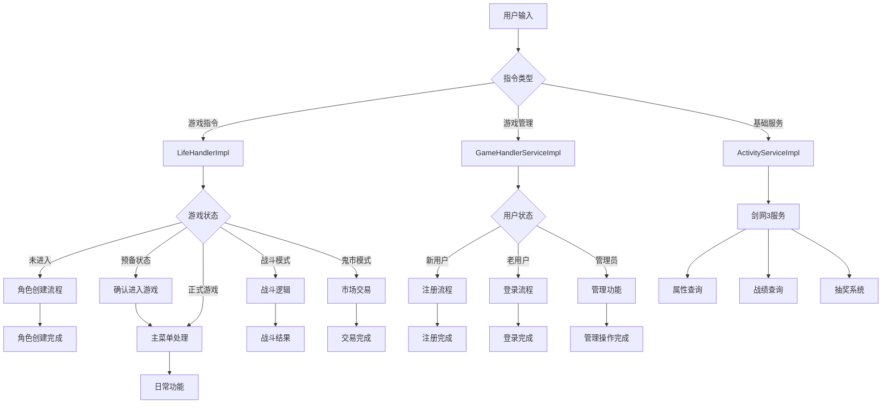
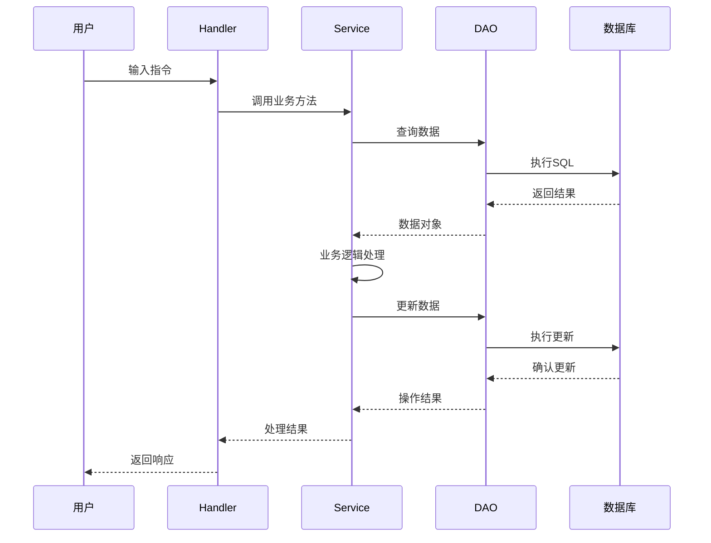
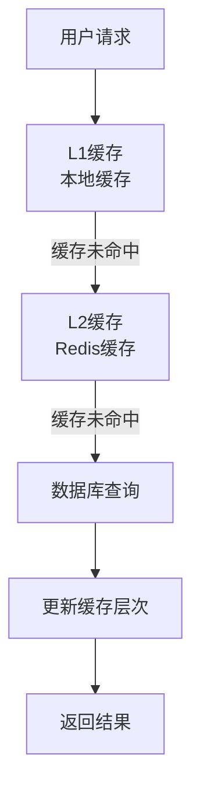

# Bot项目业务处理文档

<cite>
**本文档引用的文件**
- [LifeHandlerImpl.java](file://Life/src/main/java/com/bot/life/service/impl/LifeHandlerImpl.java)
- [GameHandlerServiceImpl.java](file://Game/src/main/java/com/bot/game/service/impl/GameHandlerServiceImpl.java)
- [ENGameMode.java](file://Life/src/main/java/com/bot/life/enums/ENGameMode.java)
- [LifeGameStatus.java](file://Life/src/main/java/com/bot/life/dao/entity/LifeGameStatus.java)
- [ActivityServiceImpl.java](file://Base/src/main/java/com\bot\base\service\impl\ActivityServiceImpl.java)
- [SignServiceImpl.java](file://Base/src/main/java/com\bot\base\service\impl\SignServiceImpl.java)
- [BattleServiceImpl.java](file://Game/src/main/java/com\bot\game\service\impl\BattleServiceImpl.java)
- [MarketServiceImpl.java](file://Life/src/main/java/com\bot\life\service\impl\MarketServiceImpl.java)
- [LifeHandler.java](file://Life/src/main/java/com\bot\life\service\LifeHandler.java)
- [GameHandler.java](file://Game/src/main/java/com\bot\game\service\GameHandler.java)
</cite>

## 目录
1. [项目概述](#项目概述)
2. [核心业务处理器](#核心业务处理器)
3. [LifeHandlerImpl业务逻辑详解](#lifehandlerimpl业务逻辑详解)
4. [GameHandlerServiceImpl业务逻辑详解](#gamehandlerServiceImpl业务逻辑详解)
5. [游戏状态机管理](#游戏状态机管理)
6. [基础业务服务](#基础业务服务)
7. [业务处理流程图](#业务处理流程图)
8. [开发者指南](#开发者指南)
9. [性能优化建议](#性能优化建议)
10. [故障排除](#故障排除)

## 项目概述

Bot项目是一个综合性的聊天机器人系统，包含两个主要的游戏模块：Life（浮生卷）和Game（游戏）。该项目采用分层架构设计，通过业务处理器（Handler）统一管理不同模块的业务逻辑，提供完整的用户交互体验。

### 系统架构概览



## 核心业务处理器

### LifeHandlerImpl - 生活游戏处理器

LifeHandlerImpl是浮生卷游戏的核心业务处理器，负责管理玩家的游戏状态、角色创建、战斗系统、市场交易等功能。

#### 主要职责
- **游戏状态管理**：维护玩家的游戏状态机
- **角色生命周期**：处理角色创建、升级、属性管理
- **战斗系统**：实现回合制战斗逻辑
- **市场交易**：管理鬼市交易系统
- **社交功能**：好友系统、邮件系统

### GameHandlerServiceImpl - 游戏处理器

GameHandlerServiceImpl负责传统游戏模块的业务逻辑，包括注册登录、战斗系统、道具管理等。

#### 主要职责
- **用户认证**：处理用户注册和登录流程
- **游戏管理**：维护游戏状态和配置
- **战斗逻辑**：实现幻灵战斗系统
- **管理员功能**：提供补偿和管理工具

## LifeHandlerImpl业务逻辑详解

### 游戏状态机管理

LifeHandlerImpl通过ENGameMode枚举管理游戏的四种状态：



**图表来源**
- [ENGameMode.java](file://Life/src/main/java/com/bot/life/enums/ENGameMode.java#L8-L12)
- [LifeHandlerImpl.java](file://Life/src/main/java/com/bot/life/service/impl/LifeHandlerImpl.java#L148-L166)

#### 状态转换机制

每个状态转换都伴随着相应的业务逻辑处理：

1. **NOT_ENTERED → PREPARE**
   - 验证用户输入"浮生卷"
   - 生成欢迎界面
   - 设置预备状态标志

2. **PREPARE → IN_GAME**
   - 检查角色是否存在
   - 显示角色创建或主菜单
   - 初始化玩家状态

3. **IN_GAME → GHOST_MARKET**
   - 更新玩家位置到鬼市
   - 加载市场界面
   - 设置市场模式状态

4. **IN_GAME → BATTLE**
   - 检查体力条件
   - 初始化战斗状态
   - 进入战斗模式

**段落来源**
- [LifeHandlerImpl.java](file://Life/src/main/java/com/bot/life/service/impl/LifeHandlerImpl.java#L148-L218)
- [LifeHandlerImpl.java](file://Life/src/main/java/com/bot/life/service/impl/LifeHandlerImpl.java#L556-L570)

### 战斗系统实现

战斗系统采用回合制设计，支持多种战斗动作：



**图表来源**
- [LifeHandlerImpl.java](file://Life/src/main/java/com/bot/life/service/impl/LifeHandlerImpl.java#L1140-L1206)
- [BattleServiceImpl.java](file://Game/src/main/java/com\bot\game\service\impl\BattleServiceImpl.java#L189-L208)

#### 战斗动作处理

战斗系统支持以下动作：
- **攻击**：普通物理攻击
- **防御**：降低受到的伤害
- **技能**：使用特殊技能
- **道具**：使用战斗道具
- **逃跑**：尝试脱离战斗

**段落来源**
- [LifeHandlerImpl.java](file://Life/src/main/java/com/bot/life/service/impl/LifeHandlerImpl.java#L1150-L1199)

### 鬼市交易系统

鬼市是Life模块的核心经济系统，提供神秘商人商店和玩家摊位功能：



**图表来源**
- [MarketServiceImpl.java](file://Life/src/main/java/com\bot\life\service\impl\MarketServiceImpl.java#L46-L61)
- [LifeHandlerImpl.java](file://Life/src/main/java/com/bot/life/service/impl/LifeHandlerImpl.java#L990-L1073)

**段落来源**
- [MarketServiceImpl.java](file://Life/src/main/java/com\bot\life\service\impl\MarketServiceImpl.java#L64-L95)
- [MarketServiceImpl.java](file://Life/src/main/java/com\bot\life\service\impl\MarketServiceImpl.java#L147-L179)

## GameHandlerServiceImpl业务逻辑详解

### 注册登录流程

GameHandlerServiceImpl实现了完整的用户认证系统：



**图表来源**
- [GameHandlerServiceImpl.java](file://Game/src/main/java/com/bot/game/service/impl/GameHandlerServiceImpl.java#L89-L133)

#### 登录状态管理

系统使用WAIT_REG和WAIT_LOGIN两个列表跟踪用户的登录状态：

1. **等待注册**：用户首次访问时添加到WAIT_REG
2. **等待登录**：已有账户的用户添加到WAIT_LOGIN
3. **在线状态**：通过collector管理活跃连接

**段落来源**
- [GameHandlerServiceImpl.java](file://Game/src/main/java/com/bot/game/service/impl/GameHandlerServiceImpl.java#L78-L81)
- [GameHandlerServiceImpl.java](file://Game/src/main/java/com/bot/game/service/impl/GameHandlerServiceImpl.java#L124-L133)

### 管理员指令处理

GameHandlerServiceImpl提供了管理员专用的功能：

#### 补偿系统
- **金钱补偿**：`COMPENSATE_MONEY`指令增加用户灵石
- **道具补偿**：`COMPENSATE`指令发放指定道具

#### 系统管理
- **游戏维护**：检查和设置游戏维护状态
- **用户管理**：处理用户补偿和奖励

**段落来源**
- [GameHandlerServiceImpl.java](file://Game/src/main/java/com/bot/game/service/impl/GameHandlerServiceImpl.java#L136-L149)

## 游戏状态机管理

### LifeGameStatus实体

LifeGameStatus是游戏状态的核心数据结构：

| 字段 | 类型 | 描述 |
|------|------|------|
| id | Long | 主键标识 |
| userId | String | 用户唯一标识 |
| gameMode | Integer | 游戏模式（ENGameMode） |
| currentMenu | String | 当前菜单状态 |
| contextData | String | 上下文数据（JSON格式） |
| createTime | Date | 创建时间 |
| updateTime | Date | 更新时间 |

**段落来源**
- [LifeGameStatus.java](file://Life/src/main/java/com/bot/life/dao/entity/LifeGameStatus.java#L12-L20)

### 状态持久化

游戏状态通过gameStatusMapper进行持久化管理：



**图表来源**
- [LifeGameStatus.java](file://Life/src/main/java/com/bot/life/dao/entity/LifeGameStatus.java#L12-L20)

## 基础业务服务

### 活动服务（ActivityServiceImpl）

活动服务提供剑网3相关的游戏功能：

#### 核心功能
- **服务器绑定**：绑定游戏服务器和账号
- **日常查询**：查询今日、明日日常任务
- **金价查询**：获取各服务器金价信息
- **抽奖系统**：管理游戏内抽奖活动

#### 服务集成



**图表来源**
- [ActivityServiceImpl.java](file://Base/src/main/java/com\bot\base\service\impl\ActivityServiceImpl.java#L42-L78)

**段落来源**
- [ActivityServiceImpl.java](file://Base/src/main/java/com\bot\base\service\impl\ActivityServiceImpl.java#L85-L213)

### 签到服务（SignServiceImpl）

签到服务实现用户签到和奖励系统：

#### 签到逻辑
1. **检查重复签到**：验证当日是否已签到
2. **计算连续天数**：根据昨日签到情况更新连签天数
3. **奖励发放**：根据签到天数发放相应奖励
4. **状态更新**：更新用户签到状态

#### 跨平台支持
- 支持QQ和微信平台的签到
- 自动合并跨平台签到记录
- 统一奖励计算

**段落来源**
- [SignServiceImpl.java](file://Base/src/main/java/com\bot\base\service\impl\SignServiceImpl.java#L52-L120)

## 业务处理流程图

### 完整业务流程



**图表来源**
- [LifeHandlerImpl.java](file://Life/src/main/java/com/bot/life/service/impl/LifeHandlerImpl.java#L148-L166)
- [GameHandlerServiceImpl.java](file://Game/src/main/java/com/bot/game/service/impl/GameHandlerServiceImpl.java#L89-L133)
- [ActivityServiceImpl.java](file://Base/src/main/java/com\bot\base\service\impl\ActivityServiceImpl.java#L85-L213)

### 关键数据对象流转



## 开发者指南

### 如何扩展游戏功能

#### 1. 添加新的游戏状态

在ENGameMode中添加新状态：
```java
// 在ENGameMode枚举中添加
NEW_STATE(5, "新状态描述")
```

在LifeHandlerImpl中处理新状态：
```java
case NEW_STATE:
    return handleNewState(reqContent, userId, gameStatus);
```

#### 2. 实现新的业务服务

创建新的Service接口和实现类：

```java
// 接口定义
public interface NewService {
    String processOperation(String userId, String params);
}

// 实现类
@Service
public class NewServiceImpl implements NewService {
    // 实现业务逻辑
}
```

#### 3. 添加新的指令处理

在LifeHandlerImpl中添加指令处理方法：
```java
private String handleNewCommand(String reqContent, String userId, LifePlayer player) {
    // 实现新命令逻辑
    return "新命令处理结果";
}
```

### 调试业务逻辑错误

#### 常见问题及解决方案

1. **状态转换异常**
   - 检查ENGameMode枚举定义
   - 验证状态转换逻辑
   - 确保数据库状态同步

2. **战斗系统错误**
   - 验证战斗状态初始化
   - 检查战斗逻辑计算
   - 确认状态清理机制

3. **数据一致性问题**
   - 使用事务管理
   - 实现数据校验
   - 添加异常处理

#### 调试技巧

```java
// 添加日志记录
log.debug("处理{}指令，用户ID：{}", reqContent, userId);

// 数据验证
if (player == null) {
    log.error("玩家不存在，用户ID：{}", userId);
    return "系统错误，请稍后重试";
}
```

### 业务逻辑优化

#### 性能优化策略

1. **缓存机制**
   - 缓存频繁访问的数据
   - 实现智能缓存更新
   - 使用分布式缓存

2. **异步处理**
   - 异步执行耗时操作
   - 使用消息队列
   - 实现批量处理

3. **数据库优化**
   - 优化查询语句
   - 添加索引
   - 分库分表

## 性能优化建议

### 数据库层面优化

#### 索引优化
- 为常用查询字段添加索引
- 优化复合索引设计
- 定期分析查询计划

#### 连接池配置
```properties
# 数据库连接池配置
spring.datasource.hikari.maximum-pool-size=20
spring.datasource.hikari.minimum-idle=5
spring.datasource.hikari.idle-timeout=30000
```

### 缓存策略

#### 多级缓存架构


#### 缓存策略配置
```java
// 缓存注解示例
@Cacheable(value = "playerCache", key = "#userId")
public LifePlayer getPlayerById(String userId) {
    // 查询逻辑
}
```

### 并发处理优化

#### 限流策略
```java
// 令牌桶算法实现
public class RateLimiter {
    private final TokenBucket bucket;
    
    public boolean tryAcquire(String userId) {
        return bucket.tryConsume(userId, 1);
    }
}
```

#### 异步处理
```java
// 异步任务处理
@Async
public void asyncProcess(Long playerId) {
    // 异步业务逻辑
}
```

## 故障排除

### 常见问题及解决方案

#### 1. 游戏状态异常

**症状**：玩家状态无法正常转换
**原因**：数据库状态与内存状态不一致
**解决方案**：
```java
// 强制同步状态
private void syncGameState(String userId) {
    LifeGameStatus status = gameStatusMapper.selectByUserId(userId);
    if (status != null) {
        // 重新加载状态
        loadGameState(status);
    }
}
```

#### 2. 战斗系统卡死

**症状**：战斗无法正常结束
**原因**：战斗状态未正确清理
**解决方案**：
```java
// 战斗超时保护
@Scheduled(fixedDelay = 300000) // 5分钟
public void cleanupTimeoutBattles() {
    // 清理超时战斗状态
    battleStateMapper.cleanupTimeoutBattles();
}
```

#### 3. 鬼市交易失败

**症状**：交易过程中出现数据不一致
**原因**：并发交易导致数据竞争
**解决方案**：
```java
// 交易事务管理
@Transactional(rollbackFor = Exception.class)
public String processTrade(Long buyerId, Long sellerId, Long itemId, Integer quantity) {
    // 交易逻辑
    // 确保原子性操作
}
```

### 监控和报警

#### 关键指标监控
- 游戏状态转换成功率
- 战斗系统响应时间
- 鬼市交易成功率
- 用户活跃度指标

#### 告警机制
```java
@Component
public class BusinessAlert {
    
    @EventListener
    public void handleBusinessException(BusinessException event) {
        // 发送告警通知
        alertService.sendAlert(event.getMessage());
    }
}
```

### 日志分析

#### 关键日志记录
```java
// 重要业务操作日志
log.info("用户{}执行{}操作，结果：{}", userId, operation, result);
log.warn("检测到异常状态转换，当前状态：{}", currentState);
log.error("处理{}指令失败，错误：{}", reqContent, e.getMessage());
```

#### 日志分析工具
- ELK Stack（Elasticsearch, Logstash, Kibana）
- Prometheus + Grafana
- 自定义日志分析脚本

通过以上文档，开发者可以全面了解Bot项目的业务处理机制，掌握扩展功能的方法，并能够有效地调试和优化系统性能。系统的模块化设计使得功能扩展变得简单，而完善的状态管理和错误处理机制确保了系统的稳定性和可靠性。