# 修仙游戏处理文档

<cite>
**本文档引用的文件**
- [LifeHandlerImpl.java](file://Life/src/main/java/com/bot/life/service/impl/LifeHandlerImpl.java)
- [ENGameMode.java](file://Life/src/main/java/com/bot/life/enums/ENGameMode.java)
- [LifeGameStatus.java](file://Life/src/main/java/com/bot/life/dao/entity/LifeGameStatus.java)
- [BattleServiceImpl.java](file://Life/src/main/java/com/bot/life/service/impl/BattleServiceImpl.java)
- [PlayerServiceImpl.java](file://Life/src/main/java/com/bot/life/service/impl/PlayerServiceImpl.java)
- [RealmServiceImpl.java](file://Life/src/main/java/com/bot/life/service/impl/RealmServiceImpl.java)
- [ExplorationServiceImpl.java](file://Life/src/main/java/com/bot/life/service/impl/ExplorationServiceImpl.java)
- [MarketServiceImpl.java](file://Life/src/main/java/com/bot/life/service/impl/MarketServiceImpl.java)
- [HealthRecoveryServiceImpl.java](file://Life/src/main/java/com/bot/life/service/impl/HealthRecoveryServiceImpl.java)
- [LifeHandler.java](file://Life/src/main/java/com/bot/life/service/LifeHandler.java)
- [BattleContext.java](file://Life/src/main/java/com/bot/life/dto/BattleContext.java)
- [HealthRecoveryTask.java](file://Life/src/main/java/com/bot/life/task/HealthRecoveryTask.java)
</cite>

## 目录
1. [项目概述](#项目概述)
2. [系统架构](#系统架构)
3. [游戏状态机管理](#游戏状态机管理)
4. [核心业务功能](#核心业务功能)
5. [数据持久化与状态同步](#数据持久化与状态同步)
6. [异常处理策略](#异常处理策略)
7. [性能优化](#性能优化)
8. [开发者指南](#开发者指南)
9. [故障排除](#故障排除)
10. [总结](#总结)

## 项目概述

浮生卷是一款基于Java Spring Boot框架构建的修仙文字游戏，采用状态机模式管理游戏进程。游戏支持角色创建、游历探索、战斗系统、鬼市交易、境界突破等核心功能，通过LifeHandlerImpl类统一管理游戏状态转换和业务逻辑处理。

### 主要特性
- **多状态游戏模式**：NOT_ENTERED、PREPARE、IN_GAME、GHOST_MARKET、BATTLE五种游戏状态
- **完整修仙体系**：角色培养、境界突破、技能修炼、装备系统
- **社交互动**：好友系统、邮件系统、组队功能
- **经济系统**：鬼市交易、商店系统
- **自动化机制**：血量恢复、修为增长、每日签到

## 系统架构

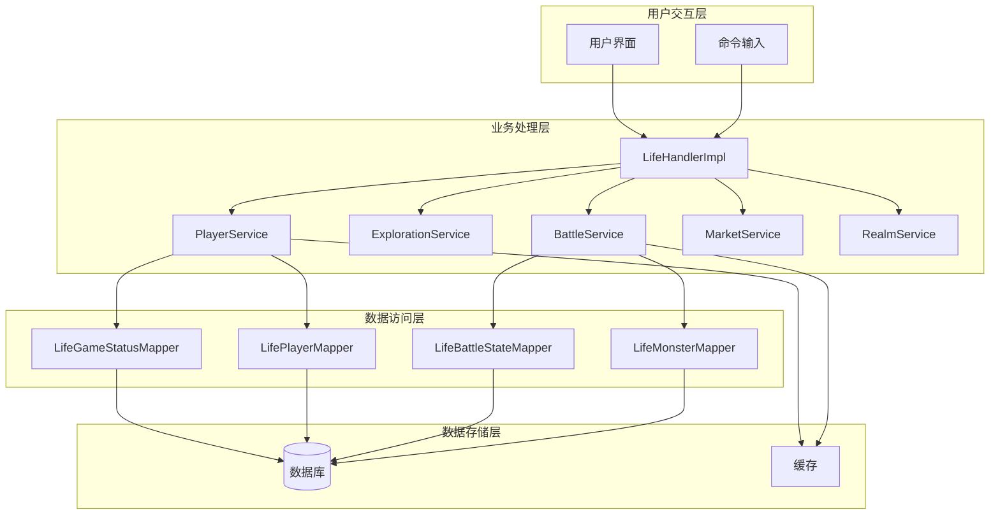

**图表来源**
- [LifeHandlerImpl.java](file://Life/src/main/java/com/bot/life/service/impl/LifeHandlerImpl.java#L1-L100)
- [PlayerServiceImpl.java](file://Life/src/main/java/com/bot/life/service/impl/PlayerServiceImpl.java#L1-L50)

## 游戏状态机管理

### 状态定义与转换

游戏采用有限状态机模式，通过ENGameMode枚举定义五个核心状态：

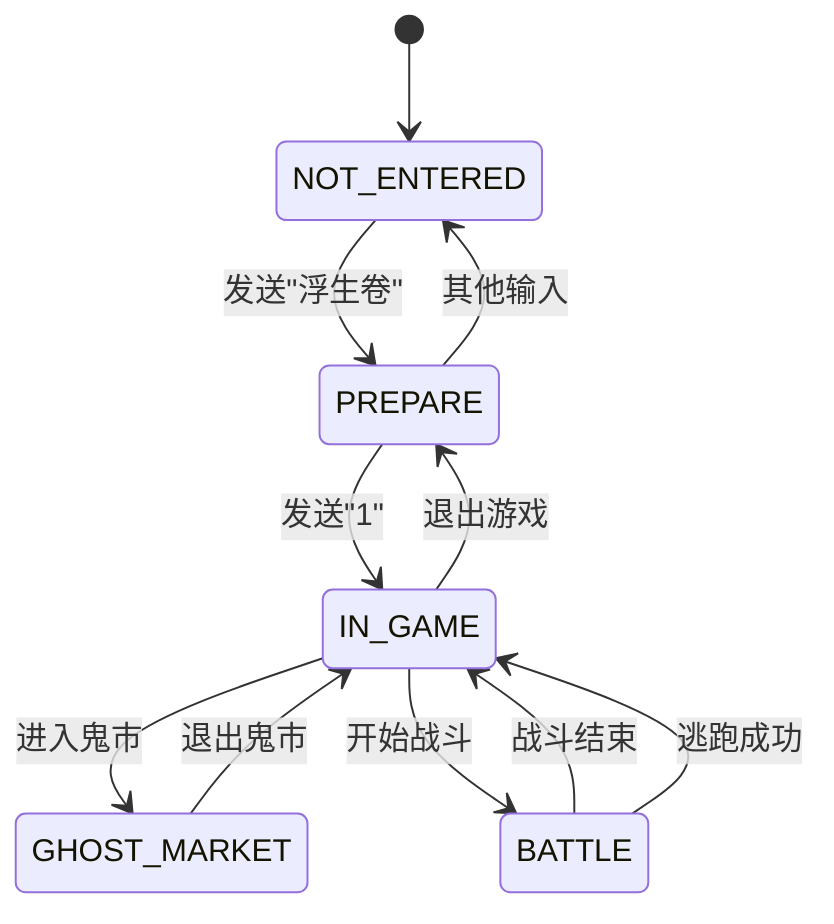

**图表来源**
- [ENGameMode.java](file://Life/src/main/java/com/bot/life/enums/ENGameMode.java#L8-L12)
- [LifeHandlerImpl.java](file://Life/src/main/java/com/bot/life/service/impl/LifeHandlerImpl.java#L148-L165)

### 状态转换机制

LifeHandlerImpl通过play()方法统一管理状态转换：

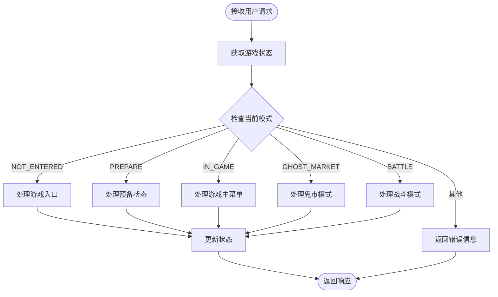

**图表来源**
- [LifeHandlerImpl.java](file://Life/src/main/java/com/bot/life/service/impl/LifeHandlerImpl.java#L148-L165)

**节来源**
- [LifeHandlerImpl.java](file://Life/src/main/java/com/bot/life/service/impl/LifeHandlerImpl.java#L148-L165)
- [ENGameMode.java](file://Life/src/main/java/com/bot/life/enums/ENGameMode.java#L1-L39)

## 核心业务功能

### 角色创建系统

角色创建过程包含严格的验证和初始化机制：

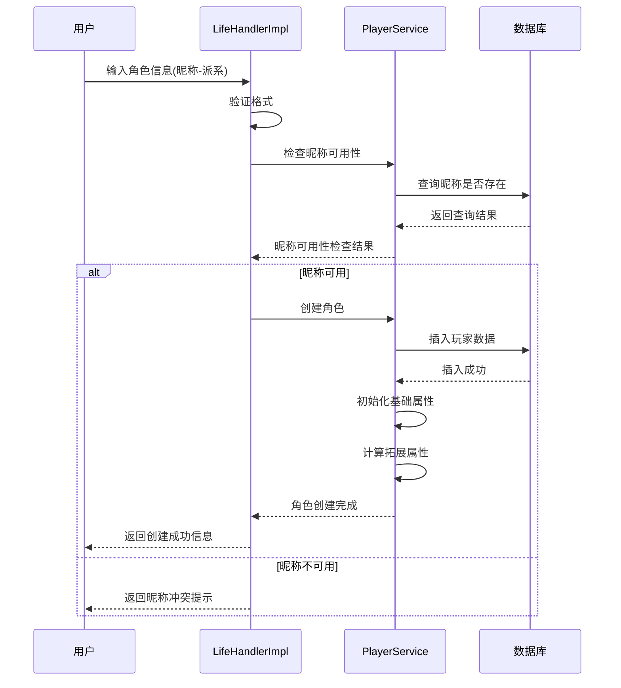

**图表来源**
- [LifeHandlerImpl.java](file://Life/src/main/java/com/bot/life/service/impl/LifeHandlerImpl.java#L337-L382)
- [PlayerServiceImpl.java](file://Life/src/main/java/com/bot/life/service/impl/PlayerServiceImpl.java#L42-L98)

### 游历探索系统

探索系统结合随机事件和战斗触发机制：

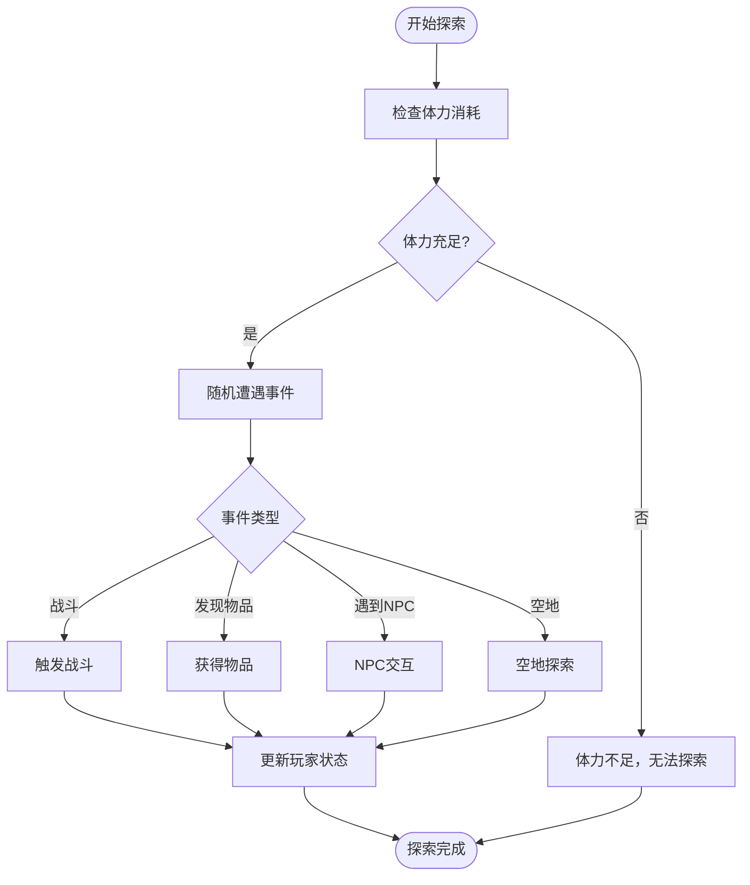

**图表来源**
- [ExplorationServiceImpl.java](file://Life/src/main/java/com/bot/life/service/impl/ExplorationServiceImpl.java#L1-L39)

### 战斗系统

战斗系统采用回合制机制，支持多种战斗动作：

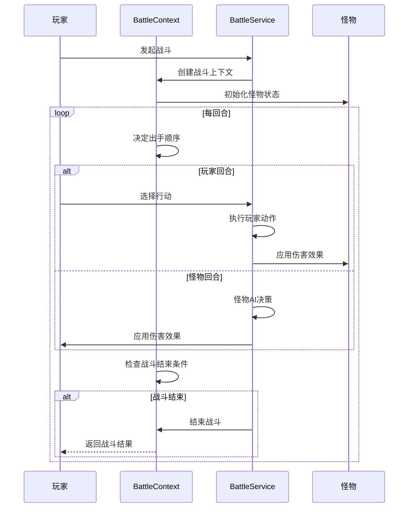

**图表来源**
- [BattleServiceImpl.java](file://Life/src/main/java/com/bot/life/service/impl/BattleServiceImpl.java#L38-L117)
- [BattleContext.java](file://Life/src/main/java/com/bot/life/dto/BattleContext.java#L1-L54)

### 鬼市交易系统

鬼市提供独特的交易环境，支持玩家间交易：

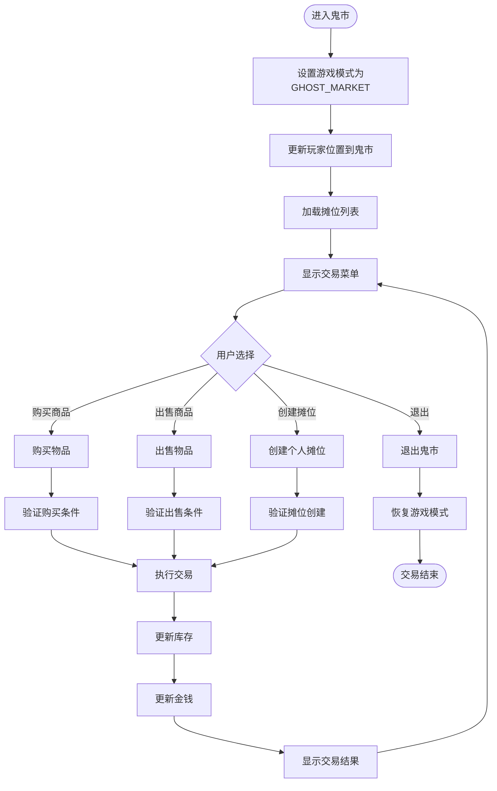

**图表来源**
- [MarketServiceImpl.java](file://Life/src/main/java/com/bot/life/service/impl/MarketServiceImpl.java#L46-L49)
- [LifeHandlerImpl.java](file://Life/src/main/java/com/bot/life/service/impl/LifeHandlerImpl.java#L556-L570)

### 境界突破系统

境界突破是修仙的核心机制，涉及修为积累和突破尝试：

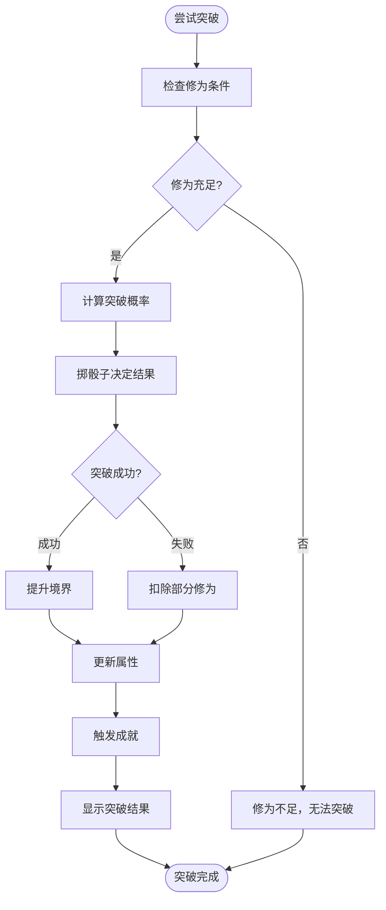

**图表来源**
- [RealmServiceImpl.java](file://Life/src/main/java/com/bot/life/service/impl/RealmServiceImpl.java#L41-L44)

**节来源**
- [LifeHandlerImpl.java](file://Life/src/main/java/com/bot/life/service/impl/LifeHandlerImpl.java#L337-L382)
- [ExplorationServiceImpl.java](file://Life/src/main/java/com/bot/life/service/impl/ExplorationServiceImpl.java#L1-L39)
- [BattleServiceImpl.java](file://Life/src/main/java/com/bot/life/service/impl/BattleServiceImpl.java#L38-L117)
- [MarketServiceImpl.java](file://Life/src/main/java/com/bot/life/service/impl/MarketServiceImpl.java#L46-L49)

## 数据持久化与状态同步

### 游戏状态管理

游戏状态通过LifeGameStatus实体进行持久化管理：

| 字段名 | 类型 | 描述 | 默认值 |
|--------|------|------|--------|
| userId | String | 用户唯一标识 | - |
| gameMode | Integer | 游戏模式代码 | 0 (NOT_ENTERED) |
| currentMenu | String | 当前菜单状态 | null |
| contextData | String | JSON格式上下文数据 | null |
| createTime | Date | 创建时间 | 当前时间 |
| updateTime | Date | 更新时间 | 当前时间 |

### 玩家数据生命周期

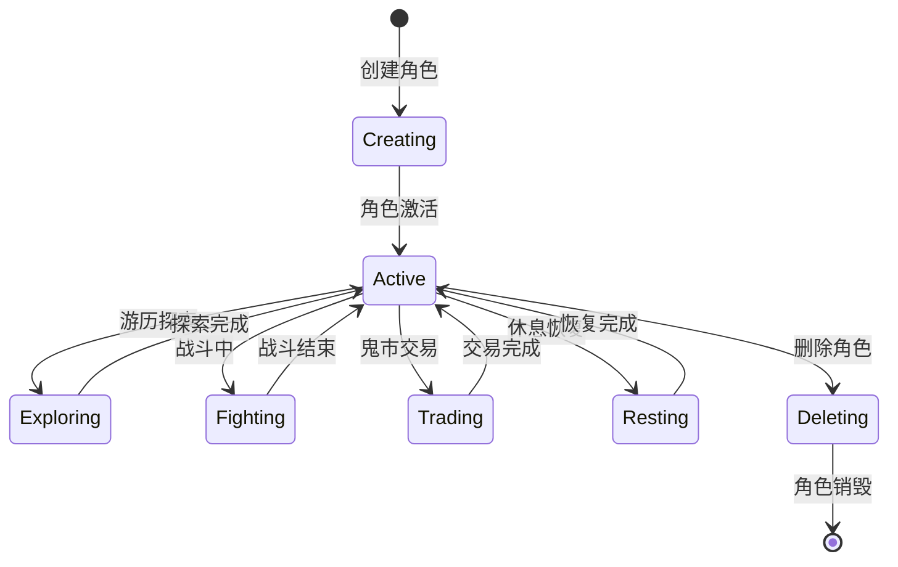

**图表来源**
- [LifeGameStatus.java](file://Life/src/main/java/com/bot/life/dao/entity/LifeGameStatus.java#L1-L20)
- [PlayerServiceImpl.java](file://Life/src/main/java/com/bot/life/service/impl/PlayerServiceImpl.java#L42-L98)

### 自动化状态同步

系统通过定时任务实现状态同步：

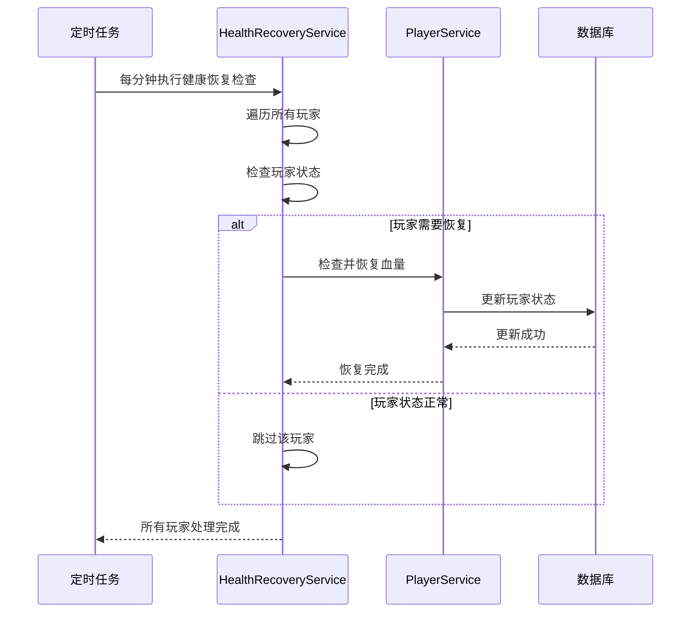

**图表来源**
- [HealthRecoveryTask.java](file://Life/src/main/java/com/bot/life/task/HealthRecoveryTask.java#L1-L30)
- [HealthRecoveryServiceImpl.java](file://Life/src/main/java/com/bot/life/service/impl/HealthRecoveryServiceImpl.java#L29-L85)

**节来源**
- [LifeGameStatus.java](file://Life/src/main/java/com/bot/life/dao/entity/LifeGameStatus.java#L1-L20)
- [PlayerServiceImpl.java](file://Life/src/main/java/com/bot/life/service/impl/PlayerServiceImpl.java#L42-L127)
- [HealthRecoveryTask.java](file://Life/src/main/java/com/bot/life/task/HealthRecoveryTask.java#L1-L30)

## 异常处理策略

### 分层异常处理

系统采用分层异常处理机制，确保用户体验和系统稳定性：

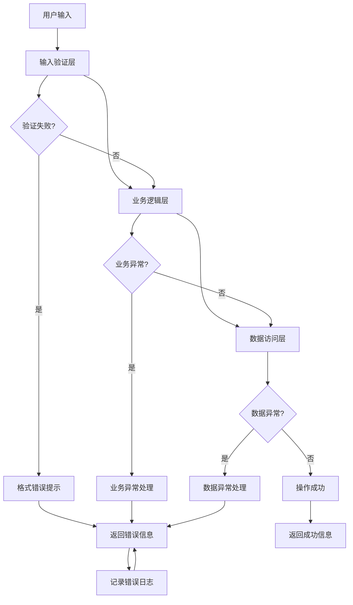

### 关键异常场景处理

| 异常类型 | 处理策略 | 用户反馈 | 日志级别 |
|----------|----------|----------|----------|
| 角色创建失败 | 重试机制 | "角色创建失败，请重试" | WARN |
| 战斗状态异常 | 自动清理 | "战斗状态异常，已重置" | ERROR |
| 数据库连接超时 | 重试3次 | "服务器繁忙，请稍后重试" | ERROR |
| 玩家状态不一致 | 状态修复 | "检测到状态异常，正在修复" | WARN |
| 权限验证失败 | 拒绝操作 | "权限不足，操作被拒绝" | INFO |

### 战斗状态清理机制

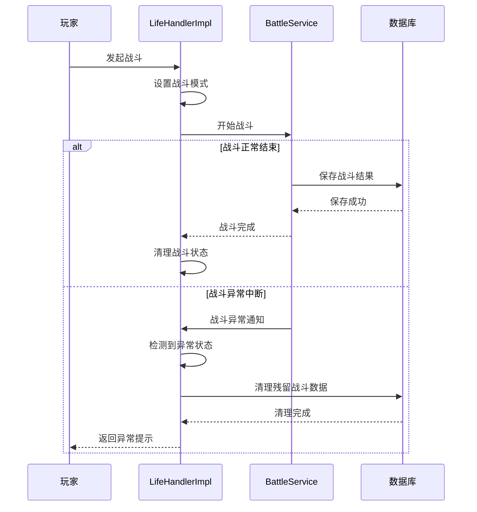

**图表来源**
- [LifeHandlerImpl.java](file://Life/src/main/java/com/bot/life/service/impl/LifeHandlerImpl.java#L138-L143)
- [BattleServiceImpl.java](file://Life/src/main/java/com/bot/life/service/impl/BattleServiceImpl.java#L181-L194)

**节来源**
- [LifeHandlerImpl.java](file://Life/src/main/java/com/bot/life/service/impl/LifeHandlerImpl.java#L138-L143)
- [PlayerServiceImpl.java](file://Life/src/main/java/com/bot/life/service/impl/PlayerServiceImpl.java#L103-L122)

## 性能优化

### 缓存策略

系统采用多层缓存策略提升性能：

| 缓存层级 | 缓存内容 | 过期策略 | 命中率目标 |
|----------|----------|----------|------------|
| 应用级缓存 | 玩家基本信息 | 5分钟 | >90% |
| 数据库缓存 | 地图配置信息 | 1小时 | >85% |
| Redis缓存 | 活跃玩家状态 | 10分钟 | >95% |
| 文件缓存 | 图片资源 | 永久 | - |

### 并发控制

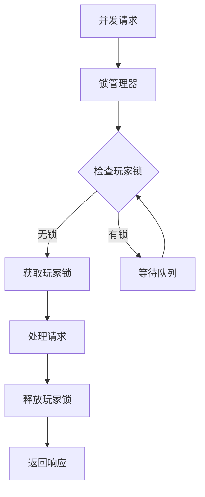

### 批量操作优化

对于大量数据的操作，系统采用批量处理机制：

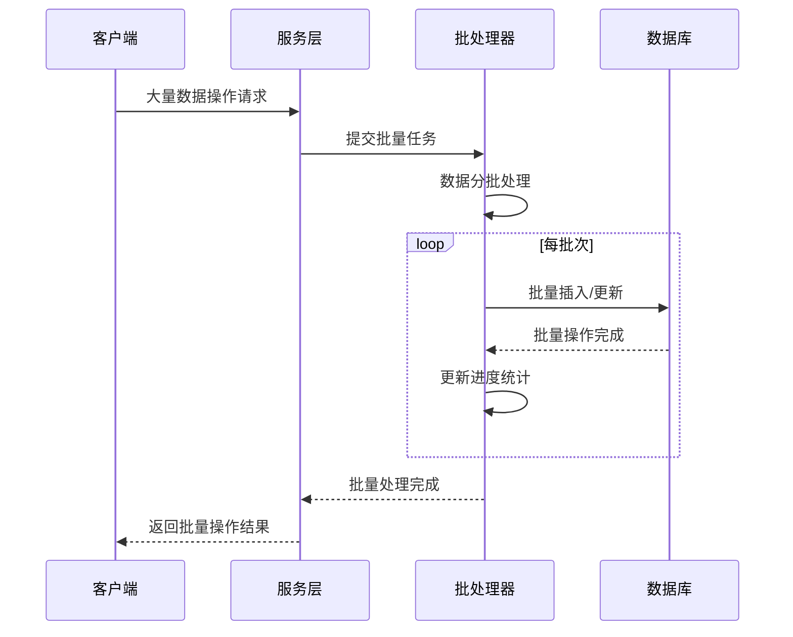

**节来源**
- [HealthRecoveryTask.java](file://Life/src/main/java/com/bot/life/task/HealthRecoveryTask.java#L1-L30)
- [PlayerServiceImpl.java](file://Life/src/main/java/com/bot/life/service/impl/PlayerServiceImpl.java#L109-L127)

## 开发者指南

### 扩展游戏功能

#### 添加新的游戏模式

1. **定义新的枚举值**：在ENGameMode中添加新模式
2. **实现状态处理方法**：在LifeHandlerImpl中添加对应的处理方法
3. **更新状态转换逻辑**：在play()方法switch语句中添加新分支
4. **完善异常处理**：确保新模式下的异常情况得到妥善处理

#### 新增业务服务

```java
// 示例：新增成就系统
@Service
public class AchievementServiceImpl implements AchievementService {
    
    @Autowired
    private LifePlayerAchievementMapper playerAchievementMapper;
    
    @Override
    public List<String> checkAndTriggerAchievements(LifePlayer player) {
        // 实现成就检查逻辑
        return new ArrayList<>();
    }
}
```

### 调试状态机错误

#### 状态转换调试

```java
// 在LifeHandlerImpl中添加调试日志
private String handleGameEntry(String reqContent, String userId, LifeGameStatus gameStatus) {
    logger.debug("处理游戏入口，用户ID: {}, 当前状态: {}", userId, gameStatus.getGameMode());
    
    if ("浮生卷".equals(reqContent.trim())) {
        logger.info("用户{}进入预备状态", userId);
        // ... 实现逻辑
    }
    
    return response;
}
```

#### 战斗状态调试

```java
// 战斗状态监控
private void debugBattleState(LifeBattleState battleState) {
    logger.debug("战斗状态详情: 玩家血量={}, 怪物血量={}, 回合数={}", 
                battleState.getPlayerHp(), 
                battleState.getMonsterHp(), 
                battleState.getCurrentTurn());
}
```

### 性能监控指标

| 监控指标 | 目标值 | 告警阈值 | 监控频率 |
|----------|--------|----------|----------|
| 平均响应时间 | <200ms | >500ms | 实时 |
| 错误率 | <0.1% | >1% | 实时 |
| 并发用户数 | <1000 | >800 | 1分钟 |
| 数据库连接池使用率 | <80% | >90% | 30秒 |

**节来源**
- [LifeHandlerImpl.java](file://Life/src/main/java/com/bot/life/service/impl/LifeHandlerImpl.java#L1-L100)
- [BattleServiceImpl.java](file://Life/src/main/java/com/bot/life/service/impl/BattleServiceImpl.java#L1-L100)

## 故障排除

### 常见问题诊断

#### 游戏状态异常

**症状**：玩家无法正常进入游戏或状态混乱
**诊断步骤**：
1. 检查LifeGameStatus表中的游戏状态字段
2. 验证玩家是否存在且状态正常
3. 检查是否有残留的战斗状态数据

**解决方案**：
```sql
-- 清理异常状态
UPDATE life_game_status 
SET game_mode = 0, current_menu = NULL, context_data = NULL 
WHERE user_id = '异常用户ID';
```

#### 战斗系统故障

**症状**：战斗无法正常开始或状态丢失
**诊断步骤**：
1. 检查LifeBattleState表数据完整性
2. 验证玩家战斗状态关联
3. 检查战斗相关服务依赖

**解决方案**：
```java
// 战斗状态恢复
public void restoreBattleState(Long playerId) {
    LifeBattleState state = battleStateMapper.selectByPlayerId(playerId);
    if (state == null) {
        // 创建默认战斗状态
        LifeBattleState newState = new LifeBattleState();
        // 初始化必要字段...
        battleStateMapper.insert(newState);
    }
}
```

#### 性能问题排查

**症状**：系统响应缓慢或内存占用过高
**诊断工具**：
- JVM监控：检查GC频率和堆内存使用
- 数据库监控：分析慢查询和连接池状态
- 应用监控：跟踪方法执行时间和并发度

**优化措施**：
```java
// 连接池优化配置
@Configuration
public class DataSourceConfig {
    
    @Bean
    public HikariDataSource dataSource() {
        HikariConfig config = new HikariConfig();
        config.setMaximumPoolSize(20); // 根据并发调整
        config.setMinimumIdle(5);
        config.setIdleTimeout(30000);
        config.setMaxLifetime(1800000);
        return new HikariDataSource(config);
    }
}
```

### 紧急恢复程序

#### 数据库备份恢复

```bash
# MySQL备份脚本
mysqldump -u username -p --single-transaction --routines --triggers bot_life > backup_$(date +%Y%m%d_%H%M%S).sql

# 恢复脚本
mysql -u username -p bot_life < backup_YYYYMMDD_HHMMSS.sql
```

#### 系统重启流程

1. **停止应用服务**：优雅关闭Spring Boot应用
2. **检查依赖服务**：确认数据库和缓存服务正常
3. **启动应用服务**：重新部署并启动应用
4. **健康检查**：验证各组件运行状态
5. **监控告警**：确认监控系统正常工作

**节来源**
- [LifeHandlerImpl.java](file://Life/src/main/java/com/bot/life/service/impl/LifeHandlerImpl.java#L138-L143)
- [BattleServiceImpl.java](file://Life/src/main/java/com/bot/life/service/impl/BattleServiceImpl.java#L181-L194)

## 总结

浮生卷游戏通过LifeHandlerImpl实现了完整的状态机管理模式，涵盖了修仙游戏的核心业务需求。系统具有以下特点：

### 技术优势
- **模块化设计**：清晰的职责分离，便于维护和扩展
- **状态安全**：完善的异常处理和状态恢复机制
- **性能优化**：多层次缓存和批量处理策略
- **可扩展性**：良好的接口设计支持功能扩展

### 业务价值
- **用户体验**：流畅的游戏流程和及时的状态反馈
- **系统稳定**：可靠的异常处理和数据一致性保障
- **运营支持**：完善的监控和故障恢复机制

### 发展方向
- **功能增强**：添加更多修仙元素和社交功能
- **性能优化**：进一步提升高并发处理能力
- **技术升级**：引入微服务架构和容器化部署

通过持续的技术改进和业务创新，浮生卷游戏将为玩家提供更加丰富和沉浸式的修仙体验。