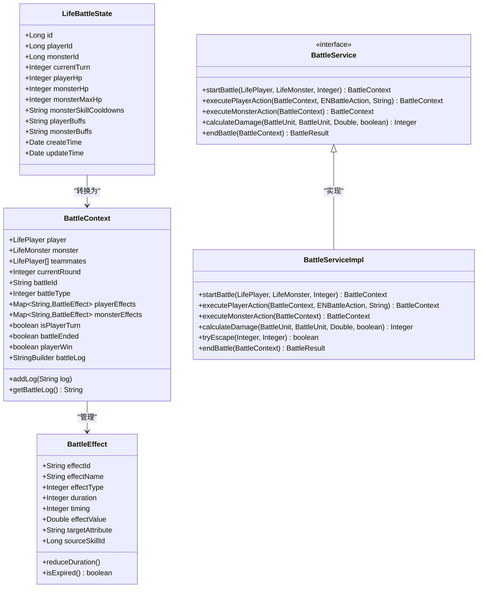
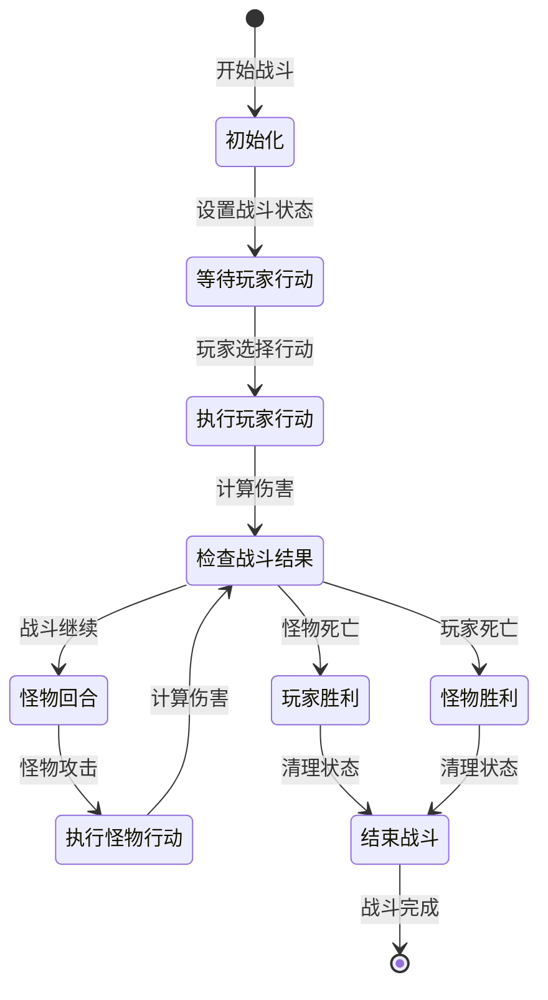
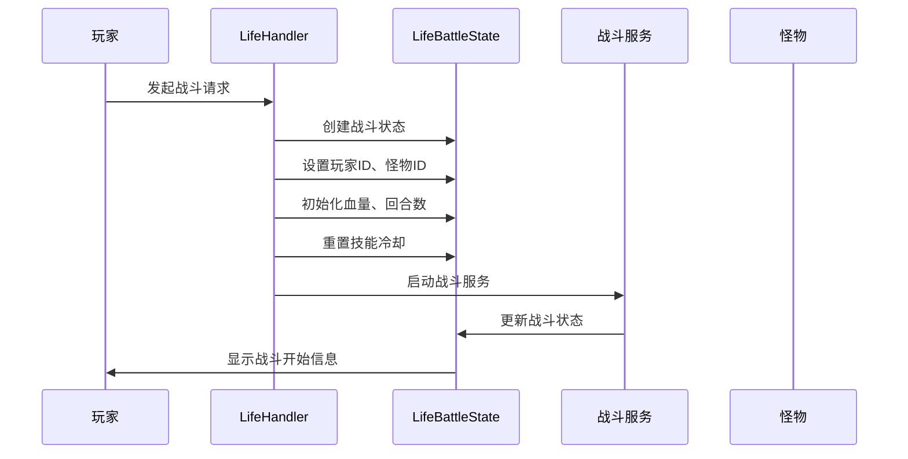
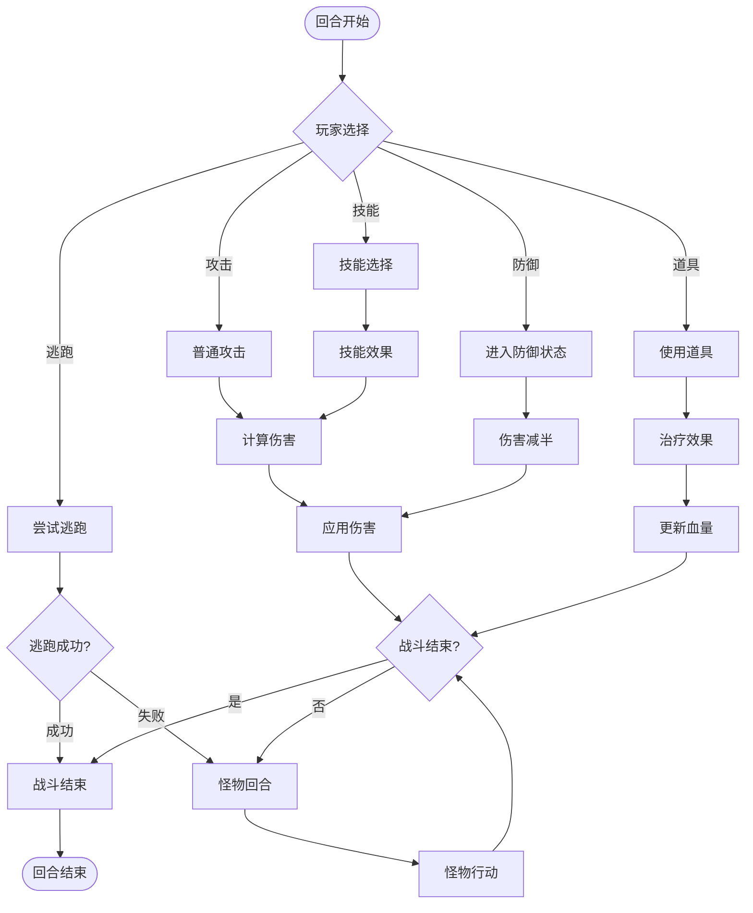
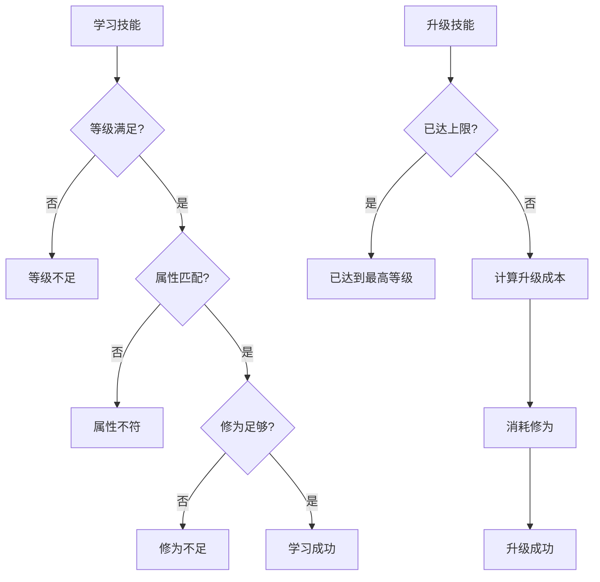
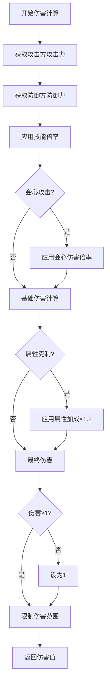
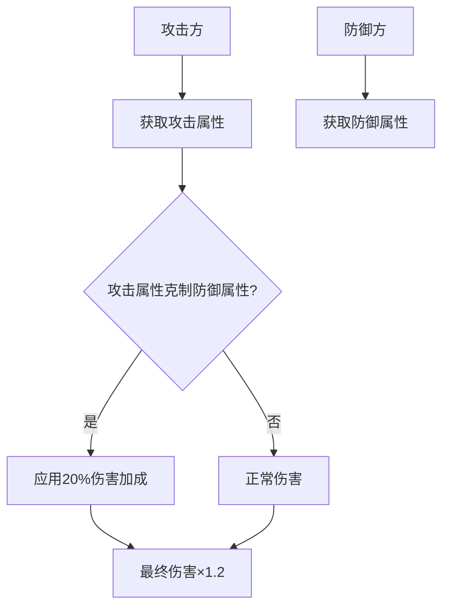
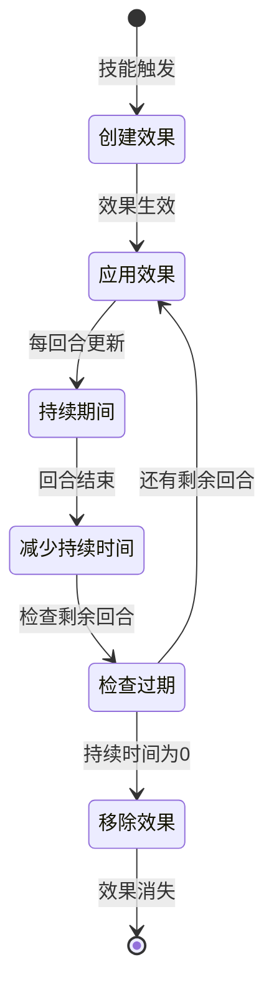

# 修仙游戏战斗系统

<cite>
**本文档引用的文件**
- [LifeBattleState.java](file://Life/src/main/java/com/bot/life/dao/entity/LifeBattleState.java)
- [BattleContext.java](file://Life/src/main/java/com/bot/life/dto/BattleContext.java)
- [BattleEffect.java](file://Life/src/main/java/com/bot/life/dto/BattleEffect.java)
- [BattleResult.java](file://Life/src/main/java/com/bot/life/dto/BattleResult.java)
- [BattleServiceImpl.java](file://Life/src/main/java/com/bot/life/service/impl/BattleServiceImpl.java)
- [LifeHandlerImpl.java](file://Life/src/main/java/com/bot/life/service/impl/LifeHandlerImpl.java)
- [ENBattleAction.java](file://Life/src/main/java/com/bot/life/enums/ENBattleAction.java)
- [ENSkillType.java](file://Life/src/main/java/com/bot/life/enums/ENSkillType.java)
- [ENAttribute.java](file://Life/src/main/java/com/bot/life/enums/ENAttribute.java)
- [LifeSkill.java](file://Life/src/main/java/com/bot/life/dao/entity/LifeSkill.java)
- [LifePlayerSkill.java](file://Life/src/main/java/com/bot/life/dao/entity/LifePlayerSkill.java)
- [ENAttribute.java](file://Game/src/main/java/com/bot/game/enums/ENAttribute.java)
- [BattleServiceImpl.java](file://Game/src/main/java/com/bot/game/service/impl/BattleServiceImpl.java)
</cite>

## 目录
1. [系统概述](#系统概述)
2. [核心组件架构](#核心组件架构)
3. [战斗状态管理](#战斗状态管理)
4. [回合制战斗流程](#回合制战斗流程)
5. [技能系统设计](#技能系统设计)
6. [伤害计算机制](#伤害计算机制)
7. [属性克制系统](#属性克制系统)
8. [战斗效果状态机](#战斗效果状态机)
9. [开发者指南](#开发者指南)
10. [性能优化建议](#性能优化建议)

## 系统概述

修仙游戏战斗系统采用经典的回合制战斗模式，结合修仙元素的特色设计。系统支持玩家与怪物、玩家与玩家之间的战斗，包含技能系统、属性克制、状态效果等丰富玩法。

### 主要特性

- **回合制战斗**：基于速度决定出手顺序，每回合进行一次行动
- **属性克制**：五行相生相克的战斗平衡机制
- **技能系统**：多种类型的技能效果，包括直接伤害、增益、减益
- **状态管理**：完整的战斗状态跟踪和效果持续管理
- **多样化战斗场景**：普通战斗、副本战斗、世界BOSS战斗

## 核心组件架构



**图表来源**
- [LifeBattleState.java](file://Life/src/main/java/com/bot/life/dao/entity/LifeBattleState.java#L9-L23)
- [BattleContext.java](file://Life/src/main/java/com/bot/life/dto/BattleContext.java#L13-L53)
- [BattleEffect.java](file://Life/src/main/java/com/bot/life/dto/BattleEffect.java#L9-L36)
- [BattleServiceImpl.java](file://Life/src/main/java/com/bot/life/service/impl/BattleServiceImpl.java#L26-L302)

**章节来源**
- [LifeBattleState.java](file://Life/src/main/java/com/bot/life/dao/entity/LifeBattleState.java#L9-L23)
- [BattleContext.java](file://Life/src/main/java/com/bot/life/dto/BattleContext.java#L13-L53)
- [BattleServiceImpl.java](file://Life/src/main/java/com/bot/life/service/impl/BattleServiceImpl.java#L26-L302)

## 战斗状态管理

### LifeBattleState实体设计

LifeBattleState是战斗系统的核心数据结构，负责存储战斗过程中的所有状态信息：

| 字段名 | 类型 | 描述 | 默认值 |
|--------|------|------|--------|
| id | Long | 战斗状态唯一标识 | 自动生成 |
| playerId | Long | 玩家ID | 必填 |
| monsterId | Long | 怪物ID | 必填 |
| currentTurn | Integer | 当前回合数 | 1 |
| playerHp | Integer | 玩家当前血量 | 玩家初始血量 |
| monsterHp | Integer | 怪物当前血量 | 怪物初始血量 |
| monsterMaxHp | Integer | 怪物最大血量 | 怪物基础血量 |
| monsterSkillCooldowns | String | 怪物技能冷却状态（JSON格式） | "{}" |
| playerBuffs | String | 玩家buff状态（JSON格式） | "{}" |
| monsterBuffs | String | 怪物buff状态（JSON格式） | "{}" |
| createTime | Date | 创建时间 | 当前时间 |
| updateTime | Date | 更新时间 | 当前时间 |

### 战斗状态生命周期



**图表来源**
- [LifeHandlerImpl.java](file://Life/src/main/java/com/bot/life/service/impl/LifeHandlerImpl.java#L1075-L1125)
- [LifeHandlerImpl.java](file://Life/src/main/java/com/bot/life/service/impl/LifeHandlerImpl.java#L1207-L1287)

**章节来源**
- [LifeBattleState.java](file://Life/src/main/java/com/bot/life/dao/entity/LifeBattleState.java#L9-L23)
- [LifeHandlerImpl.java](file://Life/src/main/java/com/bot/life/service/impl/LifeHandlerImpl.java#L1075-L1125)

## 回合制战斗流程

### 战斗初始化

战斗初始化阶段完成以下任务：

1. **创建战斗状态**：初始化LifeBattleState对象
2. **设置战斗参数**：配置玩家和怪物的基础属性
3. **决定先手顺序**：根据速度属性确定谁先行动
4. **重置技能冷却**：清除玩家的技能冷却时间
5. **记录战斗日志**：初始化战斗记录



**图表来源**
- [LifeHandlerImpl.java](file://Life/src/main/java/com/bot/life/service/impl/LifeHandlerImpl.java#L1075-L1125)
- [BattleServiceImpl.java](file://Life/src/main/java/com/bot/life/service/impl/BattleServiceImpl.java#L37-L53)

### 回合执行流程

每个回合包含以下步骤：

1. **行动选择**：玩家选择攻击、防御、技能、道具或逃跑
2. **行动执行**：根据选择执行相应的战斗动作
3. **伤害计算**：计算造成的伤害值
4. **状态更新**：更新战斗状态和角色属性
5. **效果应用**：应用战斗效果和状态
6. **战斗检查**：检查战斗是否结束



**图表来源**
- [LifeHandlerImpl.java](file://Life/src/main/java/com/bot/life/service/impl/LifeHandlerImpl.java#L1139-L1205)
- [BattleServiceImpl.java](file://Life/src/main/java/com/bot/life/service/impl/BattleServiceImpl.java#L55-L96)

**章节来源**
- [LifeHandlerImpl.java](file://Life/src/main/java/com/bot/life/service/impl/LifeHandlerImpl.java#L1075-L1287)
- [BattleServiceImpl.java](file://Life/src/main/java/com/bot/life/service/impl/BattleServiceImpl.java#L37-L96)

## 技能系统设计

### 技能类型分类

系统支持三种主要的技能类型：

| 技能类型 | 编码 | 描述 | 示例 |
|----------|------|------|------|
| 直接伤害 | 1 | 对目标造成直接伤害 | 普通攻击、火焰掌 |
| 增益效果 | 2 | 提升自身或队友属性 | 气势如虹、金刚不坏 |
| 减益效果 | 3 | 降低敌人属性或施加负面效果 | 冰冻术、眩晕 |

### 技能属性系统

技能系统包含以下核心属性：

| 属性名 | 类型 | 描述 | 要求 |
|--------|------|------|------|
| id | Long | 技能唯一标识 | 自动分配 |
| name | String | 技能名称 | 必填 |
| type | Integer | 技能类型 | 1-3 |
| attribute | Integer | 技能属性 | 0-5（0表示无属性） |
| power | Integer | 技能威力 | 基础伤害值 |
| cooldown | Integer | 冷却时间（回合） | ≥0 |
| requiredLevel | Integer | 需要等级 | ≥1 |
| requiredCultivation | Integer | 需要修为 | ≥0 |
| maxLevel | Integer | 最大等级 | ≥1 |
| description | String | 技能描述 | 可选 |

### 技能学习与升级



**图表来源**
- [SkillServiceImpl.java](file://Life/src/main/java/com/bot/life/service/impl/SkillServiceImpl.java#L65-L114)
- [SkillServiceImpl.java](file://Life/src/main/java/com/bot/life/service/impl/SkillServiceImpl.java#L116-L154)

**章节来源**
- [LifeSkill.java](file://Life/src/main/java/com/bot/life/dao/entity/LifeSkill.java#L10-L22)
- [LifePlayerSkill.java](file://Life/src/main/java/com/bot/life/dao/entity/LifePlayerSkill.java#L10-L22)
- [SkillServiceImpl.java](file://Life/src/main/java/com/bot/life/service/impl/SkillServiceImpl.java#L29-L154)

## 伤害计算机制

### 基础伤害公式

系统采用以下公式计算战斗伤害：

```
伤害 = (攻击方攻击力 × 技能倍率) - 防御方防御力
```

### 伤害计算流程



**图表来源**
- [BattleServiceImpl.java](file://Life/src/main/java/com/bot/life/service/impl/BattleServiceImpl.java#L148-L177)

### 伤害计算示例

以玩家攻击怪物为例：
- 玩家攻击力：50
- 技能倍率：1.0（普通攻击）
- 怪物防御力：8
- 计算过程：`(50 × 1.0) - 8 = 42`
- 最终伤害：42点

**章节来源**
- [BattleServiceImpl.java](file://Life/src/main/java/com/bot/life/service/impl/BattleServiceImpl.java#L148-L177)

## 属性克制系统

### 五行相生相克关系

系统采用传统的五行相生相克理论：

| 属性 | 克制 | 被克制 |
|------|------|--------|
| 金 | 木 | 火 |
| 木 | 土 | 金 |
| 土 | 水 | 木 |
| 水 | 火 | 土 |
| 火 | 金 | 水 |

### 属性克制计算

当攻击方的属性克制防御方属性时，伤害增加20%：



**图表来源**
- [ENAttribute.java](file://Life/src/main/java/com/bot/life/enums/ENAttribute.java#L44-L53)
- [BattleServiceImpl.java](file://Life/src/main/java/com/bot/life/service/impl/BattleServiceImpl.java#L128-L131)

**章节来源**
- [ENAttribute.java](file://Life/src/main/java/com/bot/life/enums/ENAttribute.java#L6-L63)
- [BattleServiceImpl.java](file://Life/src/main/java/com/bot/life/service/impl/BattleServiceImpl.java#L128-L131)

## 战斗效果状态机

### BattleEffect状态管理

战斗效果（BattleEffect）是系统中重要的状态管理组件：

| 效果类型 | 编码 | 描述 | 持续时间 |
|----------|------|------|----------|
| 伤害倍率 | 1 | 增加伤害输出 | N回合 |
| 属性变化 | 2 | 修改属性值 | N回合 |
| 持续效果 | 3 | 特殊状态效果 | N回合 |

### 效果生命周期



**图表来源**
- [BattleEffect.java](file://Life/src/main/java/com/bot/life/dto/BattleEffect.java#L20-L35)

### 效果应用时机

战斗效果在以下时机应用：

| 时机编码 | 描述 | 应用时机 |
|----------|------|----------|
| 1 | 回合开始前 | 战斗开始前检查 |
| 2 | 回合开始后 | 玩家行动后应用 |
| 3 | 回合结束 | 战斗结束时清理 |

**章节来源**
- [BattleEffect.java](file://Life/src/main/java/com/bot/life/dto/BattleEffect.java#L9-L36)
- [BattleContext.java](file://Life/src/main/java/com/bot/life/dto/BattleContext.java#L24-L25)

## 开发者指南

### 添加新技能效果

要添加新的技能效果，需要遵循以下步骤：

1. **定义效果类型**：在ENSkillType中添加新类型
2. **扩展BattleEffect**：添加对应的效果字段
3. **实现效果逻辑**：在BattleServiceImpl中添加效果处理
4. **更新数据库**：添加新的技能效果映射

### 调整战斗平衡性

可以通过以下方式进行平衡性调整：

1. **修改伤害公式**：调整攻击力、防御力的权重
2. **调整属性克制**：修改五行相克关系
3. **平衡技能强度**：调整技能的power和cooldown
4. **优化属性系统**：调整属性对伤害的影响程度

### 性能优化建议

1. **缓存常用计算**：缓存属性计算结果
2. **批量操作**：批量更新战斗状态
3. **异步处理**：将非关键计算异步化
4. **内存管理**：及时清理不再需要的对象

**章节来源**
- [BattleServiceImpl.java](file://Life/src/main/java/com/bot/life/service/impl/BattleServiceImpl.java#L26-L302)
- [SkillServiceImpl.java](file://Life/src/main/java/com/bot/life/service/impl/SkillServiceImpl.java#L29-L246)

## 性能优化建议

### 数据库查询优化

1. **索引优化**：为常用查询字段建立索引
2. **批量查询**：减少数据库交互次数
3. **缓存策略**：缓存频繁访问的数据

### 内存使用优化

1. **对象池**：复用BattleContext等对象
2. **延迟加载**：按需加载战斗效果数据
3. **垃圾回收**：及时释放不再使用的对象

### 并发处理优化

1. **线程安全**：确保战斗状态的线程安全性
2. **锁粒度**：使用细粒度锁减少竞争
3. **异步处理**：将耗时操作异步化

通过以上优化措施，可以显著提升战斗系统的性能表现，为玩家提供更流畅的游戏体验。