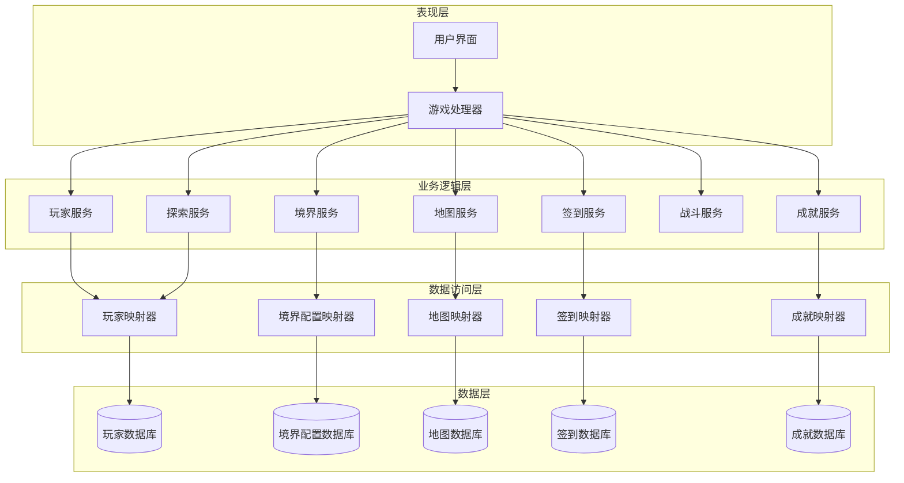
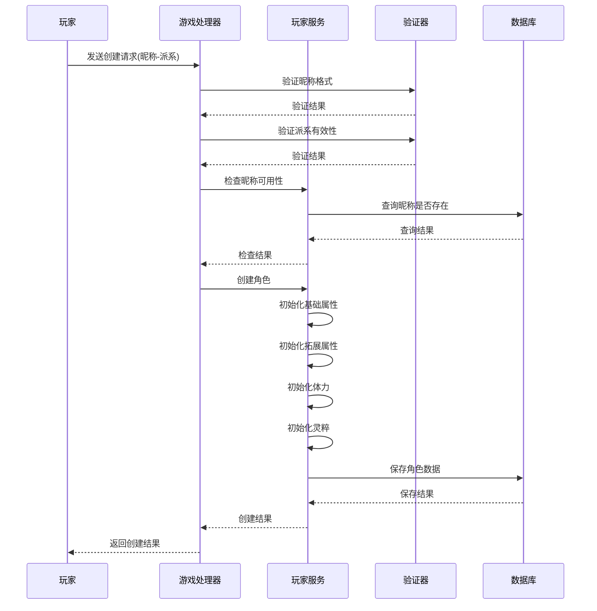
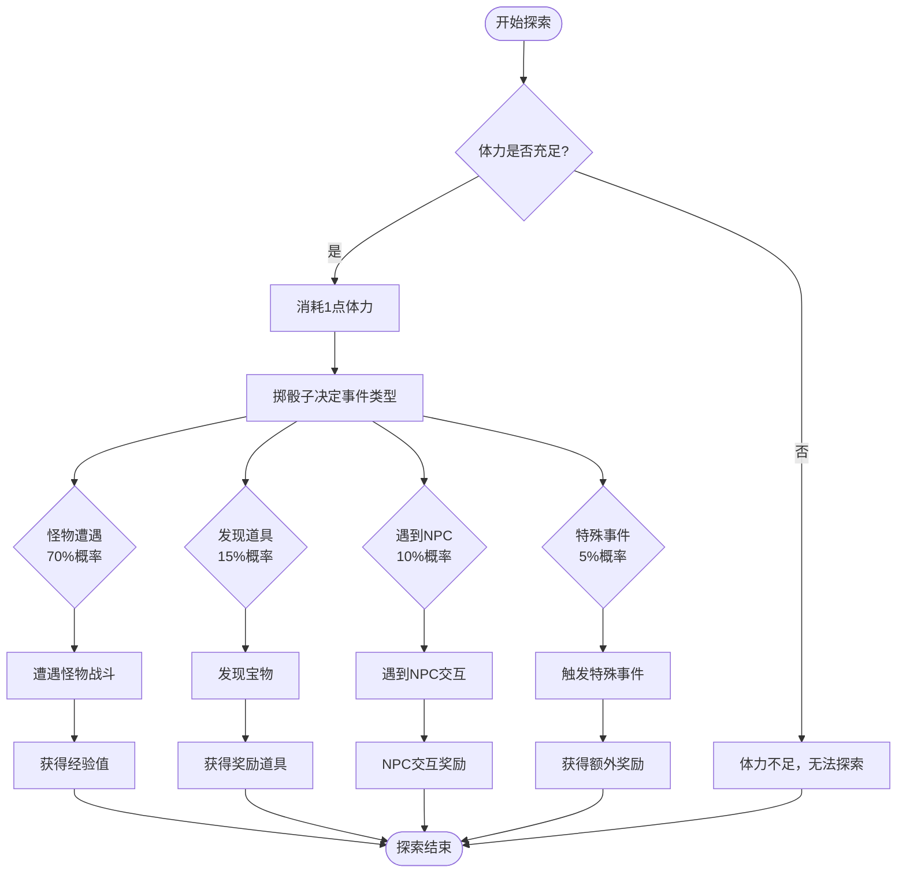
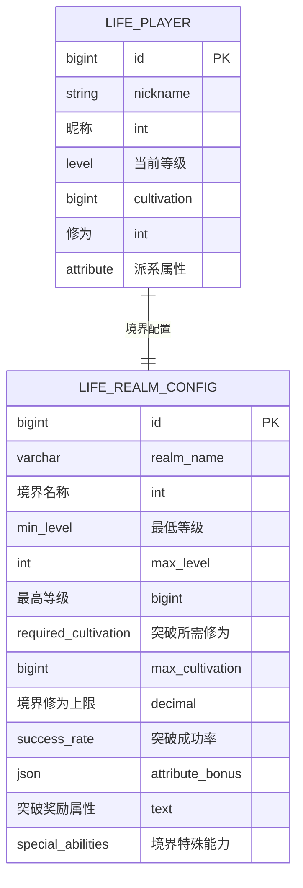
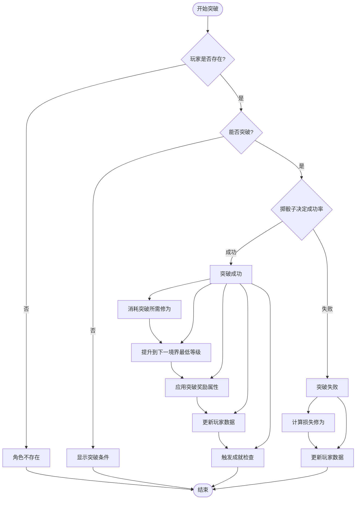
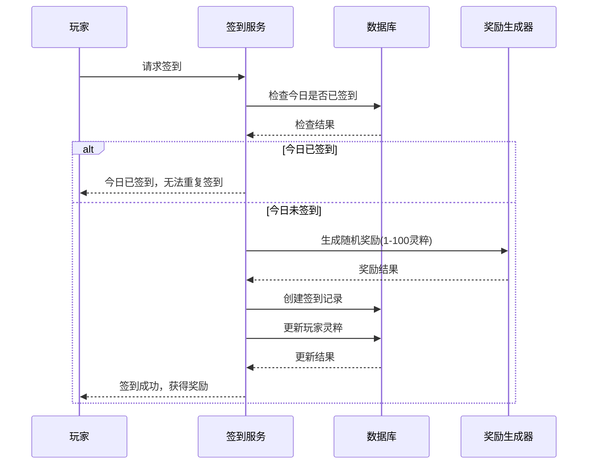
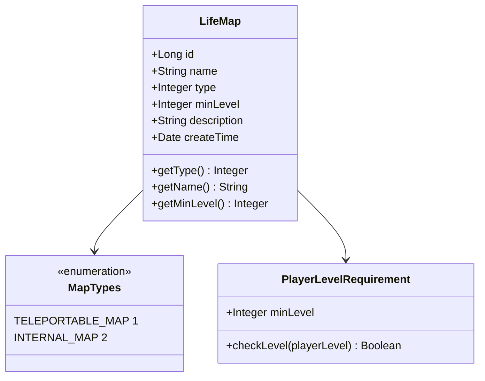
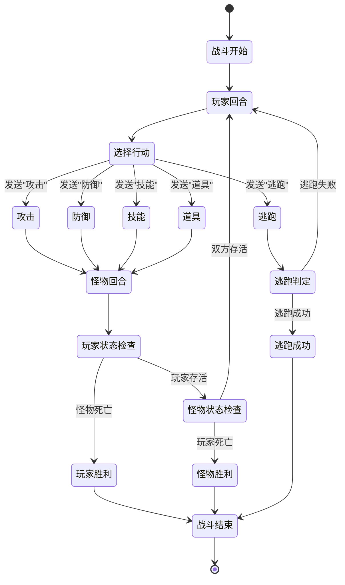
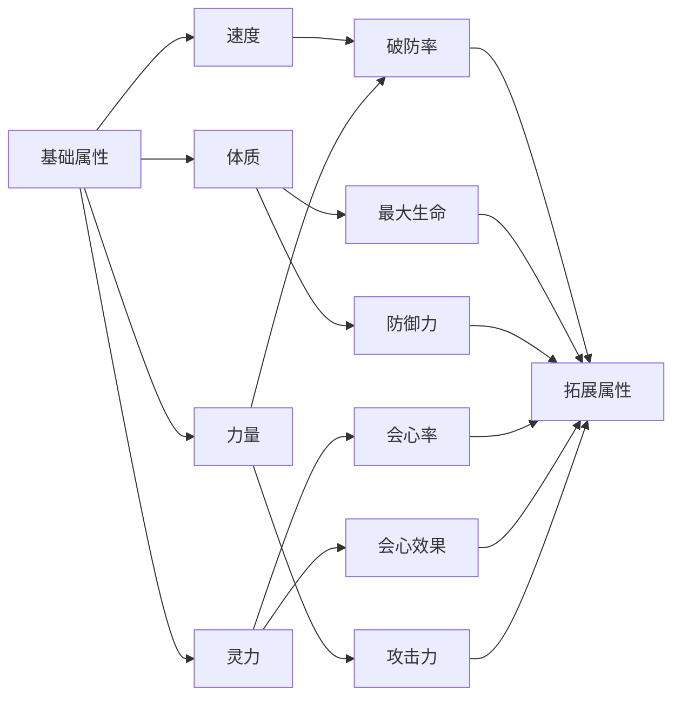
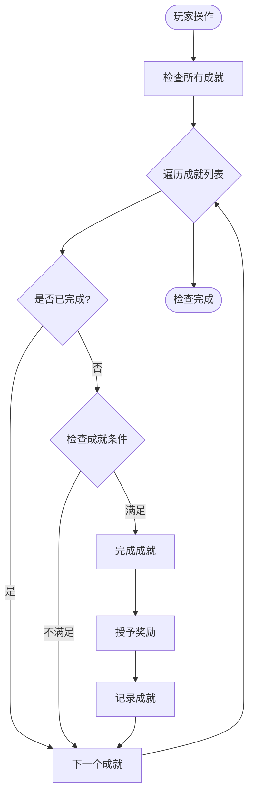

# 核心玩法系统

<cite>
**本文档引用的文件**
- [PlayerServiceImpl.java](file://Life/src/main/java/com/bot/life/service/impl/PlayerServiceImpl.java)
- [ExplorationServiceImpl.java](file://Life/src/main/java/com/bot/life/service/impl/ExplorationServiceImpl.java)
- [RealmServiceImpl.java](file://Life/src/main/java/com/bot/life/service/impl/RealmServiceImpl.java)
- [SigninServiceImpl.java](file://Life/src/main/java/com/bot/life/service/impl/SigninServiceImpl.java)
- [LifeHandlerImpl.java](file://Life/src/main/java/com/bot/life/service/impl/LifeHandlerImpl.java)
- [MapServiceImpl.java](file://Life/src/main/java/com/bot/life/service/impl/MapServiceImpl.java)
- [AchievementServiceImpl.java](file://Life/src/main/java/com/bot/life/service/impl/AchievementServiceImpl.java)
- [BattleService.java](file://Life/src/main/java/com/bot/life/service/BattleService.java)
- [LifePlayer.java](file://Life/src/main/java/com/bot/life/dao/entity/LifePlayer.java)
- [LifeRealmConfig.java](file://Life/src/main/java/com/bot/life/dao/entity/LifeRealmConfig.java)
- [LifeMap.java](file://Life/src/main/java/com/bot/life/dao/entity/LifeMap.java)
- [BattleContext.java](file://Life/src/main/java/com/bot/life/dto/BattleContext.java)
- [AchievementService.java](file://Life/src/main/java/com/bot/life/service/AchievementService.java)
- [MapService.java](file://Life/src/main/java/com/bot/life/service/MapService.java)
</cite>

## 目录
1. [引言](#引言)
2. [项目架构概览](#项目架构概览)
3. [角色创建系统](#角色创建系统)
4. [游历探索系统](#游历探索系统)
5. [境界突破系统](#境界突破系统)
6. [每日签到系统](#每日签到系统)
7. [地图与传送系统](#地图与传送系统)
8. [战斗系统](#战斗系统)
9. [成就系统](#成就系统)
10. [核心玩法优化建议](#核心玩法优化建议)
11. [总结](#总结)

## 引言

本文档详细分析了一个修仙主题的游戏核心玩法系统，涵盖了角色创建、游历探索、境界突破、每日签到等核心功能模块。该系统采用分层架构设计，包含数据访问层、业务逻辑层和服务层，为玩家提供了完整的修仙体验。

## 项目架构概览

系统采用三层架构设计，主要包含以下核心模块：

**图表来源**
- [LifeHandlerImpl.java](file://Life/src/main/java/com/bot/life/service/impl/LifeHandlerImpl.java#L1-L50)
- [PlayerServiceImpl.java](file://Life/src/main/java/com/bot/life/service/impl/PlayerServiceImpl.java#L1-L30)

## 角色创建系统

角色创建系统是玩家进入修仙世界的入口，包含昵称验证、派系选择和初始属性设置等功能。

### 角色创建流程

**图表来源**
- [LifeHandlerImpl.java](file://Life/src/main/java/com/bot/life/service/impl/LifeHandlerImpl.java#L337-L382)
- [PlayerServiceImpl.java](file://Life/src/main/java/com/bot/life/service/impl/PlayerServiceImpl.java#L42-L97)

### 初始属性设置逻辑

系统根据玩家选择的派系自动分配初始属性：

| 派系 | 攻击力 | 防御力 | 速度 | 体质 | 灵力 | 力量 |
|------|--------|--------|------|------|------|------|
| 金 | ★★★★★ | ★★ | 1 | 1 | 1 | 1 |
| 木 | ★★★ | ★★★★ | 1 | 1 | 1 | 1 |
| 水 | ★★★★ | ★★★★ | 1 | 1 | 1 | 1 |
| 火 | ★★★★ | ★★★ | 1 | 1 | 1 | 1 |
| 土 | ★★★ | ★★★★★ | 1 | 1 | 1 | 1 |

**节来源**
- [PlayerServiceImpl.java](file://Life/src/main/java/com/bot/life/service/impl/PlayerServiceImpl.java#L54-L85)

### 昵称验证机制

系统实施严格的昵称验证规则：
- 长度限制：最多7个字符
- 字符限制：仅支持中文字符
- 唯一性检查：防止昵称重复

**节来源**
- [LifeHandlerImpl.java](file://Life/src/main/java/com/bot/life/service/impl/LifeHandlerImpl.java#L346-L357)

## 游历探索系统

游历探索系统是游戏的核心玩法之一，包含随机事件生成、资源获取和风险收益平衡设计。

### 探索事件概率分布

**图表来源**
- [ExplorationServiceImpl.java](file://Life/src/main/java/com/bot/life/service/impl/ExplorationServiceImpl.java#L35-L59)

### 随机事件生成机制

系统采用概率算法生成随机事件：

| 事件类型 | 概率 | 内容描述 |
|----------|------|----------|
| 怪物遭遇 | 70% | 遇到地图对应的怪物，可选择战斗或逃跑 |
| 发现道具 | 15% | 发现随机道具，如修为丹、灵石等 |
| 遇见NPC | 10% | 遇到各种NPC，获得不同类型的奖励 |
| 特殊事件 | 5% | 奇遇、顿悟、灵泉等特殊事件 |

**节来源**
- [ExplorationServiceImpl.java](file://Life/src/main/java/com/bot/life/service/impl/ExplorationServiceImpl.java#L44-L59)

### 资源获取与风险平衡

系统设计了合理的风险收益平衡机制：

- **体力消耗**：每次探索消耗1点体力，防止过度探索
- **收益递减**：随着玩家等级提升，探索收益逐渐增加
- **风险控制**：怪物强度与玩家等级匹配，确保挑战性
- **奖励多样性**：提供修为、灵粹、道具等多种奖励形式

**节来源**
- [ExplorationServiceImpl.java](file://Life/src/main/java/com/bot/life/service/impl/ExplorationServiceImpl.java#L91-L100)

## 境界突破系统

境界突破系统是修仙游戏的核心成长机制，包含等级配置、突破条件和属性成长规则。

### 境界配置表

**图表来源**
- [LifeRealmConfig.java](file://Life/src/main/java/com/bot/life/dao/entity/LifeRealmConfig.java#L1-L24)

### 突破条件检查流程

**图表来源**
- [RealmServiceImpl.java](file://Life/src/main/java/com/bot/life/service/impl/RealmServiceImpl.java#L42-L119)

### 属性成长规则

每个境界突破都会带来相应的属性提升：

| 境界阶段 | 突破奖励 | 修为上限 | 成功率 |
|----------|----------|----------|--------|
| 练气期 | 无 | 5万 | 100% |
| 筑基期 | 全属性+5 | 20万 | 90% |
| 金丹期 | 全属性+10，灵力+15，修炼速度+20 | 80万 | 80% |
| 元婴期 | 全属性+20，修炼速度+50 | 300万 | 70% |
| 化神期 | 全属性+30，修炼速度+100 | 1000万 | 60% |
| 大乘期 | 全属性+50，修炼速度+200 | 5000万 | 50% |

**节来源**
- [RealmServiceImpl.java](file://Life/src/main/java/com/bot/life/service/impl/RealmServiceImpl.java#L193-L236)

### 突破成功率机制

系统采用随机算法确定突破成功率：
- 成功概率：根据境界配置的success_rate字段
- 失败后果：损失20%的突破所需修为
- 重试机制：失败后可再次尝试突破

**节来源**
- [RealmServiceImpl.java](file://Life/src/main/java/com/bot/life/service/impl/RealmServiceImpl.java#L66-L68)

## 每日签到系统

每日签到系统为玩家提供稳定的日常奖励，鼓励玩家持续登录游戏。

### 签到奖励机制

**图表来源**
- [SigninServiceImpl.java](file://Life/src/main/java/com/bot/life/service/impl/SigninServiceImpl.java#L32-L67)

### 连续签到策略

系统支持连续签到机制：
- 每日奖励：1-100灵粹随机奖励
- 连续签到：无连续签到奖励，但提供每日登录激励
- 时间检查：精确到天的签到时间检查

**节来源**
- [SigninServiceImpl.java](file://Life/src/main/java/com/bot/life/service/impl/SigninServiceImpl.java#L38-L41)

## 地图与传送系统

地图系统为玩家提供探索空间，支持多地图切换和境界限制。

### 地图类型与限制

**图表来源**
- [LifeMap.java](file://Life/src/main/java/com/bot/life/dao/entity/LifeMap.java#L1-L19)
- [MapServiceImpl.java](file://Life/src/main/java/com/bot/life/service/impl/MapServiceImpl.java#L36-L60)

### 传送机制

系统提供两种地图传送方式：
- **可传送地图**：玩家可以直接选择传送的目标地图
- **内置地图**：需要通过特定入口或NPC进入

**节来源**
- [MapServiceImpl.java](file://Life/src/main/java/com/bot/life/service/impl/MapServiceImpl.java#L36-L60)

## 战斗系统

战斗系统是游戏的核心交互机制，包含回合制战斗和多种战斗策略。

### 战斗流程

**图表来源**
- [BattleService.java](file://Life/src/main/java/com/bot/life/service/BattleService.java#L1-L46)
- [BattleContext.java](file://Life/src/main/java/com/bot/life/dto/BattleContext.java#L1-L54)

### 战斗属性计算

系统根据玩家的基础属性计算战斗属性：

**图表来源**
- [LifePlayer.java](file://Life/src/main/java/com/bot/life/dao/entity/LifePlayer.java#L56-L76)

**节来源**
- [LifePlayer.java](file://Life/src/main/java/com/bot/life/dao/entity/LifePlayer.java#L56-L76)

## 成就系统

成就系统为玩家提供明确的成长目标和奖励机制。

### 成就触发机制

**图表来源**
- [AchievementServiceImpl.java](file://Life/src/main/java/com/bot/life/service/impl/AchievementServiceImpl.java#L31-L51)

### 成就条件类型

系统支持多种成就触发条件：
- **属性达到**：如速度达到1000
- **等级达到**：如达到金丹境界
- **行为达成**：如完成特定任务

**节来源**
- [AchievementServiceImpl.java](file://Life/src/main/java/com/bot/life/service/impl/AchievementServiceImpl.java#L31-L51)

## 核心玩法优化建议

### 参数调整建议

1. **境界突破参数优化**
   - 调整突破成功率曲线，使前期更容易，后期更具挑战性
   - 增加突破失败的惩罚机制，如暂时降低属性
   - 引入突破加速道具，增加策略深度

2. **探索系统优化**
   - 增加稀有事件的概率权重
   - 引入探索buff系统，提升探索效率
   - 设计不同地图的特色事件

3. **战斗系统增强**
   - 实现技能树系统，增加战斗策略性
   - 引入元素相克机制
   - 增加宠物系统，丰富战斗体验

### 新增功能建议

1. **社交系统**
   - 好友系统：添加好友，互相帮助
   - 组队系统：多人协作挑战高难度内容
   - 排行榜系统：境界、修为、成就排行

2. **经济系统**
   - 交易系统：玩家间物品交易
   - 商店系统：购买修炼资源
   - 押金系统：参与特殊活动

3. **剧情系统**
   - 主线剧情：完整的修仙故事线
   - 支线任务：丰富的日常任务
   - 奇遇系统：随机触发的特殊事件

### 性能优化建议

1. **数据库优化**
   - 为常用查询添加索引
   - 实施数据分片策略
   - 使用缓存减少数据库压力

2. **内存优化**
   - 实施对象池管理
   - 优化序列化性能
   - 减少不必要的对象创建

3. **并发优化**
   - 使用异步处理非关键操作
   - 实施读写分离
   - 优化锁机制

## 总结

该修仙游戏核心玩法系统设计完整，涵盖了角色创建、游历探索、境界突破、每日签到等核心功能。系统采用模块化设计，具有良好的扩展性和维护性。通过合理的概率设计和奖励机制，能够有效激励玩家持续游戏。

系统的主要优势包括：
- 完整的角色成长体系
- 丰富的随机事件设计
- 平衡的风险收益机制
- 灵活的配置系统

未来可以通过引入更多社交元素、经济系统和剧情内容来进一步丰富游戏体验，同时通过性能优化提升系统的稳定性和响应速度。