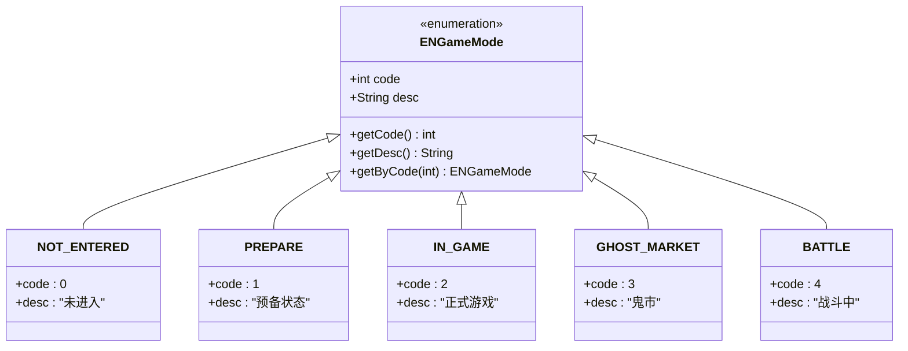
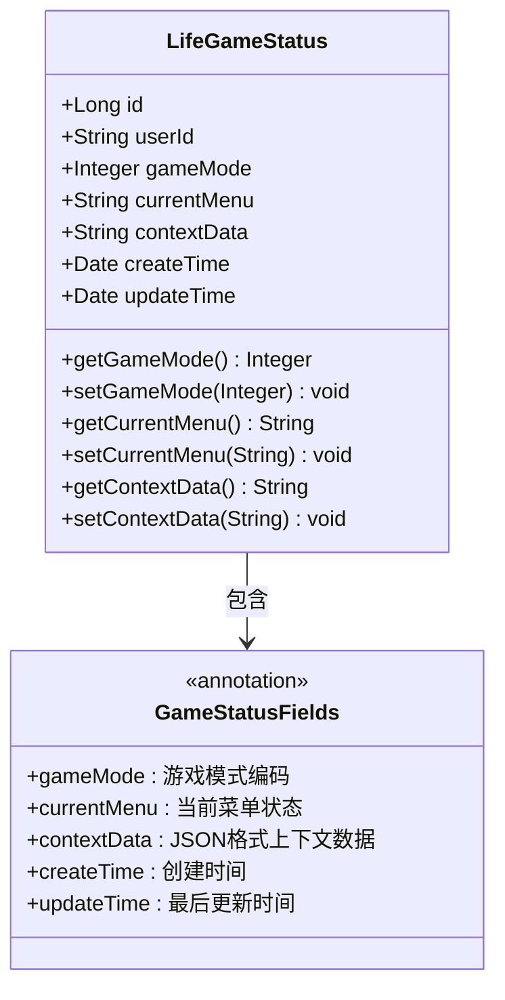
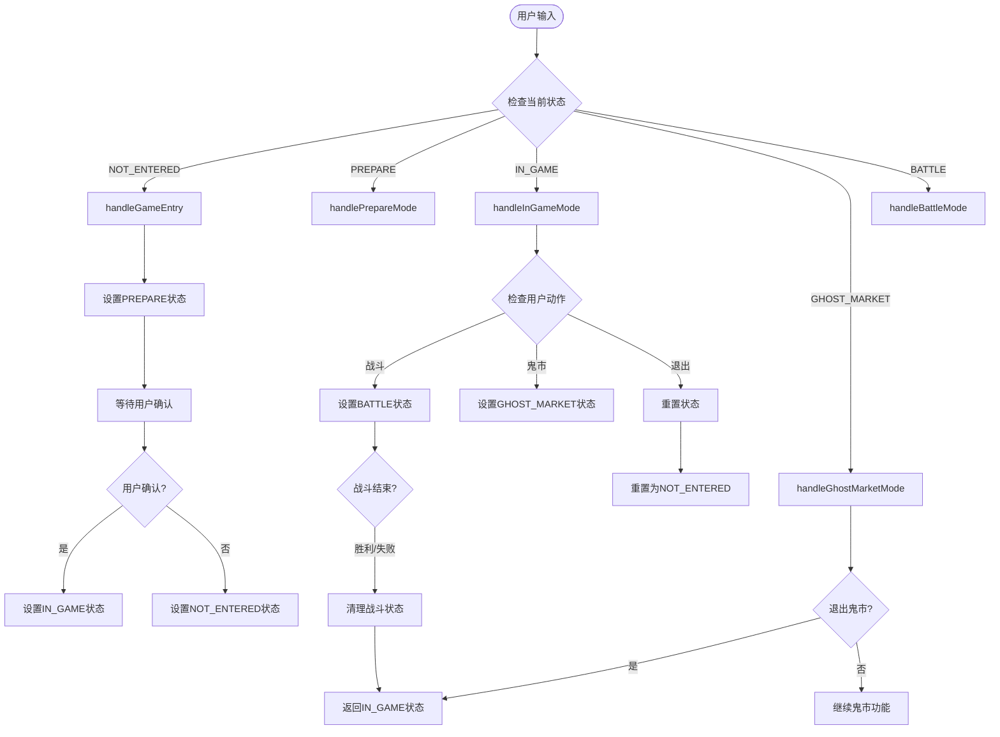
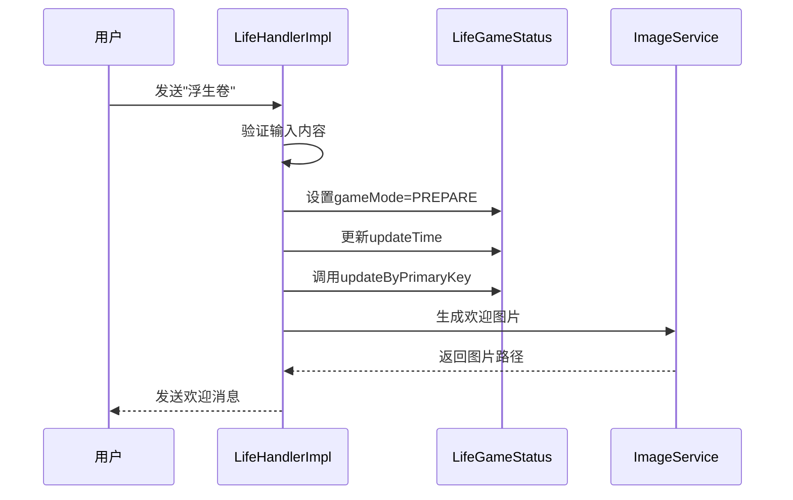
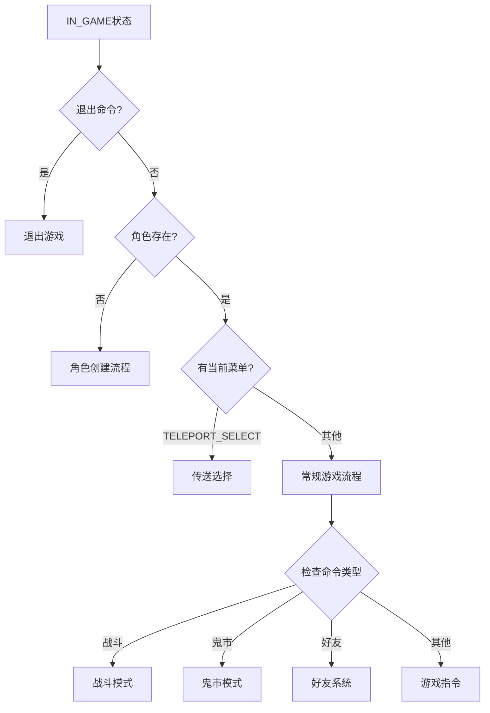
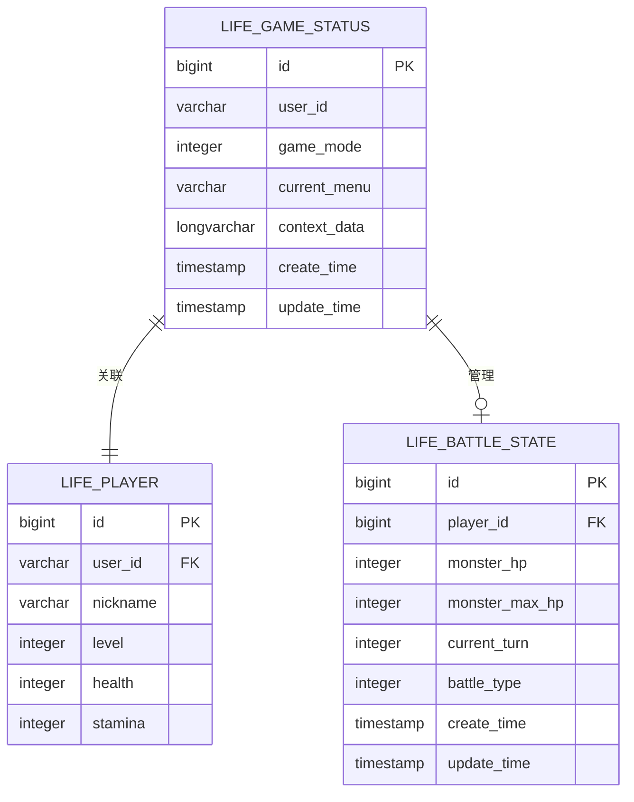
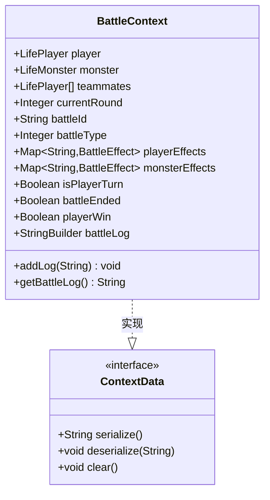
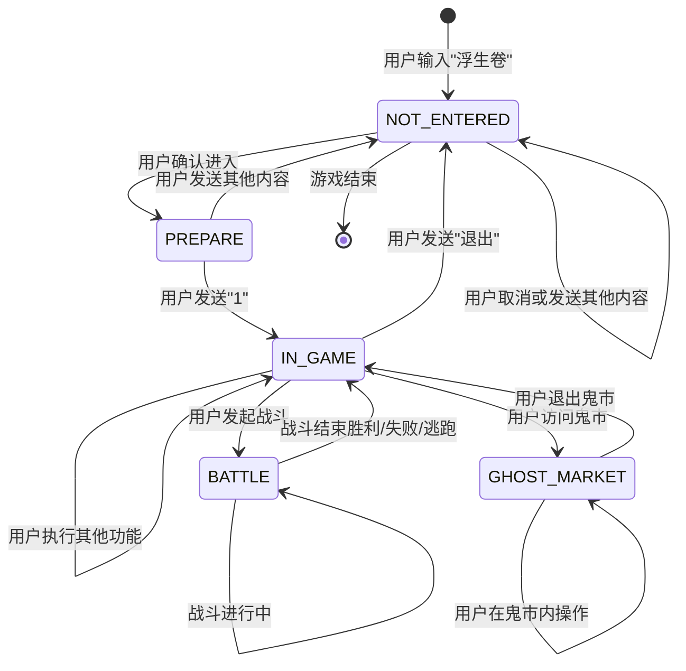

# 游戏状态管理

<cite>
**本文档引用的文件**
- [ENGameMode.java](file://Life/src/main/java/com/bot/life/enums/ENGameMode.java)
- [LifeGameStatus.java](file://Life/src/main/java/com/bot/life/dao/entity/LifeGameStatus.java)
- [LifeHandlerImpl.java](file://Life/src/main/java/com/bot/life/service/impl/LifeHandlerImpl.java)
- [LifeGameStatusMapper.java](file://Life/src/main/java/com/bot/life/dao/mapper/LifeGameStatusMapper.java)
- [LifeGameStatusMapper.xml](file://Life/src/main/resources/mapper/LifeGameStatusMapper.xml)
- [BattleContext.java](file://Life/src/main/java/com/bot/life/dto/BattleContext.java)
- [BattleServiceImpl.java](file://Life/src/main/java/com/bot/life/service/impl/BattleServiceImpl.java)
</cite>

## 目录
1. [概述](#概述)
2. [ENGameMode状态机设计](#engamemode状态机设计)
3. [LifeGameStatus实体结构](#lifegamestatus实体结构)
4. [状态转换机制](#状态转换机制)
5. [核心状态处理方法](#核心状态处理方法)
6. [状态持久化策略](#状态持久化策略)
7. [数据同步机制](#数据同步机制)
8. [状态转换图](#状态转换图)
9. [开发者指南](#开发者指南)
10. [故障排除](#故障排除)

## 概述

修仙游戏采用基于状态机的游戏状态管理模式，通过ENGameMode枚举定义了五个主要游戏状态：NOT_ENTERED（未进入）、PREPARE（预备状态）、IN_GAME（正式游戏）、GHOST_MARKET（鬼市）和BATTLE（战斗中）。系统通过LifeGameStatus实体维护每个用户的完整游戏状态，并实现了完善的状态持久化和数据同步机制。

## ENGameMode状态机设计

### 状态定义

ENGameMode枚举定义了游戏的五种核心状态：



**图表来源**
- [ENGameMode.java](file://Life/src/main/java/com/bot/life/enums/ENGameMode.java#L6-L37)

### 状态特性

| 状态 | 编码 | 描述 | 主要功能 |
|------|------|------|----------|
| NOT_ENTERED | 0 | 未进入 | 初始状态，等待用户输入"浮生卷" |
| PREPARE | 1 | 预备状态 | 等待用户确认进入游戏 |
| IN_GAME | 2 | 正式游戏 | 主游戏界面，支持所有功能 |
| GHOST_MARKET | 3 | 鬼市 | 商业交易界面 |
| BATTLE | 4 | 战斗中 | 战斗过程状态 |

**章节来源**
- [ENGameMode.java](file://Life/src/main/java/com/bot/life/enums/ENGameMode.java#L7-L11)

## LifeGameStatus实体结构

### 数据模型设计

LifeGameStatus实体是游戏状态管理的核心数据结构，包含以下关键字段：



**图表来源**
- [LifeGameStatus.java](file://Life/src/main/java/com/bot/life/dao/entity/LifeGameStatus.java#L11-L20)

### 字段详解

| 字段名 | 类型 | 描述 | 用途 |
|--------|------|------|------|
| id | Long | 主键标识 | 数据库唯一标识 |
| userId | String | 用户ID | 关联用户身份 |
| gameMode | Integer | 游戏模式 | 当前游戏状态编码 |
| currentMenu | String | 当前菜单 | 子功能菜单状态 |
| contextData | String | 上下文数据 | JSON格式的动态数据 |
| createTime | Date | 创建时间 | 数据创建时间戳 |
| updateTime | Date | 更新时间 | 数据最后修改时间 |

**章节来源**
- [LifeGameStatus.java](file://Life/src/main/java/com/bot/life/dao/entity/LifeGameStatus.java#L13-L19)

## 状态转换机制

### 转换流程

游戏状态转换遵循严格的流程控制，确保状态的一致性和数据完整性：



**图表来源**
- [LifeHandlerImpl.java](file://Life/src/main/java/com/bot/life/service/impl/LifeHandlerImpl.java#L147-L166)

### 转换条件

状态转换由以下条件触发：

1. **用户输入触发**：用户发送特定命令
2. **系统事件触发**：战斗结束、角色创建完成
3. **业务逻辑触发**：功能模块切换
4. **异常情况触发**：状态异常时的恢复机制

**章节来源**
- [LifeHandlerImpl.java](file://Life/src/main/java/com/bot/life/service/impl/LifeHandlerImpl.java#L173-L218)

## 核心状态处理方法

### handleGameEntry方法

处理游戏入口状态，引导用户进入游戏准备阶段：



**图表来源**
- [LifeHandlerImpl.java](file://Life/src/main/java/com/bot/life/service/impl/LifeHandlerImpl.java#L173-L194)

### handlePrepareMode方法

处理游戏准备状态，管理用户确认流程：

- **确认进入**：用户发送"1" → 设置IN_GAME状态
- **取消进入**：用户发送其他内容 → 设置NOT_ENTERED状态
- **状态验证**：检查角色是否存在，决定后续流程

### handleInGameMode方法

处理正式游戏状态，管理所有游戏功能：



**图表来源**
- [LifeHandlerImpl.java](file://Life/src/main/java/com/bot/life/service/impl/LifeHandlerImpl.java#L220-L314)

### handleBattle方法

处理战斗状态，管理战斗流程：

- **状态设置**：设置gameMode=BATTLE
- **战斗初始化**：创建BattleContext
- **战斗循环**：处理玩家和怪物回合
- **结果处理**：胜利、失败或逃跑

**章节来源**
- [LifeHandlerImpl.java](file://Life/src/main/java/com/bot/life/service/impl/LifeHandlerImpl.java#L1076-L1086)

## 状态持久化策略

### 数据库映射

状态数据通过MyBatis ORM框架持久化到数据库：



**图表来源**
- [LifeGameStatusMapper.xml](file://Life/src/main/resources/mapper/LifeGameStatusMapper.xml#L5-L13)

### 持久化操作

| 操作类型 | 方法 | 描述 | 触发时机 |
|----------|------|------|----------|
| 查询 | selectByUserId | 根据用户ID获取状态 | 每次状态检查 |
| 创建 | insert | 新建游戏状态记录 | 用户首次进入游戏 |
| 更新 | updateByPrimaryKey | 更新状态信息 | 状态变更时 |
| 删除 | deleteByPlayerId | 删除战斗状态 | 战斗结束后 |

**章节来源**
- [LifeGameStatusMapper.java](file://Life/src/main/java/com/bot/life/dao/mapper/LifeGameStatusMapper.java#L29-L34)

## 数据同步机制

### 上下文数据管理

系统使用contextData字段存储动态的、结构化的上下文信息：



**图表来源**
- [BattleContext.java](file://Life/src/main/java/com/bot/life/dto/BattleContext.java#L14-L54)

### 同步策略

1. **实时同步**：状态变更立即写入数据库
2. **事务保证**：使用数据库事务确保数据一致性
3. **缓存更新**：及时更新内存缓存
4. **异常恢复**：提供状态恢复机制

**章节来源**
- [LifeHandlerImpl.java](file://Life/src/main/java/com/bot/life/service/impl/LifeHandlerImpl.java#L831-L841)

## 状态转换图

### 完整状态转换图



### 转换路径说明

| 起始状态 | 目标状态 | 触发条件 | 数据变更 |
|----------|----------|----------|----------|
| NOT_ENTERED | PREPARE | 用户确认进入 | gameMode=1, updateTime |
| PREPARE | IN_GAME | 用户确认 | gameMode=2, 角色检查 |
| IN_GAME | BATTLE | 发起战斗 | gameMode=4, 战斗状态创建 |
| BATTLE | IN_GAME | 战斗结束 | gameMode=2, 战斗状态清理 |
| IN_GAME | GHOST_MARKET | 访问鬼市 | gameMode=3, 地图位置更新 |
| GHOST_MARKET | IN_GAME | 退出鬼市 | gameMode=2, 地图位置恢复 |

## 开发者指南

### 安全的状态变更

1. **状态验证**：每次状态变更前验证当前状态
2. **事务处理**：使用数据库事务确保原子性
3. **异常处理**：提供完善的异常处理机制
4. **状态回滚**：实现状态回滚功能

### 扩展新游戏模式

添加新的游戏模式步骤：

1. **枚举扩展**：在ENGameMode中添加新状态
2. **处理方法**：实现对应的处理方法
3. **状态转换**：添加状态转换逻辑
4. **测试验证**：编写单元测试

### 状态异常处理

```java
// 示例：状态异常处理
private String handleStateException(String userId, ENGameMode currentMode) {
    try {
        // 尝试恢复状态
        LifeGameStatus gameStatus = getOrCreateGameStatus(userId);
        gameStatus.setGameMode(ENGameMode.NOT_ENTERED.getCode());
        gameStatusMapper.updateByPrimaryKey(gameStatus);
        return "游戏状态异常，已自动恢复";
    } catch (Exception e) {
        logger.error("状态恢复失败", e);
        return "游戏状态异常，请重新进入";
    }
}
```

### 最佳实践

1. **单一职责**：每个状态处理方法只负责一种状态
2. **状态隔离**：避免不同状态之间的直接依赖
3. **数据一致性**：确保状态变更的原子性
4. **性能优化**：合理使用缓存减少数据库访问

## 故障排除

### 常见问题

| 问题类型 | 症状 | 可能原因 | 解决方案 |
|----------|------|----------|----------|
| 状态丢失 | 用户状态重置 | 数据库连接异常 | 检查数据库连接，重启服务 |
| 状态冲突 | 并发状态异常 | 多线程并发访问 | 使用锁机制或乐观锁 |
| 数据不一致 | 状态与实际不符 | 异常中断导致 | 实现状态校验和恢复机制 |
| 性能问题 | 状态切换缓慢 | 数据库查询慢 | 优化查询，增加索引 |

### 调试技巧

1. **日志记录**：详细记录状态变更日志
2. **状态监控**：监控状态转换频率和时长
3. **数据验证**：定期验证状态数据完整性
4. **异常捕获**：捕获并记录状态异常

### 维护建议

1. **定期备份**：定期备份游戏状态数据
2. **性能监控**：监控状态管理的性能指标
3. **版本兼容**：确保状态数据的版本兼容性
4. **容量规划**：根据用户增长规划存储容量

**章节来源**
- [LifeHandlerImpl.java](file://Life/src/main/java/com/bot/life/service/impl/LifeHandlerImpl.java#L1738-L1759)