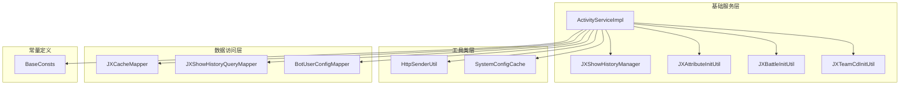
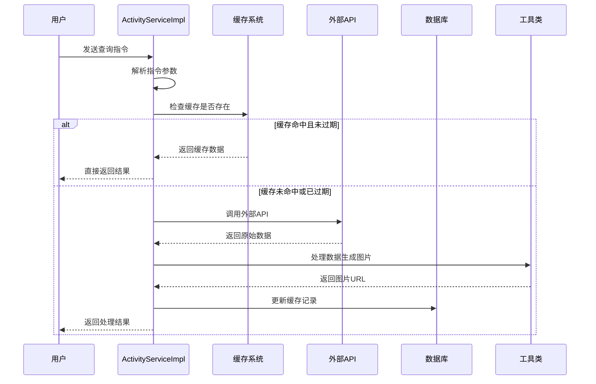
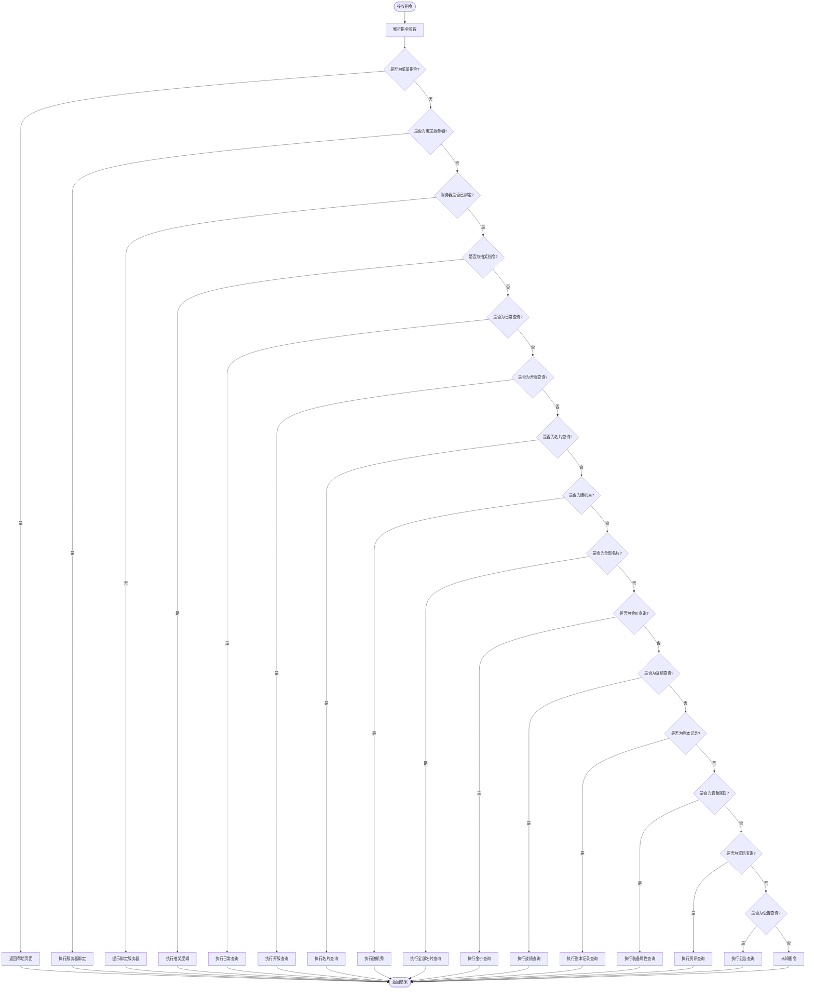
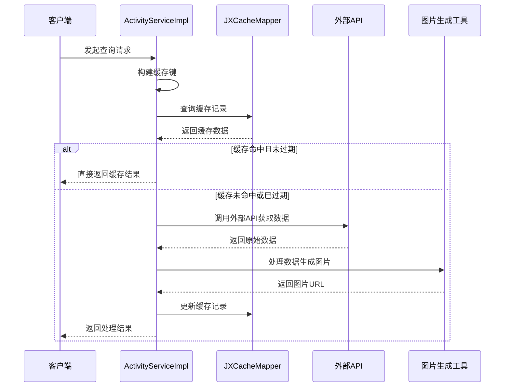
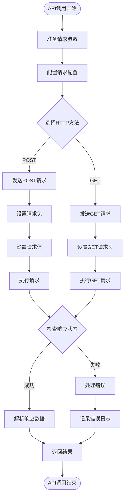
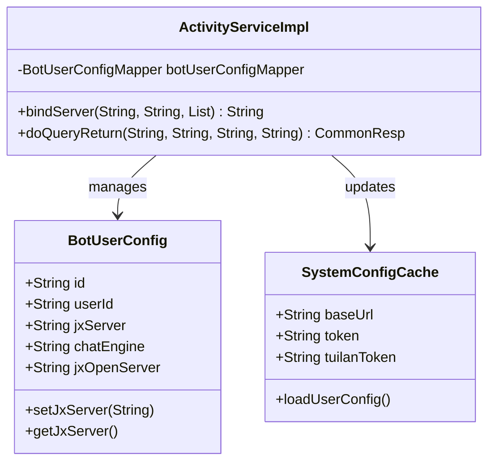
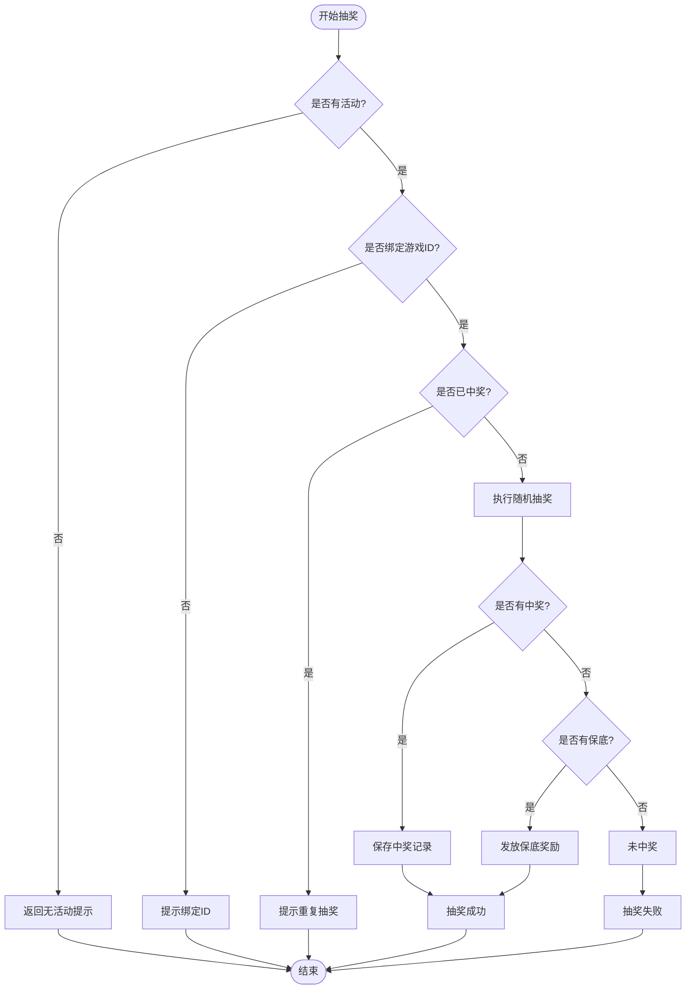
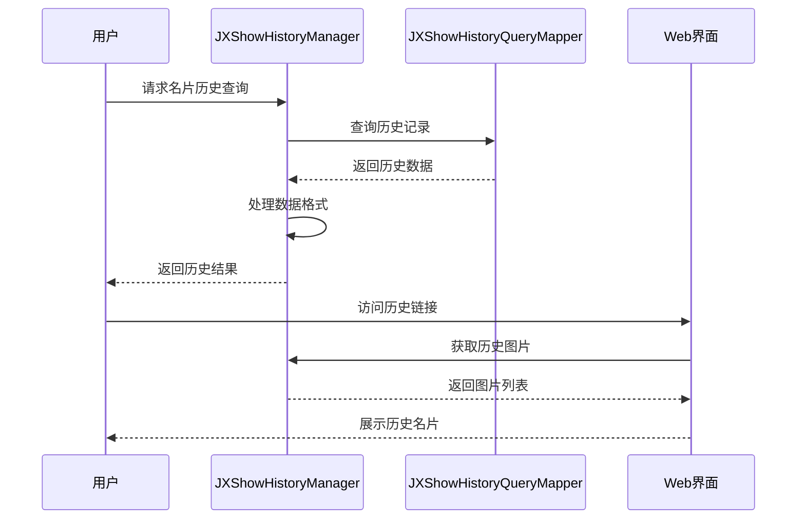
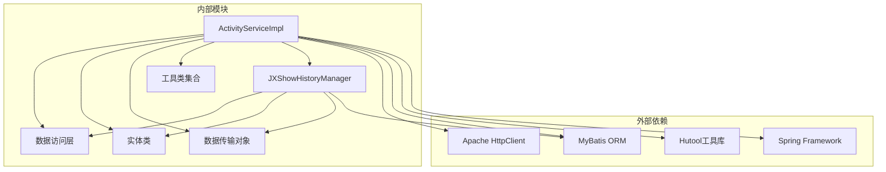
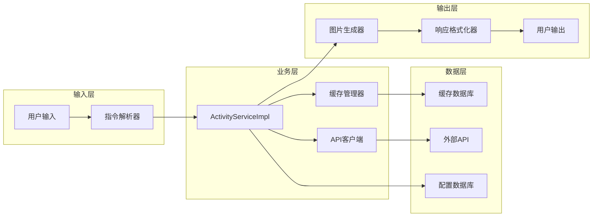

# 基础服务处理

<cite>
**本文档引用的文件**
- [ActivityServiceImpl.java](file://Base/src/main/java/com/bot/base/service/impl/ActivityServiceImpl.java)
- [JXShowHistoryManager.java](file://Base/src/main/java/com/bot/base/service/impl/JXShowHistoryManager.java)
- [JXAttributeInitUtil.java](file://Base/src/main/java/com/bot/base/util/JXAttributeInitUtil.java)
- [JXBattleInitUtil.java](file://Base/src/main/java/com/bot/base/util/JXBattleInitUtil.java)
- [JXTeamCdInitUtil.java](file://Base/src/main/java/com/bot/base/util/JXTeamCdInitUtil.java)
- [SystemConfigCache.java](file://Common/src/main/java/com/bot/common/config/SystemConfigCache.java)
- [HttpSenderUtil.java](file://Common/src/main/java/com/bot/common/util/HttpSenderUtil.java)
- [BaseConsts.java](file://Common/src/main/java/com/bot/common/constant/BaseConsts.java)
- [JXCache.java](file://Game/src/main/java/com/bot/game/dao/entity/JXCache.java)
- [JXShowHistoryQuery.java](file://Game/src/main/java/com\bot\game\dao\entity\JXShowHistoryQuery.java)
</cite>

## 目录
1. [简介](#简介)
2. [项目结构](#项目结构)
3. [核心组件](#核心组件)
4. [架构概览](#架构概览)
5. [详细组件分析](#详细组件分析)
6. [依赖关系分析](#依赖关系分析)
7. [性能考虑](#性能考虑)
8. [故障排除指南](#故障排除指南)
9. [结论](#结论)

## 简介

ActivityServiceImpl是剑网3机器人项目中的核心业务处理服务，负责处理所有与剑三相关的查询指令。该服务实现了复杂的指令路由机制、智能缓存策略和外部API集成，为用户提供名片秀、装备属性、战绩查询、副本记录等丰富的功能。

该服务采用模块化设计，支持多种查询类型，包括但不限于：
- 名片秀查询（QQ秀、随机秀、全部名片）
- 装备属性分析
- 战绩查询
- 副本记录追踪
- 金价查询
- 日常活动查询
- 抽奖活动管理

## 项目结构



**图表来源**
- [ActivityServiceImpl.java](file://Base/src/main/java/com/bot/base/service/impl/ActivityServiceImpl.java#L40-L85)
- [JXShowHistoryManager.java](file://Base/src/main/java/com/bot/base/service/impl/JXShowHistoryManager.java#L15-L39)

**章节来源**
- [ActivityServiceImpl.java](file://Base/src/main/java/com/bot/base/service/impl/ActivityServiceImpl.java#L1-L50)

## 核心组件

### ActivityServiceImpl - 主要业务处理器

ActivityServiceImpl是整个基础服务的核心，实现了BaseService接口，提供了统一的指令处理入口。该服务的主要特点包括：

- **指令路由机制**：通过doQueryReturn方法实现精确的指令分发
- **智能缓存策略**：根据不同查询类型的特性设置不同的缓存过期时间
- **外部API集成**：与剑网3官方API进行数据交互
- **用户配置管理**：支持服务器绑定、抽奖ID绑定等功能

### 缓存管理系统

系统实现了基于JXCache的数据缓存机制，支持多种缓存类型：

- **SHOW**：名片秀缓存（10分钟过期）
- **ATTRIBUTE**：装备属性缓存（30分钟过期）
- **BATTLE**：战绩缓存（1小时过期）
- **TEAM_CD**：副本记录缓存（30分钟过期）
- **MONEY**：金价缓存（12小时过期）
- **NEWS**：资讯缓存（2小时过期）
- **NOTICE**：公告缓存（2小时过期）
- **OPEN_SERVER**：开服状态缓存（2分钟过期）

### 图片生成工具链

系统集成了三个专门的图片生成工具：

- **JXAttributeInitUtil**：装备属性图片生成器
- **JXBattleInitUtil**：战绩图片生成器  
- **JXTeamCdInitUtil**：副本记录图片生成器

这些工具负责将JSON数据转换为美观的图片格式，提升用户体验。

**章节来源**
- [ActivityServiceImpl.java](file://Base/src/main/java/com/bot/base/service/impl/ActivityServiceImpl.java#L85-L214)
- [JXCache.java](file://Game/src/main/java/com/bot/game/dao/entity/JXCache.java#L48-L238)

## 架构概览



**图表来源**
- [ActivityServiceImpl.java](file://Base/src/main/java/com/bot/base/service/impl/ActivityServiceImpl.java#L85-L214)
- [HttpSenderUtil.java](file://Common/src/main/java/com/bot/common/util/HttpSenderUtil.java#L45-L367)

## 详细组件分析

### doQueryReturn指令路由机制

doQueryReturn方法是整个服务的指令分发中心，实现了精确的指令识别和路由：



**图表来源**
- [ActivityServiceImpl.java](file://Base/src/main/java/com/bot/base/service/impl/ActivityServiceImpl.java#L85-L214)

### 缓存策略详解

系统实现了精细化的缓存策略，根据数据的时效性和更新频率设置不同的缓存过期时间：

#### 缓存类型与过期时间表

| 缓存类型 | 过期时间 | 适用场景 | 查询频率 |
|---------|---------|---------|---------|
| SHOW | 10分钟 | 名片秀查询 | 高频 |
| ATTRIBUTE | 30分钟 | 装备属性查询 | 中频 |
| BATTLE | 1小时 | 战绩查询 | 中频 |
| TEAM_CD | 30分钟 | 副本记录查询 | 中频 |
| MONEY | 12小时 | 金价查询 | 低频 |
| NEWS | 2小时 | 资讯查询 | 低频 |
| NOTICE | 2小时 | 公告查询 | 低频 |
| OPEN_SERVER | 2分钟 | 开服状态查询 | 高频 |

#### 缓存查询流程



**图表来源**
- [ActivityServiceImpl.java](file://Base/src/main/java/com/bot/base/service/impl/ActivityServiceImpl.java#L249-L384)

### 外部API集成机制

系统通过HttpSenderUtil类与剑网3官方API进行集成，支持多种HTTP请求方式：

#### API调用流程



**图表来源**
- [HttpSenderUtil.java](file://Common/src/main/java/com/bot/common/util/HttpSenderUtil.java#L45-L367)

### 用户配置管理系统

系统实现了完善的用户配置管理功能，支持以下特性：

#### 服务器绑定机制



**图表来源**
- [ActivityServiceImpl.java](file://Base/src/main/java/com/bot/base/service/impl/ActivityServiceImpl.java#L586-L600)
- [SystemConfigCache.java](file://Common/src/main/java/com/bot/common/config/SystemConfigCache.java#L1-L116)

### 抽奖活动系统

系统实现了完整的抽奖活动管理功能，支持动态配置奖品和中奖概率：

#### 抽奖逻辑流程



**图表来源**
- [ActivityServiceImpl.java](file://Base/src/main/java/com/bot/base/service/impl/ActivityServiceImpl.java#L661-L711)

### 名片秀历史管理系统

JXShowHistoryManager负责管理名片秀的历史查询记录，支持批量查询和结果展示：

#### 名片秀查询流程



**图表来源**
- [JXShowHistoryManager.java](file://Base/src/main/java/com/bot/base/service/impl/JXShowHistoryManager.java#L21-L39)

**章节来源**
- [ActivityServiceImpl.java](file://Base/src/main/java/com/bot/base/service/impl/ActivityServiceImpl.java#L85-L748)
- [JXShowHistoryManager.java](file://Base/src/main/java/com/bot/base/service/impl/JXShowHistoryManager.java#L15-L39)

## 依赖关系分析

### 核心依赖关系图



**图表来源**
- [ActivityServiceImpl.java](file://Base/src/main/java/com/bot/base/service/impl/ActivityServiceImpl.java#L1-L40)
- [JXShowHistoryManager.java](file://Base/src/main/java/com/bot/base/service/impl/JXShowHistoryManager.java#L1-L16)

### 数据流分析

系统中的数据流遵循清晰的层次结构：

#### 查询数据流



**图表来源**
- [ActivityServiceImpl.java](file://Base/src/main/java/com/bot/base/service/impl/ActivityServiceImpl.java#L85-L214)

**章节来源**
- [ActivityServiceImpl.java](file://Base/src/main/java/com/bot/base/service/impl/ActivityServiceImpl.java#L40-L85)

## 性能考虑

### 缓存优化策略

系统采用了多层次的缓存优化策略：

1. **内存缓存**：SystemConfigCache提供全局配置缓存
2. **数据库缓存**：JXCache表存储查询结果
3. **文件缓存**：生成的图片存储在本地文件系统
4. **API缓存**：合理设置不同API的缓存过期时间

### 并发处理

系统通过以下机制确保并发安全性：

- **CopyOnWriteArrayList**：用于抽奖活动奖品列表的线程安全
- **同步方法**：抽奖逻辑使用synchronized关键字保护
- **乐观锁**：数据库操作使用乐观锁防止并发冲突

### 异步处理

对于耗时的操作，系统采用了异步处理机制：

- **图片生成**：使用独立的工具类进行图片处理
- **API调用**：通过HttpSenderUtil进行异步HTTP请求
- **缓存更新**：异步更新缓存记录

## 故障排除指南

### 常见问题及解决方案

#### 1. 缓存失效问题

**症状**：查询结果频繁从外部API获取，缓存未生效
**原因**：缓存键生成规则不一致或缓存过期时间设置不当
**解决方案**：
- 检查缓存键的生成逻辑
- 调整缓存过期时间配置
- 验证缓存数据的序列化和反序列化

#### 2. 外部API调用失败

**症状**：系统返回"获取失败，请联系管理员检查"
**原因**：网络连接问题、API接口变更、认证令牌过期
**解决方案**：
- 检查网络连接状态
- 验证API接口地址和参数
- 更新认证令牌配置
- 查看系统日志获取详细错误信息

#### 3. 图片生成失败

**症状**：装备属性、战绩等查询返回文本而非图片
**原因**：图片生成工具异常、模板文件缺失、权限问题
**解决方案**：
- 检查图片生成工具的日志
- 验证模板文件路径和权限
- 确认临时文件目录的写入权限
- 重新部署图片生成模板

#### 4. 抽奖活动异常

**症状**：抽奖功能无法正常工作或中奖概率异常
**原因**：奖品配置错误、概率计算异常、并发问题
**解决方案**：
- 检查奖品配置数据
- 验证概率计算逻辑
- 确认抽奖活动状态
- 检查并发控制机制

### 调试技巧

#### 启用详细日志

```java
// 在application.properties中启用详细日志
logging.level.com.bot.base=DEBUG
logging.level.com.bot.common=DEBUG
```

#### 缓存调试

```java
// 检查缓存状态
JXCacheExample example = new JXCacheExample();
example.createCriteria().andCacheKeyEqualTo(cacheKey);
List<JXCache> cacheList = jxCacheMapper.selectByExample(example);
log.debug("缓存记录数量: {}", cacheList.size());
```

#### API调用调试

```java
// 添加API调用日志
long startTime = System.currentTimeMillis();
String response = HttpSenderUtil.postJsonData(apiUrl, jsonParams);
long duration = System.currentTimeMillis() - startTime;
log.debug("API调用耗时: {}ms, 响应长度: {}字节", duration, response.length());
```

**章节来源**
- [ActivityServiceImpl.java](file://Base/src/main/java/com/bot/base/service/impl/ActivityServiceImpl.java#L294-L298)
- [HttpSenderUtil.java](file://Common/src/main/java/com/bot/common/util/HttpSenderUtil.java#L45-L367)

## 结论

ActivityServiceImpl作为剑网3机器人项目的核心业务处理服务，展现了优秀的架构设计和实现质量。该服务通过以下关键特性为用户提供了优质的体验：

### 主要优势

1. **模块化设计**：清晰的职责分离，便于维护和扩展
2. **智能缓存**：精细化的缓存策略，显著提升系统性能
3. **灵活的指令路由**：支持多种查询类型和参数组合
4. **完善的异常处理**：全面的错误捕获和用户友好的错误提示
5. **可扩展性**：良好的接口设计，便于添加新的查询功能

### 技术亮点

- **多层缓存架构**：结合内存、数据库和文件系统的缓存策略
- **异步处理机制**：提高系统响应速度和并发处理能力
- **图片生成技术**：专业的图片处理工具，提升用户体验
- **配置驱动**：灵活的配置管理，支持动态调整系统行为

### 改进建议

1. **监控指标**：增加系统性能监控和告警机制
2. **测试覆盖**：完善单元测试和集成测试
3. **文档完善**：补充详细的API文档和使用指南
4. **安全加固**：加强输入验证和访问控制

该服务为剑网3机器人项目奠定了坚实的技术基础，其设计理念和实现方式值得在类似项目中借鉴和应用。