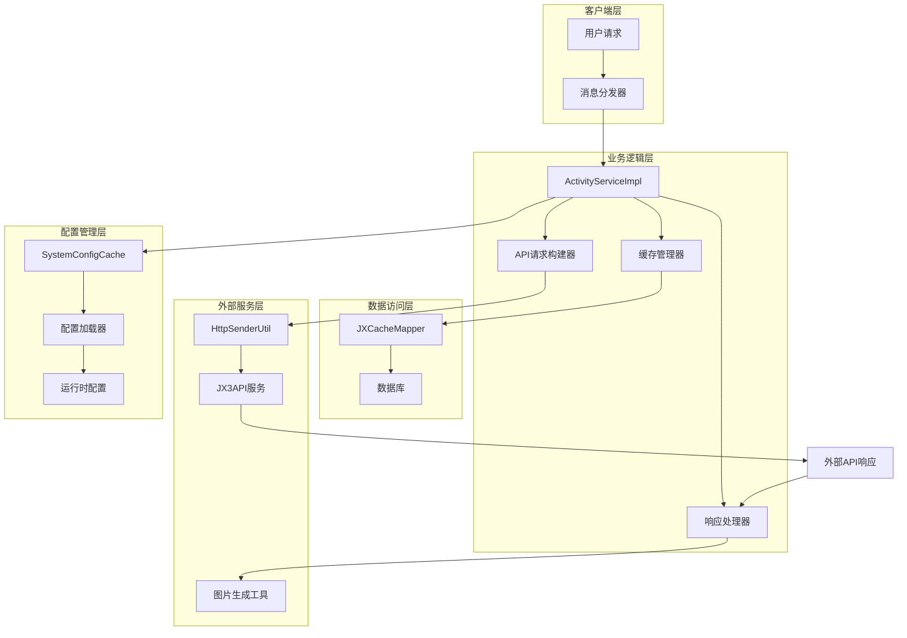
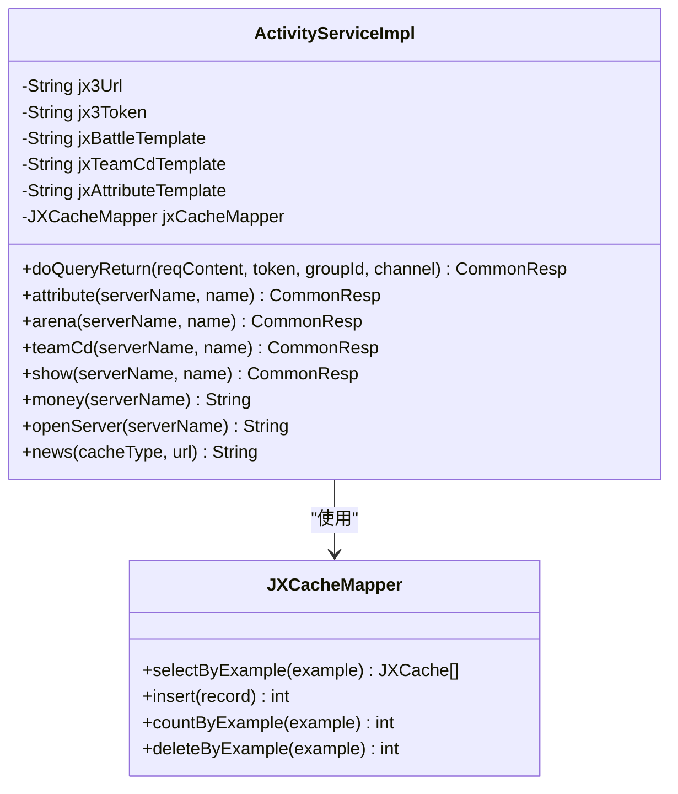
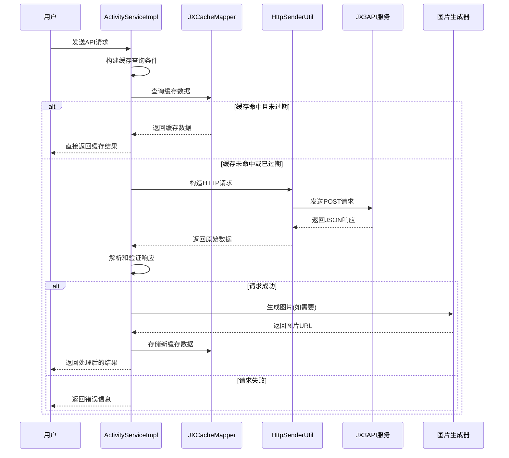
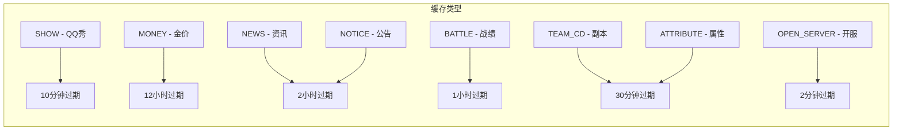
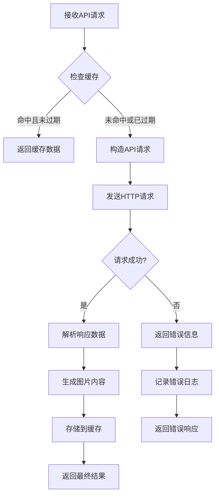
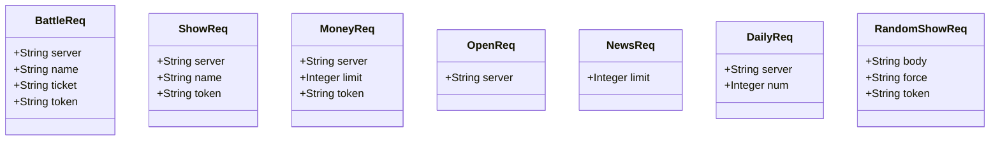
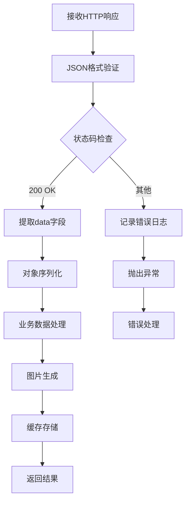
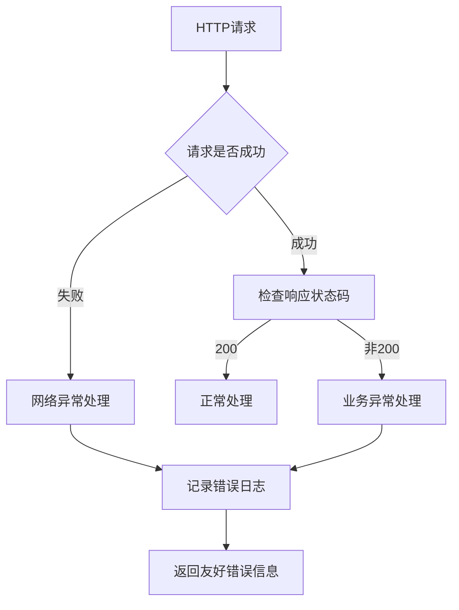

# 外部API集成详细文档

<cite>
**本文档引用的文件**
- [ActivityServiceImpl.java](file://Base/src/main/java/com/bot/base/service/impl/ActivityServiceImpl.java)
- [JXCacheMapper.java](file://Game/src/main/java/com/bot/game/dao/mapper/JXCacheMapper.java)
- [JXCache.java](file://Game/src/main/java/com/bot/game/dao/entity/JXCache.java)
- [ENJXCacheType.java](file://Common/src/main/java/com/bot/common/enums/ENJXCacheType.java)
- [HttpSenderUtil.java](file://Common/src/main/java/com/bot/common/util/HttpSenderUtil.java)
- [SystemConfigCache.java](file://Common/src/main/java/com/bot/common/config/SystemConfigCache.java)
- [JXAttributeInitUtil.java](file://Base/src/main/java/com/bot/base/util/JXAttributeInitUtil.java)
- [JXBattleInitUtil.java](file://Base/src/main/java/com/bot/base/util/JXBattleInitUtil.java)
- [application.properties](file://Boot/src/main/resources/application.properties)
</cite>

## 目录
1. [概述](#概述)
2. [系统架构](#系统架构)
3. [核心组件分析](#核心组件分析)
4. [API集成实现](#api集成实现)
5. [缓存策略详解](#缓存策略详解)
6. [请求构造与响应处理](#请求构造与响应处理)
7. [错误处理机制](#错误处理机制)
8. [性能优化建议](#性能优化建议)
9. [扩展指南](#扩展指南)
10. [故障排除](#故障排除)

## 概述

本文档详细描述了Bot项目中ActivityServiceImpl对剑三相关API的集成实现。该系统通过统一的外部API接口，实现了对剑网3游戏数据的获取、处理和展示，包括名片秀、装备属性、战绩、副本记录、金价、开服状态等多个功能模块。

### 主要特性

- **多API集成**：支持多个剑三API端点的数据获取
- **智能缓存**：基于不同业务需求的差异化缓存策略
- **统一错误处理**：标准化的异常捕获和错误响应
- **动态配置**：支持运行时配置外部服务连接参数
- **图片生成**：将API数据转换为美观的图片展示

## 系统架构



**架构图来源**
- [ActivityServiceImpl.java](file://Base/src/main/java/com/bot/base/service/impl/ActivityServiceImpl.java#L40-L80)
- [HttpSenderUtil.java](file://Common/src/main/java/com/bot/common/util/HttpSenderUtil.java#L44-L62)

## 核心组件分析

### ActivityServiceImpl - 核心业务服务

ActivityServiceImpl是外部API集成的核心控制器，负责协调所有剑三相关功能的调用。

#### 主要职责

1. **请求路由**：根据用户输入路由到相应的API处理方法
2. **参数验证**：验证服务器名称和角色名称的有效性
3. **缓存管理**：协调缓存的读取、存储和过期检查
4. **错误处理**：统一的异常捕获和错误响应机制

#### 关键配置注入



**类图来源**
- [ActivityServiceImpl.java](file://Base/src/main/java/com/bot/base/service/impl/ActivityServiceImpl.java#L42-L80)
- [JXCacheMapper.java](file://Game/src/main/java/com/bot/game/dao/mapper/JXCacheMapper.java#L9-L65)

**节来源**
- [ActivityServiceImpl.java](file://Base/src/main/java/com/bot/base/service/impl/ActivityServiceImpl.java#L40-L80)

### JXCacheMapper - 数据缓存接口

JXCacheMapper提供了对缓存数据的数据库操作接口，支持缓存的增删改查操作。

#### 缓存实体结构

| 字段名 | 类型 | 描述 | 约束 |
|--------|------|------|------|
| id | VARCHAR | 缓存记录唯一标识 | 主键 |
| cache_type | VARCHAR | 缓存类型标识 | 非空 |
| cache_key | VARCHAR | 缓存键值 | 非空 |
| content | VARCHAR | 缓存内容 | 非空 |
| save_date | VARCHAR | 保存时间 | 非空 |

**节来源**
- [JXCache.java](file://Game/src/main/java/com/bot/game/dao/entity/JXCache.java#L6-L52)
- [JXCacheMapper.java](file://Game/src/main/java/com/bot/game/dao/mapper/JXCacheMapper.java#L9-L65)

## API集成实现

### 支持的API端点

系统集成了以下剑三API端点：

| API端点 | 功能描述 | 请求参数 | 响应格式 |
|---------|----------|----------|----------|
| `/show/card` | 获取角色名片秀 | server, name, token | JSON |
| `/role/attribute` | 获取角色装备属性 | server, name, ticket, token | JSON |
| `/arena/recent` | 获取最近战绩 | server, name, ticket, token | JSON |
| `/role/teamCdList` | 获取副本记录 | server, name, ticket, token | JSON |
| `/trade/demon` | 获取金价信息 | server, limit, token | JSON |
| `/server/check` | 获取开服状态 | server | JSON |
| `/active/calendar` | 获取日常任务 | server, num | JSON |
| `/news/allnews` | 获取资讯公告 | limit | JSON |

### API调用时序图



**时序图来源**
- [ActivityServiceImpl.java](file://Base/src/main/java/com/bot/base/service/impl/ActivityServiceImpl.java#L249-L298)
- [HttpSenderUtil.java](file://Common/src/main/java/com/bot/common/util/HttpSenderUtil.java#L168-L205)

**节来源**
- [ActivityServiceImpl.java](file://Base/src/main/java/com/bot/base/service/impl/ActivityServiceImpl.java#L249-L298)

## 缓存策略详解

### 缓存类型定义

系统定义了多种缓存类型，每种类型对应不同的业务场景和过期策略：



**图表来源**
- [ENJXCacheType.java](file://Common/src/main/java/com/bot/common/enums/ENJXCacheType.java#L8-L17)

### 缓存过期时间策略

| 缓存类型 | 过期时间 | 适用场景 | 优化策略 |
|----------|----------|----------|----------|
| SHOW | 10分钟 | 角色外观变化频繁 | 快速更新，保证实时性 |
| ATTRIBUTE | 30分钟 | 装备属性相对稳定 | 平衡时效性和性能 |
| TEAM_CD | 30分钟 | 副本挑战频率较低 | 减少API调用频率 |
| BATTLE | 1小时 | 战绩更新较慢 | 降低服务器压力 |
| MONEY | 12小时 | 金价波动较小 | 最大化缓存命中率 |
| NEWS/NOTICE | 2小时 | 游戏资讯更新周期长 | 长期缓存，减少网络开销 |
| OPEN_SERVER | 2分钟 | 开服状态实时性强 | 最短过期时间，确保准确性 |

### 缓存命中率优化



**流程图来源**
- [ActivityServiceImpl.java](file://Base/src/main/java/com/bot/base/service/impl/ActivityServiceImpl.java#L250-L298)

**节来源**
- [ENJXCacheType.java](file://Common/src/main/java/com/bot/common/enums/ENJXCacheType.java#L8-L17)
- [ActivityServiceImpl.java](file://Base/src/main/java/com/bot/base/service/impl/ActivityServiceImpl.java#L250-L298)

## 请求构造与响应处理

### HTTP请求构建

系统使用HttpSenderUtil工具类统一管理HTTP请求的构造和发送：

#### 请求头配置

| Header | 值 | 用途 |
|--------|-----|------|
| Content-Type | application/json | 指定请求体格式 |
| Authorization | Bearer {token} | API认证授权 |

#### 请求参数封装

不同API端点使用专门的请求类进行参数封装：



**类图来源**
- [BattleReq.java](file://Base/src/main/java/com/bot/base/dto/jx/BattleReq.java#L10-L20)
- [ShowReq.java](file://Base/src/main/java/com/bot/base/dto/jx/ShowReq.java#L10-L17)
- [MoneyReq.java](file://Base/src/main/java/com/bot/base/dto/jx/MoneyReq.java#L8-L15)

### 响应解析流程



**流程图来源**
- [ActivityServiceImpl.java](file://Base/src/main/java/com/bot/base/service/impl/ActivityServiceImpl.java#L264-L271)

**节来源**
- [HttpSenderUtil.java](file://Common/src/main/java/com/bot/common/util/HttpSenderUtil.java#L168-L205)
- [ActivityServiceImpl.java](file://Base/src/main/java/com/bot/base/service/impl/ActivityServiceImpl.java#L264-L271)

## 错误处理机制

### 异常分类处理

系统实现了多层次的错误处理机制：

#### 1. 网络请求异常



#### 2. 数据解析异常

- **JSON格式错误**：捕获JSON解析异常，返回格式化错误信息
- **数据缺失**：验证必需字段的存在性，提供默认值或错误提示
- **类型转换异常**：处理数值类型转换失败的情况

#### 3. 业务逻辑异常

- **参数验证失败**：检查服务器名称和角色名称的有效性
- **权限验证失败**：处理API访问权限不足的情况
- **资源不存在**：当请求的角色或服务器不存在时的处理

### 错误响应标准化

| 错误类型 | HTTP状态码 | 错误信息格式 | 示例 |
|----------|------------|--------------|------|
| 网络超时 | 504 | "请求超时，请稍后重试" | "获取失败，请联系管理员检查" |
| 认证失败 | 401 | "认证失败，请检查token" | "获取失败，请联系管理员检查" |
| 参数错误 | 400 | "参数格式错误" | "指令错误，暂只支持查3日内的日常" |
| 业务异常 | 200 | "业务逻辑错误" | "获取金价失败，返回信息：xxx" |

**节来源**
- [ActivityServiceImpl.java](file://Base/src/main/java/com/bot/base/service/impl/ActivityServiceImpl.java#L294-L298)
- [ActivityServiceImpl.java](file://Base/src/main/java/com/bot/base/service/impl/ActivityServiceImpl.java#L420-L423)

## 性能优化建议

### 缓存策略优化

1. **智能缓存预热**
   - 在系统启动时预加载常用数据
   - 基于历史访问模式预测热点数据
   - 实现缓存预刷新机制

2. **缓存分层设计**
   - 内存缓存：快速访问的热点数据
   - 数据库缓存：持久化的冷数据
   - 分布式缓存：跨实例共享的公共数据

3. **缓存一致性保证**
   - 实现缓存失效通知机制
   - 提供手动刷新接口
   - 建立缓存监控和报警系统

### API调用优化

1. **批量请求处理**
   - 合并相似的API请求
   - 实现请求队列和限流控制
   - 使用异步处理提高并发能力

2. **连接池管理**
   - 配置合理的连接池大小
   - 实现连接健康检查
   - 自动重连机制

3. **超时和重试策略**
   - 设置合理的请求超时时间
   - 实现指数退避重试算法
   - 区分可重试和不可重试的错误

### 图片生成优化

1. **模板缓存**
   - 预加载常用的图片模板
   - 实现模板版本管理
   - 优化图片渲染性能

2. **异步处理**
   - 将图片生成任务放入队列
   - 使用工作线程池处理
   - 提供进度反馈机制

## 扩展指南

### 添加新的外部API集成

#### 步骤1：定义请求参数类

```java
// 示例：新增一个API的请求参数类
@Data
@AllArgsConstructor
public class NewApiReq {
    private String server;
    private String param1;
    private String param2;
    private String token;
}
```

#### 步骤2：注册缓存类型

在ENJXCacheType枚举中添加新的缓存类型：

```java
public enum ENJXCacheType {
    // ... 现有类型
    NEW_API("newApi", "新API功能"),
}
```

#### 步骤3：实现API处理方法

```java
private CommonResp newApi(String serverName, String param1) {
    try {
        // 1. 缓存检查
        JXCacheExample example = new JXCacheExample();
        String cacheKey = String.format("%s-%s", serverName, param1);
        example.createCriteria()
            .andCacheTypeEqualTo(ENJXCacheType.NEW_API.getValue())
            .andCacheKeyEqualTo(cacheKey);
        
        // 2. 执行API调用
        String response = HttpSenderUtil.postJsonData(
            jx3Url + "/new-api-endpoint",
            JSONUtil.toJsonStr(new NewApiReq(serverName, param1, "value2", jx3Token))
        );
        
        // 3. 响应处理和缓存存储
        // ... 实现具体的业务逻辑
        
    } catch (Exception e) {
        // 异常处理
    }
}
```

#### 步骤4：配置缓存过期时间

根据业务特点选择合适的缓存过期时间：
- 实时性强的功能：10-30分钟
- 更新频率适中的功能：1-6小时  
- 更新频率低的功能：12-24小时

### 配置管理最佳实践

1. **环境隔离**
   - 开发、测试、生产环境使用不同的配置
   - 支持配置热更新
   - 实现配置版本管理和回滚机制

2. **安全考虑**
   - 敏感信息加密存储
   - 实现访问权限控制
   - 定期轮换API密钥

3. **监控和告警**
   - API调用成功率监控
   - 响应时间统计分析
   - 错误率阈值告警

**节来源**
- [ENJXCacheType.java](file://Common/src/main/java/com/bot/common/enums/ENJXCacheType.java#L8-L17)
- [ActivityServiceImpl.java](file://Base/src/main/java/com/bot/base/service/impl/ActivityServiceImpl.java#L249-L298)

## 故障排除

### 常见问题及解决方案

#### 1. API调用失败

**症状**：返回"获取失败，请联系管理员检查"

**排查步骤**：
1. 检查网络连接状态
2. 验证jx3Url配置是否正确
3. 确认jx3Token有效性
4. 查看系统日志中的详细错误信息

**解决方案**：
- 更新API服务地址
- 刷新API访问令牌
- 检查防火墙和代理设置

#### 2. 缓存数据不一致

**症状**：显示的数据与实际不符

**排查步骤**：
1. 检查缓存过期时间设置
2. 验证缓存键值生成逻辑
3. 确认缓存清理机制

**解决方案**：
- 调整缓存过期时间
- 修改缓存键值生成规则
- 实现手动缓存刷新功能

#### 3. 图片生成失败

**症状**：返回文本而非图片

**排查步骤**：
1. 检查图片生成模板文件
2. 验证图片生成工具依赖
3. 确认文件存储路径权限

**解决方案**：
- 重新部署图片模板文件
- 安装必要的图像处理库
- 调整文件存储权限

### 性能问题诊断

#### 缓存命中率低

**原因分析**：
- 缓存过期时间设置过短
- 缓存键值设计不合理
- 并发访问导致缓存竞争

**优化方案**：
- 延长缓存过期时间
- 优化缓存键值生成逻辑
- 实现分布式锁机制

#### API响应缓慢

**原因分析**：
- 网络延迟过高
- API服务负载过大
- 请求参数过多

**优化方案**：
- 使用CDN加速
- 实现请求限流
- 优化请求参数

### 监控指标建议

| 监控指标 | 阈值建议 | 告警级别 |
|----------|----------|----------|
| API调用成功率 | >95% | 警告 |
| 平均响应时间 | <2秒 | 警告 |
| 缓存命中率 | >80% | 信息 |
| 错误率 | <5% | 警告 |
| 系统可用性 | >99.9% | 严重 |

**节来源**
- [ActivityServiceImpl.java](file://Base/src/main/java/com/bot/base/service/impl/ActivityServiceImpl.java#L294-L298)
- [HttpSenderUtil.java](file://Common/src/main/java/com/bot/common/util/HttpSenderUtil.java#L168-L205)

## 结论

本文档详细介绍了Bot项目中ActivityServiceImpl对外部剑三API的集成实现。通过统一的架构设计、智能的缓存策略和完善的错误处理机制，系统能够高效、稳定地提供各种剑三游戏数据查询服务。

系统的模块化设计使得添加新的API集成变得简单快捷，而灵活的缓存策略则确保了良好的用户体验和系统性能。通过遵循本文档提供的最佳实践和扩展指南，开发者可以轻松地为系统添加新的功能模块，并根据业务需求调整缓存策略和性能参数。