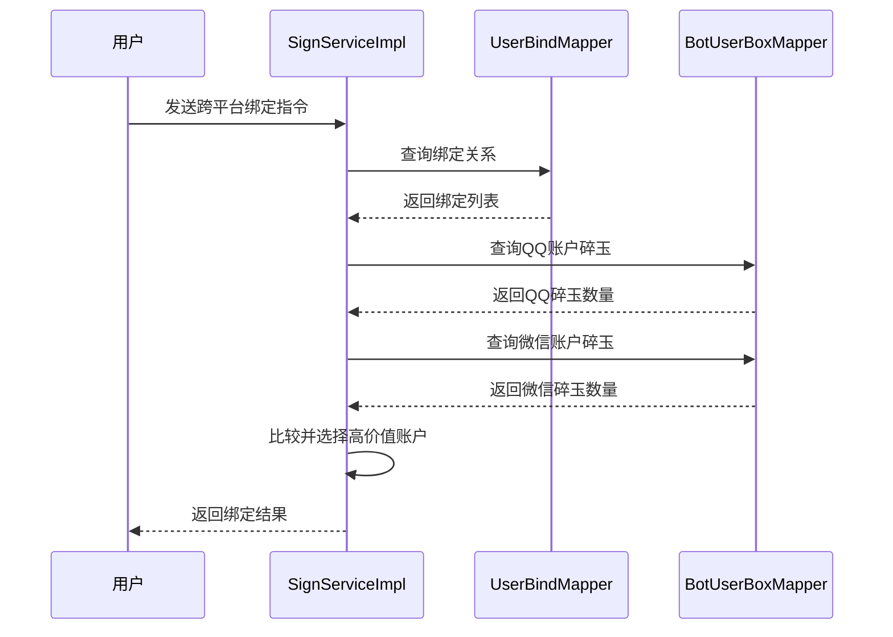

# 活动系统 - 签到功能全面文档

<cite>
**本文档引用的文件**
- [SignServiceImpl.java](file://Base/src/main/java/com/bot/base/service/impl/SignServiceImpl.java)
- [SigninServiceImpl.java](file://Life/src/main/java/com/bot/life/service/impl/SigninServiceImpl.java)
- [BotUserSign.java](file://Game/src/main/java/com/bot/game/dao/entity/BotUserSign.java)
- [LifePlayerSignin.java](file://Life/src/main/java/com/bot/life/dao/entity/LifePlayerSignin.java)
- [BotUserSignMapper.java](file://Game/src/main/java/com/bot/game/dao/mapper/BotUserSignMapper.java)
- [LifePlayerSigninMapper.java](file://Life/src/main/java/com/bot/life/dao/mapper/LifePlayerSigninMapper.java)
- [BotUserSignMapper.xml](file://Game/src/main/resources/mapper/BotUserSignMapper.xml)
- [LifePlayerSigninMapper.xml](file://Life/src/main/resources/mapper/LifePlayerSigninMapper.xml)
- [BaseConsts.java](file://Common/src/main/java/com\bot\common\constant\BaseConsts.java)
- [ENUserGoodType.java](file://Common/src\main\java\com\bot\common\enums\ENUserGoodType.java)
- [BotUser.java](file://Game/src/main/java/com/bot/game/dao/entity/BotUser.java)
</cite>

## 目录
1. [系统概述](#系统概述)
2. [项目架构](#项目架构)
3. [核心组件分析](#核心组件分析)
4. [签到流程详解](#签到流程详解)
5. [奖励机制设计](#奖励机制设计)
6. [防重复签到机制](#防重复签到机制)
7. [跨平台集成](#跨平台集成)
8. [状态转换图](#状态转换图)
9. [审计方案](#审计方案)
10. [性能优化建议](#性能优化建议)
11. [故障排除指南](#故障排除指南)

## 系统概述

活动系统是一个基于Spring框架构建的多功能签到奖励系统，主要包含两个核心模块：基础签到服务（Base模块）和修仙游戏签到服务（Life模块）。该系统通过统一的服务接口提供签到功能，支持多种奖励机制和防重复签到策略。

### 主要特性

- **双模态签到系统**：同时支持基础签到和修仙游戏签到
- **智能奖励分配**：根据签到天数动态调整奖励数量
- **防重复签到机制**：确保用户每天只能签到一次
- **跨平台账户绑定**：支持QQ和微信账户的统一管理
- **灵活的奖励类型**：支持碎玉、灵粹等多种奖励形式

## 项目架构


**图表来源**
- [SignServiceImpl.java](file://Base/src/main/java/com/bot/base/service/impl/SignServiceImpl.java#L28-L48)
- [SigninServiceImpl.java](file://Life/src/main/java/com/bot/life/service/impl/SigninServiceImpl.java#L22-L28)

## 核心组件分析

### Base模块签到服务（SignServiceImpl）

Base模块提供了通用的基础签到服务，主要负责处理传统的游戏签到功能。

#### 核心方法分析

**doQueryReturn方法**：
- **功能**：处理签到指令查询和响应
- **参数**：reqContent（请求内容）、token（用户标识）、groupId（群组ID）、channel（渠道）
- **业务逻辑**：实现复杂的签到判断逻辑，包括跨平台绑定、连签天数计算等

**signSuccess方法**：
- **功能**：记录签到成功并发放奖励
- **实现**：创建签到记录，更新用户碎玉余额
- **事务性**：使用@Transactional注解确保数据一致性

#### 数据模型关系


**图表来源**
- [SignServiceImpl.java](file://Base/src/main/java/com/bot/base/service/impl/SignServiceImpl.java#L28-L48)
- [BotUser.java](file://Game/src/main/java/com/bot/game/dao/entity/BotUser.java#L39-L47)
- [BotUserSign.java](file://Game/src/main/java/com/bot/game/dao/entity/BotUserSign.java#L12-L28)

**节来源**
- [SignServiceImpl.java](file://Base/src/main/java/com/bot/base/service/impl/SignServiceImpl.java#L50-L167)
- [BotUser.java](file://Game/src/main/java/com/bot/game/dao/entity/BotUser.java#L1-L214)

### Life模块签到服务（SigninServiceImpl）

Life模块专为修仙游戏设计，提供更加丰富的签到体验。

#### 核心方法分析

**signin方法**：
- **功能**：执行玩家签到操作
- **算法**：使用Random类生成1-100范围内的随机灵粹奖励
- **异常处理**：完善的try-catch机制确保系统稳定性

**hasSignedToday方法**：
- **功能**：检查玩家今日是否已签到
- **实现**：调用selectTodaySignin查询今日签到记录

#### 数据模型关系


**图表来源**
- [SigninServiceImpl.java](file://Life/src/main/java/com/bot/life/service/impl/SigninServiceImpl.java#L22-L28)
- [LifePlayerSignin.java](file://Life/src/main/java/com/bot/life/dao/entity/LifePlayerSignin.java#L11-L18)

**节来源**
- [SigninServiceImpl.java](file://Life/src/main/java/com/bot/life/service/impl/SigninServiceImpl.java#L31-L93)

## 签到流程详解

### 基础签到流程


**图表来源**
- [SignServiceImpl.java](file://Base/src/main/java/com/bot/base/service/impl/SignServiceImpl.java#L52-L120)

### 修仙签到流程


**图表来源**
- [SigninServiceImpl.java](file://Life/src/main/java/com/bot/life/service/impl/SigninServiceImpl.java#L32-L71)

**节来源**
- [SignServiceImpl.java](file://Base/src/main/java/com/bot/base/service/impl/SignServiceImpl.java#L52-L120)
- [SigninServiceImpl.java](file://Life/src/main/java/com/bot/life/service/impl/SigninServiceImpl.java#L32-L71)

## 奖励机制设计

### 基础签到奖励算法

基础签到系统采用阶梯式奖励机制：

| 连签天数 | 奖励碎玉 | 计算公式 |
|---------|---------|---------|
| 第1天 | 1 | signDay == 1 ? 1 : 0 |
| 第2天 | 2 | signDay == 2 ? 2 : 0 |
| 第3天及以后 | 3 | signDay > 2 ? 3 : 0 |

奖励计算逻辑：
```java
// 连签天数计算
int money = signDay == 1 ? 1 : signDay == 2 ? 2 : 3;
```

### 修仙签到奖励算法

修仙签到系统采用随机奖励机制：

```java
// 随机生成1-100的灵粹奖励
int spiritReward = random.nextInt(100) + 1;
```

这种设计特点：
- **不确定性**：每次签到都有不同的奖励，增加趣味性
- **简单性**：算法简单，性能优异
- **可扩展性**：可通过调整nextInt参数改变奖励范围

**节来源**
- [SignServiceImpl.java](file://Base/src/main/java/com/bot/base/service/impl/SignServiceImpl.java#L92-L94)
- [SigninServiceImpl.java](file://Life/src/main/java/com/bot/life/service/impl/SigninServiceImpl.java#L43-L44)

## 防重复签到机制

### 基础签到防重复机制

基础签到系统通过以下机制防止重复签到：

1. **日期唯一性检查**：
```java
BotUserSignExample signExample = new BotUserSignExample();
signExample.createCriteria()
    .andSignDateEqualTo(DateUtil.today())
    .andUserIdEqualTo(token);
int todayCount = userSignMapper.countByExample(signExample);
```

2. **连签天数管理**：
```java
// 昨日签到检查
signExample.clear();
signExample.createCriteria()
    .andSignDateEqualTo(DateUtil.format(DateUtil.yesterday(), DatePattern.NORM_DATE_FORMAT))
    .andUserIdEqualTo(token);
int yesterdayCount = userSignMapper.countByExample(signExample);
```

### 修仙签到防重复机制

修仙签到系统通过精确的日期匹配防止重复签到：

```java
private Date getTodayDate() {
    Calendar calendar = Calendar.getInstance();
    calendar.set(Calendar.HOUR_OF_DAY, 0);
    calendar.set(Calendar.MINUTE, 0);
    calendar.set(Calendar.SECOND, 0);
    calendar.set(Calendar.MILLISECOND, 0);
    return calendar.getTime();
}

@Override
public boolean hasSignedToday(Long playerId) {
    Date today = getTodayDate();
    LifePlayerSignin todaySignin = signinMapper.selectTodaySignin(playerId, today);
    return todaySignin != null;
}
```

### 数据库层面的约束

| 表名 | 字段 | 约束类型 | 作用 |
|------|------|---------|------|
| bot_user_sign | user_id, sign_date | 复合唯一索引 | 防止同一用户同一天多次签到 |
| life_player_signin | player_id, signin_date | 复合唯一索引 | 防止同一玩家同一天多次签到 |

**节来源**
- [SignServiceImpl.java](file://Base/src/main/java/com/bot/base/service/impl/SignServiceImpl.java#L76-L81)
- [SigninServiceImpl.java](file://Life/src/main/java/com/bot/life/service/impl/SigninServiceImpl.java#L75-L78)

## 跨平台集成

### 账户绑定机制

系统支持QQ和微信用户的跨平台绑定，实现统一的签到体验：



**图表来源**
- [SignServiceImpl.java](file://Base/src/main/java/com/bot/base/service/impl/SignServiceImpl.java#L54-L74)

### 绑定策略

系统采用智能绑定策略：
1. **价值优先**：选择碎玉数量较多的账户作为主要签到账户
2. **透明度**：用户可以随时查看绑定状态
3. **灵活性**：支持随时更换绑定关系

**节来源**
- [SignServiceImpl.java](file://Base/src/main/java/com/bot/base/service/impl/SignServiceImpl.java#L122-L132)

## 状态转换图

### 基础签到状态转换


### 修仙签到状态转换


## 审计方案

### 签到记录审计

系统提供完整的签到记录审计功能：

#### 基础签到审计字段

| 字段名 | 类型 | 描述 | 审计用途 |
|--------|------|------|---------|
| id | String | 签到记录唯一标识 | 唯一性验证 |
| user_id | String | 用户标识 | 用户追踪 |
| sign_date | String | 签到日期 | 时间范围查询 |
| create_time | DateTime | 记录创建时间 | 异常排查 |

#### 修仙签到审计字段

| 字段名 | 类型 | 描述 | 审计用途 |
|--------|------|------|---------|
| id | Long | 签到记录唯一标识 | 唯一性验证 |
| player_id | Long | 玩家标识 | 玩家追踪 |
| signin_date | Date | 签到日期 | 时间范围查询 |
| spirit_reward | Integer | 灵粹奖励数量 | 奖励统计 |
| create_time | DateTime | 记录创建时间 | 异常排查 |

### 审计查询示例

```sql
-- 基础签到审计查询
SELECT user_id, sign_date, COUNT(*) as sign_count
FROM bot_user_sign
WHERE sign_date BETWEEN '2024-01-01' AND '2024-01-31'
GROUP BY user_id, sign_date
ORDER BY sign_count DESC;

-- 修仙签到审计查询  
SELECT player_id, DATE(signin_date) as sign_day, 
       SUM(spirit_reward) as total_spirit,
       COUNT(*) as sign_times
FROM life_player_signin
WHERE signin_date BETWEEN '2024-01-01' AND '2024-01-31'
GROUP BY player_id, DATE(signin_date)
ORDER BY total_spirit DESC;
```

### 异常监控指标

| 监控指标 | 阈值 | 处理策略 |
|---------|------|---------|
| 签到成功率 | < 95% | 检查系统稳定性 |
| 平均响应时间 | > 2秒 | 优化数据库查询 |
| 错误率 | > 5% | 分析具体错误原因 |
| 并发签到数 | > 1000/分钟 | 扩容数据库连接池 |

## 性能优化建议

### 数据库优化

1. **索引优化**：
```sql
-- 基础签到表索引
CREATE INDEX idx_bot_user_sign_user_date ON bot_user_sign(user_id, sign_date);

-- 修仙签到表索引
CREATE INDEX idx_life_player_signin_player_date ON life_player_signin(player_id, signin_date);
```

2. **查询优化**：
```java
// 使用批量查询减少数据库交互
List<BotUserSign> recentSigns = userSignMapper.selectRecentSigns(playerIds, startDate);
```

### 缓存策略

1. **签到状态缓存**：
```java
@Cacheable(value = "signin_status", key = "#playerId + '_' + #date")
public boolean hasSignedToday(Long playerId, Date date) {
    // 查询逻辑
}
```

2. **用户信息缓存**：
```java
@CacheEvict(value = "user_info", key = "#userId")
public void updateUserSignDay(String userId, int signDay) {
    // 更新逻辑
}
```

### 异步处理

对于非关键路径的操作，可以采用异步处理：
```java
@Async
public void recordSignInAudit(Long playerId, Integer reward) {
    // 审计记录写入
}
```

## 故障排除指南

### 常见问题及解决方案

#### 1. 签到失败问题

**症状**：用户收到"今日已签到"的提示，但实际未签到成功

**排查步骤**：
1. 检查签到记录表中是否存在对应记录
2. 验证用户账户状态是否正常
3. 检查时间同步问题

**解决方案**：
```sql
-- 检查签到记录
SELECT * FROM bot_user_sign 
WHERE user_id = '用户ID' AND sign_date = CURDATE();

-- 清理异常记录
DELETE FROM bot_user_sign 
WHERE user_id = '用户ID' AND sign_date = CURDATE();
```

#### 2. 奖励发放异常

**症状**：签到成功但奖励未到账

**排查步骤**：
1. 检查奖励物品表记录
2. 验证用户碎玉余额
3. 检查事务提交状态

**解决方案**：
```sql
-- 检查奖励记录
SELECT * FROM bot_user_box 
WHERE user_id = '用户ID' AND good_type = 'money';

-- 手动添加奖励
INSERT INTO bot_user_box (id, user_id, good_type, number)
VALUES (UUID(), '用户ID', 'money', 奖励数量);
```

#### 3. 跨平台绑定问题

**症状**：绑定后签到仍使用旧账户

**排查步骤**：
1. 检查绑定关系有效性
2. 验证账户价值比较逻辑
3. 检查缓存更新状态

**解决方案**：
```sql
-- 检查绑定关系
SELECT * FROM user_bind WHERE qq_user_token = 'QQ用户ID' OR wx_user_token = '微信用户ID';

-- 强制刷新绑定
UPDATE user_bind SET last_update = NOW() WHERE id = 绑定记录ID;
```

### 监控告警配置

建议配置以下监控告警：

1. **签到成功率告警**：低于90%时发送告警
2. **响应时间告警**：超过3秒时发送告警
3. **错误率告警**：超过5%时发送告警
4. **数据库连接告警**：连接池使用率超过80%时发送告警

**节来源**
- [SignServiceImpl.java](file://Base/src/main/java/com/bot/base/service/impl/SignServiceImpl.java#L136-L167)
- [SigninServiceImpl.java](file://Life/src/main/java/com/bot/life/service/impl/SigninServiceImpl.java#L74-L93)

## 结论

活动系统的签到功能通过精心设计的架构和算法，实现了高效、稳定、可扩展的签到奖励机制。系统的主要优势包括：

1. **双重保障**：通过代码逻辑和数据库约束双重防止重复签到
2. **灵活奖励**：支持阶梯式和随机式两种奖励机制
3. **跨平台支持**：实现QQ和微信账户的统一管理
4. **完整审计**：提供详细的签到记录和审计功能
5. **性能优化**：通过索引、缓存等手段保证系统性能

该系统为用户提供良好的签到体验，同时为企业提供了可靠的签到管理和数据分析能力。随着业务的发展，系统还可以进一步扩展支持更多类型的奖励和更复杂的签到规则。