# 用户管理模块详细文档

<cite>
**本文档引用的文件**
- [RegServiceImpl.java](file://Base/src/main/java/com/bot/base/service/impl/RegServiceImpl.java)
- [RegService.java](file://Base/src/main/java/com/bot/base/service/RegService.java)
- [BotUserConfig.java](file://Game/src/main/java/com/bot/game/dao/entity/BotUserConfig.java)
- [BotUserConfigMapper.java](file://Game/src/main/java/com/bot/game/dao/mapper/BotUserConfigMapper.java)
- [BotUserMapper.java](file://Game/src/main/java/com/bot/game/dao/mapper/BotUserMapper.java)
- [BotUser.java](file://Game/src/main/java/com/bot/game/dao/entity/BotUser.java)
- [ENRegType.java](file://Common/src/main/java/com/bot/common/enums/ENRegType.java)
- [ENRegStatus.java](file://Common/src/main/java/com/bot/common/enums/ENRegStatus.java)
- [ENRegDay.java](file://Common/src/main/java/com/bot/common/enums/ENRegDay.java)
- [SystemConfigCache.java](file://Common/src/main/java/com/bot/common/config/SystemConfigCache.java)
- [SystemConfigHolder.java](file://Game/src/main/java/com/bot/game/service/SystemConfigHolder.java)
- [BaseConsts.java](file://Common/src/main/java/com/bot/common/constant/BaseConsts.java)
</cite>

## 目录
1. [简介](#简介)
2. [项目架构概览](#项目架构概览)
3. [核心组件分析](#核心组件分析)
4. [用户注册机制详解](#用户注册机制详解)
5. [试用开通流程](#试用开通流程)
6. [正式注册流程](#正式注册流程)
7. [邀请码生成机制](#邀请码生成机制)
8. [用户状态管理](#用户状态管理)
9. [数据持久化方案](#数据持久化方案)
10. [用户生命周期管理](#用户生命周期管理)
11. [扩展指南](#扩展指南)
12. [总结](#总结)

## 简介

Bot用户管理模块是一个基于Spring框架构建的完整用户注册、认证和生命周期管理系统。该模块实现了用户注册、试用开通、邀请码生成、服务到期查询等核心功能，采用分层架构设计，通过MyBatis ORM框架实现数据持久化。

模块的核心特性包括：
- 支持个人和群组两种用户类型
- 提供试用和正式两种注册模式
- 实现邀请码制度促进用户传播
- 完整的用户状态跟踪和到期时间管理
- 基于缓存的高性能数据访问

## 项目架构概览

用户管理模块采用经典的三层架构设计，清晰分离业务逻辑、数据访问和表现层。

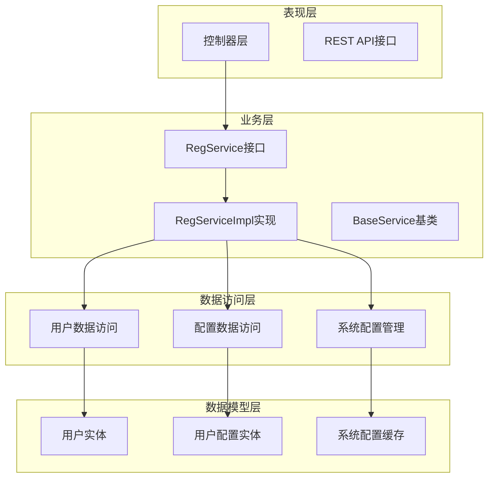

**图表来源**
- [RegServiceImpl.java](file://Base/src/main/java/com/bot/base/service/impl/RegServiceImpl.java#L29-L40)
- [BotUserMapper.java](file://Game/src/main/java/com/bot/game/dao/mapper/BotUserMapper.java#L8-L96)
- [BotUserConfigMapper.java](file://Game/src/main/java/com/bot/game/dao/mapper/BotUserConfigMapper.java#L9-L97)

## 核心组件分析

### RegService接口

RegService定义了用户管理模块的核心业务接口，提供了四个主要方法：

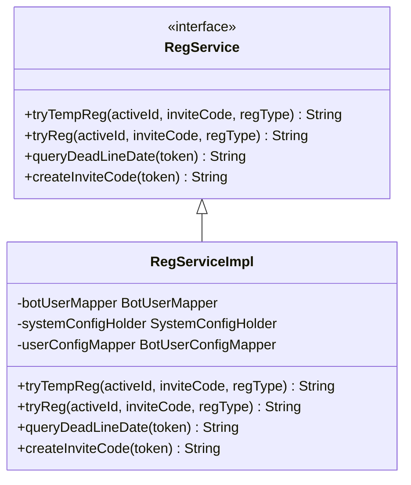

**图表来源**
- [RegService.java](file://Base/src/main/java/com/bot/base/service/RegService.java#L5-L35)
- [RegServiceImpl.java](file://Base/src/main/java/com/bot/base/service/impl/RegServiceImpl.java#L29-L171)

### 数据模型设计

系统采用两个核心实体来管理用户信息：

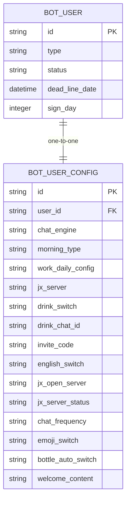

**图表来源**
- [BotUser.java](file://Game/src/main/java/com/bot/game/dao/entity/BotUser.java#L6-L151)
- [BotUserConfig.java](file://Game/src/main/java/com/bot/game/dao/entity/BotUserConfig.java#L5-L356)

**章节来源**
- [RegService.java](file://Base/src/main/java/com/bot/base/service/RegService.java#L1-L36)
- [RegServiceImpl.java](file://Base/src/main/java/com/bot/base/service/impl/RegServiceImpl.java#L29-L171)

## 用户注册机制详解

### tryReg方法：正式注册处理流程

tryReg方法是系统的核心注册逻辑，负责处理用户的正式注册请求。该方法实现了复杂的业务规则，包括邀请码验证、用户状态检查、续期逻辑等。

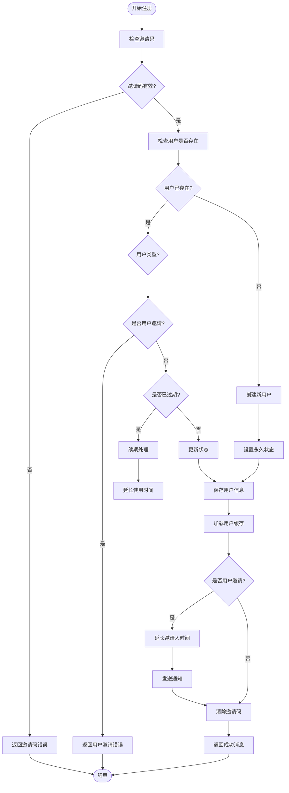

**图表来源**
- [RegServiceImpl.java](file://Base/src/main/java/com/bot/base/service/impl/RegServiceImpl.java#L66-L144)

### tryTempReg方法：试用注册处理流程

tryTempReg方法专门处理用户的试用注册请求，提供7天免费试用期。

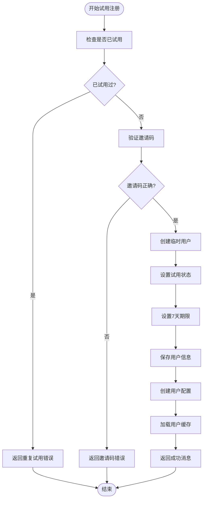

**图表来源**
- [RegServiceImpl.java](file://Base/src/main/java/com/bot/base/service/impl/RegServiceImpl.java#L42-L62)

**章节来源**
- [RegServiceImpl.java](file://Base/src/main/java/com/bot/base/service/impl/RegServiceImpl.java#L66-L144)
- [RegServiceImpl.java](file://Base/src/main/java/com/bot/base/service/impl/RegServiceImpl.java#L42-L62)

## 试用开通流程

### 试用机制特点

试用机制具有以下特点：
- **单次使用限制**：每个用户只能试用一次
- **固定期限**：7天试用期，到期后自动失效
- **严格验证**：必须使用正确的系统邀请码
- **快速注册**：无需复杂验证流程

### 试用注册步骤

1. **用户验证**：检查用户是否已参与过试用
2. **邀请码验证**：确认使用正确的系统邀请码
3. **用户创建**：创建临时用户记录
4. **配置初始化**：生成默认用户配置
5. **缓存更新**：刷新系统用户缓存

**章节来源**
- [RegServiceImpl.java](file://Base/src/main/java/com/bot/base/service/impl/RegServiceImpl.java#L42-L62)

## 正式注册流程

### 注册逻辑详解

正式注册流程比试用注册更加复杂，涉及多种场景和业务规则：

#### 场景一：新用户注册
- 创建新的用户记录
- 设置永久使用状态
- 初始化用户配置

#### 场景二：老用户续期
- 检查用户当前状态
- 计算剩余时间
- 基于过期时间延长使用期限

#### 场景三：用户邀请机制
- 验证邀请关系
- 延长邀请人使用时间
- 发送邀请成功通知

### 续期计算逻辑

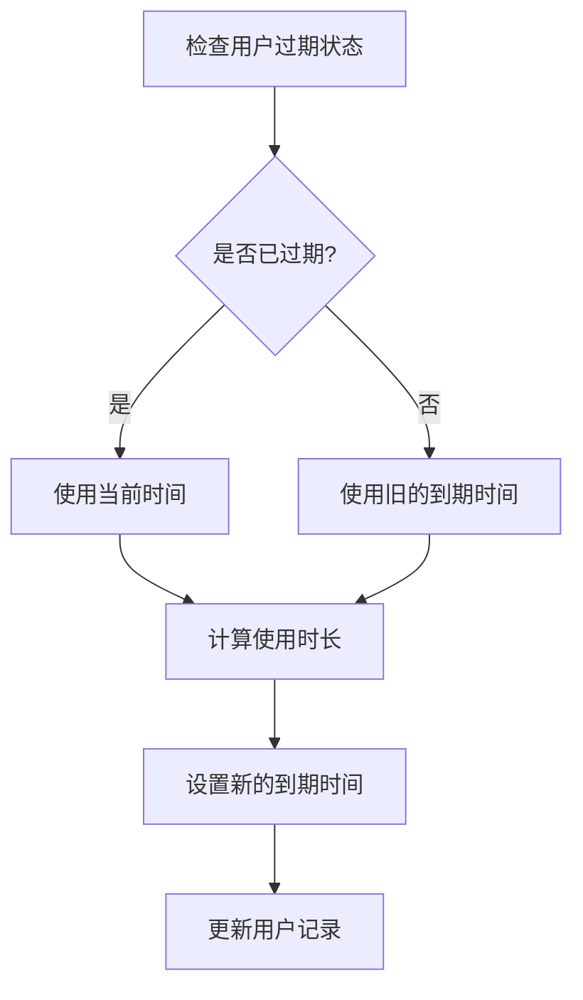

**图表来源**
- [RegServiceImpl.java](file://Base/src/main/java/com/bot/base/service/impl/RegServiceImpl.java#L88-L106)

**章节来源**
- [RegServiceImpl.java](file://Base/src/main/java/com/bot/base/service/impl/RegServiceImpl.java#L66-L144)

## 邀请码生成机制

### createInviteCode方法实现

createInviteCode方法负责为已有用户生成专属邀请码，支持用户邀请机制。

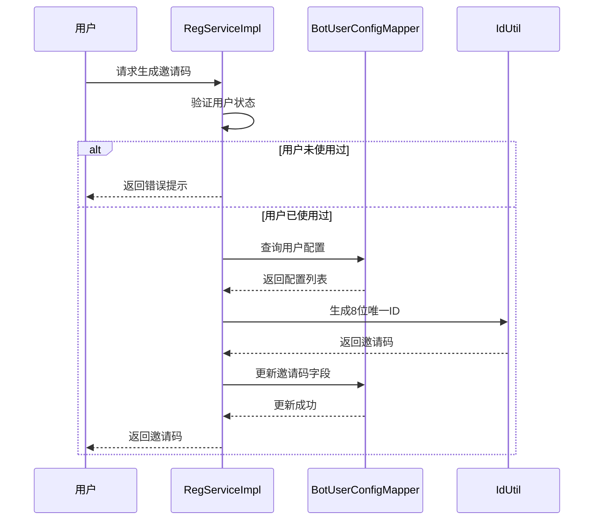

**图表来源**
- [RegServiceImpl.java](file://Base/src/main/java/com/bot/base/service/impl/RegServiceImpl.java#L157-L168)

### 邀请码生成策略

1. **唯一性保证**：使用NanoID算法生成8位唯一标识符
2. **权限控制**：只有已使用过的用户才能生成邀请码
3. **即时生效**：生成后立即更新数据库并返回结果
4. **安全考虑**：邀请码长度适中，便于分享和记忆

**章节来源**
- [RegServiceImpl.java](file://Base/src/main/java/com/bot/base/service/impl/RegServiceImpl.java#L157-L168)

## 用户状态管理

### ENRegType枚举

ENRegType枚举定义了用户类型，支持两种注册模式：

| 类型 | 值 | 描述 |
|------|----|----- |
| PERSONNEL | "1" | 个人用户 |
| GROUP | "2" | 群组用户 |

### ENRegStatus枚举

ENRegStatus枚举管理用户的状态：

| 状态 | 值 | 描述 |
|------|----|----- |
| TEMP | "0" | 试用状态 |
| FOREVER | "1" | 正式状态 |

### ENRegDay枚举

ENRegDay枚举定义了不同的使用期限：

| 期限类型 | 天数 | 描述 |
|----------|------|------|
| DAY | 7 | 7天试用期 |
| MONTH | 30 | 1个月有效期 |
| SEASON | 90 | 3个月有效期 |

**章节来源**
- [ENRegType.java](file://Common/src/main/java/com/bot/common/enums/ENRegType.java#L8-L11)
- [ENRegStatus.java](file://Common/src/main/java/com/bot/common/enums/ENRegStatus.java#L8-L11)
- [ENRegDay.java](file://Common/src/main/java/com/bot/common/enums/ENRegDay.java#L8-L12)

## 数据持久化方案

### BotUserMapper接口

BotUserMapper提供了完整的用户数据CRUD操作：

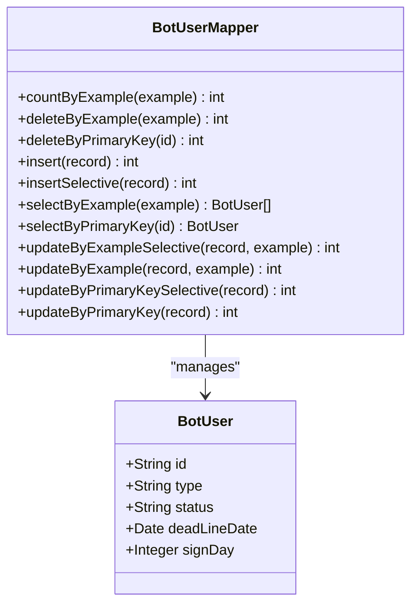

**图表来源**
- [BotUserMapper.java](file://Game/src/main/java/com/bot/game/dao/mapper/BotUserMapper.java#L8-L96)
- [BotUser.java](file://Game/src/main/java/com/bot/game/dao/entity/BotUser.java#L6-L151)

### BotUserConfigMapper接口

BotUserConfigMapper管理用户个性化配置：

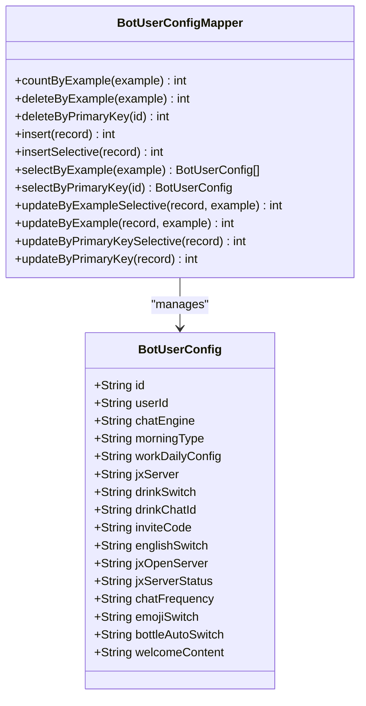

**图表来源**
- [BotUserConfigMapper.java](file://Game/src/main/java/com/bot/game/dao/mapper/BotUserConfigMapper.java#L9-L97)
- [BotUserConfig.java](file://Game/src/main/java/com/bot/game/dao/entity/BotUserConfig.java#L5-L356)

### SystemConfigCache缓存机制

SystemConfigCache采用内存缓存提高系统性能：

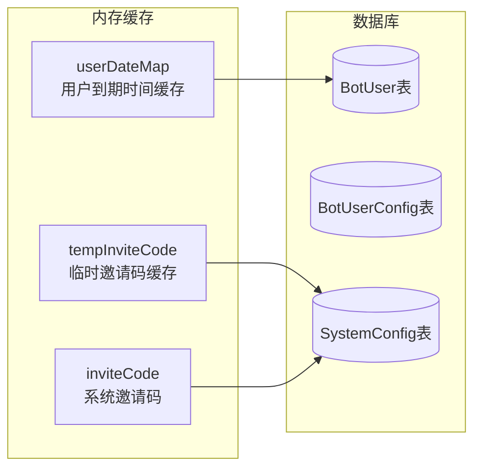

**图表来源**
- [SystemConfigCache.java](file://Common/src/main/java/com/bot/common/config/SystemConfigCache.java#L35-L35)
- [SystemConfigHolder.java](file://Game/src/main/java/com/bot/game/service/SystemConfigHolder.java#L50-L57)

**章节来源**
- [BotUserMapper.java](file://Game/src/main/java/com/bot/game/dao/mapper/BotUserMapper.java#L8-L96)
- [BotUserConfigMapper.java](file://Game/src/main/java/com/bot/game/dao/mapper/BotUserConfigMapper.java#L9-L97)
- [SystemConfigCache.java](file://Common/src/main/java/com/bot/common/config/SystemConfigCache.java#L35-L35)

## 用户生命周期管理

### 生命周期流程图

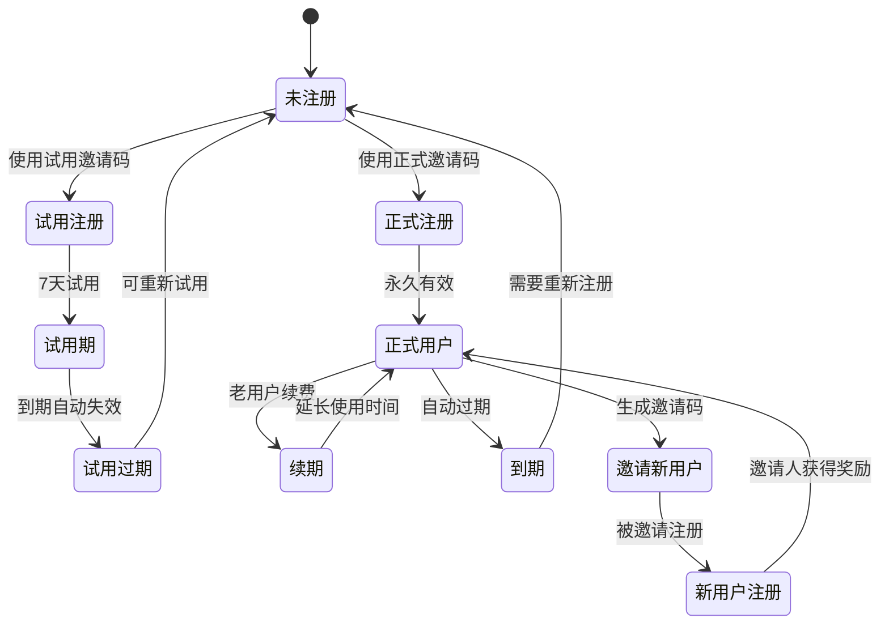

### 关键时间节点

1. **注册时间**：用户首次注册的时间点
2. **到期时间**：用户服务的有效截止时间
3. **续期时间**：老用户续费后的新的到期时间
4. **邀请奖励时间**：邀请人获得奖励的时间点

### 状态转换规则

| 当前状态 | 触发条件 | 目标状态 | 备注 |
|----------|----------|----------|------|
| 未注册 | 输入邀请码 | 试用注册 | 7天试用期 |
| 未注册 | 输入正式邀请码 | 正式注册 | 永久有效 |
| 试用期 | 到期 | 试用过期 | 可重新试用 |
| 正式用户 | 到期 | 到期 | 需要续费 |
| 正式用户 | 再次注册 | 续期 | 基于旧时间延长 |

**章节来源**
- [RegServiceImpl.java](file://Base/src/main/java/com/bot/base/service/impl/RegServiceImpl.java#L42-L144)

## 扩展指南

### 修改注册验证逻辑

如需修改注册验证逻辑，建议从以下几个方面入手：

#### 1. 邀请码验证扩展

```java
// 在tryReg方法中添加自定义验证逻辑
@Override
public String tryReg(String activeId, String inviteCode, ENRegType regType) {
    // 添加自定义验证
    if (!customValidation(inviteCode)) {
        return "自定义验证失败";
    }
    
    // 原有逻辑...
}
```

#### 2. 用户类型扩展

如需支持更多用户类型，可以扩展ENRegType枚举：

```java
public enum ENRegType {
    PERSONNEL("1", "个人"),
    GROUP("2", "群"),
    ENTERPRISE("3", "企业"),  // 新增企业用户类型
    ORGANIZATION("4", "组织"); // 新增组织用户类型
}
```

#### 3. 注册期限定制

扩展ENRegDay枚举以支持更多期限选项：

```java
public enum ENRegDay {
    DAY("day", 7),
    MONTH("month", 30),
    SEASON("season", 90),
    YEAR("year", 365),      // 年度套餐
    CUSTOM("custom", 0);    // 自定义期限
}
```

### 性能优化建议

1. **缓存策略优化**：定期清理过期用户缓存
2. **批量操作**：对于大量用户操作使用批量处理
3. **异步处理**：将耗时操作（如发送通知）改为异步执行
4. **索引优化**：确保数据库表有适当的索引

### 错误处理增强

建议在现有错误处理基础上增加：
- 更详细的错误日志记录
- 用户友好的错误提示
- 自动重试机制
- 监控告警功能

**章节来源**
- [RegServiceImpl.java](file://Base/src/main/java/com/bot/base/service/impl/RegServiceImpl.java#L66-L144)
- [ENRegType.java](file://Common/src/main/java/com/bot/common/enums/ENRegType.java#L8-L11)
- [ENRegDay.java](file://Common/src/main/java/com/bot/common/enums/ENRegDay.java#L8-L12)

## 总结

Bot用户管理模块是一个设计精良、功能完备的用户管理系统。它通过分层架构实现了清晰的职责分离，通过枚举类型确保了数据的一致性和可读性，通过缓存机制保证了系统的高性能。

### 主要优势

1. **功能完整性**：涵盖了用户注册、试用、正式开通、邀请码生成等完整功能
2. **业务逻辑清晰**：复杂的注册逻辑被分解为易于理解和维护的模块
3. **性能优化**：通过内存缓存和高效的数据库操作保证系统性能
4. **扩展性强**：良好的架构设计便于后续功能扩展和业务变更

### 应用价值

该模块不仅满足了当前的业务需求，还为未来的功能扩展奠定了坚实的基础。其设计理念和实现方式可以作为其他类似系统开发的重要参考。