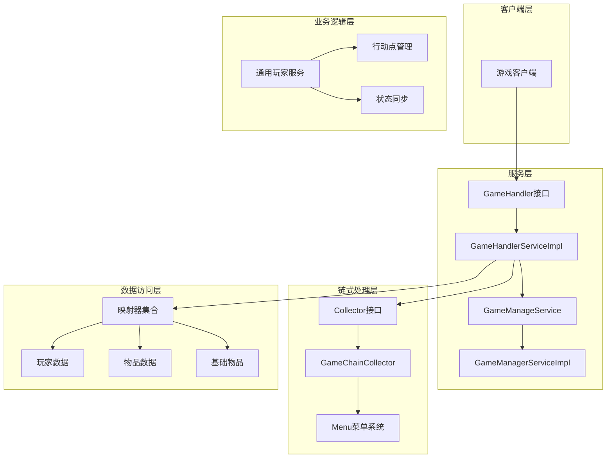
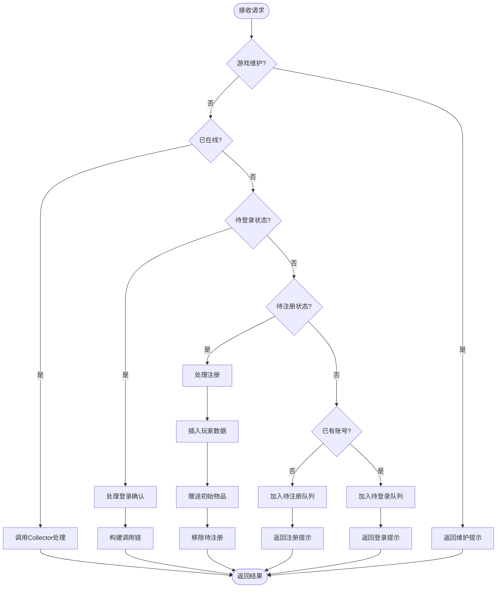
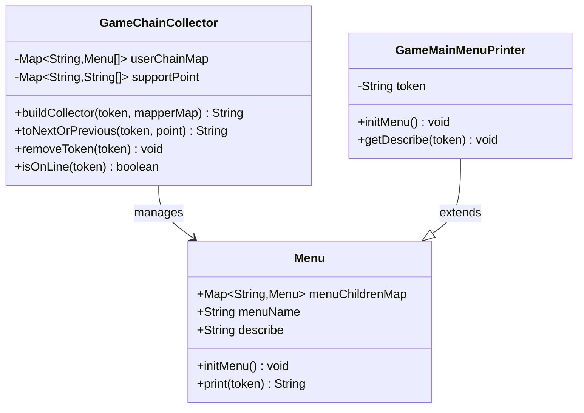
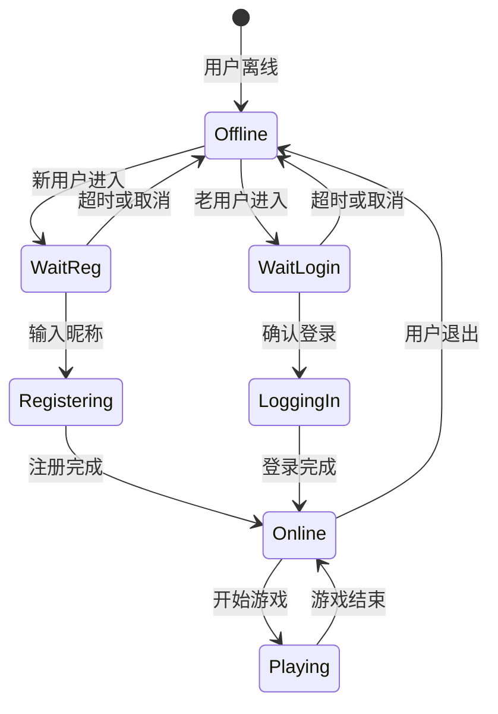
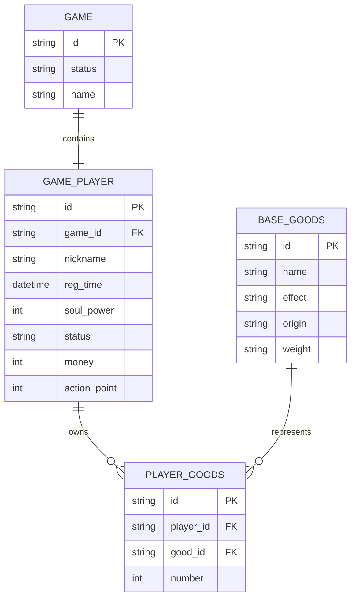
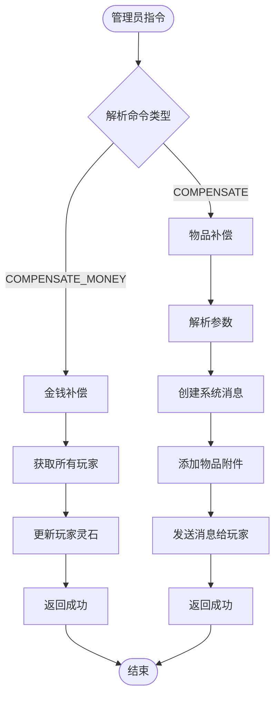
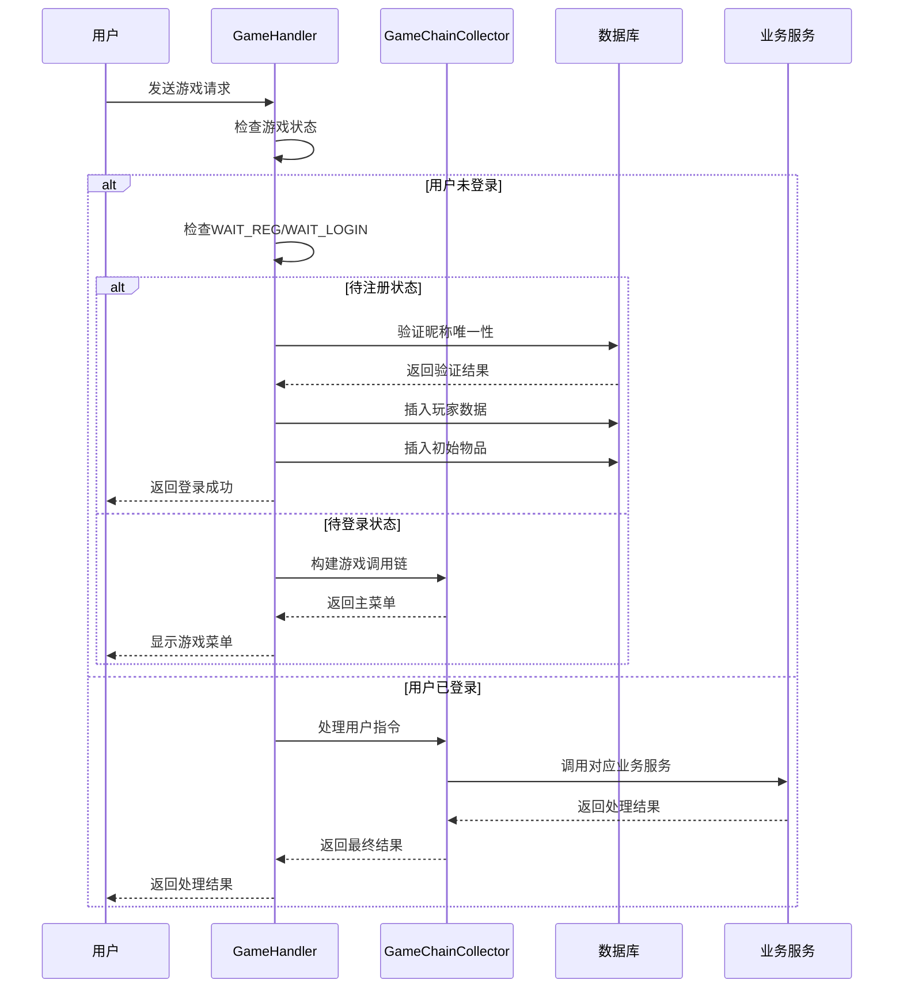
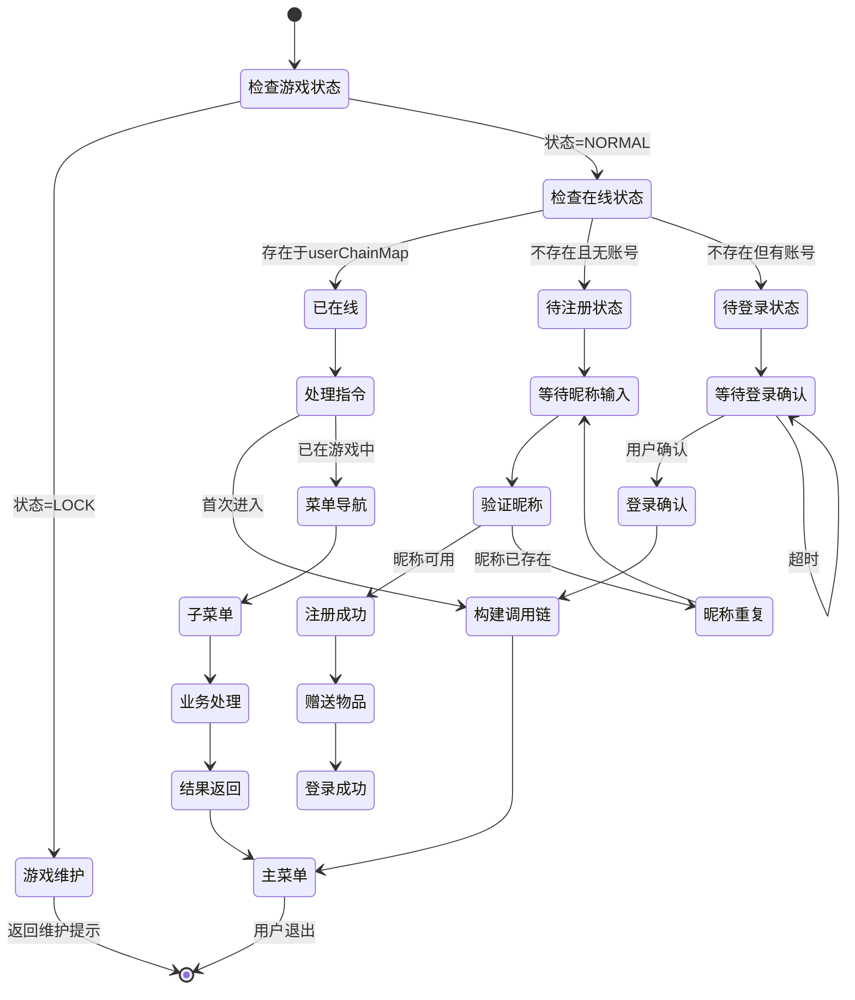

# 普通游戏处理系统文档

<cite>
**本文档中引用的文件**
- [GameHandlerServiceImpl.java](file://Game/src/main/java/com/bot/game/service/impl/GameHandlerServiceImpl.java)
- [Collector.java](file://Game/src/main/java/com/bot/game/chain/Collector.java)
- [GameChainCollector.java](file://Game/src/main/java/com/bot/game/chain/GameChainCollector.java)
- [GameHandler.java](file://Game/src/main/java/com/bot/game/service/GameHandler.java)
- [GameManageService.java](file://Game/src/main/java/com/bot/game/service/GameManageService.java)
- [GameManagerServiceImpl.java](file://Game/src/main/java/com/bot/game/service/impl/GameManagerServiceImpl.java)
- [CompensateDTO.java](file://Game/src/main/java/com/bot/game/dto/CompensateDTO.java)
- [CommonPlayer.java](file://Game/src/main/java/com/bot/game/service/impl/CommonPlayer.java)
- [GameMainMenuPrinter.java](file://Game/src/main/java/com/bot/game/chain/menu/GameMainMenuPrinter.java)
- [JXCache.java](file://Game/src/main/java/com/bot/game/dao/entity/JXCache.java)
</cite>

## 目录
1. [系统概述](#系统概述)
2. [核心架构](#核心架构)
3. [游戏处理器详解](#游戏处理器详解)
4. [Collector组件分析](#collector组件分析)
5. [状态管理系统](#状态管理系统)
6. [数据持久化策略](#数据持久化策略)
7. [管理员功能实现](#管理员功能实现)
8. [业务流程图](#业务流程图)
9. [性能优化建议](#性能优化建议)
10. [开发指南](#开发指南)

## 系统概述

普通游戏处理系统是一个基于Spring框架构建的游戏业务处理平台，主要负责游戏用户的注册、登录、在线状态管理以及核心业务逻辑处理。系统采用链式处理模式，通过Collector组件实现游戏指令的链式处理和状态流转。

### 核心特性

- **双状态管理**：支持WAIT_REG（待注册）和WAIT_LOGIN（待登录）两种初始状态
- **链式处理**：通过Collector组件实现游戏指令的链式处理和状态流转
- **实时状态同步**：动态维护用户在线状态和行动点数
- **管理员功能**：提供补偿发放、系统管理等特殊功能
- **数据持久化**：完整的数据库操作和缓存管理机制

## 核心架构



**图表来源**
- [GameHandlerServiceImpl.java](file://Game/src/main/java/com/bot/game/service/impl/GameHandlerServiceImpl.java#L28-L191)
- [GameChainCollector.java](file://Game/src/main/java/com/bot/game/chain/GameChainCollector.java#L23-L119)
- [Collector.java](file://Game/src/main/java/com/bot/game/chain/Collector.java#L9-L40)

## 游戏处理器详解

### GameHandlerServiceImpl核心功能

GameHandlerServiceImpl是游戏业务的核心处理器，实现了GameHandler接口的所有方法，负责处理游戏的主要业务流程。

#### 主要职责

1. **游戏状态检查**：验证游戏是否处于维护状态
2. **用户状态管理**：处理注册、登录和在线状态
3. **链式调用**：协调Collector组件进行指令处理
4. **数据初始化**：为新用户提供初始游戏数据

#### 关键方法分析

##### play方法 - 核心业务入口



**图表来源**
- [GameHandlerServiceImpl.java](file://Game/src/main/java/com/bot/game/service/impl/GameHandlerServiceImpl.java#L89-L133)

##### manage方法 - 管理员指令处理

系统提供了强大的管理员功能，支持以下操作：

- **金钱补偿**：`COMPENSATE_MONEY` - 给所有玩家发放指定金额
- **物品补偿**：`COMPENSATE` - 给所有玩家发放指定物品和数量
- **错误处理**：无效指令返回错误提示

**节来源**
- [GameHandlerServiceImpl.java](file://Game/src/main/java/com/bot/game/service/impl/GameHandlerServiceImpl.java#L135-L149)

## Collector组件分析

### Collector接口设计

Collector组件是系统的核心调度器，负责管理用户的游戏状态和指令流转。

#### 接口方法说明

| 方法 | 功能 | 参数 | 返回值 |
|------|------|------|--------|
| `buildCollector` | 构建调用链 | token, mapperMap | String |
| `toNextOrPrevious` | 前往下一级或上一级 | token, point | String |
| `removeToken` | 移除用户令牌 | token | void |
| `isOnLine` | 检查用户在线状态 | token | boolean |

### GameChainCollector实现

GameChainCollector是Collector接口的具体实现，提供了完整的链式处理功能。

#### 核心数据结构



**图表来源**
- [GameChainCollector.java](file://Game/src/main/java/com/bot/game/chain/GameChainCollector.java#L26-L119)
- [GameMainMenuPrinter.java](file://Game/src/main/java/com/bot/game/chain/menu/GameMainMenuPrinter.java#L16-L51)

#### 链式处理机制

1. **构建阶段**：创建菜单链并初始化主菜单
2. **导航阶段**：根据用户输入在菜单间跳转
3. **执行阶段**：调用对应的服务处理业务逻辑
4. **状态管理**：维护用户的状态链和支持的指令

**节来源**
- [GameChainCollector.java](file://Game/src/main/java/com/bot/game/chain/GameChainCollector.java#L34-L107)

## 状态管理系统

### WAIT_REG和WAIT_LOGIN状态管理

系统通过两个静态列表维护用户的初始状态：

#### WAIT_REG（待注册状态）
- **用途**：新用户首次进入游戏时的状态
- **特点**：需要用户提供昵称完成注册
- **处理流程**：
  1. 检查昵称是否重复
  2. 插入玩家数据
  3. 赠送初始物品（唤灵符×3）
  4. 移除待注册标记

#### WAIT_LOGIN（待登录状态）
- **用途**：已有账号用户登录时的状态
- **特点**：需要用户确认登录
- **处理流程**：
  1. 验证用户存在性
  2. 提供登录确认选项
  3. 构建游戏调用链

### 在线状态管理

系统通过userChainMap维护用户的在线状态：



**图表来源**
- [GameHandlerServiceImpl.java](file://Game/src/main/java/com/bot/game/service/impl/GameHandlerServiceImpl.java#L78-L81)
- [GameChainCollector.java](file://Game/src/main/java/com/bot/game/chain/GameChainCollector.java#L115-L118)

**节来源**
- [GameHandlerServiceImpl.java](file://Game/src/main/java/com/bot/game/service/impl/GameHandlerServiceImpl.java#L78-L81)
- [GameChainCollector.java](file://Game/src/main/java/com/bot/game/chain/GameChainCollector.java#L115-L118)

## 数据持久化策略

### 数据库架构概览

系统采用MyBatis作为ORM框架，通过Mapper接口实现数据访问。

#### 核心实体关系



**图表来源**
- [GameHandlerServiceImpl.java](file://Game/src/main/java/com/bot/game/service/impl/GameHandlerServiceImpl.java#L33-L77)

### 缓存策略

系统使用JXCache实体作为缓存机制：

- **缓存类型**：支持多种类型的缓存数据
- **键值存储**：通过cacheKey和content字段存储数据
- **时间戳记录**：saveDate字段记录缓存创建时间

### 数据一致性保证

1. **事务管理**：关键业务操作使用Spring事务
2. **乐观锁**：通过版本号控制并发更新
3. **数据校验**：在业务逻辑层进行数据完整性检查

**节来源**
- [JXCache.java](file://Game/src/main/java/com/bot/game/dao/entity/JXCache.java#L1-L51)

## 管理员功能实现

### 补偿发放系统

系统提供了灵活的补偿发放功能，支持两种补偿方式：

#### 金钱补偿
- **触发方式**：`COMPENSATE_MONEY` + 金额
- **实现逻辑**：遍历所有玩家，增加相应金额
- **数据操作**：直接更新GamePlayer表的money字段

#### 物品补偿
- **触发方式**：`COMPENSATE` + 内容\|\|物品ID\|\|数量
- **实现逻辑**：创建系统消息，包含附件物品
- **数据操作**：生成Message实体和AttachDTO

### 补偿流程图



**图表来源**
- [GameManagerServiceImpl.java](file://Game/src/main/java/com/bot/game/service/impl/GameManagerServiceImpl.java#L38-L60)

**节来源**
- [GameManagerServiceImpl.java](file://Game/src/main/java/com/bot/game/service/impl/GameManagerServiceImpl.java#L38-L60)
- [CompensateDTO.java](file://Game/src/main/java/com/bot/game/dto/CompensateDTO.java#L1-L19)

## 业务流程图

### 完整游戏流程



**图表来源**
- [GameHandlerServiceImpl.java](file://Game/src/main/java/com/bot/game/service/impl/GameHandlerServiceImpl.java#L89-L133)
- [GameChainCollector.java](file://Game/src/main/java/com/bot/game/chain/GameChainCollector.java#L34-L107)

### 状态流转图



**图表来源**
- [GameHandlerServiceImpl.java](file://Game/src/main/java/com/bot/game/service/impl/GameHandlerServiceImpl.java#L89-L133)
- [GameChainCollector.java](file://Game/src/main/java/com/bot/game/chain/GameChainCollector.java#L47-L107)

## 性能优化建议

### 在线用户管理优化

1. **内存管理**
   - 使用ConcurrentHashMap替代LinkedList提高查找性能
   - 定期清理超时的在线状态
   - 实现LRU缓存策略

2. **数据库优化**
   - 为常用查询添加索引
   - 使用连接池管理数据库连接
   - 实现读写分离

3. **缓存策略**
   - 引入Redis缓存热点数据
   - 实现分布式缓存同步
   - 设置合理的缓存过期时间

### 状态同步优化

1. **异步处理**
   - 将非关键状态更新改为异步操作
   - 使用消息队列处理批量状态更新
   - 实现状态变更事件通知

2. **批量操作**
   - 合并多个状态更新为单次操作
   - 使用批量SQL语句
   - 实现状态快照机制

## 开发指南

### 扩展游戏功能

#### 添加新的游戏菜单

1. **创建菜单类**
   ```java
   public class NewMenuPrinter extends Menu {
       @Override
       public void initMenu() {
           // 初始化菜单项
       }
       
       @Override
       public void getDescribe(String token) {
           // 设置菜单描述
       }
   }
   ```

2. **注册菜单**
   在GameMainMenuPrinter中添加新菜单项

#### 添加新的业务服务

1. **实现Player接口**
   ```java
   @Service
   public class NewPlayerService implements Player {
       @Override
       public String doPlay(String token) {
           // 实现业务逻辑
           return "处理结果";
       }
   }
   ```

2. **集成到Collector**
   在GameChainCollector中注册新的服务

### 调试状态同步问题

#### 常见问题诊断

1. **状态不一致**
   - 检查userChainMap中的数据完整性
   - 验证removeToken调用时机
   - 查看日志中的状态变更记录

2. **内存泄漏**
   - 监控WAIT_REG和WAIT_LOGIN列表大小
   - 检查超时清理逻辑
   - 分析内存使用情况

3. **并发问题**
   - 使用ThreadLocal隔离状态
   - 实现适当的锁机制
   - 避免长时间持有锁

### 最佳实践

1. **代码组织**
   - 遵循单一职责原则
   - 实现清晰的接口分离
   - 使用依赖注入管理组件

2. **错误处理**
   - 实现完善的异常捕获
   - 提供有意义的错误信息
   - 记录详细的日志信息

3. **测试策略**
   - 编写单元测试覆盖核心逻辑
   - 实现集成测试验证流程
   - 使用Mock对象隔离外部依赖

**节来源**
- [CommonPlayer.java](file://Game/src/main/java/com/bot/game/service/impl/CommonPlayer.java#L41-L447)
- [GameChainCollector.java](file://Game/src/main/java/com/bot/game/chain/GameChainCollector.java#L23-L119)