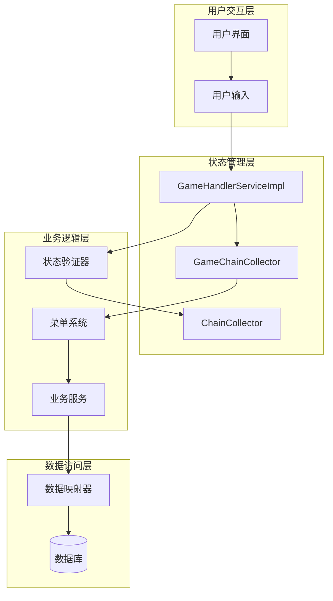
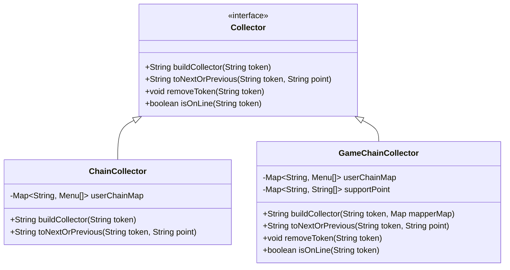
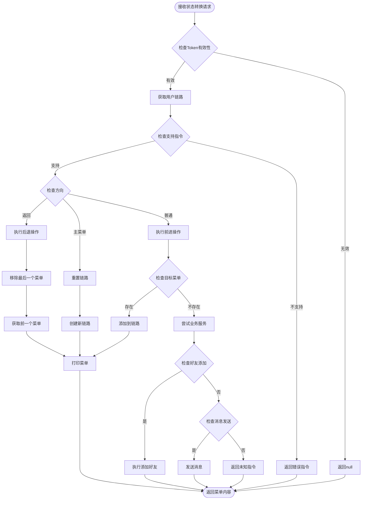
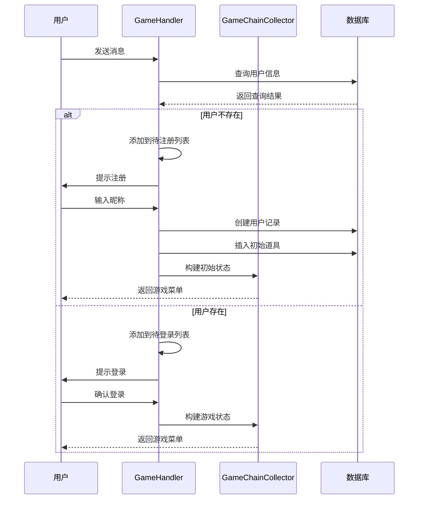
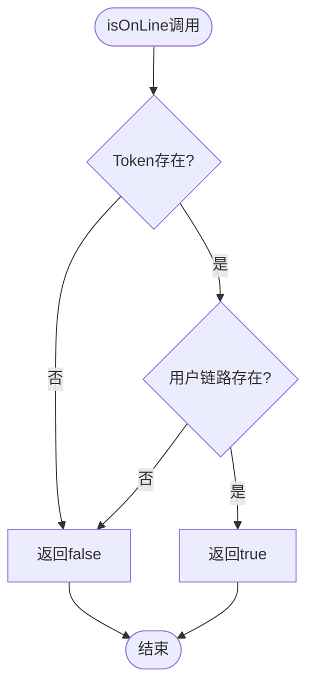
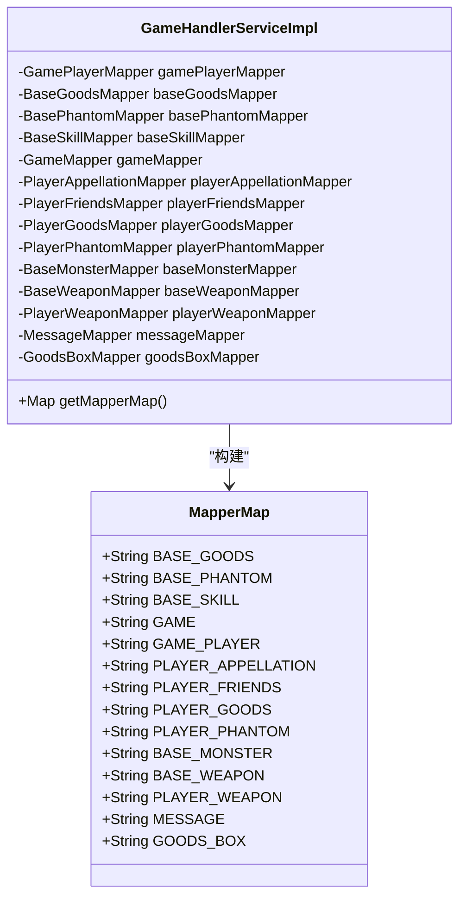
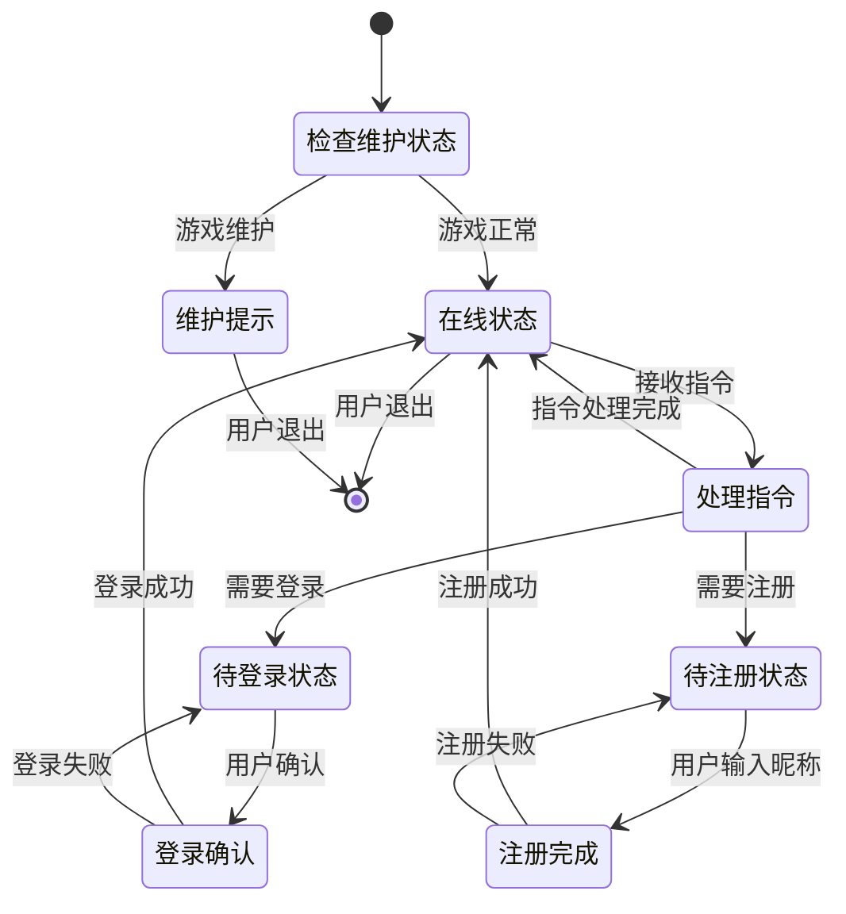
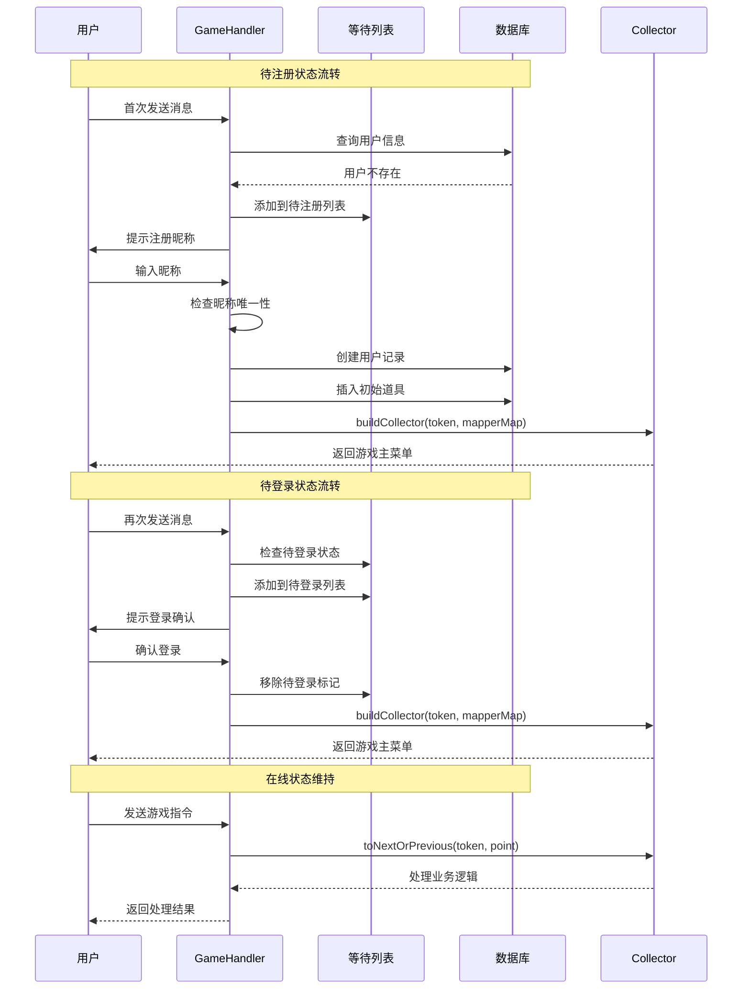
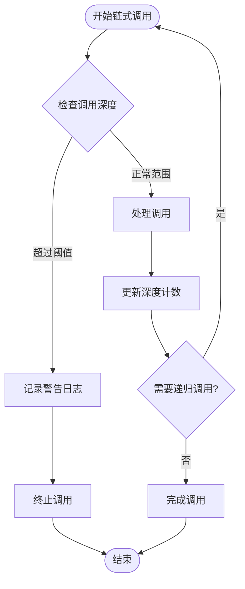
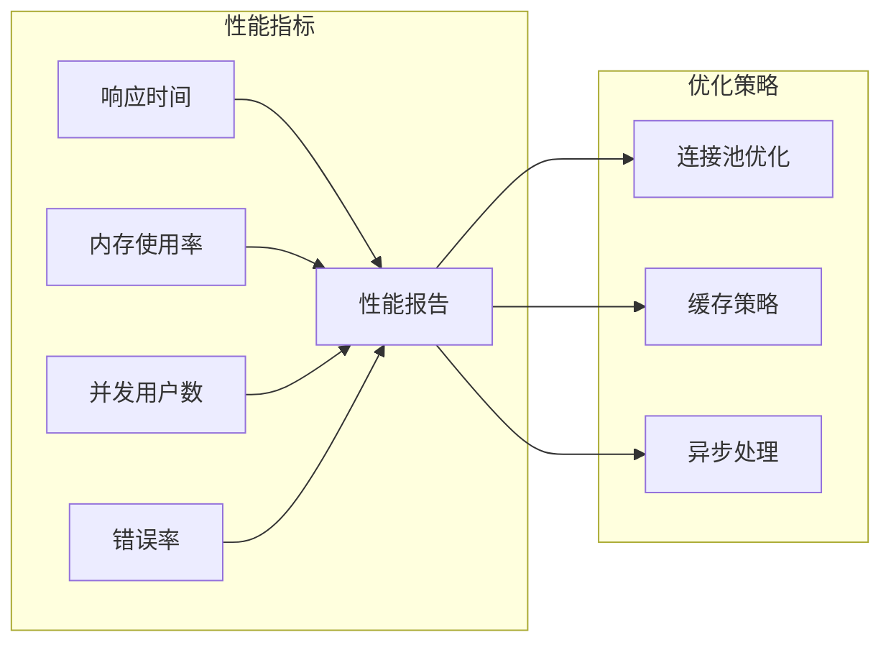

# 状态流转

<cite>
**本文档引用的文件**
- [Collector.java](file://Base/src/main/java/com/bot/base/chain/Collector.java)
- [ChainCollector.java](file://Base/src/main/java/com/bot/base/chain/ChainCollector.java)
- [GameChainCollector.java](file://Game/src/main/java/com/bot/game/chain/GameChainCollector.java)
- [GameHandlerServiceImpl.java](file://Game/src/main/java/com/bot/game/service/impl/GameHandlerServiceImpl.java)
- [Menu.java](file://Base/src/main/java/com/bot/base/chain/Menu.java)
- [GameMainMenuPrinter.java](file://Game/src/main/java/com/bot/game/chain/menu/GameMainMenuPrinter.java)
- [BaseConsts.java](file://Common/src/main/java/com/bot/common/constant/BaseConsts.java)
- [GameConsts.java](file://Common/src/main/java/com/bot/common/constant/GameConsts.java)
- [ENStatus.java](file://Common/src/main/java/com/bot/common/enums/ENStatus.java)
- [ENUserGameStatus.java](file://Common/src/main/java/com/bot/common/enums/ENUserGameStatus.java)
</cite>

## 目录
1. [引言](#引言)
2. [系统架构概览](#系统架构概览)
3. [Collector组件核心机制](#collector组件核心机制)
4. [状态流转机制详解](#状态流转机制详解)
5. [在线状态检测逻辑](#在线状态检测逻辑)
6. [数据访问层注入机制](#数据访问层注入机制)
7. [状态机设计与实现](#状态机设计与实现)
8. [调试方法与性能优化](#调试方法与性能优化)
9. [故障排除指南](#故障排除指南)
10. [总结](#总结)

## 引言

本文档深入解析Bot项目中的游戏状态流转机制，重点关注Collector组件如何通过buildCollector和toNextOrPrevious方法实现菜单链式调用，以及在线状态检测逻辑与状态转移条件判断的协同工作原理。通过对getMapperMap方法的分析，揭示Collector如何为业务处理注入所需的数据访问层组件，构建完整的业务处理上下文。

## 系统架构概览

Bot项目采用分层架构设计，核心围绕状态流转机制构建完整的用户交互体系：

**图表来源**
- [GameHandlerServiceImpl.java](file://Game/src/main/java/com/bot/game/service/impl/GameHandlerServiceImpl.java#L27-L191)
- [GameChainCollector.java](file://Game/src/main/java/com/bot/game/chain/GameChainCollector.java#L23-L119)

## Collector组件核心机制

### Collector接口设计

Collector接口定义了状态流转的核心契约，包含两个关键方法：

**图表来源**
- [Collector.java](file://Base/src/main/java/com/bot/base/chain/Collector.java#L7-L22)
- [GameChainCollector.java](file://Game/src/main/java/com/bot/game/chain/GameChainCollector.java#L23-L119)

### buildCollector方法实现

buildCollector方法负责构建用户的状态链路，为不同类型的Collector提供了差异化的实现策略：

**基础Collector实现**：
- 创建主菜单实例
- 初始化用户链路映射
- 建立初始状态连接

**游戏Collector实现**：
- 注入数据访问层组件
- 支持动态参数传递
- 维护复杂的状态依赖关系

**节来源**
- [ChainCollector.java](file://Base/src/main/java/com/bot/base/chain/ChainCollector.java#L24-L34)
- [GameChainCollector.java](file://Game/src/main/java/com/bot/game/chain/GameChainCollector.java#L34-L45)

### toNextOrPrevious方法实现

该方法实现了状态间的平滑转换，支持前进、后退和特殊状态跳转：

**图表来源**
- [GameChainCollector.java](file://Game/src/main/java/com/bot/game/chain/GameChainCollector.java#L47-L107)

**节来源**
- [GameChainCollector.java](file://Game/src/main/java/com/bot/game/chain/GameChainCollector.java#L47-L107)

## 状态流转机制详解

### 待注册状态流转

系统首先检测用户是否存在，决定进入待注册或待登录流程：

**图表来源**
- [GameHandlerServiceImpl.java](file://Game/src/main/java/com/bot/game/service/impl/GameHandlerServiceImpl.java#L98-L132)

### 待登录状态流转

登录过程涉及状态验证和权限检查：

**节来源**
- [GameHandlerServiceImpl.java](file://Game/src/main/java/com/bot/game/service/impl/GameHandlerServiceImpl.java#L98-L132)

### 在线状态流转

在线状态的建立和维护通过严格的状态检查机制确保系统稳定性：

**节来源**
- [GameChainCollector.java](file://Game/src/main/java/com/bot/game/chain/GameChainCollector.java#L114-L118)

## 在线状态检测逻辑

### isOnLine方法实现原理

isOnLine方法通过检查用户链路映射表来确定用户是否处于在线状态：

**图表来源**
- [GameChainCollector.java](file://Game/src/main/java/com/bot/game/chain/GameChainCollector.java#L114-L118)

### 状态转移条件判断

状态转移遵循严格的条件判断机制：

| 状态 | 转移条件 | 目标状态 | 失败处理 |
|------|----------|----------|----------|
| 待注册 | 昵称唯一性检查 | 注册成功 | 显示重复提示 |
| 待登录 | 登录确认 | 在线状态 | 显示错误提示 |
| 在线状态 | 有效指令 | 下一状态 | 执行业务逻辑 |
| 在线状态 | 无效指令 | 当前状态 | 返回错误信息 |

**节来源**
- [GameHandlerServiceImpl.java](file://Game/src/main/java/com/bot/game/service/impl/GameHandlerServiceImpl.java#L108-L132)

## 数据访问层注入机制

### getMapperMap方法设计

getMapperMap方法为核心业务服务提供完整的数据访问层组件集合：

**图表来源**
- [GameHandlerServiceImpl.java](file://Game/src/main/java/com/bot/game/service/impl/GameHandlerServiceImpl.java#L171-L188)

### 数据访问层组件映射

getMapperMap方法建立了完整的数据访问层映射关系：

| 组件名称 | 实际类型 | 用途说明 |
|----------|----------|----------|
| BASE_GOODS | BaseGoodsMapper | 基础道具数据访问 |
| BASE_PHANTOM | BasePhantomMapper | 基础幻灵数据访问 |
| BASE_SKILL | BaseSkillMapper | 基础技能数据访问 |
| GAME | GameMapper | 游戏全局配置访问 |
| GAME_PLAYER | GamePlayerMapper | 玩家数据访问 |
| PLAYER_APPELLATION | PlayerAppellationMapper | 称号数据访问 |
| PLAYER_FRIENDS | PlayerFriendsMapper | 好友关系数据访问 |
| PLAYER_GOODS | PlayerGoodsMapper | 玩家道具数据访问 |
| PLAYER_PHANTOM | PlayerPhantomMapper | 玩家幻灵数据访问 |
| BASE_MONSTER | BaseMonsterMapper | 基础怪物数据访问 |
| BASE_WEAPON | BaseWeaponMapper | 基础武器数据访问 |
| PLAYER_WEAPON | PlayerWeaponMapper | 玩家武器数据访问 |
| MESSAGE | MessageMapper | 消息数据访问 |
| GOODS_BOX | GoodsBoxMapper | 物品箱数据访问 |

**节来源**
- [GameHandlerServiceImpl.java](file://Game/src/main/java/com/bot/game/service/impl/GameHandlerServiceImpl.java#L171-L188)

## 状态机设计与实现

### play方法中的状态机设计

play方法实现了复杂的状态机逻辑，处理游戏的各种状态转换：

**图表来源**
- [GameHandlerServiceImpl.java](file://Game/src/main/java/com/bot/game/service/impl/GameHandlerServiceImpl.java#L88-L133)

### 完整流转路径分析

从待注册到在线状态的完整流转路径展示了状态机的复杂性和灵活性：

**图表来源**
- [GameHandlerServiceImpl.java](file://Game/src/main/java/com/bot/game/service/impl/GameHandlerServiceImpl.java#L78-L133)

**节来源**
- [GameHandlerServiceImpl.java](file://Game/src/main/java/com/bot/game/service/impl/GameHandlerServiceImpl.java#L88-L133)

## 调试方法与性能优化

### 链式调用深度控制

为防止无限递归和栈溢出，系统实现了多层防护机制：

### 内存泄漏防范策略

系统采用多种策略防止内存泄漏：

| 防范策略 | 实现方式 | 触发条件 |
|----------|----------|----------|
| Token清理 | removeToken方法 | 用户主动退出 |
| 链路清理 | 自动超时清理 | 无活动时间超时 |
| 弱引用使用 | 关键对象弱引用 | 大对象缓存 |
| 定期垃圾回收 | 周期性清理机制 | 系统空闲时 |

### 性能监控指标

关键性能指标的监控和优化：

## 故障排除指南

### 常见状态流转问题

| 问题类型 | 症状表现 | 可能原因 | 解决方案 |
|----------|----------|----------|----------|
| 状态丢失 | 用户断线重连后状态异常 | Token失效或链路清理 | 重建用户链路 |
| 死循环 | 系统卡死或响应缓慢 | 递归调用过深 | 设置调用深度限制 |
| 内存泄漏 | 系统内存持续增长 | Token未清理 | 检查清理逻辑 |
| 权限错误 | 无法访问某些功能 | 状态验证失败 | 检查状态检查逻辑 |

### 调试工具和方法

1. **日志分析**：启用详细日志记录关键状态转换
2. **状态快照**：定期保存系统状态用于问题复现
3. **性能监控**：实时监控关键性能指标
4. **单元测试**：针对状态流转编写专门的测试用例

### 最佳实践建议

- **状态验证**：每次状态转换都要进行充分验证
- **异常处理**：完善的异常捕获和恢复机制
- **资源管理**：及时释放不再需要的资源
- **监控告警**：建立完善的监控和告警体系

## 总结

Bot项目的状态流转机制展现了现代聊天机器人系统的设计精髓。通过Collector组件的精心设计，系统实现了灵活的状态管理，支持复杂的业务逻辑流转。getMapperMap方法的数据访问层注入机制确保了业务层与数据层的清晰分离，提高了系统的可维护性和扩展性。

isOnLine方法的在线状态检测逻辑与toNextOrPrevious方法的状态转移条件判断形成了完整的状态管理体系，保证了系统的稳定运行。play方法中的状态机设计则展示了如何在一个复杂的应用场景中实现优雅的状态转换。

通过合理的性能优化和内存管理策略，系统能够在高并发环境下保持稳定的性能表现。完善的调试方法和故障排除指南为系统的运维提供了有力保障。

这套状态流转机制不仅解决了当前的功能需求，更为系统的未来发展奠定了坚实的基础，体现了良好的软件架构设计原则。