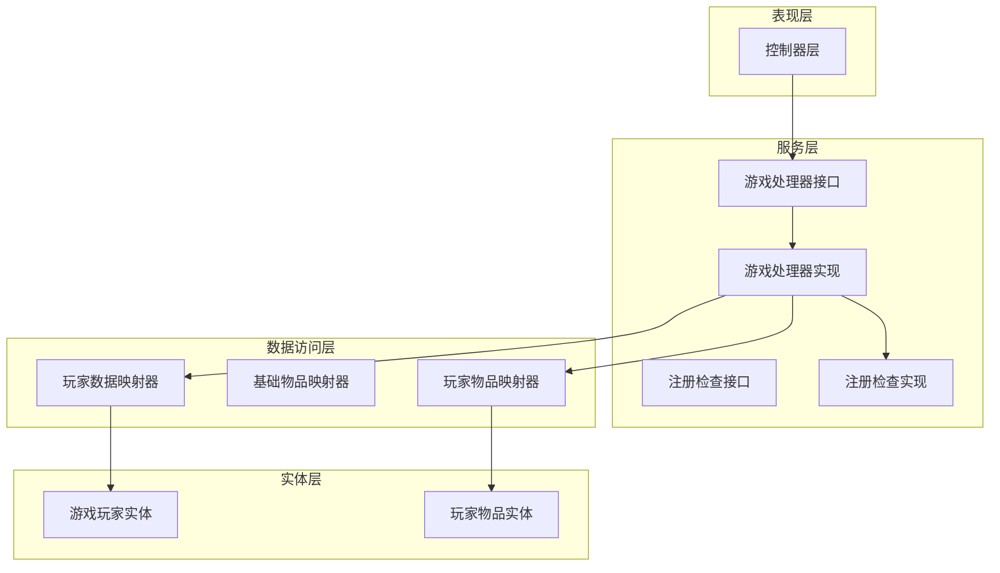
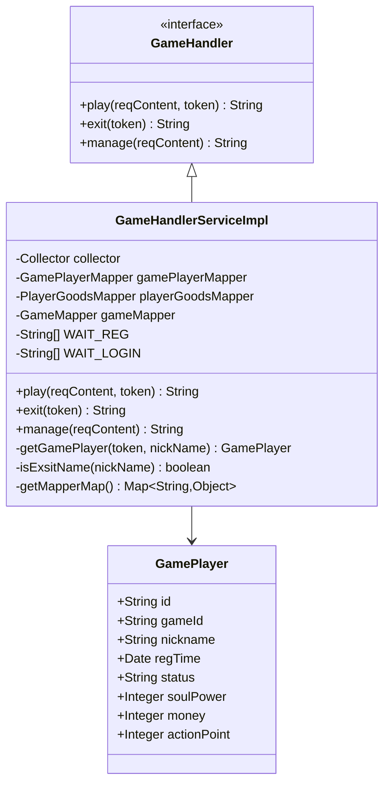
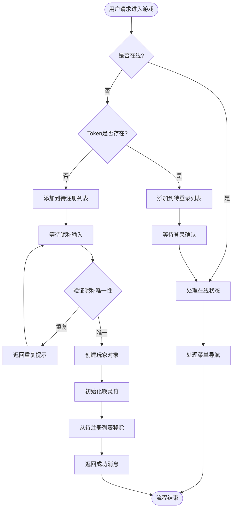
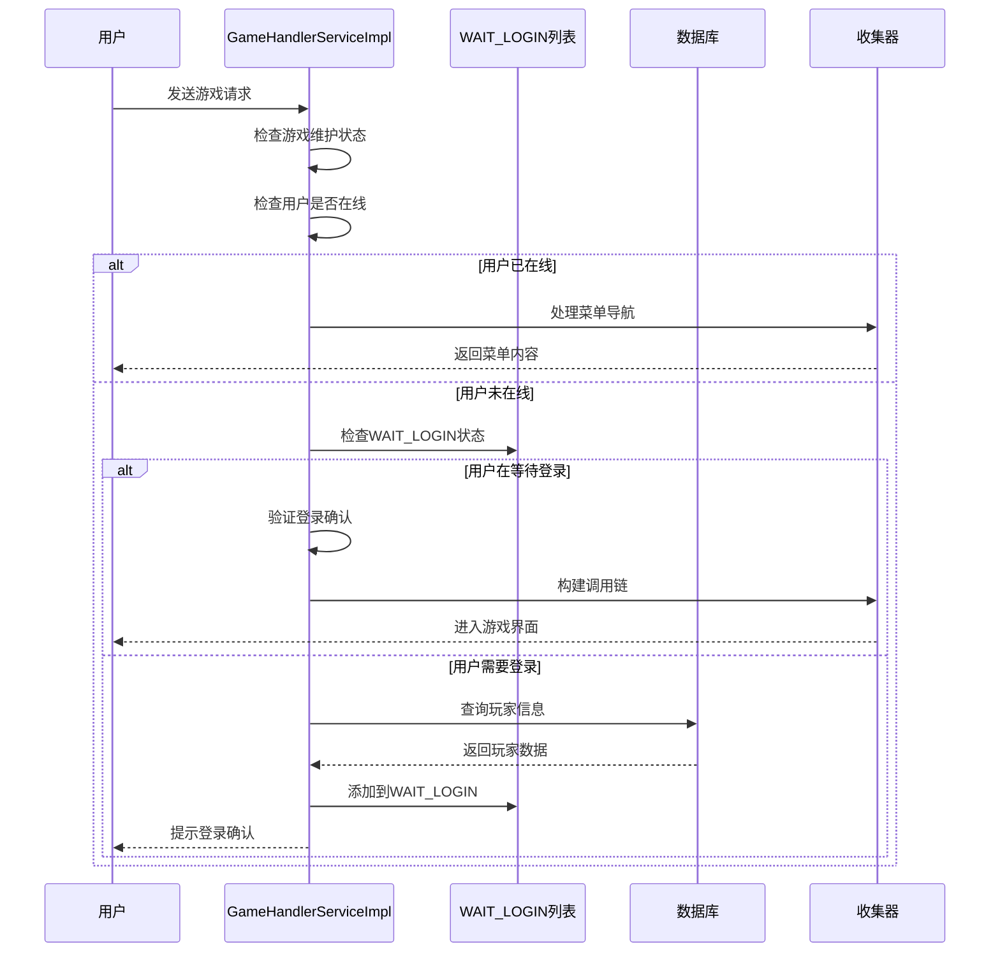
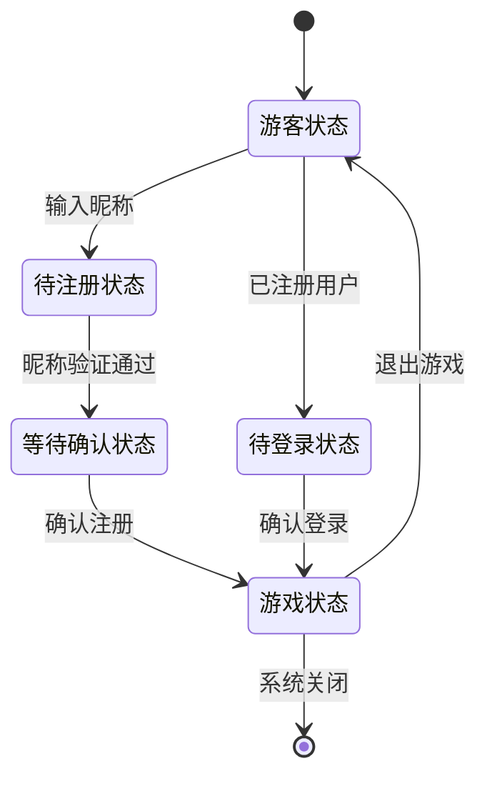
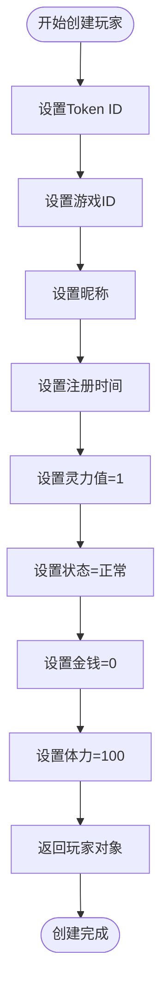
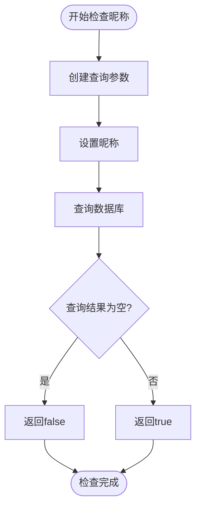
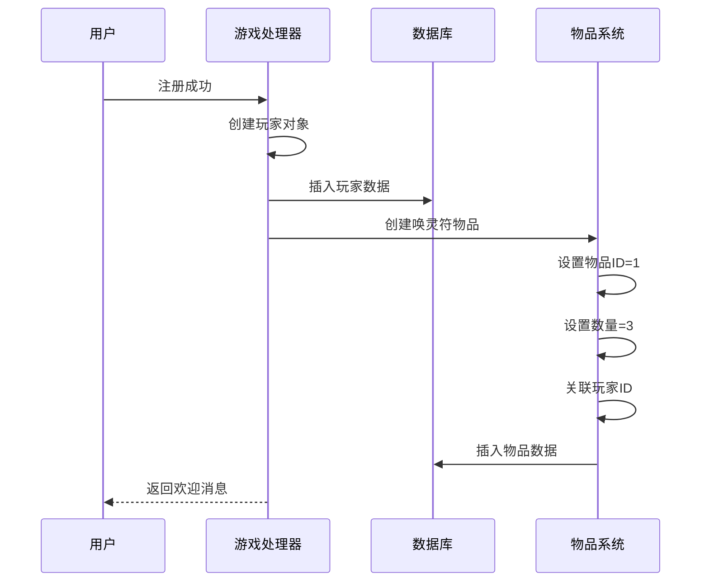

# 用户管理

<cite>
**本文档引用的文件**
- [GameHandlerServiceImpl.java](file://Game/src/main/java/com/bot/game/service/impl/GameHandlerServiceImpl.java)
- [GamePlayer.java](file://Game/src/main/java/com/bot/game/dao/entity/GamePlayer.java)
- [GameConsts.java](file://Common/src/main/java/com/bot/common/constant/GameConsts.java)
- [ENStatus.java](file://Common/src/main/java/com/bot/common/enums/ENStatus.java)
- [ENRegStatus.java](file://Common/src/main/java/com/bot/common/enums/ENRegStatus.java)
- [ENUserGameStatus.java](file://Common/src/main/java/com/bot/common/enums/ENUserGameStatus.java)
- [GameHandler.java](file://Game/src/main/java/com/bot/game/service/GameHandler.java)
- [CheckRegServiceImpl.java](file://Game/src/main/java/com/bot/game/service/impl/CheckRegServiceImpl.java)
- [GameCommonHolder.java](file://Game/src/main/java/com/bot/game/service/GameCommonHolder.java)
</cite>

## 目录
1. [概述](#概述)
2. [项目架构](#项目架构)
3. [核心组件分析](#核心组件分析)
4. [用户注册流程](#用户注册流程)
5. [用户登录流程](#用户登录流程)
6. [用户状态管理](#用户状态管理)
7. [数据结构设计](#数据结构设计)
8. [业务逻辑实现](#业务逻辑实现)
9. [最佳实践指南](#最佳实践指南)
10. [故障排除](#故障排除)

## 概述

本文档详细说明了基于Spring Boot框架的游戏用户管理系统，重点分析GameHandlerServiceImpl中play方法的用户注册与登录流程实现机制。系统采用Token机制进行用户状态管理，通过WAIT_REG和WAIT_LOGIN列表维护注册/登录会话状态，并提供了完善的用户数据初始化和异常处理机制。

## 项目架构

系统采用分层架构设计，主要包含以下模块：

**图表来源**
- [GameHandlerServiceImpl.java](file://Game/src/main/java/com/bot/game/service/impl/GameHandlerServiceImpl.java#L26-L189)
- [GameHandler.java](file://Game/src/main/java/com/bot/game/service/GameHandler.java#L7-L29)

## 核心组件分析

### GameHandlerServiceImpl核心功能

GameHandlerServiceImpl是用户管理的核心处理器，负责处理用户的注册、登录和游戏状态管理。

**图表来源**
- [GameHandlerServiceImpl.java](file://Game/src/main/java/com/bot/game/service/impl/GameHandlerServiceImpl.java#L26-L189)
- [GamePlayer.java](file://Game/src/main/java/com/bot/game/dao/entity/GamePlayer.java#L11-L33)

**章节来源**
- [GameHandlerServiceImpl.java](file://Game/src/main/java/com/bot/game/service/impl/GameHandlerServiceImpl.java#L26-L189)
- [GameHandler.java](file://Game/src/main/java/com/bot/game/service/GameHandler.java#L7-L29)

## 用户注册流程

### 注册流程图

**图表来源**
- [GameHandlerServiceImpl.java](file://Game/src/main/java/com/bot/game/service/impl/GameHandlerServiceImpl.java#L88-L132)

### 注册关键步骤

1. **Token验证与状态检查**：系统首先验证用户Token的有效性和当前状态
2. **注册状态管理**：通过WAIT_REG列表管理待注册用户的会话状态
3. **昵称唯一性检查**：使用isExsitName方法确保昵称不重复
4. **玩家数据初始化**：调用getGamePlayer方法创建新的玩家对象
5. **赠品发放**：为新注册用户提供3张唤灵符作为欢迎礼物

**章节来源**
- [GameHandlerServiceImpl.java](file://Game/src/main/java/com/bot/game/service/impl/GameHandlerServiceImpl.java#L88-L132)
- [GameHandlerServiceImpl.java](file://Game/src/main/java/com/bot/game/service/impl/GameHandlerServiceImpl.java#L151-L162)

## 用户登录流程

### 登录流程图

**图表来源**
- [GameHandlerServiceImpl.java](file://Game/src/main/java/com/bot/game/service/impl/GameHandlerServiceImpl.java#L88-L132)

### 登录状态管理

系统通过WAIT_LOGIN列表维护登录会话状态：

- **状态标识**：使用用户Token作为唯一标识
- **超时控制**：通过外部机制实现会话超时管理
- **状态转换**：从WAIT_LOGIN到在线状态的平滑过渡

**章节来源**
- [GameHandlerServiceImpl.java](file://Game/src/main/java/com/bot/game/service/impl/GameHandlerServiceImpl.java#L88-L132)

## 用户状态管理

### Token状态管理机制

系统采用基于Token的状态管理模式，通过静态列表维护用户会话状态：

### 状态转换规则

1. **游客状态**：用户首次访问游戏，Token不存在数据库中
2. **待注册状态**：用户输入昵称，等待系统验证
3. **待登录状态**：已注册用户，等待登录确认
4. **游戏状态**：成功登录，进入游戏主界面

**章节来源**
- [GameHandlerServiceImpl.java](file://Game/src/main/java/com/bot/game/service/impl/GameHandlerServiceImpl.java#L77-L80)
- [GameHandlerServiceImpl.java](file://Game/src/main/java/com/bot/game/service/impl/GameHandlerServiceImpl.java#L124-L132)

## 数据结构设计

### GamePlayer实体类分析

GamePlayer是用户核心数据结构，包含以下关键字段：

| 字段名 | 类型 | 含义 | 默认值 |
|--------|------|------|--------|
| id | String | 用户唯一标识（Token） | - |
| gameId | String | 游戏实例ID | 第一个游戏实例 |
| nickname | String | 用户昵称 | - |
| regTime | Date | 注册时间 | 当前时间 |
| status | String | 用户状态 | ENStatus.NORMAL |
| soulPower | Integer | 灵力值 | 1 |
| money | Integer | 金钱数量 | 0 |
| actionPoint | Integer | 体力值 | 100 |

### 核心字段详解

- **ID字段**：使用Token作为唯一标识，确保用户身份的唯一性
- **灵力值（soulPower）**：初始值为1，代表用户的基本修炼资质
- **金钱（money）**：初始值为0，用户可通过游戏获得
- **体力值（actionPoint）**：初始值为100，用于执行各种游戏动作

**章节来源**
- [GamePlayer.java](file://Game/src/main/java/com/bot/game/dao/entity/GamePlayer.java#L11-L33)
- [GameHandlerServiceImpl.java](file://Game/src/main/java/com/bot/game/service/impl/GameHandlerServiceImpl.java#L151-L162)

## 业务逻辑实现

### getGamePlayer方法实现

getGamePlayer方法负责创建新的GamePlayer对象并设置默认属性：

**图表来源**
- [GameHandlerServiceImpl.java](file://Game/src/main/java/com/bot/game/service/impl/GameHandlerServiceImpl.java#L151-L162)

### isExsitName方法实现

该方法通过数据库查询确保昵称的唯一性：

**图表来源**
- [GameHandlerServiceImpl.java](file://Game/src/main/java/com/bot/game/service/impl/GameHandlerServiceImpl.java#L164-L169)

### 新用户注册赠品逻辑

系统为新注册用户提供3张唤灵符作为欢迎礼物：

**图表来源**
- [GameHandlerServiceImpl.java](file://Game/src/main/java/com/bot/game/service/impl/GameHandlerServiceImpl.java#L113-L121)

**章节来源**
- [GameHandlerServiceImpl.java](file://Game/src/main/java/com/bot/game/service/impl/GameHandlerServiceImpl.java#L151-L169)
- [GameHandlerServiceImpl.java](file://Game/src/main/java/com/bot/game/service/impl/GameHandlerServiceImpl.java#L113-L121)

## 最佳实践指南

### 用户数据初始化最佳实践

1. **默认值设置**：合理设置各项属性的初始值
   - 灵力值设置为1，体现新手玩家的基础资质
   - 金钱设置为0，体现新手玩家的经济状况
   - 体力设置为100，提供充足的游戏体验

2. **数据完整性保证**：
   - 使用非空约束确保关键字段的完整性
   - 通过枚举类型限制状态字段的取值范围
   - 实现数据验证机制防止非法数据

3. **性能优化策略**：
   - 使用静态列表缓存常用数据
   - 实现数据库连接池提高访问效率
   - 采用批量操作减少数据库交互次数

### 异常处理最佳实践

1. **输入验证**：
   - 验证Token的有效性
   - 检查昵称长度和格式
   - 防止SQL注入攻击

2. **状态管理**：
   - 及时清理无效的会话状态
   - 实现超时机制防止内存泄漏
   - 提供清晰的错误提示信息

3. **事务管理**：
   - 确保数据的一致性
   - 实现回滚机制处理异常情况
   - 保持操作的原子性

### 扩展性设计原则

1. **模块化设计**：将不同功能封装为独立的服务模块
2. **接口抽象**：通过接口定义统一的访问标准
3. **配置驱动**：使用配置文件管理可变参数
4. **日志记录**：完整记录关键操作便于问题追踪

## 故障排除

### 常见问题及解决方案

1. **注册失败问题**
   - **症状**：用户无法完成注册流程
   - **原因**：昵称重复或数据库连接异常
   - **解决**：检查数据库连接状态，验证昵称唯一性

2. **登录超时问题**
   - **症状**：用户长时间未操作被强制退出
   - **原因**：会话超时机制触发
   - **解决**：调整超时配置或增加心跳检测

3. **Token失效问题**
   - **症状**：用户Token无法识别
   - **原因**：Token格式错误或已过期
   - **解决**：重新生成Token或检查Token验证逻辑

### 性能监控指标

1. **响应时间**：平均响应时间应小于500ms
2. **并发能力**：系统应支持至少1000个并发用户
3. **资源利用率**：CPU和内存使用率应保持在合理范围内
4. **错误率**：系统错误率应低于0.1%

### 调试技巧

1. **日志分析**：通过详细日志定位问题根源
2. **断点调试**：在关键节点设置断点跟踪执行流程
3. **单元测试**：编写针对性的单元测试验证功能正确性
4. **压力测试**：模拟高并发场景发现系统瓶颈

**章节来源**
- [GameHandlerServiceImpl.java](file://Game/src/main/java/com/bot/game/service/impl/GameHandlerServiceImpl.java#L88-L132)
- [GameConsts.java](file://Common/src/main/java/com/bot/common/constant/GameConsts.java#L11-L49)