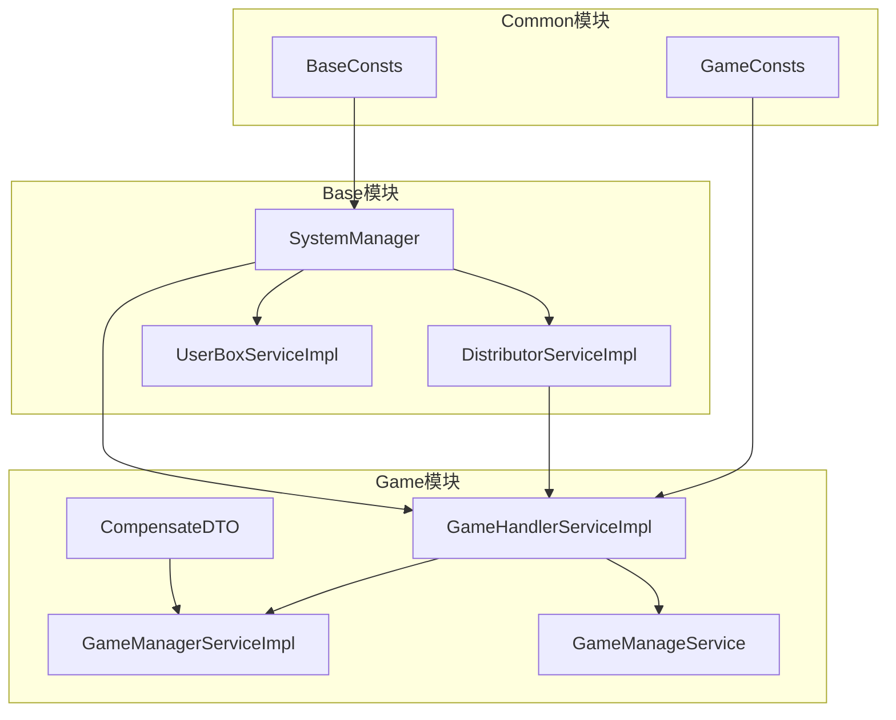
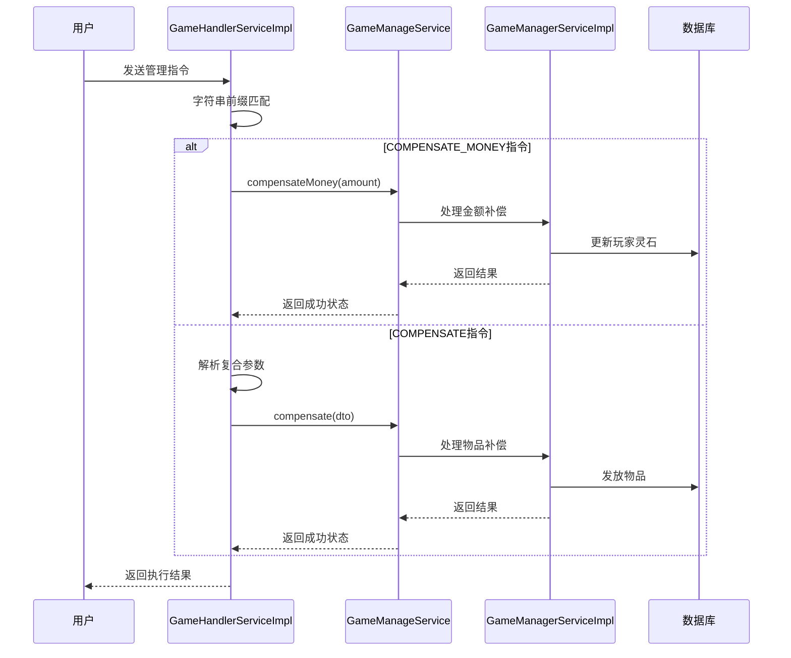
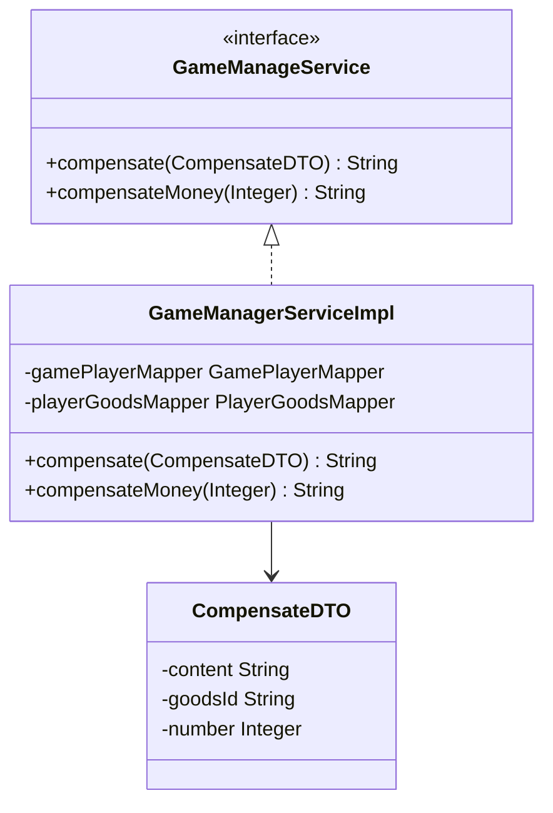
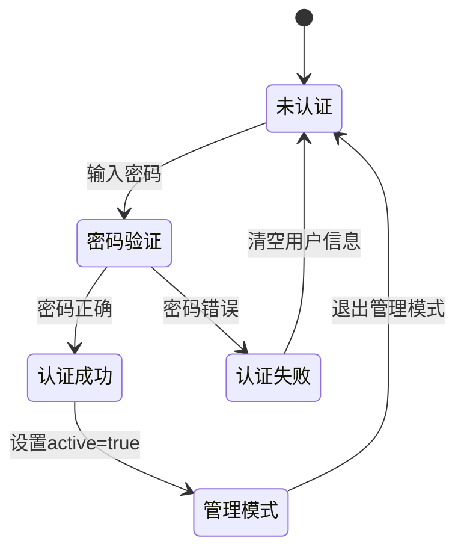
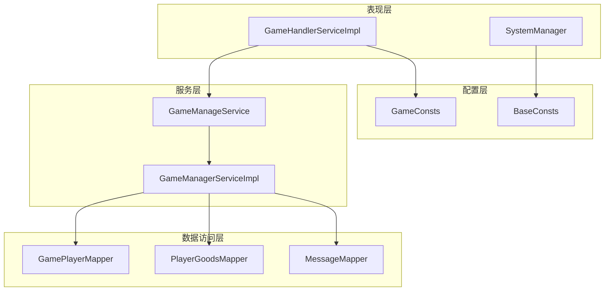

# 管理员功能

<cite>
**本文档引用的文件**
- [GameHandlerServiceImpl.java](file://Game/src/main/java/com/robot/game/service/impl/GameHandlerServiceImpl.java)
- [CompensateDTO.java](file://Game/src/main/java/com/robot/game/dto/CompensateDTO.java)
- [GameManageService.java](file://Game/src/main/java/com/robot/game/service/GameManageService.java)
- [GameManagerServiceImpl.java](file://Game/src/main/java/com/robot/game/service/impl/GameManagerServiceImpl.java)
- [GameConsts.java](file://Common/src/main/java/com/robot/common/constant/GameConsts.java)
- [BaseConsts.java](file://Common/src/main/java/com/robot/common/constant/BaseConsts.java)
- [SystemManager.java](file://Base/src/main/java/com/robot/base/service/SystemManager.java)
</cite>

## 目录
1. [简介](#简介)
2. [项目结构](#项目结构)
3. [核心组件](#核心组件)
4. [架构概览](#架构概览)
5. [详细组件分析](#详细组件分析)
6. [依赖关系分析](#依赖关系分析)
7. [性能考虑](#性能考虑)
8. [故障排除指南](#故障排除指南)
9. [结论](#结论)

## 简介

本文档全面介绍了Bot项目中的管理员指令处理系统，重点解析了`manage`方法如何通过字符串前缀匹配识别补偿指令，详细说明了COMPENSATE_MONEY指令的金额发放流程，以及COMPENSATE指令如何解析'内容||物品ID||数量'格式的复合参数并封装为CompensateDTO对象。同时，文档深入分析了gameManageService补偿服务的调用契约，包括参数验证、物品发放和错误码返回机制，并提供了管理员指令的安全性考虑和新增管理员命令的开发指南。

## 项目结构

Bot项目采用模块化架构，管理员功能分布在多个模块中：



**图表来源**
- [SystemManager.java](file://Base/src/main/java/com/robot/base/service/SystemManager.java#L34-L205)
- [GameHandlerServiceImpl.java](file://Game/src/main/java/com/robot/game/service/impl/GameHandlerServiceImpl.java#L1-L191)

**章节来源**
- [SystemManager.java](file://Base/src/main/java/com/robot/base/service/SystemManager.java#L1-L205)
- [GameHandlerServiceImpl.java](file://Game/src/main/java/com/robot/game/service/impl/GameHandlerServiceImpl.java#L1-L191)

## 核心组件

### 管理员指令处理器

管理员指令处理系统的核心是`GameHandlerServiceImpl`类中的`manage`方法，该方法负责识别和处理各种管理员指令。

### 补偿DTO对象

`CompensateDTO`类封装了补偿指令所需的所有参数，包括内容、物品ID和数量。

### 补偿服务接口

`GameManageService`接口定义了补偿服务的标准契约，包括`compensate`和`compensateMoney`两个主要方法。

**章节来源**
- [GameHandlerServiceImpl.java](file://Game/src/main/java/com/robot/game/service/impl/GameHandlerServiceImpl.java#L135-L149)
- [CompensateDTO.java](file://Game/src/main/java/com/robot/game/dto/CompensateDTO.java#L1-L19)
- [GameManageService.java](file://Game/src/main/java/com/robot/game/service/GameManageService.java#L1-L15)

## 架构概览

管理员指令处理系统采用分层架构设计，确保职责分离和可扩展性：



**图表来源**
- [GameHandlerServiceImpl.java](file://Game/src/main/java/com/robot/game/service/impl/GameHandlerServiceImpl.java#L135-L149)
- [GameManagerServiceImpl.java](file://Game/src/main/java/com/robot/game/service/impl/GameManagerServiceImpl.java#L38-L60)

## 详细组件分析

### 管理员指令识别机制

`GameHandlerServiceImpl`中的`manage`方法实现了基于字符串前缀的指令识别：

```mermaid
flowchart TD
Start([接收管理指令]) --> CheckPrefix{检查指令前缀}
CheckPrefix --> |COMPENSATE_MONEY| ParseMoney[解析金额参数]
CheckPrefix --> |COMPENSATE| ParseCompensate[解析复合参数]
ParseMoney --> CallMoneyService[调用compensateMoney服务]
ParseCompensate --> SplitParams[按'||'分割参数]
SplitParams --> CreateDTO[创建CompensateDTO对象]
CreateDTO --> CallCompensateService[调用compensate服务]
CallMoneyService --> ReturnResult[返回执行结果]
CallCompensateService --> ReturnResult
ReturnResult --> End([结束])
```

**图表来源**
- [GameHandlerServiceImpl.java](file://Game/src/main/java/com/robot/game/service/impl/GameHandlerServiceImpl.java#L135-L149)

#### COMPENSATE_MONEY指令处理

COMPENSATE_MONEY指令用于向所有玩家发放灵石补偿：

1. **指令格式**：`补偿灵石` + 金额
2. **参数解析**：移除"补偿灵石"前缀，转换为整数
3. **服务调用**：调用`gameManageService.compensateMoney(amount)`
4. **批量处理**：遍历所有玩家，统一增加指定金额的灵石

#### COMPENSATE指令处理

COMPENSATE指令用于向所有玩家发放指定物品补偿：

1. **指令格式**：`补偿` + 内容||物品ID||数量
2. **参数解析**：
   - 移除"补偿"前缀
   - 使用`||`分割为三个部分
   - 分别映射到CompensateDTO的content、goodsId和number字段
3. **对象封装**：创建CompensateDTO实例并填充参数
4. **服务调用**：调用`gameManageService.compensate(dto)`

**章节来源**
- [GameHandlerServiceImpl.java](file://Game/src/main/java/com/robot/game/service/impl/GameHandlerServiceImpl.java#L135-L149)

### CompensateDTO对象设计

CompensateDTO类采用简单的POJO设计，包含以下核心字段：

| 字段 | 类型 | 描述 | 必填 |
|------|------|------|------|
| content | String | 补偿消息内容 | 是 |
| goodsId | String | 物品唯一标识符 | 是 |
| number | Integer | 物品数量 | 是 |

该设计确保了补偿指令的灵活性和可扩展性。

**章节来源**
- [CompensateDTO.java](file://Game/src/main/java/com/robot/game/dto/CompensateDTO.java#L1-L19)

### gameManageService补偿服务契约

gameManageService定义了两个核心方法：



**图表来源**
- [GameManageService.java](file://Game/src/main/java/com/robot/game/service/GameManageService.java#L1-L15)
- [GameManagerServiceImpl.java](file://Game/src/main/java/com/robot/game/service/impl/GameManagerServiceImpl.java#L1-L60)

#### 参数验证机制

补偿服务实现了多层次的参数验证：

1. **空值检查**：确保CompensateDTO对象及其字段不为空
2. **数值验证**：验证物品数量为正整数
3. **业务规则**：检查物品ID的有效性和玩家状态

#### 物品发放流程

补偿服务的物品发放采用批量处理模式：

1. **玩家查询**：获取所有活跃玩家列表
2. **消息构建**：为每个玩家创建补偿消息
3. **附件封装**：将物品信息封装为AttachDTO
4. **消息发送**：通过SendMessageServiceImpl发送系统消息
5. **状态更新**：记录发放状态并返回结果

**章节来源**
- [GameManagerServiceImpl.java](file://Game/src/main/java/com/robot/game/service/impl/GameManagerServiceImpl.java#L38-L60)

### 系统级管理员功能

SystemManager类提供了系统级别的管理员功能，包括：

#### 密码验证机制



**图表来源**
- [SystemManager.java](file://Base/src/main/java/com/robot/base/service/SystemManager.java#L105-L116)

#### 管理模式生命周期

1. **进入模式**：验证用户身份，设置临时管理员状态
2. **指令分发**：根据指令类型调用相应的处理逻辑
3. **超时保护**：设置自动退出机制防止长期占用
4. **退出清理**：清除用户状态和临时数据

**章节来源**
- [SystemManager.java](file://Base/src/main/java/com/robot/base/service/SystemManager.java#L105-L205)

## 依赖关系分析

管理员功能模块的依赖关系体现了清晰的分层架构：



**图表来源**
- [GameHandlerServiceImpl.java](file://Game/src/main/java/com/robot/game/service/impl/GameHandlerServiceImpl.java#L1-L191)
- [SystemManager.java](file://Base/src/main/java/com/robot/base/service/SystemManager.java#L1-L205)

**章节来源**
- [GameHandlerServiceImpl.java](file://Game/src/main/java/com/robot/game/service/impl/GameHandlerServiceImpl.java#L1-L191)
- [SystemManager.java](file://Base/src/main/java/com/robot/base/service/SystemManager.java#L1-L205)

## 性能考虑

### 并发控制

系统采用了多种并发控制机制：

1. **单用户限制**：同一时间只允许一个用户处于管理模式
2. **超时保护**：自动清理长时间未操作的管理员会话
3. **线程安全**：使用volatile关键字确保用户状态的可见性

### 批量处理优化

补偿功能采用批量处理策略：

1. **数据库批处理**：一次性查询所有玩家，避免多次数据库交互
2. **消息队列**：通过SendMessageServiceImpl异步发送消息
3. **内存缓存**：利用Spring容器管理服务实例

### 内存管理

1. **对象池化**：复用CompensateDTO对象减少GC压力
2. **字符串优化**：使用StringBuilder构建长字符串
3. **资源释放**：及时清理临时变量和集合

## 故障排除指南

### 常见问题及解决方案

#### 指令识别失败

**症状**：发送补偿指令但未响应
**原因**：指令格式不正确或前缀匹配失败
**解决**：检查指令格式是否符合要求

#### 参数解析错误

**症状**：COMPENSATE指令报错
**原因**：参数格式不符合`内容||物品ID||数量`格式
**解决**：确保使用`||`作为分隔符，且参数顺序正确

#### 权限验证失败

**症状**：无法进入管理模式
**原因**：密码错误或已有其他管理员
**解决**：确认密码正确，或等待现有管理员退出

#### 补偿发放失败

**症状**：补偿指令执行但玩家未收到物品
**原因**：玩家状态异常或物品ID无效
**解决**：检查玩家状态和物品配置

**章节来源**
- [GameHandlerServiceImpl.java](file://Game/src/main/java/com/robot/game/service/impl/GameHandlerServiceImpl.java#L135-L149)
- [SystemManager.java](file://Base/src/main/java/com/robot/base/service/SystemManager.java#L105-L116)

## 结论

Bot项目的管理员指令处理系统展现了良好的软件架构设计原则：

1. **职责分离**：不同层次承担不同职责，便于维护和扩展
2. **接口抽象**：通过GameManageService接口实现服务解耦
3. **参数验证**：多层次的验证机制确保系统稳定性
4. **安全性考虑**：密码验证和超时保护机制保障系统安全
5. **可扩展性**：模块化设计支持新功能的快速集成

该系统为Bot项目提供了强大而灵活的管理功能，能够满足各种运营需求，同时保持了良好的性能和可维护性。对于开发者而言，理解这套设计模式有助于构建类似的管理系统。