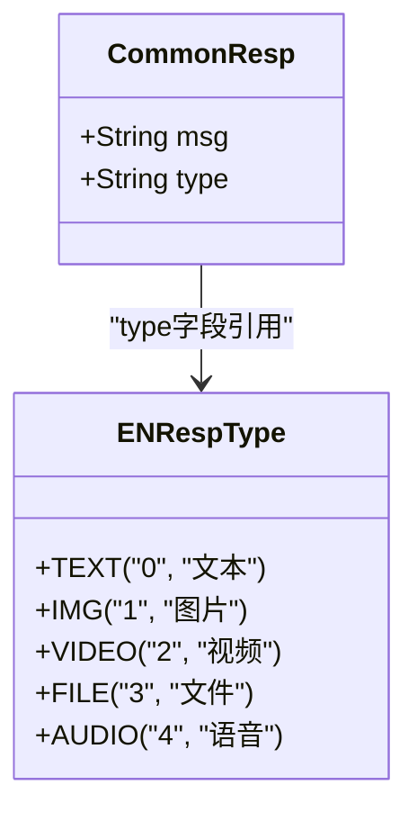
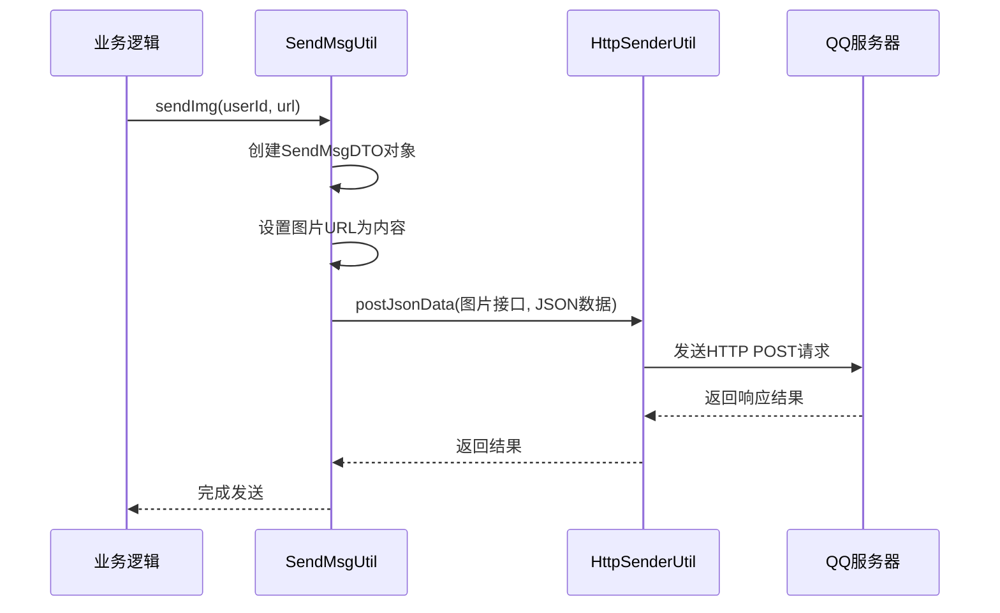
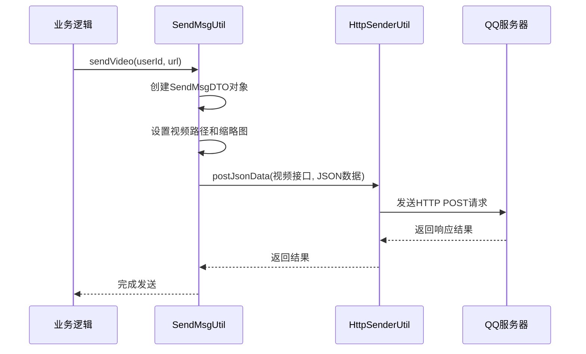
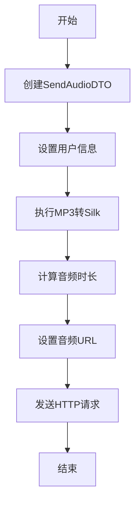
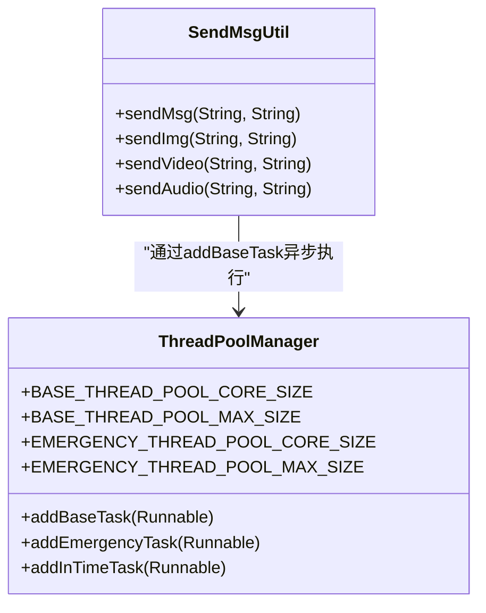
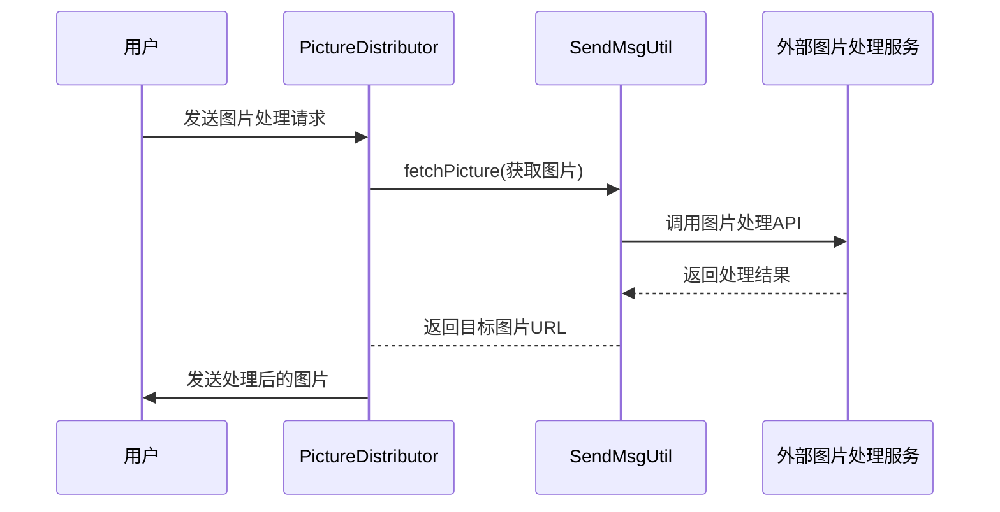
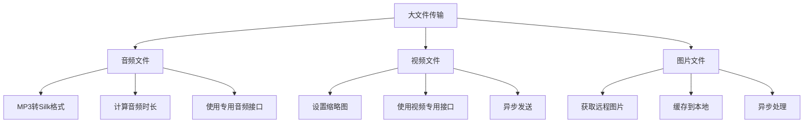
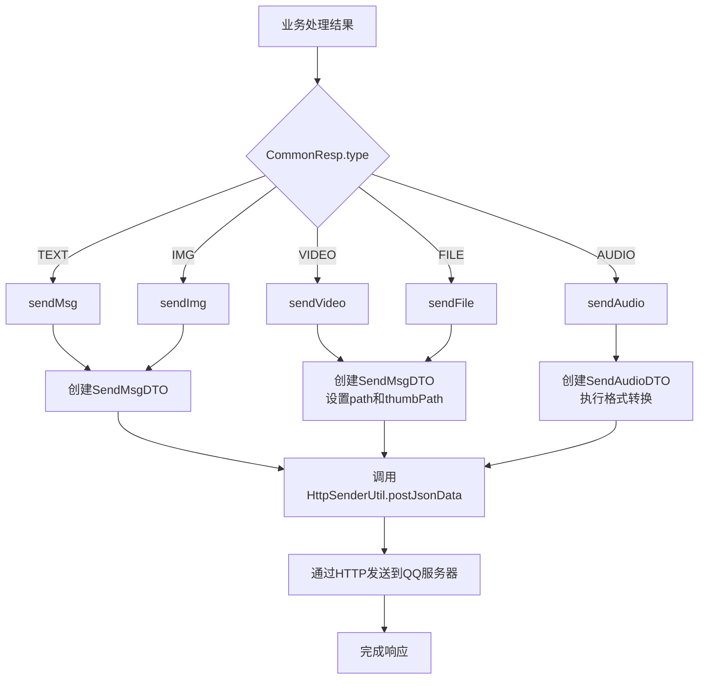
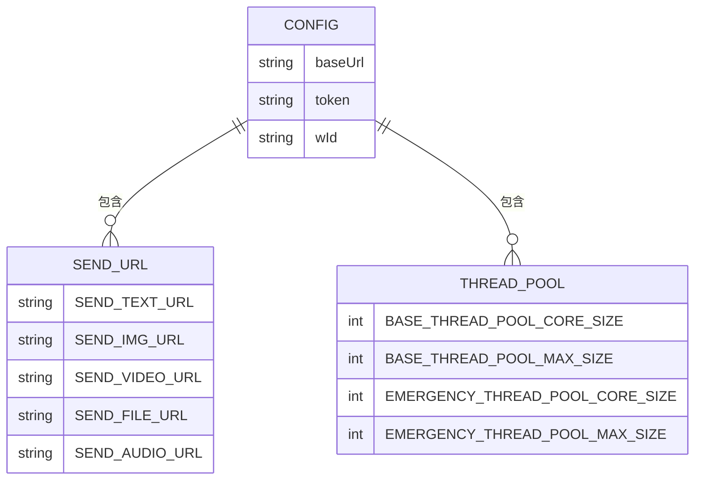

# 响应生成

<cite>
**本文档引用的文件**   
- [SendMsgUtil.java](file://Common/src/main/java/com/bot/common/util/SendMsgUtil.java)
- [ThreadPoolManager.java](file://Common/src/main/java/com/bot/common/util/ThreadPoolManager.java)
- [CommonResp.java](file://Base/src/main/java/com/bot/base/dto/CommonResp.java)
- [ENRespType.java](file://Common/src/main/java/com/bot/common/enums/ENRespType.java)
- [HttpSenderUtil.java](file://Common/src/main/java/com/bot/common/util/HttpSenderUtil.java)
- [SystemConfigCache.java](file://Common/src/main/java/com/bot/common/config/SystemConfigCache.java)
- [SendMsgDTO.java](file://Common/src/main/java/com/bot/common/dto/SendMsgDTO.java)
- [SendGroupDTO.java](file://Common/src/main/java/com/bot/common/dto/SendGroupDTO.java)
- [SendAudioDTO.java](file://Common/src/main/java/com/bot/common/dto/SendAudioDTO.java)
- [SendEmojiDTO.java](file://Common/src/main/java/com/bot/common/dto/SendEmojiDTO.java)
- [SendCardDTO.java](file://Common/src/main/java/com/bot/common/dto/SendCardDTO.java)
- [AudioTransUtil.java](file://Common/src/main/java/com/bot/common/util/AudioTransUtil.java)
- [PictureDistributorServiceImpl.java](file://Base/src/main/java/com/bot/base/service/impl/PictureDistributorServiceImpl.java)
- [ImageGenerationService.java](file://Life/src/main/java/com/bot/life/service/ImageGenerationService.java)
</cite>

## 目录
1. [简介](#简介)
2. [响应生成核心机制](#响应生成核心机制)
3. [CommonResp对象与响应类型](#commonresp对象与响应类型)
4. [消息发送方法实现细节](#消息发送方法实现细节)
5. [异步发送机制](#异步发送机制)
6. [图片生成服务集成](#图片生成服务集成)
7. [大文件传输优化策略](#大文件传输优化策略)
8. [响应生成流程图](#响应生成流程图)
9. [开发者指南](#开发者指南)
10. [附录](#附录)

## 简介
本项目通过SendMsgUtil工具类实现业务处理结果到QQ可识别响应消息的转换。系统采用CommonResp对象作为统一响应格式，通过type字段区分不同响应类型，并利用ThreadPoolManager实现异步消息发送。文档详细说明了文本、图片、视频、语音等消息的发送机制，以及图片生成服务的集成方式和大文件传输的优化策略。

## 响应生成核心机制
响应生成机制的核心是将业务处理结果转换为QQ可识别的消息格式。系统通过CommonResp对象封装响应内容和类型，由SendMsgUtil根据类型调用相应的发送方法。整个流程包括响应类型判断、消息格式封装、媒体文件处理和异步发送执行。

**Section sources**
- [SendMsgUtil.java](file://Common/src/main/java/com/bot/common/util/SendMsgUtil.java#L1-L274)
- [CommonResp.java](file://Base/src/main/java/com/bot/base/dto/CommonResp.java#L6-L18)

## CommonResp对象与响应类型
CommonResp对象是响应生成的核心数据结构，包含msg和type两个字段。其中type字段决定了最终的响应方式，通过ENRespType枚举定义了多种响应类型。

**Diagram sources **
- [CommonResp.java](file://Base/src/main/java/com/bot/base/dto/CommonResp.java#L6-L18)
- [ENRespType.java](file://Common/src/main/java/com/bot/common/enums/ENRespType.java#L8-L14)

**Section sources**
- [CommonResp.java](file://Base/src/main/java/com/bot/base/dto/CommonResp.java#L6-L18)
- [ENRespType.java](file://Common/src/main/java/com/bot/common/enums/ENRespType.java#L8-L21)

## 消息发送方法实现细节
SendMsgUtil类提供了多种消息发送方法，每种方法针对不同的消息类型进行专门的格式封装和处理。

### 文本消息发送
sendMsg方法用于发送纯文本消息，通过SendMsgDTO封装消息内容、用户ID和机器人ID，然后通过HTTP POST请求发送到指定的文本消息接口。

**Diagram sources **
- [SendMsgUtil.java](file://Common/src/main/java/com/bot/common/util/SendMsgUtil.java#L27-L37)
- [SendMsgDTO.java](file://Common/src/main/java/com/bot/common/dto/SendMsgDTO.java#L8-L22)
- [HttpSenderUtil.java](file://Common/src/main/java/com/bot/common/util/HttpSenderUtil.java#L168-L186)

### 图片消息发送
sendImg方法用于发送图片消息，将图片URL作为消息内容封装在SendMsgDTO中，通过图片发送接口发送。

**Diagram sources **
- [SendMsgUtil.java](file://Common/src/main/java/com/bot/common/util/SendMsgUtil.java#L51-L61)
- [SendMsgDTO.java](file://Common/src/main/java/com/bot/common/dto/SendMsgDTO.java#L8-L22)
- [HttpSenderUtil.java](file://Common/src/main/java/com/bot/common/util/HttpSenderUtil.java#L168-L186)

### 视频消息发送
sendVideo方法用于发送视频消息，通过SendMsgDTO的path字段传递视频文件路径，并设置缩略图路径。

**Diagram sources **
- [SendMsgUtil.java](file://Common/src/main/java/com/bot/common/util/SendMsgUtil.java#L101-L113)
- [SendMsgDTO.java](file://Common/src/main/java/com/bot/common/dto/SendMsgDTO.java#L8-L22)
- [HttpSenderUtil.java](file://Common/src/main/java/com/bot/common/util/HttpSenderUtil.java#L168-L186)

### 语音消息发送
sendAudio方法用于发送语音消息，包含音频格式转换和时长计算等特殊处理。

**Diagram sources **
- [SendMsgUtil.java](file://Common/src/main/java/com/bot/common/util/SendMsgUtil.java#L63-L84)
- [SendAudioDTO.java](file://Common/src/main/java/com/bot/common/dto/SendAudioDTO.java#L10-L20)
- [AudioTransUtil.java](file://Common/src/main/java/com/bot/common/util/AudioTransUtil.java#L12-L27)

**Section sources**
- [SendMsgUtil.java](file://Common/src/main/java/com/bot/common/util/SendMsgUtil.java#L27-L142)
- [SendMsgDTO.java](file://Common/src/main/java/com/bot/common/dto/SendMsgDTO.java#L8-L22)
- [SendGroupDTO.java](file://Common/src/main/java/com/bot/common/dto/SendGroupDTO.java#L8-L25)
- [SendAudioDTO.java](file://Common/src/main/java/com/bot/common/dto/SendAudioDTO.java#L10-L20)
- [SendEmojiDTO.java](file://Common/src/main/java/com/bot/common/dto/SendEmojiDTO.java#L9-L19)
- [SendCardDTO.java](file://Common/src/main/java/com/bot/common/dto/SendCardDTO.java#L8-L16)

## 异步发送机制
系统采用ThreadPoolManager实现消息的异步发送，避免阻塞主线程，提高系统响应性能。

**Diagram sources **
- [ThreadPoolManager.java](file://Common/src/main/java/com/bot/common/util/ThreadPoolManager.java#L13-L124)
- [SendMsgUtil.java](file://Common/src/main/java/com/bot/common/util/SendMsgUtil.java#L27-L142)

**Section sources**
- [ThreadPoolManager.java](file://Common/src/main/java/com/bot/common/util/ThreadPoolManager.java#L13-L124)

## 图片生成服务集成
系统通过PictureDistributorServiceImpl和ImageGenerationService实现图片生成服务的集成，支持将普通图片转换为线稿等特殊处理。

**Diagram sources **
- [PictureDistributorServiceImpl.java](file://Base/src/main/java/com/bot/base/service/impl/PictureDistributorServiceImpl.java#L20-L48)
- [SendMsgUtil.java](file://Common/src/main/java/com/bot/common/util/SendMsgUtil.java#L172-L188)
- [ImageGenerationService.java](file://Life/src/main/java/com/bot/life/service/ImageGenerationService.java#L9-L39)

**Section sources**
- [PictureDistributorServiceImpl.java](file://Base/src/main/java/com/bot/base/service/impl/PictureDistributorServiceImpl.java#L20-L48)
- [ImageGenerationService.java](file://Life/src/main/java/com/bot/life/service/ImageGenerationService.java#L9-L39)
- [Life_Image_Service_Update.md](file://Life_Image_Service_Update.md#L1-L135)

## 大文件传输优化策略
系统通过多种策略优化大文件传输，包括音频格式转换、文件路径管理、异步处理等。

**Diagram sources **
- [SendMsgUtil.java](file://Common/src/main/java/com/bot/common/util/SendMsgUtil.java#L63-L84)
- [AudioTransUtil.java](file://Common/src/main/java/com/bot/common/util/AudioTransUtil.java#L12-L61)
- [SendMsgUtil.java](file://Common/src/main/java/com/bot/common/util/SendMsgUtil.java#L101-L113)

**Section sources**
- [AudioTransUtil.java](file://Common/src/main/java/com/bot/common/util/AudioTransUtil.java#L12-L61)

## 响应生成流程图
以下流程图展示了不同响应类型的处理路径：

**Diagram sources **
- [SendMsgUtil.java](file://Common/src/main/java/com/bot/common/util/SendMsgUtil.java#L27-L142)
- [CommonResp.java](file://Base/src/main/java/com/bot/base/dto/CommonResp.java#L6-L18)
- [ENRespType.java](file://Common/src/main/java/com/bot/common/enums/ENRespType.java#L8-L14)

## 开发者指南
### 添加新的响应类型
要添加新的响应类型，需要执行以下步骤：
1. 在ENRespType枚举中添加新的类型
2. 创建对应的DTO类（如果需要）
3. 在SendMsgUtil中添加新的发送方法
4. 更新相关业务逻辑以支持新类型

### 调试消息发送失败问题
常见问题及解决方案：
- **网络连接问题**：检查baseUrl配置和网络连接
- **认证失败**：验证token是否正确
- **文件路径错误**：确认文件路径和URL格式
- **格式转换失败**：检查音频转换工具和文件权限

### 优化高频率消息发送性能
性能优化建议：
- 使用ThreadPoolManager进行异步发送
- 合理配置线程池大小
- 批量处理相似请求
- 缓存常用响应内容

**Section sources**
- [SendMsgUtil.java](file://Common/src/main/java/com/bot/common/util/SendMsgUtil.java#L27-L142)
- [ThreadPoolManager.java](file://Common/src/main/java/com/bot/common/util/ThreadPoolManager.java#L13-L124)
- [ENRespType.java](file://Common/src/main/java/com/bot/common/enums/ENRespType.java#L8-L14)

## 附录
### 配置参数说明

**Diagram sources **
- [SystemConfigCache.java](file://Common/src/main/java/com/bot/common/config/SystemConfigCache.java#L11-L115)

**Section sources**
- [SystemConfigCache.java](file://Common/src/main/java/com/bot/common/config/SystemConfigCache.java#L11-L115)