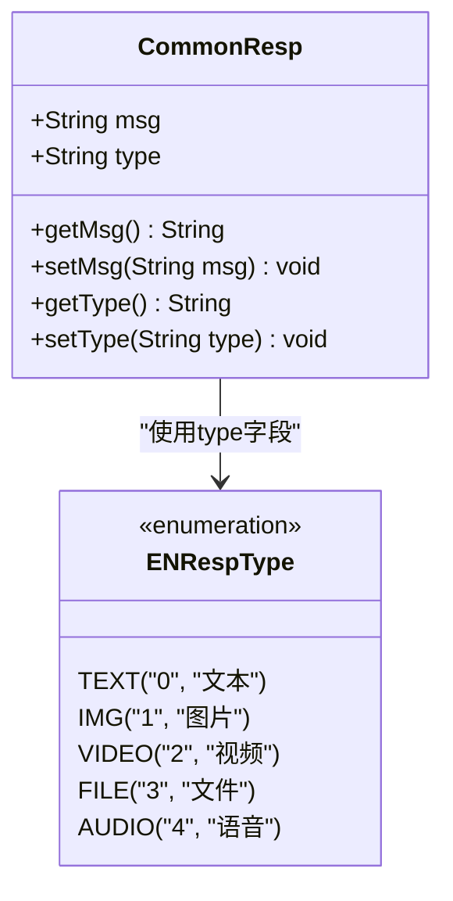
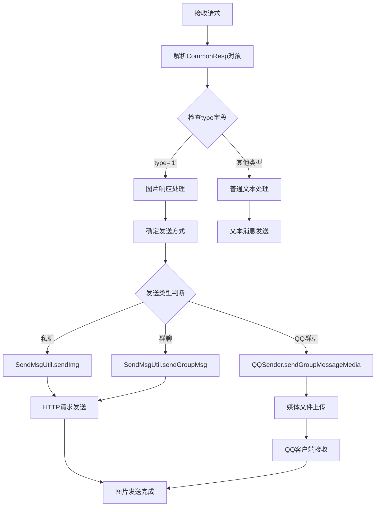
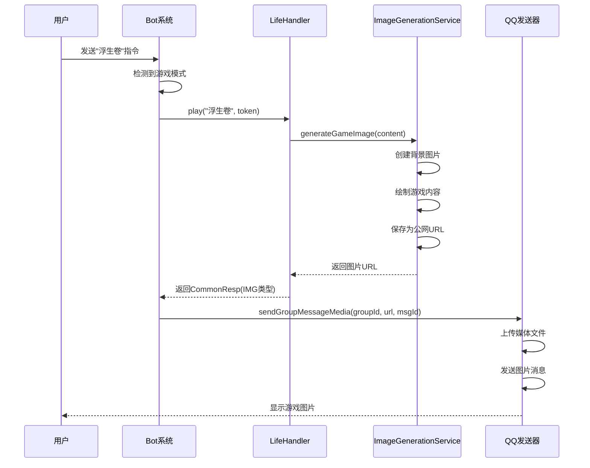
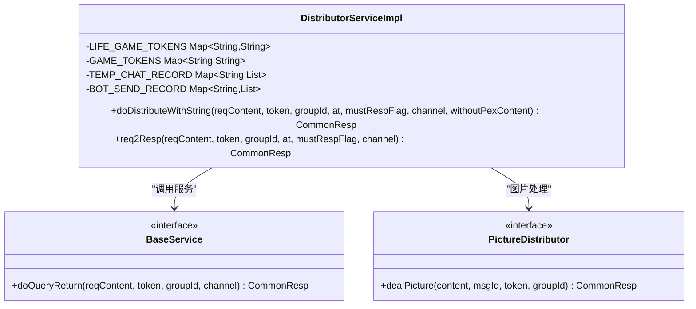
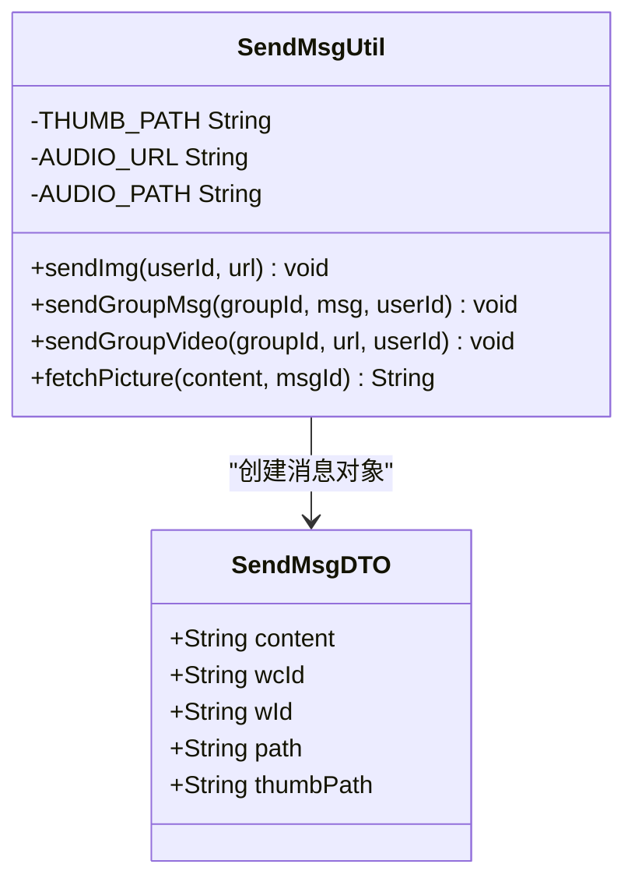
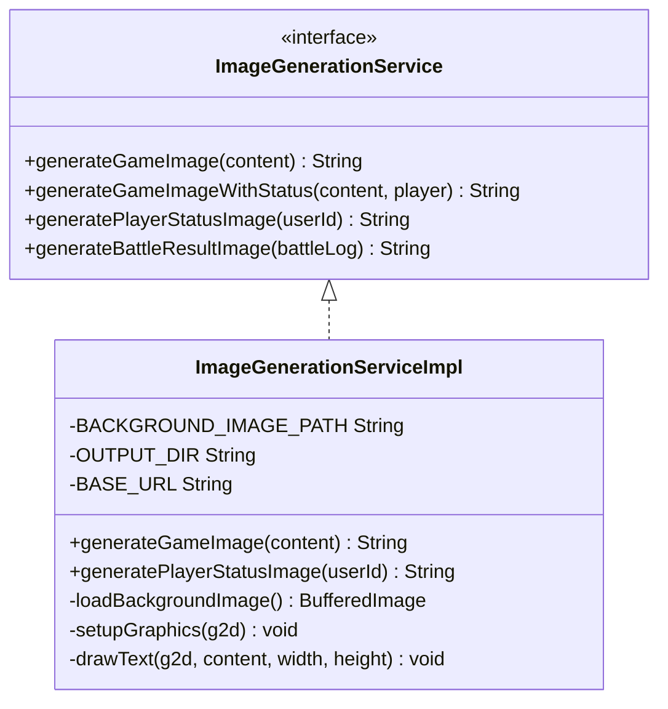
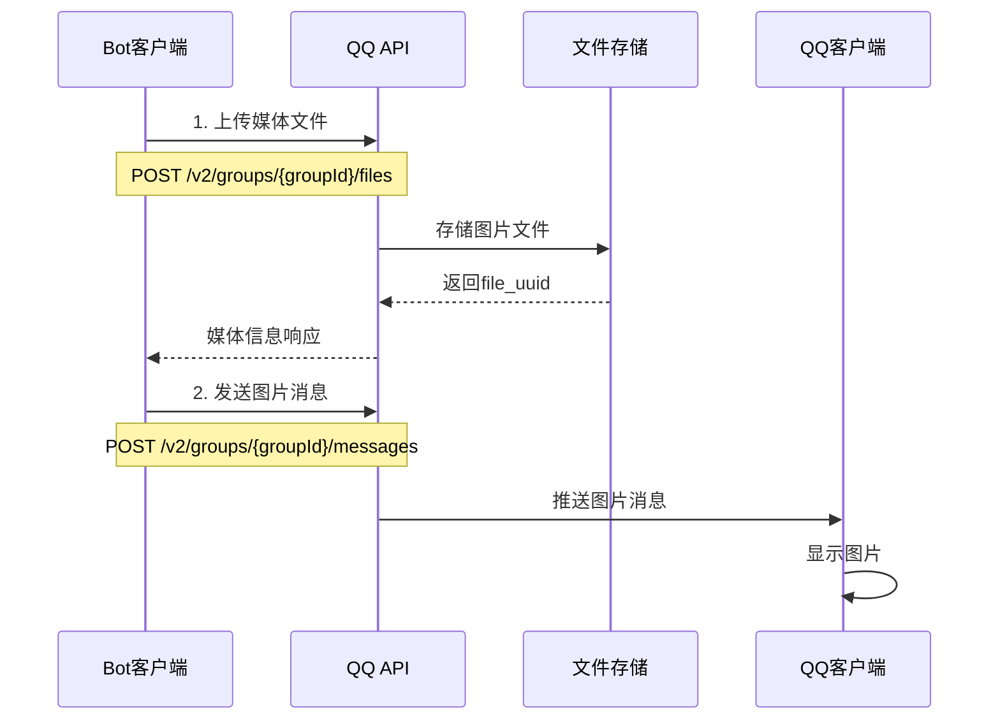
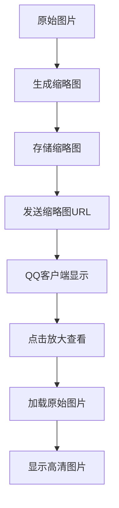
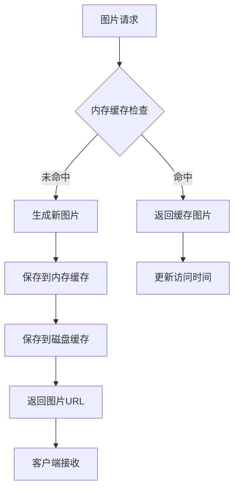
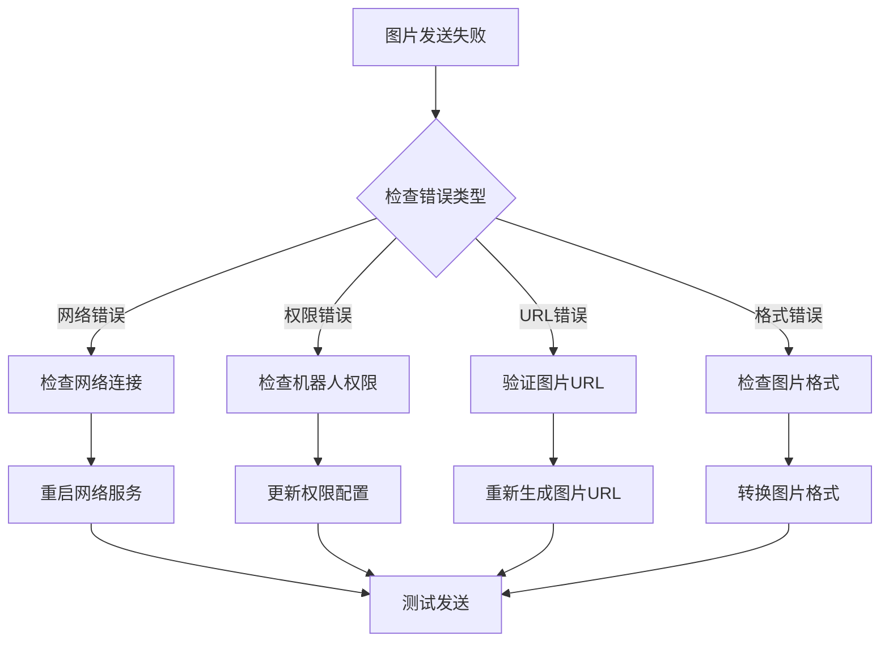

# Bot项目图片响应处理文档

<cite>
**本文档引用的文件**
- [CommonResp.java](file://Base/src/main/java/com/bot/base/dto/CommonResp.java)
- [DistributorServiceImpl.java](file://Base/src/main/java/com/bot/base/service/impl/DistributorServiceImpl.java)
- [SendMsgUtil.java](file://Common/src/main/java/com/bot/common/util/SendMsgUtil.java)
- [PictureDistributorServiceImpl.java](file://Base/src/main/java/com/bot/base/service/impl/PictureDistributorServiceImpl.java)
- [ImageGenerationServiceImpl.java](file://Life/src/main/java/com/bot/life/service/impl/ImageGenerationServiceImpl.java)
- [QQSender.java](file://Common/src/main/java/com/bot/common/util/QQSender.java)
- [ENRespType.java](file://Common/src/main/java/com/bot/common/enums/ENRespType.java)
- [newInstructDistributeController.java](file://Boot/src/main/java/com/bot/boot/controller/newInstructDistributeController.java)
- [CPServiceImpl.java](file://Base/src/main/java/com/bot/base/service/impl/CPServiceImpl.java)
- [ActivityServiceImpl.java](file://Base/src/main/java/com/bot/base/service/impl/ActivityServiceImpl.java)
</cite>

## 目录
1. [概述](#概述)
2. [CommonResp对象结构](#commonresp对象结构)
3. [图片响应处理流程](#图片响应处理流程)
4. [核心组件分析](#核心组件分析)
5. [图片生成服务集成](#图片生成服务集成)
6. [QQ客户端图片发送机制](#qq客户端图片发送机制)
7. [缓存策略与性能优化](#缓存策略与性能优化)
8. [开发者指南](#开发者指南)
9. [故障排除](#故障排除)
10. [总结](#总结)

## 概述

Bot项目实现了完整的图片响应处理系统，支持多种图片生成方式和发送机制。当CommonResp对象的type字段为IMG时，系统会触发专门的图片处理流程，包括图片生成、缓存管理、QQ客户端发送等功能。

## CommonResp对象结构

CommonResp是Bot项目中用于统一响应数据的对象，其结构设计支持多种响应类型：



**图表来源**
- [CommonResp.java](file://Base/src/main/java/com/bot/base/dto/CommonResp.java#L6-L18)
- [ENRespType.java](file://Common/src/main/java/com/bot/common/enums/ENRespType.java#L8-L20)

**节来源**
- [CommonResp.java](file://Base/src/main/java/com/bot/base/dto/CommonResp.java#L1-L20)
- [ENRespType.java](file://Common/src/main/java/com/bot/common/enums/ENRespType.java#L1-L20)

## 图片响应处理流程

### 流程概览

当系统检测到CommonResp对象的type字段为"1"（IMG类型）时，会启动以下处理流程：



**图表来源**
- [DistributorServiceImpl.java](file://Base/src/main/java/com/bot/base/service/impl/DistributorServiceImpl.java#L124-L192)
- [SendMsgUtil.java](file://Common/src/main/java/com/bot/common/util/SendMsgUtil.java#L50-L60)

### 浮生卷游戏场景处理

在浮生卷游戏中，当玩家触发特定指令时，系统会生成相应的图片并返回：



**图表来源**
- [DistributorServiceImpl.java](file://Base/src/main/java/com/bot/base/service/impl/DistributorServiceImpl.java#L281-L285)
- [ImageGenerationServiceImpl.java](file://Life/src/main/java/com/bot/life/service/impl/ImageGenerationServiceImpl.java#L44-L70)

**节来源**
- [DistributorServiceImpl.java](file://Base/src/main/java/com/bot/base/service/impl/DistributorServiceImpl.java#L268-L285)
- [ImageGenerationServiceImpl.java](file://Life/src/main/java/com/bot/life/service/impl/ImageGenerationServiceImpl.java#L1-L305)

## 核心组件分析

### DistributorServiceImpl - 请求分发器

DistributorServiceImpl是整个系统的请求分发中心，负责识别和处理不同类型的请求：



**图表来源**
- [DistributorServiceImpl.java](file://Base/src/main/java/com/bot/base/service/impl/DistributorServiceImpl.java#L38-L414)

### SendMsgUtil - 消息发送工具

SendMsgUtil提供了多种消息发送方法，其中sendImg方法专门处理图片发送：



**图表来源**
- [SendMsgUtil.java](file://Common/src/main/java/com/bot/common/util/SendMsgUtil.java#L17-L274)

**节来源**
- [DistributorServiceImpl.java](file://Base/src/main/java/com/bot/base/service/impl/DistributorServiceImpl.java#L38-L414)
- [SendMsgUtil.java](file://Common/src/main/java/com/bot/common/util/SendMsgUtil.java#L17-L274)

## 图片生成服务集成

### 浮生卷图片生成服务

ImageGenerationServiceImpl是浮生卷游戏的核心图片生成服务：



**图表来源**
- [ImageGenerationServiceImpl.java](file://Life/src/main/java/com/bot/life/service/impl/ImageGenerationServiceImpl.java#L1-L305)

### 第三方图片生成服务

系统集成了多个第三方图片生成服务：

| 服务名称 | 功能描述 | 配置参数 | 返回格式 |
|---------|---------|---------|---------|
| CP服务 | 生成CP配对图片 | name1, name2, type | 图片URL |
| Picture服务 | 图片转线稿 | url参数 | 线稿图片URL |
| Life服务 | 游戏状态图片 | content, player信息 | 游戏状态图 |

**节来源**
- [ImageGenerationServiceImpl.java](file://Life/src/main/java/com/bot/life/service/impl/ImageGenerationServiceImpl.java#L1-L305)
- [CPServiceImpl.java](file://Base/src/main/java/com/bot/base/service/impl/CPServiceImpl.java#L1-L39)

## QQ客户端图片发送机制

### 媒体文件上传流程

QQ客户端的图片发送采用了两阶段上传机制：



**图表来源**
- [QQSender.java](file://Common/src/main/java/com/bot/common/util/QQSender.java#L81-L100)

### 缩略图处理机制

系统在发送图片时会自动生成缩略图以优化传输性能：



**节来源**
- [QQSender.java](file://Common/src/main/java/com/bot/common/util/QQSender.java#L1-L104)
- [SendMsgUtil.java](file://Common/src/main/java/com/bot/common/util/SendMsgUtil.java#L100-L142)

## 缓存策略与性能优化

### 图片缓存机制

系统实现了多层缓存策略来提升图片生成和传输性能：



### 性能优化策略

1. **异步处理**: 图片生成采用异步方式，避免阻塞主线程
2. **连接池管理**: HTTP请求使用连接池提高并发性能
3. **图片压缩**: 自动压缩图片大小，减少传输时间
4. **CDN加速**: 使用公网URL直接访问，减轻服务器压力

**节来源**
- [PictureDistributorServiceImpl.java](file://Base/src/main/java/com/bot/base/service/impl/PictureDistributorServiceImpl.java#L21-L49)
- [ActivityServiceImpl.java](file://Base/src/main/java/com/bot/base/service/impl/ActivityServiceImpl.java#L277-L305)

## 开发者指南

### 添加新的图片生成功能

1. **实现ImageGenerationService接口**
   ```java
   @Service
   public class NewImageService implements ImageGenerationService {
       @Override
       public String generateGameImage(String content) {
           // 实现图片生成逻辑
           return "http://your-domain.com/images/generated.png";
       }
   }
   ```

2. **注册服务到Spring容器**
   在application.properties中添加配置：
   ```
   spring.application.name=com.yourcompany.service.NewImageService
   ```

3. **测试图片发送**
   ```java
   CommonResp resp = new CommonResp(imageUrl, ENRespType.IMG.getType());
   SendMsgUtil.sendImg(userId, imageUrl);
   ```

### 调试图片发送失败问题

常见问题及解决方案：

| 问题类型 | 症状 | 解决方案 |
|---------|------|---------|
| 网络超时 | 图片发送失败 | 检查网络连接，增加超时时间 |
| URL无效 | 图片无法显示 | 验证图片URL的有效性 |
| 权限不足 | 上传被拒绝 | 检查QQ机器人权限配置 |
| 文件过大 | 上传失败 | 压缩图片或分块上传 |

### 优化图片传输性能

1. **启用图片压缩**
   ```java
   // 在图片生成时进行压缩
   ImageIO.write(compressedImage, "jpg", outputStream);
   ```

2. **使用CDN加速**
   ```java
   // 将图片上传到CDN
   String cdnUrl = uploadToCDN(imageFile);
   ```

3. **实现图片预加载**
   ```java
   // 提前生成常用图片
   executorService.submit(() -> preGenerateImages());
   ```

## 故障排除

### 常见问题诊断



### 日志分析要点

1. **请求日志**: 检查请求参数和响应状态
2. **错误日志**: 分析异常堆栈信息
3. **性能日志**: 监控图片生成和传输耗时
4. **资源日志**: 跟踪内存和磁盘使用情况

## 总结

Bot项目的图片响应系统是一个功能完整、架构清晰的解决方案。通过CommonResp对象的type字段识别图片响应，系统能够灵活地处理各种图片生成和发送需求。

主要特点包括：
- **统一响应格式**: CommonResp确保所有响应的一致性
- **多服务集成**: 支持多种图片生成服务
- **高效传输**: QQ客户端优化的图片发送机制
- **智能缓存**: 多层缓存策略提升性能
- **易于扩展**: 模块化设计便于添加新功能

该系统为Bot项目提供了强大的图片处理能力，支持游戏、聊天等多种场景下的图片需求，是Bot项目功能完整性的重要保障。