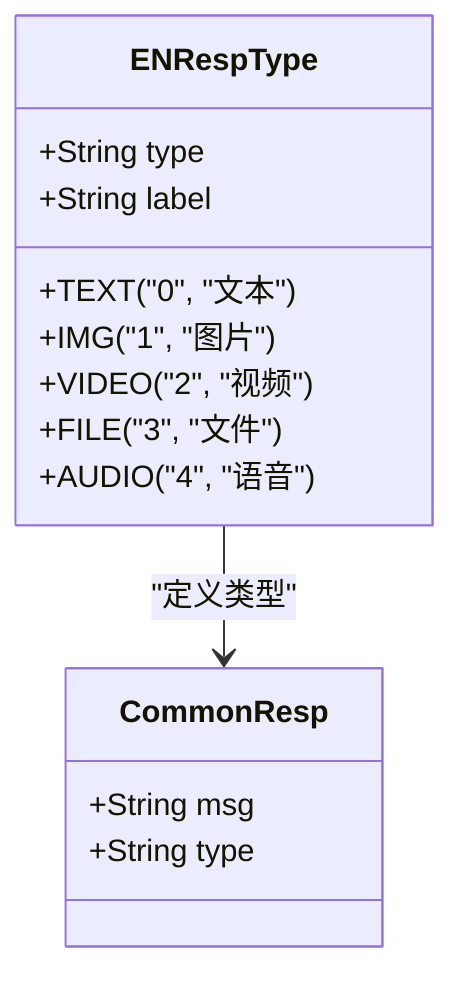
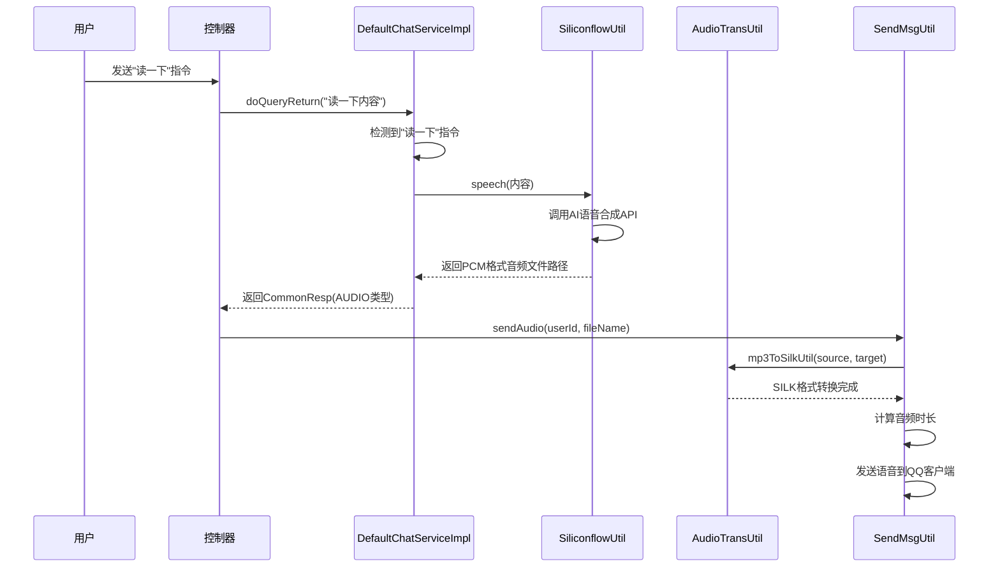
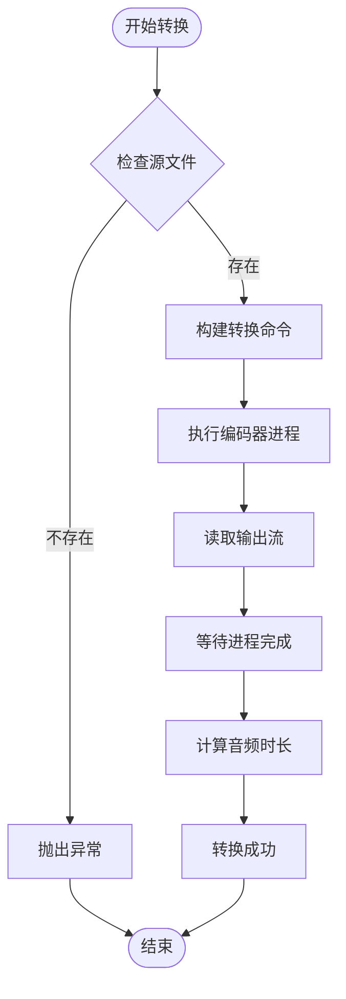
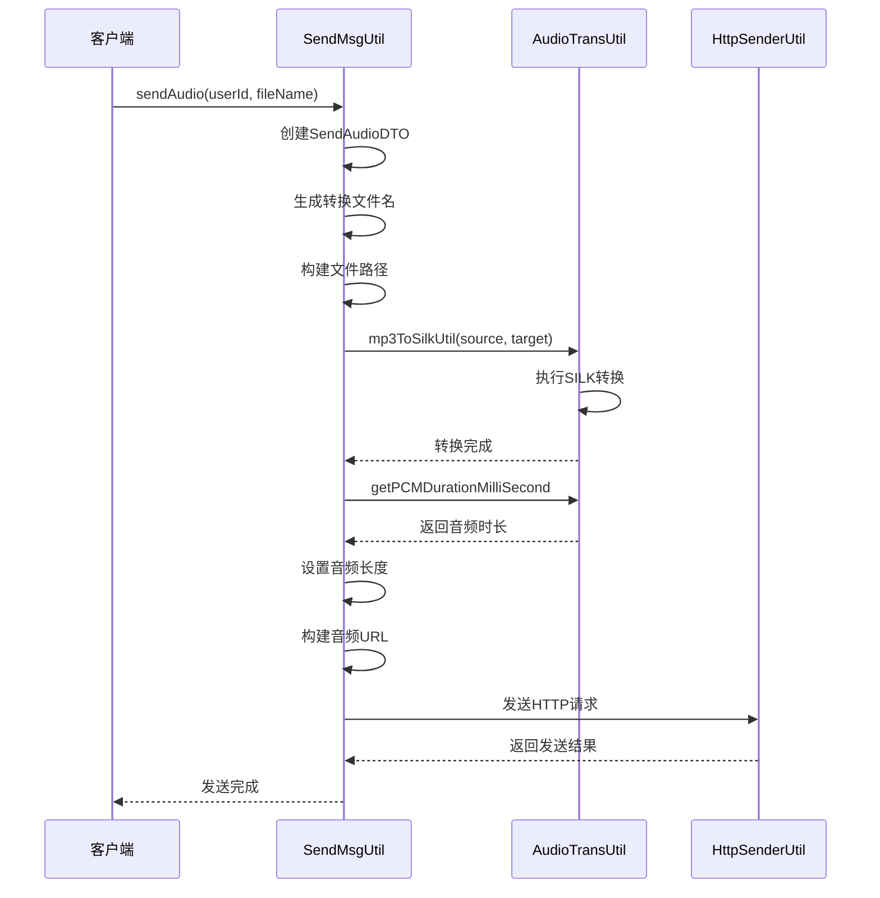
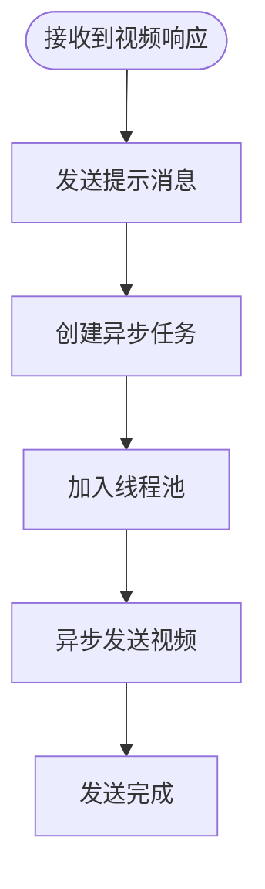
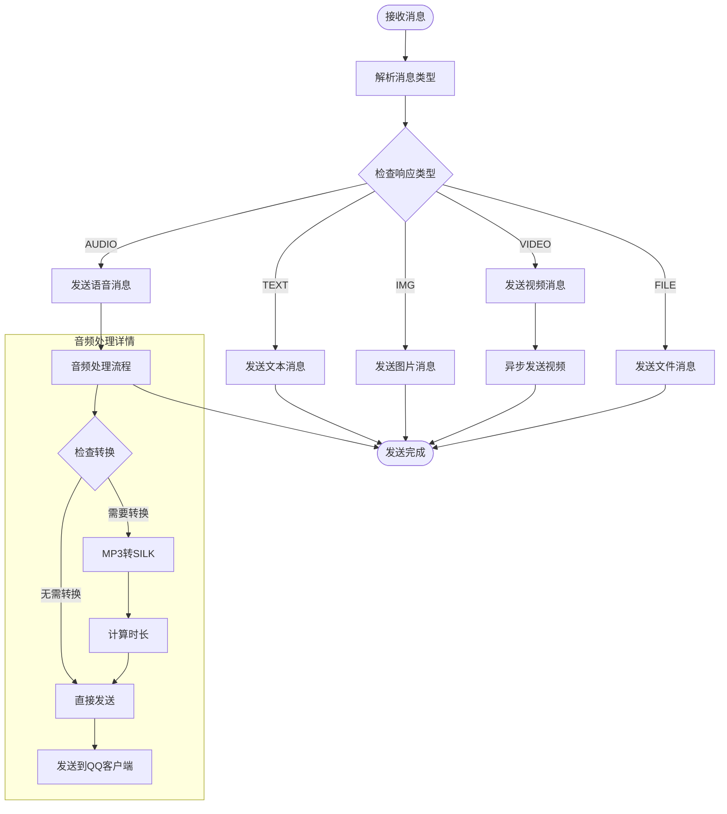
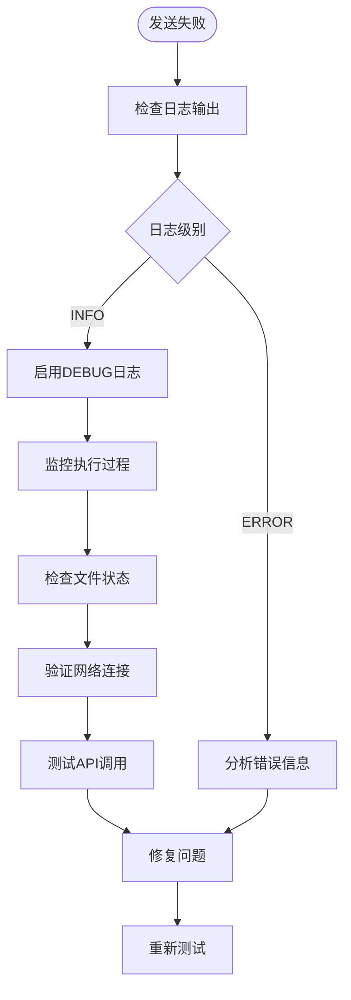

# Bot项目多媒体响应文档

<cite>
**本文档引用的文件**
- [CommonResp.java](file://Base/src/main/java/com/bot/base/dto/CommonResp.java)
- [ENRespType.java](file://Common/src/main/java/com/bot/common/enums/ENRespType.java)
- [DefaultChatServiceImpl.java](file://Base/src/main/java/com/bot/base/service/impl/DefaultChatServiceImpl.java)
- [SendMsgUtil.java](file://Common/src/main/java/com/bot/common/util/SendMsgUtil.java)
- [AudioTransUtil.java](file://Common/src/main/java/com/bot/common/util/AudioTransUtil.java)
- [SiliconflowUtil.java](file://Base/src/main/java/com/bot/base/util/SiliconflowUtil.java)
- [newInstructDistributeController.java](file://Boot/src/main/java/com/bot/boot/controller/newInstructDistributeController.java)
- [DistributorServiceImpl.java](file://Base/src/main/java/com/bot/base/service/impl/DistributorServiceImpl.java)
- [QQSender.java](file://Common/src/main/java/com/bot/common/util/QQSender.java)
- [SweetServiceImpl.java](file://Base/src/main/java/com/bot/base/service/impl/SweetServiceImpl.java)
- [DogServiceImpl.java](file://Base/src/main/java/com/bot/base/service/impl/DogServiceImpl.java)
</cite>

## 目录
1. [概述](#概述)
2. [多媒体响应类型定义](#多媒体响应类型定义)
3. [CommonResp对象结构分析](#commonresp对象结构分析)
4. [语音响应处理流程](#语音响应处理流程)
5. [音频格式转换机制](#音频格式转换机制)
6. [多媒体发送方法详解](#多媒体发送方法详解)
7. [响应处理流程图](#响应处理流程图)
8. [开发者指南](#开发者指南)
9. [故障排除](#故障排除)
10. [性能优化建议](#性能优化建议)

## 概述

Bot项目实现了完整的多媒体响应功能，支持文本、图片、视频、文件和语音等多种媒体类型的响应。系统通过统一的CommonResp对象封装响应内容，并根据不同媒体类型采用相应的处理和传输策略。

## 多媒体响应类型定义

系统定义了五种基本的响应类型，通过ENRespType枚举进行管理：



**图表来源**
- [ENRespType.java](file://Common/src/main/java/com/bot/common/enums/ENRespType.java#L8-L18)
- [CommonResp.java](file://Base/src/main/java/com/bot/base/dto/CommonResp.java#L10-L19)

**章节来源**
- [ENRespType.java](file://Common/src/main/java/com/bot/common/enums/ENRespType.java#L1-L20)

## CommonResp对象结构分析

CommonResp是多媒体响应的核心数据结构，包含消息内容和响应类型两个关键字段：

### 核心属性说明

| 属性名 | 类型 | 描述 | 示例值 |
|--------|------|------|--------|
| msg | String | 响应内容或资源URL | "Hello World" 或 "http://example.com/image.jpg" |
| type | String | 响应类型标识符 | "0" (文本)、"1" (图片)、"2" (视频)、"3" (文件)、"4" (语音) |

### 类型映射关系

| 类型值 | 类型名称 | 对应枚举 | 描述 |
|--------|----------|----------|------|
| 0 | TEXT | ENRespType.TEXT | 文本消息 |
| 1 | IMG | ENRespType.IMG | 图片文件 |
| 2 | VIDEO | ENRespType.VIDEO | 视频文件 |
| 3 | FILE | ENRespType.FILE | 文件附件 |
| 4 | AUDIO | ENRespType.AUDIO | 语音文件 |

**章节来源**
- [CommonResp.java](file://Base/src/main/java/com/bot/base/dto/CommonResp.java#L1-L20)

## 语音响应处理流程

当用户发送"读一下"指令时，系统会触发语音响应处理流程，该流程涉及多个组件的协作：

### 语音指令识别与处理



**图表来源**
- [DefaultChatServiceImpl.java](file://Base/src/main/java/com/bot/base/service/impl/DefaultChatServiceImpl.java#L76-L78)
- [SiliconflowUtil.java](file://Base/src/main/java/com/bot/base/util/SiliconflowUtil.java#L29-L67)
- [SendMsgUtil.java](file://Common/src/main/java/com/bot/common/util/SendMsgUtil.java#L63-L84)

### 语音聊天模式

系统还支持语音聊天模式，用户可以通过"开启语音"命令启动连续语音回复：

```mermaid
flowchart TD
Start([用户发送"开启语音"]) --> CheckMap{检查语音映射表}
CheckMap --> |不存在| CreateMap[创建SpeechIdDTO(null, 0)]
CheckMap --> |存在| UpdateMap[更新现有记录]
CreateMap --> Success[返回"开启成功"]
UpdateMap --> Success
Success --> WaitMsg[等待用户消息]
WaitMsg --> MsgReceived[接收用户消息]
MsgReceived --> CheckSpeech{检查语音模式}
CheckSpeech --> |启用| GenAudio[生成语音回复]
CheckSpeech --> |禁用| GenText[生成文本回复]
GenAudio --> SendAudio[发送语音消息]
GenText --> SendText[发送文本消息]
SendAudio --> CheckStep{检查步数}
CheckStep --> |达到5步| CloseSpeech[关闭语音模式]
CheckStep --> |未达到| Continue[继续语音模式]
CloseSpeech --> End([结束])
Continue --> WaitMsg
```

**图表来源**
- [DefaultChatServiceImpl.java](file://Base/src/main/java/com/bot/base/service/impl/DefaultChatServiceImpl.java#L68-L74)
- [DefaultChatServiceImpl.java](file://Base/src/main/java/com/bot/base/service/impl/DefaultChatServiceImpl.java#L93-L96)

**章节来源**
- [DefaultChatServiceImpl.java](file://Base/src/main/java/com/bot/base/service/impl/DefaultChatServiceImpl.java#L68-L98)
- [SiliconflowUtil.java](file://Base/src/main/java/com/bot/base/util/SiliconflowUtil.java#L1-L67)

## 音频格式转换机制

系统采用SILK格式作为QQ客户端的音频传输格式，通过AudioTransUtil类实现MP3到SILK的转换：

### 转换流程



**图表来源**
- [AudioTransUtil.java](file://Common/src/main/java/com/bot/common/util/AudioTransUtil.java#L12-L26)

### 关键配置参数

| 参数 | 值 | 说明 |
|------|-----|------|
| 编码器路径 | `/data/project/silk-v3-decoder/silk/encoder` | SILK编码器可执行文件路径 |
| 输出格式 | `-tencent` | 腾讯优化的SILK格式 |
| 采样率 | 24000Hz | 高质量语音采样率 |
| 位深度 | 16位 | 标准音频位深度 |
| 声道数 | 单声道 | 单声道音频 |

### 音频时长计算

系统通过PCM格式的音频文件计算准确的播放时长：

```mermaid
flowchart TD
Start([开始计算]) --> GetFileSize[获取文件大小]
GetFileSize --> CalcBytesPerSec[计算每秒字节数]
CalcBytesPerSec --> CalcSeconds[计算总秒数]
CalcSeconds --> CalcMillis[计算毫秒余数]
CalcMillis --> CombineTime[组合总时长]
CombineTime --> Return[返回时长(毫秒)]
```

**图表来源**
- [AudioTransUtil.java](file://Common/src/main/java/com/bot/common/util/AudioTransUtil.java#L50-L59)

**章节来源**
- [AudioTransUtil.java](file://Common/src/main/java/com/bot/common/util/AudioTransUtil.java#L1-L62)

## 多媒体发送方法详解

系统提供了专门的发送方法来处理不同类型的多媒体内容：

### 发送方法对比

| 方法名 | 目标平台 | 支持格式 | 特殊处理 |
|--------|----------|----------|----------|
| sendMsg | 微信/QQ | 文本 | 基础消息发送 |
| sendImg | 微信/QQ | 图片URL | 自动检测格式 |
| sendAudio | 微信/QQ | 音频文件 | SILK格式转换 |
| sendVideo | 微信/QQ | 视频URL | 缩略图预览 |
| sendFile | 微信/QQ | 文件链接 | 自动命名 |
| sendGroupMsg | 微信/QQ群 | 文本 | @功能支持 |

### sendAudio方法详细流程



**图表来源**
- [SendMsgUtil.java](file://Common/src/main/java/com/bot/common/util/SendMsgUtil.java#L63-L84)

### sendVideo方法特殊处理

对于视频文件，系统采用异步发送机制以避免阻塞主线程：



**图表来源**
- [newInstructDistributeController.java](file://Boot/src/main/java/com/bot/boot/controller/newInstructDistributeController.java#L139-L141)

**章节来源**
- [SendMsgUtil.java](file://Common/src/main/java/com/bot/common/util/SendMsgUtil.java#L63-L112)
- [newInstructDistributeController.java](file://Boot/src/main/java/com/bot/boot/controller/newInstructDistributeController.java#L139-L141)

## 响应处理流程图

以下是完整的多媒体响应处理流程，展示了从消息接收到最终发送的全过程：



**图表来源**
- [newInstructDistributeController.java](file://Boot/src/main/java/com/bot/boot/controller/newInstructDistributeController.java#L101-L114)
- [DistributorServiceImpl.java](file://Base/src/main/java/com/bot/base/service/impl/DistributorServiceImpl.java#L125-L198)

## 开发者指南

### 添加新的多媒体响应类型

1. **扩展ENRespType枚举**
   在ENRespType中添加新的响应类型：
   ```java
   public enum ENRespType {
       // ... 现有类型
       CUSTOM("5", "自定义类型");
   }
   ```

2. **更新CommonResp处理逻辑**
   在控制器中添加新类型的处理分支：
   ```java
   if (resp != null && "5".equals(resp.getType())) {
       // 处理自定义类型
   }
   ```

3. **实现专门的发送方法**
   根据新类型的特点实现相应的发送逻辑。

### 调试媒体发送失败问题

#### 常见问题诊断

| 问题类型 | 症状 | 排查方法 | 解决方案 |
|----------|------|----------|----------|
| 文件不存在 | 发送失败异常 | 检查文件路径和权限 | 确保文件存在且可访问 |
| 格式不支持 | QQ客户端显示错误 | 验证文件格式兼容性 | 转换为支持的格式 |
| 网络超时 | 请求无响应 | 检查网络连接和服务器状态 | 增加重试机制 |
| 权限不足 | 访问被拒绝 | 检查API密钥和权限设置 | 更新认证信息 |

#### 调试步骤



### 优化大文件传输性能

#### 性能优化策略

1. **分块传输**
   - 对于大文件采用分块上传机制
   - 实现断点续传功能
   - 使用进度回调通知

2. **缓存机制**
   - 缓存常用的媒体文件
   - 实现智能预加载
   - 定期清理过期缓存

3. **并发处理**
   - 使用线程池处理大量文件
   - 异步处理非关键操作
   - 实现背压控制

#### 优化配置建议

| 配置项 | 推荐值 | 说明 |
|--------|--------|------|
| 最大文件大小 | 50MB | 超过此大小采用分块传输 |
| 并发线程数 | CPU核心数×2 | 平衡性能和资源消耗 |
| 缓存过期时间 | 24小时 | 平衡存储空间和访问速度 |
| 重试次数 | 3次 | 处理临时网络问题 |

## 故障排除

### 常见问题及解决方案

#### 语音发送失败

**问题现象**: 用户发送"读一下"后没有语音回复

**排查步骤**:
1. 检查SiliconflowUtil.speech方法是否正确返回文件路径
2. 验证音频文件是否存在且可访问
3. 确认AudioTransUtil.mp3ToSilkUtil转换过程是否成功
4. 检查SendMsgUtil.sendAudio方法的网络请求

**解决方案**:
- 确保Siliconflow API密钥有效
- 检查音频文件存储路径权限
- 验证SILK编码器可执行文件权限
- 监控网络连接稳定性

#### 视频发送延迟

**问题现象**: 视频消息发送后需要较长时间才显示

**原因分析**:
- 大文件传输占用带宽
- QQ客户端需要时间处理媒体文件
- 系统采用异步发送机制

**优化措施**:
- 提供发送进度反馈
- 优化视频压缩质量
- 实现预加载机制

#### 图片显示异常

**问题现象**: 图片消息发送后无法正常显示

**排查要点**:
- 检查图片URL的有效性和可访问性
- 验证图片格式是否被QQ客户端支持
- 确认图片尺寸是否符合要求

## 性能优化建议

### 内存管理优化

1. **及时释放资源**
   - 使用try-with-resources语句管理文件流
   - 及时清理临时文件
   - 避免内存泄漏

2. **对象池化**
   - 复用HTTP连接
   - 缓存常用对象
   - 减少频繁的对象创建

### 网络传输优化

1. **压缩传输**
   - 对文本内容启用gzip压缩
   - 优化音频文件压缩比
   - 实现增量传输

2. **CDN加速**
   - 使用CDN分发静态资源
   - 配置合适的缓存策略
   - 实现智能路由

### 监控和告警

建立完善的监控体系，包括：

- 媒体文件传输成功率
- 平均响应时间指标
- 错误率统计分析
- 资源使用情况监控

通过持续的性能监控和优化，确保Bot项目能够稳定高效地处理各种多媒体响应需求。