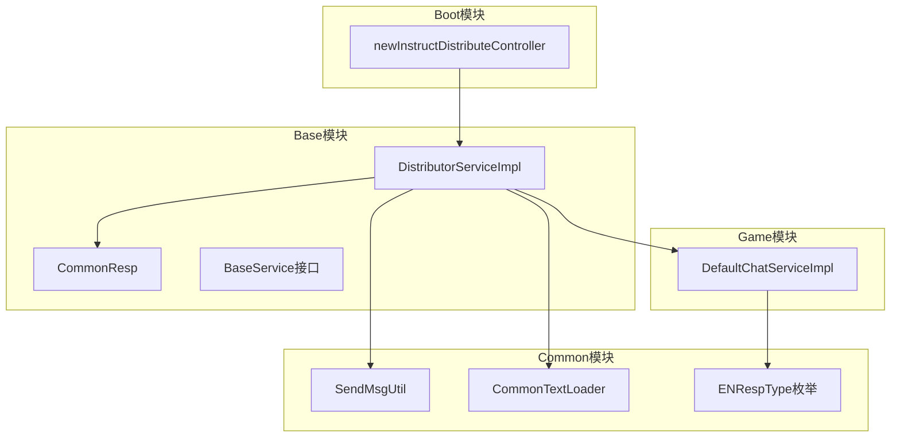
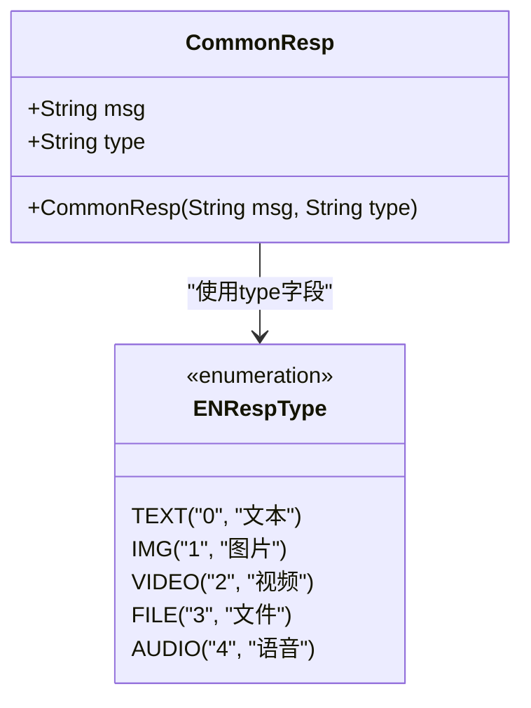
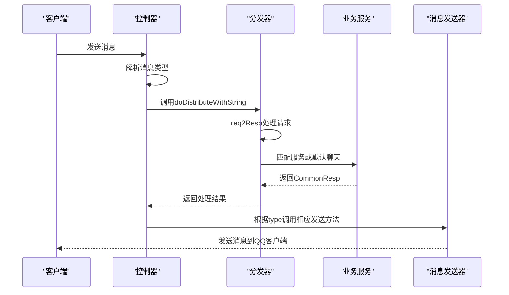
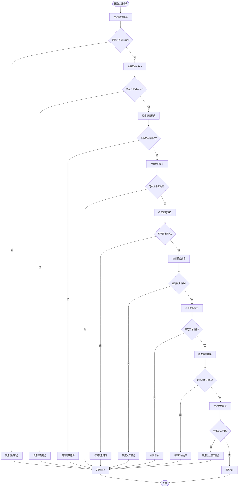
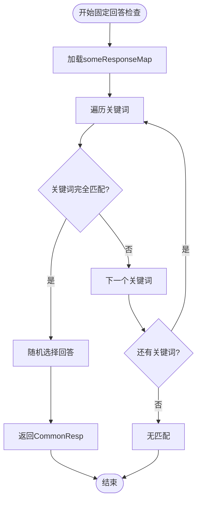
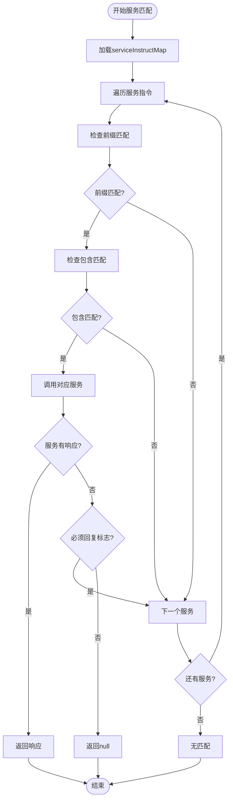
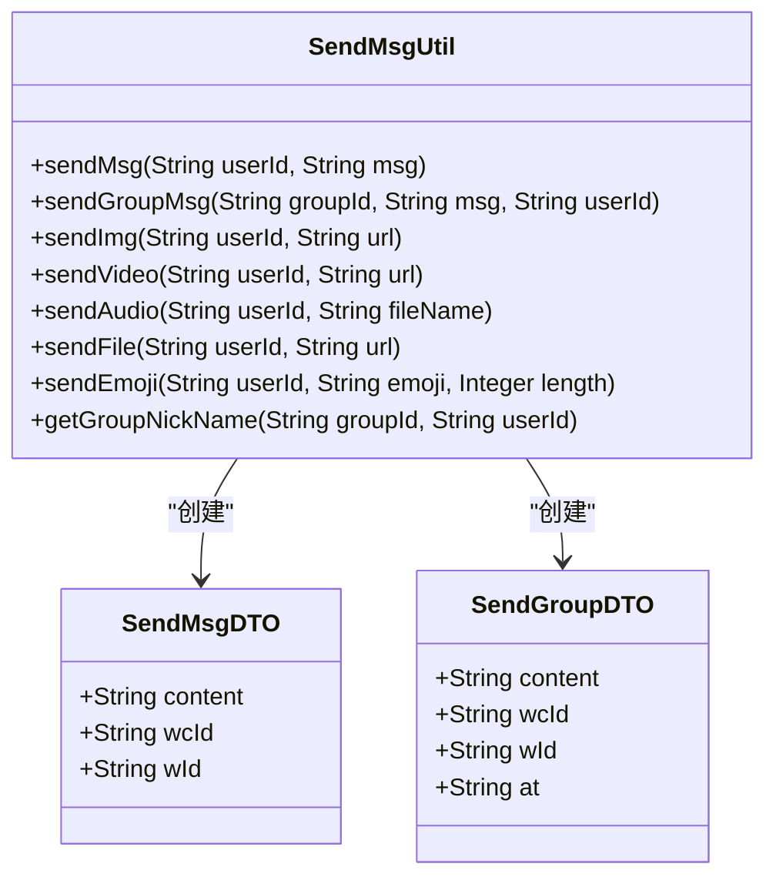
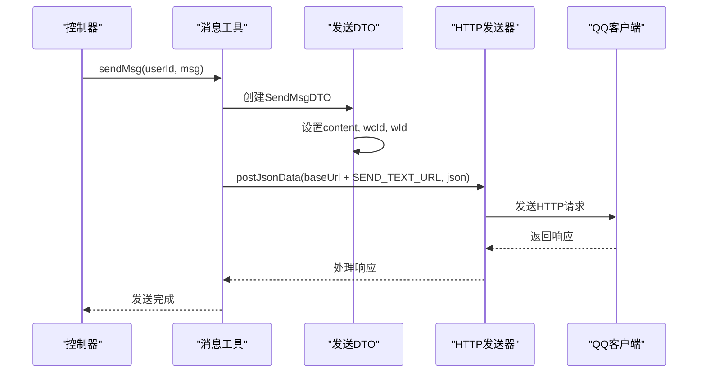
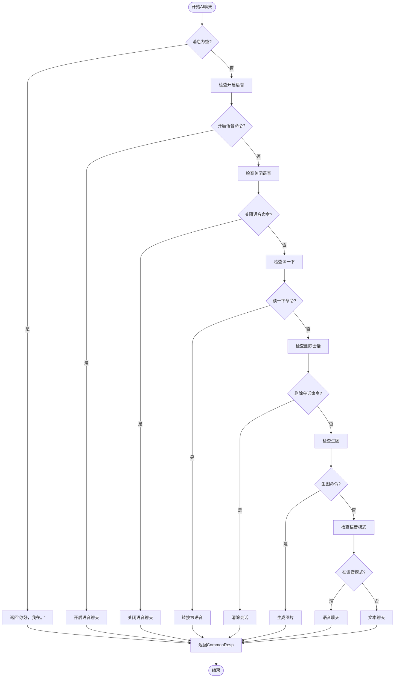
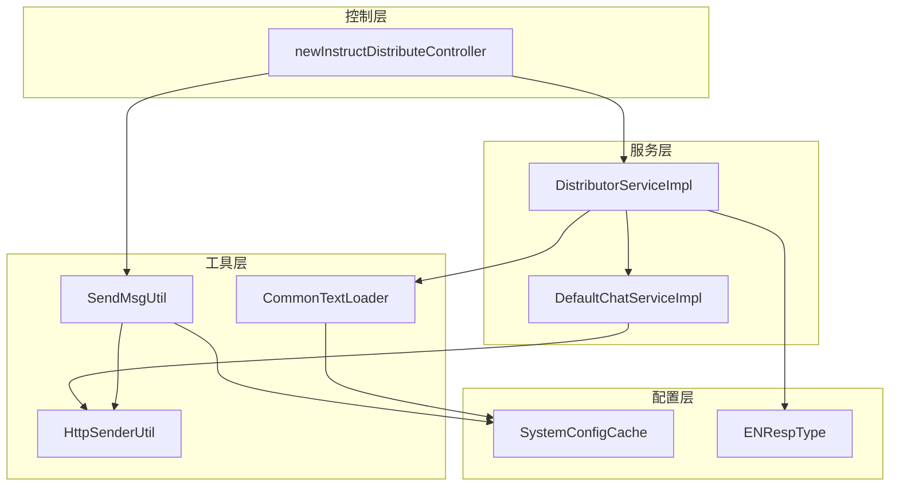

# 文本响应

<cite>
**本文档引用的文件**
- [CommonResp.java](file://Base/src/main/java/com/bot/base/dto/CommonResp.java)
- [DistributorServiceImpl.java](file://Base/src/main/java/com/bot/base/service/impl/DistributorServiceImpl.java)
- [SendMsgUtil.java](file://Common/src/main/java/com/bot/common/util/SendMsgUtil.java)
- [newInstructDistributeController.java](file://Boot/src/main/java/com/bot/boot/controller/newInstructDistributeController.java)
- [CommonTextLoader.java](file://Common/src/main/java/com/bot/common/loader/CommonTextLoader.java)
- [DefaultChatServiceImpl.java](file://Base/src/main/java/com/bot/base/service/impl/DefaultChatServiceImpl.java)
- [ENRespType.java](file://Common/src/main/java/com/bot/common/enums/ENRespType.java)
- [BaseService.java](file://Base/src/main/java/com/bot/base/service/BaseService.java)
</cite>

## 目录
1. [简介](#简介)
2. [项目结构](#项目结构)
3. [核心组件](#核心组件)
4. [架构概览](#架构概览)
5. [详细组件分析](#详细组件分析)
6. [依赖关系分析](#依赖关系分析)
7. [性能考虑](#性能考虑)
8. [故障排除指南](#故障排除指南)
9. [结论](#结论)

## 简介

Bot项目的文本响应系统是一个复杂的对话处理框架，负责处理来自不同渠道（私聊、群聊）的文本消息，并根据预设规则生成相应的文本回复。该系统的核心是`CommonResp`对象，当其`type`字段为"0"（表示文本类型）时，系统会执行特定的文本响应处理流程。

本文档详细描述了从指令解析到消息发送的完整流程，包括固定回答、服务指令匹配、默认聊天等场景的处理逻辑，并提供了开发者如何添加新规则、调试消息发送问题以及优化高频率文本消息性能的指导。

## 项目结构

Bot项目采用模块化架构，主要包含以下核心模块：



**图表来源**
- [newInstructDistributeController.java](file://Boot/src/main/java/com/bot/boot/controller/newInstructDistributeController.java#L1-L50)
- [DistributorServiceImpl.java](file://Base/src/main/java/com/bot/base/service/impl/DistributorServiceImpl.java#L1-L50)
- [SendMsgUtil.java](file://Common/src/main/java/com/bot/common/util/SendMsgUtil.java#L1-L50)

## 核心组件

### CommonResp对象
`CommonResp`是文本响应的核心数据结构，包含消息内容和响应类型：



**图表来源**
- [CommonResp.java](file://Base/src/main/java/com/bot/base/dto/CommonResp.java#L10-L18)
- [ENRespType.java](file://Common/src/main/java/com/bot/common/enums/ENRespType.java#L8-L14)

### DistributorServiceImpl核心处理器
`DistributorServiceImpl`是文本响应处理的主要入口点，实现了复杂的指令分发逻辑。

**章节来源**
- [DistributorServiceImpl.java](file://Base/src/main/java/com/bot/base/service/impl/DistributorServiceImpl.java#L216-L361)

## 架构概览

Bot项目的文本响应系统采用分层架构设计，从消息接收到底层消息发送形成完整的处理链路：



**图表来源**
- [newInstructDistributeController.java](file://Boot/src/main/java/com/bot/boot/controller/newInstructDistributeController.java#L72-L150)
- [DistributorServiceImpl.java](file://Base/src/main/java/com/bot/base/service/impl/DistributorServiceImpl.java#L125-L198)

## 详细组件分析

### DistributorServiceImpl.req2Resp方法详解

`req2Resp`方法是文本响应处理的核心逻辑，按照优先级顺序匹配不同的响应规则：



**图表来源**
- [DistributorServiceImpl.java](file://Base/src/main/java/com/bot/base/service/impl/DistributorServiceImpl.java#L216-L361)

#### 固定回答处理
系统首先检查是否有完全匹配的固定回答：



**图表来源**
- [DistributorServiceImpl.java](file://Base/src/main/java/com/bot/base/service/impl/DistributorServiceImpl.java#L324-L327)
- [CommonTextLoader.java](file://Common/src/main/java/com/bot/common/loader/CommonTextLoader.java#L75-L83)

#### 服务指令匹配
系统按优先级匹配服务指令，支持部分匹配：



**图表来源**
- [DistributorServiceImpl.java](file://Base/src/main/java/com/bot/base/service/impl/DistributorServiceImpl.java#L330-L340)

### SendMsgUtil消息发送工具

`SendMsgUtil`提供了多种消息发送方法，专门处理不同类型的消息：



**图表来源**
- [SendMsgUtil.java](file://Common/src/main/java/com/bot/common/util/SendMsgUtil.java#L27-L164)

#### 文本消息发送流程



**图表来源**
- [SendMsgUtil.java](file://Common/src/main/java/com/bot/common/util/SendMsgUtil.java#L27-L36)

**章节来源**
- [SendMsgUtil.java](file://Common/src/main/java/com/bot/common/util/SendMsgUtil.java#L27-L164)

### DefaultChatServiceImpl AI聊天服务

`DefaultChatServiceImpl`提供了基于AI的智能聊天功能：



**图表来源**
- [DefaultChatServiceImpl.java](file://Base/src/main/java/com/bot/base/service/impl/DefaultChatServiceImpl.java#L64-L98)

**章节来源**
- [DefaultChatServiceImpl.java](file://Base/src/main/java/com/bot/base/service/impl/DefaultChatServiceImpl.java#L64-L149)

## 依赖关系分析

Bot项目的文本响应系统具有清晰的依赖层次结构：



**图表来源**
- [newInstructDistributeController.java](file://Boot/src/main/java/com/bot/boot/controller/newInstructDistributeController.java#L48-L65)
- [DistributorServiceImpl.java](file://Base/src/main/java/com/bot/base/service/impl/DistributorServiceImpl.java#L43-L80)

**章节来源**
- [newInstructDistributeController.java](file://Boot/src/main/java/com/bot/boot/controller/newInstructDistributeController.java#L48-L65)
- [DistributorServiceImpl.java](file://Base/src/main/java/com/bot/base/service/impl/DistributorServiceImpl.java#L43-L80)

## 性能考虑

### 高频率文本消息优化

系统针对高频率文本消息进行了多项优化：

1. **消息去重机制**：通过`msgIdList`防止重复消息处理
2. **缓存机制**：使用静态Map缓存聊天ID和语音ID
3. **异步处理**：大文件发送采用线程池异步处理
4. **频率控制**：群聊中设置了随机回复频率

### 内存管理

- 使用静态Map存储临时数据，便于快速访问
- 及时清理过期的聊天记录
- 控制并发连接数量

## 故障排除指南

### 添加新的文本响应规则

开发者可以通过以下步骤添加新的文本响应规则：

1. **修改配置文件**：
   - 在`serviceInstructCode.txt`中添加服务指令映射
   - 在`someResponse.txt`中添加固定回答

2. **创建服务类**：
   ```java
   @Service("newServiceName")
   public class NewService implements BaseService {
       @Override
       public CommonResp doQueryReturn(String reqContent, String token, String groupId, String channel) {
           // 实现业务逻辑
           return new CommonResp("响应内容", ENRespType.TEXT.getType());
       }
   }
   ```

3. **注册服务**：
   - 将新服务添加到Spring容器中
   - 确保服务名称与配置文件中的映射一致

### 调试消息发送失败问题

常见的消息发送失败原因及解决方案：

1. **网络连接问题**：
   - 检查`baseUrl`配置是否正确
   - 验证网络连通性

2. **认证失败**：
   - 确认token有效性
   - 检查签名验证逻辑

3. **参数错误**：
   - 验证请求参数格式
   - 检查必填字段是否完整

4. **日志分析**：
   - 查看详细错误日志
   - 使用断点调试关键方法

### 性能优化建议

1. **批量处理**：对于大量消息，考虑批量处理机制
2. **缓存策略**：合理使用缓存减少重复计算
3. **连接池**：优化HTTP连接池配置
4. **监控指标**：添加响应时间监控

**章节来源**
- [DistributorServiceImpl.java](file://Base/src/main/java/com/bot/base/service/impl/DistributorServiceImpl.java#L324-L340)
- [CommonTextLoader.java](file://Common/src/main/java/com/bot/common/loader/CommonTextLoader.java#L60-L90)

## 结论

Bot项目的文本响应系统是一个设计精良的对话处理框架，具有以下特点：

1. **模块化设计**：清晰的分层架构便于维护和扩展
2. **灵活的规则引擎**：支持多种响应规则的优先级匹配
3. **强大的扩展性**：易于添加新的服务和响应规则
4. **完善的错误处理**：全面的异常捕获和日志记录
5. **高效的性能表现**：针对高频场景的优化措施

该系统为开发者提供了完整的文本响应解决方案，无论是简单的固定回答还是复杂的AI聊天，都能通过统一的接口进行处理。通过合理的配置和扩展，可以满足各种复杂的业务需求。