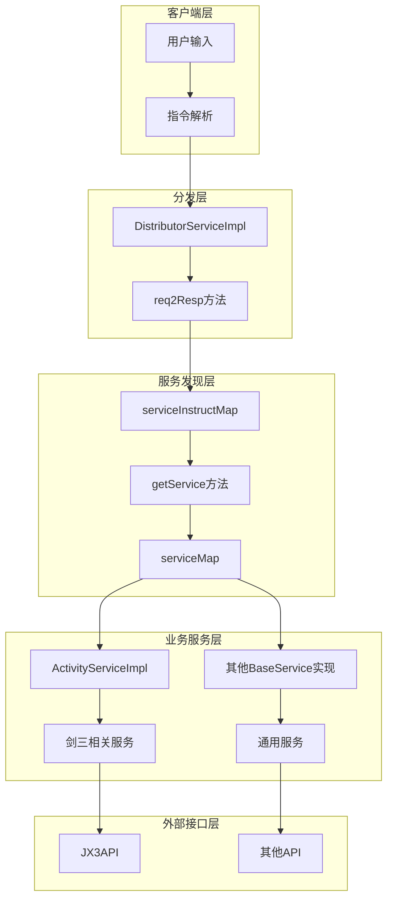
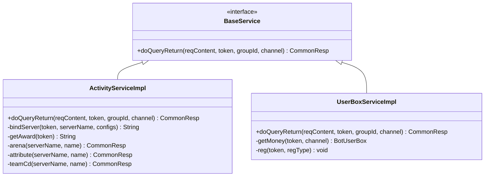
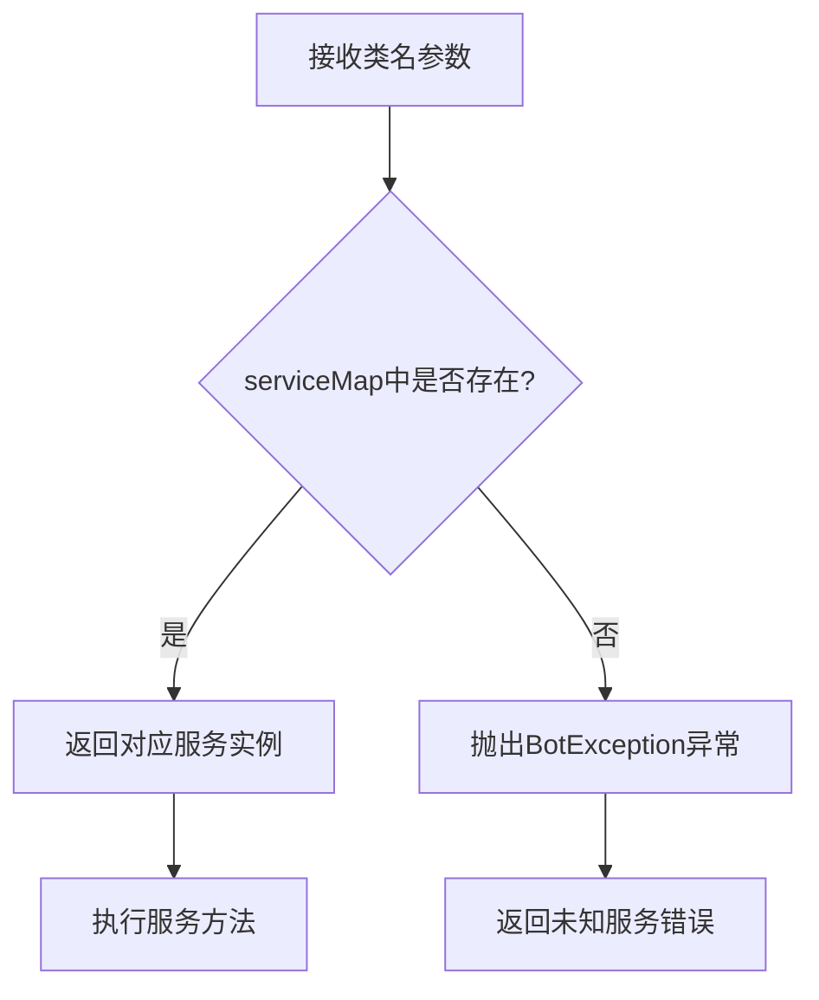
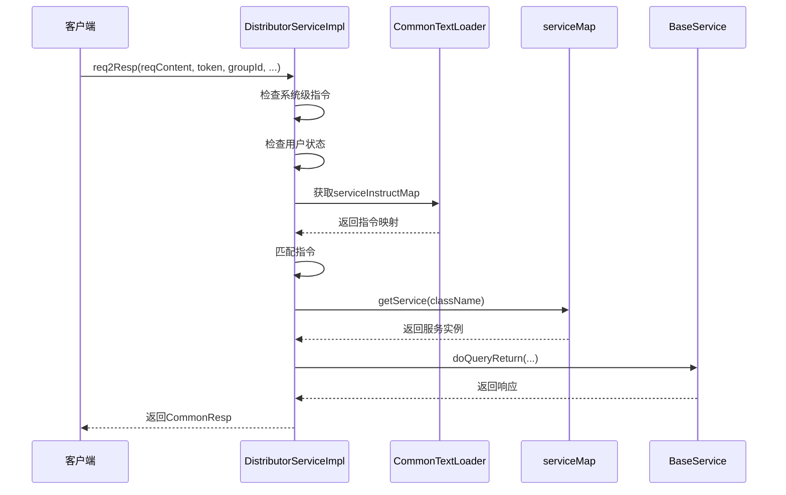
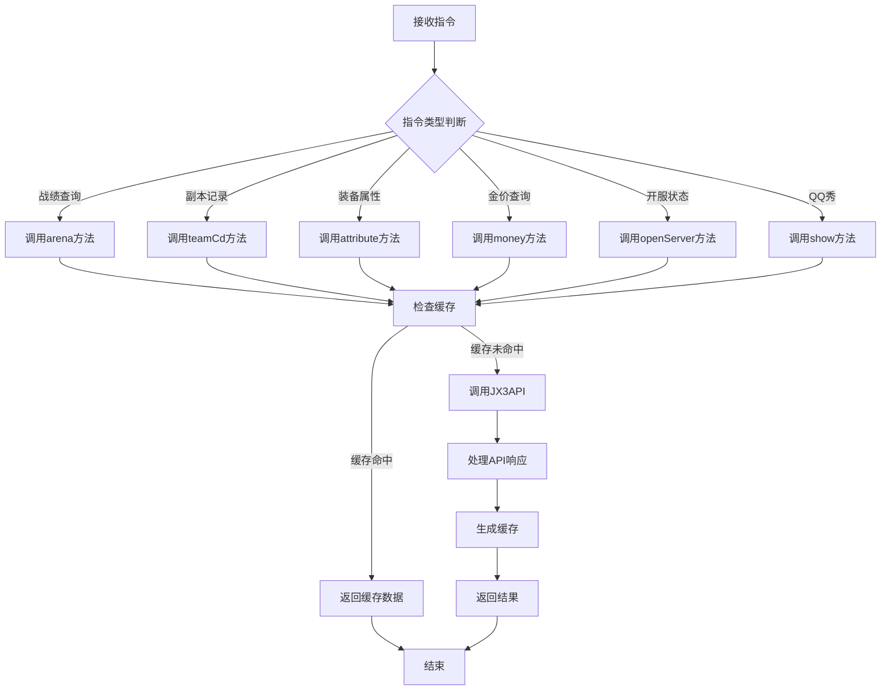
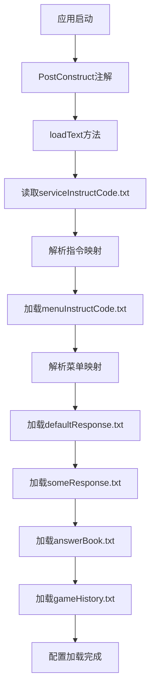
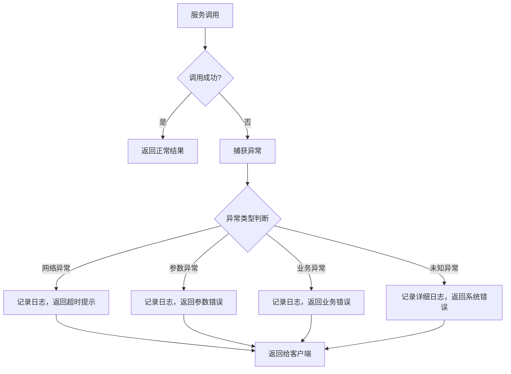

# 外部服务指令分发

<cite>
**本文档引用的文件**
- [DistributorServiceImpl.java](file://Base/src/main/java/com/bot/base/service/impl/DistributorServiceImpl.java)
- [ActivityServiceImpl.java](file://Base/src/main/java/com/bot/base/service/impl/ActivityServiceImpl.java)
- [QQDealDistributor.java](file://Base/src/main/java/com/bot/base/service/impl/QQDealDistributor.java)
- [CommonTextLoader.java](file://Common/src/main/java/com/bot/common/loader/CommonTextLoader.java)
- [BaseService.java](file://Base/src/main/java/com/bot/base/service/BaseService.java)
- [Distributor.java](file://Base/src/main/java/com/bot/base/service/Distributor.java)
- [serviceInstructCode.txt](file://Boot/src/main/resources/serviceInstructCode.txt)
- [BaseConsts.java](file://Common/src/main/java/com\bot\common\constant\BaseConsts.java)
- [application.properties](file://Boot/src/main/resources/application.properties)
</cite>

## 目录
1. [概述](#概述)
2. [系统架构](#系统架构)
3. [核心组件分析](#核心组件分析)
4. [服务发现机制](#服务发现机制)
5. [指令分发流程](#指令分发流程)
6. [剑三服务处理](#剑三服务处理)
7. [QQ专属处理](#qq专属处理)
8. [配置管理](#配置管理)
9. [异常处理](#异常处理)
10. [开发者指南](#开发者指南)
11. [总结](#总结)

## 概述

本文档详细描述了Bot项目中外部服务指令分发系统的完整机制。该系统通过`DistributorServiceImpl`实现统一的指令分发，利用`serviceInstructMap`进行服务发现，并支持多种外部服务的集成。

## 系统架构



**图表来源**
- [DistributorServiceImpl.java](file://Base/src/main/java/com/bot/base/service/impl/DistributorServiceImpl.java#L216-L361)
- [CommonTextLoader.java](file://Common/src/main/java/com/bot/common/loader/CommonTextLoader.java#L29-L30)

## 核心组件分析

### DistributorServiceImpl - 主分发器

`DistributorServiceImpl`是整个外部服务指令分发的核心组件，实现了以下关键功能：

#### 主要职责
- **指令路由**：根据输入指令将请求路由到对应的服务
- **服务发现**：通过`serviceMap`实现动态服务查找
- **异常处理**：统一处理服务调用过程中的异常
- **多渠道支持**：支持QQ、微信等多种通信渠道

#### 关键字段
- `serviceMap`：存储所有BaseService实例的映射表
- `serviceInstructMap`：存储指令到服务类名的映射关系
- `menuPrinterMap`：存储菜单服务的映射表

**章节来源**
- [DistributorServiceImpl.java](file://Base/src/main/java/com/bot/base/service/impl/DistributorServiceImpl.java#L43-L80)

### BaseService - 服务接口

`BaseService`定义了所有外部服务的统一接口：



**图表来源**
- [BaseService.java](file://Base/src/main/java/com/bot/base/service/BaseService.java#L9-L18)
- [ActivityServiceImpl.java](file://Base/src/main/java/com/bot/base/service/impl/ActivityServiceImpl.java#L41-L80)

**章节来源**
- [BaseService.java](file://Base/src/main/java/com/bot/base/service/BaseService.java#L1-L18)

## 服务发现机制

### getService方法实现

`getService`方法是服务发现的核心实现：



**图表来源**
- [DistributorServiceImpl.java](file://Base/src/main/java/com/bot/base/service/impl/DistributorServiceImpl.java#L363-L369)

### serviceInstructMap加载机制

`CommonTextLoader`负责加载服务指令映射配置：

#### 加载流程
1. **配置文件读取**：从`serviceInstructCode.txt`读取指令配置
2. **映射构建**：将指令字符串转换为`Map<String, String>`结构
3. **多指令支持**：单个服务可支持多个触发指令

#### 配置格式示例
```
答案之书=answerBookServiceImpl
情话=sweetServiceImpl
白羊座,金牛座,双子座=constellationServiceImpl
```

**章节来源**
- [CommonTextLoader.java](file://Common/src/main/java/com/bot/common/loader/CommonTextLoader.java#L60-L104)
- [serviceInstructCode.txt](file://Boot/src/main/resources/serviceInstructCode.txt#L1-L15)

## 指令分发流程

### req2Resp方法完整流程



**图表来源**
- [DistributorServiceImpl.java](file://Base/src/main/java/com/bot/base/service/impl/DistributorServiceImpl.java#L216-L361)

### 指令匹配优先级

指令匹配遵循以下优先级顺序：

1. **系统级指令**：签到、兑换、资格管理等
2. **专用处理器**：QQDealDistributor的特殊处理
3. **剑三服务**：以"剑三"开头的指令
4. **通用服务**：通过serviceInstructMap匹配
5. **默认聊天**：最后的兜底处理

**章节来源**
- [DistributorServiceImpl.java](file://Base/src/main/java/com/bot/base/service/impl/DistributorServiceImpl.java#L216-L361)

## 剑三服务处理

### ActivityServiceImpl功能概览

`ActivityServiceImpl`专门处理剑三相关服务，提供以下核心功能：

#### 支持的服务类型
- **战绩查询**：查询玩家竞技场战绩
- **副本记录**：查看团队副本完成情况
- **装备属性**：获取角色装备详细信息
- **金价查询**：实时查询游戏内金价
- **开服状态**：查询服务器开服情况
- **QQ秀**：获取玩家QQ秀图片
- **抽奖系统**：游戏内抽奖功能

#### 数据处理流程



**图表来源**
- [ActivityServiceImpl.java](file://Base/src/main/java/com/bot/base/service/impl/ActivityServiceImpl.java#L84-L214)

### 缓存策略

ActivityServiceImpl采用智能缓存策略优化性能：

| 服务类型 | 缓存时间 | 缓存键 |
|---------|---------|--------|
| 战绩查询 | 1小时 | `{serverName}-{name}` |
| 副本记录 | 30分钟 | `{serverName}-{name}` |
| 装备属性 | 30分钟 | `{serverName}-{name}` |
| 金价查询 | 12小时 | `{serverName}` |
| 开服状态 | 2分钟 | `{serverName}` |
| QQ秀 | 10分钟 | `{serverName}-{name}` |

**章节来源**
- [ActivityServiceImpl.java](file://Base/src/main/java/com/bot/base/service/impl/ActivityServiceImpl.java#L249-L507)

## QQ专属处理

### QQDealDistributor特殊逻辑

`QQDealDistributor`为QQ平台提供了特殊的指令处理逻辑：

#### 自动前缀添加机制

```mermaid
flowchart TD
A[接收指令] --> B{是否以"剑三"开头?}
B --> |否| C[自动添加"剑三 "前缀]
B --> |是| D[保持原指令]
C --> E[调用ActivityServiceImpl]
D --> E
E --> F[返回处理结果]
```

**图表来源**
- [QQDealDistributor.java](file://Base/src/main/java/com/bot/base/service/impl/QQDealDistributor.java#L55-L58)

#### QQ平台特性处理

1. **指令标准化**：自动为非剑三指令添加前缀
2. **资格校验简化**：QQ平台跳过严格的资格校验
3. **专属功能**：优先处理QQ特有的服务

**章节来源**
- [QQDealDistributor.java](file://Base/src/main/java/com/bot/base/service/impl/QQDealDistributor.java#L29-L60)

## 配置管理

### CommonTextLoader配置加载

`CommonTextLoader`负责加载所有文本配置文件：

#### 配置文件类型
- **serviceInstructCode.txt**：服务指令映射配置
- **menuInstructCode.txt**：菜单指令映射配置
- **defaultResponse.txt**：默认回复配置
- **someResponse.txt**：固定回答配置
- **answerBook.txt**：答案之书配置

#### 加载机制



**图表来源**
- [CommonTextLoader.java](file://Common/src/main/java/com/bot/common/loader/CommonTextLoader.java#L60-L90)

### 应用程序配置

关键配置项说明：

| 配置项 | 默认值 | 说明 |
|-------|--------|------|
| text.path | C:\\publish\\botText\\ | 文本配置文件路径 |
| jx3.url | https://www.jx3api.com/data | 剑三API地址 |
| help.img.path | C:\\publish\\botFile\\功能大全.jpg | 帮助图片路径 |
| game.file.path | C:\\publish\\botFile\\山海见闻.rar | 游戏文件路径 |

**章节来源**
- [application.properties](file://Boot/src/main/resources/application.properties#L23-L36)

## 异常处理

### 服务调用异常处理

系统采用多层次的异常处理机制：

#### 异常处理层次



#### 异常处理策略

1. **网络异常**：提供友好的超时提示
2. **参数异常**：明确指出参数格式问题
3. **业务异常**：返回具体的业务错误信息
4. **系统异常**：记录详细日志便于排查

### 服务实例验证

`getService`方法提供基础的实例验证：

```java
private BaseService getService(String className) {
    BaseService service = serviceMap.get(className);
    if (service == null) {
        throw new BotException("未知服务");
    }
    return service;
}
```

**章节来源**
- [DistributorServiceImpl.java](file://Base/src/main/java/com/bot/base/service/impl/DistributorServiceImpl.java#L363-L369)

## 开发者指南

### 注册新外部服务

#### 步骤1：实现BaseService接口

```java
@Service("yourServiceName")
public class YourServiceImpl implements BaseService {
    @Override
    public CommonResp doQueryReturn(String reqContent, String token, String groupId, String channel) {
        // 实现服务逻辑
        return new CommonResp("处理结果", ENRespType.TEXT.getType());
    }
}
```

#### 步骤2：配置指令映射

编辑`serviceInstructCode.txt`文件：

```
关键词1,关键词2=yourServiceName
```

#### 步骤3：测试服务

1. 重启应用使配置生效
2. 使用配置的关键词测试服务
3. 验证返回结果符合预期

### 配置指令映射

#### 指令格式规范

- **单指令**：`指令=服务类名`
- **多指令**：`指令1,指令2=服务类名`
- **空格处理**：指令中的空格会被自动处理

#### 示例配置

```
天气预报=weatherServiceImpl
查询天气=weatherServiceImpl
温度,湿度,气压=environmentServiceImpl
```

### 处理服务调用异常

#### 推荐的异常处理模式

```java
@Override
public CommonResp doQueryReturn(String reqContent, String token, String groupId, String channel) {
    try {
        // 业务逻辑处理
        return processRequest(reqContent, token, groupId, channel);
    } catch (IllegalArgumentException e) {
        log.warn("参数错误: {}", e.getMessage());
        return new CommonResp("参数格式错误，请检查指令格式", ENRespType.TEXT.getType());
    } catch (NetworkException e) {
        log.error("网络错误: {}", e.getMessage());
        return new CommonResp("网络连接失败，请稍后重试", ENRespType.TEXT.getType());
    } catch (Exception e) {
        log.error("服务处理异常: {}", e.getMessage(), e);
        return new CommonResp("系统繁忙，请稍后重试", ENRespType.TEXT.getType());
    }
}
```

### 性能优化建议

#### 缓存策略
1. **合理设置缓存时间**：根据数据更新频率设置缓存过期时间
2. **缓存键设计**：使用有意义的缓存键便于管理和清理
3. **缓存预热**：对热点数据进行预加载

#### 异步处理
1. **耗时操作异步化**：对于网络请求等耗时操作使用异步处理
2. **批量处理**：对多个相似请求进行批量处理
3. **连接池管理**：合理配置HTTP连接池参数

## 总结

Bot项目的外部服务指令分发系统通过以下核心机制实现了灵活、可扩展的服务架构：

### 核心优势

1. **统一入口**：DistributorServiceImpl提供统一的指令分发入口
2. **动态服务发现**：通过serviceMap实现运行时服务查找
3. **配置驱动**：指令映射通过配置文件管理，便于调整
4. **多平台支持**：QQDealDistributor提供平台特定的处理逻辑
5. **完善的异常处理**：多层次的异常处理确保系统稳定性

### 设计特点

- **松耦合**：各服务独立实现，通过接口进行交互
- **高内聚**：每个服务专注于特定功能领域
- **可扩展性**：新增服务只需实现BaseService接口
- **可维护性**：清晰的职责分离和配置管理

### 最佳实践

1. **服务设计**：保持服务单一职责，避免功能过于复杂
2. **异常处理**：提供有意义的错误信息，避免暴露系统细节
3. **性能考虑**：合理使用缓存，避免重复计算和网络请求
4. **配置管理**：通过配置文件管理指令映射，便于运维调整

该系统为Bot项目提供了强大而灵活的外部服务集成能力，支持各种第三方API和服务的无缝接入，为用户提供丰富的功能体验。