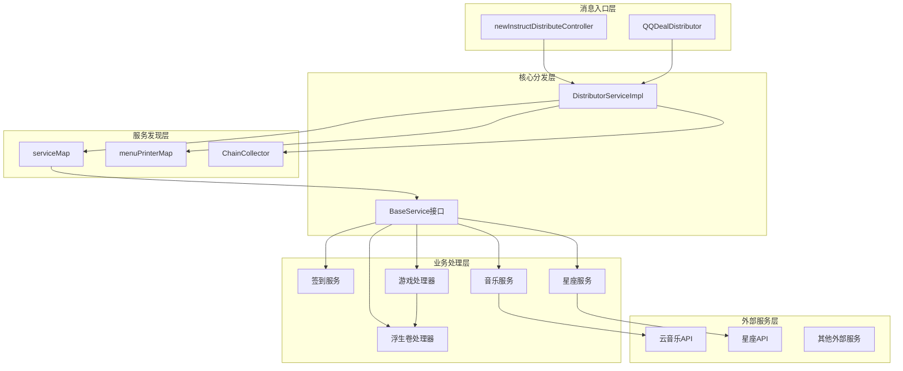
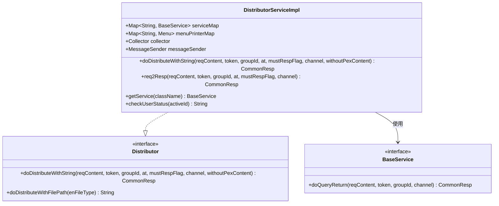
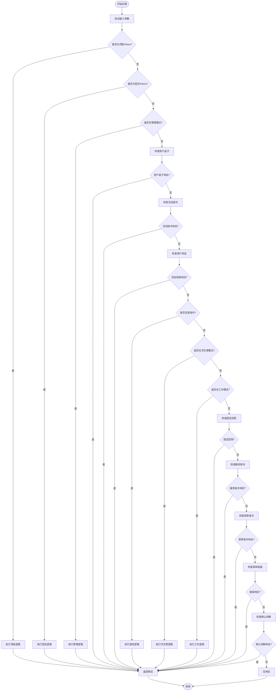
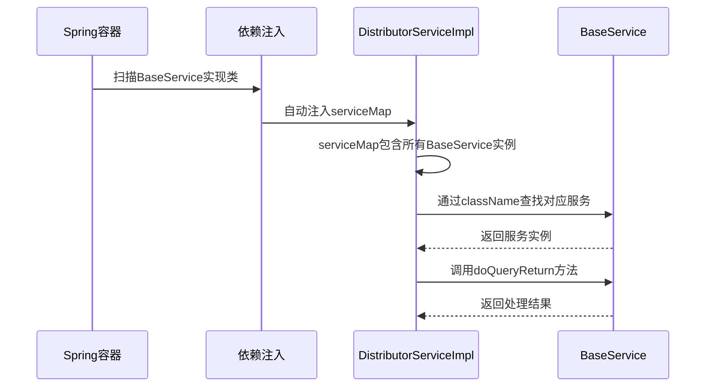
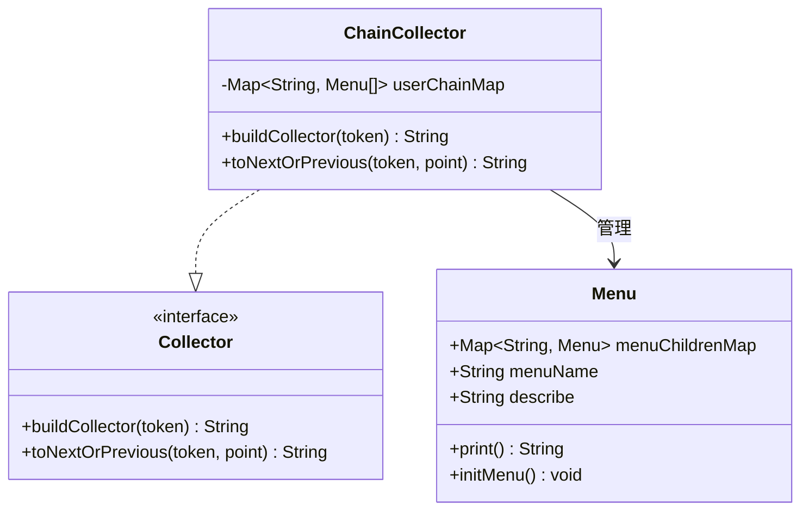
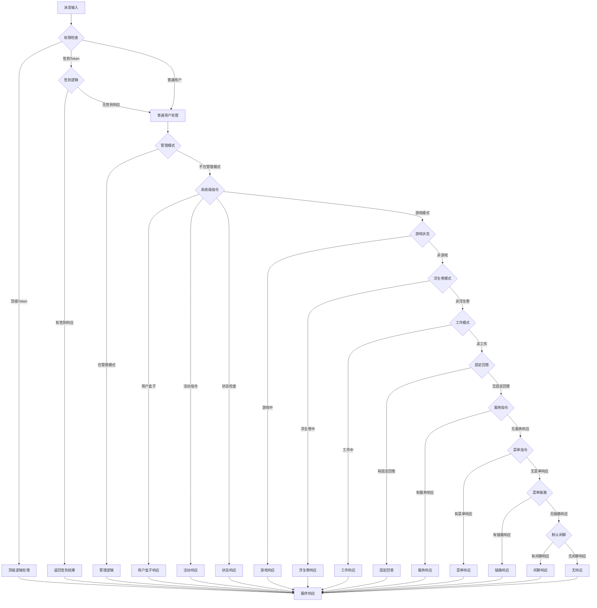
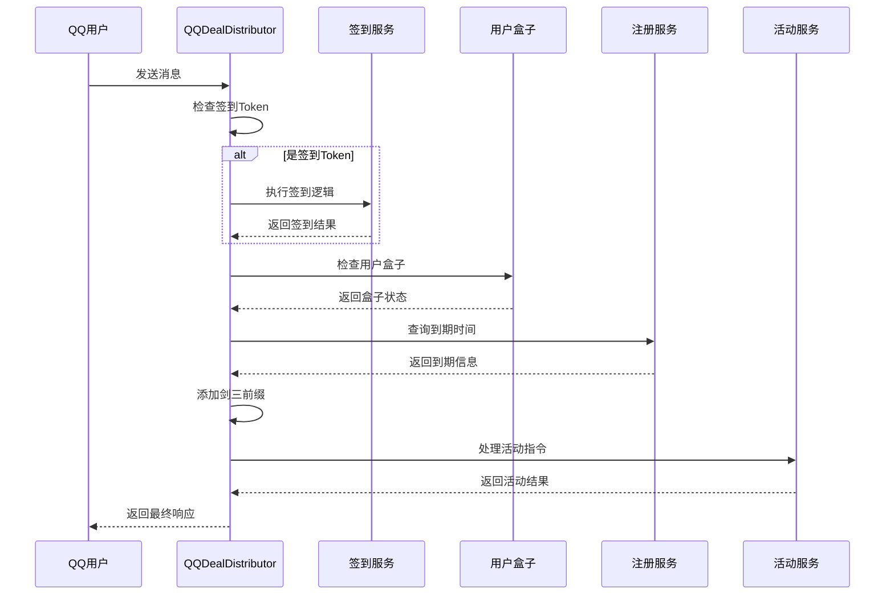
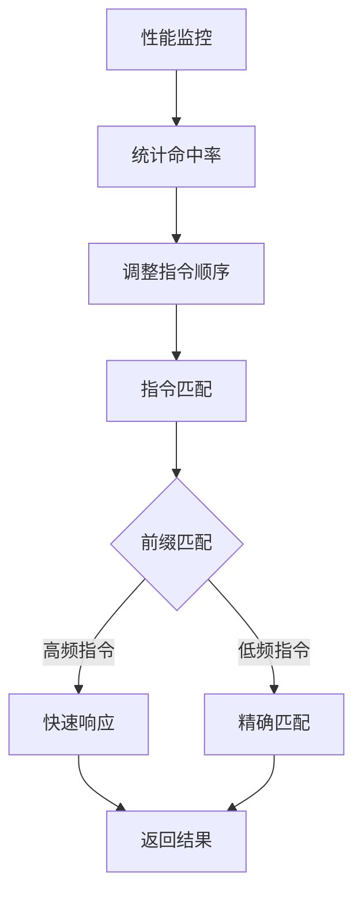

# 指令分发

<cite>
**本文档引用的文件**
- [DistributorServiceImpl.java](file://Base/src/main/java/com/bot/base/service/impl/DistributorServiceImpl.java)
- [Distributor.java](file://Base/src/main/java/com/bot/base/service/Distributor.java)
- [QQDealDistributor.java](file://Base/src/main/java/com/bot/base/service/impl/QQDealDistributor.java)
- [ChainCollector.java](file://Base/src/main/java/com/bot/base/chain/ChainCollector.java)
- [Collector.java](file://Base/src/main/java/com/bot/base/chain/Collector.java)
- [Menu.java](file://Base/src/main/java/com/bot/base/chain/Menu.java)
- [BaseService.java](file://Base/src/main/java/com/bot/base/service/BaseService.java)
- [SignServiceImpl.java](file://Base/src/main/java/com/bot/base/service/impl/SignServiceImpl.java)
- [CloudMusicServiceImpl.java](file://Base/src/main/java/com/bot/base/service/impl/CloudMusicServiceImpl.java)
- [ConstellationServiceImpl.java](file://Base/src/main/java/com/bot/base/service/impl/ConstellationServiceImpl.java)
- [CommonTextLoader.java](file://Common/src/main/java/com/bot/common/loader/CommonTextLoader.java)
- [newInstructDistributeController.java](file://Boot/src/main/java/com/bot/boot/controller/newInstructDistributeController.java)
- [BaseConsts.java](file://Common/src/main/java/com/bot/common/constant/BaseConsts.java)
</cite>

## 目录
1. [概述](#概述)
2. [系统架构](#系统架构)
3. [核心组件分析](#核心组件分析)
4. [doDistributeWithString方法处理流程](#dodistributewithstring方法处理流程)
5. [服务发现机制](#服务发现机制)
6. [指令分发决策树](#指令分发决策树)
7. [QQ专属指令处理](#qq专属指令处理)
8. [扩展开发指南](#扩展开发指南)
9. [性能优化建议](#性能优化建议)
10. [故障排除](#故障排除)

## 概述

Bot项目采用基于Spring框架的指令分发系统，通过DistributorServiceImpl核心组件实现智能指令路由和业务逻辑分发。该系统支持多种类型的指令处理，包括系统级指令、游戏指令、外部服务调用等，并提供了灵活的扩展机制。

### 主要特性

- **智能分发**：根据消息内容自动识别并路由到相应的处理器
- **服务发现**：通过Spring自动注入实现动态服务发现
- **多渠道支持**：支持微信、QQ等多种消息渠道
- **游戏集成**：内置浮生卷游戏模式支持
- **外部服务**：集成了音乐、星座等外部API服务

## 系统架构



**图表来源**
- [DistributorServiceImpl.java](file://Base/src/main/java/com/bot/base/service/impl/DistributorServiceImpl.java#L40-L80)
- [newInstructDistributeController.java](file://Boot/src/main/java/com/bot/boot/controller/newInstructDistributeController.java#L47-L65)

## 核心组件分析

### DistributorServiceImpl - 核心分发器

DistributorServiceImpl是整个指令分发系统的核心组件，实现了Distributor接口，负责接收消息并根据内容进行智能路由。

#### 关键属性

| 属性名称 | 类型 | 描述 | 用途 |
|---------|------|------|------|
| serviceMap | Map<String, BaseService> | 服务映射表 | 存储所有BaseService实例，通过类名自动注入 |
| menuPrinterMap | Map<String, Menu> | 菜单映射表 | 存储所有菜单处理器，用于构建交互式菜单 |
| collector | Collector | 链路收集器 | 负责菜单链路的构建和导航 |
| messageSender | MessageSender | 消息发送器 | 处理各种类型的消息发送 |
| systemManager | SystemManager | 系统管理器 | 处理系统级管理和权限控制 |

#### 核心方法



**图表来源**
- [DistributorServiceImpl.java](file://Base/src/main/java/com/bot/base/service/impl/DistributorServiceImpl.java#L42-L80)
- [Distributor.java](file://Base/src/main/java/com/bot/base/service/Distributor.java#L12-L36)
- [BaseService.java](file://Base/src/main/java/com/bot/base/service/BaseService.java#L9-L17)

**章节来源**
- [DistributorServiceImpl.java](file://Base/src/main/java/com/bot/base/service/impl/DistributorServiceImpl.java#L40-L80)

### QQDealDistributor - QQ专用分发器

QQDealDistributor专门处理QQ渠道的特殊指令，继承了基础的指令分发逻辑，同时添加了QQ特有的处理规则。

#### QQ专属处理特点

- **签到优先**：QQ用户具有特殊的签到权限验证
- **简化校验**：QQ用户不进行严格的资格校验
- **剑三增强**：自动为剑三相关指令添加前缀
- **统一处理**：提供简化的指令处理流程

**章节来源**
- [QQDealDistributor.java](file://Base/src/main/java/com/bot/base/service/impl/QQDealDistributor.java#L29-L59)

## doDistributeWithString方法处理流程

doDistributeWithString是系统的核心处理方法，负责将原始消息内容转换为相应的业务响应。

### 处理流程图



**图表来源**
- [DistributorServiceImpl.java](file://Base/src/main/java/com/bot/base/service/impl/DistributorServiceImpl.java#L216-L361)

### 关键处理阶段

#### 1. 权限级别检查
系统首先检查消息发送者的权限级别，包括：
- **顶级Token**：具有最高权限，可执行特殊操作
- **签到Token**：具有签到相关权限
- **普通用户**：标准权限级别

#### 2. 系统级指令处理
系统预定义了一系列系统级指令，按优先级处理：
- 用户盒子操作
- 活动指令
- 用户状态查询
- 游戏模式切换

#### 3. 业务逻辑分发
根据指令类型分发到相应的业务处理器：
- **签到服务**：处理签到相关逻辑
- **音乐服务**：调用云音乐API
- **星座服务**：查询星座运势
- **游戏服务**：处理游戏相关指令

**章节来源**
- [DistributorServiceImpl.java](file://Base/src/main/java/com/bot/base/service/impl/DistributorServiceImpl.java#L216-L361)

## 服务发现机制

### serviceMap自动注入

Spring框架通过自动注入机制实现服务发现，DistributorServiceImpl利用这一特性实现动态服务查找。

#### 注入机制



**图表来源**
- [DistributorServiceImpl.java](file://Base/src/main/java/com/bot/base/service/impl/DistributorServiceImpl.java#L43-L44)
- [BaseService.java](file://Base/src/main/java/com/bot/base/service/BaseService.java#L16)

#### 服务注册流程

| 步骤 | 操作 | 说明 |
|------|------|------|
| 1 | 类扫描 | Spring扫描所有@Servie注解的类 |
| 2 | 实例化 | 创建BaseService实现类的实例 |
| 3 | 名称解析 | 使用@Service注解的值或类名作为键 |
| 4 | 注入 | 将实例存储到serviceMap中 |
| 5 | 查找 | 通过className快速定位服务 |

### collector菜单处理器收集

ChainCollector实现了菜单处理器的自动发现和管理。

#### 菜单链路管理



**图表来源**
- [ChainCollector.java](file://Base/src/main/java/com/bot/base/chain/ChainCollector.java#L18-L57)
- [Collector.java](file://Base/src/main/java/com/bot/base/chain/Collector.java#L7-L22)
- [Menu.java](file://Base/src/main/java/com/bot/base/chain/Menu.java#L15-L55)

**章节来源**
- [DistributorServiceImpl.java](file://Base/src/main/java/com/bot/base/service/impl/DistributorServiceImpl.java#L43-L44)
- [ChainCollector.java](file://Base/src/main/java/com/bot/base/chain/ChainCollector.java#L21-L57)

## 指令分发决策树

### 完整决策流程



**图表来源**
- [DistributorServiceImpl.java](file://Base/src/main/java/com/bot/base/service/impl/DistributorServiceImpl.java#L216-L361)

### 关键分支条件

| 分支条件 | 检查方法 | 返回值 | 处理逻辑 |
|----------|----------|--------|----------|
| 顶级Token | SystemConfigCache.topToken.contains(groupId) | 顶级逻辑 | 执行特殊权限操作 |
| 签到Token | SystemConfigCache.signToken.contains(groupId) | 签到逻辑 | 处理签到相关指令 |
| 管理模式 | SystemManager.userTempInfo != null | 管理逻辑 | 执行系统管理操作 |
| 用户盒子 | userBoxService.doQueryReturn() | 用户盒子响应 | 处理用户物品相关操作 |
| 游戏模式 | GAME_TOKENS.containsKey(token) | 游戏响应 | 处理游戏指令 |
| 浮生卷模式 | LIFE_GAME_TOKENS.containsKey(token) | 浮生卷响应 | 处理浮生卷游戏逻辑 |
| 工作模式 | WorkManager.WORK_TOKENS.contains(token) | 工作响应 | 处理工作相关指令 |

**章节来源**
- [DistributorServiceImpl.java](file://Base/src/main/java/com/bot/base/service/impl/DistributorServiceImpl.java#L216-L361)

## QQ专属指令处理

### QQDealDistributor处理流程

QQDealDistributor专门处理QQ渠道的特殊需求，提供了简化的指令处理逻辑。

#### QQ处理特点



**图表来源**
- [QQDealDistributor.java](file://Base/src/main/java/com/bot/base/service/impl/QQDealDistributor.java#L29-L59)

#### QQ特殊处理规则

| 规则类型 | 处理方式 | 说明 |
|----------|----------|------|
| 签到优先 | 优先处理签到逻辑 | QQ用户具有特殊签到权限 |
| 简化校验 | 不进行严格资格校验 | 放宽QQ用户的使用限制 |
| 前缀增强 | 自动添加"剑三"前缀 | 强化剑三相关功能 |
| 统一处理 | 简化指令处理流程 | 提供更流畅的用户体验 |

**章节来源**
- [QQDealDistributor.java](file://Base/src/main/java/com/bot/base/service/impl/QQDealDistributor.java#L29-L59)

## 扩展开发指南

### 添加新的指令处理器

#### 1. 创建服务类

```java
@Service("yourServiceName")  // 必须指定唯一的服务名称
public class YourService implements BaseService {
    
    @Override
    public CommonResp doQueryReturn(String reqContent, String token, String groupId, String channel) {
        // 实现业务逻辑
        if (reqContent.startsWith("你的指令前缀")) {
            // 处理逻辑
            return new CommonResp("响应内容", ENRespType.TEXT.getType());
        }
        return null;  // 不处理该指令
    }
}
```

#### 2. 配置指令映射

在`serviceInstructCode.txt`文件中添加指令映射：

```
你的指令前缀=yourServiceName
```

#### 3. 配置文件位置

- **开发环境**：`Boot/src/main/resources/serviceInstructCode.txt`
- **生产环境**：`application-prod.properties`中配置的路径

### 调试分发逻辑

#### 1. 启用日志记录

在`application.properties`中启用详细日志：

```properties
logging.level.com.bot.base=DEBUG
logging.level.org.springframework.web=DEBUG
```

#### 2. 断点调试技巧

- 在`DistributorServiceImpl.req2Resp()`方法中设置断点
- 检查`serviceMap`中是否包含新注册的服务
- 验证指令匹配逻辑是否正确

#### 3. 单元测试

```java
@SpringBootTest
public class DistributorServiceTest {
    
    @Autowired
    private Distributor distributor;
    
    @Test
    public void testNewCommand() {
        CommonResp response = distributor.doDistributeWithString(
            "你的指令前缀测试内容", 
            "testToken", 
            null, 
            false, 
            true, 
            "wx", 
            "测试内容"
        );
        assertNotNull(response);
        assertEquals("预期响应", response.getMsg());
    }
}
```

### 性能优化建议

#### 1. 指令匹配优化

- **前缀匹配优先**：将常用指令放在前面
- **正则表达式缓存**：避免重复编译正则表达式
- **指令分类**：按功能类型组织指令

#### 2. 服务实例管理

- **懒加载**：按需创建服务实例
- **连接池**：对外部服务使用连接池
- **超时控制**：设置合理的超时时间

#### 3. 缓存策略

```java
@Component
public class CommandCache {
    
    private final Map<String, CommonResp> cache = new ConcurrentHashMap<>();
    
    public CommonResp getCachedResponse(String key) {
        return cache.get(key);
    }
    
    public void cacheResponse(String key, CommonResp response) {
        cache.put(key, response);
    }
}
```

**章节来源**
- [BaseService.java](file://Base/src/main/java/com/bot/base/service/BaseService.java#L16)
- [CommonTextLoader.java](file://Common/src/main/java/com/bot/common/loader/CommonTextLoader.java#L64-L69)

## 性能优化建议

### 1. 指令匹配优化

#### 指令优先级排序



#### 优化策略

| 策略 | 实现方式 | 性能提升 |
|------|----------|----------|
| 前缀索引 | 使用Trie树存储指令前缀 | O(1)匹配复杂度 |
| 缓存机制 | 缓存频繁访问的指令结果 | 减少重复计算 |
| 优先级队列 | 按使用频率排序指令 | 最大化命中率 |
| 正则预编译 | 缓存编译后的正则表达式 | 避免重复编译开销 |

### 2. 内存优化

#### 对象池管理

```java
@Component
public class RespObjectPool {
    
    private final ThreadLocal<CommonResp> respPool = 
        ThreadLocal.withInitial(() -> new CommonResp());
    
    public CommonResp getResp() {
        CommonResp resp = respPool.get();
        resp.reset();  // 重置对象状态
        return resp;
    }
}
```

### 3. 并发优化

#### 异步处理

```java
@Service
public class AsyncDistributor {
    
    @Async
    public CompletableFuture<CommonResp> processAsync(String content, String token) {
        // 异步处理耗时操作
        return CompletableFuture.supplyAsync(() -> {
            // 处理逻辑
            return new CommonResp(result, ENRespType.TEXT.getType());
        });
    }
}
```

## 故障排除

### 常见问题及解决方案

#### 1. 服务未找到异常

**问题现象**：`Unknown service`异常

**排查步骤**：
1. 检查@Service注解是否正确
2. 验证服务名称是否与配置文件匹配
3. 确认Spring扫描路径包含服务类

**解决方案**：
```java
@Service("correctServiceName")  // 确保名称正确
public class CorrectService implements BaseService {
    // 实现代码
}
```

#### 2. 指令不响应

**问题现象**：发送指令但无响应

**排查步骤**：
1. 检查CommonTextLoader是否正确加载指令映射
2. 验证指令前缀是否匹配
3. 确认服务实现类是否正确处理指令

**解决方案**：
```properties
# 确保serviceInstructCode.txt包含正确的映射
你的指令=你的服务名称
```

#### 3. QQ渠道特殊问题

**问题现象**：QQ渠道指令处理异常

**排查步骤**：
1. 检查QQDealDistributor配置
2. 验证QQ特定的权限设置
3. 确认消息格式是否符合要求

**解决方案**：
```java
// 确保QQDealDistributor正确处理签到Token
if (SystemConfigCache.signToken.contains(groupId == null ? token : groupId)) {
    // QQ专用逻辑
}
```

### 调试工具

#### 1. 指令追踪

```java
@Slf4j
@Component
public class CommandTracer {
    
    public void traceCommand(String command, String service) {
        log.info("指令追踪: {} -> {}", command, service);
    }
}
```

#### 2. 性能监控

```java
@Component
public class PerformanceMonitor {
    
    private final Map<String, AtomicLong> commandCounts = new ConcurrentHashMap<>();
    
    public void incrementCommand(String command) {
        commandCounts.computeIfAbsent(command, k -> new AtomicLong()).incrementAndGet();
    }
    
    public Map<String, Long> getCommandStats() {
        return commandCounts.entrySet().stream()
            .collect(Collectors.toMap(Map.Entry::getKey, e -> e.getValue().get()));
    }
}
```

**章节来源**
- [DistributorServiceImpl.java](file://Base/src/main/java/com/bot/base/service/impl/DistributorServiceImpl.java#L363-L368)
- [QQDealDistributor.java](file://Base/src/main/java/com/bot/base/service/impl/QQDealDistributor.java#L29-L59)

## 结论

Bot项目的指令分发系统通过精心设计的架构实现了高效、灵活的消息处理能力。DistributorServiceImpl作为核心组件，结合Spring的依赖注入机制，提供了强大的服务发现和路由功能。系统支持多种指令类型，包括系统级指令、游戏指令和外部服务调用，并通过ChainCollector实现了交互式菜单功能。

通过合理的设计模式和扩展机制，该系统具备良好的可维护性和可扩展性，能够适应不断增长的功能需求。开发者可以通过简单的配置和实现BaseService接口来添加新的指令处理器，系统会自动完成服务发现和路由。

对于未来的改进，可以考虑引入更高级的自然语言处理技术来提升指令识别的准确性和灵活性，同时进一步优化性能以支持更大规模的并发处理。