# 游戏系统指令分发文档

<cite>
**本文档引用的文件**
- [DistributorServiceImpl.java](file://Base/src/main/java/com/bot/base/service/impl/DistributorServiceImpl.java)
- [WorkManager.java](file://Base/src/main/java/com/bot/base/service/WorkManager.java)
- [LifeHandlerImpl.java](file://Life/src/main/java/com/bot/life/service/impl/LifeHandlerImpl.java)
- [ENUserGameStatus.java](file://Common/src/main/java/com/bot/common/enums/ENUserGameStatus.java)
- [ENGameMode.java](file://Life/src\main\java\com\bot\life\enums\ENGameMode.java)
- [BaseConsts.java](file://Common/src\main\java\com\bot\common\constant\BaseConsts.java)
- [LifeGameStatus.java](file://Life\src\main\java\com\bot\life\dao\entity\LifeGameStatus.java)
- [AutoTask.java](file://Base\src\main\java\com\bot\base\task\AutoTask.java)
</cite>

## 目录
1. [概述](#概述)
2. [系统架构](#系统架构)
3. [核心组件分析](#核心组件分析)
4. [游戏模式状态管理](#游戏模式状态管理)
5. [指令分发流程](#指令分发流程)
6. [浮生卷游戏模式详解](#浮生卷游戏模式详解)
7. [山海见闻游戏状态](#山海见闻游戏状态)
8. [工作模式管理](#工作模式管理)
9. [状态转换图](#状态转换图)
10. [开发者指南](#开发者指南)
11. [故障排除](#故障排除)

## 概述

DistributorServiceImpl是游戏系统指令分发的核心组件，负责管理多种游戏模式的状态转换和指令路由。该系统支持三种主要的游戏模式：浮生卷修仙游戏、山海见闻文字冒险游戏和工作核算模式。通过LIFE_GAME_TOKENS和GAME_TOKENS两个状态映射表，系统实现了精确的用户状态跟踪和模式切换控制。

## 系统架构

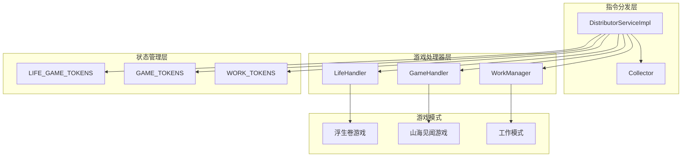

**图表来源**
- [DistributorServiceImpl.java](file://Base/src/main/java/com/bot/base/service/impl/DistributorServiceImpl.java#L41-L95)
- [WorkManager.java](file://Base/src/main/java/com/bot/base/service/WorkManager.java#L29-L31)

## 核心组件分析

### DistributorServiceImpl核心字段

系统维护了三个关键的状态映射表：

1. **LIFE_GAME_TOKENS**: 浮生卷游戏模式状态映射
2. **GAME_TOKENS**: 山海见闻游戏模式状态映射  
3. **WORK_TOKENS**: 工作模式用户集合

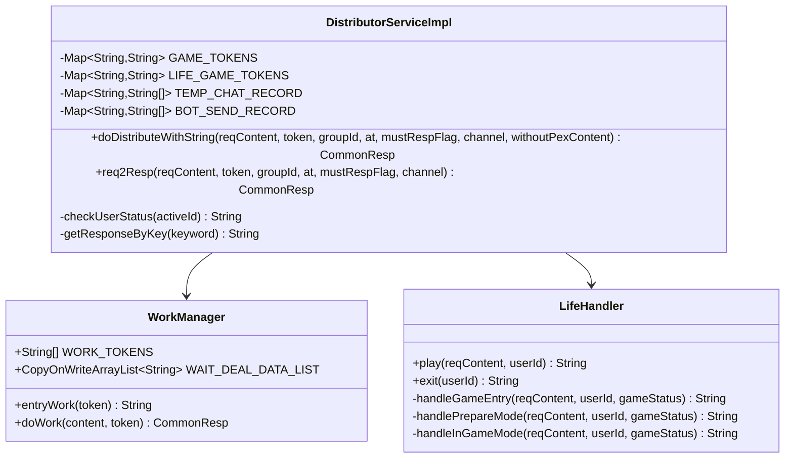

**图表来源**
- [DistributorServiceImpl.java](file://Base/src/main/java/com/bot/base/service/impl/DistributorServiceImpl.java#L94-L95)
- [WorkManager.java](file://Base/src/main/java/com/bot/base/service/WorkManager.java#L29-L31)

**章节来源**
- [DistributorServiceImpl.java](file://Base/src/main/java/com/bot/base/service/impl/DistributorServiceImpl.java#L94-L95)
- [WorkManager.java](file://Base/src/main/java/com/bot/base/service/WorkManager.java#L29-L31)

## 游戏模式状态管理

### 浮生卷游戏状态映射

浮生卷游戏采用三层状态管理模式：

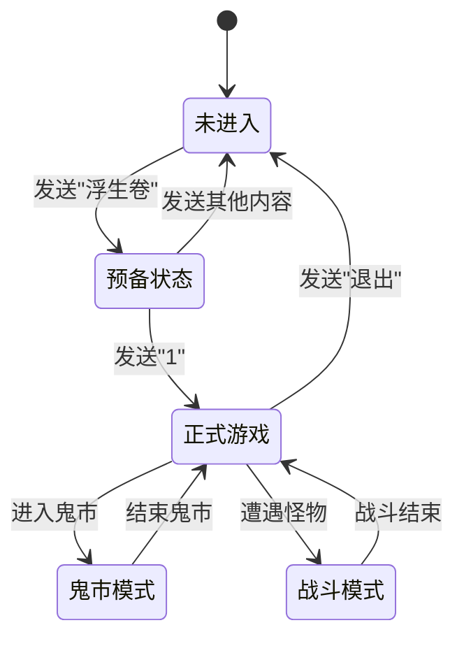

**图表来源**
- [LifeHandlerImpl.java](file://Life/src/main/java/com/bot/life/service/impl/LifeHandlerImpl.java#L157-L165)
- [ENGameMode.java](file://Life/src/main/java/com/bot/life/enums/ENGameMode.java#L8-L12)

### 山海见闻游戏状态映射

山海见闻游戏采用两阶段确认模式：

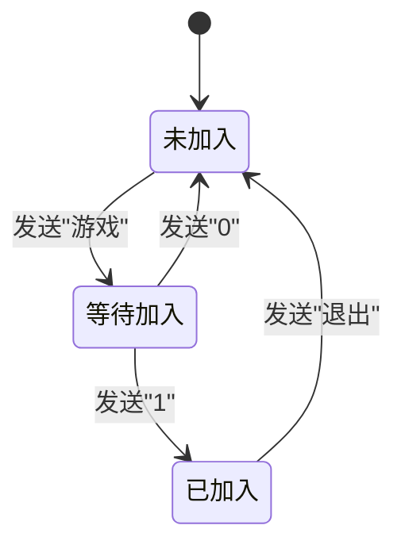

**图表来源**
- [DistributorServiceImpl.java](file://Base/src/main/java/com/bot/base/service/impl/DistributorServiceImpl.java#L288-L306)
- [ENUserGameStatus.java](file://Common/src/main/java/com/bot/common/enums/ENUserGameStatus.java#L14-L15)

### 工作模式状态映射

工作模式采用简单的一次性激活模式：

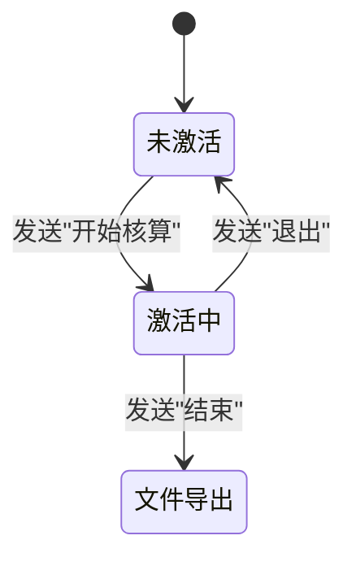

**图表来源**
- [WorkManager.java](file://Base/src/main/java/com/bot/base/service/WorkManager.java#L51-L64)

**章节来源**
- [LifeHandlerImpl.java](file://Life/src/main/java/com/bot/life/service/impl/LifeHandlerImpl.java#L157-L165)
- [ENGameMode.java](file://Life/src/main/java/com/bot/life/enums/ENGameMode.java#L8-L12)
- [ENUserGameStatus.java](file://Common/src/main/java/com/bot/common/enums/ENUserGameStatus.java#L14-L15)

## 指令分发流程

### 主要分发逻辑

系统按照优先级顺序处理指令：

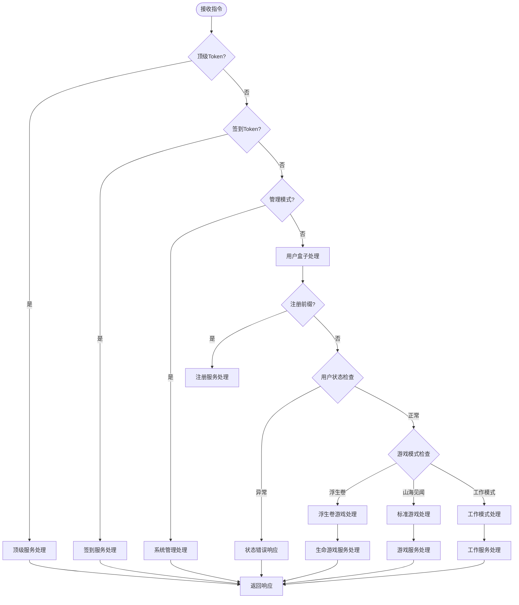

**图表来源**
- [DistributorServiceImpl.java](file://Base/src/main/java/com/bot/base/service/impl/DistributorServiceImpl.java#L216-L360)

### 浮生卷游戏指令处理流程

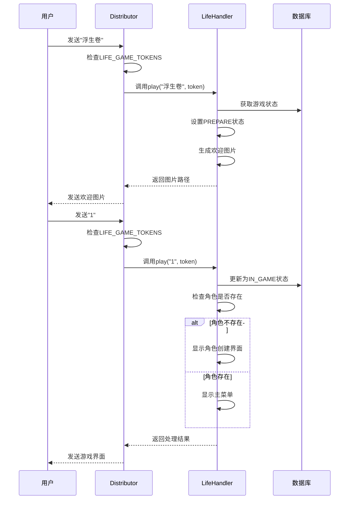

**图表来源**
- [DistributorServiceImpl.java](file://Base/src/main/java/com/bot/base/service/impl/DistributorServiceImpl.java#L270-L285)
- [LifeHandlerImpl.java](file://Life/src/main/java/com/bot/life/service/impl/LifeHandlerImpl.java#L174-L218)

**章节来源**
- [DistributorServiceImpl.java](file://Base/src/main/java/com/bot/base/service/impl/DistributorServiceImpl.java#L216-L360)
- [LifeHandlerImpl.java](file://Life/src/main/java/com/bot/life/service/impl/LifeHandlerImpl.java#L174-L218)

## 浮生卷游戏模式详解

### 进入流程

浮生卷游戏的进入遵循严格的三阶段流程：

1. **游戏名确认阶段**: 用户发送"浮生卷"触发游戏模式
2. **预备状态阶段**: 系统提示用户发送"1"正式进入
3. **正式游戏阶段**: 用户创建角色或加载现有角色

### 角色创建规范

系统要求角色创建包含以下信息：
- **昵称**: 中文字符，不超过7个字
- **派系**: 金、木、水、火、土五种选择
- **特色提示**: 系统提供各派系的属性特点说明

### 游戏状态转换

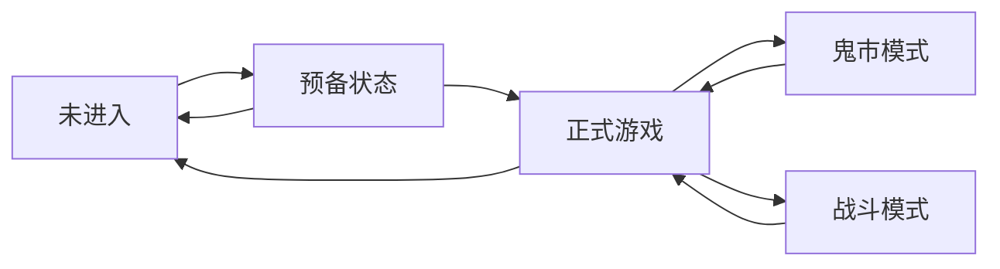

**图表来源**
- [LifeHandlerImpl.java](file://Life/src/main/java/com/bot/life/service/impl/LifeHandlerImpl.java#L174-L218)

**章节来源**
- [LifeHandlerImpl.java](file://Life/src/main/java/com/bot/life/service/impl/LifeHandlerImpl.java#L174-L218)

## 山海见闻游戏状态

### 停用状态处理

山海见闻游戏已进入无限期停止状态，系统在检测到相关指令时返回停用提示：

```mermaid
flowchart TD
A[接收游戏指令] --> B{指令类型}
B --> |发送"游戏"| C[返回停用提示]
B --> |其他指令| D[继续处理]
C --> E[提示游戏已停用]
D --> F[执行其他功能]
```

**图表来源**
- [DistributorServiceImpl.java](file://Base/src/main/java/com/bot/base/service/impl/DistributorServiceImpl.java#L308-L314)

### 边界情况处理

系统对山海见闻游戏的停用进行了优雅的处理，避免了功能异常：

- **指令拦截**: 直接返回停用提示
- **状态清理**: 保留原有状态映射结构
- **用户体验**: 提供友好的替代方案

**章节来源**
- [DistributorServiceImpl.java](file://Base/src/main/java/com/bot/base/service/impl/DistributorServiceImpl.java#L308-L314)

## 工作模式管理

### 激活机制

工作模式采用一次性激活机制：

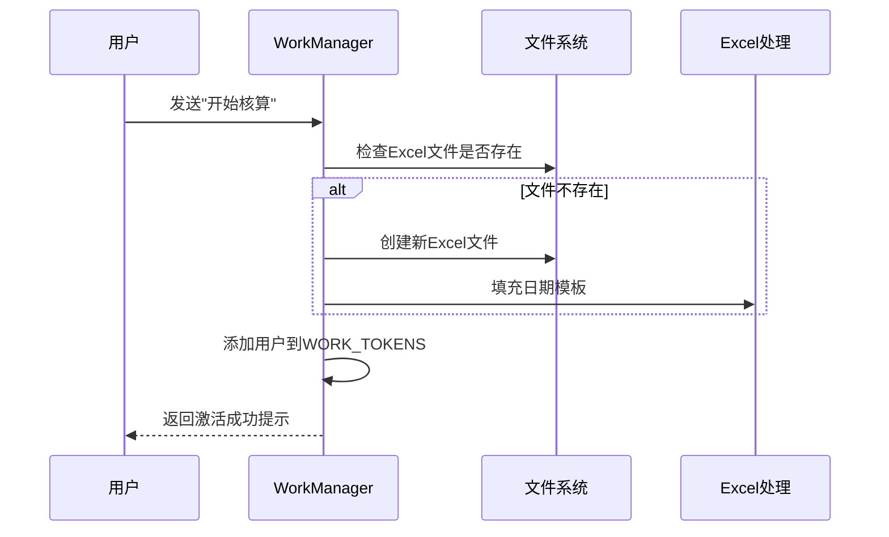

**图表来源**
- [WorkManager.java](file://Base/src/main/java/com/bot/base/service/WorkManager.java#L51-L64)

### 数据收集与处理

工作模式支持实时数据收集和批量处理：

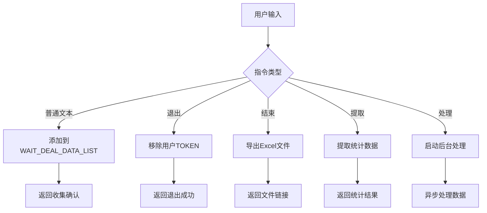

**图表来源**
- [WorkManager.java](file://Base/src/main/java/com/bot/base/service/WorkManager.java#L72-L93)

### 自动清理机制

系统实现了定时自动清理机制：

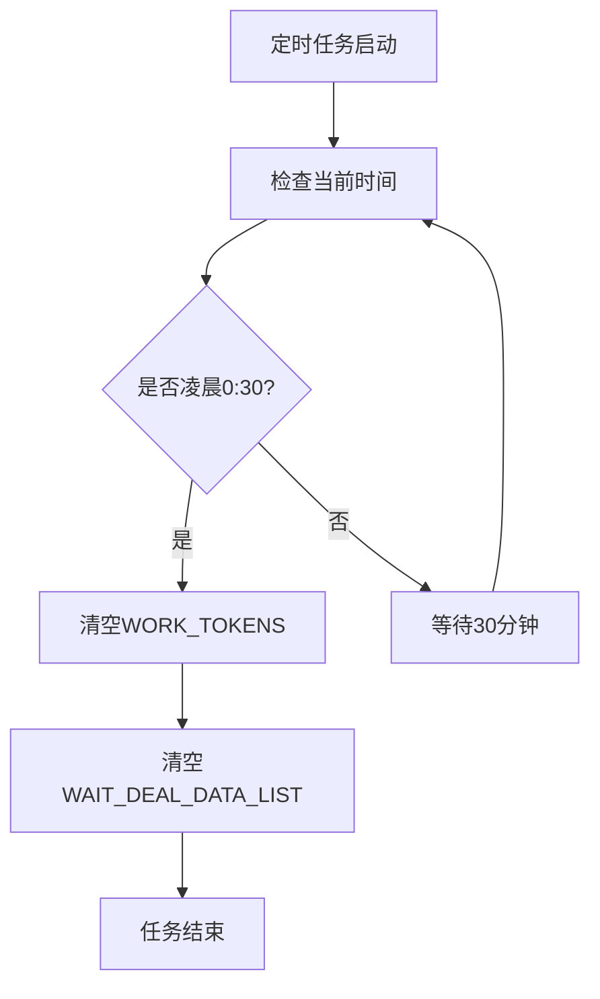

**图表来源**
- [AutoTask.java](file://Base/src/main/java/com/bot/base/task/AutoTask.java#L20-L38)

**章节来源**
- [WorkManager.java](file://Base/src/main/java/com/bot/base/service/WorkManager.java#L51-L93)
- [AutoTask.java](file://Base/src/main/java/com/bot/base/task/AutoTask.java#L20-L38)

## 状态转换图

### 完整游戏系统状态图

```mermaid
stateDiagram-v2
[*] --> 正常模式
--正常模式--
正常模式 --> 浮生卷游戏 : 发送"浮生卷"
正常模式 --> 山海见闻游戏 : 发送"游戏"(已停用)
正常模式 --> 工作模式 : 发送"开始核算"
正常模式 --> 管理模式 : 发送"进入管理模式"
--浮生卷游戏--
浮生卷游戏 --> 预备状态 : 接收游戏名
预备状态 --> 正式游戏 : 发送"1"
预备状态 --> 正常模式 : 发送其他内容
正式游戏 --> 鬼市模式 : 进入鬼市
正式游戏 --> 战斗模式 : 遭遇怪物
正式游戏 --> 正常模式 : 发送"退出"
鬼市模式 --> 正式游戏 : 结束鬼市
战斗模式 --> 正式游戏 : 战斗结束
--山海见闻游戏--
山海见闻游戏 --> 等待加入 : 发送"游戏"
等待加入 --> 正常模式 : 发送"0"
等待加入 --> 已加入 : 发送"1"
已加入 --> 正常模式 : 发送"退出"
--工作模式--
工作模式 --> 数据收集 : 输入核算信息
数据收集 --> 数据收集 : 继续输入
数据收集 --> 文件导出 : 发送"结束"
数据收集 --> 正常模式 : 发送"退出"
文件导出 --> 正常模式 : 完成处理
--管理模式--
管理模式 --> 管理功能 : 管理指令
管理功能 --> 管理功能 : 继续管理
管理功能 --> 正常模式 : 发送"退出管理模式"
```

**图表来源**
- [DistributorServiceImpl.java](file://Base/src/main/java/com/bot/base/service/impl/DistributorServiceImpl.java#L216-L360)
- [LifeHandlerImpl.java](file://Life/src/main/java/com/bot/life/service/impl/LifeHandlerImpl.java#L157-L165)

## 开发者指南

### 实现新游戏模式

要实现新的游戏模式，需要遵循以下步骤：

1. **扩展状态枚举**:
```java
// 在ENGameMode中添加新状态
public enum ENGameMode {
    NEW_GAME_MODE(5, "新游戏模式"),
    // ...
}
```

2. **实现处理器接口**:
```java
public interface NewGameHandler {
    String play(String reqContent, String userId);
    String exit(String userId);
    String manage(String reqContent);
}
```

3. **集成到分发器**:
```java
// 在DistributorServiceImpl中添加处理逻辑
if (NEW_GAME_TOKENS.containsKey(token)) {
    return new CommonResp(newGameHandler.play(reqContent, token), ENRespType.TEXT.getType());
}
```

### 管理游戏状态

使用以下模式管理游戏状态：

```java
// 状态检查和转换
public String handleGameState(String reqContent, String userId, GameStatus status) {
    ENGameMode currentMode = ENGameMode.getByCode(status.getGameMode());
    
    switch (currentMode) {
        case NOT_ENTERED:
            return handleNotEntered(reqContent, userId, status);
        case IN_GAME:
            return handleInGame(reqContent, userId, status);
        // ...
    }
}
```

### 处理模式切换边界情况

实现健壮的边界情况处理：

```java
// 状态验证和恢复
public String safeHandleGame(String reqContent, String userId) {
    try {
        GameStatus status = getOrCreateGameStatus(userId);
        // 验证状态有效性
        if (status == null || !isValidStatus(status)) {
            resetToNormalMode(userId);
            return "游戏状态异常，已重置为正常模式";
        }
        return processGameRequest(reqContent, userId, status);
    } catch (Exception e) {
        log.error("游戏处理异常: {}", userId, e);
        resetToNormalMode(userId);
        return "发生异常，已重置为正常模式";
    }
}
```

### 最佳实践

1. **状态持久化**: 使用数据库保存游戏状态
2. **异常处理**: 实现完善的异常捕获和恢复机制
3. **资源清理**: 确保状态转换时正确清理资源
4. **并发安全**: 使用适当的同步机制处理并发访问
5. **用户体验**: 提供清晰的状态反馈和错误提示

## 故障排除

### 常见问题及解决方案

#### 1. 游戏状态丢失
**症状**: 用户发送指令后无响应或状态异常
**原因**: 状态映射表数据丢失或内存溢出
**解决方案**: 
- 检查状态映射表初始化
- 实现状态持久化机制
- 添加状态恢复逻辑

#### 2. 模式切换冲突
**症状**: 多个游戏模式同时激活
**原因**: 状态检查逻辑不完整
**解决方案**:
```java
// 添加互斥检查
public boolean canEnterNewGame(String userId, String newGameType) {
    return !LIFE_GAME_TOKENS.containsKey(userId) && 
           !GAME_TOKENS.containsKey(userId) && 
           !WorkManager.WORK_TOKENS.contains(userId);
}
```

#### 3. 工作模式数据丢失
**症状**: 用户退出后数据无法找回
**原因**: 数据收集列表未持久化
**解决方案**:
```java
// 实现数据持久化
public void persistWorkData(String userId, String data) {
    // 保存到数据库或文件系统
    workDataManager.saveUserData(userId, data);
}
```

#### 4. 状态超时处理
**症状**: 用户长时间不操作导致状态混乱
**解决方案**:
```java
// 添加超时检查
public boolean isStateValid(GameStatus status) {
    long minutesSinceLastActivity = TimeUnit.MILLISECONDS.toMinutes(
        System.currentTimeMillis() - status.getLastActivityTime().getTime()
    );
    return minutesSinceLastActivity < MAX_INACTIVE_MINUTES;
}
```

### 调试工具

1. **状态监控**: 实现状态查询接口
2. **日志记录**: 添加详细的调试日志
3. **性能监控**: 监控状态转换性能
4. **异常追踪**: 实现异常堆栈追踪

通过遵循本文档的指导原则和最佳实践，开发者可以有效地扩展和维护游戏系统的指令分发功能，确保系统的稳定性和用户体验。