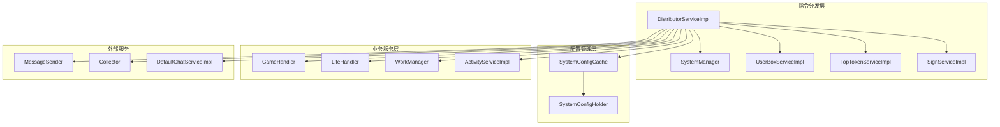
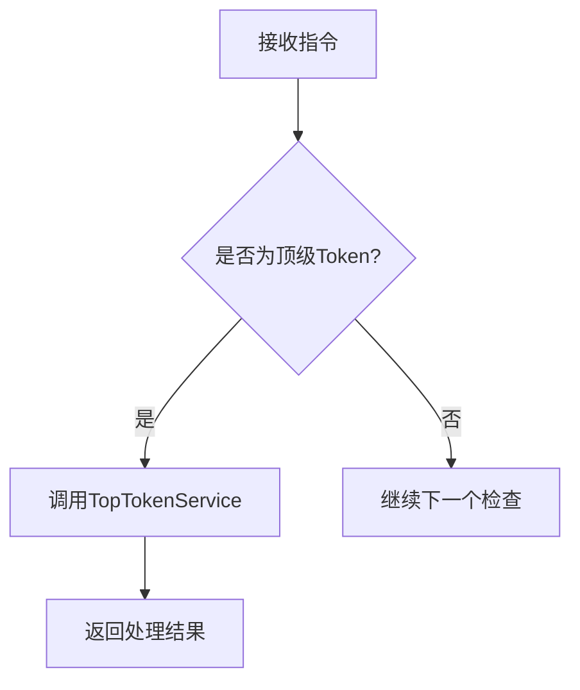
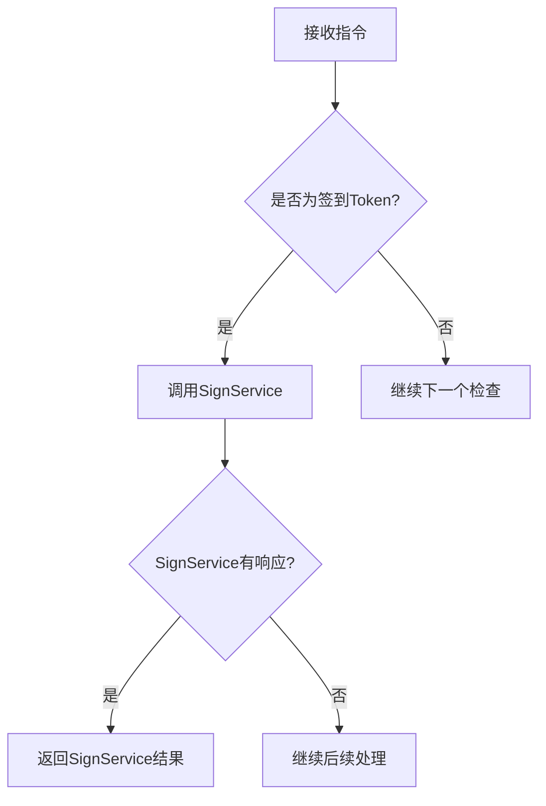
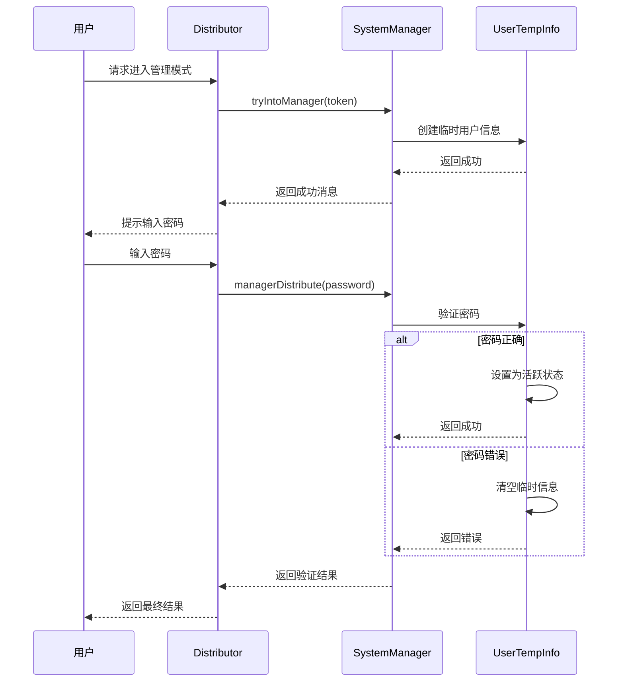
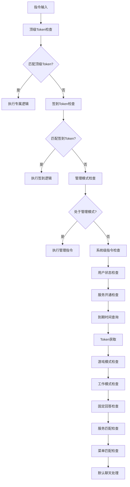
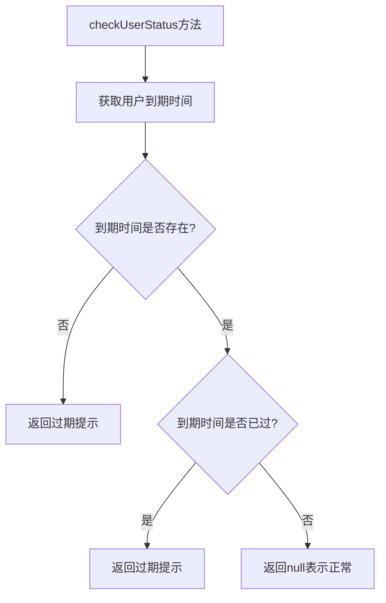
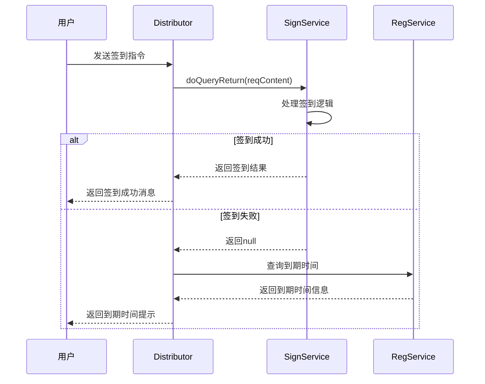
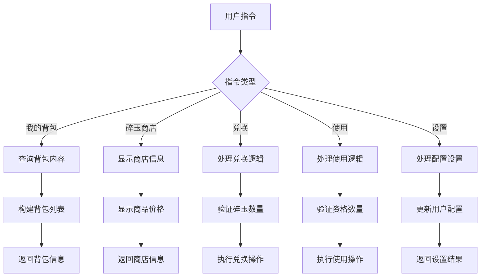
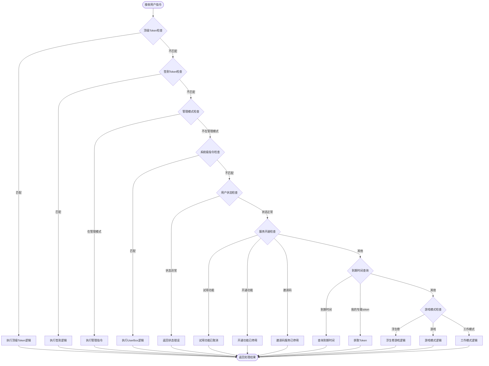

# 系统级指令分发文档

<cite>
**本文档引用的文件**
- [DistributorServiceImpl.java](file://Base/src/main/java/com/bot/base/service/impl/DistributorServiceImpl.java)
- [UserBoxServiceImpl.java](file://Base/src/main/java/com/bot/base/service/impl/UserBoxServiceImpl.java)
- [SystemManager.java](file://Base/src/main/java/com/bot/base/service/SystemManager.java)
- [BaseConsts.java](file://Common/src/main/java/com/bot/common/constant/BaseConsts.java)
- [ENSystemConfig.java](file://Common/src/main/java/com/bot/common/enums/ENSystemConfig.java)
- [SystemConfigCache.java](file://Game/src/main/java/com/bot/game/service/SystemConfigCache.java)
- [UserTempInfoDTO.java](file://Base/src/main/java/com/bot/base/dto/UserTempInfoDTO.java)
</cite>

## 目录
1. [概述](#概述)
2. [系统架构](#系统架构)
3. [核心组件分析](#核心组件分析)
4. [指令优先级机制](#指令优先级机制)
5. [核心业务逻辑](#核心业务逻辑)
6. [决策流程图](#决策流程图)
7. [扩展指南](#扩展指南)
8. [调试与异常处理](#调试与异常处理)
9. [总结](#总结)

## 概述

DistributorServiceImpl是系统级指令分发的核心组件，负责处理用户输入的各种指令请求。该服务实现了严格的优先级机制，确保不同类型的指令能够被正确路由到相应的处理模块。

系统级指令主要包括：
- 用户状态校验（checkUserStatus）
- 签到资格处理（signToken）
- 系统指令处理（userBoxService）
- 管理模式控制
- 服务开通与查询
- 游戏模式管理

## 系统架构



**图表来源**
- [DistributorServiceImpl.java](file://Base/src/main/java/com/bot/base/service/impl/DistributorServiceImpl.java#L40-L98)
- [SystemManager.java](file://Base/src/main/java/com/bot/base/service/SystemManager.java#L46-L81)

## 核心组件分析

### DistributorServiceImpl 核心特性

DistributorServiceImpl实现了以下核心功能：

#### 1. 顶级Token处理


**图表来源**
- [DistributorServiceImpl.java](file://Base/src/main/java/com/bot/base/service/impl/DistributorServiceImpl.java#L217-L219)

#### 2. 签到Token处理


**图表来源**
- [DistributorServiceImpl.java](file://Base/src/main/java/com/bot/base/service/impl/DistributorServiceImpl.java#L221-L226)

#### 3. 管理模式处理


**图表来源**
- [SystemManager.java](file://Base/src/main/java/com/bot/base/service/SystemManager.java#L88-L116)
- [UserTempInfoDTO.java](file://Base/src/main/java/com/bot/base/dto/UserTempInfoDTO.java#L28-L33)

**章节来源**
- [DistributorServiceImpl.java](file://Base/src/main/java/com/bot/base/service/impl/DistributorServiceImpl.java#L216-L360)
- [SystemManager.java](file://Base/src/main/java/com/bot/base/service/SystemManager.java#L88-L116)

### UserBoxServiceImpl 核心功能

UserBoxServiceImpl负责处理系统级指令，包括：

#### 1. 背包管理
- 查询用户背包内容
- 碎玉商店交易
- 资格兑换与使用

#### 2. 用户配置管理
- 回复频率设置
- 表情包开关控制
- 漂流瓶推送设置
- 欢迎语配置

#### 3. 特殊指令处理
- 引入小林引导
- 签到群信息
- 暗号激活

**章节来源**
- [UserBoxServiceImpl.java](file://Base/src/main/java/com/bot/base/service/impl/UserBoxServiceImpl.java#L57-L294)

## 指令优先级机制

系统实现了严格的指令优先级处理机制：



**图表来源**
- [DistributorServiceImpl.java](file://Base/src/main/java/com/bot/base/service/impl/DistributorServiceImpl.java#L216-L360)

### 优先级表

| 优先级 | 指令类型 | 触发条件 | 处理逻辑 |
|--------|----------|----------|----------|
| 1 | 顶级Token | SystemConfigCache.topToken.contains() | 调用TopTokenServiceImpl专属逻辑 |
| 2 | 签到Token | SystemConfigCache.signToken.contains() | 调用SignServiceImpl签到逻辑 |
| 3 | 管理模式 | SystemManager.userTempInfo != null | 调用SystemManager管理指令 |
| 4 | 系统级指令 | userBoxService.doQueryReturn() | 调用UserBoxServiceImpl系统指令 |
| 5 | 用户状态 | checkUserStatus() | 检查用户有效期 |
| 6 | 服务开通 | reqContent.startsWith() | 处理开通相关指令 |
| 7 | 到期时间 | "到期时间" | 查询用户到期时间 |
| 8 | Token获取 | "我的专属token" | 返回用户Token |

**章节来源**
- [DistributorServiceImpl.java](file://Base/src/main/java/com/bot/base/service/impl/DistributorServiceImpl.java#L216-L267)

## 核心业务逻辑

### checkUserStatus 用户状态校验



**图表来源**
- [DistributorServiceImpl.java](file://Base/src/main/java/com/bot/base/service/impl/DistributorServiceImpl.java#L404-L411)

### signToken 签到资格处理

签到Token具有高优先级，专门用于签到相关功能：



**图表来源**
- [DistributorServiceImpl.java](file://Base/src/main/java/com/bot/base/service/impl/DistributorServiceImpl.java#L221-L226)

### userBoxService 系统指令处理

UserBoxServiceImpl处理多种系统级指令：

#### 背包管理流程


**图表来源**
- [UserBoxServiceImpl.java](file://Base/src/main/java/com/bot/base/service/impl/UserBoxServiceImpl.java#L57-L294)

**章节来源**
- [DistributorServiceImpl.java](file://Base/src/main/java/com/bot/base/service/impl/DistributorServiceImpl.java#L404-L411)
- [UserBoxServiceImpl.java](file://Base/src/main/java/com/bot/base/service/impl/UserBoxServiceImpl.java#L57-L294)

## 决策流程图

### 完整指令分发决策流程



**图表来源**
- [DistributorServiceImpl.java](file://Base/src/main/java/com/bot/base/service/impl/DistributorServiceImpl.java#L216-L360)

### 关键触发条件说明

#### 管理模式触发条件
- 用户发送"进入管理模式"
- 系统中不存在其他管理模式用户
- 用户临时信息为空

#### 签到Token触发条件
- 用户Token存在于SystemConfigCache.signToken集合中
- 优先级高于普通用户指令

#### 顶级Token触发条件
- 用户Token存在于SystemConfigCache.topToken集合中
- 用于特殊权限用户的专属功能

**章节来源**
- [DistributorServiceImpl.java](file://Base/src/main/java/com/bot/base/service/impl/DistributorServiceImpl.java#L216-L360)
- [SystemManager.java](file://Base/src/main/java/com/bot/base/service/SystemManager.java#L88-L116)

## 扩展指南

### 添加新的系统级指令

#### 1. 在UserBoxServiceImpl中添加指令

```java
// 示例：添加新的系统指令
if (ObjectUtil.equals("新指令", reqContent)) {
    return new CommonResp("新指令处理结果", ENRespType.TEXT.getType());
}
```

#### 2. 在DistributorServiceImpl中添加优先级检查

```java
// 在req2Resp方法中适当位置添加
// 过一遍系统级指令
CommonResp userResp = userBoxService.doQueryReturn(reqContent, token, groupId, channel);
if (userResp != null) {
    return userResp;
}
```

#### 3. 添加常量定义

```java
// 在BaseConsts.SystemManager中添加
String NEW_INSTRUCTION = "新指令";
```

### 调试分发顺序

#### 1. 日志记录
在关键节点添加日志：

```java
log.info("处理指令: {}, 用户: {}", reqContent, token);
```

#### 2. 断点调试
在以下方法中设置断点：
- DistributorServiceImpl.req2Resp()
- UserBoxServiceImpl.doQueryReturn()

#### 3. 配置验证
检查SystemConfigCache中的配置项：
- topToken
- signToken
- userDateMap

### 处理异常情况

#### 1. 指令解析异常
```java
try {
    // 指令处理逻辑
} catch (Exception e) {
    log.error("指令处理异常: {}, 用户: {}", reqContent, token, e);
    return new CommonResp("系统繁忙，请稍后重试", ENRespType.TEXT.getType());
}
```

#### 2. 数据库访问异常
```java
@Transactional(rollbackFor = Exception.class)
public CommonResp doQueryReturn(...) {
    // 事务性操作
}
```

#### 3. 权限验证异常
```java
if (!hasPermission(token, requiredPermission)) {
    return new CommonResp("权限不足", ENRespType.TEXT.getType());
}
```

**章节来源**
- [DistributorServiceImpl.java](file://Base/src/main/java/com/bot/base/service/impl/DistributorServiceImpl.java#L216-L360)
- [UserBoxServiceImpl.java](file://Base/src/main/java/com/bot/base/service/impl/UserBoxServiceImpl.java#L57-L294)

## 调试与异常处理

### 调试技巧

#### 1. 日志级别配置
```xml
<!-- logback-spring.xml -->
<logger name="com.bot.base.service.impl.DistributorServiceImpl" level="DEBUG"/>
<logger name="com.bot.base.service.impl.UserBoxServiceImpl" level="DEBUG"/>
```

#### 2. 性能监控
```java
long startTime = System.currentTimeMillis();
// 执行指令处理
long duration = System.currentTimeMillis() - startTime;
log.info("指令处理耗时: {}ms", duration);
```

#### 3. 内存使用监控
```java
Runtime runtime = Runtime.getRuntime();
long usedMemory = runtime.totalMemory() - runtime.freeMemory();
log.info("当前内存使用: {}MB", usedMemory / 1024 / 1024);
```

### 常见异常处理

#### 1. 用户状态异常
```java
private String checkUserStatus(String activeId) {
    try {
        Date deadLineDate = SystemConfigCache.userDateMap.get(activeId);
        if (deadLineDate == null || deadLineDate.before(new Date())) {
            return BaseConsts.SystemManager.OVER_TIME_TIP;
        }
        return null;
    } catch (Exception e) {
        log.error("用户状态检查异常: {}", activeId, e);
        return "系统异常，请联系管理员";
    }
}
```

#### 2. 指令解析异常
```java
private CommonResp req2Resp(String reqContent, String token, String groupId, boolean at, boolean mustRespFlag, String channel) {
    try {
        // 主要逻辑
    } catch (Exception e) {
        log.error("指令分发异常: {}, 用户: {}", reqContent, token, e);
        return new CommonResp("系统异常，请稍后重试", ENRespType.TEXT.getType());
    }
}
```

**章节来源**
- [DistributorServiceImpl.java](file://Base/src/main/java/com/bot/base/service/impl/DistributorServiceImpl.java#L404-L411)
- [DistributorServiceImpl.java](file://Base/src/main/java/com/bot/base/service/impl/DistributorServiceImpl.java#L125-L197)

## 总结

DistributorServiceImpl作为系统级指令分发的核心组件，实现了以下关键特性：

### 核心优势
1. **严格的优先级机制**：确保重要指令优先处理
2. **模块化设计**：各功能模块职责清晰，便于维护
3. **灵活的扩展性**：支持新增指令类型和处理逻辑
4. **完善的异常处理**：保证系统稳定性

### 设计原则
1. **单一职责**：每个组件专注于特定功能领域
2. **开放封闭**：对扩展开放，对修改封闭
3. **依赖倒置**：高层模块不依赖低层模块的具体实现
4. **接口隔离**：客户端不应依赖它不需要的接口

### 最佳实践
1. **合理使用缓存**：SystemConfigCache提高查询效率
2. **事务一致性**：关键操作使用@Transactional注解
3. **日志记录**：关键操作添加详细日志
4. **异常处理**：全面的异常捕获和处理机制

通过本文档的详细分析，开发者可以深入理解系统级指令分发的工作原理，并能够有效地扩展和维护该系统。