# Bot项目数据流文档

<cite>
**本文档引用的文件**
- [newInstructDistributeController.java](file://Boot/src/main/java/com/bot/boot/controller/newInstructDistributeController.java)
- [DistributorServiceImpl.java](file://Base/src/main/java/com/bot/base/service/impl/DistributorServiceImpl.java)
- [LifeHandlerImpl.java](file://Life/src/main/java/com/bot/life/service/impl/LifeHandlerImpl.java)
- [SendMsgUtil.java](file://Common/src/main/java/com/bot/common/util/SendMsgUtil.java)
- [PictureDistributorServiceImpl.java](file://Base/src/main/java/com/bot/base/service/impl/PictureDistributorServiceImpl.java)
- [EmojiDistributorImpl.java](file://Base/src/main/java/com/bot/base/service/impl/EmojiDistributorImpl.java)
- [QQDealDistributor.java](file://Base/src/main/java/com/bot/base/service/impl/QQDealDistributor.java)
- [BaseConsts.java](file://Common/src/main/java/com/bot/common/constant/BaseConsts.java)
- [ENRespType.java](file://Common/src/main/java/com/bot/common/enums/ENRespType.java)
</cite>

## 目录
1. [概述](#概述)
2. [系统架构](#系统架构)
3. [消息接收流程](#消息接收流程)
4. [消息类型处理](#消息类型处理)
5. [指令分发机制](#指令分发机制)
6. [服务处理流程](#服务处理流程)
7. [响应发送机制](#响应发送机制)
8. [数据流时序图](#数据流时序图)
9. [性能优化建议](#性能优化建议)
10. [开发者指南](#开发者指南)

## 概述

Bot项目是一个基于QQ消息平台的智能聊天机器人系统，支持多种消息类型的处理和响应。系统采用模块化设计，通过newInstructDistributeController作为入口控制器，实现从QQ消息接收至响应返回的完整数据流转过程。

核心特性包括：
- 支持私聊和群聊消息处理
- 多种消息类型支持（文本、图片、表情、语音等）
- 游戏逻辑集成（浮生卷游戏）
- 智能指令分发和路由
- 异步处理和性能优化

## 系统架构

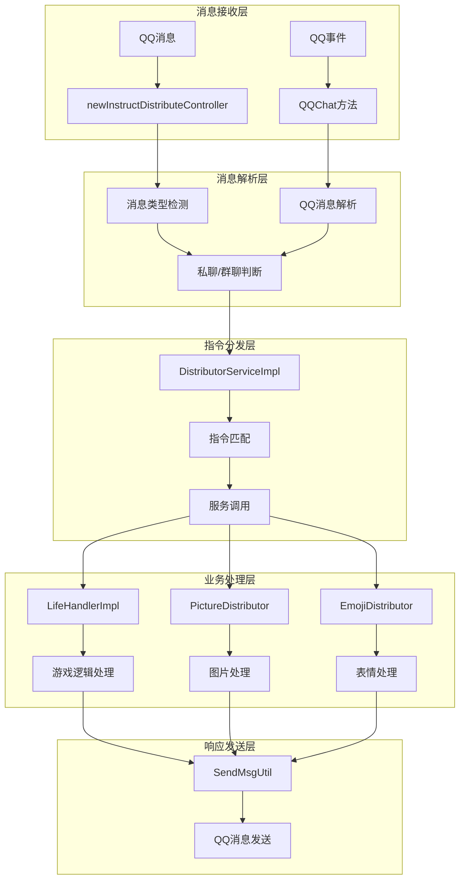

**图表来源**
- [newInstructDistributeController.java](file://Boot/src/main/java/com/bot/boot/controller/newInstructDistributeController.java#L72-L254)
- [DistributorServiceImpl.java](file://Base/src/main/java/com/bot/base/service/impl/DistributorServiceImpl.java#L125-L413)

## 消息接收流程

### 私聊消息处理

系统通过`newInstructDistributeController`的`weChatDeal`方法处理私聊消息：

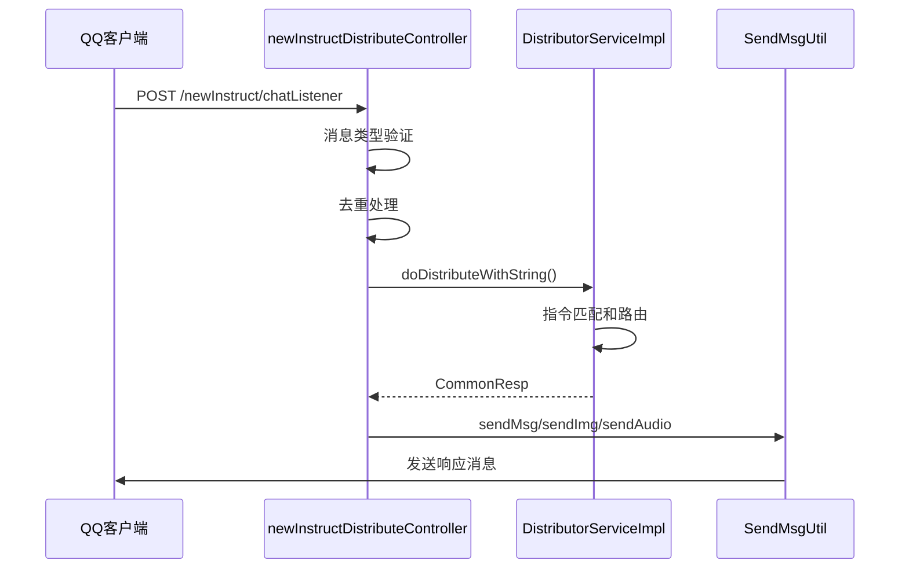

**图表来源**
- [newInstructDistributeController.java](file://Boot/src/main/java/com/bot/boot/controller/newInstructDistributeController.java#L72-L114)

### 群聊消息处理

群聊消息处理流程类似，但增加了@提及和昵称处理：

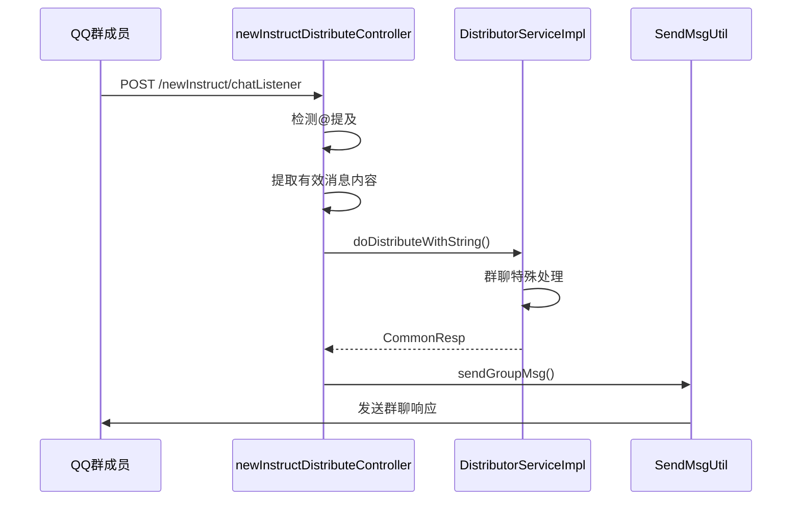

**图表来源**
- [newInstructDistributeController.java](file://Boot/src/main/java/com/bot/boot/controller/newInstructDistributeController.java#L116-L148)

### QQ事件处理

QQ事件通过专门的`QQChat`方法处理：

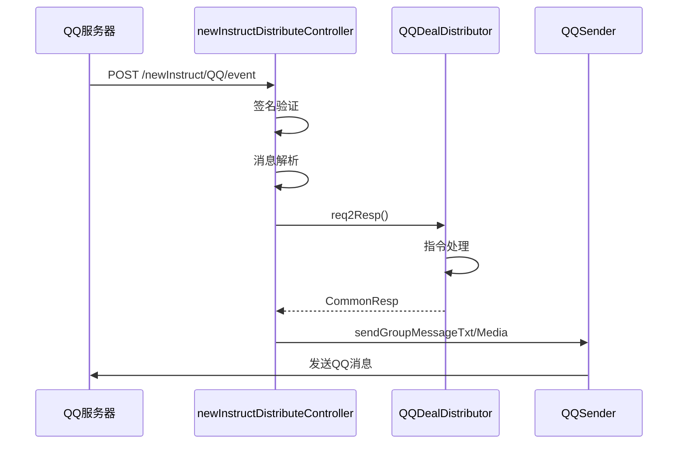

**图表来源**
- [newInstructDistributeController.java](file://Boot/src/main/java/com/bot/boot/controller/newInstructDistributeController.java#L222-L254)

**章节来源**
- [newInstructDistributeController.java](file://Boot/src/main/java/com/bot/boot/controller/newInstructDistributeController.java#L72-L254)

## 消息类型处理

### 文本消息处理

系统支持多种文本消息处理模式：

| 消息类型 | 消息ID | 处理方式 | 示例场景 |
|---------|--------|----------|----------|
| 私聊文字 | 60001 | 直接处理 | 用户私聊对话 |
| 群聊文字 | 80001 | @提及处理 | 群聊互动 |
| 私聊图片 | 60002 | 图片处理服务 | 图片转换请求 |
| 群聊图片 | 80002 | 图片处理服务 | 群聊图片分享 |
| 私聊表情 | 60006 | 表情处理服务 | 表情包发送 |
| 群聊表情 | 80006 | 表情处理服务 | 群聊表情互动 |
| 邀请入群 | 60022 | 自动接受 | 群邀请处理 |
| 进群通知 | 85008/85009 | 欢迎消息 | 新成员加入 |

### 图片消息处理

图片消息通过`PictureDistributorServiceImpl`处理：

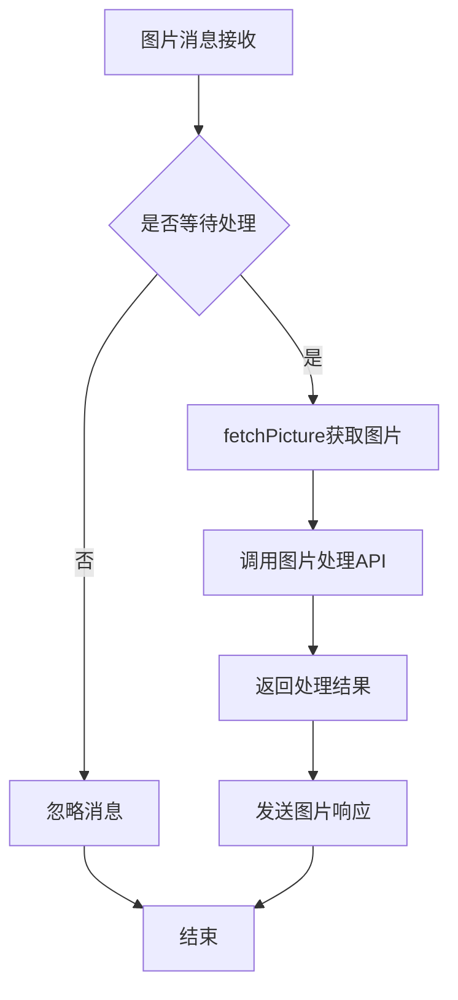

**图表来源**
- [PictureDistributorServiceImpl.java](file://Base/src/main/java/com/bot/base/service/impl/PictureDistributorServiceImpl.java#L31-L46)

### 表情消息处理

表情消息通过`EmojiDistributorImpl`处理：

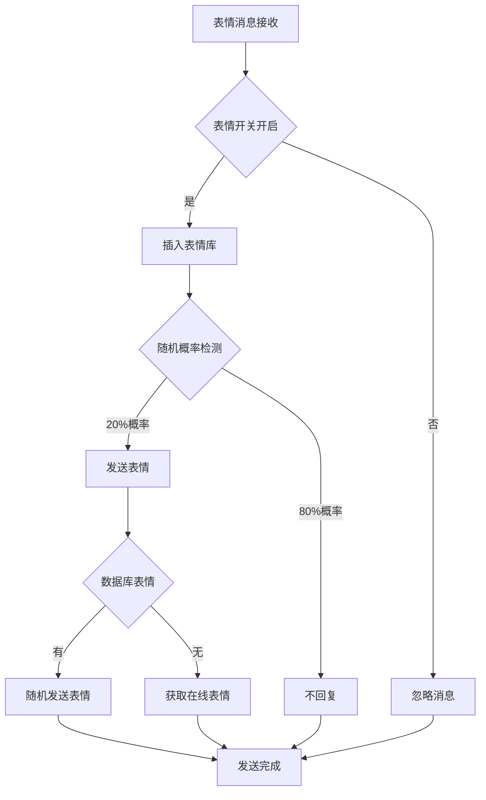

**图表来源**
- [EmojiDistributorImpl.java](file://Base/src/main/java/com/bot/base/service/impl/EmojiDistributorImpl.java#L31-L67)

**章节来源**
- [newInstructDistributeController.java](file://Boot/src/main/java/com/bot/boot/controller/newInstructDistributeController.java#L78-L208)
- [PictureDistributorServiceImpl.java](file://Base/src/main/java/com/bot/base/service/impl/PictureDistributorServiceImpl.java#L31-L46)
- [EmojiDistributorImpl.java](file://Base/src/main/java/com/bot/base/service/impl/EmojiDistributorImpl.java#L31-L67)

## 指令分发机制

### 分发器架构

`DistributorServiceImpl`是核心分发器，负责将消息路由到相应的服务：

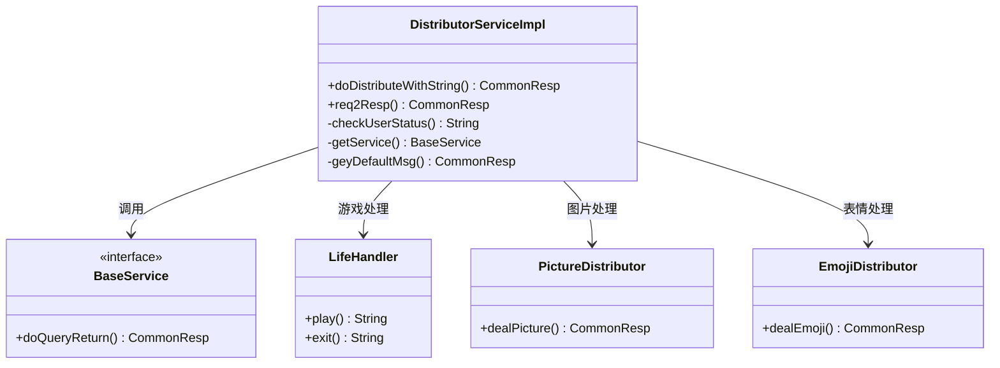

**图表来源**
- [DistributorServiceImpl.java](file://Base/src/main/java/com/bot/base/service/impl/DistributorServiceImpl.java#L41-L413)

### 指令匹配流程

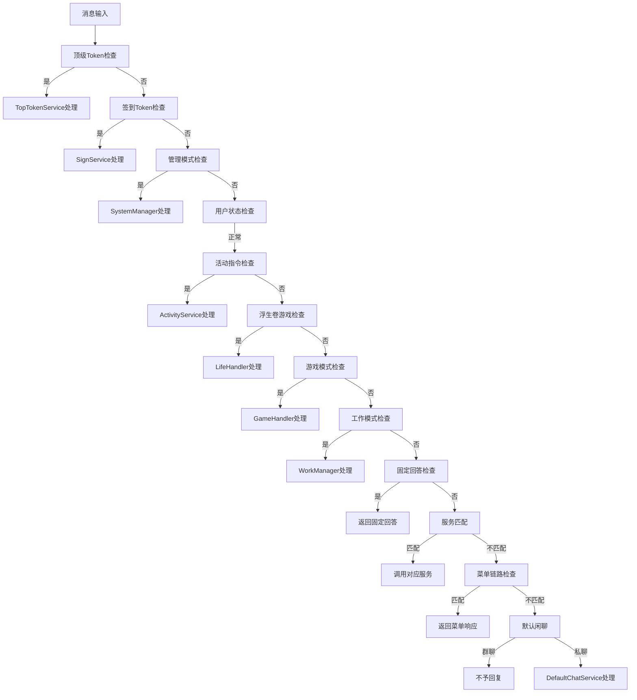

**图表来源**
- [DistributorServiceImpl.java](file://Base/src/main/java/com/bot/base/service/impl/DistributorServiceImpl.java#L216-L361)

**章节来源**
- [DistributorServiceImpl.java](file://Base/src/main/java/com/bot/base/service/impl/DistributorServiceImpl.java#L125-L413)

## 服务处理流程

### 浮生卷游戏处理

浮生卷游戏是系统的核心功能之一，通过`LifeHandlerImpl`处理：

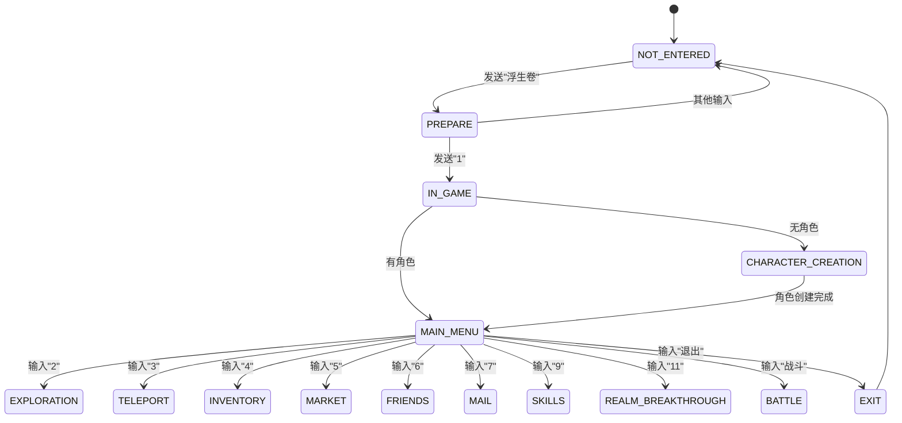

**图表来源**
- [LifeHandlerImpl.java](file://Life/src/main/java/com/bot/life/service/impl/LifeHandlerImpl.java#L148-L166)

### 图片处理服务

图片处理服务支持图片转线稿功能：

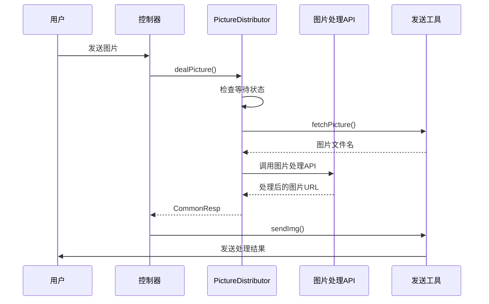

**图表来源**
- [PictureDistributorServiceImpl.java](file://Base/src/main/java/com/bot/base/service/impl/PictureDistributorServiceImpl.java#L31-L46)

**章节来源**
- [LifeHandlerImpl.java](file://Life/src/main/java/com/bot/life/service/impl/LifeHandlerImpl.java#L148-L800)
- [PictureDistributorServiceImpl.java](file://Base/src/main/java/com/bot/base/service/impl/PictureDistributorServiceImpl.java#L31-L46)

## 响应发送机制

### 响应类型定义

系统支持多种响应类型：

| 响应类型 | 类型标识 | 处理方式 | 使用场景 |
|---------|----------|----------|----------|
| 文本 | 0 | sendMsg | 普通文字回复 |
| 图片 | 1 | sendImg | 图片展示 |
| 视频 | 2 | sendVideo | 视频播放 |
| 文件 | 3 | sendFile | 文件传输 |
| 语音 | 4 | sendAudio | 语音消息 |

### 发送工具类

`SendMsgUtil`提供了统一的消息发送接口：

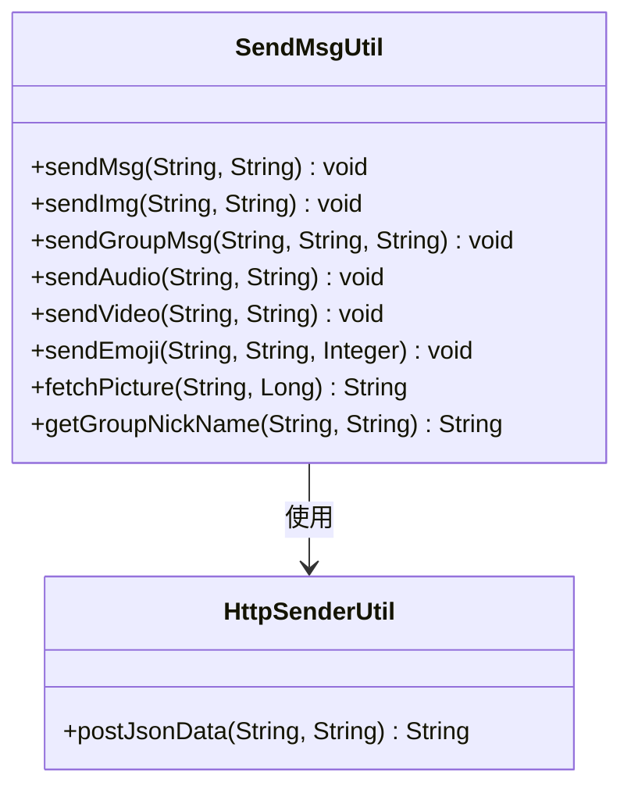

**图表来源**
- [SendMsgUtil.java](file://Common/src/main/java/com/bot/common/util/SendMsgUtil.java#L27-L273)

### 异步处理机制

对于耗时操作（如视频发送），系统采用异步处理：

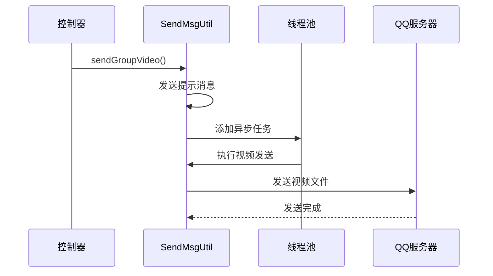

**图表来源**
- [newInstructDistributeController.java](file://Boot/src/main/java/com/bot/boot/controller/newInstructDistributeController.java#L105-L141)

**章节来源**
- [SendMsgUtil.java](file://Common/src/main/java/com/bot/common/util/SendMsgUtil.java#L27-L273)
- [ENRespType.java](file://Common/src/main/java/com/bot/common/enums/ENRespType.java#L9-L14)

## 数据流时序图

### 完整消息处理流程

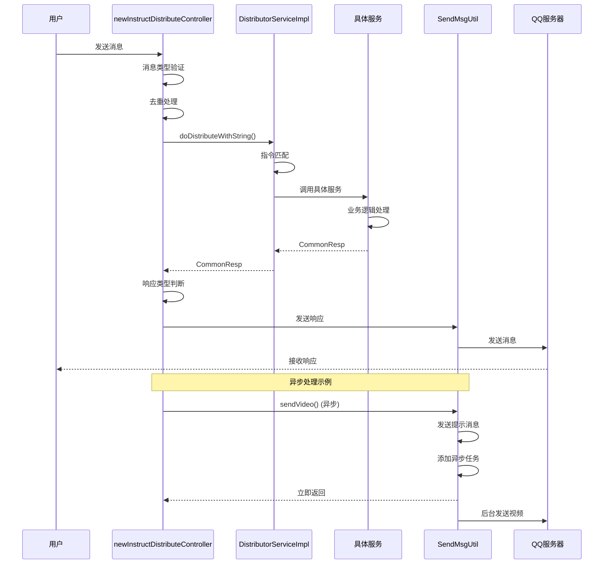

**图表来源**
- [newInstructDistributeController.java](file://Boot/src/main/java/com/bot/boot/controller/newInstructDistributeController.java#L72-L254)
- [DistributorServiceImpl.java](file://Base/src/main/java/com/bot/base/service/impl/DistributorServiceImpl.java#L125-L413)

### 游戏模式处理流程

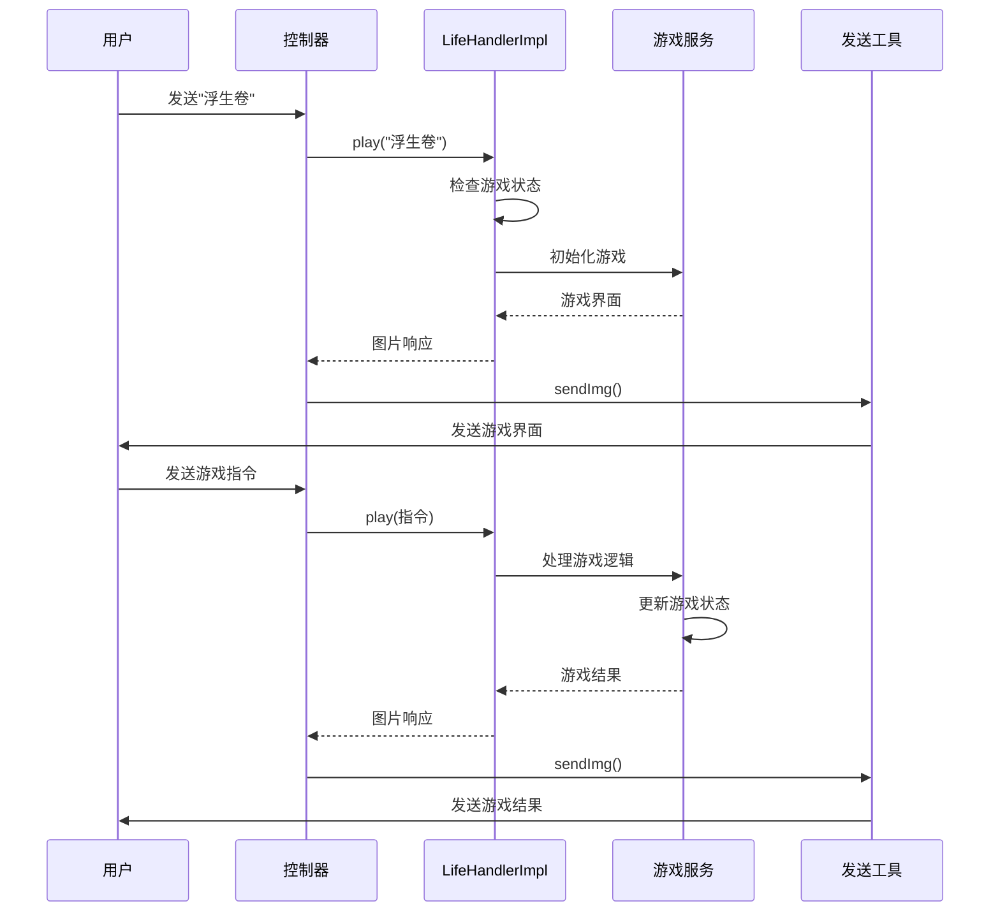

**图表来源**
- [LifeHandlerImpl.java](file://Life/src/main/java/com/bot/life/service/impl/LifeHandlerImpl.java#L148-L166)
- [newInstructDistributeController.java](file://Boot/src/main/java/com/bot/boot/controller/newInstructDistributeController.java#L270-L279)

## 性能优化建议

### 消息去重机制

系统实现了消息ID去重机制，防止重复处理：

```java
// 消息ID去重列表
private static List<Long> msgIdList = new ArrayList<>();

// 去重检查
if (msgIdList.contains(msgId)) {
    return;
}
msgIdList.add(msgId);
```

### 缓存策略

- **表情缓存**：表情包数据缓存在数据库中，避免重复获取
- **配置缓存**：系统配置通过`SystemConfigCache`缓存，减少数据库查询
- **用户状态缓存**：用户权限和状态信息缓存，提高响应速度

### 异步处理

- **大文件处理**：视频、音频等大文件采用异步发送
- **图片处理**：图片转换等耗时操作异步执行
- **网络请求**：外部API调用采用异步方式

### 连接池管理

- **HTTP连接池**：使用连接池管理对外部服务的HTTP请求
- **数据库连接池**：合理配置数据库连接池大小
- **线程池管理**：通过`ThreadPoolManager`管理异步任务

## 开发者指南

### 请求链路追踪

#### 日志埋点建议

1. **消息接收点**：
```java
log.info("收到来自[{}]的消息：[{}]", userId, msg);
```

2. **指令分发点**：
```java
log.info("分发指令：content={}, token={}, groupId={}", reqContent, token, groupId);
```

3. **服务调用点**：
```java
log.info("调用服务：className={}, params={}", className, params);
```

4. **响应发送点**：
```java
log.info("发送响应：type={}, content={}", resp.getType(), resp.getMsg());
```

#### 链路追踪实现

```java
// 在每个关键节点添加链路标识
public CommonResp processMessage(String reqContent, String token, String groupId) {
    String traceId = UUID.randomUUID().toString();
    log.info("[{}] 消息处理开始", traceId);
    
    try {
        // 处理逻辑
        log.info("[{}] 指令匹配完成", traceId);
        
        // 服务调用
        log.info("[{}] 服务调用完成", traceId);
        
        return result;
    } catch (Exception e) {
        log.error("[{}] 处理失败", traceId, e);
        throw e;
    }
}
```

### 添加新服务

#### 1. 创建服务接口

```java
public interface NewService {
    CommonResp process(String content, String token, String groupId);
}
```

#### 2. 实现服务类

```java
@Service
public class NewServiceImpl implements NewService {
    @Override
    public CommonResp process(String content, String token, String groupId) {
        // 业务逻辑处理
        return new CommonResp("处理结果", ENRespType.TEXT.getType());
    }
}
```

#### 3. 注册到分发器

```java
// 在DistributorServiceImpl中添加服务映射
@Autowired
private Map<String, BaseService> serviceMap;

// 在构造函数或初始化方法中注册
serviceMap.put("newService", new NewServiceImpl());
```

#### 4. 添加指令匹配

```java
// 在DistributorServiceImpl的req2Resp方法中添加
if (reqContent.startsWith("新功能")) {
    return new NewServiceImpl().process(reqContent, token, groupId);
}
```

### 性能监控

#### 关键指标监控

1. **消息处理延迟**：
```java
long startTime = System.currentTimeMillis();
// 处理逻辑
long duration = System.currentTimeMillis() - startTime;
log.info("消息处理耗时：{}ms", duration);
```

2. **服务调用统计**：
```java
// 在BaseService接口中添加统计
default CommonResp doQueryReturn(String content, String token, String groupId, String channel) {
    long startTime = System.currentTimeMillis();
    try {
        CommonResp result = process(content, token, groupId, channel);
        // 统计成功次数
        return result;
    } finally {
        // 统计总次数和耗时
    }
}
```

3. **内存使用监控**：
```java
// 监控消息ID列表大小
if (msgIdList.size() > MAX_SIZE) {
    msgIdList.clear();
}
```

### 错误处理

#### 异常捕获和日志记录

```java
@Override
public CommonResp doDistributeWithString(String reqContent, String token, String groupId, 
                                       boolean at, boolean mustRespFlag, String channel, String withoutPexContent) {
    try {
        // 主要逻辑
        return result;
    } catch (Exception e) {
        log.error("处理消息失败：content={}, token={}, groupId={}", 
                 reqContent, token, groupId, e);
        return new CommonResp("系统繁忙，请稍后再试", ENRespType.TEXT.getType());
    }
}
```

#### 降级策略

```java
// 当外部服务不可用时的降级处理
public CommonResp fallbackProcess(String content, String token, String groupId) {
    // 返回默认响应或缓存结果
    return new CommonResp("服务暂时不可用，请稍后再试", ENRespType.TEXT.getType());
}
```

**章节来源**
- [DistributorServiceImpl.java](file://Base/src/main/java/com/bot/base/service/impl/DistributorServiceImpl.java#L125-L413)
- [newInstructDistributeController.java](file://Boot/src/main/java/com/bot/boot/controller/newInstructDistributeController.java#L72-L254)