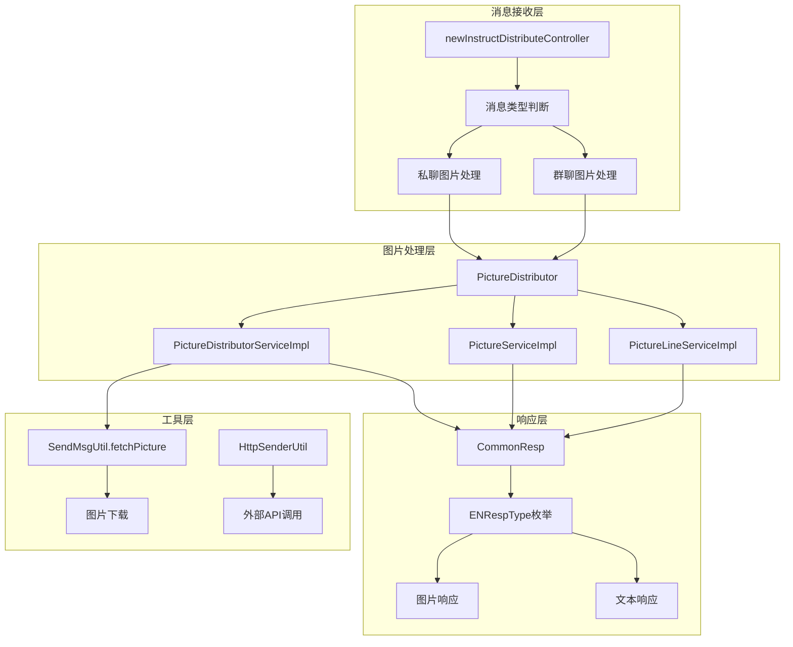
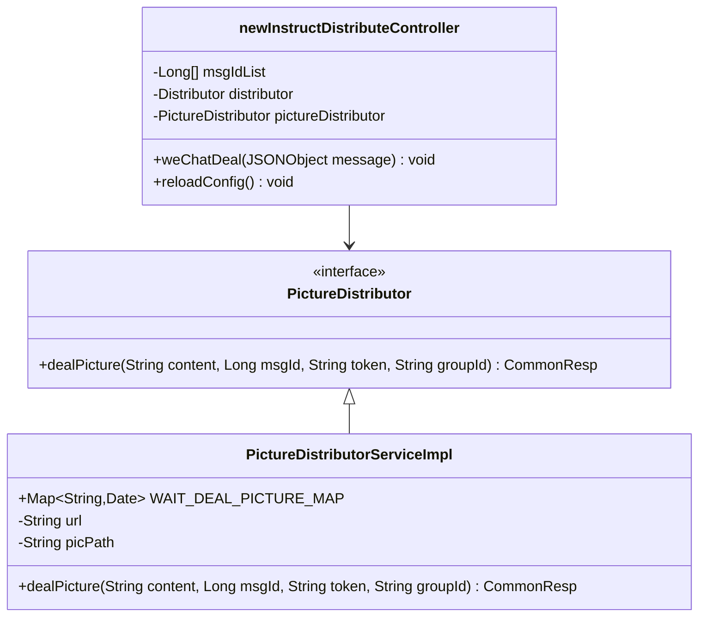
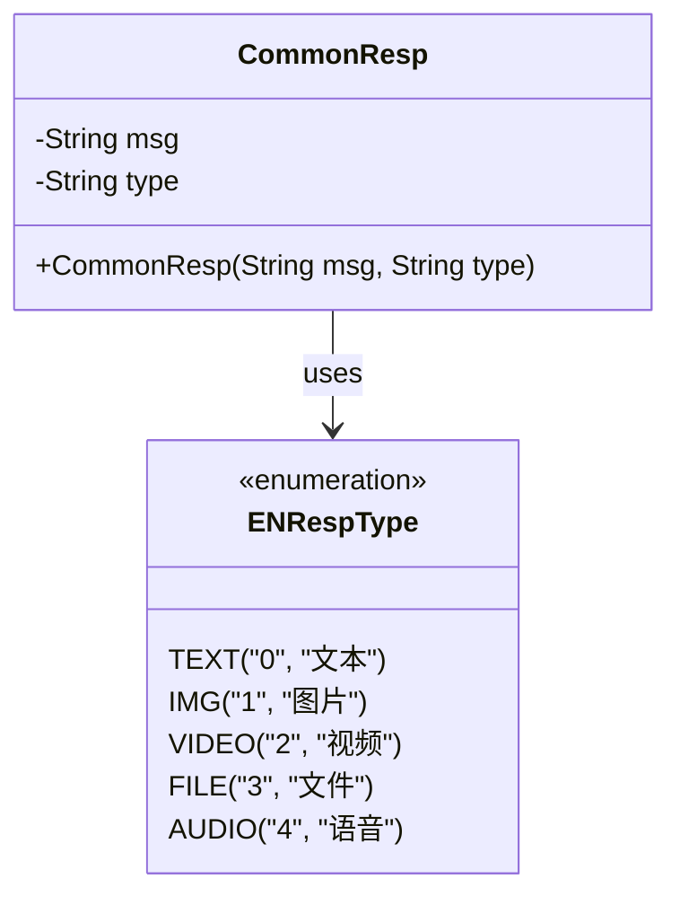
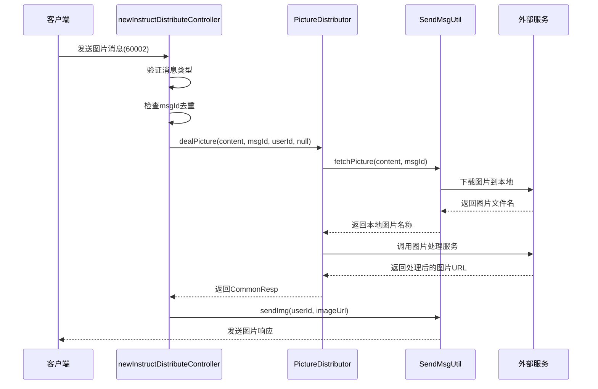
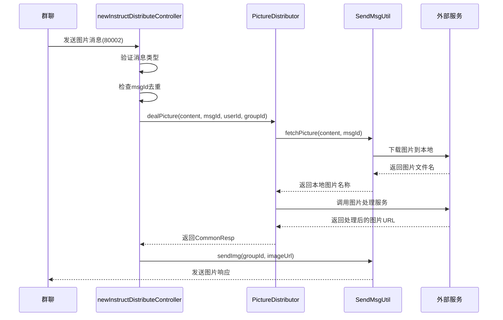
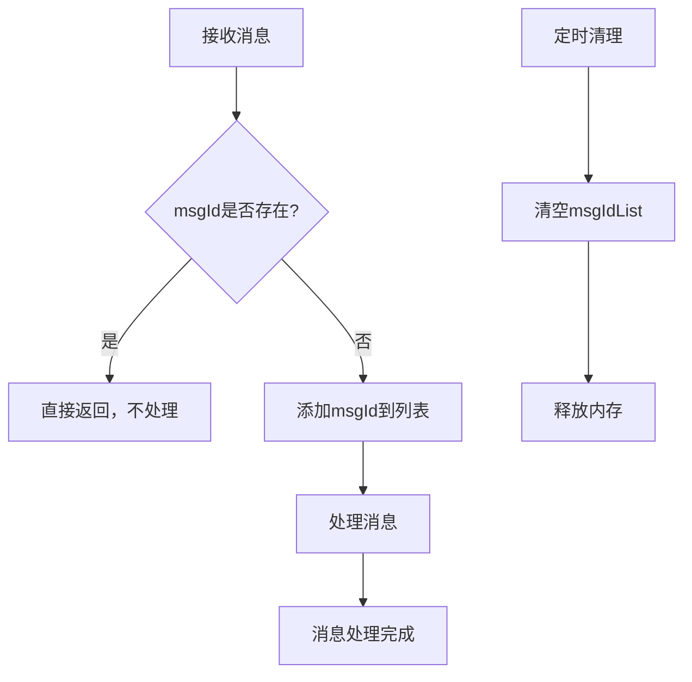
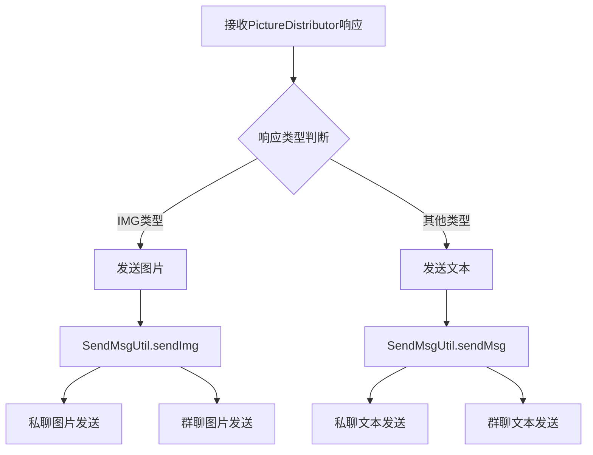

# 图片消息处理

<cite>
**本文档引用的文件**
- [newInstructDistributeController.java](file://Boot/src/main/java/com/bot/boot/controller/newInstructDistributeController.java)
- [PictureDistributor.java](file://Base/src/main/java/com/bot/base/service/PictureDistributor.java)
- [PictureDistributorServiceImpl.java](file://Base/src/main/java/com/bot/base/service/impl/PictureDistributorServiceImpl.java)
- [CommonResp.java](file://Base/src/main/java/com/bot/base/dto/CommonResp.java)
- [ENRespType.java](file://Common/src/main/java/com/bot/common/enums/ENRespType.java)
- [ENPictureType.java](file://Common/src/main/java/com/bot/common/enums/ENPictureType.java)
- [SendMsgUtil.java](file://Common/src/main/java/com/bot/common/util/SendMsgUtil.java)
- [PictureServiceImpl.java](file://Base/src/main/java/com/bot/base/service/impl/PictureServiceImpl.java)
- [PictureLineServiceImpl.java](file://Base/src/main/java/com/bot/base/service/impl/PictureLineServiceImpl.java)
- [application.properties](file://Boot/src/main/resources/application.properties)
- [BaseConsts.java](file://Common/src/main/java/com/bot/common/constant/BaseConsts.java)
</cite>

## 目录
1. [概述](#概述)
2. [系统架构](#系统架构)
3. [核心组件分析](#核心组件分析)
4. [消息处理流程](#消息处理流程)
5. [图片URL提取机制](#图片url提取机制)
6. [去重机制](#去重机制)
7. [响应处理逻辑](#响应处理逻辑)
8. [开发者指南](#开发者指南)
9. [性能优化建议](#性能优化建议)
10. [故障排除](#故障排除)

## 概述

本文档详细说明了机器人系统中图片消息的处理机制，重点关注`messageType`为60002（私聊）和80002（群聊）的图片消息处理流程。系统通过`newInstructDistributeController`控制器接收图片消息，利用`PictureDistributor`接口进行分发处理，并支持图片和文本混合回复的特性。

## 系统架构



**架构图来源**
- [newInstructDistributeController.java](file://Boot/src/main/java/com/bot/boot/controller/newInstructDistributeController.java#L72-L180)
- [PictureDistributor.java](file://Base/src/main/java/com/bot/base/service/PictureDistributor.java#L4-L16)

## 核心组件分析

### newInstructDistributeController

控制器负责接收和初步处理图片消息，实现了消息去重和基础的消息类型判断。



**类图来源**
- [newInstructDistributeController.java](file://Boot/src/main/java/com/bot/boot/controller/newInstructDistributeController.java#L45-L70)
- [PictureDistributor.java](file://Base/src/main/java/com/bot/base/service/PictureDistributor.java#L4-L16)
- [PictureDistributorServiceImpl.java](file://Base/src/main/java/com/bot/base/service/impl/PictureDistributorServiceImpl.java#L18-L48)

### PictureDistributor接口

定义了图片处理的核心接口，支持不同类型的图片处理服务。

**接口方法说明：**
- `dealPicture(String content, Long msgId, String token, String groupId)`：处理图片消息的主要方法

### CommonResp响应对象

封装了统一的响应结构，支持多种响应类型。



**类图来源**
- [CommonResp.java](file://Base/src/main/java/com/bot/base/dto/CommonResp.java#L6-L18)
- [ENRespType.java](file://Common/src/main/java/com/bot/common/enums/ENRespType.java#L8-L20)

**节来源**
- [newInstructDistributeController.java](file://Boot/src/main/java/com/bot/boot/controller/newInstructDistributeController.java#L45-L70)
- [PictureDistributor.java](file://Base/src/main/java/com/bot/base/service/PictureDistributor.java#L4-L16)
- [CommonResp.java](file://Base/src/main/java/com/bot/base/dto/CommonResp.java#L6-L18)

## 消息处理流程

### 私聊图片处理流程



**序列图来源**
- [newInstructDistributeController.java](file://Boot/src/main/java/com/bot/boot/controller/newInstructDistributeController.java#L159-L168)
- [PictureDistributorServiceImpl.java](file://Base/src/main/java/com/bot/base/service/impl/PictureDistributorServiceImpl.java#L30-L44)
- [SendMsgUtil.java](file://Common/src/main/java/com/bot/common/util/SendMsgUtil.java#L171-L188)

### 群聊图片处理流程

群聊图片处理流程与私聊类似，但增加了群组标识和可能的@提及处理。



**序列图来源**
- [newInstructDistributeController.java](file://Boot/src/main/java/com/bot/boot/controller/newInstructDistributeController.java#L170-L179)
- [PictureDistributorServiceImpl.java](file://Base/src/main/java/com/bot/base/service/impl/PictureDistributorServiceImpl.java#L30-L44)

**节来源**
- [newInstructDistributeController.java](file://Boot/src/main/java/com/bot/boot/controller/newInstructDistributeController.java#L159-L179)
- [PictureDistributorServiceImpl.java](file://Base/src/main/java/com/bot/base/service/impl/PictureDistributorServiceImpl.java#L30-L44)

## 图片URL提取机制

### content参数解析

系统通过`content`参数中的图片URL进行处理，具体实现如下：

1. **URL提取**：通过`SendMsgUtil.fetchPicture()`方法从content中提取图片URL
2. **本地存储**：将远程图片下载到本地服务器，文件名为时间戳.png格式
3. **路径处理**：使用配置的图片路径进行文件存储和访问

### 图片处理服务

系统支持多种图片处理服务：

| 服务类型 | 实现类 | 功能描述 |
|---------|--------|----------|
| 线稿转换 | PictureDistributorServiceImpl | 将上传的图片转换为线稿 |
| 头像生成 | PictureServiceImpl | 根据关键词生成相应类型的头像 |
| CP创作 | CPServiceImpl | 基于角色名称生成CP配对图片 |

**节来源**
- [SendMsgUtil.java](file://Common/src/main/java/com/bot/common/util/SendMsgUtil.java#L171-L188)
- [PictureDistributorServiceImpl.java](file://Base/src/main/java/com/bot/base/service/impl/PictureDistributorServiceImpl.java#L34-L42)
- [PictureServiceImpl.java](file://Base/src/main/java/com/bot/base/service/impl/PictureServiceImpl.java#L25-L39)

## 去重机制

### msgId去重原理

系统通过维护一个全局的`msgIdList`列表来防止重复处理相同的消息：



**流程图来源**
- [newInstructDistributeController.java](file://Boot/src/main/java/com/bot/boot/controller/newInstructDistributeController.java#L89-L92)
- [newInstructDistributeController.java](file://Boot/src/main/java/com/bot/boot/controller/newInstructDistributeController.java#L210-L214)

### 去重效果

- **防止重复处理**：确保同一消息不会被多次处理
- **内存管理**：通过定期清理避免内存泄漏
- **性能优化**：减少不必要的计算和网络请求

**节来源**
- [newInstructDistributeController.java](file://Boot/src/main/java/com/bot/boot/controller/newInstructDistributeController.java#L69-L92)
- [newInstructDistributeController.java](file://Boot/src/main/java/com/bot/boot/controller/newInstructDistributeController.java#L210-L214)

## 响应处理逻辑

### 混合回复特性

系统支持同时返回图片和文本两种类型的响应：



**流程图来源**
- [newInstructDistributeController.java](file://Boot/src/main/java/com/bot/boot/controller/newInstructDistributeController.java#L162-L168)
- [newInstructDistributeController.java](file://Boot/src/main/java/com/bot/boot/controller/newInstructDistributeController.java#L172-L179)

### 响应类型映射

| ENRespType | 类型值 | 描述 | 发送方法 |
|-----------|--------|------|----------|
| TEXT | 0 | 文本消息 | sendMsg |
| IMG | 1 | 图片消息 | sendImg |
| VIDEO | 2 | 视频消息 | sendVideo |
| FILE | 3 | 文件消息 | sendFile |
| AUDIO | 4 | 语音消息 | sendAudio |

**节来源**
- [newInstructDistributeController.java](file://Boot/src/main/java/com/bot/boot/controller/newInstructDistributeController.java#L162-L179)
- [ENRespType.java](file://Common/src/main/java/com/bot/common/enums/ENRespType.java#L8-L20)

## 开发者指南

### 实现PictureDistributor接口

开发者可以通过实现`PictureDistributor`接口来自定义图片处理逻辑：

```java
@Service("customPictureDistributor")
public class CustomPictureDistributor implements PictureDistributor {
    
    @Override
    public CommonResp dealPicture(String content, Long msgId, String token, String groupId) {
        // 自定义图片处理逻辑
        try {
            // 1. 解析content参数
            String imageUrl = extractImageUrl(content);
            
            // 2. 执行图片处理
            String processedImage = processImage(imageUrl);
            
            // 3. 返回处理结果
            return new CommonResp(processedImage, ENRespType.IMG.getType());
            
        } catch (Exception e) {
            log.error("图片处理失败: {}", e.getMessage(), e);
            return new CommonResp("图片处理失败，请稍后重试", ENRespType.TEXT.getType());
        }
    }
    
    private String extractImageUrl(String content) {
        // 实现URL提取逻辑
        return content;
    }
    
    private String processImage(String imageUrl) {
        // 实现图片处理逻辑
        return imageUrl;
    }
}
```

### 异常处理最佳实践

1. **输入验证**：检查content参数的有效性
2. **网络异常处理**：捕获HTTP请求异常
3. **资源清理**：确保临时文件被正确删除
4. **日志记录**：记录详细的错误信息用于调试

### 配置管理

在`application.properties`中配置相关参数：

```properties
# 图片处理服务地址
picture.line=http://your-image-processing-service.com/api
pic.path=/data/files/pic/
```

**节来源**
- [PictureDistributor.java](file://Base/src/main/java/com/bot/base/service/PictureDistributor.java#L4-L16)
- [application.properties](file://Boot/src/main/resources/application.properties#L10-L10)

## 性能优化建议

### 缓存策略

1. **图片缓存**：对处理过的图片进行本地缓存
2. **URL缓存**：缓存图片URL到本地文件名的映射关系
3. **配置缓存**：缓存外部服务的配置信息

### 并发处理

1. **异步处理**：对于耗时的图片处理任务使用异步处理
2. **连接池**：使用HTTP连接池提高网络请求效率
3. **线程池**：合理配置线程池大小处理并发请求

### 存储优化

1. **文件压缩**：对图片文件进行适当的压缩
2. **定期清理**：定期清理过期的临时文件
3. **存储监控**：监控磁盘空间使用情况

## 故障排除

### 常见问题及解决方案

| 问题类型 | 症状 | 可能原因 | 解决方案 |
|---------|------|----------|----------|
| 图片下载失败 | 返回null | 网络连接问题 | 检查网络连接，增加重试机制 |
| 处理超时 | 响应缓慢 | 外部服务响应慢 | 增加超时时间，使用异步处理 |
| 内存溢出 | 系统崩溃 | msgIdList过大 | 定期清理msgIdList |
| 权限错误 | 文件写入失败 | 文件权限不足 | 检查文件夹权限设置 |

### 调试技巧

1. **启用详细日志**：在`application.properties`中设置更详细的日志级别
2. **监控指标**：监控图片处理的响应时间和成功率
3. **测试用例**：编写单元测试验证图片处理逻辑

### 监控和告警

建议实现以下监控指标：
- 图片处理成功率
- 平均响应时间
- 错误率统计
- 系统资源使用情况

**节来源**
- [PictureDistributorServiceImpl.java](file://Base/src/main/java/com/bot/base/service/impl/PictureDistributorServiceImpl.java#L34-L36)
- [SendMsgUtil.java](file://Common/src/main/java/com/bot/common/util/SendMsgUtil.java#L171-L188)

## 总结

本文档详细介绍了机器人系统中图片消息的处理机制，涵盖了从消息接收、URL提取、业务处理到响应发送的完整流程。系统通过`newInstructDistributeController`控制器实现消息分发，利用`PictureDistributor`接口支持多种图片处理服务，并通过msgId去重机制确保系统的稳定性和性能。开发者可以通过实现自定义的`PictureDistributor`接口来扩展系统的图片处理能力，同时需要注意异常处理和性能优化的最佳实践。