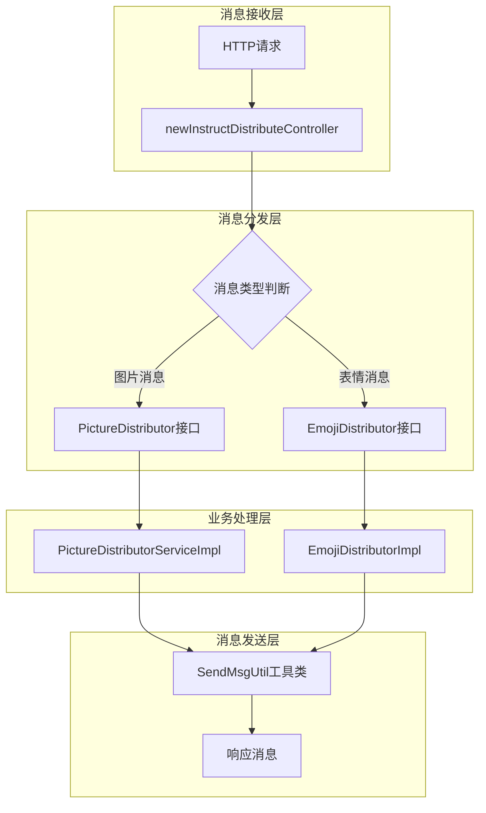
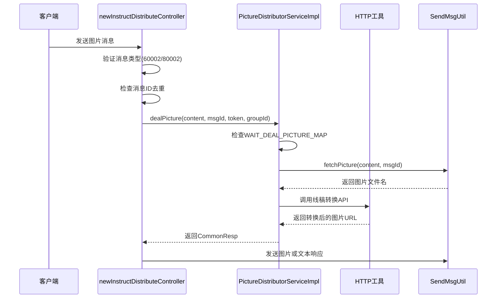
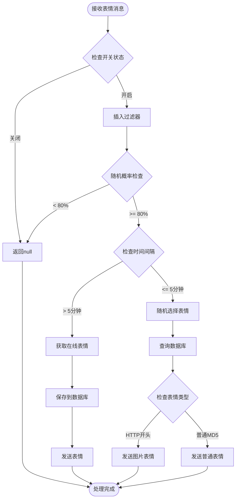
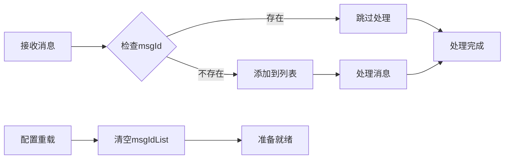
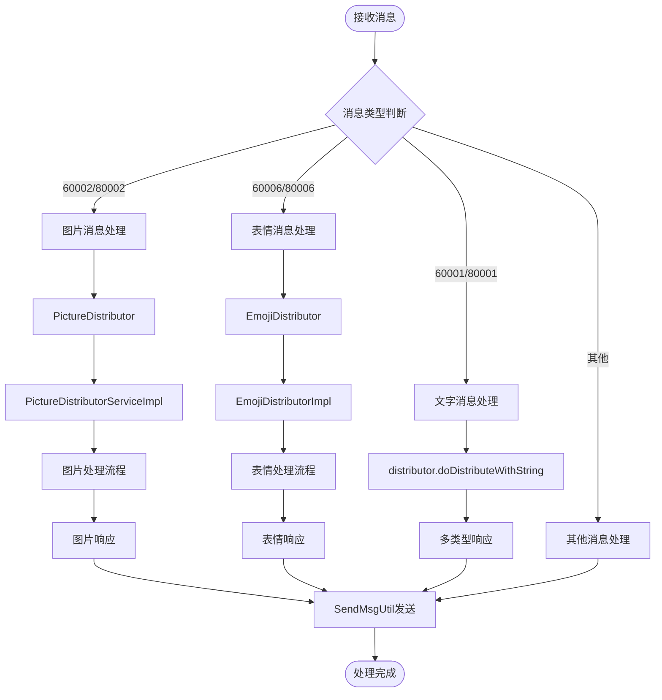

# Bot项目多媒体消息处理文档

<cite>
**本文档引用的文件**
- [newInstructDistributeController.java](file://Boot/src/main/java/com/bot/boot/controller/newInstructDistributeController.java)
- [PictureDistributor.java](file://Base/src/main/java/com/bot/base/service/PictureDistributor.java)
- [EmojiDistributor.java](file://Base/src/main/java/com/bot/base/service/EmojiDistributor.java)
- [PictureDistributorServiceImpl.java](file://Base/src/main/java/com/bot/base/service/impl/PictureDistributorServiceImpl.java)
- [EmojiDistributorImpl.java](file://Base/src/main/java/com/bot/base/service/impl/EmojiDistributorImpl.java)
- [SendMsgUtil.java](file://Common/src/main/java/com/bot/common/util/SendMsgUtil.java)
- [CommonResp.java](file://Base/src/main/java/com/bot/base/dto/CommonResp.java)
- [ENRespType.java](file://Common/src/main/java/com/bot/common/enums/ENRespType.java)
- [ENFileType.java](file://Common/src/main/java/com/bot/common/enums/ENFileType.java)
- [BaseConsts.java](file://Common/src/main/java/com/bot/common/constant/BaseConsts.java)
</cite>

## 目录
1. [概述](#概述)
2. [系统架构](#系统架构)
3. [图片消息处理](#图片消息处理)
4. [表情消息处理](#表情消息处理)
5. [消息ID去重机制](#消息id去重机制)
6. [多媒体消息处理流程](#多媒体消息处理流程)
7. [扩展开发指南](#扩展开发指南)
8. [故障排除](#故障排除)

## 概述

Bot项目采用模块化设计，通过newInstructDistributeController统一接收和分发多媒体消息。系统支持图片消息（messageType 60002/80002）和表情消息（messageType 60006/80006）的处理，具备URL提取、消息ID去重、混合回复等功能。

### 核心特性
- **图片消息处理**：支持私聊和群聊图片消息，可转换为线稿并支持混合回复
- **表情消息处理**：基于MD5值和长度信息的表情分发，具备概率回复机制
- **消息去重**：通过msgIdList实现消息重复过滤
- **灵活回复**：支持文本、图片、视频等多种回复类型

## 系统架构



**图表来源**
- [newInstructDistributeController.java](file://Boot/src/main/java/com/bot/boot/controller/newInstructDistributeController.java#L46-L255)
- [PictureDistributor.java](file://Base/src/main/java/com/bot/base/service/PictureDistributor.java#L5-L17)
- [EmojiDistributor.java](file://Base/src/main/java/com/bot/base/service/EmojiDistributor.java#L5-L16)

## 图片消息处理

### 处理机制

图片消息通过PictureDistributor接口进行分发处理，支持私聊和群聊两种场景。



**图表来源**
- [newInstructDistributeController.java](file://Boot/src/main/java/com/bot/boot/controller/newInstructDistributeController.java#L159-L180)
- [PictureDistributorServiceImpl.java](file://Base/src/main/java/com/bot/base/service/impl/PictureDistributorServiceImpl.java#L30-L46)

### 关键特性

#### URL提取与处理
- **图片获取**：通过`fetchPicture`方法从消息内容中提取图片URL并下载到本地
- **线稿转换**：调用外部API将图片转换为线稿效果
- **缓存机制**：使用WAIT_DEAL_PICTURE_MAP避免重复处理

#### 混合回复支持
图片消息处理器支持同时返回图片和文本响应，满足多样化回复需求。

**章节来源**
- [PictureDistributorServiceImpl.java](file://Base/src/main/java/com/bot/base/service/impl/PictureDistributorServiceImpl.java#L30-L46)
- [SendMsgUtil.java](file://Common/src/main/java/com/bot/common/util/SendMsgUtil.java#L167-L188)

## 表情消息处理

### 处理机制

表情消息通过EmojiDistributor接口进行处理，基于MD5值和长度信息进行去重和分发。



**图表来源**
- [EmojiDistributorImpl.java](file://Base/src/main/java/com/bot/base/service/impl/EmojiDistributorImpl.java#L30-L67)

### 核心功能

#### MD5值和长度信息提取
- **唯一标识**：使用MD5值作为表情的唯一标识符
- **大小记录**：记录表情文件长度用于质量控制
- **去重机制**：防止相同表情被重复处理

#### 智能回复策略
- **概率控制**：80%的概率不回复，增加互动趣味性
- **时间间隔**：超过5分钟才获取新的在线表情
- **随机选择**：从数据库中随机选择表情进行回复

**章节来源**
- [EmojiDistributorImpl.java](file://Base/src/main/java/com/bot/base/service/impl/EmojiDistributorImpl.java#L30-L67)
- [EmojiDistributorImpl.java](file://Base/src/main/java/com/bot/base/service/impl/EmojiDistributorImpl.java#L70-L80)

## 消息ID去重机制

### 实现原理

系统通过全局静态列表msgIdList实现消息去重，防止同一消息被重复处理。



**图表来源**
- [newInstructDistributeController.java](file://Boot/src/main/java/com/bot/boot/controller/newInstructDistributeController.java#L69-L94)

### 特性说明
- **全局共享**：msgIdList为静态变量，跨请求保持状态
- **内存存储**：基于ArrayList的简单去重机制
- **手动清理**：通过reloadConfig接口清空列表

**章节来源**
- [newInstructDistributeController.java](file://Boot/src/main/java/com/bot/boot/controller/newInstructDistributeController.java#L69-L94)

## 多媒体消息处理流程

### 统一流程图



**图表来源**
- [newInstructDistributeController.java](file://Boot/src/main/java/com/bot/boot/controller/newInstructDistributeController.java#L74-L208)

### 各类型消息处理特点

| 消息类型 | 处理接口 | 主要功能 | 回复类型 |
|---------|---------|---------|---------|
| 私聊文字 | distributor | 文本、图片、视频、文件、语音回复 | 多种类型 |
| 群聊文字 | distributor | 带@功能的文字回复 | 多种类型 |
| 私聊图片 | PictureDistributor | 线稿转换、混合回复 | 图片+文本 |
| 群聊图片 | PictureDistributor | 线稿转换、混合回复 | 图片+文本 |
| 私聊表情 | EmojiDistributor | MD5去重、概率回复 | 图片/表情 |
| 群聊表情 | EmojiDistributor | MD5去重、概率回复 | 图片/表情 |

**章节来源**
- [newInstructDistributeController.java](file://Boot/src/main/java/com/bot/boot/controller/newInstructDistributeController.java#L74-L208)

## 扩展开发指南

### 添加新的多媒体消息类型

#### 1. 定义消息类型常量

在BaseConsts中添加新的消息类型：
```java
// 在BaseConsts接口中添加
interface MessageType {
    String NEW_MEDIA_TYPE = "90001"; // 新媒体类型
}
```

#### 2. 修改控制器逻辑

在newInstructDistributeController中添加处理逻辑：
```java
// 在messageType判断中添加
if (StrUtil.equals("90001", messageType)) {
    // 新媒体类型处理逻辑
    CommonResp resp = newMediaDistributor.handleNewMedia(msg, msgId, userId, groupId);
    handleResponse(resp, userId, groupId);
}
```

#### 3. 创建处理接口和实现

```java
// 新媒体处理接口
public interface NewMediaDistributor {
    CommonResp handleNewMedia(String content, Long msgId, String token, String groupId);
}

// 接口实现类
@Service
public class NewMediaDistributorImpl implements NewMediaDistributor {
    @Override
    public CommonResp handleNewMedia(String content, Long msgId, String token, String groupId) {
        // 实现具体的处理逻辑
        return new CommonResp("处理结果", ENRespType.TEXT.getType());
    }
}
```

### 自定义图片处理逻辑

#### 1. 扩展现有图片处理器

```java
@Service
public class CustomPictureDistributorServiceImpl extends PictureDistributorServiceImpl {
    
    @Override
    public CommonResp dealPicture(String content, Long msgId, String token, String groupId) {
        // 添加自定义处理逻辑
        if (shouldApplyCustomLogic(content)) {
            return applyCustomProcessing(content, msgId, token, groupId);
        }
        
        // 调用父类处理
        return super.dealPicture(content, msgId, token, groupId);
    }
    
    private CommonResp applyCustomProcessing(String content, Long msgId, String token, String groupId) {
        // 自定义图片处理逻辑
        return new CommonResp("自定义处理结果", ENRespType.IMG.getType());
    }
}
```

#### 2. 配置自定义处理器

```java
@Configuration
public class MediaConfig {
    
    @Bean
    @Primary
    public PictureDistributor pictureDistributor() {
        return new CustomPictureDistributorServiceImpl();
    }
}
```

### 自定义表情处理逻辑

#### 1. 扩展表情处理功能

```java
@Component
public class CustomEmojiDistributorImpl extends EmojiDistributorImpl {
    
    @Override
    public CommonResp dealEmoji(String md5, int length, Long msgId, String token, String groupId) {
        // 添加自定义逻辑
        if (shouldApplyCustomLogic(md5, length)) {
            return handleCustomEmoji(md5, length, token, groupId);
        }
        
        // 调用父类处理
        return super.dealEmoji(md5, length, msgId, token, groupId);
    }
    
    private CommonResp handleCustomEmoji(String md5, int length, String token, String groupId) {
        // 自定义表情处理逻辑
        return new CommonResp("自定义表情回复", ENRespType.IMG.getType());
    }
}
```

## 故障排除

### 常见问题及解决方案

#### 1. 图片处理失败

**问题现象**：图片消息无法正常处理，返回"接收图片失败"

**可能原因**：
- 图片URL无效或网络连接问题
- 线稿转换API不可用
- 文件存储权限不足

**解决方案**：
```java
// 检查图片获取逻辑
public CommonResp dealPicture(String content, Long msgId, String token, String groupId) {
    try {
        String picName = SendMsgUtil.fetchPicture(content, msgId);
        if (picName == null) {
            log.error("图片获取失败: content={}, msgId={}", content, msgId);
            return new CommonResp("图片处理失败，请稍后重试", ENRespType.TEXT.getType());
        }
        
        // 添加超时处理
        String response = HttpUtil.createGet(url + "?url=" + picPath + picName)
            .timeout(30000) // 设置30秒超时
            .execute()
            .body();
            
        // 添加错误日志
        log.info("图片处理结果: {}", response);
        return processResponse(response);
    } catch (Exception e) {
        log.error("图片处理异常", e);
        return new CommonResp("图片处理异常，请联系管理员", ENRespType.TEXT.getType());
    }
}
```

#### 2. 表情处理异常

**问题现象**：表情消息处理频繁失败或无响应

**可能原因**：
- 数据库连接问题
- 在线表情API限制
- 随机选择算法异常

**解决方案**：
```java
@Override
public CommonResp dealEmoji(String md5, int length, Long msgId, String token, String groupId) {
    try {
        // 添加数据库连接检查
        if (!isDatabaseAvailable()) {
            log.warn("数据库不可用，跳过表情处理");
            return null;
        }
        
        // 添加API调用限制
        if (isApiRateLimited()) {
            log.warn("表情API调用频率过高，延迟处理");
            Thread.sleep(5000); // 延迟5秒
        }
        
        // 添加空值检查
        if (StringUtils.isBlank(md5)) {
            log.warn("表情MD5为空，跳过处理");
            return null;
        }
        
        return super.dealEmoji(md5, length, msgId, token, groupId);
    } catch (Exception e) {
        log.error("表情处理异常", e);
        return null;
    }
}
```

#### 3. 消息去重失效

**问题现象**：相同消息被重复处理

**可能原因**：
- msgIdList内存溢出
- 并发访问问题
- 配置重载未生效

**解决方案**：
```java
// 使用线程安全的集合
private static final Set<Long> msgIdSet = Collections.synchronizedSet(new HashSet<>());

// 或者使用更高效的去重机制
private static final ConcurrentLinkedQueue<Long> msgIdQueue = new ConcurrentLinkedQueue<>();
private static final int MAX_QUEUE_SIZE = 1000;

public void addMsgId(Long msgId) {
    // 限制队列大小
    while (msgIdQueue.size() >= MAX_QUEUE_SIZE) {
        msgIdQueue.poll();
    }
    msgIdQueue.offer(msgId);
}

public boolean containsMsgId(Long msgId) {
    return msgIdQueue.contains(msgId);
}
```

### 性能优化建议

#### 1. 异步处理
对于耗时的图片处理操作，考虑使用异步处理：
```java
@Service
public class AsyncPictureProcessor {
    
    @Async
    public CompletableFuture<CommonResp> processPictureAsync(String content, Long msgId, String token, String groupId) {
        // 异步处理逻辑
        return CompletableFuture.supplyAsync(() -> {
            // 图片处理代码
            return new CommonResp("处理完成", ENRespType.IMG.getType());
        });
    }
}
```

#### 2. 缓存优化
为频繁访问的数据添加缓存：
```java
@Cacheable(value = "emojiCache", key = "#md5")
public String getCachedEmoji(String md5) {
    // 查询数据库逻辑
    return emojiMapper.selectByMd5(md5);
}
```

#### 3. 监控指标
添加关键指标监控：
```java
@Component
public class MediaProcessingMetrics {
    
    private final MeterRegistry meterRegistry;
    
    public void recordPictureProcessingTime(long duration) {
        meterRegistry.timer("media.picture.processing.time").record(duration, TimeUnit.MILLISECONDS);
    }
    
    public void incrementPictureErrors() {
        meterRegistry.counter("media.picture.errors").increment();
    }
}
```

**章节来源**
- [PictureDistributorServiceImpl.java](file://Base/src/main/java/com/bot/base/service/impl/PictureDistributorServiceImpl.java#L30-L46)
- [EmojiDistributorImpl.java](file://Base/src/main/java/com/bot/base/service/impl/EmojiDistributorImpl.java#L30-L67)