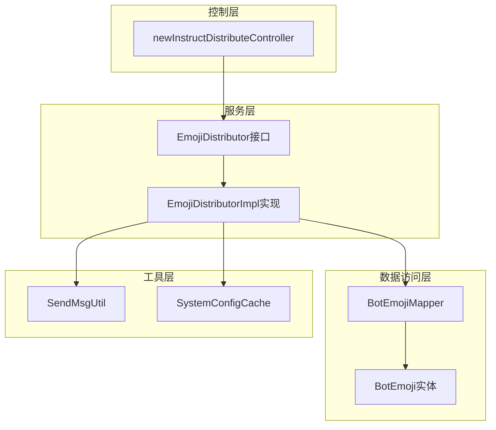
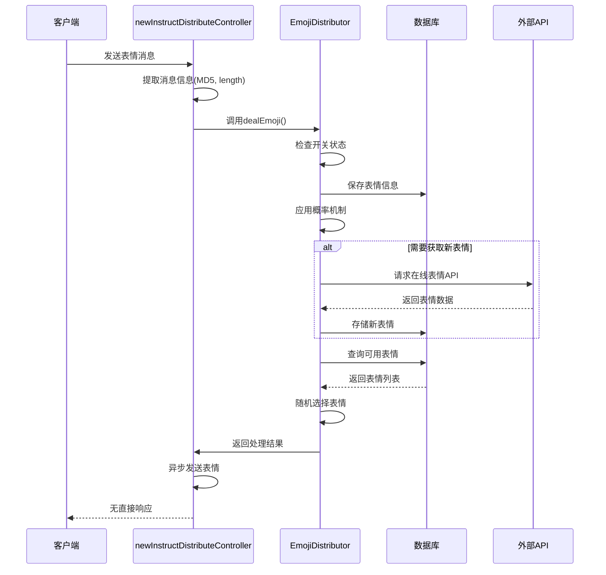
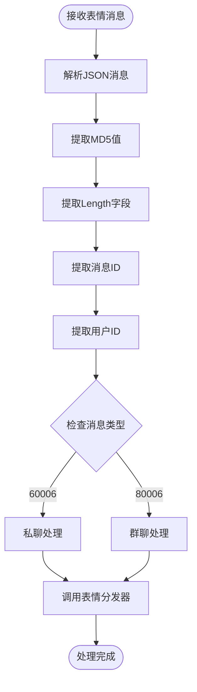
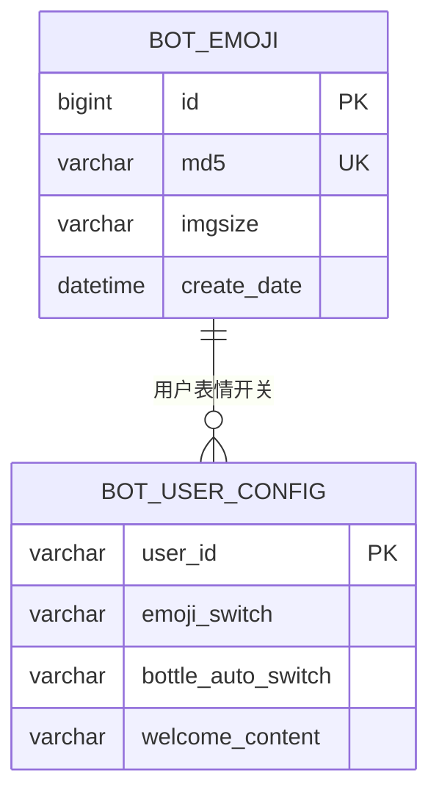
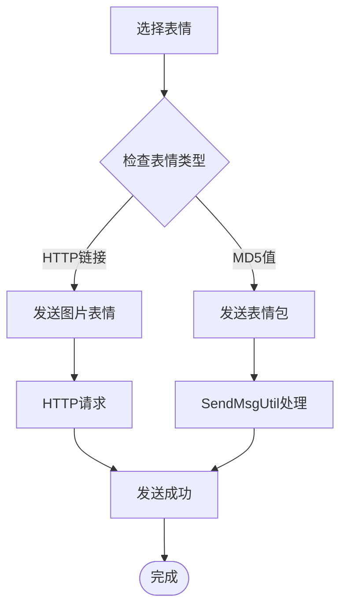
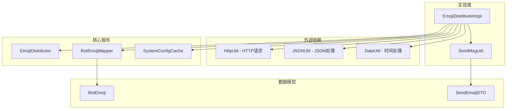

# 表情消息处理

<cite>
**本文档引用的文件**
- [newInstructDistributeController.java](file://Boot/src/main/java/com/bot/boot/controller/newInstructDistributeController.java)
- [EmojiDistributor.java](file://Base/src/main/java/com/bot/base/service/EmojiDistributor.java)
- [EmojiDistributorImpl.java](file://Base/src/main/java/com/bot/base/service/impl/EmojiDistributorImpl.java)
- [BotEmoji.java](file://Game/src/main/java/com/bot/game/dao/entity/BotEmoji.java)
- [BotEmojiMapper.java](file://Game/src/main/java/com/bot/game/dao/mapper/BotEmojiMapper.java)
- [SendEmojiDTO.java](file://Common/src/main/java/com/bot/common/dto/SendEmojiDTO.java)
- [SendMsgUtil.java](file://Common/src/main/java/com/bot/common/util/SendMsgUtil.java)
- [SystemConfigCache.java](file://Common/src/main/java/com/bot/common/config/SystemConfigCache.java)
</cite>

## 目录
1. [简介](#简介)
2. [项目结构概览](#项目结构概览)
3. [核心组件分析](#核心组件分析)
4. [架构概览](#架构概览)
5. [详细组件分析](#详细组件分析)
6. [依赖关系分析](#依赖关系分析)
7. [性能考虑](#性能考虑)
8. [故障排除指南](#故障排除指南)
9. [结论](#结论)

## 简介

本文档详细说明了机器人系统中表情消息的处理机制，重点关注`messageType`为60006（私聊）和80006（群聊）的表情消息处理流程。该系统通过`newInstructDistributeController`控制器接收表情消息，提取MD5值和length信息，并通过`EmojiDistributor`接口进行后续处理。MD5值作为表情的唯一标识符，在表情识别、收藏和触发特定响应中发挥关键作用，而length字段则可能用于判断表情的复杂度或大小。

## 项目结构概览

表情消息处理功能分布在多个模块中，形成了清晰的分层架构：

**图表来源**
- [newInstructDistributeController.java](file://Boot/src/main/java/com/bot/boot/controller/newInstructDistributeController.java#L46-L65)
- [EmojiDistributor.java](file://Base/src/main/java/com/bot/base/service/EmojiDistributor.java#L5-L16)
- [EmojiDistributorImpl.java](file://Base/src/main/java/com/bot/base/service/impl/EmojiDistributorImpl.java#L23-L27)

## 核心组件分析

### newInstructDistributeController控制器

控制器负责接收和初步处理表情消息，是整个处理流程的入口点。它能够识别两种类型的表情消息：

- **私聊表情消息** (`messageType: 60006`)
- **群聊表情消息** (`messageType: 80006`)

控制器从消息数据中提取关键信息：
- MD5值：表情的唯一标识符
- Length：表情的尺寸或复杂度指标
- 消息ID：用于去重
- 用户ID：消息发送者标识
- 群组ID：群聊场景下的群组标识

**章节来源**
- [newInstructDistributeController.java](file://Boot/src/main/java/com/bot/boot/controller/newInstructDistributeController.java#L181-L194)

### EmojiDistributor接口

定义了表情处理的核心契约，包含单个方法`dealEmoji()`，接受以下参数：
- `md5`: 表情的MD5哈希值
- `length`: 表情的尺寸或复杂度信息
- `msgId`: 消息唯一标识符
- `token`: 用户或群组标识
- `groupId`: 群组ID（私聊时为null）

**章节来源**
- [EmojiDistributor.java](file://Base/src/main/java/com/bot/base/service/EmojiDistributor.java#L14-L14)

### EmojiDistributorImpl实现类

实现了表情处理的业务逻辑，具有以下特征：

1. **开关控制**：检查`SystemConfigCache.emojiUser`列表确定是否启用表情功能
2. **概率机制**：80%的概率不回复，增加交互的随机性
3. **缓存策略**：维护最近获取时间，避免频繁请求外部API
4. **数据库存储**：将新表情保存到数据库进行持久化
5. **随机回复**：从数据库中随机选择表情进行回复

**章节来源**
- [EmojiDistributorImpl.java](file://Base/src/main/java/com/bot/base/service/impl/EmojiDistributorImpl.java#L30-L67)

## 架构概览

表情消息处理采用异步非阻塞的设计模式，确保系统的响应性和可扩展性：

**图表来源**
- [newInstructDistributeController.java](file://Boot/src/main/java/com/bot/boot/controller/newInstructDistributeController.java#L181-L194)
- [EmojiDistributorImpl.java](file://Base/src/main/java/com/bot/base/service/impl/EmojiDistributorImpl.java#L30-L67)

## 详细组件分析

### 消息解析与信息提取

控制器通过JSON解析从消息对象中提取关键信息：

**图表来源**
- [newInstructDistributeController.java](file://Boot/src/main/java/com/bot/boot/controller/newInstructDistributeController.java#L74-L78)

### MD5值的作用机制

MD5值在系统中扮演多重角色：

1. **唯一标识**：每个表情都有唯一的MD5哈希值
2. **去重机制**：防止重复存储相同表情
3. **快速检索**：基于MD5值快速查找表情
4. **相似性判断**：可用于表情相似度比较
5. **缓存键值**：作为表情缓存的键

### length字段的应用

length字段提供了关于表情的重要信息：

1. **尺寸指示**：可能表示表情的像素尺寸
2. **复杂度评估**：反映表情的绘制复杂程度
3. **质量判断**：可能与表情的质量等级相关
4. **性能优化**：用于选择合适分辨率的表情

### 异步处理特性

系统采用异步处理模式，具有以下特点：

1. **非阻塞设计**：处理完成后不立即返回响应
2. **概率机制**：80%的概率不回复，增加交互趣味性
3. **后台任务**：表情发送作为后台任务执行
4. **资源优化**：避免大量并发请求影响系统性能

**章节来源**
- [EmojiDistributorImpl.java](file://Base/src/main/java/com/bot/base/service/impl/EmojiDistributorImpl.java#L39-L42)

### 表情数据库模型

系统使用专门的表情数据库表存储表情信息：

**图表来源**
- [BotEmoji.java](file://Game/src/main/java/com/bot/game/dao/entity/BotEmoji.java#L13-L37)
- [SystemConfigCache.java](file://Common/src/main/java/com/bot/common/config/SystemConfigCache.java#L96-L98)

**章节来源**
- [BotEmoji.java](file://Game/src/main/java/com/bot/game/dao/entity/BotEmoji.java#L1-L204)

### 表情发送机制

系统支持多种类型的表情发送：

**图表来源**
- [EmojiDistributorImpl.java](file://Base/src/main/java/com/bot/base/service/impl/EmojiDistributorImpl.java#L59-L65)
- [SendMsgUtil.java](file://Common/src/main/java/com/bot/common/util/SendMsgUtil.java#L115-L122)

**章节来源**
- [SendMsgUtil.java](file://Common/src/main/java/com/bot/common/util/SendMsgUtil.java#L115-L127)

## 依赖关系分析

系统各组件之间的依赖关系体现了清晰的分层架构：

**图表来源**
- [EmojiDistributorImpl.java](file://Base/src/main/java/com/bot/base/service/impl/EmojiDistributorImpl.java#L1-L20)
- [SendMsgUtil.java](file://Common/src/main/java/com/bot/common/util/SendMsgUtil.java#L1-L15)

**章节来源**
- [EmojiDistributorImpl.java](file://Base/src/main/java/com/bot/base/service/impl/EmojiDistributorImpl.java#L1-L20)

## 性能考虑

### 缓存策略

系统实现了多层缓存机制：

1. **内存缓存**：`SystemConfigCache.emojiUser`列表缓存启用状态
2. **数据库缓存**：表情数据的本地存储和查询
3. **时间窗口**：5分钟的外部API请求间隔限制

### 概率机制

通过随机概率控制回复频率：
- 80%的概率不回复，减少系统负载
- 随机性增加交互的趣味性
- 可调节的参数适应不同场景需求

### 异步处理

异步处理带来的性能优势：
- 避免阻塞主线程
- 提高系统吞吐量
- 支持高并发场景

## 故障排除指南

### 常见问题及解决方案

1. **表情不回复**
   - 检查`SystemConfigCache.emojiUser`列表中是否包含用户ID
   - 验证概率机制是否生效
   - 确认数据库连接是否正常

2. **表情重复发送**
   - 检查MD5值是否正确提取
   - 验证数据库去重机制
   - 查看消息ID去重逻辑

3. **性能问题**
   - 监控数据库查询性能
   - 检查外部API请求频率
   - 优化随机选择算法

**章节来源**
- [EmojiDistributorImpl.java](file://Base/src/main/java/com/bot/base/service/impl/EmojiDistributorImpl.java#L32-L36)

## 结论

机器人系统的表情消息处理机制展现了良好的架构设计和实现质量。通过分层架构、异步处理和概率机制，系统实现了高效、灵活且可扩展的表情处理功能。

### 主要优势

1. **模块化设计**：清晰的接口分离和职责划分
2. **异步处理**：提高系统响应性和并发处理能力
3. **概率机制**：增加交互的随机性和趣味性
4. **数据库持久化**：保证表情数据的可靠存储
5. **配置驱动**：灵活的开关控制和参数调整

### 扩展建议

1. **相似表情匹配**：基于MD5值的相似度计算
2. **表情质量评分**：结合length字段的表情质量评估
3. **个性化推荐**：根据用户历史行为推荐表情
4. **表情统计分析**：记录表情使用频率和用户偏好

该系统为表情消息处理提供了一个完整、可靠的解决方案，可以作为类似功能开发的参考范例。