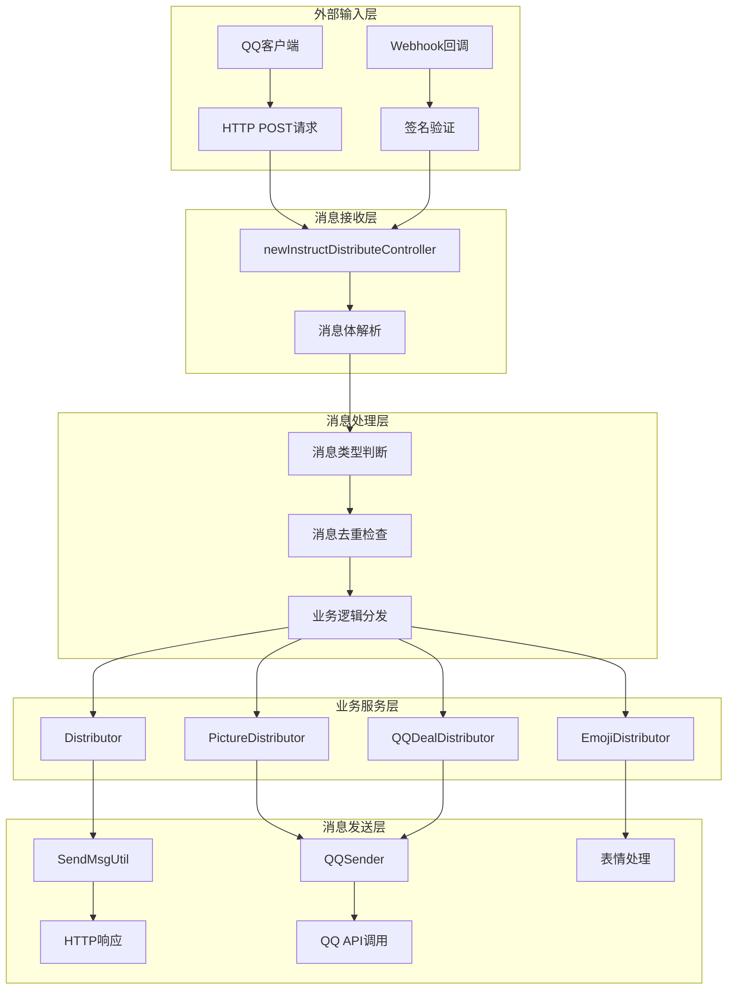
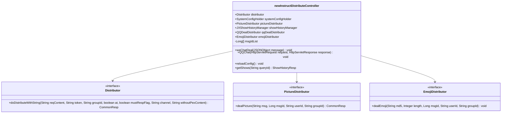
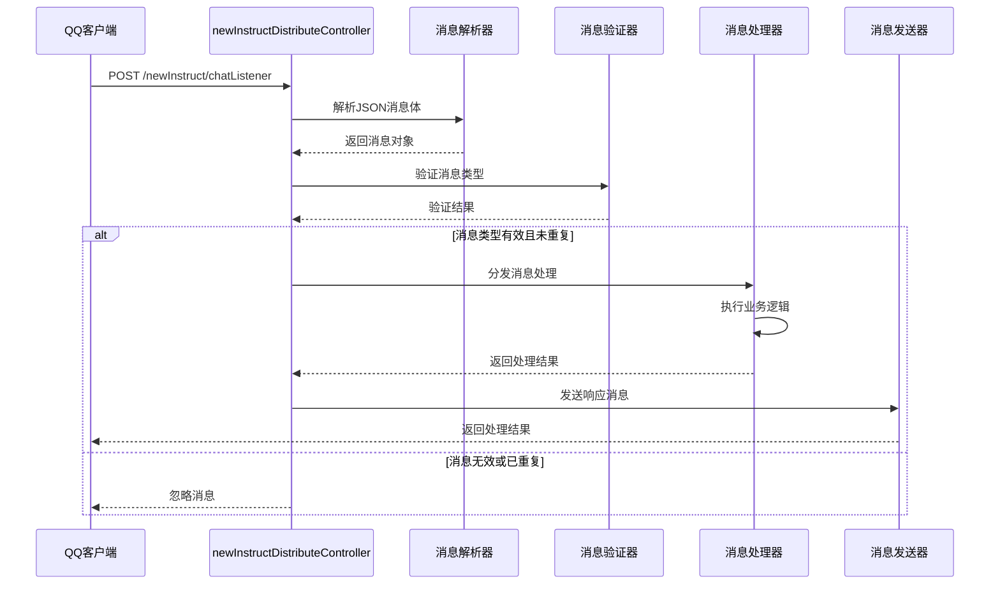
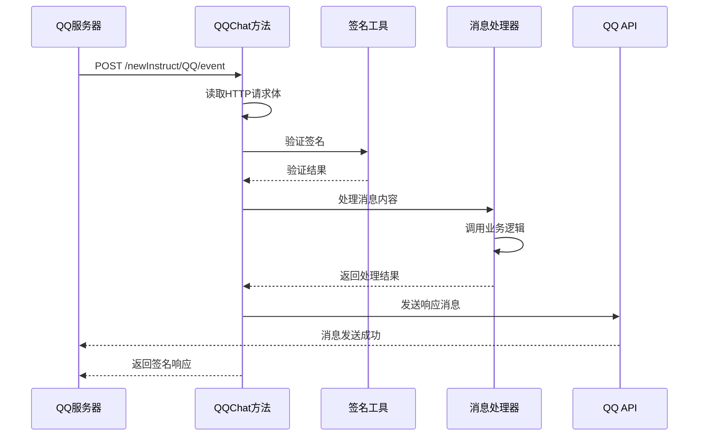
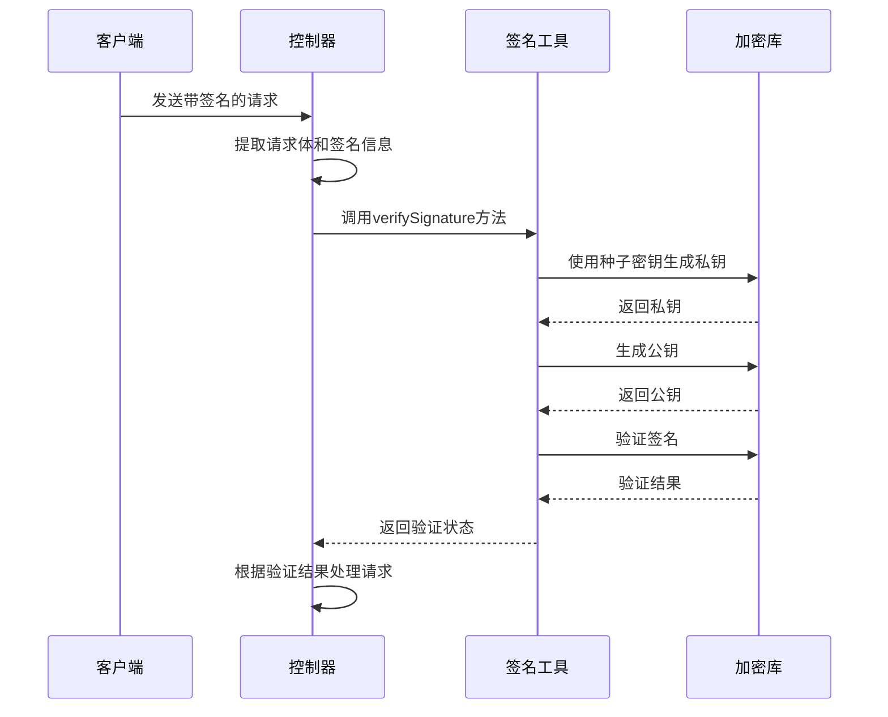
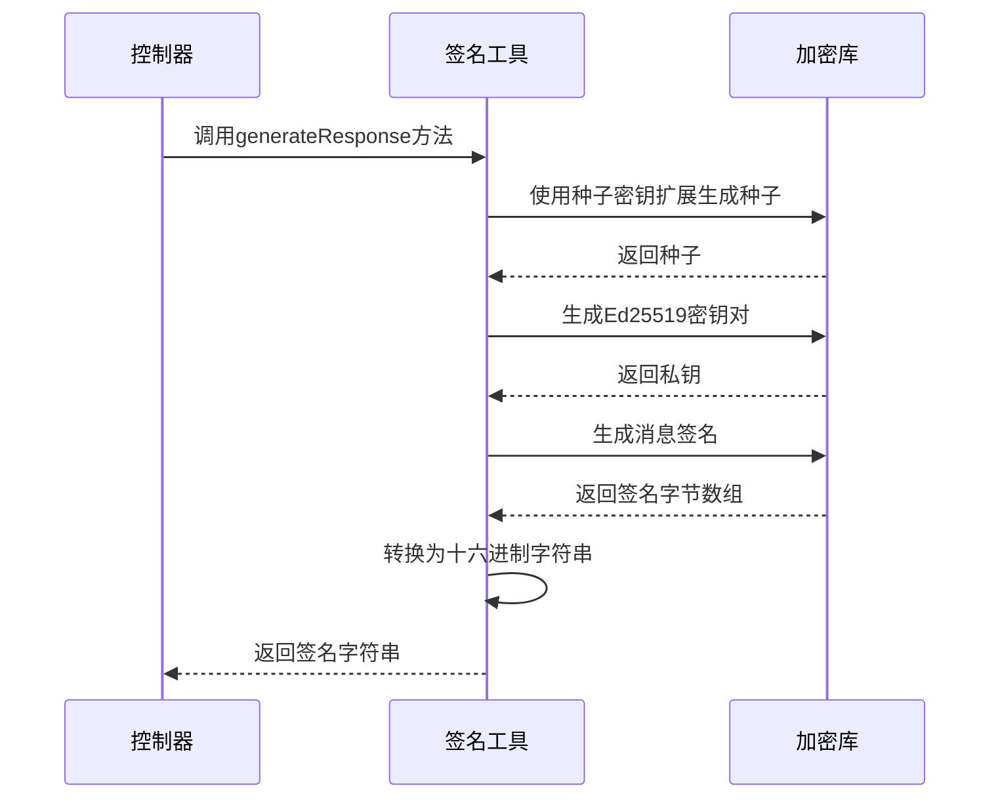
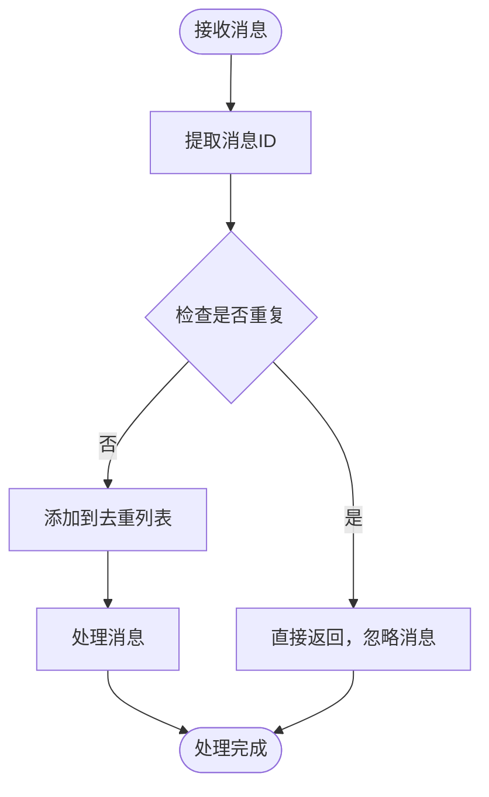
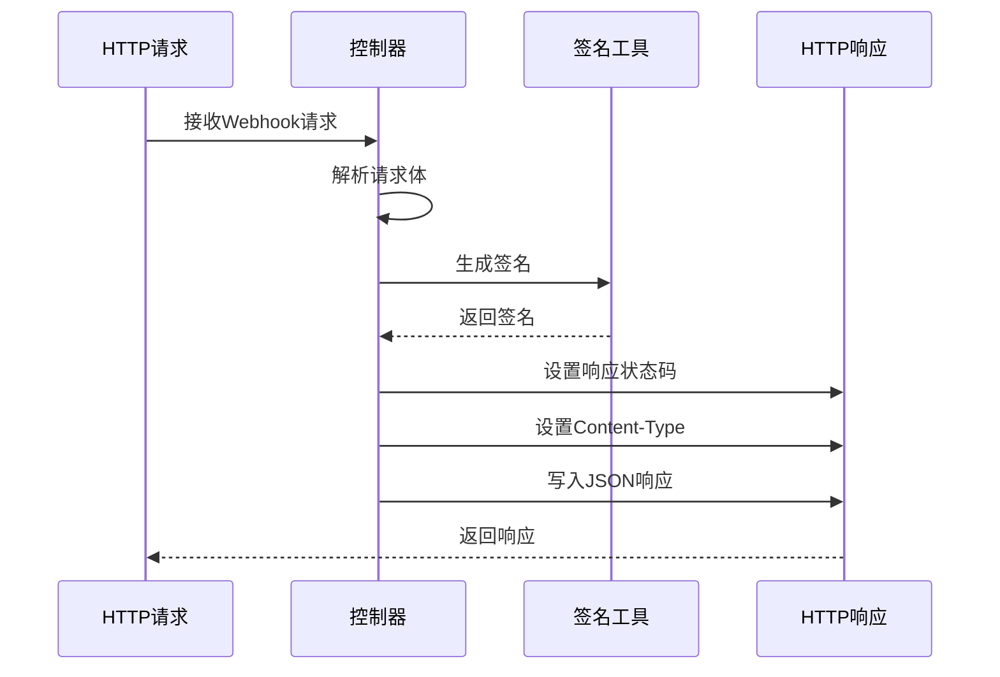

# 消息接收

<cite>
**本文档引用的文件**
- [newInstructDistributeController.java](file://Boot/src/main/java/com/bot/boot/controller/newInstructDistributeController.java)
- [QQSender.java](file://Common/src/main/java/com/bot/common/util/QQSender.java)
- [QQGroupMessage.java](file://Common/src/main/java/com/bot/common/dto/qqsender/QQGroupMessage.java)
- [BotDo.java](file://Boot/src/main/java/com/bot/boot/controller/BotDo.java)
- [CallBackSignUtil.java](file://Common/src/main/java/com/bot/common/util/CallBackSignUtil.java)
- [SignatureED25519.java](file://Common/src/main/java/com/bot/common/util/SignatureED25519.java)
- [SendMsgUtil.java](file://Common/src/main/java/com/bot/common/util/SendMsgUtil.java)
- [ENRespType.java](file://Common/src/main/java/com/bot/common/enums/ENRespType.java)
- [ENFileType.java](file://Common/src/main/java/com/bot/common/enums/ENFileType.java)
- [BaseConsts.java](file://Common/src/main/java/com/bot/common/constant/BaseConsts.java)
</cite>

## 目录
1. [概述](#概述)
2. [系统架构](#系统架构)
3. [核心组件分析](#核心组件分析)
4. [消息接收流程](#消息接收流程)
5. [消息类型处理](#消息类型处理)
6. [签名验证机制](#签名验证机制)
7. [消息去重机制](#消息去重机制)
8. [Webhook响应格式](#webhook响应格式)
9. [性能优化](#性能优化)
10. [开发者指南](#开发者指南)
11. [故障排除](#故障排除)

## 概述

Bot项目的消息接收系统是一个基于Spring Boot的高性能消息处理平台，专门用于处理来自QQ客户端的各种消息类型。该系统采用RESTful API设计，支持私聊、群聊、图片、表情、语音等多种消息格式，并实现了完整的消息去重、签名验证和异步处理机制。

### 主要特性

- **多消息类型支持**：支持私聊文字、群聊文字、图片、表情、语音、邀请进群等多种消息类型
- **消息去重机制**：通过msgIdList实现高效的消息去重
- **签名验证**：基于ED25519算法的Webhook签名验证
- **异步处理**：支持高并发场景下的消息处理
- **灵活的响应机制**：支持文本、图片、视频、文件、语音等多种响应类型

## 系统架构



**图表来源**
- [newInstructDistributeController.java](file://Boot/src/main/java/com/bot/boot/controller/newInstructDistributeController.java#L46-L255)
- [QQSender.java](file://Common/src/main/java/com/bot/common/util/QQSender.java#L17-L104)

## 核心组件分析

### newInstructDistributeController

这是消息接收的核心控制器，负责处理来自QQ客户端的所有消息请求。

#### 主要字段

| 字段名 | 类型 | 描述 |
|--------|------|------|
| distributor | Distributor | 主要消息分发器 |
| systemConfigHolder | SystemConfigHolder | 系统配置管理器 |
| pictureDistributor | PictureDistributor | 图片消息处理器 |
| showHistoryManager | JXShowHistoryManager | 历史记录管理器 |
| qqDealDistributor | QQDealDistributor | QQ专用消息处理器 |
| emojiDistributor | EmojiDistributor | 表情消息处理器 |
| msgIdList | List<Long> | 消息ID去重列表 |

#### 核心方法



**图表来源**
- [newInstructDistributeController.java](file://Boot/src/main/java/com/bot/boot/controller/newInstructDistributeController.java#L48-L65)

**章节来源**
- [newInstructDistributeController.java](file://Boot/src/main/java/com/bot/boot/controller/newInstructDistributeController.java#L46-L255)

## 消息接收流程

### HTTP POST请求处理流程



**图表来源**
- [newInstructDistributeController.java](file://Boot/src/main/java/com/bot/boot/controller/newInstructDistributeController.java#L72-L209)

### Webhook回调处理流程



**图表来源**
- [newInstructDistributeController.java](file://Boot/src/main/java/com/bot/boot/controller/newInstructDistributeController.java#L222-L252)
- [CallBackSignUtil.java](file://Common/src/main/java/com/bot/common/util/CallBackSignUtil.java#L22-L45)

**章节来源**
- [newInstructDistributeController.java](file://Boot/src/main/java/com/bot/boot/controller/newInstructDistributeController.java#L72-L252)

## 消息类型处理

### 支持的消息类型

系统支持以下消息类型，每种类型都有特定的处理逻辑：

| 消息类型代码 | 消息类型 | 处理方式 | 响应类型 |
|-------------|----------|----------|----------|
| 60001 | 私聊文字 | 文本消息分发 | 文本/图片/视频/文件/语音 |
| 80001 | 群聊文字 | 群聊消息分发 | 文本/图片/视频/文件/语音 |
| 60002 | 私聊图片 | 图片处理 | 图片/文本 |
| 80002 | 群聊图片 | 图片处理 | 图片/文本 |
| 60006 | 私聊表情 | 表情处理 | 表情包 |
| 80006 | 群聊表情 | 表情处理 | 表情包 |
| 60022 | 私聊邀请进群 | 邀请处理 | 自动接受 |
| 85008/85009 | 进群欢迎 | 欢迎消息 | 文本 |

### 消息处理逻辑

```mermaid
flowchart TD
Start([接收消息]) --> CheckType{检查消息类型}
CheckType --> |60001| PrivateText[私聊文字处理]
CheckType --> |80001| GroupText[群聊文字处理]
CheckType --> |60002| PrivateImage[私聊图片处理]
CheckType --> |80002| GroupImage[群聊图片处理]
CheckType --> |60006| PrivateEmoji[私聊表情处理]
CheckType --> |80006| GroupEmoji[群聊表情处理]
CheckType --> |60022| InviteAccept[邀请进群处理]
CheckType --> |85008/85009| WelcomeMsg[进群欢迎处理]
PrivateText --> TextDistribute[文本分发处理]
GroupText --> GroupDistribute[群聊分发处理]
TextDistribute --> CheckGame{包含游戏文件?}
CheckGame --> |是| SendGameMsg[发送游戏提示]
CheckGame --> |否| ProcessText[处理普通文本]
ProcessText --> CheckResponseType{检查响应类型}
CheckResponseType --> |图片| SendImage[发送图片]
CheckResponseType --> |视频| SendVideo[发送视频]
CheckResponseType --> |文件| SendFile[发送文件]
CheckResponseType --> |语音| SendAudio[发送语音]
CheckResponseType --> |文本| SendText[发送文本]
GroupDistribute --> CheckAt{是否@机器人?}
CheckAt --> |是| RemoveAt[移除@标记]
CheckAt --> |否| ProcessGroupText[处理群聊文本]
RemoveAt --> ProcessGroupText
PrivateImage --> ImageProcess[图片处理]
GroupImage --> ImageProcess
ImageProcess --> CheckImageResponse{检查响应类型}
CheckImageResponse --> |图片| SendImage
CheckImageResponse --> |文本| SendText
PrivateEmoji --> EmojiProcess[表情处理]
GroupEmoji --> EmojiProcess
EmojiProcess --> SendEmoji[发送表情]
InviteAccept --> AcceptInvite[接受邀请]
WelcomeMsg --> CheckWelcome{检查欢迎配置}
CheckWelcome --> |有配置| SendWelcome[发送欢迎消息]
CheckWelcome --> |无配置| SkipWelcome[跳过欢迎]
SendGameMsg --> End([处理完成])
SendImage --> End
SendVideo --> End
SendFile --> End
SendAudio --> End
SendText --> End
SendEmoji --> End
AcceptInvite --> End
SendWelcome --> End
SkipWelcome --> End
```

**图表来源**
- [newInstructDistributeController.java](file://Boot/src/main/java/com/bot/boot/controller/newInstructDistributeController.java#L72-L209)

**章节来源**
- [newInstructDistributeController.java](file://Boot/src/main/java/com/bot/boot/controller/newInstructDistributeController.java#L72-L209)

## 签名验证机制

### ED25519签名验证

系统采用ED25519算法进行Webhook签名验证，确保消息来源的合法性。

#### 签名验证流程



**图表来源**
- [CallBackSignUtil.java](file://Common/src/main/java/com/bot/common/util/CallBackSignUtil.java#L22-L45)

#### 签名生成流程



**图表来源**
- [CallBackSignUtil.java](file://Common/src/main/java/com/bot/common/util/CallBackSignUtil.java#L52-L69)

### 签名验证配置

| 配置项 | 值 | 说明 |
|--------|-----|------|
| appId | 102791624 | QQ机器人应用ID |
| clientSecret | 93xrlfZUPKFA50vrnjfbXTQNKHEB8531 | 客户端密钥 |
| GET_ACCESS_TOKEN | https://bots.qq.com/app/getAppAccessToken | 获取访问令牌地址 |
| BASE_URL | https://api.sgroup.qq.com | QQ API基础URL |

**章节来源**
- [CallBackSignUtil.java](file://Common/src/main/java/com/bot/common/util/CallBackSignUtil.java#L1-L73)
- [SignatureED25519.java](file://Common/src/main/java/com/bot/common/util/SignatureED25519.java#L1-L35)
- [QQSender.java](file://Common/src/main/java/com/bot/common/util/QQSender.java#L29-L31)

## 消息去重机制

### 去重策略

系统通过msgIdList实现消息去重，防止重复处理相同的消息。

#### 去重流程



**图表来源**
- [newInstructDistributeController.java](file://Boot/src/main/java/com/bot/boot/controller/newInstructDistributeController.java#L89-L94)

#### 去重配置

| 参数 | 值 | 说明 |
|------|-----|------|
| msgIdList | ArrayList<Long> | 消息ID去重列表 |
| 清理策略 | reloadConfig接口 | 可手动清理去重列表 |

**章节来源**
- [newInstructDistributeController.java](file://Boot/src/main/java/com/bot/boot/controller/newInstructDistributeController.java#L69-L70)
- [newInstructDistributeController.java](file://Boot/src/main/java/com/bot/boot/controller/newInstructDistributeController.java#L211-L215)

## Webhook响应格式

### 响应结构

系统在处理Webhook请求时返回标准化的响应格式：

```json
{
  "plain_token": "原始令牌",
  "signature": "ED25519签名"
}
```

### 响应处理流程



**图表来源**
- [newInstructDistributeController.java](file://Boot/src/main/java/com/bot/boot/controller/newInstructDistributeController.java#L222-L240)

**章节来源**
- [newInstructDistributeController.java](file://Boot/src/main/java/com/bot/boot/controller/newInstructDistributeController.java#L222-L240)

## 性能优化

### 异步处理机制

系统采用多种异步处理策略提升性能：

1. **视频消息异步发送**：大文件传输采用线程池异步处理
2. **批量消息处理**：支持消息队列批量处理
3. **连接池管理**：HTTP客户端连接复用

### 性能监控指标

| 指标 | 说明 | 监控方式 |
|------|------|----------|
| 消息处理延迟 | 从接收消息到响应的时间 | 日志记录 |
| 并发处理能力 | 单位时间内处理的消息数量 | 性能测试 |
| 内存使用率 | 去重列表占用内存大小 | JVM监控 |
| 错误率 | 处理失败的消息比例 | 异常统计 |

### 优化建议

1. **消息去重优化**：定期清理msgIdList，避免内存溢出
2. **并发控制**：限制同时处理的消息数量
3. **缓存策略**：缓存频繁访问的配置信息
4. **资源池化**：使用连接池管理HTTP连接

**章节来源**
- [newInstructDistributeController.java](file://Boot/src/main/java/com/bot/boot/controller/newInstructDistributeController.java#L105-L107)
- [newInstructDistributeController.java](file://Boot/src/main/java/com/bot/boot/controller/newInstructDistributeController.java#L139-L141)

## 开发者指南

### 添加新的消息类型支持

要添加新的消息类型支持，需要按照以下步骤操作：

#### 步骤1：定义消息类型常量

在ENRespType枚举中添加新的响应类型：

```java
// 在ENRespType.java中添加
VIDEO("2", "视频"),
FILE("3", "文件"),
AUDIO("4", "语音");
```

#### 步骤2：修改消息处理逻辑

在newInstructDistributeController中添加新的消息类型分支：

```java
// 在消息类型判断处添加
if ("NEW_MESSAGE_TYPE".equals(messageType)) {
    // 新消息类型的处理逻辑
}
```

#### 步骤3：实现相应的处理器

创建或修改相应的服务类来处理新消息类型。

### 调试消息接收问题

#### 常见问题及解决方案

| 问题 | 症状 | 解决方案 |
|------|------|----------|
| 消息未被处理 | 发送消息后无响应 | 检查消息类型判断逻辑 |
| 签名验证失败 | Webhook请求被拒绝 | 验证clientSecret配置 |
| 消息重复处理 | 同一消息被多次处理 | 检查msgIdList去重机制 |
| 响应超时 | 消息发送失败 | 检查网络连接和API限制 |

#### 调试工具

1. **日志分析**：启用DEBUG级别日志查看详细处理流程
2. **断点调试**：在关键处理节点设置断点
3. **单元测试**：编写针对性的单元测试
4. **压力测试**：模拟高并发场景测试系统稳定性

### 性能调优

#### JVM参数优化

```bash
-Xms2g -Xmx4g -XX:+UseG1GC -XX:MaxGCPauseMillis=200
```

#### 线程池配置

```java
// 在ThreadPoolManager中配置
ExecutorService executor = Executors.newFixedThreadPool(
    Runtime.getRuntime().availableProcessors() * 2);
```

**章节来源**
- [ENRespType.java](file://Common/src/main/java/com/bot/common/enums/ENRespType.java#L10-L14)
- [newInstructDistributeController.java](file://Boot/src/main/java/com/bot/boot/controller/newInstructDistributeController.java#L79-L88)

## 故障排除

### 常见错误及解决方案

#### 1. 签名验证失败

**错误现象**：Webhook请求被QQ服务器拒绝

**排查步骤**：
1. 检查clientSecret配置是否正确
2. 验证消息体格式是否符合要求
3. 确认时间戳是否在有效范围内

**解决方案**：
```java
// 检查签名验证逻辑
boolean isValid = CallBackSignUtil.verifySignature(
    clientSecret, signature, timestamp, requestBody);
```

#### 2. 消息处理超时

**错误现象**：消息发送后长时间无响应

**排查步骤**：
1. 检查网络连接状态
2. 验证API调用频率限制
3. 检查业务逻辑执行时间

**解决方案**：
```java
// 添加超时控制
Future<?> future = executor.submit(() -> processMessage(message));
future.get(30, TimeUnit.SECONDS); // 设置30秒超时
```

#### 3. 内存泄漏

**错误现象**：系统运行一段时间后内存持续增长

**排查步骤**：
1. 检查msgIdList是否定期清理
2. 验证图片缓存是否及时释放
3. 检查线程池是否正确关闭

**解决方案**：
```java
// 定期清理去重列表
@Scheduled(cron = "0 0 * * *") // 每小时清理一次
public void cleanupMsgIdList() {
    msgIdList.clear();
}
```

### 监控和告警

#### 关键指标监控

1. **消息处理成功率**：计算成功处理的消息占总消息的比例
2. **平均响应时间**：监控消息处理的平均耗时
3. **错误率统计**：跟踪各类错误的发生频率
4. **资源使用情况**：监控CPU、内存、网络使用情况

#### 告警规则

```yaml
# 告警配置示例
alerts:
  - name: 高错误率
    condition: error_rate > 5%
    action: 发送邮件通知
  
  - name: 响应超时
    condition: avg_response_time > 5s
    action: 记录日志并通知开发团队
```

**章节来源**
- [CallBackSignUtil.java](file://Common/src/main/java/com/bot/common/util/CallBackSignUtil.java#L32-L45)
- [newInstructDistributeController.java](file://Boot/src/main/java/com/bot/boot/controller/newInstructDistributeController.java#L211-L215)

## 总结

Bot项目的消息接收系统是一个功能完整、性能优异的消息处理平台。通过合理的架构设计、完善的签名验证机制、高效的去重策略和灵活的扩展能力，该系统能够稳定地处理各种复杂的QQ消息场景。

系统的主要优势包括：
- **全面的消息类型支持**：涵盖QQ客户端的所有主要消息类型
- **安全可靠**：基于ED25519的签名验证确保消息安全性
- **高性能**：异步处理和消息去重机制保证高并发性能
- **易于扩展**：模块化设计便于添加新的消息类型和处理逻辑

对于开发者而言，理解系统的架构设计和处理流程有助于更好地维护和扩展系统功能。同时，遵循最佳实践和性能优化建议能够确保系统在生产环境中的稳定运行。