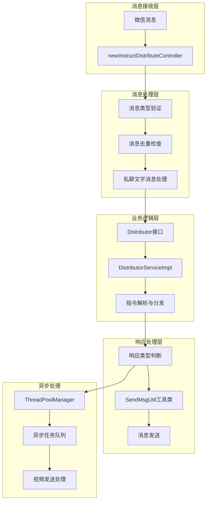
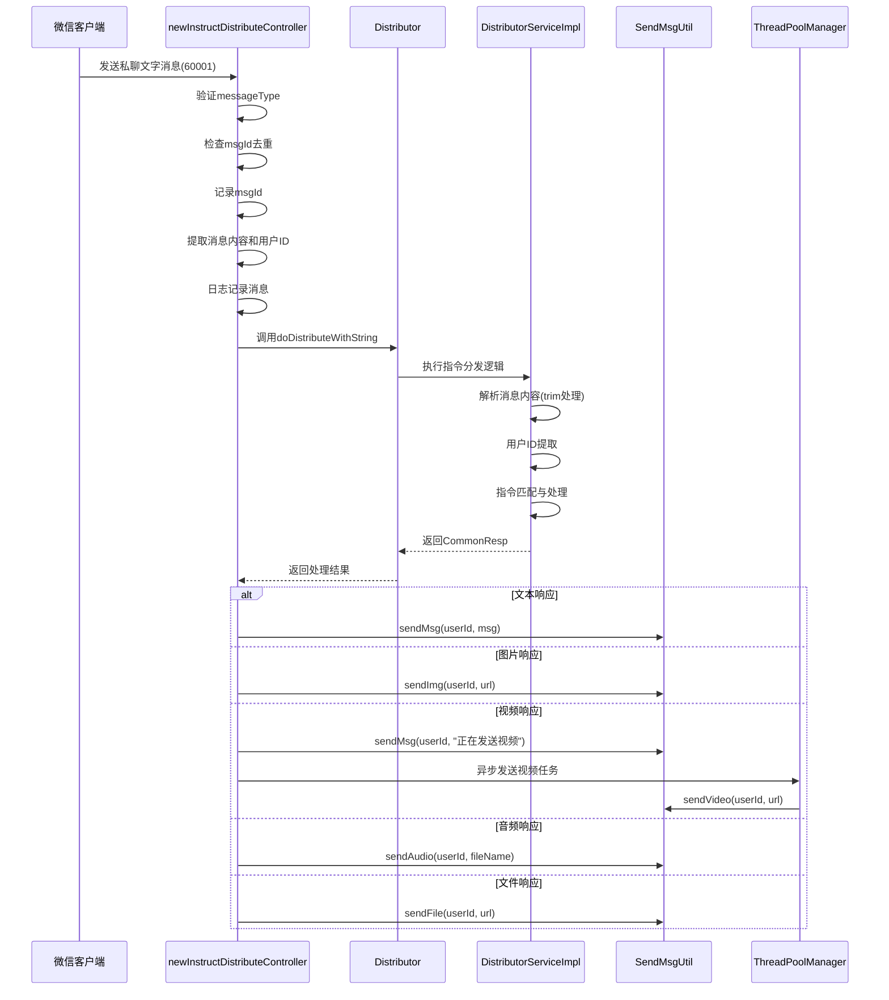
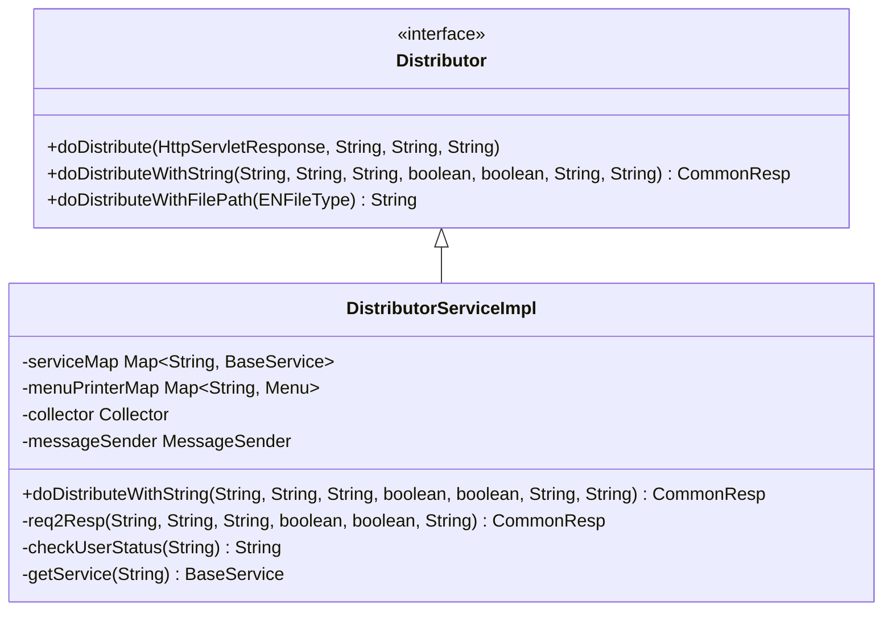
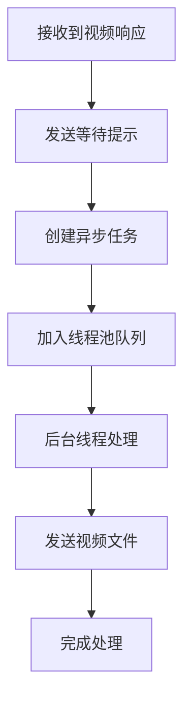
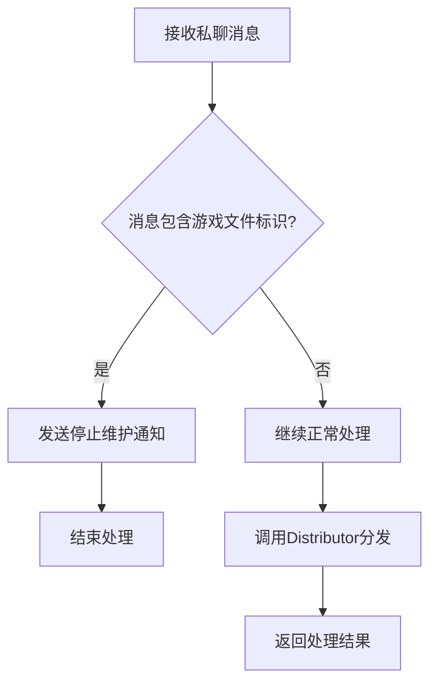
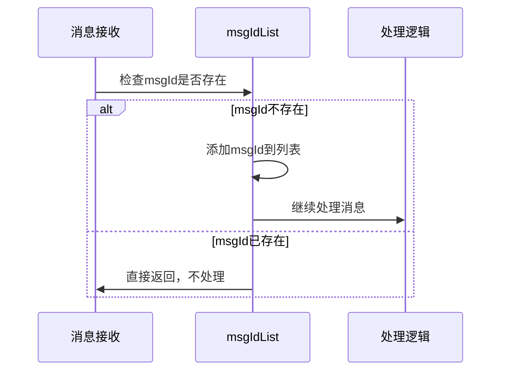
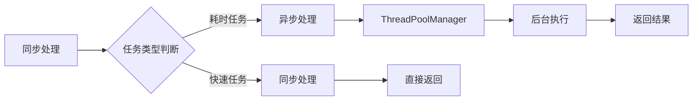

# Bot项目私聊文字消息处理文档

<cite>
**本文档引用的文件**
- [newInstructDistributeController.java](file://Boot/src/main/java/com/bot/boot/controller/newInstructDistributeController.java)
- [Distributor.java](file://Base/src/main/java/com/bot/base/service/Distributor.java)
- [DistributorServiceImpl.java](file://Base/src/main/java/com/bot/base/service/impl/DistributorServiceImpl.java)
- [SendMsgUtil.java](file://Common/src/main/java/com/bot/common/util/SendMsgUtil.java)
- [ENRespType.java](file://Common/src/main/java/com/bot/common/enums/ENRespType.java)
- [ENFileType.java](file://Common/src/main/java/com/bot/common/enums/ENFileType.java)
- [ThreadPoolManager.java](file://Common/src/main/java/com/bot/common/util/ThreadPoolManager.java)
- [BaseConsts.java](file://Common/src/main/java/com/bot/common/constant/BaseConsts.java)
- [SendMsgDTO.java](file://Common/src/main/java/com/bot/common/dto/SendMsgDTO.java)
</cite>

## 目录
1. [概述](#概述)
2. [系统架构](#系统架构)
3. [消息处理流程详解](#消息处理流程详解)
4. [核心组件分析](#核心组件分析)
5. [消息类型处理机制](#消息类型处理机制)
6. [性能优化策略](#性能优化策略)
7. [调试与开发指南](#调试与开发指南)
8. [故障排除](#故障排除)
9. [总结](#总结)

## 概述

Bot项目私聊文字消息处理系统是一个基于Spring Boot框架构建的智能聊天机器人核心模块。该系统专门处理来自微信平台的私聊文字消息，通过多层消息分发机制实现智能化的响应处理。系统采用事件驱动架构，支持多种消息类型的差异化处理，并具备完善的日志记录和性能监控机制。

### 主要特性

- **消息拦截与过滤**：通过messageType字段识别私聊文字消息（60001）
- **消息去重机制**：基于msgIdList实现消息去重，防止重复处理
- **多类型响应支持**：支持文本、图片、视频、音频、文件等多种响应类型
- **异步处理机制**：对于耗时操作（如视频发送）采用异步处理
- **高性能并发处理**：内置线程池管理，支持高并发场景

## 系统架构



**图表来源**
- [newInstructDistributeController.java](file://Boot/src/main/java/com/bot/boot/controller/newInstructDistributeController.java#L72-L115)
- [DistributorServiceImpl.java](file://Base/src/main/java/com/bot/base/service/impl/DistributorServiceImpl.java#L125-L198)

## 消息处理流程详解

### 私聊文字消息处理时序图



**图表来源**
- [newInstructDistributeController.java](file://Boot/src/main/java/com/bot/boot/controller/newInstructDistributeController.java#L95-L114)
- [DistributorServiceImpl.java](file://Base/src/main/java/com/bot/base/service/impl/DistributorServiceImpl.java#L125-L198)

### 关键处理步骤

1. **消息接收与验证**（第72-89行）
   - 接收JSON格式消息体
   - 验证messageType为60001
   - 提取用户ID、消息内容、msgId等关键信息

2. **消息去重检查**（第90-93行）
   - 使用msgIdList进行消息去重
   - 避免重复处理相同消息
   - 提高系统处理效率

3. **消息内容预处理**（第95-101行）
   - 对消息内容进行trim处理去除首尾空白
   - 调用Distributor接口进行指令分发
   - 支持多种渠道和参数传递

4. **响应类型差异化处理**（第102-114行）
   - 根据响应类型选择不同的发送方式
   - 实现文本、图片、视频、音频、文件的差异化处理

**章节来源**
- [newInstructDistributeController.java](file://Boot/src/main/java/com/bot/boot/controller/newInstructDistributeController.java#L72-L115)

## 核心组件分析

### newInstructDistributeController控制器

控制器是整个消息处理流程的入口点，负责消息的初步验证和路由分发。

#### 主要职责

- **消息类型识别**：通过messageType字段识别不同类型的消息
- **消息去重管理**：维护msgIdList实现消息去重
- **渠道适配**：支持微信、QQ等多种消息渠道
- **异常处理**：捕获并处理消息处理过程中的异常

#### 关键字段说明

| 字段名 | 类型 | 描述 | 默认值 |
|--------|------|------|--------|
| msgIdList | List<Long> | 消息ID去重列表 | 空列表 |
| distributor | Distributor | 指令分发器 | 注入实例 |
| systemConfigHolder | SystemConfigHolder | 系统配置管理器 | 注入实例 |

**章节来源**
- [newInstructDistributeController.java](file://Boot/src/main/java/com/bot/boot/controller/newInstructDistributeController.java#L46-L65)

### Distributor接口与实现

Distributor接口定义了消息分发的核心契约，DistributorServiceImpl提供了具体的实现逻辑。

#### 接口方法分析



**图表来源**
- [Distributor.java](file://Base/src/main/java/com/bot/base/service/Distributor.java#L11-L35)
- [DistributorServiceImpl.java](file://Base/src/main/java/com/bot/base/service/impl/DistributorServiceImpl.java#L41-L80)

#### 指令分发逻辑

DistributorServiceImpl采用责任链模式和策略模式相结合的方式处理消息：

1. **顶级权限检查**：检查是否为特殊token用户
2. **签到资格检查**：优先处理签到相关指令
3. **系统级指令**：处理注册、查询、管理等系统指令
4. **游戏模式**：处理游戏相关的指令
5. **服务匹配**：匹配具体的服务实现
6. **默认聊天**：最后处理闲聊逻辑

**章节来源**
- [DistributorServiceImpl.java](file://Base/src/main/java/com/bot/base/service/impl/DistributorServiceImpl.java#L216-L361)

### SendMsgUtil消息发送工具类

SendMsgUtil提供了统一的消息发送接口，支持多种消息类型的发送。

#### 支持的消息类型

| 类型 | 方法 | 用途 | 参数说明 |
|------|------|------|----------|
| 文本消息 | sendMsg | 发送普通文本消息 | userId, msg |
| 图片消息 | sendImg | 发送图片链接 | userId, url |
| 视频消息 | sendVideo | 发送视频文件 | userId, url |
| 音频消息 | sendAudio | 发送音频文件 | userId, fileName |
| 文件消息 | sendFile | 发送文件 | userId, url |

#### 异步处理机制

对于视频等耗时操作，系统采用异步处理机制：



**图表来源**
- [newInstructDistributeController.java](file://Boot/src/main/java/com/bot/boot/controller/newInstructDistributeController.java#L105-L107)
- [ThreadPoolManager.java](file://Common/src/main/java/com/bot/common/util/ThreadPoolManager.java#L68-L74)

**章节来源**
- [SendMsgUtil.java](file://Common/src/main/java/com/bot/common/util/SendMsgUtil.java#L27-L108)

## 消息类型处理机制

### 响应类型枚举

系统通过ENRespType枚举定义了支持的响应类型：

| 类型 | 值 | 描述 | 处理方式 |
|------|-----|------|----------|
| TEXT | "0" | 文本 | 直接发送文本消息 |
| IMG | "1" | 图片 | 发送图片链接 |
| VIDEO | "2" | 视频 | 发送视频文件 |
| FILE | "3" | 文件 | 发送文件链接 |
| AUDIO | "4" | 语音 | 发送音频文件 |

### 游戏文件拦截机制

系统实现了游戏文件下载的拦截机制，防止用户获取已停止维护的游戏文件：



**图表来源**
- [newInstructDistributeController.java](file://Boot/src/main/java/com/bot/boot/controller/newInstructDistributeController.java#L97-L99)

### 消息去重机制

系统通过msgIdList实现消息去重，确保每条消息只被处理一次：



**图表来源**
- [newInstructDistributeController.java](file://Boot/src/main/java/com/bot/boot/controller/newInstructDistributeController.java#L90-L93)

**章节来源**
- [ENRespType.java](file://Common/src/main/java/com/bot/common/enums/ENRespType.java#L9-L14)
- [ENFileType.java](file://Common/src/main/java/com/bot/common/enums/ENFileType.java#L10-L14)

## 性能优化策略

### 线程池管理

系统采用ThreadPoolManager进行线程池管理，支持多种类型的异步任务：

#### 线程池配置

| 线程池类型 | 核心线程数 | 最大线程数 | 存活时间 | 适用场景 |
|------------|------------|------------|----------|----------|
| 基础线程池 | 10 | 50 | 60秒 | 通用异步任务 |
| 紧急线程池 | 3 | 10 | 60秒 | 高优先级任务 |
| 定时线程池 | 1 | 1 | 60秒 | 定时任务 |

#### 异步处理策略



**图表来源**
- [ThreadPoolManager.java](file://Common/src/main/java/com/bot/common/util/ThreadPoolManager.java#L12-L62)

### 内存管理优化

1. **消息去重缓存**：msgIdList采用ArrayList实现，内存占用可控
2. **临时变量管理**：避免在循环中创建大量临时对象
3. **资源及时释放**：HTTP连接等资源使用后及时关闭

### 并发控制

系统通过以下机制控制并发访问：

- **静态变量保护**：msgIdList使用静态变量，需注意线程安全
- **服务注入**：通过Spring容器管理服务实例，避免重复创建
- **配置化管理**：线程池参数可通过配置文件调整

**章节来源**
- [ThreadPoolManager.java](file://Common/src/main/java/com/bot/common/util/ThreadPoolManager.java#L12-L122)

## 调试与开发指南

### 调试私聊消息处理逻辑

#### 日志配置

系统使用SLF4J进行日志记录，可通过以下方式进行调试：

```java
// 在newInstructDistributeController中添加调试日志
log.info("收到来自[{}]的私聊消息：[{}]", userId, msg);
log.debug("消息详情：{}", message.toString());
```

#### 关键断点设置

1. **消息接收点**：`newInstructDistributeController.weChatDeal()`方法入口
2. **消息去重点**：`msgIdList.contains(msgId)`检查处
3. **指令分发点**：`distributor.doDistributeWithString()`调用处
4. **响应处理点**：各种sendMsgUtil方法调用处

### 添加新的私聊指令

#### 实现步骤

1. **扩展DistributorServiceImpl**

```java
// 在req2Resp方法中添加新的指令匹配逻辑
if ("新指令".equals(reqContent)) {
    return new CommonResp("新指令响应", ENRespType.TEXT.getType());
}
```

2. **添加服务实现**

```java
@Service
public class NewCommandServiceImpl implements BaseService {
    @Override
    public CommonResp doQueryReturn(String reqContent, String token, String groupId, String channel) {
        // 实现新指令逻辑
        return new CommonResp("响应内容", ENRespType.TEXT.getType());
    }
}
```

3. **更新配置**

在CommonTextLoader中添加新的指令映射关系。

### 性能监控指标

#### 关键性能指标

| 指标 | 计算方式 | 监控目的 |
|------|----------|----------|
| 消息处理延迟 | 处理完成时间 - 接收时间 | 监控响应速度 |
| 消息去重率 | 去重消息数 / 总消息数 | 监控重复消息 |
| 响应成功率 | 成功响应数 / 总请求数 | 监控系统稳定性 |
| 线程池利用率 | 活跃线程数 / 最大线程数 | 监控并发能力 |

#### 监控实现建议

```java
// 在关键节点添加性能监控
long startTime = System.currentTimeMillis();
try {
    // 执行业务逻辑
} finally {
    long duration = System.currentTimeMillis() - startTime;
    log.info("消息处理耗时：{}ms", duration);
}
```

## 故障排除

### 常见问题及解决方案

#### 消息处理异常

**问题现象**：私聊消息无法正常处理

**排查步骤**：
1. 检查messageType是否为60001
2. 验证msgId是否重复
3. 检查Distributor服务是否正常注入
4. 查看系统日志中的异常信息

**解决方案**：
```java
// 在控制器中添加异常处理
try {
    // 消息处理逻辑
} catch (Exception e) {
    log.error("消息处理异常：{}", e.getMessage(), e);
    // 返回友好的错误响应
    SendMsgUtil.sendMsg(userId, "系统暂时无法处理您的请求，请稍后再试");
}
```

#### 响应超时问题

**问题现象**：视频等大文件发送超时

**解决方案**：
1. 检查网络连接稳定性
2. 优化文件传输协议
3. 增加超时重试机制

#### 内存泄漏问题

**问题现象**：msgIdList不断增长导致内存溢出

**解决方案**：
```java
// 定期清理msgIdList
@Scheduled(cron = "0 0 */1 * * ?") // 每小时清理一次
public void cleanMsgIdList() {
    if (msgIdList.size() > 10000) {
        msgIdList.clear();
        log.warn("msgIdList清理，当前大小：{}", msgIdList.size());
    }
}
```

### 性能调优建议

#### JVM参数优化

```bash
-Xms2g -Xmx4g -XX:+UseG1GC -XX:MaxGCPauseMillis=200
```

#### 线程池参数调整

```yaml
thread-pool:
  core-size: 20
  max-size: 100
  keep-alive-time: 60
```

## 总结

Bot项目私聊文字消息处理系统是一个设计精良的智能聊天处理框架，具有以下特点：

### 技术优势

1. **模块化设计**：清晰的分层架构，便于维护和扩展
2. **高性能处理**：多线程异步处理，支持高并发场景
3. **灵活的响应机制**：支持多种消息类型的差异化处理
4. **完善的去重机制**：防止重复处理，提高系统效率
5. **丰富的扩展性**：易于添加新的指令和服务

### 应用价值

- **提升用户体验**：快速响应和多样化的内容呈现
- **降低开发成本**：标准化的消息处理流程
- **增强系统稳定性**：完善的异常处理和性能监控
- **支持业务扩展**：灵活的指令分发机制

### 发展方向

1. **AI能力集成**：引入更先进的自然语言处理技术
2. **多模态支持**：扩展对更多媒体类型的支持
3. **智能路由**：基于用户画像的个性化响应
4. **实时分析**：实时监控和分析消息处理效果

通过本文档的详细分析，开发者可以深入理解Bot项目私聊文字消息处理的完整流程，并能够有效地进行调试、优化和功能扩展。