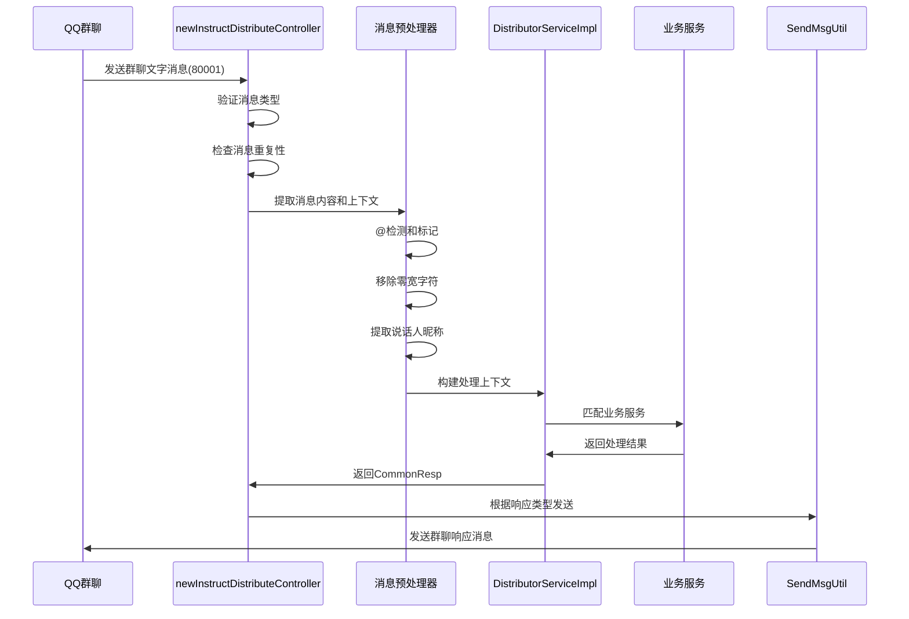
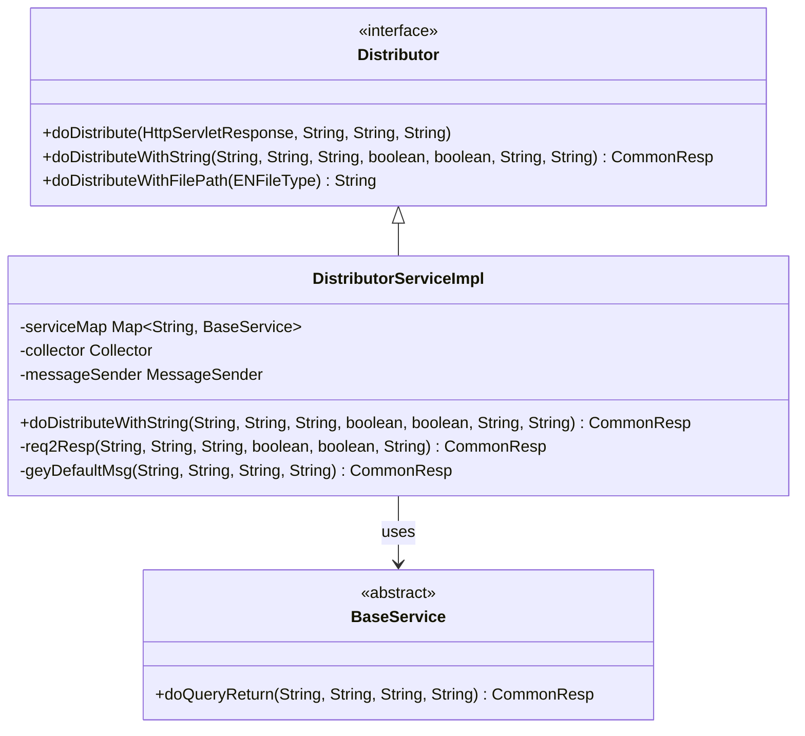
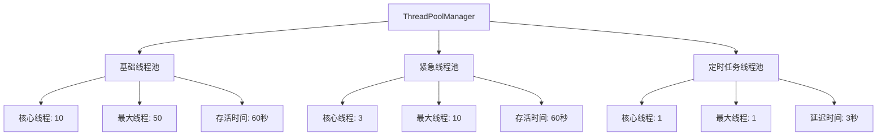

# Bot项目群聊文字消息处理文档

<cite>
**本文档引用的文件**
- [newInstructDistributeController.java](file://Boot/src/main/java/com/bot/boot/controller/newInstructDistributeController.java)
- [Distributor.java](file://Base/src/main/java/com/bot/base/service/Distributor.java)
- [DistributorServiceImpl.java](file://Base/src/main/java/com/bot/base/service/impl/DistributorServiceImpl.java)
- [SendMsgUtil.java](file://Common/src/main/java/com/bot/common/util/SendMsgUtil.java)
- [ENRespType.java](file://Common/src/main/java/com/bot/common/enums/ENRespType.java)
- [QQGroupMessage.java](file://Common/src/main/java/com/bot/common/dto/qqsender/QQGroupMessage.java)
- [CommonResp.java](file://Base/src/main/java/com/bot/base/dto/CommonResp.java)
- [ThreadPoolManager.java](file://Common/src/main/java/com/bot/common/util/ThreadPoolManager.java)
- [BaseConsts.java](file://Common/src/main/java/com/bot/common/constant/BaseConsts.java)
</cite>

## 目录
1. [概述](#概述)
2. [系统架构](#系统架构)
3. [消息处理流程](#消息处理流程)
4. [关键组件分析](#关键组件分析)
5. [群聊特殊处理逻辑](#群聊特殊处理逻辑)
6. [响应类型处理](#响应类型处理)
7. [性能优化策略](#性能优化策略)
8. [调试指南](#调试指南)
9. [最佳实践](#最佳实践)
10. [故障排除](#故障排除)

## 概述

Bot项目群聊文字消息处理系统是一个基于Spring Boot框架构建的智能聊天机器人平台，专门处理QQ群聊中的文字消息。该系统采用模块化设计，通过消息分发器(Distributor)模式实现消息的接收、解析、处理和响应的完整链路。

### 核心特性

- **智能@检测**：自动识别群聊中的@机器人消息
- **消息预处理**：移除@标记和零宽字符，提取有效内容
- **上下文构建**：为群聊消息添加说话人昵称，增强语境理解
- **多类型响应**：支持文本、图片、视频、音频、文件等多种响应形式
- **高并发处理**：采用线程池管理机制，确保系统稳定性
- **游戏文件拦截**：防止游戏客户端文件的不当传播

## 系统架构

```mermaid
graph TB
subgraph "消息接收层"
A[QQ群聊消息] --> B[newInstructDistributeController]
end
subgraph "消息处理层"
B --> C{消息类型判断}
C --> |80001| D[群聊文字消息处理]
C --> |60001| E[私聊文字消息处理]
C --> |其他| F[其他类型消息处理]
D --> G[消息预处理]
G --> H[@检测逻辑]
H --> I[昵称提取]
I --> J[消息重构]
end
subgraph "业务处理层"
J --> K[Distributor接口]
K --> L[DistributorServiceImpl]
L --> M[服务匹配]
M --> N[指令解析]
N --> O[业务逻辑处理]
end
subgraph "响应处理层"
O --> P{响应类型判断}
P --> |文本| Q[SendMsgUtil.sendMsg]
P --> |图片| R[SendMsgUtil.sendImg]
P --> |视频| S[SendMsgUtil.sendVideo]
P --> |音频| T[SendMsgUtil.sendAudio]
P --> |文件| U[SendMsgUtil.sendFile]
S --> V[异步线程池处理]
T --> W[语音转换处理]
end
subgraph "工具组件"
X[SendMsgUtil] --> Y[HTTP发送器]
Z[ThreadPoolManager] --> AA[线程池管理]
BB[ENRespType] --> CC[响应类型枚举]
end
```

**图表来源**
- [newInstructDistributeController.java](file://Boot/src/main/java/com/bot/boot/controller/newInstructDistributeController.java#L72-L149)
- [DistributorServiceImpl.java](file://Base/src/main/java/com/bot/base/service/impl/DistributorServiceImpl.java#L125-L361)

## 消息处理流程

### 消息接收与路由

群聊文字消息处理的核心入口位于`newInstructDistributeController`类的`weChatDeal`方法中。该方法负责接收来自QQ群聊的文字消息，并根据消息类型进行路由处理。



**图表来源**
- [newInstructDistributeController.java](file://Boot/src/main/java/com/bot/boot/controller/newInstructDistributeController.java#L117-L149)
- [DistributorServiceImpl.java](file://Base/src/main/java/com/bot/base/service/impl/DistributorServiceImpl.java#L125-L361)

### 消息预处理详解

群聊文字消息的预处理是整个处理流程的关键环节，主要包括以下步骤：

1. **@标记检测**：识别消息中是否包含"@小林Bot"标记
2. **零宽字符清理**：移除Unicode零宽字符(\u2005)
3. **昵称提取**：通过API获取说话人的群聊昵称
4. **消息重构**：构建带有说话人信息的完整消息上下文

**章节来源**
- [newInstructDistributeController.java](file://Boot/src/main/java/com/bot/boot/controller/newInstructDistributeController.java#L117-L135)

## 关键组件分析

### newInstructDistributeController

控制器类负责消息的初步处理和路由分发，是整个消息处理流程的入口点。

#### 核心功能
- **消息类型验证**：确保只处理指定类型的群聊消息
- **重复消息过滤**：维护消息ID列表，避免重复处理
- **@检测逻辑**：识别群聊中的@机器人消息
- **消息重构**：为群聊消息添加说话人上下文

#### 实现特点
- 使用静态消息ID列表进行去重
- 支持多种消息类型的统一处理
- 提供灵活的响应类型处理机制

**章节来源**
- [newInstructDistributeController.java](file://Boot/src/main/java/com/bot/boot/controller/newInstructDistributeController.java#L46-L255)

### Distributor接口与实现

Distributor接口定义了消息分发的核心契约，DistributorServiceImpl提供了具体的实现逻辑。

#### 接口设计


**图表来源**
- [Distributor.java](file://Base/src/main/java/com/bot/base/service/Distributor.java#L11-L35)
- [DistributorServiceImpl.java](file://Base/src/main/java/com/bot/base/service/impl/DistributorServiceImpl.java#L41-L414)

#### 核心算法
DistributorServiceImpl采用多层次的匹配算法：
1. **顶级Token检查**：优先处理具有特殊权限的用户
2. **签到资格Token**：处理具有签到权限的用户
3. **系统级指令**：匹配预定义的系统命令
4. **服务匹配**：根据关键词匹配具体业务服务
5. **默认聊天**：处理闲聊和未匹配的请求

**章节来源**
- [DistributorServiceImpl.java](file://Base/src/main/java/com/bot/base/service/impl/DistributorServiceImpl.java#L216-L361)

### SendMsgUtil工具类

SendMsgUtil提供了统一的消息发送接口，支持多种消息类型的发送。

#### 支持的消息类型
- **文本消息**：基本的文字交流
- **图片消息**：支持本地和远程图片URL
- **视频消息**：带缩略图的视频分享
- **音频消息**：语音文件转换和发送
- **文件消息**：各类文件的上传和分享

#### 异步处理机制
对于大文件传输（如视频），系统采用异步处理策略：
- 先发送提示消息告知用户等待
- 在后台线程池中处理文件转换和发送
- 确保主线程不被阻塞

**章节来源**
- [SendMsgUtil.java](file://Common/src/main/java/com/bot/common/util/SendMsgUtil.java#L27-L274)

## 群聊特殊处理逻辑

### AT状态传递

群聊消息处理中最重要的特性之一是AT状态的传递。当用户在群聊中@机器人时，系统会：

1. **标记AT状态**：设置`at = true`标志
2. **内容预处理**：移除@标记和零宽字符
3. **上下文构建**：添加说话人昵称信息
4. **状态传递**：将AT状态传递给业务处理层

```mermaid
flowchart TD
A[接收群聊消息] --> B{是否包含@小林Bot?}
B --> |是| C[设置at=true]
B --> |否| D[设置at=false]
C --> E[移除@标记和零宽字符]
D --> E
E --> F[提取说话人昵称]
F --> G[构建消息上下文]
G --> H[传递给Distributor]
H --> I{业务逻辑处理}
I --> |需要响应| J[发送群聊消息]
I --> |无需响应| K[忽略消息]
```

**图表来源**
- [newInstructDistributeController.java](file://Boot/src/main/java/com/bot/boot/controller/newInstructDistributeController.java#L124-L135)

### 消息上下文构建

群聊消息的上下文构建是提升对话质量的关键技术。系统通过以下方式构建消息上下文：

#### 昵称提取机制
```java
// 获取说话人昵称的实现逻辑
String nickName = SendMsgUtil.getGroupNickName(groupId, userId);
String effectMsg = String.format("%s对你说：%s", nickName, withoutPexContent);
```

#### 上下文信息包含
- **说话人身份**：明确消息的发送者
- **消息内容**：原始消息的有效部分
- **时间戳信息**：消息发送的时间背景
- **群组环境**：群聊特有的语境信息

**章节来源**
- [newInstructDistributeController.java](file://Boot/src/main/java/com/bot/boot/controller/newInstructDistributeController.java#L132-L134)

### 游戏文件拦截

系统实现了游戏文件的自动拦截机制，防止游戏客户端文件的不当传播：

#### 拦截规则
- **关键词检测**：识别包含"游戏文件"关键词的消息
- **自动响应**：向发送者发送停止维护的通知
- **文件类型限制**：阻止特定类型的文件传播

#### 实现逻辑
```java
if (effectMsg.contains(ENFileType.GAME_FILE.getLabel())) {
    SendMsgUtil.sendGroupMsg(groupId, "游戏pc端已停止维护，不再提供下载，请使用微信游玩。", userId);
    return;
}
```

**章节来源**
- [newInstructDistributeController.java](file://Boot/src/main/java/com/bot/boot/controller/newInstructDistributeController.java#L128-L130)

## 响应类型处理

### 响应类型枚举

系统定义了标准化的响应类型，支持多种消息格式的处理：

| 类型 | 数值 | 描述 | 处理方式 |
|------|------|------|----------|
| TEXT | 0 | 文本消息 | 直接发送文本内容 |
| IMG | 1 | 图片消息 | 发送图片URL或本地路径 |
| VIDEO | 2 | 视频消息 | 发送视频文件，带缩略图 |
| FILE | 3 | 文件消息 | 发送文件下载链接 |
| AUDIO | 4 | 语音消息 | 发送语音文件 |

**章节来源**
- [ENRespType.java](file://Common/src/main/java/com/bot/common/enums/ENRespType.java#L9-L14)

### 差异化处理策略

#### 文本响应
- **简单直接**：适用于问答、状态查询等场景
- **即时发送**：无需额外处理，直接调用SendMsgUtil.sendMsg

#### 图片响应
- **格式支持**：支持本地文件和远程URL
- **缓存机制**：图片资源的本地缓存和CDN加速
- **尺寸适配**：根据平台要求调整图片尺寸

#### 视频响应
- **异步处理**：视频文件较大，采用异步处理
- **进度提示**：发送"正在发送视频，请耐心等待"提示
- **线程池管理**：使用专用线程池处理视频发送

```java
// 视频响应的异步处理示例
if (resp != null && ENRespType.VIDEO.getType().equals(resp.getType())) {
    SendMsgUtil.sendGroupMsg(groupId, BaseConsts.GirlVideo.SUCCESS, userId);
    ThreadPoolManager.addBaseTask(() -> SendMsgUtil.sendGroupVideo(groupId, resp.getMsg(), userId));
}
```

#### 音频响应
- **格式转换**：MP3到SILK格式的实时转换
- **时长计算**：准确计算语音时长
- **压缩优化**：确保语音文件大小适中

#### 文件响应
- **文件类型检测**：根据文件扩展名确定处理方式
- **安全检查**：防止恶意文件的传播
- **下载链接**：生成临时下载链接

**章节来源**
- [newInstructDistributeController.java](file://Boot/src/main/java/com/bot/boot/controller/newInstructDistributeController.java#L136-L148)

## 性能优化策略

### 线程池管理

系统采用分层线程池架构，确保不同类型的处理任务得到适当的资源分配：

#### 线程池层次结构


**图表来源**
- [ThreadPoolManager.java](file://Common/src/main/java/com/bot/common/util/ThreadPoolManager.java#L12-L122)

#### 任务分类处理
- **基础任务**：普通消息处理、文本响应
- **紧急任务**：异常处理、重要通知
- **定时任务**：系统维护、数据同步

### 消息去重机制

为了避免重复消息的处理，系统实现了基于消息ID的去重机制：

#### 去重策略
- **内存存储**：使用ArrayList存储最近的消息ID
- **容量限制**：控制消息ID列表的大小
- **自动清理**：定期清理过期的消息ID

#### 实现细节
```java
private static List<Long> msgIdList = new ArrayList<>();

// 检查和添加消息ID
if (msgIdList.contains(msgId)) {
    return;
}
msgIdList.add(msgId);
```

**章节来源**
- [newInstructDistributeController.java](file://Boot/src/main/java/com/bot/boot/controller/newInstructDistributeController.java#L70-L94)

### 缓存优化

#### 用户信息缓存
- **昵称缓存**：缓存群聊成员的昵称信息
- **权限缓存**：缓存用户的权限级别和状态
- **配置缓存**：缓存系统配置和用户偏好

#### 业务数据缓存
- **服务映射缓存**：缓存关键词到服务的映射关系
- **响应模板缓存**：缓存常用的响应模板
- **统计信息缓存**：缓存用户活跃度和使用统计

## 调试指南

### 日志配置

系统提供了完善的日志记录机制，便于问题诊断和性能监控：

#### 日志级别设置
```java
// INFO级别日志记录关键处理节点
log.info(String.format("收到群消息: %s", msg));
log.info(String.format("回复[%s],[%s]", token, resp.getMsg()));

// DEBUG级别日志记录详细处理过程
log.debug("消息体: {}", message);
log.debug("处理上下文: reqContent={}, token={}, groupId={}", reqContent, token, groupId);
```

#### 关键日志点
- **消息接收**：记录原始消息内容和元数据
- **预处理**：记录@检测和内容清理结果
- **业务处理**：记录服务匹配和处理结果
- **响应发送**：记录响应类型和发送状态

### 调试技巧

#### 消息流跟踪
1. **启用详细日志**：设置日志级别为DEBUG
2. **消息ID追踪**：通过消息ID定位特定消息
3. **调用栈分析**：分析消息处理的完整调用链

#### 性能监控
1. **响应时间测量**：监控各处理阶段的耗时
2. **线程池状态**：观察线程池的使用情况
3. **内存使用**：监控消息队列和缓存的内存占用

#### 常见问题排查
- **消息丢失**：检查消息ID去重机制
- **响应延迟**：分析线程池负载和网络状况
- **重复响应**：验证业务逻辑的幂等性

**章节来源**
- [newInstructDistributeController.java](file://Boot/src/main/java/com/bot/boot/controller/newInstructDistributeController.java#L118-L120)

## 最佳实践

### 开发建议

#### 消息处理最佳实践
1. **保持幂等性**：确保相同消息多次处理结果一致
2. **异常处理**：完善异常捕获和错误响应机制
3. **资源管理**：及时释放临时资源和连接
4. **安全性考虑**：验证输入数据的安全性和合法性

#### 业务逻辑设计
1. **服务解耦**：保持各业务服务的独立性
2. **配置外化**：将可变参数配置化
3. **扩展性设计**：预留业务扩展的接口
4. **版本兼容**：保证向后兼容性

### 部署优化

#### 系统配置
- **线程池调优**：根据实际负载调整线程池参数
- **内存配置**：合理设置JVM内存参数
- **网络优化**：优化网络连接和超时设置
- **监控告警**：建立完善的监控和告警机制

#### 性能调优
- **批量处理**：对相似操作进行批量处理
- **异步处理**：将耗时操作异步化
- **缓存策略**：合理使用缓存减少重复计算
- **数据库优化**：优化数据库查询和索引

### 维护指南

#### 日常维护
1. **日志轮转**：定期清理和归档日志文件
2. **性能监控**：持续监控系统性能指标
3. **备份策略**：建立数据备份和恢复机制
4. **版本管理**：规范代码版本发布流程

#### 故障处理
1. **应急预案**：制定详细的故障处理预案
2. **快速恢复**：建立快速故障恢复机制
3. **根因分析**：深入分析故障根本原因
4. **经验总结**：积累故障处理经验和知识

## 故障排除

### 常见问题及解决方案

#### 消息处理异常

**问题现象**：群聊消息无法正常处理
**可能原因**：
- 消息类型判断错误
- @检测逻辑失效
- 服务匹配失败
- 响应发送失败

**解决步骤**：
1. 检查消息类型是否为80001
2. 验证@检测逻辑是否正常工作
3. 查看服务映射配置是否正确
4. 检查网络连接和API调用

#### 响应延迟过高

**问题现象**：消息响应时间过长
**可能原因**：
- 线程池饱和
- 网络延迟
- 业务逻辑复杂
- 数据库查询慢

**解决步骤**：
1. 监控线程池使用情况
2. 检查网络连接质量
3. 优化业务逻辑性能
4. 优化数据库查询

#### 重复消息处理

**问题现象**：同一条消息被多次处理
**可能原因**：
- 消息ID去重失效
- 网络重传机制
- 系统重启导致状态丢失

**解决步骤**：
1. 检查消息ID列表状态
2. 验证消息去重逻辑
3. 检查系统重启影响
4. 重建消息去重状态

### 性能问题诊断

#### 性能瓶颈识别
1. **CPU使用率**：监控CPU密集型操作
2. **内存占用**：检查内存泄漏和过度使用
3. **网络延迟**：分析网络通信性能
4. **磁盘IO**：监控文件读写性能

#### 优化建议
1. **代码优化**：消除不必要的计算和循环
2. **缓存策略**：增加合适的缓存机制
3. **异步处理**：将耗时操作异步化
4. **资源池化**：使用连接池和对象池

### 安全问题防范

#### 输入验证
- **长度限制**：限制消息内容长度
- **字符过滤**：过滤危险字符和脚本
- **格式校验**：验证消息格式的合法性
- **权限检查**：验证用户操作权限

#### 输出保护
- **敏感信息**：避免泄露用户隐私
- **错误信息**：提供友好的错误提示
- **日志脱敏**：保护日志中的敏感信息
- **访问控制**：实施严格的访问控制

通过本文档的详细说明，开发者可以深入理解Bot项目群聊文字消息处理系统的架构设计和实现细节，掌握调试和优化的方法，确保系统的稳定性和高性能运行。